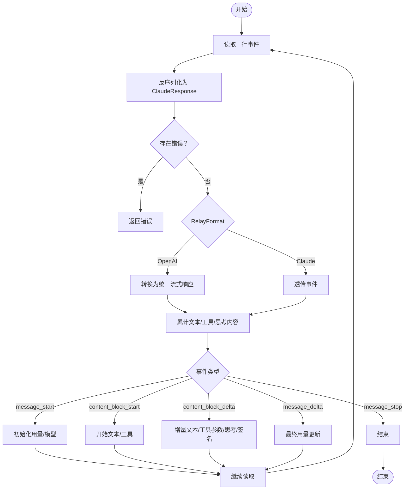

# Claude 适配器

<cite>
**本文引用的文件**
- [adaptor.go](file://relay/channel/claude/adaptor.go)
- [relay-claude.go](file://relay/channel/claude/relay-claude.go)
- [constants.go](file://relay/channel/claude/constants.go)
- [claude_handler.go](file://relay/claude_handler.go)
- [adapter.go](file://relay/channel/adapter.go)
- [claude.go](file://dto/claude.go)
- [claude.go](file://setting/model_setting/claude.go)
- [error.go](file://types/error.go)
- [common.go](file://relay/helper/common.go)
</cite>

## 目录
1. [简介](#简介)
2. [项目结构](#项目结构)
3. [核心组件](#核心组件)
4. [架构总览](#架构总览)
5. [详细组件分析](#详细组件分析)
6. [依赖关系分析](#依赖关系分析)
7. [性能考量](#性能考量)
8. [故障排查指南](#故障排查指南)
9. [结论](#结论)
10. [附录](#附录)

## 简介
本文件系统化阐述 Claude 适配器的设计与实现，聚焦以下关键点：
- 在 adaptor.go 中如何识别 Claude 请求模式（completion 与 message），并设置请求 URL 与请求头。
- 在 relay-claude.go 中实现的请求转换（OpenAI → Claude）、流式事件解析与非流式响应解析。
- 将 Claude 的事件流（event-stream）转换为统一 API 的兼容格式，包括流式分片与最终用量汇总。
- 对比 Claude 与 OpenAI 在消息格式、token 计算与错误处理上的差异及适配策略。
- 提供实际请求转换示例路径与调试技巧、性能优化建议。

## 项目结构
Claude 适配器位于通道层，负责将统一的 OpenAI 风格请求转换为 Claude API 所需格式，并在返回时进行统一格式化与用量统计。

图表来源
- [adaptor.go](file://relay/channel/claude/adaptor.go#L1-L134)
- [relay-claude.go](file://relay/channel/claude/relay-claude.go#L1-L200)
- [constants.go](file://relay/channel/claude/constants.go#L1-L30)
- [adapter.go](file://relay/channel/adapter.go#L1-L58)
- [claude_handler.go](file://relay/claude_handler.go#L1-L167)
- [claude.go](file://dto/claude.go#L1-L120)
- [error.go](file://types/error.go#L1-L120)
- [common.go](file://relay/helper/common.go#L57-L97)
- [claude.go](file://setting/model_setting/claude.go#L1-L76)

章节来源
- [adaptor.go](file://relay/channel/claude/adaptor.go#L1-L134)
- [relay-claude.go](file://relay/channel/claude/relay-claude.go#L1-L200)
- [constants.go](file://relay/channel/claude/constants.go#L1-L30)
- [adapter.go](file://relay/channel/adapter.go#L1-L58)
- [claude_handler.go](file://relay/claude_handler.go#L1-L167)
- [claude.go](file://dto/claude.go#L1-L120)
- [error.go](file://types/error.go#L1-L120)
- [common.go](file://relay/helper/common.go#L57-L97)
- [claude.go](file://setting/model_setting/claude.go#L1-L76)

## 核心组件
- 适配器 Adaptor：负责请求模式识别、URL 构造、请求头设置、请求转换与响应处理。
- Claude 请求转换器：将 OpenAI 风格请求映射到 Claude 的 Prompt/Messages、StopSequences、TopK/TopP/Temperature、Thinking、工具与 WebSearch 等。
- 流式处理器：将 Claude 的 event-stream 分片转换为统一的流式响应，并在结束时补充用量。
- 非流式处理器：直接解析单次响应，提取用量并按格式返回。
- 错误处理：统一将上游错误包装为 Claude 错误或 OpenAI 风格错误。

章节来源
- [adaptor.go](file://relay/channel/claude/adaptor.go#L1-L134)
- [relay-claude.go](file://relay/channel/claude/relay-claude.go#L1-L200)
- [claude.go](file://dto/claude.go#L1-L120)
- [error.go](file://types/error.go#L120-L220)

## 架构总览
下图展示从统一入口到 Claude 适配器再到上游 API 的整体流程，以及流式与非流式的分支处理。

图表来源
- [claude_handler.go](file://relay/claude_handler.go#L1-L167)
- [adaptor.go](file://relay/channel/claude/adaptor.go#L1-L134)
- [relay-claude.go](file://relay/channel/claude/relay-claude.go#L635-L790)
- [common.go](file://relay/helper/common.go#L57-L97)

## 详细组件分析

### 适配器初始化与请求模式识别（adaptor.go）
- 请求模式识别
  - 基于上游模型名前缀判断：claude-2 或 claude-instant 使用 completion 模式；否则使用 message 模式。
  - completion 模式对应 v1/complete；message 模式对应 v1/messages。
  - 支持通过查询参数启用 beta 接口。
- 请求头设置
  - 固定 x-api-key。
  - anthropic-version 默认 2023-06-01，可由客户端覆盖。
  - 透传 anthropic-beta 头部。
  - 应用模型级自定义头部（来自模型设置）。
- 请求转换
  - ConvertOpenAIRequest：根据模式选择 OpenAI → Claude 的转换函数。
  - ConvertClaudeRequest：直接透传（当通道设置允许直通时）。
- 响应处理
  - DoResponse：根据是否流式选择 ClaudeStreamHandler 或 ClaudeHandler。
  - GetModelList/GetChannelName：提供模型清单与通道标识。

章节来源
- [adaptor.go](file://relay/channel/claude/adaptor.go#L1-L134)
- [constants.go](file://relay/channel/claude/constants.go#L1-L30)

### 请求转换：OpenAI → Claude（relay-claude.go）
- Completion 模式转换
  - 将 OpenAI 的 messages 拼接为 Claude 的 Prompt，角色映射为 Human/Assistant，并追加 Assistant: 前缀。
  - 温度、TopP、TopK、停止序列、采样上限等参数映射。
- Message 模式转换
  - Tools → Claude 工具定义（名称、描述、输入模式）。
  - WebSearch 工具：将用户位置信息与搜索上下文大小映射为 max_uses。
  - ToolChoice 与 parallel_tool_calls：映射为 Claude 的 tool_choice 结构。
  - ReasoningEffort 与 reasoning 参数：映射为 Thinking 配置（预算令牌）。
  - Stop → StopSequences（字符串或数组）。
  - Messages 规范化：
    - 角色为空时默认 user。
    - 连续相同角色的文本合并。
    - tool 消息与 user 消息合并为媒体块（tool_result）。
    - 文本内容与多模态内容（图片）分别处理，必要时将 URL 转为 base64。
  - System 消息：以数组形式累积，支持文本与媒体混合。
- 思考模式（Thinking）
  - 当模型后缀带 -thinking 或显式指定 reasoning，启用 Thinking 并设置预算令牌比例。
  - 为避免 TopP/温度影响，可能调整为固定值。
  - 可选择去除后缀以保持下游模型名一致。

章节来源
- [relay-claude.go](file://relay/channel/claude/relay-claude.go#L44-L232)
- [relay-claude.go](file://relay/channel/claude/relay-claude.go#L233-L416)
- [claude.go](file://dto/claude.go#L192-L215)
- [claude.go](file://dto/claude.go#L411-L422)

### 流式响应处理（event-stream）与统一格式兼容
- 流式事件解析
  - 使用 StreamScannerHandler 逐条读取事件行。
  - 每条事件反序列化为 ClaudeResponse，检测错误并提前返回。
  - RelayFormat 为 Claude 时，直接透传事件；为 OpenAI 时，将事件转换为统一的流式响应对象。
- 事件类型映射
  - message_start：记录消息 ID、模型、初始用量。
  - content_block_start：开始文本或工具调用。
  - content_block_delta：增量文本、工具参数增量、思考内容、签名内容。
  - message_delta：最终用量更新、结束原因。
  - message_stop：结束标记。
- 统一格式输出
  - 将 Claude 的 delta 内容映射为统一的 choices.delta。
  - 工具调用以统一格式返回。
  - 最终用量在流结束后生成并附加。
- SSE 输出
  - helper.ClaudeChunkData 以 SSE 事件格式输出原始事件或转换后的对象。

图表来源
- [relay-claude.go](file://relay/channel/claude/relay-claude.go#L635-L790)
- [common.go](file://relay/helper/common.go#L57-L97)

章节来源
- [relay-claude.go](file://relay/channel/claude/relay-claude.go#L635-L790)
- [common.go](file://relay/helper/common.go#L57-L97)

### 非流式响应处理与用量统计
- 非流式场景
  - 读取完整响应体，反序列化为 ClaudeResponse。
  - completion 模式：基于完成文本估算用量。
  - message 模式：直接使用上游返回的用量（输入/输出/缓存）。
  - RelayFormat 为 OpenAI 时，将 Claude 响应转换为统一 OpenAI 风格对象并附带用量。
- WebSearch 请求计数
  - 若上游返回 server_tool_use.web_search_requests，将其写入上下文以便后续统计。

章节来源
- [relay-claude.go](file://relay/channel/claude/relay-claude.go#L727-L790)

### 错误处理与状态码映射
- 错误提取
  - ClaudeResponse.GetClaudeError 支持多种错误结构（结构体、指针、map、字符串），统一提取为 types.ClaudeError。
- 错误包装
  - WithClaudeError 将 Claude 错误包装为 NewAPIError，便于上层统一处理。
- 状态码映射
  - relay/claude_handler.go 会根据上游状态码进行错误处理与状态码重映射。

章节来源
- [claude.go](file://dto/claude.go#L479-L513)
- [error.go](file://types/error.go#L302-L317)
- [claude_handler.go](file://relay/claude_handler.go#L138-L166)

### 消息格式、Token 计算与错误处理差异对比
- 消息格式
  - OpenAI：messages 数组，role + content（文本/工具调用/多模态）。
  - Claude：completion 模式使用 Prompt；message 模式使用 messages 数组，content 支持文本、图像、tool_use、tool_result、thinking 等类型。
- Token 计算
  - OpenAI：统一的 tokenizer 估算。
  - Claude：ClaudeRequest.GetTokenCountMeta 会聚合 system、messages、tools 等内容，支持图片 base64/URL 的文件元数据提取，用于更精确的 token 估算。
- 错误处理
  - OpenAI：统一的 OpenAIError。
  - Claude：ClaudeError，适配器将其包装为 NewAPIError，便于统一对外呈现。

章节来源
- [claude.go](file://dto/claude.go#L217-L334)
- [error.go](file://types/error.go#L120-L220)

### 实际请求转换示例（路径指引）
- OpenAI → Completion（Prompt）转换
  - 路径：[RequestOpenAI2ClaudeComplete](file://relay/channel/claude/relay-claude.go#L44-L73)
- OpenAI → Message（Messages/Tools/WebSearch/Thinking）转换
  - 路径：[RequestOpenAI2ClaudeMessage](file://relay/channel/claude/relay-claude.go#L75-L416)
- 流式事件转换
  - 路径：[StreamResponseClaude2OpenAI](file://relay/channel/claude/relay-claude.go#L418-L504)
- 非流式响应转换
  - 路径：[ResponseClaude2OpenAI](file://relay/channel/claude/relay-claude.go#L506-L578)

章节来源
- [relay-claude.go](file://relay/channel/claude/relay-claude.go#L44-L578)

### Claude 特殊限制与适配策略
- 内容策略错误（如 1104）
  - 代码中未直接出现 1104 的硬编码处理，但 Claude 错误会被统一提取并包装为 NewAPIError，上层可根据错误类型进行重试或降级。
  - 建议：在上层路由中针对特定错误类型（如“内容策略”类）进行状态码映射与重试策略控制。
- WebSearch 工具
  - 支持 user_location 与 search_context_size → max_uses 映射，便于控制搜索强度。
- 思考模式（Thinking）
  - 自动设置预算令牌比例，必要时调整 TopP/温度，确保推理稳定性。
- 默认 MaxTokens
  - 通过模型设置获取默认值，避免空缺导致的超限或截断。

章节来源
- [relay-claude.go](file://relay/channel/claude/relay-claude.go#L100-L232)
- [claude.go](file://setting/model_setting/claude.go#L1-L76)

## 依赖关系分析
- 适配器依赖
  - DTO：ClaudeRequest/ClaudeResponse/ClaudeUsage 等。
  - 类型：types.NewAPIError/ClaudeError。
  - 辅助：helper.StreamScannerHandler、helper.ClaudeChunkData。
  - 模型设置：默认 MaxTokens、头部透传。
- 关键耦合点
  - ConvertOpenAIRequest 与具体转换函数的耦合。
  - DoResponse 对流式与非流式的分流。
  - 错误提取与包装的集中处理。

图表来源
- [adaptor.go](file://relay/channel/claude/adaptor.go#L1-L134)
- [relay-claude.go](file://relay/channel/claude/relay-claude.go#L1-L200)
- [claude.go](file://dto/claude.go#L1-L120)
- [error.go](file://types/error.go#L1-L120)
- [common.go](file://relay/helper/common.go#L57-L97)
- [claude.go](file://setting/model_setting/claude.go#L1-L76)

章节来源
- [adaptor.go](file://relay/channel/claude/adaptor.go#L1-L134)
- [relay-claude.go](file://relay/channel/claude/relay-claude.go#L1-L200)
- [claude.go](file://dto/claude.go#L1-L120)
- [error.go](file://types/error.go#L1-L120)
- [common.go](file://relay/helper/common.go#L57-L97)
- [claude.go](file://setting/model_setting/claude.go#L1-L76)

## 性能考量
- 流式传输
  - 使用 StreamScannerHandler 逐行解析，避免一次性加载大响应体，降低内存峰值。
  - SSE 输出采用增量事件，减少缓冲区压力。
- 图像处理
  - URL 图片转 base64 时注意网络开销与 MIME 类型推断，建议在上游缓存或预处理。
- Token 估算
  - ClaudeRequest.GetTokenCountMeta 聚合多模态内容，有助于更准确的配额与用量计算。
- 默认 MaxTokens
  - 通过模型设置统一默认值，避免频繁触发截断或超限。

[本节为通用指导，无需源码引用]

## 故障排查指南
- 常见问题定位
  - 事件解析失败：检查每行事件是否为合法 JSON；查看 HandleStreamResponseData 的错误日志。
  - 错误事件：优先检查 ClaudeResponse.GetClaudeError 是否被正确提取。
  - 非流式响应：确认上游返回体是否完整，避免用量统计缺失。
- 调试技巧
  - 启用 Debug 日志，观察请求体与响应体打印。
  - 使用 SSE Viewer 查看事件流，确认 message_start/content_block_* 的顺序与完整性。
  - 检查 RelayFormat 是否符合预期（Claude vs OpenAI）。
- 重试与降级
  - 对于内容策略类错误，可在上层路由中进行状态码映射与重试策略控制。

章节来源
- [relay-claude.go](file://relay/channel/claude/relay-claude.go#L635-L790)
- [claude_handler.go](file://relay/claude_handler.go#L138-L166)

## 结论
Claude 适配器通过清晰的模式识别、完善的请求转换与稳健的流式/非流式处理，实现了与统一 API 的无缝对接。其对 Claude 特有概念（如 Thinking、WebSearch、多模态消息）的适配，以及对错误与用量的统一处理，使得上层应用无需关心底层差异即可稳定调用。

[本节为总结性内容，无需源码引用]

## 附录
- 模型清单与通道名
  - 模型列表与通道名定义见 constants.go。
- 通道适配器接口
  - 适配器需实现的接口方法定义见 adapter.go。
- 统一处理入口
  - relay/claude_handler.go 负责初始化、参数覆盖、请求体构造与响应处理。

章节来源
- [constants.go](file://relay/channel/claude/constants.go#L1-L30)
- [adapter.go](file://relay/channel/adapter.go#L1-L58)
- [claude_handler.go](file://relay/claude_handler.go#L1-L167)