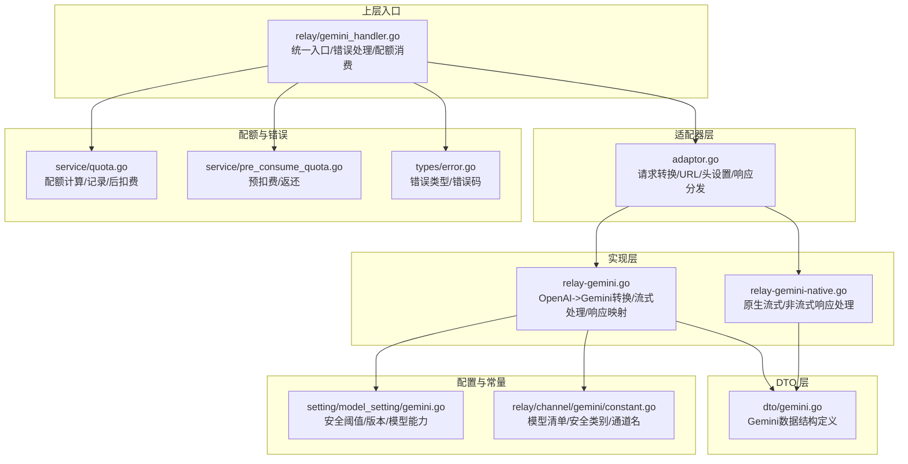
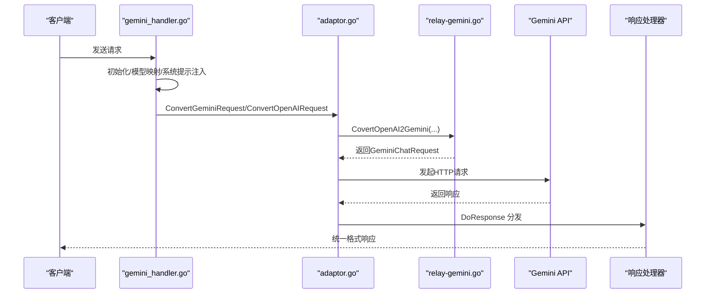
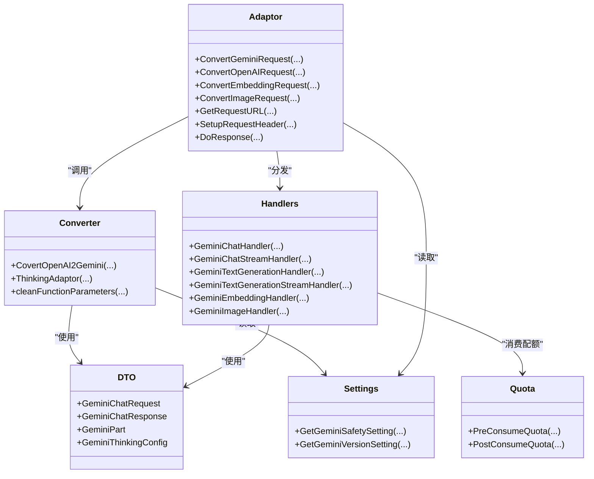

# Gemini 适配器

<cite>
**本文引用的文件列表**
- [adaptor.go](file://relay/channel/gemini/adaptor.go)
- [relay-gemini.go](file://relay/channel/gemini/relay-gemini.go)
- [relay-gemini-native.go](file://relay/channel/gemini/relay-gemini-native.go)
- [gemini.go](file://dto/gemini.go)
- [gemini_handler.go](file://relay/gemini_handler.go)
- [constant.go](file://relay/channel/gemini/constant.go)
- [gemini.go](file://setting/model_setting/gemini.go)
- [quota.go](file://service/quota.go)
- [pre_consume_quota.go](file://service/pre_consume_quota.go)
- [error.go](file://types/error.go)
</cite>

## 目录
1. [简介](#简介)
2. [项目结构](#项目结构)
3. [核心组件](#核心组件)
4. [架构总览](#架构总览)
5. [详细组件分析](#详细组件分析)
6. [依赖关系分析](#依赖关系分析)
7. [性能考量](#性能考量)
8. [故障排查指南](#故障排查指南)
9. [结论](#结论)

## 简介
本文件面向希望理解并使用本仓库中 Gemini 适配器的开发者，系统性解析其架构与实现细节，重点覆盖：
- 如何将 OpenAI/Claude 风格的请求转换为 Google AI Gemini API 的请求格式，包括多轮对话、工具调用、系统指令、多媒体输入等。
- 安全设置传递策略与思考预算（Thinking Budget）适配。
- 流式与非流式响应处理，以及原生流式与通用流式的差异。
- 将 Gemini 的 content/part 结构映射到统一 API 格式（OpenAI/Claude）。
- 特定错误码与配额限制的处理方式。
- 实际代码示例路径，展示图片输入、系统指令等高级功能的适配方法，并对比与 OpenAI/Claude 在消息结构上的差异。

## 项目结构
Gemini 适配器位于 relay/channel/gemini 目录，配合 DTO、处理器与通道层共同完成请求转换与响应处理。

图表来源
- [adaptor.go](file://relay/channel/gemini/adaptor.go#L1-L285)
- [relay-gemini.go](file://relay/channel/gemini/relay-gemini.go#L1-L1370)
- [relay-gemini-native.go](file://relay/channel/gemini/relay-gemini-native.go#L1-L106)
- [gemini.go](file://dto/gemini.go#L1-L464)
- [gemini_handler.go](file://relay/gemini_handler.go#L1-L298)
- [constant.go](file://relay/channel/gemini/constant.go#L1-L39)
- [gemini.go](file://setting/model_setting/gemini.go#L43-L71)
- [quota.go](file://service/quota.go#L1-L400)
- [pre_consume_quota.go](file://service/pre_consume_quota.go#L1-L45)
- [error.go](file://types/error.go#L78-L138)

章节来源
- [adaptor.go](file://relay/channel/gemini/adaptor.go#L1-L285)
- [relay-gemini.go](file://relay/channel/gemini/relay-gemini.go#L1-L1370)
- [relay-gemini-native.go](file://relay/channel/gemini/relay-gemini-native.go#L1-L106)
- [gemini.go](file://dto/gemini.go#L1-L464)
- [gemini_handler.go](file://relay/gemini_handler.go#L1-L298)
- [constant.go](file://relay/channel/gemini/constant.go#L1-L39)
- [gemini.go](file://setting/model_setting/gemini.go#L43-L71)
- [quota.go](file://service/quota.go#L1-L400)
- [pre_consume_quota.go](file://service/pre_consume_quota.go#L1-L45)
- [error.go](file://types/error.go#L78-L138)

## 核心组件
- 适配器 Adaptor：负责请求 URL 构造、请求头设置、OpenAI/Claude/Gemini 请求转换、嵌入/图像生成转换、响应分发。
- OpenAI->Gemini 转换器：将 OpenAI/Claude 风格的消息、工具、参数映射到 Gemini 的 content/part 结构，并注入安全设置、思考预算、响应格式约束等。
- 原生流式与通用流式处理器：分别处理通用模式下的流式与原生 SSE 模式下的流式。
- DTO：定义 Gemini 请求/响应结构、工具、思考配置、图像/嵌入等数据模型。
- 统一入口处理器：负责模型映射、系统提示注入、参数覆盖、错误处理与配额消费。
- 配置与常量：安全阈值、版本设置、模型清单、通道名等。

章节来源
- [adaptor.go](file://relay/channel/gemini/adaptor.go#L1-L285)
- [relay-gemini.go](file://relay/channel/gemini/relay-gemini.go#L199-L627)
- [gemini.go](file://dto/gemini.go#L1-L464)
- [gemini_handler.go](file://relay/gemini_handler.go#L55-L198)

## 架构总览
下图展示了从客户端请求到上游 Gemini API，再到统一响应格式的关键流程。

图表来源
- [gemini_handler.go](file://relay/gemini_handler.go#L55-L198)
- [adaptor.go](file://relay/channel/gemini/adaptor.go#L171-L275)
- [relay-gemini.go](file://relay/channel/gemini/relay-gemini.go#L199-L627)

章节来源
- [gemini_handler.go](file://relay/gemini_handler.go#L55-L198)
- [adaptor.go](file://relay/channel/gemini/adaptor.go#L171-L275)
- [relay-gemini.go](file://relay/channel/gemini/relay-gemini.go#L199-L627)

## 详细组件分析

### 适配器 Adaptor（adaptor.go）
- 请求 URL 与头部
  - GetRequestURL：根据模型前缀选择不同端点（文本生成、嵌入、图像），并根据是否流式选择不同的 action（generateContent/streamGenerateContent?alt=sse）。
  - SetupRequestHeader：设置 x-goog-api-key。
- 请求转换
  - ConvertOpenAIRequest：委托 CovertOpenAI2Gemini 完成 OpenAI->Gemini 的转换。
  - ConvertClaudeRequest：先转换为 OpenAI 再转 Gemini。
  - ConvertEmbeddingRequest：批量构建嵌入请求，自动启用 batchEmbedContents。
  - ConvertImageRequest：将 OpenAI 风格的图像生成参数映射到 Gemini Imagen 参数（尺寸、比例、质量）。
  - ConvertGeminiRequest：对首条内容的角色进行默认化，对 YouTube 视频 URI 推断 MimeType。
- 响应分发
  - DoResponse：根据 RelayMode、是否流式、是否嵌入/图像等分支，调用对应处理器（文本/流式/嵌入/图像）。

章节来源
- [adaptor.go](file://relay/channel/gemini/adaptor.go#L128-L275)

### OpenAI->Gemini 转换器（relay-gemini.go）
- 思考预算与思考适配
  - ThinkingAdaptor：根据模型后缀（-thinking/-thinking-<budget>/-nothinking）与配置，设置 ThinkingConfig（includeThoughts、thinkingBudget、thinkingLevel），并对预算进行范围钳制。
  - clampThinkingBudget/clampThinkingBudgetByEffort：对预算进行上下限校准。
- 安全设置传递
  - 从配置读取各安全类别的阈值，组装 SafetySettings。
- 工具与函数参数清理
  - 清理不被 Gemini 支持的 JSON Schema 字段，确保参数兼容。
- 多模态与系统指令
  - 多模态：支持 Markdown 图片、URL 图片、Base64 图片、文件、输入音频；对不支持的 MimeType 抛错；限制最大图片数。
  - 系统指令：将 system 消息合并为 SystemInstructions。
  - 函数调用：将 tool_calls 映射为 Gemini FunctionCall；必要时附加 thoughtSignature。
  - 响应格式：当 response_format 为 json_object/json_schema 时，设置 responseMimeType 与 responseSchema。
- 响应映射
  - 文本/流式：将 Gemini 候选内容映射为 OpenAI 风格的 choices/delta，处理工具调用、思考内容、可执行代码块等。
  - 嵌入/图像：将 Gemini 原生响应转换为 OpenAI 风格的嵌入/图像响应。

章节来源
- [relay-gemini.go](file://relay/channel/gemini/relay-gemini.go#L133-L197)
- [relay-gemini.go](file://relay/channel/gemini/relay-gemini.go#L199-L627)
- [relay-gemini.go](file://relay/channel/gemini/relay-gemini.go#L651-L1370)

### 原生流式与通用流式处理器（relay-gemini-native.go 与 relay-gemini.go）
- 原生流式（SSE）
  - GeminiTextGenerationStreamHandler：设置事件流头，直接透传原始数据片段。
- 通用流式
  - GeminiChatStreamHandler：逐帧解析 Gemini 候选，映射为 OpenAI 风格的 chunk，处理首次空 delta、工具调用、停止条件等。
  - geminiStreamHandler：扫描 SSE 数据，统计图片数量与 token，更新 usage 并回调处理。

章节来源
- [relay-gemini-native.go](file://relay/channel/gemini/relay-gemini-native.go#L1-L106)
- [relay-gemini.go](file://relay/channel/gemini/relay-gemini.go#L1054-L1205)

### DTO（dto/gemini.go）
- 请求结构
  - GeminiChatRequest：包含 contents、generationConfig、tools、toolConfig、systemInstruction、cachedContent 等。
  - GeminiChatContent/GeminiPart：content.parts 的细粒度结构，支持 text、inlineData、functionCall、thought、thoughtSignature、fileData、executableCode、codeExecutionResult 等。
  - GeminiThinkingConfig：支持 snake_case/camelCase 双形态字段。
- 响应结构
  - GeminiChatResponse/GeminiUsageMetadata：包含候选、思考/候选 token 细分、模态明细等。
  - 图像/嵌入：Imagem/GeminiEmbeddingResponse/BatchEmbeddingResponse 等。

章节来源
- [gemini.go](file://dto/gemini.go#L1-L464)

### 统一入口与错误处理（gemini_handler.go）
- 入口流程
  - 初始化/模型映射/系统提示注入（支持覆盖）。
  - 请求体可选择透传或转换（ConvertGeminiRequest/ConvertOpenAIRequest）。
  - 发起请求并处理状态码映射。
  - DoResponse 分发到具体处理器。
  - postConsumeQuota 后扣费。
- 错误处理
  - RelayErrorHandler：根据上游状态码生成统一错误。
  - ResetStatusCode：根据配置重定向状态码。

章节来源
- [gemini_handler.go](file://relay/gemini_handler.go#L55-L198)
- [gemini_handler.go](file://relay/gemini_handler.go#L200-L298)

### 配置与常量（setting/model_setting/gemini.go、constant.go）
- 安全阈值与版本设置：从配置读取安全阈值与 API 版本。
- 模型清单与通道名：列出受支持的模型、安全类别、通道名。

章节来源
- [gemini.go](file://setting/model_setting/gemini.go#L43-L71)
- [constant.go](file://relay/channel/gemini/constant.go#L1-L39)

### 配额与错误类型（service/quota.go、service/pre_consume_quota.go、types/error.go）
- 预扣费与后扣费：PreConsumeQuota/PostConsumeQuota，支持实时流式场景。
- 配额计算：按文本/音频 token、模型倍率、分组倍率等计算。
- 错误类型：ErrorCodeInsufficientUserQuota、ErrorCodePreConsumeTokenQuotaFailed 等。

章节来源
- [quota.go](file://service/quota.go#L1-L400)
- [pre_consume_quota.go](file://service/pre_consume_quota.go#L1-L45)
- [error.go](file://types/error.go#L78-L138)

## 依赖关系分析

图表来源
- [adaptor.go](file://relay/channel/gemini/adaptor.go#L171-L275)
- [relay-gemini.go](file://relay/channel/gemini/relay-gemini.go#L199-L1370)
- [gemini.go](file://dto/gemini.go#L1-L464)
- [gemini.go](file://setting/model_setting/gemini.go#L43-L71)
- [quota.go](file://service/quota.go#L1-L400)

章节来源
- [adaptor.go](file://relay/channel/gemini/adaptor.go#L171-L275)
- [relay-gemini.go](file://relay/channel/gemini/relay-gemini.go#L199-L1370)
- [gemini.go](file://dto/gemini.go#L1-L464)
- [gemini.go](file://setting/model_setting/gemini.go#L43-L71)
- [quota.go](file://service/quota.go#L1-L400)

## 性能考量
- 多模态输入的 MIME 类型校验与 Base64 解码会带来额外开销，建议在前端尽量使用合适的媒体格式与尺寸。
- 流式处理中，逐帧解析与映射会增加 CPU 开销；对于长文本与多工具调用场景，建议合理设置 max_tokens 与工具参数以控制输出长度。
- 嵌入与图像生成的 token 计算采用估算或固定值，实际计费以上游为准。

[本节为通用指导，无需特定文件引用]

## 故障排查指南
- 常见错误与处理
  - 额度不足：PreConsumeQuota/PostConsumeQuota 返回 ErrorCodeInsufficientUserQuota，需检查用户/令牌剩余额度。
  - 请求体转换失败：ConvertOpenAIRequest/ConvertGeminiRequest 返回错误，检查 extra_body/google 子段命名（如 thinkingConfig/thinkingBudget 应为 snake_case）。
  - 多媒体输入不支持：MIME 类型不在白名单内或超出最大图片数，抛出错误并附带支持列表。
  - 响应为空：Candidates 为空时，统一入口注释了可选的 PromptFeedback BlockReason 处理。
- 状态码映射
  - 统一入口通过 RelayErrorHandler 与 ResetStatusCode 将上游状态码映射为统一错误。
- 日志与调试
  - DebugEnabled 下打印原始响应体，便于定位上游异常。

章节来源
- [pre_consume_quota.go](file://service/pre_consume_quota.go#L1-L45)
- [quota.go](file://service/quota.go#L1-L400)
- [gemini_handler.go](file://relay/gemini_handler.go#L170-L198)
- [relay-gemini.go](file://relay/channel/gemini/relay-gemini.go#L651-L771)

## 结论
本适配器通过清晰的分层设计，将 OpenAI/Claude 风格的请求高效转换为 Gemini API 所需的 content/part 结构，同时在安全设置、思考预算、多模态输入、工具调用与响应格式等方面提供了完善的适配。流式与非流式处理分别满足通用与原生场景的需求，并通过统一入口完成错误处理与配额消费。对于生产环境，建议结合配置项与日志进行监控与优化。

[本节为总结，无需特定文件引用]

## 附：关键流程与示例路径

### 多轮对话格式转换与系统指令
- OpenAI Messages -> Gemini Contents
  - 系统指令：system 消息合并为 SystemInstructions。
  - 工具调用：tool_calls 映射为 FunctionCall，必要时附加 thoughtSignature。
  - 多模态：text/image_url/file/input_audio 统一映射为 Parts。
- 示例路径
  - [CovertOpenAI2Gemini(...)](file://relay/channel/gemini/relay-gemini.go#L199-L627)
  - [responseGeminiChat2OpenAI(...)](file://relay/channel/gemini/relay-gemini.go#L905-L979)
  - [streamResponseGeminiChat2OpenAI(...)](file://relay/channel/gemini/relay-gemini.go#L981-L1052)

章节来源
- [relay-gemini.go](file://relay/channel/gemini/relay-gemini.go#L199-L627)
- [relay-gemini.go](file://relay/channel/gemini/relay-gemini.go#L905-L1052)

### 安全设置传递
- 从配置读取各安全类别阈值，组装 SafetySettings。
- 示例路径
  - [CovertOpenAI2Gemini(...) 中的安全设置组装](file://relay/channel/gemini/relay-gemini.go#L294-L306)
  - [GetGeminiSafetySetting(...)](file://setting/model_setting/gemini.go#L49-L54)

章节来源
- [relay-gemini.go](file://relay/channel/gemini/relay-gemini.go#L294-L306)
- [gemini.go](file://setting/model_setting/gemini.go#L49-L54)

### 流式响应处理（通用 vs 原生）
- 通用流式：GeminiChatStreamHandler，逐帧映射为 OpenAI 风格 chunk。
- 原生流式：GeminiTextGenerationStreamHandler，透传原始 SSE 数据。
- 示例路径
  - [GeminiChatStreamHandler(...)](file://relay/channel/gemini/relay-gemini.go#L1141-L1205)
  - [geminiStreamHandler(...)](file://relay/channel/gemini/relay-gemini.go#L1075-L1139)
  - [GeminiTextGenerationStreamHandler(...)](file://relay/channel/gemini/relay-gemini-native.go#L93-L105)

章节来源
- [relay-gemini.go](file://relay/channel/gemini/relay-gemini.go#L1075-L1205)
- [relay-gemini-native.go](file://relay/channel/gemini/relay-gemini-native.go#L93-L105)

### 将 Gemini content/part 映射到统一 API
- 文本/流式：将 candidates.parts 映射为 choices/delta，处理工具调用、思考内容、可执行代码块。
- 嵌入/图像：将原生响应转换为 OpenAI 风格的嵌入/图像响应。
- 示例路径
  - [responseGeminiChat2OpenAI(...)](file://relay/channel/gemini/relay-gemini.go#L905-L979)
  - [GeminiEmbeddingHandler(...)](file://relay/channel/gemini/relay-gemini.go#L1272-L1315)
  - [GeminiImageHandler(...)](file://relay/channel/gemini/relay-gemini.go#L1317-L1369)

章节来源
- [relay-gemini.go](file://relay/channel/gemini/relay-gemini.go#L905-L1369)

### 特定错误码与配额限制
- 400/403/429 等上游错误由 RelayErrorHandler 统一处理，随后通过 ResetStatusCode 映射。
- 额度不足：PreConsumeQuota 返回 ErrorCodeInsufficientUserQuota。
- 示例路径
  - [RelayErrorHandler/ResetStatusCode 使用](file://relay/gemini_handler.go#L170-L198)
  - [PreConsumeQuota(...)](file://service/pre_consume_quota.go#L1-L45)
  - [ErrorCode 定义](file://types/error.go#L78-L138)

章节来源
- [gemini_handler.go](file://relay/gemini_handler.go#L170-L198)
- [pre_consume_quota.go](file://service/pre_consume_quota.go#L1-L45)
- [error.go](file://types/error.go#L78-L138)

### 高级功能示例路径（图片输入、系统指令等）
- 图片输入（Markdown/URL/Base64）
  - [多模态输入处理](file://relay/channel/gemini/relay-gemini.go#L456-L603)
  - [MIME 类型白名单与校验](file://relay/channel/gemini/relay-gemini.go#L27-L45)
- 系统指令
  - [SystemInstructions 注入与合并](file://relay/channel/gemini/relay-gemini.go#L616-L624)
- 思考预算
  - [ThinkingAdaptor 与预算钳制](file://relay/channel/gemini/relay-gemini.go#L133-L197)

章节来源
- [relay-gemini.go](file://relay/channel/gemini/relay-gemini.go#L27-L603)
- [relay-gemini.go](file://relay/channel/gemini/relay-gemini.go#L133-L197)

### 与 OpenAI/Claude 在消息结构上的主要差异
- 角色差异：assistant 在 Gemini 中映射为 model。
- 工具调用：OpenAI 的 tool_calls 映射为 Gemini 的 FunctionCall；Gemini 的 FunctionResponse 用于 tool/tool 调用结果。
- 多模态：OpenAI 的 image_url/file/input_audio 统一映射为 Gemini 的 inlineData 或 fileData。
- 响应格式：Gemini 支持 responseMimeType/responseSchema 控制 JSON 输出；OpenAI 的 response_format 通过 extra_body 传递。
- 思考内容：Gemini 支持 thought 与 thinkingBudget；OpenAI 无此概念。

章节来源
- [relay-gemini.go](file://relay/channel/gemini/relay-gemini.go#L366-L455)
- [gemini.go](file://dto/gemini.go#L212-L281)