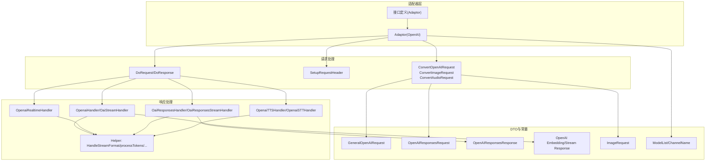
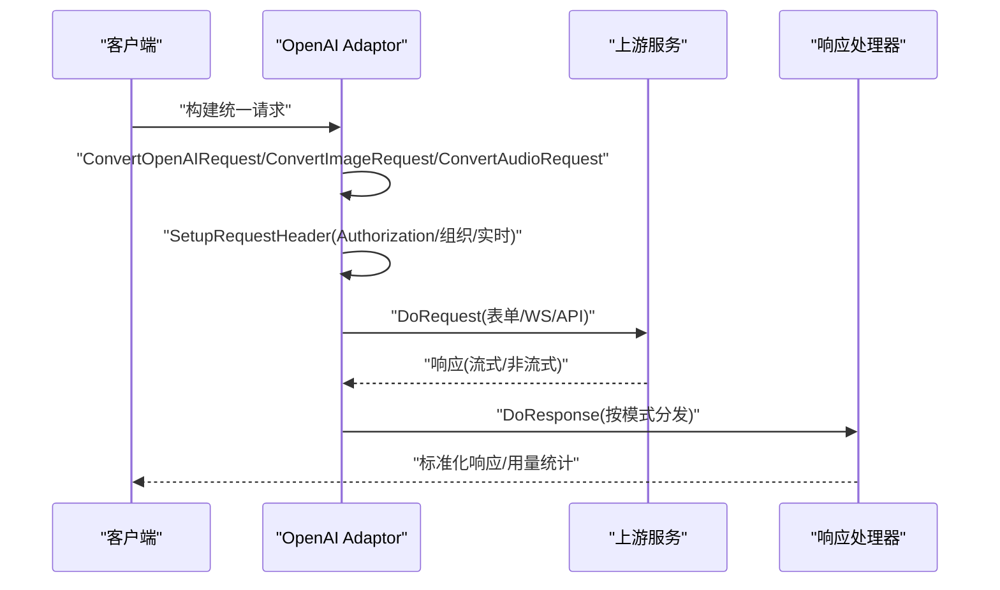
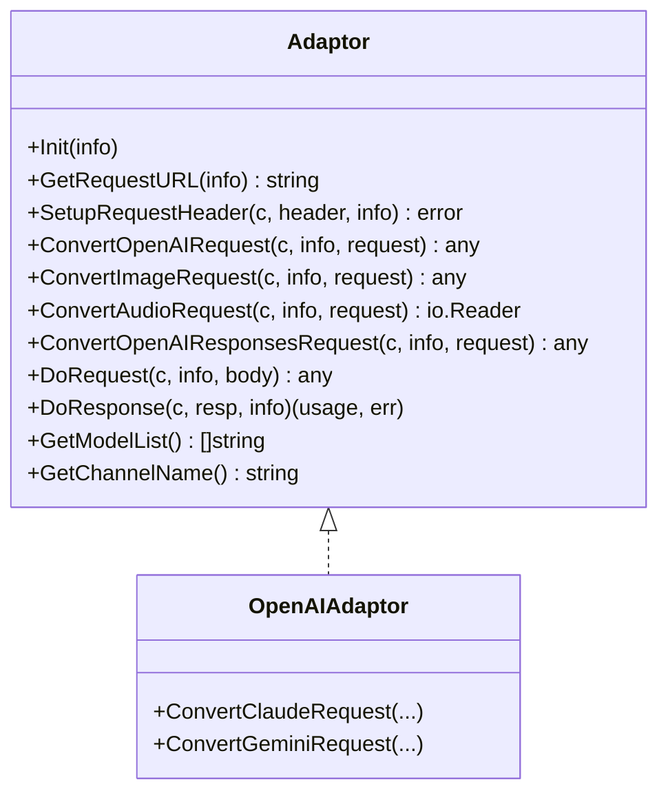
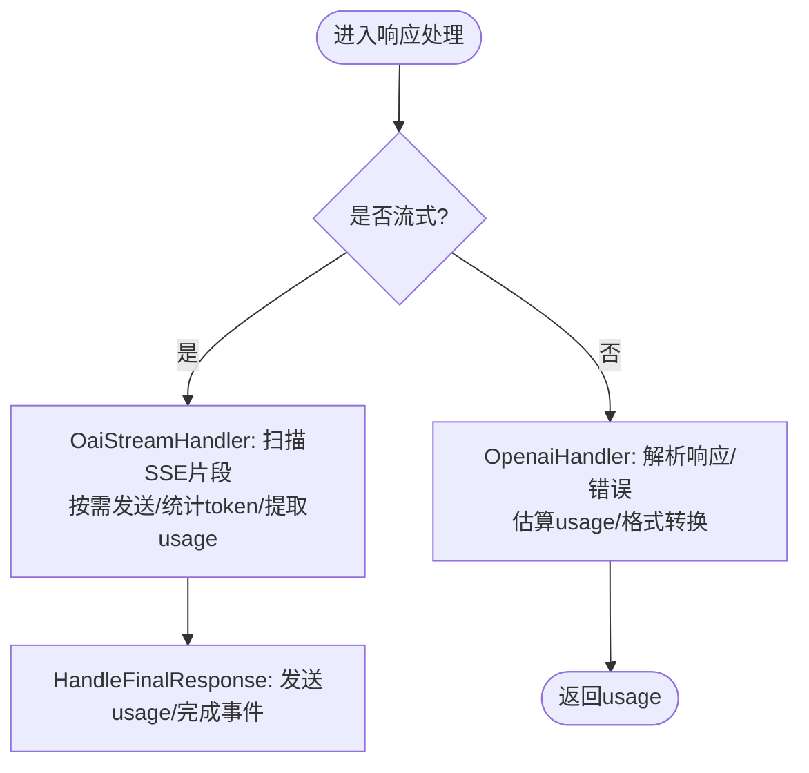
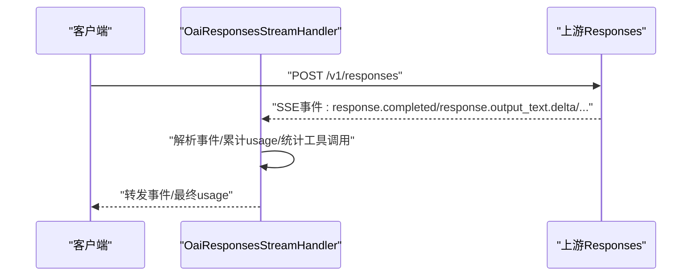
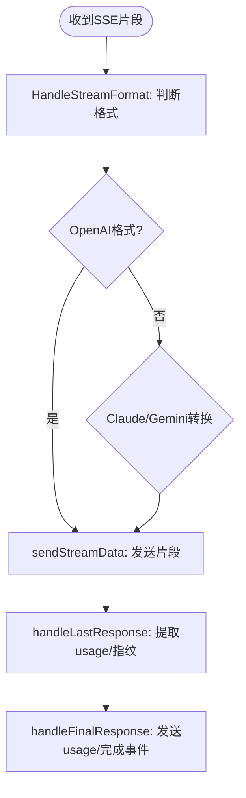
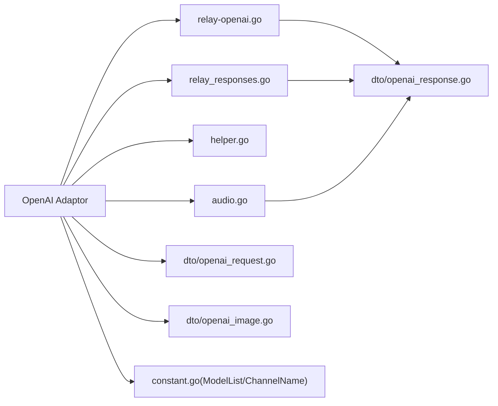

# OpenAI 适配器

<cite>
**本文引用的文件列表**
- [adaptor.go](file://relay/channel/openai/adaptor.go)
- [relay-openai.go](file://relay/channel/openai/relay-openai.go)
- [relay_responses.go](file://relay/channel/openai/relay_responses.go)
- [helper.go](file://relay/channel/openai/helper.go)
- [audio.go](file://relay/channel/openai/audio.go)
- [constant.go](file://relay/channel/openai/constant.go)
- [adapter.go](file://relay/channel/adapter.go)
- [openai_request.go](file://dto/openai_request.go)
- [openai_response.go](file://dto/openai_response.go)
- [openai_image.go](file://dto/openai_image.go)
- [error.go](file://service/error.go)
- [model-rate-limit.go](file://middleware/model-rate-limit.go)
- [relay.go](file://controller/relay.go)
</cite>

## 目录
1. [简介](#简介)
2. [项目结构](#项目结构)
3. [核心组件](#核心组件)
4. [架构总览](#架构总览)
5. [详细组件分析](#详细组件分析)
6. [依赖关系分析](#依赖关系分析)
7. [性能考量](#性能考量)
8. [故障排查指南](#故障排查指南)
9. [结论](#结论)
10. [附录](#附录)

## 简介
本文件系统性解析 OpenAI 适配器的实现机制，围绕以下目标展开：
- 深入分析 adaptor.go 中 Adaptor 接口的 ConvertRequest、ConvertImageRequest、DoRequest 等方法如何将统一 API 请求转换为 OpenAI 特定格式；
- 分析 relay-openai.go 中对文本生成、嵌入、重排序等请求的转发逻辑；
- 解释 relay_responses.go 中对流式与非流式响应的处理方式；
- 说明适配器如何处理 OpenAI 特有的认证头、模型映射、错误码（如 429 限流）、以及流式 SSE 响应；
- 给出与其他适配器的共性与差异；
- 提供性能优化建议与常见集成问题的解决方案。

## 项目结构
OpenAI 适配器位于 relay/channel/openai 目录，主要文件职责如下：
- adaptor.go：实现 Adaptor 接口，负责请求转换、头部设置、请求与响应处理、模型列表与通道名查询等；
- relay-openai.go：处理文本生成、嵌入、重排序、实时对话等场景的响应处理与流式处理；
- relay_responses.go：处理 OpenAI Responses API 的流式与非流式响应；
- helper.go：辅助处理流式响应格式转换、统计 token、发送最终 SSE 结束事件等；
- audio.go：处理 TTS/STT 的响应与用量统计；
- constant.go：内置模型列表与通道名；
- adapter.go：通用适配器接口定义，约束各适配器能力；
- dto/openai_request.go、openai_response.go、openai_image.go：统一请求/响应数据结构；
- service/error.go、middleware/model-rate-limit.go、controller/relay.go：错误包装、限流与重试策略。

图表来源
- [adaptor.go](file://relay/channel/openai/adaptor.go#L1-L651)
- [relay-openai.go](file://relay/channel/openai/relay-openai.go#L1-L642)
- [relay_responses.go](file://relay/channel/openai/relay_responses.go#L1-L151)
- [helper.go](file://relay/channel/openai/helper.go#L1-L262)
- [openai_request.go](file://dto/openai_request.go#L1-L800)
- [openai_response.go](file://dto/openai_response.go#L1-L415)
- [openai_image.go](file://dto/openai_image.go#L1-L179)
- [constant.go](file://relay/channel/openai/constant.go#L1-L48)
- [adapter.go](file://relay/channel/adapter.go#L1-L58)

章节来源
- [adaptor.go](file://relay/channel/openai/adaptor.go#L1-L651)
- [relay-openai.go](file://relay/channel/openai/relay-openai.go#L1-L642)
- [relay_responses.go](file://relay/channel/openai/relay_responses.go#L1-L151)
- [helper.go](file://relay/channel/openai/helper.go#L1-L262)
- [openai_request.go](file://dto/openai_request.go#L1-L800)
- [openai_response.go](file://dto/openai_response.go#L1-L415)
- [openai_image.go](file://dto/openai_image.go#L1-L179)
- [constant.go](file://relay/channel/openai/constant.go#L1-L48)
- [adapter.go](file://relay/channel/adapter.go#L1-L58)

## 核心组件
- Adaptor 接口：定义了适配器的统一能力，包括请求 URL 构造、请求头设置、请求转换、DoRequest/DoResponse、模型列表与通道名等。
- OpenAI Adaptor 实现：在 adaptor.go 中具体实现上述接口，覆盖 OpenAI/Azure/OpenRouter/Gemini/Claude 等上游通道的差异化处理。
- 响应处理器：在 relay-openai.go 与 relay_responses.go 中分别处理文本生成、实时对话、Responses API 的流式与非流式响应。
- 流式辅助：helper.go 提供流式格式转换、token 统计、最终事件发送等能力。
- 音频处理：audio.go 处理 TTS/STT 的响应与用量统计。
- 数据结构：dto 包中的 OpenAI 请求/响应结构，支撑跨适配器的统一转换。

章节来源
- [adapter.go](file://relay/channel/adapter.go#L1-L58)
- [adaptor.go](file://relay/channel/openai/adaptor.go#L1-L651)
- [relay-openai.go](file://relay/channel/openai/relay-openai.go#L1-L642)
- [relay_responses.go](file://relay/channel/openai/relay_responses.go#L1-L151)
- [helper.go](file://relay/channel/openai/helper.go#L1-L262)
- [audio.go](file://relay/channel/openai/audio.go#L1-L146)
- [openai_request.go](file://dto/openai_request.go#L1-L800)
- [openai_response.go](file://dto/openai_response.go#L1-L415)
- [openai_image.go](file://dto/openai_image.go#L1-L179)

## 架构总览
OpenAI 适配器通过统一接口对接不同上游通道，关键流程：
- 请求阶段：ConvertOpenAIRequest/ConvertImageRequest/ConvertAudioRequest 将统一请求转换为 OpenAI/Azure/OpenRouter 等特定格式；SetupRequestHeader 设置 Authorization、组织头、实时协议头等；DoRequest 根据模式选择表单/WS/API 请求。
- 响应阶段：DoResponse 根据 RelayMode 选择对应处理器；文本生成走 OpenaiHandler/OaiStreamHandler；实时对话走 OpenaiRealtimeHandler；Responses API 走 OaiResponsesHandler/OaiResponsesStreamHandler；音频走 OpenaiTTSHandler/OpenaiSTTHandler。
- 流式处理：helper.HandleStreamFormat 将 OpenAI 流式片段转换为指定格式（OpenAI/Claude/Gemini），并统计 token；最终发送完成事件或使用占位 usage。

图表来源
- [adaptor.go](file://relay/channel/openai/adaptor.go#L181-L214)
- [adaptor.go](file://relay/channel/openai/adaptor.go#L216-L336)
- [adaptor.go](file://relay/channel/openai/adaptor.go#L342-L410)
- [adaptor.go](file://relay/channel/openai/adaptor.go#L576-L616)
- [relay-openai.go](file://relay/channel/openai/relay-openai.go#L106-L194)
- [relay-openai.go](file://relay/channel/openai/relay-openai.go#L196-L294)
- [relay-openai.go](file://relay/channel/openai/relay-openai.go#L296-L340)
- [relay-openai.go](file://relay/channel/openai/relay-openai.go#L536-L553)
- [relay_responses.go](file://relay/channel/openai/relay_responses.go#L20-L69)
- [relay_responses.go](file://relay/channel/openai/relay_responses.go#L71-L151)
- [helper.go](file://relay/channel/openai/helper.go#L21-L76)

## 详细组件分析

### Adaptor 接口与 OpenAI 实现
- Init：初始化通道类型与思考内容转换开关。
- GetRequestURL：根据通道类型（OpenAI/Azure/OpenRouter 等）与 RelayMode（实时/Responses/图片编辑等）构造最终请求 URL；Azure 特别处理部署路径与 API 版本。
- SetupRequestHeader：设置 Authorization 头；Azure 使用 api-key；OpenAI 支持 Organization；实时模式下设置 Sec-WebSocket-Protocol 或 openai-beta。
- ConvertOpenAIRequest：统一请求转换，处理 OpenRouter 思考后缀、ReasoningEffort、模型后缀推理强度、o/gpt-5 系列参数归零与角色替换等。
- ConvertImageRequest：图片编辑场景下构造 multipart/form-data，支持多图与 mask 文件。
- ConvertAudioRequest：语音场景下构造 JSON 或 multipart/form-data，设置 Content-Type。
- ConvertOpenAIResponsesRequest：将模型推理强度后缀转换为 Reasoning 字段。
- DoRequest：根据 RelayMode 选择表单/WS/API 请求。
- DoResponse：根据 RelayMode 选择对应处理器；实时、TTS/STT、图片生成、Responses API、普通文本生成等分支处理。
- GetModelList/GetChannelName：返回模型列表与通道名。

图表来源
- [adapter.go](file://relay/channel/adapter.go#L15-L32)
- [adaptor.go](file://relay/channel/openai/adaptor.go#L97-L108)
- [adaptor.go](file://relay/channel/openai/adaptor.go#L110-L179)
- [adaptor.go](file://relay/channel/openai/adaptor.go#L181-L214)
- [adaptor.go](file://relay/channel/openai/adaptor.go#L216-L336)
- [adaptor.go](file://relay/channel/openai/adaptor.go#L342-L410)
- [adaptor.go](file://relay/channel/openai/adaptor.go#L412-L538)
- [adaptor.go](file://relay/channel/openai/adaptor.go#L560-L574)
- [adaptor.go](file://relay/channel/openai/adaptor.go#L576-L616)
- [adaptor.go](file://relay/channel/openai/adaptor.go#L618-L651)

章节来源
- [adapter.go](file://relay/channel/adapter.go#L15-L32)
- [adaptor.go](file://relay/channel/openai/adaptor.go#L97-L108)
- [adaptor.go](file://relay/channel/openai/adaptor.go#L110-L179)
- [adaptor.go](file://relay/channel/openai/adaptor.go#L181-L214)
- [adaptor.go](file://relay/channel/openai/adaptor.go#L216-L336)
- [adaptor.go](file://relay/channel/openai/adaptor.go#L342-L410)
- [adaptor.go](file://relay/channel/openai/adaptor.go#L412-L538)
- [adaptor.go](file://relay/channel/openai/adaptor.go#L560-L574)
- [adaptor.go](file://relay/channel/openai/adaptor.go#L576-L616)
- [adaptor.go](file://relay/channel/openai/adaptor.go#L618-L651)

### 文本生成与流式处理（relay-openai.go）
- OaiStreamHandler：处理 OpenAI 流式响应，逐条扫描 SSE 数据，按需发送；支持音频模型从倒数第二条 SSE 提取 usage；最后根据 ShouldIncludeUsage 决定是否发送 usage 结束事件。
- OpenaiHandler：处理非流式响应，解析 OpenAI 错误、必要时估算 usage 并按 RelayFormat 转换为 Claude/Gemini。
- OpenaiRealtimeHandler：WebSocket 实时对话，双向转发事件，统计输入/输出 token 并预扣费。
- OpenaiHandlerWithUsage：图片生成/编辑等场景，直接从响应体提取 usage 并进行格式化。
- applyUsagePostProcessing：针对特定通道（如 DeepSeek、Zhipu_v4）补充缓存命中 token 等细节。

图表来源
- [relay-openai.go](file://relay/channel/openai/relay-openai.go#L106-L194)
- [relay-openai.go](file://relay/channel/openai/relay-openai.go#L196-L294)
- [relay-openai.go](file://relay/channel/openai/relay-openai.go#L296-L340)
- [relay-openai.go](file://relay/channel/openai/relay-openai.go#L554-L642)
- [helper.go](file://relay/channel/openai/helper.go#L197-L255)

章节来源
- [relay-openai.go](file://relay/channel/openai/relay-openai.go#L106-L194)
- [relay-openai.go](file://relay/channel/openai/relay-openai.go#L196-L294)
- [relay-openai.go](file://relay/channel/openai/relay-openai.go#L296-L340)
- [relay-openai.go](file://relay/channel/openai/relay-openai.go#L554-L642)
- [helper.go](file://relay/channel/openai/helper.go#L197-L255)

### Responses API 响应处理（relay_responses.go）
- OaiResponsesHandler：非流式 Responses 响应，解析错误、提取 usage、标记图片生成调用参数。
- OaiResponsesStreamHandler：流式 Responses 响应，逐条解析 response.completed/response.output_text.delta/response.item.done 等事件，累计 usage 并统计工具调用次数。

图表来源
- [relay_responses.go](file://relay/channel/openai/relay_responses.go#L20-L69)
- [relay_responses.go](file://relay/channel/openai/relay_responses.go#L71-L151)

章节来源
- [relay_responses.go](file://relay/channel/openai/relay_responses.go#L20-L69)
- [relay_responses.go](file://relay/channel/openai/relay_responses.go#L71-L151)

### 流式辅助与格式转换（helper.go）
- HandleStreamFormat：根据 RelayFormat 将 OpenAI 流式片段转换为 Claude/Gemini 格式；支持强制格式与思考内容转正文。
- sendStreamData：发送流式片段，处理思考内容与正文切换。
- processTokens/processChatCompletions/processCompletions：批量/逐条解析流式片段，统计文本与工具调用 token。
- handleLastResponse/handleFinalResponse：从最后一个流式片段提取 id、created、system_fingerprint、usage，并决定是否发送 usage 结束事件。

图表来源
- [helper.go](file://relay/channel/openai/helper.go#L21-L76)
- [helper.go](file://relay/channel/openai/helper.go#L78-L168)
- [helper.go](file://relay/channel/openai/helper.go#L169-L209)
- [helper.go](file://relay/channel/openai/helper.go#L209-L255)

章节来源
- [helper.go](file://relay/channel/openai/helper.go#L21-L76)
- [helper.go](file://relay/channel/openai/helper.go#L78-L168)
- [helper.go](file://relay/channel/openai/helper.go#L169-L209)
- [helper.go](file://relay/channel/openai/helper.go#L209-L255)

### 音频处理（audio.go）
- OpenaiTTSHandler：处理 TTS 响应，流式场景扫描 usage 字段并更新 usage；非流式场景根据音频格式计算时长并估算 completion tokens。
- OpenaiSTTHandler：处理 STT 响应，优先解析响应体中的 usage，否则估算 usage。

章节来源
- [audio.go](file://relay/channel/openai/audio.go#L21-L112)
- [audio.go](file://relay/channel/openai/audio.go#L114-L146)

### 请求/响应转换示例（代码路径）
- 统一请求转 OpenAI：参考 [ConvertOpenAIRequest](file://relay/channel/openai/adaptor.go#L216-L336)
- 图片编辑请求转 multipart：参考 [ConvertImageRequest](file://relay/channel/openai/adaptor.go#L412-L538)
- 音频请求转表单/JSON：参考 [ConvertAudioRequest](file://relay/channel/openai/adaptor.go#L346-L410)
- 文本生成流式处理：参考 [OaiStreamHandler](file://relay/channel/openai/relay-openai.go#L106-L194)
- 文本生成非流式处理：参考 [OpenaiHandler](file://relay/channel/openai/relay-openai.go#L196-L294)
- Responses 流式处理：参考 [OaiResponsesStreamHandler](file://relay/channel/openai/relay_responses.go#L71-L151)
- Responses 非流式处理：参考 [OaiResponsesHandler](file://relay/channel/openai/relay_responses.go#L20-L69)
- 实时对话处理：参考 [OpenaiRealtimeHandler](file://relay/channel/openai/relay-openai.go#L296-L553)

## 依赖关系分析
- 适配器依赖：
  - relay/common 与 relay/helper：请求 URL 构造、请求头设置、流式扫描、事件发送等；
  - service：用量估算、音频时长计算、预扣费、响应体关闭等；
  - dto：统一请求/响应结构；
  - types：错误包装与类型转换；
  - common：日志、序列化、工具函数。
- 与其他适配器的共性：
  - 都实现 Adaptor 接口，具备统一的请求转换、头部设置、DoRequest/DoResponse、模型列表与通道名能力；
  - 都通过 relay-openai.go 的流式/非流式处理器或各自专用处理器进行响应处理；
  - 都遵循统一的错误包装与重试策略。
- 差异点：
  - Azure：特殊部署路径与 API 版本、api-key 头；
  - OpenRouter：支持 reasoning/thinking 后缀与参数适配；
  - Gemini/Claude：通过 ConvertGeminiRequest/ConvertClaudeRequest 转换为 OpenAI 格式后再统一处理；
  - 实时对话：OpenAI 自身支持 WebSocket 实时协议，其他适配器可能不支持或采用不同协议。

图表来源
- [adaptor.go](file://relay/channel/openai/adaptor.go#L1-L651)
- [relay-openai.go](file://relay/channel/openai/relay-openai.go#L1-L642)
- [relay_responses.go](file://relay/channel/openai/relay_responses.go#L1-L151)
- [helper.go](file://relay/channel/openai/helper.go#L1-L262)
- [audio.go](file://relay/channel/openai/audio.go#L1-L146)
- [openai_request.go](file://dto/openai_request.go#L1-L800)
- [openai_response.go](file://dto/openai_response.go#L1-L415)
- [openai_image.go](file://dto/openai_image.go#L1-L179)
- [constant.go](file://relay/channel/openai/constant.go#L1-L48)

章节来源
- [adaptor.go](file://relay/channel/openai/adaptor.go#L1-L651)
- [relay-openai.go](file://relay/channel/openai/relay-openai.go#L1-L642)
- [relay_responses.go](file://relay/channel/openai/relay_responses.go#L1-L151)
- [helper.go](file://relay/channel/openai/helper.go#L1-L262)
- [audio.go](file://relay/channel/openai/audio.go#L1-L146)
- [openai_request.go](file://dto/openai_request.go#L1-L800)
- [openai_response.go](file://dto/openai_response.go#L1-L415)
- [openai_image.go](file://dto/openai_image.go#L1-L179)
- [constant.go](file://relay/channel/openai/constant.go#L1-L48)

## 性能考量
- 流式处理优化
  - 使用 helper.StreamScannerHandler 逐条扫描，避免一次性解析大块 JSON，降低内存峰值；
  - 在 OaiStreamHandler 中仅在音频模型场景提取倒数第二条 SSE 的 usage，减少不必要的解析。
- token 统计
  - 通过 processTokens/processChatCompletions/processCompletions 批量/逐条解析，兼顾准确性与性能；
  - 对工具调用数量进行计数，用于补偿 completion token。
- 预扣费与用量后处理
  - OpenaiRealtimeHandler 中按事件类型统计输入/输出 token 并预扣费，减少后续一致性问题；
  - applyUsagePostProcessing 针对特定通道补充缓存命中 token 细节，提升计费准确性。
- 头部与连接
  - Azure 使用 api-key，OpenAI 支持 Organization，实时模式设置 Sec-WebSocket-Protocol 或 openai-beta，确保上游正确识别；
  - DoRequest 根据 RelayMode 选择最优传输方式（表单/WS/API），减少中间层开销。

章节来源
- [relay-openai.go](file://relay/channel/openai/relay-openai.go#L106-L194)
- [helper.go](file://relay/channel/openai/helper.go#L95-L168)
- [relay-openai.go](file://relay/channel/openai/relay-openai.go#L536-L553)
- [relay-openai.go](file://relay/channel/openai/relay-openai.go#L588-L642)
- [adaptor.go](file://relay/channel/openai/adaptor.go#L181-L214)
- [adaptor.go](file://relay/channel/openai/adaptor.go#L576-L616)

## 故障排查指南
- 错误包装与重试
  - RelayErrorHandler 将上游错误封装为统一 NewAPIError，支持状态码映射与本地错误屏蔽；
  - controller/relay.go 中 shouldRetry 对 429、5xx、307 等进行重试判断，避免对 408、504 等超时重试。
- 限流策略
  - middleware/model-rate-limit.go 提供基于 Redis/内存的令牌桶与成功请求计数限流，超过阈值返回 429；
  - 用户侧可通过设置限流参数控制总请求数与成功请求数。
- 常见问题定位
  - 429 限流：检查用户级/模型级限流配置与 Redis 状态；确认 shouldRetry 是否启用；
  - 响应体解析失败：查看 service/error.go 中错误包装与状态码映射；
  - 实时对话异常：核对 Sec-WebSocket-Protocol 与 openai-beta 头设置，确认 WebSocket 握手与事件转发链路。

章节来源
- [error.go](file://service/error.go#L84-L159)
- [relay.go](file://controller/relay.go#L253-L303)
- [model-rate-limit.go](file://middleware/model-rate-limit.go#L78-L133)

## 结论
OpenAI 适配器通过统一接口与模块化设计，实现了对 OpenAI/Azure/OpenRouter/Gemini/Claude 等上游通道的兼容。其核心优势在于：
- 请求转换灵活：针对不同通道与模型特性进行参数适配与角色映射；
- 响应处理完备：覆盖文本生成、实时对话、Responses API、图片生成与音频处理；
- 流式处理高效：逐条扫描与格式转换，兼顾准确性与性能；
- 错误与限流策略完善：统一错误包装、重试与限流，提升稳定性与可维护性。

## 附录
- 模型列表与通道名：参考 [constant.go](file://relay/channel/openai/constant.go#L1-L48)
- 请求/响应数据结构：参考 [openai_request.go](file://dto/openai_request.go#L1-L800)、[openai_response.go](file://dto/openai_response.go#L1-L415)、[openai_image.go](file://dto/openai_image.go#L1-L179)