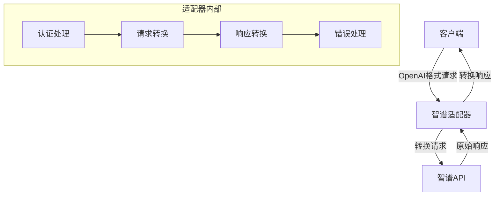
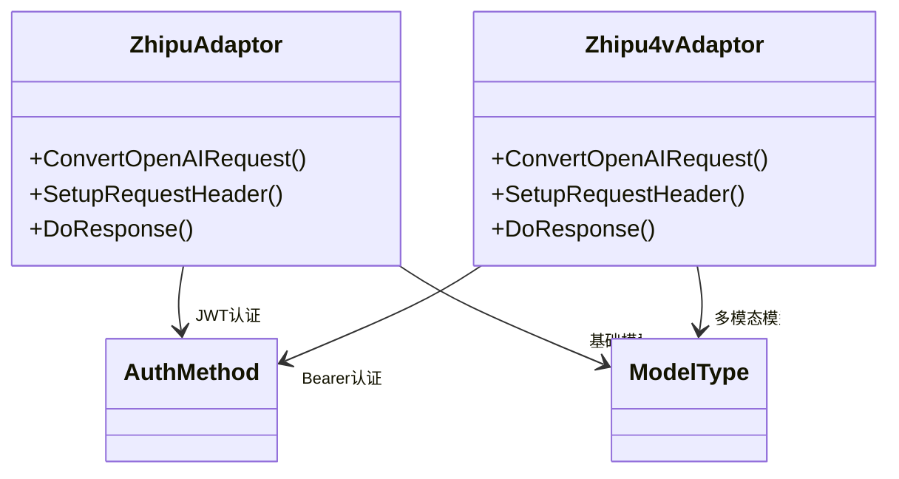
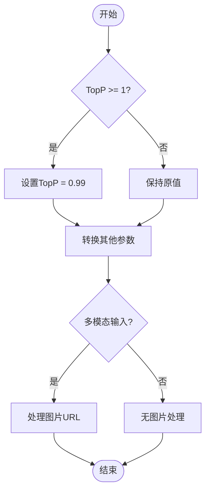
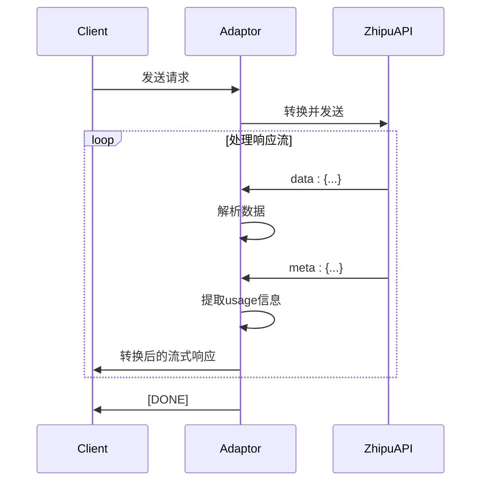
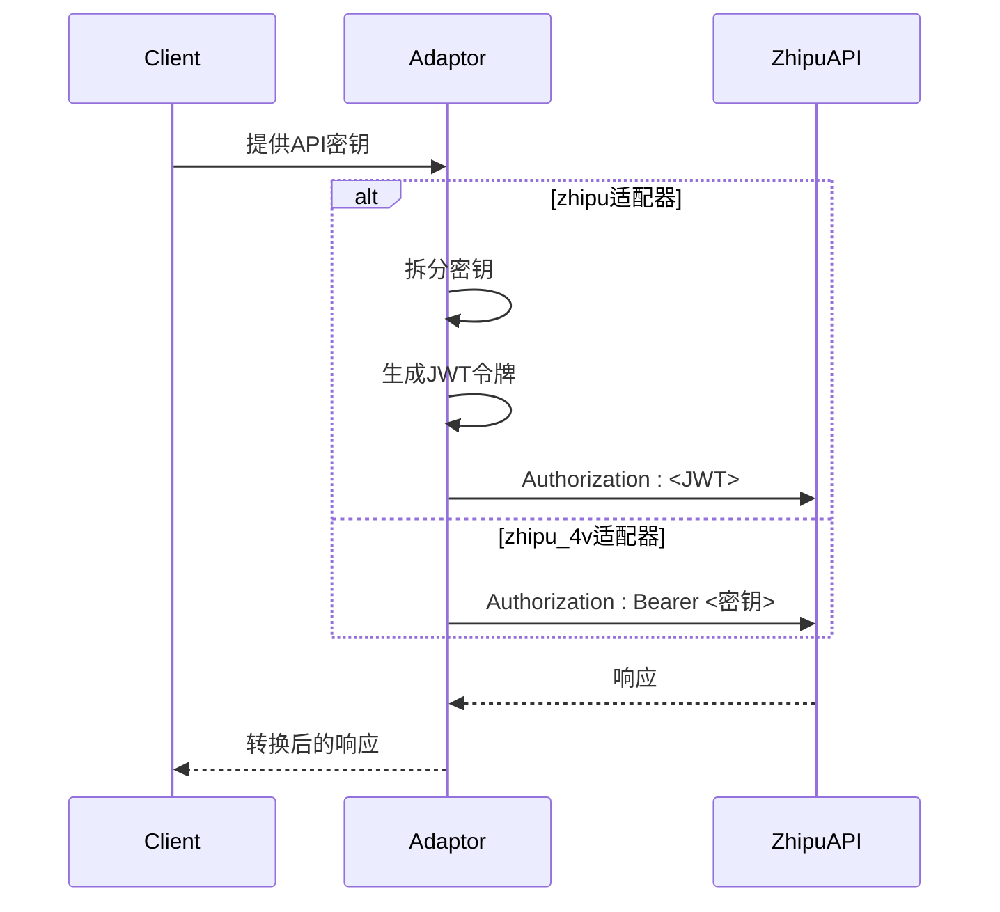
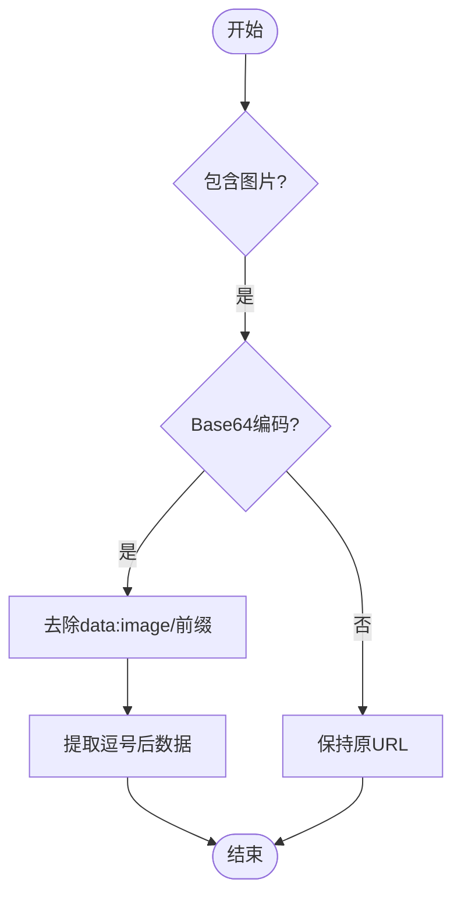
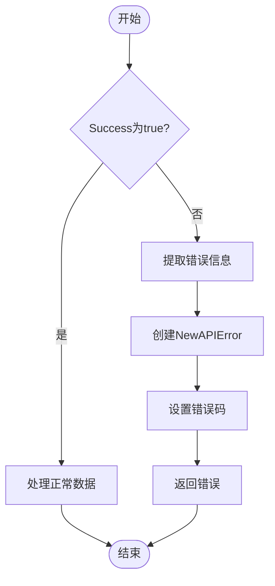

# 智谱AI适配器

<cite>
**本文档引用的文件**   
- [adaptor.go](file://relay/channel/zhipu/adaptor.go)
- [constants.go](file://relay/channel/zhipu/constants.go)
- [dto.go](file://relay/channel/zhipu/dto.go)
- [relay-zhipu.go](file://relay/channel/zhipu/relay-zhipu.go)
- [adaptor.go](file://relay/channel/zhipu_4v/adaptor.go)
- [constants.go](file://relay/channel/zhipu_4v/constants.go)
- [dto.go](file://relay/channel/zhipu_4v/dto.go)
- [relay-zhipu_v4.go](file://relay/channel/zhipu_4v/relay-zhipu_v4.go)
- [image.go](file://relay/channel/zhipu_4v/image.go)
- [error.go](file://types/error.go)
- [error.go](file://service/error.go)
</cite>

## 目录
1. [引言](#引言)
2. [核心组件](#核心组件)
3. [架构概述](#架构概述)
4. [详细组件分析](#详细组件分析)
5. [依赖分析](#依赖分析)
6. [性能考虑](#性能考虑)
7. [故障排除指南](#故障排除指南)
8. [结论](#结论)

## 引言
本文档系统阐述了智谱AI（Zhipu）适配器的设计与实现。重点分析了`zhipu/adaptor.go`和`zhipu_4v/adaptor.go`的区别，前者用于GLM系列基础模型，后者支持GLM-4V多模态模型。文档详细说明了如何处理智谱特有的请求参数（如glm-3-turbo的max_tokens）、响应格式（usage字段位置）和认证方式（Authorization Bearer）。同时，深入描述了多模态输入中图片URL的编码处理和4V模型的特殊要求。通过实际代码示例展示了不同模型类型的请求转换，并解释了错误码映射（如请求过频10003）的处理策略。

## 核心组件
智谱AI适配器的核心组件包括两个主要的适配器实现：`zhipu`适配器和`zhipu_4v`适配器。这两个适配器分别处理不同类型的智谱AI模型请求。`zhipu`适配器主要处理GLM系列的基础语言模型，而`zhipu_4v`适配器则专门处理支持视觉能力的GLM-4V多模态模型。两个适配器都实现了统一的接口，但在请求转换、响应处理和认证机制上存在显著差异。

**Section sources**
- [adaptor.go](file://relay/channel/zhipu/adaptor.go#L1-L103)
- [adaptor.go](file://relay/channel/zhipu_4v/adaptor.go#L1-L133)

## 架构概述
智谱AI适配器的架构设计遵循了模块化和可扩展的原则。适配器层位于客户端请求和上游智谱AI服务之间，负责协议转换、参数映射和错误处理。对于基础GLM模型，适配器使用JWT令牌进行认证，而对于GLM-4V多模态模型，则使用标准的Bearer令牌。架构支持流式和非流式响应处理，并能够正确映射不同模型的usage统计信息。



**Diagram sources **
- [adaptor.go](file://relay/channel/zhipu/adaptor.go#L52-L56)
- [adaptor.go](file://relay/channel/zhipu_4v/adaptor.go#L76-L78)

## 详细组件分析

### zhipu与zhipu_4v适配器对比分析
`zhipu`和`zhipu_4v`适配器在设计上有着明显的区别，主要体现在模型支持、认证方式和请求格式上。`zhipu`适配器支持`chatglm_turbo`、`chatglm_pro`等基础模型，而`zhipu_4v`适配器支持`glm-4`、`glm-4v`、`glm-3-turbo`等更先进的模型。在认证方式上，`zhipu`适配器使用JWT令牌生成机制，而`zhipu_4v`适配器使用标准的Bearer令牌。



**Diagram sources **
- [adaptor.go](file://relay/channel/zhipu/adaptor.go#L52-L56)
- [adaptor.go](file://relay/channel/zhipu_4v/adaptor.go#L76-L78)

### 请求参数处理
智谱AI适配器对请求参数的处理非常精细。对于`glm-3-turbo`等模型，适配器会正确处理`max_tokens`参数。在`zhipu_4v`适配器中，`requestOpenAI2Zhipu`函数会将OpenAI格式的请求转换为智谱格式，包括正确映射`max_tokens`、`temperature`、`top_p`等参数。特别地，当`top_p`值大于等于1时，适配器会将其设置为0.99，以符合智谱API的要求。



**Diagram sources **
- [relay-zhipu_v4.go](file://relay/channel/zhipu_4v/relay-zhipu_v4.go#L9-L56)
- [adaptor.go](file://relay/channel/zhipu_4v/adaptor.go#L82-L90)

### 响应格式处理
智谱AI适配器对响应格式的处理也非常完善。`zhipu`适配器的响应格式中，`usage`字段位于`data`对象内部，而`zhipu_4v`适配器的响应格式更接近OpenAI标准。适配器会正确解析上游API的响应，并将其转换为标准格式。对于流式响应，适配器能够正确处理`data:`和`meta:`事件，提取usage信息。



**Diagram sources **
- [relay-zhipu.go](file://relay/channel/zhipu/relay-zhipu.go#L157-L219)
- [adaptor.go](file://relay/channel/zhipu/adaptor.go#L87-L93)

### 认证机制
智谱AI适配器实现了两种不同的认证机制。`zhipu`适配器使用JWT令牌认证，通过`getZhipuToken`函数生成签名令牌。该函数会将API密钥拆分为ID和密钥，然后使用HS256算法生成JWT令牌。`zhipu_4v`适配器则使用更简单的Bearer令牌认证，直接在Authorization头中添加"Bearer "前缀。



**Diagram sources **
- [relay-zhipu.go](file://relay/channel/zhipu/relay-zhipu.go#L32-L77)
- [adaptor.go](file://relay/channel/zhipu_4v/adaptor.go#L76-L78)

### 多模态输入处理
`zhipu_4v`适配器专门处理多模态输入，特别是图片URL的编码。当处理包含图片的请求时，适配器会检查图片URL是否为base64编码。如果是base64数据，适配器会去除"data:image/"前缀和逗号分隔符，只保留纯base64字符串。这一处理确保了图片数据能够被正确传递给智谱的多模态模型。



**Diagram sources **
- [relay-zhipu_v4.go](file://relay/channel/zhipu_4v/relay-zhipu_v4.go#L17-L23)
- [image.go](file://relay/channel/zhipu_4v/image.go#L1-L91)

### 错误码映射处理
智谱AI适配器实现了完善的错误处理机制。当上游API返回错误时，适配器会将智谱特有的错误码映射到标准错误格式。例如，请求过频错误（代码10003）会被正确捕获并转换为适当的HTTP状态码和错误消息。错误处理函数会检查响应中的`success`字段和`code`字段，然后创建相应的`NewAPIError`对象。



**Diagram sources **
- [relay-zhipu.go](file://relay/channel/zhipu/relay-zhipu.go#L232-L237)
- [error.go](file://types/error.go#L277-L300)

**Section sources**
- [adaptor.go](file://relay/channel/zhipu/adaptor.go#L87-L93)
- [relay-zhipu.go](file://relay/channel/zhipu/relay-zhipu.go#L221-L247)
- [error.go](file://types/error.go#L277-L300)

## 依赖分析
智谱AI适配器依赖于多个核心组件和服务。主要依赖包括`dto`包中的数据传输对象、`types`包中的错误类型定义、`common`包中的通用工具函数以及`relay/common`包中的中继信息结构。适配器通过`channel.DoApiRequest`函数执行实际的API请求，并依赖`service.CloseResponseBodyGracefully`函数确保响应体被正确关闭。

```mermaid
graph TD
ZhipuAdaptor --> dto
ZhipuAdaptor --> types
ZhipuAdaptor --> common
ZhipuAdaptor --> relaycommon
ZhipuAdaptor --> channel
ZhipuAdaptor --> service
dto --> "数据传输对象"
types --> "错误类型"
common --> "通用工具"
relaycommon --> "中继信息"
channel --> "API请求"
service --> "服务工具"
```

**Diagram sources **
- [adaptor.go](file://relay/channel/zhipu/adaptor.go#L9-L15)
- [adaptor.go](file://relay/channel/zhipu_4v/adaptor.go#L9-L16)

## 性能考虑
智谱AI适配器在性能方面进行了多项优化。首先，`zhipu`适配器使用`sync.Map`缓存JWT令牌，避免了重复的令牌生成计算。其次，流式响应处理使用goroutine和channel来异步处理数据流，提高了响应效率。此外，适配器对请求和响应进行了适当的缓冲处理，减少了I/O操作的开销。

## 故障排除指南
当遇到智谱AI适配器相关问题时，可以参考以下故障排除步骤：
1. 检查API密钥格式是否正确，特别是`zhipu`适配器需要ID和密钥用点号分隔。
2. 验证请求参数是否符合模型要求，特别是`top_p`值不应大于等于1。
3. 检查多模态输入中的图片URL是否正确编码，base64数据需要去除前缀。
4. 查看错误响应中的代码和消息，确定是客户端错误还是服务器端错误。
5. 确认网络连接正常，能够访问智谱API端点。

**Section sources**
- [relay-zhipu.go](file://relay/channel/zhipu/relay-zhipu.go#L41-L45)
- [adaptor.go](file://relay/channel/zhipu/adaptor.go#L63-L65)
- [relay-zhipu_v4.go](file://relay/channel/zhipu_4v/relay-zhipu_v4.go#L17-L23)

## 结论
智谱AI适配器的设计充分考虑了不同模型类型的需求，实现了灵活的请求转换和响应处理机制。通过`zhipu`和`zhipu_4v`两个适配器的分工，系统能够有效支持从基础语言模型到先进多模态模型的广泛需求。适配器的模块化设计使得添加新的模型支持变得简单，而完善的错误处理和性能优化确保了系统的稳定性和高效性。未来可以进一步扩展对更多智谱AI特有功能的支持，如更复杂的多模态交互和高级推理能力。