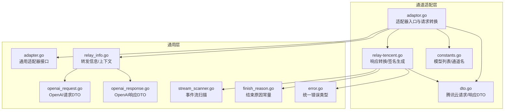
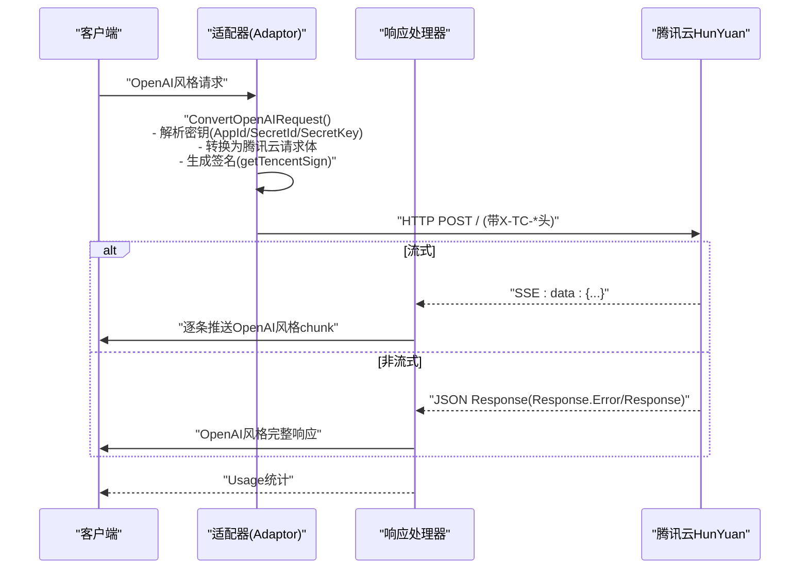
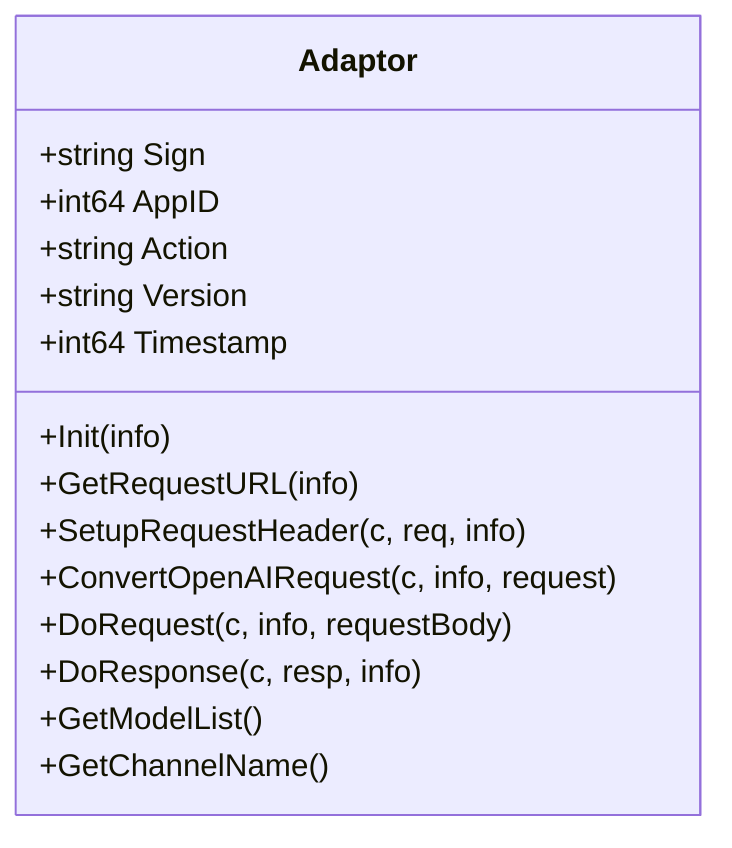
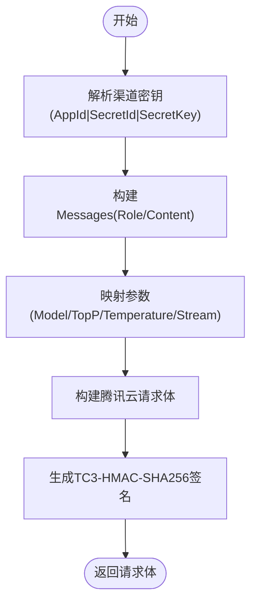
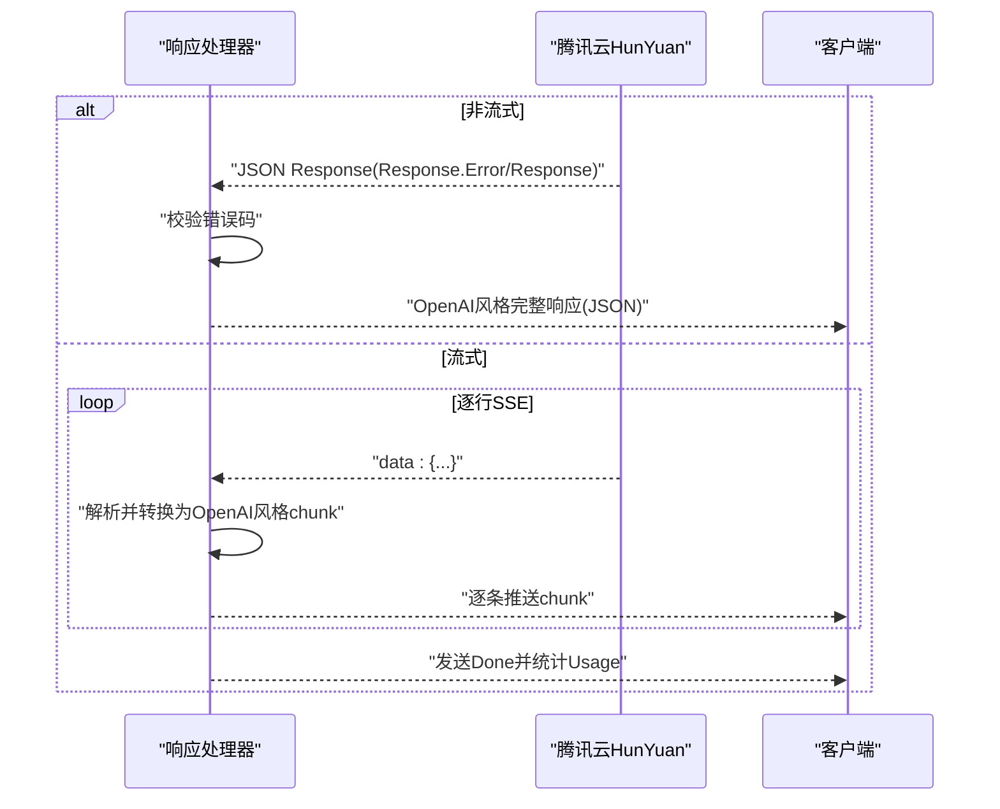
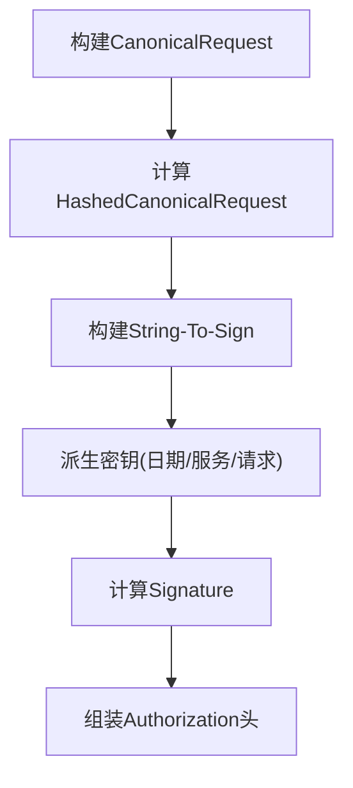
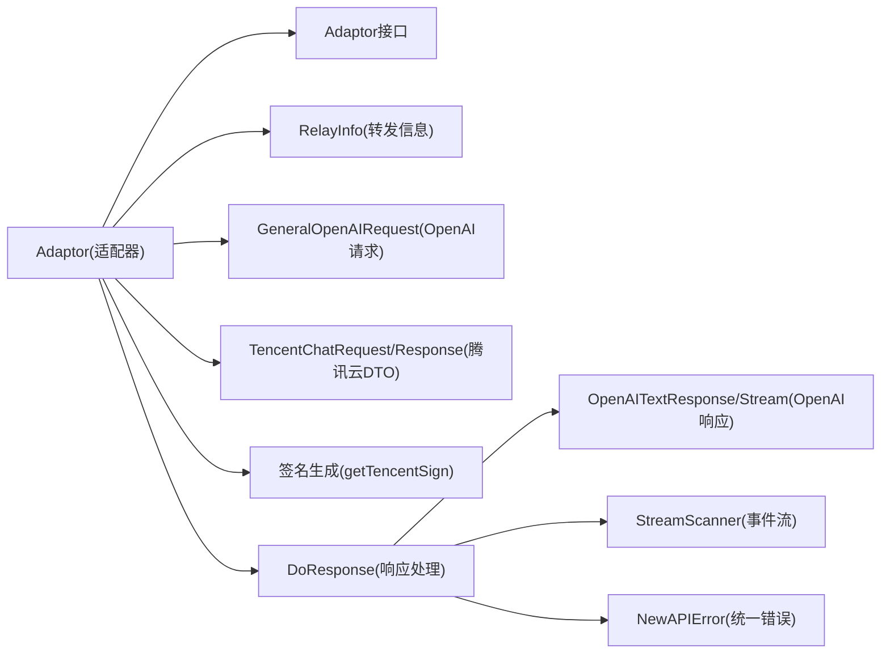

# 腾讯混元适配器

<cite>
**本文引用的文件**
- [adaptor.go](file://relay/channel/tencent/adaptor.go)
- [relay-tencent.go](file://relay/channel/tencent/relay-tencent.go)
- [constants.go](file://relay/channel/tencent/constants.go)
- [dto.go](file://relay/channel/tencent/dto.go)
- [adapter.go](file://relay/channel/adapter.go)
- [relay_info.go](file://relay/common/relay_info.go)
- [openai_request.go](file://dto/openai_request.go)
- [openai_response.go](file://dto/openai_response.go)
- [stream_scanner.go](file://relay/helper/stream_scanner.go)
- [finish_reason.go](file://constant/finish_reason.go)
- [error.go](file://types/error.go)
</cite>

## 目录
1. [简介](#简介)
2. [项目结构](#项目结构)
3. [核心组件](#核心组件)
4. [架构总览](#架构总览)
5. [详细组件分析](#详细组件分析)
6. [依赖关系分析](#依赖关系分析)
7. [性能考量](#性能考量)
8. [故障排查指南](#故障排查指南)
9. [结论](#结论)
10. [附录](#附录)

## 简介
本文件面向希望在本系统中接入腾讯混元（HunYuan）能力的开发者，深入解析“腾讯混元适配器”的实现细节，重点覆盖以下方面：
- 如何将标准 OpenAI 风格请求转换为腾讯云 HunYuan 特定的 JSON 格式
- 参数适配（如温度参数范围映射）与签名生成流程
- 如何处理腾讯云特有的响应结构（Result/Response 字段嵌套）与错误码
- 适配器如何处理腾讯云的认证（SecretId/SecretKey）与请求头
- 实际请求示例与与 OpenAI 在流式响应、错误处理上的差异
- 集成最佳实践

## 项目结构
腾讯混元适配器位于通道目录下的 tencent 子模块，核心文件包括：
- 适配器入口与请求转换：adaptor.go
- 响应转换与签名生成：relay-tencent.go
- 常量与模型列表：constants.go
- 数据传输对象（DTO）：dto.go
- 通用适配器接口：adapter.go
- 通用转发信息：relay_info.go
- OpenAI 请求/响应 DTO：openai_request.go、openai_response.go
- 流式扫描与事件流处理：stream_scanner.go
- 结束原因常量：finish_reason.go
- 统一错误类型：error.go

图表来源
- [adaptor.go](file://relay/channel/tencent/adaptor.go#L1-L120)
- [relay-tencent.go](file://relay/channel/tencent/relay-tencent.go#L1-L235)
- [constants.go](file://relay/channel/tencent/constants.go#L1-L11)
- [dto.go](file://relay/channel/tencent/dto.go#L1-L76)
- [adapter.go](file://relay/channel/adapter.go#L1-L58)
- [relay_info.go](file://relay/common/relay_info.go#L1-L200)
- [openai_request.go](file://dto/openai_request.go#L1-L120)
- [openai_response.go](file://dto/openai_response.go#L1-L120)
- [stream_scanner.go](file://relay/helper/stream_scanner.go#L1-L120)
- [finish_reason.go](file://constant/finish_reason.go#L1-L10)
- [error.go](file://types/error.go#L78-L138)

章节来源
- [adaptor.go](file://relay/channel/tencent/adaptor.go#L1-L120)
- [relay-tencent.go](file://relay/channel/tencent/relay-tencent.go#L1-L235)
- [constants.go](file://relay/channel/tencent/constants.go#L1-L11)
- [dto.go](file://relay/channel/tencent/dto.go#L1-L76)
- [adapter.go](file://relay/channel/adapter.go#L1-L58)
- [relay_info.go](file://relay/common/relay_info.go#L1-L200)
- [openai_request.go](file://dto/openai_request.go#L1-L120)
- [openai_response.go](file://dto/openai_response.go#L1-L120)
- [stream_scanner.go](file://relay/helper/stream_scanner.go#L1-L120)
- [finish_reason.go](file://constant/finish_reason.go#L1-L10)
- [error.go](file://types/error.go#L78-L138)

## 核心组件
- 适配器（Adaptor）：实现通用适配器接口，负责初始化、请求 URL、请求头设置、请求体转换、请求发送与响应处理。
- 请求转换函数：将标准 OpenAI 风格请求转换为腾讯云 HunYuan 请求结构。
- 响应转换函数：将腾讯云响应转换为 OpenAI 风格响应；同时处理流式与非流式两种模式。
- 签名生成：基于 TC3-HMAC-SHA256 算法生成 Authorization 头。
- 认证与配置：从渠道密钥中解析 AppId、SecretId、SecretKey，并设置 X-TC-* 请求头。
- 错误处理：将腾讯云错误映射为统一错误类型并携带状态码。

章节来源
- [adaptor.go](file://relay/channel/tencent/adaptor.go#L1-L120)
- [relay-tencent.go](file://relay/channel/tencent/relay-tencent.go#L1-L235)
- [adapter.go](file://relay/channel/adapter.go#L1-L58)

## 架构总览
下图展示从客户端到腾讯云 HunYuan 的端到端调用链路，以及适配器在其中的角色。

图表来源
- [adaptor.go](file://relay/channel/tencent/adaptor.go#L60-L120)
- [relay-tencent.go](file://relay/channel/tencent/relay-tencent.go#L30-L162)
- [stream_scanner.go](file://relay/helper/stream_scanner.go#L1-L120)

## 详细组件分析

### 适配器类与职责
- 初始化：设置 Action、Version、Timestamp。
- 请求头：设置 Authorization、X-TC-Action、X-TC-Version、X-TC-Timestamp。
- 请求体转换：解析渠道密钥，构造腾讯云请求体，计算签名。
- 响应处理：根据是否流式选择不同的处理路径。

图表来源
- [adaptor.go](file://relay/channel/tencent/adaptor.go#L21-L120)

章节来源
- [adaptor.go](file://relay/channel/tencent/adaptor.go#L21-L120)

### 请求转换：OpenAI → 腾讯云
- 消息映射：将 OpenAI 的消息 Role/Content 映射到腾讯云 Messages。
- 模型映射：将 OpenAI 的 Model 名称直接传递给腾讯云（见模型列表）。
- 参数映射：TopP、Temperature、Stream 等参数原样传递。
- 渠道密钥解析：从渠道密钥中解析 AppId、SecretId、SecretKey。
- 签名生成：在转换完成后计算 Authorization 并注入请求头。

图表来源
- [adaptor.go](file://relay/channel/tencent/adaptor.go#L69-L84)
- [relay-tencent.go](file://relay/channel/tencent/relay-tencent.go#L30-L49)
- [relay-tencent.go](file://relay/channel/tencent/relay-tencent.go#L164-L234)

章节来源
- [adaptor.go](file://relay/channel/tencent/adaptor.go#L69-L84)
- [relay-tencent.go](file://relay/channel/tencent/relay-tencent.go#L30-L49)
- [relay-tencent.go](file://relay/channel/tencent/relay-tencent.go#L164-L234)

### 响应转换：腾讯云 → OpenAI
- 非流式：读取完整响应，检查 Response.Error，若存在错误则返回统一错误类型；否则将 Response 转换为 OpenAI 风格文本响应。
- 流式：逐行读取 SSE 数据，解析每条 data: 行，转换为 OpenAI 风格的 chunk，最后发送 Done 并统计 Usage。

图表来源
- [relay-tencent.go](file://relay/channel/tencent/relay-tencent.go#L93-L162)
- [openai_response.go](file://dto/openai_response.go#L141-L198)
- [finish_reason.go](file://constant/finish_reason.go#L1-L10)

章节来源
- [relay-tencent.go](file://relay/channel/tencent/relay-tencent.go#L93-L162)
- [openai_response.go](file://dto/openai_response.go#L141-L198)
- [finish_reason.go](file://constant/finish_reason.go#L1-L10)

### 签名生成：TC3-HMAC-SHA256
- 构建规范请求 Canonical Request：HTTP方法、URI、查询串、头部、签名头、负载摘要。
- 构建待签字符串 String-To-Sign：算法、时间戳、凭证域、规范化请求摘要。
- 计算签名：按日期/服务/请求级别派生密钥，最终生成 Signature。
- 组装 Authorization 头：包含 Credential、SignedHeaders、Signature。

图表来源
- [relay-tencent.go](file://relay/channel/tencent/relay-tencent.go#L187-L234)

章节来源
- [relay-tencent.go](file://relay/channel/tencent/relay-tencent.go#L187-L234)

### 认证与请求头
- 渠道密钥格式：AppId|SecretId|SecretKey，由适配器在请求前解析。
- 请求头设置：Authorization、X-TC-Action、X-TC-Version、X-TC-Timestamp。
- 请求 URL：基础地址由 RelayInfo.ChannelBaseUrl 提供，适配器返回末尾带斜杠的基础路径。

章节来源
- [adaptor.go](file://relay/channel/tencent/adaptor.go#L56-L67)
- [adaptor.go](file://relay/channel/tencent/adaptor.go#L69-L84)
- [relay-tencent.go](file://relay/channel/tencent/relay-tencent.go#L164-L174)
- [relay_info.go](file://relay/common/relay_info.go#L131-L176)

### 错误处理与错误码
- 非流式错误：若 Response.Error.Code 非零，则封装为统一错误类型并返回对应状态码。
- 流式错误：解析单行数据失败时记录日志并继续；客户端侧通过 SSE 错误事件感知异常。
- 统一错误类型：NewAPIError 提供错误码、类型、状态码等信息，便于上层处理。

章节来源
- [relay-tencent.go](file://relay/channel/tencent/relay-tencent.go#L136-L162)
- [error.go](file://types/error.go#L78-L138)

### 模型列表与通道名
- 支持的模型名称：hunyuan-lite、hunyuan-standard、hunyuan-standard-256K、hunyuan-pro。
- 通道名：tencent。

章节来源
- [constants.go](file://relay/channel/tencent/constants.go#L1-L11)

## 依赖关系分析
- 适配器依赖通用适配器接口，保证与上游调用方解耦。
- 请求转换依赖 OpenAI 请求 DTO，响应转换依赖 OpenAI 响应 DTO。
- 流式处理依赖通用事件流扫描器。
- 错误处理依赖统一错误类型。

图表来源
- [adapter.go](file://relay/channel/adapter.go#L1-L58)
- [adaptor.go](file://relay/channel/tencent/adaptor.go#L1-L120)
- [relay_info.go](file://relay/common/relay_info.go#L1-L200)
- [openai_request.go](file://dto/openai_request.go#L1-L120)
- [openai_response.go](file://dto/openai_response.go#L1-L120)
- [dto.go](file://relay/channel/tencent/dto.go#L1-L76)
- [relay-tencent.go](file://relay/channel/tencent/relay-tencent.go#L1-L235)
- [stream_scanner.go](file://relay/helper/stream_scanner.go#L1-L120)
- [error.go](file://types/error.go#L78-L138)

章节来源
- [adapter.go](file://relay/channel/adapter.go#L1-L58)
- [adaptor.go](file://relay/channel/tencent/adaptor.go#L1-L120)
- [relay_info.go](file://relay/common/relay_info.go#L1-L200)
- [openai_request.go](file://dto/openai_request.go#L1-L120)
- [openai_response.go](file://dto/openai_response.go#L1-L120)
- [dto.go](file://relay/channel/tencent/dto.go#L1-L76)
- [relay-tencent.go](file://relay/channel/tencent/relay-tencent.go#L1-L235)
- [stream_scanner.go](file://relay/helper/stream_scanner.go#L1-L120)
- [error.go](file://types/error.go#L78-L138)

## 性能考量
- 流式处理：采用逐行扫描与事件流推送，降低内存占用，提升首字节延迟表现。
- 缓冲区：事件流扫描器支持可配置的最大缓冲大小，避免超大数据导致内存压力。
- 超时与心跳：事件流扫描器内置超时与心跳机制，保障长连接稳定性。
- 签名计算：签名生成在请求前完成，避免重复计算；注意密钥解析与签名生成的开销控制。

[本节为通用指导，无需列出具体文件来源]

## 故障排查指南
- 渠道密钥格式错误：确认密钥格式为 AppId|SecretId|SecretKey，解析失败会导致签名生成异常。
- 签名失败：检查时间戳、Action、Host、Content-Type 等头部是否正确；确认 TC3-HMAC-SHA256 算法实现与腾讯云文档一致。
- 非流式错误：若 Response.Error.Code 非零，将返回统一错误类型与状态码；检查上游返回的错误信息。
- 流式解析异常：逐行数据解析失败会记录日志并跳过，不影响后续数据；检查 SSE 数据格式与前缀。
- Usage 统计：流式场景下基于响应文本与估算提示词数进行统计；确保上游模型名与估算逻辑正确。

章节来源
- [relay-tencent.go](file://relay/channel/tencent/relay-tencent.go#L136-L162)
- [relay-tencent.go](file://relay/channel/tencent/relay-tencent.go#L93-L134)
- [relay-tencent.go](file://relay/channel/tencent/relay-tencent.go#L164-L174)
- [error.go](file://types/error.go#L78-L138)

## 结论
腾讯混元适配器通过标准化的适配器接口，实现了对 OpenAI 风格请求到腾讯云 HunYuan 请求的高效转换，并在响应阶段提供了统一的 OpenAI 风格输出。其关键特性包括：
- 完整的消息与参数映射
- TC3-HMAC-SHA256 签名生成
- 非流式与流式的差异化响应处理
- 统一错误类型与可观测性

在集成时，建议严格遵循密钥格式、模型名称与参数映射规则，并结合事件流扫描器的最佳实践，确保稳定与高性能。

[本节为总结性内容，无需列出具体文件来源]

## 附录

### 实际请求示例（概念性说明）
- OpenAI 风格请求要点
  - 模型名称：使用混元支持的模型名（如 hunyuan-lite）
  - 消息角色：system/user/assistant
  - 参数：temperature、top_p、stream 等
- 腾讯云 HunYuan 请求要点
  - 消息结构：Messages 数组，每个元素包含 Role 与 Content
  - 请求头：Authorization、X-TC-Action、X-TC-Version、X-TC-Timestamp
  - 负载：JSON 格式，包含 Model、Messages、Stream、TopP、Temperature 等

章节来源
- [openai_request.go](file://dto/openai_request.go#L1-L120)
- [dto.go](file://relay/channel/tencent/dto.go#L1-L76)
- [adaptor.go](file://relay/channel/tencent/adaptor.go#L56-L84)
- [relay-tencent.go](file://relay/channel/tencent/relay-tencent.go#L30-L49)

### 与 OpenAI 在流式与错误处理上的差异
- 流式响应
  - OpenAI：SSE data: 行，逐条推送 chat.completion.chunk
  - 腾讯云：同样为 SSE，但响应结构包含 Response/Error/Choices 等字段；适配器将其转换为 OpenAI 风格
- 错误处理
  - OpenAI：错误通常以 JSON 错误对象形式返回
  - 腾讯云：错误在 Response.Error 中体现；适配器将其映射为统一错误类型并返回对应状态码

章节来源
- [relay-tencent.go](file://relay/channel/tencent/relay-tencent.go#L93-L162)
- [openai_response.go](file://dto/openai_response.go#L141-L198)
- [error.go](file://types/error.go#L78-L138)

### 集成最佳实践
- 密钥管理：严格遵循 AppId|SecretId|SecretKey 格式，避免多余空格或换行
- 模型选择：优先使用官方支持的模型名称，避免因模型名不匹配导致调用失败
- 参数适配：谨慎设置 temperature/top_p，避免超出腾讯云推荐范围
- 流式体验：启用流式时，确保客户端正确处理 SSE 事件与 Done 标记
- 错误监控：关注 Response.Error 与统一错误类型的错误码，及时定位问题

[本节为通用指导，无需列出具体文件来源]