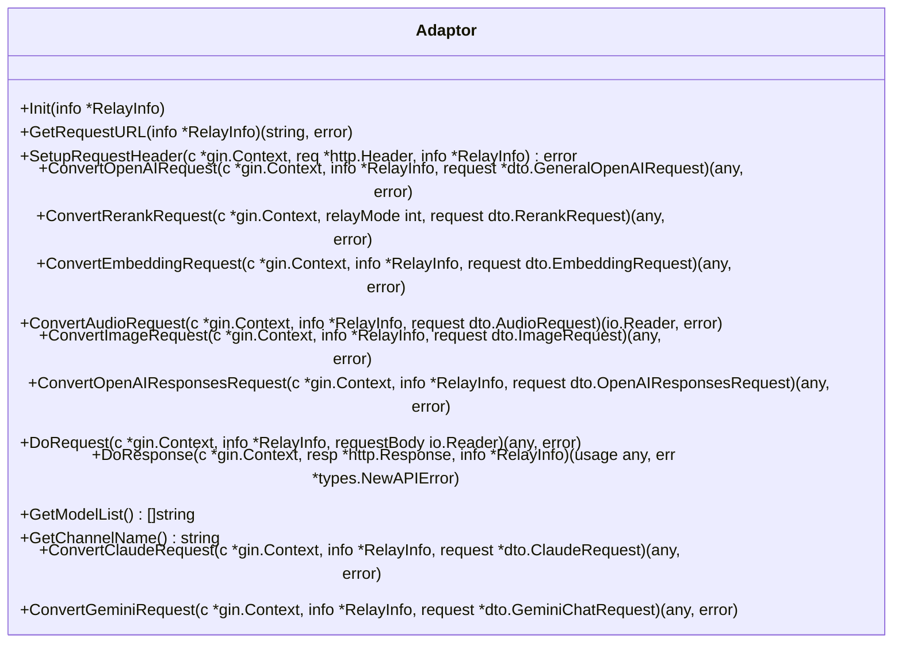
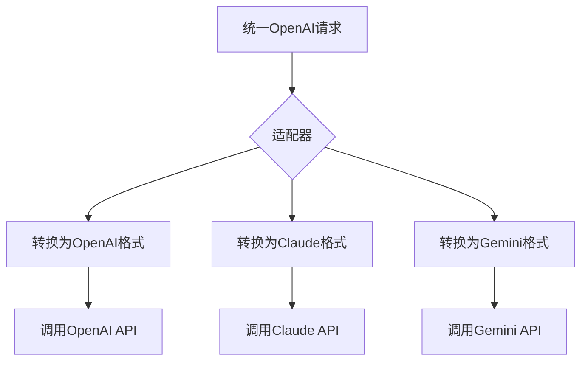
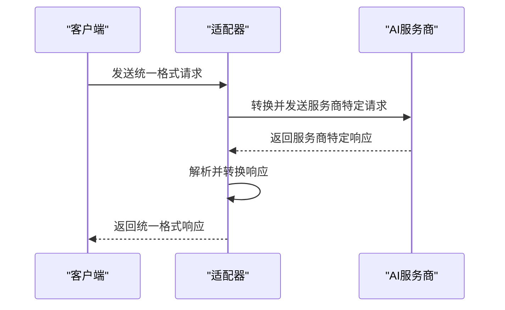

# 适配器机制

<cite>
**本文档引用的文件**   
- [relay_adaptor.go](file://relay/relay_adaptor.go)
- [adapter.go](file://relay/channel/adapter.go)
- [api_request.go](file://relay/channel/api_request.go)
- [relay-info.go](file://relay/common/relay_info.go)
- [openai/adaptor.go](file://relay/channel/openai/adaptor.go)
- [claude/adaptor.go](file://relay/channel/claude/adaptor.go)
- [gemini/adaptor.go](file://relay/channel/gemini/adaptor.go)
- [openai_request.go](file://dto/openai_request.go)
- [relay-openai.go](file://relay/channel/openai/relay-openai.go)
- [relay-claude.go](file://relay/channel/claude/relay-claude.go)
- [relay-gemini.go](file://relay/channel/gemini/relay-gemini.go)
</cite>

## 目录
1. [适配器设计模式概述](#适配器设计模式概述)
2. [统一入口与适配器选择](#统一入口与适配器选择)
3. [适配器接口定义](#适配器接口定义)
4. [请求与响应格式转换](#请求与响应格式转换)
5. [OpenAI与Claude适配器实现对比](#openai与claude适配器实现对比)
6. [服务商特有功能处理](#服务商特有功能处理)
7. [扩展新适配器指南](#扩展新适配器指南)

## 适配器设计模式概述

new-api项目采用适配器设计模式来统一调用不同AI服务商的API。该模式的核心思想是将系统与外部服务的接口差异进行封装，为上层应用提供一个统一、一致的调用接口。通过这种设计，系统可以灵活地集成和切换不同的AI服务商（如OpenAI、Claude、Gemini等），而无需修改核心业务逻辑。

该模式主要由三个核心组件构成：**统一入口**、**适配器接口**和**具体适配器实现**。统一入口（`relay_adaptor.go`）负责根据请求类型选择合适的适配器；适配器接口（`adapter.go`）定义了所有适配器必须实现的标准方法；而具体适配器（如`openai/adaptor.go`）则负责实现针对特定服务商的请求转换、认证和响应处理逻辑。

这种设计极大地提高了系统的可扩展性和可维护性。当需要集成新的AI服务商时，只需实现一个新的适配器并将其注册到统一入口即可，现有代码无需任何改动。

**Section sources**
- [relay_adaptor.go](file://relay/relay_adaptor.go#L1-L163)
- [adapter.go](file://relay/channel/adapter.go#L1-L58)

## 统一入口与适配器选择

系统的统一入口是`relay/relay_adaptor.go`文件中的`GetAdaptor`函数。该函数是整个适配器模式的调度中心，它接收一个`apiType`参数（表示目标AI服务商的类型），并返回一个实现了`channel.Adaptor`接口的具体适配器实例。

```mermaid
graph TD
A[客户端请求] --> B{GetAdaptor(apiType)}
B --> C[返回OpenAI适配器]
B --> D[返回Claude适配器]
B --> E[返回Gemini适配器]
B --> F[返回其他适配器]
C --> G[调用OpenAI API]
D --> H[调用Claude API]
E --> I[调用Gemini API]
F --> J[调用其他服务商API]
```

**Diagram sources**
- [relay_adaptor.go](file://relay/relay_adaptor.go#L52-L122)

`GetAdaptor`函数通过一个`switch`语句，根据`apiType`的值创建并返回相应的适配器。例如，当`apiType`为`constant.APITypeOpenAI`时，函数返回`&openai.Adaptor{}`；当`apiType`为`constant.APITypeAnthropic`时，返回`&claude.Adaptor{}`。这种方式实现了“开闭原则”（对扩展开放，对修改关闭），添加新的服务商只需在`switch`中增加一个新的`case`分支。

此外，该文件还包含`GetTaskAdaptor`函数，用于处理异步任务类的API调用（如视频生成），其工作原理与`GetAdaptor`类似。

**Section sources**
- [relay_adaptor.go](file://relay/relay_adaptor.go#L52-L122)
- [relay_adaptor.go](file://relay/relay_adaptor.go#L132-L162)

## 适配器接口定义

所有适配器都必须实现`relay/channel/adapter.go`文件中定义的`Adaptor`接口。该接口定义了一组标准化的方法，确保了所有适配器的行为一致性。



**Diagram sources**
- [adapter.go](file://relay/channel/adapter.go#L15-L32)

接口中的关键方法包括：
- **`ConvertOpenAIRequest`**: 将统一的OpenAI格式请求转换为服务商特定的请求格式。
- **`DoRequest`**: 执行实际的HTTP请求。
- **`DoResponse`**: 处理服务商的响应，并将其转换为统一的API响应格式。
- **`SetupRequestHeader`**: 设置请求头，处理服务商特有的认证方式。
- **`GetRequestURL`**: 构建目标API的完整URL。

这些方法共同构成了一个完整的请求-响应处理流水线，从请求转换、发送到响应处理，都由适配器负责。

**Section sources**
- [adapter.go](file://relay/channel/adapter.go#L15-L32)

## 请求与响应格式转换

### 请求格式转换

请求格式转换是适配器模式的核心功能之一。系统接收的是统一的OpenAI格式请求（`dto.GeneralOpenAIRequest`），适配器需要将其转换为目标服务商所需的格式。



**Diagram sources**
- [openai_request.go](file://dto/openai_request.go#L26-L99)

以`relay/channel/openai/adaptor.go`中的`ConvertOpenAIRequest`方法为例，它接收一个`GeneralOpenAIRequest`对象。对于OpenAI和Azure等兼容OpenAI的API，此方法通常直接返回原始请求，或进行一些参数的微调（如处理`-thinking`后缀）。而对于`relay/channel/claude/adaptor.go`中的同名方法，它会调用`RequestOpenAI2ClaudeMessage`函数，将OpenAI的消息数组（`messages`）转换为Claude的`messages`和`system`字段，并将`tools`转换为Claude的`tools`格式。

### 响应格式转换

响应格式转换由`DoResponse`方法完成。该方法接收服务商返回的原始HTTP响应，并将其解析、转换为统一的响应格式。



**Diagram sources**
- [relay-openai.go](file://relay/channel/openai/relay-openai.go#L106-L194)
- [relay-claude.go](file://relay/channel/claude/relay-claude.go#L200-L839)

例如，在`relay/channel/openai/relay-openai.go`中，`OaiStreamHandler`函数处理流式响应。它使用`helper.StreamScannerHandler`逐行读取服务商返回的SSE（Server-Sent Events）数据，然后通过`sendStreamData`函数将每一条流式数据转换为符合OpenAI规范的格式，最后通过`helper.ObjectData`发送给客户端。对于非流式响应，则使用`OpenaiHandler`函数进行一次性转换。

**Section sources**
- [openai/adaptor.go](file://relay/channel/openai/adaptor.go#L216-L336)
- [claude/adaptor.go](file://relay/channel/claude/adaptor.go#L89-L98)
- [relay-openai.go](file://relay/channel/openai/relay-openai.go#L106-L194)

## OpenAI与Claude适配器实现对比

| 特性 | OpenAI适配器 (`openai/adaptor.go`) | Claude适配器 (`claude/adaptor.go`) |
| :--- | :--- | :--- |
| **请求转换** | 主要进行参数调整和后缀处理（如`-thinking`），直接返回或微调`GeneralOpenAIRequest`。 | 将OpenAI的`messages`数组转换为Claude的`messages`和`system`字段，将`tools`转换为Claude的`tools`格式。 |
| **认证方式** | 使用`Bearer`令牌，通过`Authorization`头发送。 | 使用`x-api-key`头发送API密钥，并支持`anthropic-version`和`anthropic-beta`等特定头信息。 |
| **错误码处理** | 错误码相对标准，直接映射。 | 需要将Claude特有的`stop_reason`（如`tool_use`）映射为OpenAI的`finish_reason`（如`tool_calls`）。 |
| **流式响应** | 支持`stream_options`，可包含使用量信息。 | 流式响应包含`content_block_start`、`content_block_delta`等事件类型，需要特殊解析。 |
| **特殊功能** | 支持`reasoning_effort`参数，用于控制推理力度。 | 支持`thinking`参数，用于启用扩展思考功能，并有`BudgetTokens`等特定配置。 |

**Section sources**
- [openai/adaptor.go](file://relay/channel/openai/adaptor.go)
- [claude/adaptor.go](file://relay/channel/claude/adaptor.go)

## 服务商特有功能处理

适配器模式不仅处理基本的请求/响应转换，还负责处理各服务商特有的功能，如认证、错误码和流式响应。

### 认证方式

不同服务商的认证方式各不相同，这在`SetupRequestHeader`方法中得到处理。
- **OpenAI**: 使用`Authorization: Bearer <api_key>`。
- **Claude**: 使用`x-api-key: <api_key>`，并可选地设置`anthropic-version`。
- **Gemini**: 使用`x-goog-api-key: <api_key>`。
- **Azure**: 使用`api-key: <api_key>`。

### 错误码处理

服务商返回的错误码格式各异。适配器的`DoResponse`方法需要将这些错误码统一转换为系统内部的`types.NewAPIError`，以便上层应用能一致地处理错误。

### 流式响应

流式响应的处理最为复杂。服务商返回的SSE数据格式不同，适配器需要将其解析并重新封装为统一的流式格式。例如，Claude的流式响应包含`message_start`、`content_block_delta`等多种事件类型，而OpenAI的则相对简单。`relay/channel/claude/relay-claude.go`中的`ClaudeStreamHandler`函数负责处理这些差异，确保客户端收到的流式数据格式是统一的。

**Section sources**
- [openai/adaptor.go](file://relay/channel/openai/adaptor.go#L181-L214)
- [claude/adaptor.go](file://relay/channel/claude/adaptor.go#L77-L86)
- [gemini/adaptor.go](file://relay/channel/gemini/adaptor.go#L171-L175)

## 扩展新适配器指南

要为新的AI服务商创建适配器，请遵循以下步骤：

1.  **创建适配器文件**: 在`relay/channel/{服务商名称}/`目录下创建`adaptor.go`文件。
2.  **定义适配器结构**: 创建一个结构体（如`Adaptor`），通常包含`ChannelType`等字段。
3.  **实现Adaptor接口**: 为该结构体实现`channel.Adaptor`接口的所有方法。
    - `Init`: 初始化适配器状态。
    - `GetRequestURL`: 构建目标API的URL。
    - `SetupRequestHeader`: 设置认证头和必要的请求头。
    - `ConvertOpenAIRequest`: 将`GeneralOpenAIRequest`转换为服务商特定的请求格式。
    - `DoRequest`: 调用`channel.DoApiRequest`等函数发送请求。
    - `DoResponse`: 解析服务商响应，转换为统一的`dto.Usage`和`types.NewAPIError`。
4.  **注册适配器**: 在`relay/relay_adaptor.go`的`GetAdaptor`函数中添加一个新的`case`分支，将新的`apiType`映射到你的适配器。
5.  **处理特殊请求类型**: 如果服务商支持嵌入、重排序等，实现相应的`ConvertEmbeddingRequest`等方法。
6.  **测试**: 编写测试用例，确保所有功能正常工作。

最佳实践包括：保持代码清晰、处理所有可能的错误情况、遵循服务商的API速率限制，并在必要时提供详细的日志记录。

**Section sources**
- [relay_adaptor.go](file://relay/relay_adaptor.go#L52-L122)
- [adapter.go](file://relay/channel/adapter.go#L15-L32)