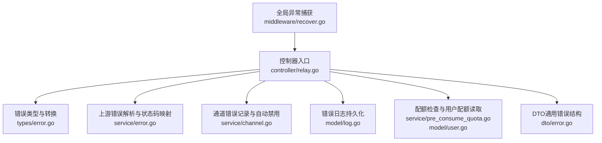
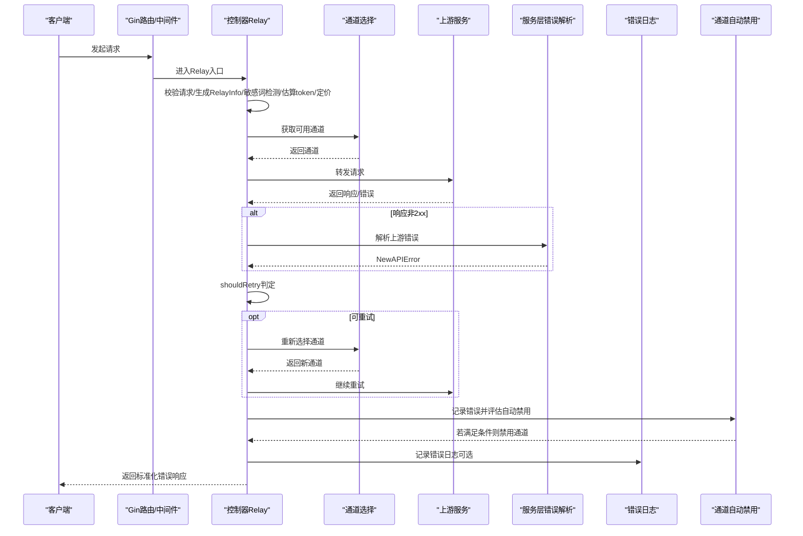
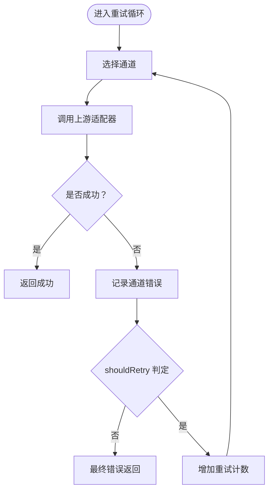
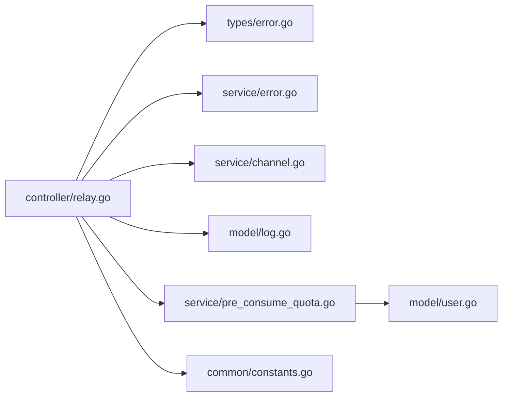

# 错误处理与重试

<cite>
**本文引用的文件列表**
- [recover.go](file://middleware/recover.go)
- [error.go](file://types/error.go)
- [channel_error.go](file://types/channel_error.go)
- [relay.go](file://controller/relay.go)
- [error.go](file://service/error.go)
- [channel.go](file://service/channel.go)
- [log.go](file://model/log.go)
- [constants.go](file://common/constants.go)
- [pre_consume_quota.go](file://service/pre_consume_quota.go)
- [user.go](file://model/user.go)
- [error.go](file://dto/error.go)
</cite>

## 目录
1. [简介](#简介)
2. [项目结构与入口](#项目结构与入口)
3. [核心组件总览](#核心组件总览)
4. [架构概览](#架构概览)
5. [详细组件分析](#详细组件分析)
6. [依赖关系分析](#依赖关系分析)
7. [性能与可靠性考量](#性能与可靠性考量)
8. [故障排查指南](#故障排查指南)
9. [结论](#结论)
10. [附录：错误码对照表](#附录错误码对照表)

## 简介
本文件系统性梳理 new-api 的错误处理与重试体系，覆盖从全局异常捕获、错误类型设计、请求链路传播、重试判定与自动禁用机制，到错误格式化输出（兼容 OpenAI/Claude/Gemini 等标准）与完整错误码对照表，并提供常见错误（配额不足、通道超时、认证失败等）的排查与解决步骤。

## 项目结构与入口
- 全局异常捕获中间件位于 middleware/recover.go，负责兜底 panic 并返回统一格式错误。
- 自定义错误类型与转换逻辑集中在 types/error.go，包含 OpenAI/Claude/Gemini 等错误模型及错误码枚举。
- 控制器层 controller/relay.go 实现了请求处理主流程、重试循环、通道错误记录与自动禁用触发。
- 服务层 service/error.go 提供上游响应错误解析、状态码映射与本地错误包装。
- 服务层 service/channel.go 定义自动禁用/启用策略与禁用执行。
- 日志持久化 model/log.go 记录错误日志，便于审计与定位。
- 配额检查 service/pre_consume_quota.go 与用户配额读取 model/user.go 为重试前的关键前置校验。
- DTO 层 dto/error.go 提供通用错误响应结构与消息提取工具。

图表来源
- [recover.go](file://middleware/recover.go#L1-L30)
- [relay.go](file://controller/relay.go#L64-L206)
- [error.go](file://types/error.go#L1-L120)
- [error.go](file://service/error.go#L84-L115)
- [channel.go](file://service/channel.go#L47-L99)
- [log.go](file://model/log.go#L99-L139)
- [pre_consume_quota.go](file://service/pre_consume_quota.go#L31-L45)
- [user.go](file://model/user.go#L669-L705)
- [error.go](file://dto/error.go#L1-L89)

章节来源
- [recover.go](file://middleware/recover.go#L1-L30)
- [relay.go](file://controller/relay.go#L64-L206)

## 核心组件总览
- 全局异常捕获：捕获 panic，记录堆栈，返回统一错误结构，终止后续处理。
- 自定义错误类型：NewAPIError 封装底层错误、错误码、错误类型、HTTP 状态码、是否跳过重试、是否记录错误日志等；提供 ToOpenAIError/ToClaudeError 等格式化方法。
- 重试逻辑：在控制器层按条件循环选择通道并重试，结合 shouldRetry 判定与 processChannelError 记录与自动禁用。
- 上游错误解析：service/error.go 将上游非标准错误体解析为 OpenAI/Claude/Gemini 格式，或构造通用错误。
- 自动禁用：基于错误类型、状态码、关键词匹配等策略，自动禁用问题通道。
- 错误日志：记录错误详情、请求路径、错误类型/代码、状态码、通道信息等，支持可选 IP 记录。
- 配额与返回：预扣费失败或配额不足时返回相应错误并可选择不记录日志；下游失败时返还预扣费。

章节来源
- [error.go](file://types/error.go#L87-L200)
- [relay.go](file://controller/relay.go#L160-L206)
- [error.go](file://service/error.go#L84-L115)
- [channel.go](file://service/channel.go#L47-L99)
- [log.go](file://model/log.go#L99-L139)
- [pre_consume_quota.go](file://service/pre_consume_quota.go#L31-L45)

## 架构概览
下图展示了从请求进入至错误返回的关键节点与数据流。

图表来源
- [relay.go](file://controller/relay.go#L64-L206)
- [error.go](file://service/error.go#L84-L115)
- [channel.go](file://service/channel.go#L47-L99)
- [log.go](file://model/log.go#L99-L139)

## 详细组件分析

### 全局异常捕获（middleware/recover.go）
- 在 Gin 中间件链最前端注册，捕获 panic 并记录堆栈。
- 返回统一错误结构，包含 message 和 type 字段，状态码固定为服务器内部错误。
- 调用 c.Abort() 中断后续处理，确保不会继续写入响应。

章节来源
- [recover.go](file://middleware/recover.go#L12-L28)

### 自定义错误类型与转换（types/error.go）
- 错误类型枚举：包含 new_api_error、openai_error、claude_error、midjourney_error、gemini_error、rerank_error、upstream_error 等。
- 错误码枚举：涵盖请求/通道/响应/SQL/配额等各类错误码，例如：
  - 请求类：invalid_request、read_request_body_failed、convert_request_failed、access_denied
  - 通道类：channel:no_available_key、channel:param_override_invalid、channel:invalid_key、channel:response_time_exceeded
  - 响应类：bad_response_status_code、bad_response、empty_response、model_not_found、prompt_blocked
  - SQL类：query_data_error、update_data_error
  - 配额类：insufficient_user_quota、pre_consume_token_quota_failed
- NewAPIError 结构体字段：
  - Err：底层错误
  - RelayError：上游错误对象（如 OpenAI/Claude/Gemini）
  - skipRetry：是否跳过重试
  - recordErrorLog：是否记录错误日志（nil 表示默认记录）
  - errorType：错误类型
  - errorCode：错误码
  - StatusCode：HTTP 状态码
- 转换方法：
  - ToOpenAIError/ToClaudeError：将 NewAPIError 转换为 OpenAI/Claude 标准错误结构，自动掩码敏感信息（除特定场景外），并填充 type/code/message。
- 工具函数：
  - NewError/NewOpenAIError/InitOpenAIError/NewErrorWithStatusCode：便捷创建不同类型的 NewAPIError。
  - IsChannelError/IsSkipRetryError：判断是否为通道错误或跳过重试。
  - ErrOptionWithSkipRetry/ErrOptionWithNoRecordErrorLog/ErrOptionWithHideErrMsg：错误选项，控制重试、日志记录与消息替换。
  - IsRecordErrorLog：判断是否记录错误日志。

章节来源
- [error.go](file://types/error.go#L12-L36)
- [error.go](file://types/error.go#L36-L86)
- [error.go](file://types/error.go#L87-L200)
- [error.go](file://types/error.go#L202-L365)

### 重试逻辑与自动禁用（controller/relay.go）
- 重试循环：
  - 初始化 RetryParam，循环次数受 common.RetryTimes 限制。
  - 每轮通过 getChannel 选择通道，设置上下文，调用具体适配器（文本/图像/音频/嵌入/响应等）。
  - 若返回 nil 表示成功，直接返回；否则进入 shouldRetry 判定。
- shouldRetry 判定规则：
  - 通道错误：总是重试。
  - 显式跳过重试：不再重试。
  - 已达到最大重试次数：不再重试。
  - 指定通道强制模式：不再重试。
  - 429 Too Many Requests：重试。
  - 307 Temporary Redirect：重试。
  - 5xx：除 504/524（超时）外均重试。
  - 400 Bad Request：不重试。
  - 408 Request Timeout：Azure 特殊处理，不重试。
  - 2xx：不重试。
  - 其他：根据业务策略决定是否重试。
- 通道错误记录与自动禁用：
  - processChannelError 记录错误日志，包含通道 ID、状态码、错误信息。
  - ShouldDisableChannel 判定是否满足自动禁用条件（开启开关、错误类型、状态码、错误码/类型关键字、消息关键词匹配等）。
  - 满足条件且通道允许自动禁用时，异步禁用该通道并通知根用户。
- 错误返回：
  - 在 defer 中统一处理，若存在 newAPIError，则记录日志、追加请求 ID、按格式返回 OpenAI/Claude/Gemini 或实时格式错误。

图表来源
- [relay.go](file://controller/relay.go#L160-L206)
- [relay.go](file://controller/relay.go#L253-L293)
- [relay.go](file://controller/relay.go#L295-L333)

章节来源
- [relay.go](file://controller/relay.go#L160-L206)
- [relay.go](file://controller/relay.go#L253-L293)
- [relay.go](file://controller/relay.go#L295-L333)

### 上游错误解析与状态码映射（service/error.go）
- RelayErrorHandler：
  - 读取上游响应体，尝试解析为通用错误结构。
  - 若能识别为 OpenAI/Claude/Gemini 等标准错误对象，则转换为 NewAPIError。
  - 否则构造通用 OpenAI 错误，状态码来自上游响应。
- ResetStatusCode：
  - 支持基于配置映射调整最终返回的状态码，避免 2xx 也被映射为其他值。
- TaskErrorWrapper/TaskErrorWrapperLocal：
  - 包装任务型错误，屏蔽敏感信息，标记 LocalError 以区分本地错误。

章节来源
- [error.go](file://service/error.go#L84-L115)
- [error.go](file://service/error.go#L117-L134)
- [error.go](file://service/error.go#L136-L160)

### 通道自动禁用策略（service/channel.go）
- ShouldDisableChannel：
  - 开关控制：需开启自动禁用功能。
  - 通道错误：直接禁用。
  - 跳过重试：不自动禁用。
  - 认证/权限/配额不足：按错误码/类型关键字禁用。
  - 消息关键词匹配：通过 AC 自动匹配禁用关键词。
- DisableChannel：
  - 执行禁用并通知根用户。

章节来源
- [channel.go](file://service/channel.go#L47-L99)
- [channel.go](file://service/channel.go#L20-L36)

### 错误日志记录（model/log.go）
- RecordErrorLog：
  - 记录用户 ID/用户名、模型名、令牌名、通道 ID/名称、分组、使用时间、是否流式等。
  - 可选记录客户端 IP（受用户设置影响）。
  - 记录 other 字段，包含 error_type、error_code、status_code、admin_info（使用通道链路、多键索引等）。

章节来源
- [log.go](file://model/log.go#L99-L139)

### 配额检查与返回（service/pre_consume_quota.go, model/user.go）
- PreConsumeQuota：
  - 读取用户配额，若不足或预扣失败，返回 insufficient_user_quota，状态码 403，跳过重试，且不记录错误日志。
- GetUserQuota：
  - 优先从缓存读取，失败再回退数据库；成功后异步更新缓存。

章节来源
- [pre_consume_quota.go](file://service/pre_consume_quota.go#L31-L45)
- [user.go](file://model/user.go#L669-L705)

### DTO 通用错误结构（dto/error.go）
- OpenAIErrorWithStatusCode：携带 error 对象与状态码，LocalError 标记本地错误。
- GeneralErrorResponse：尝试从多种字段中提取错误消息，支持 JSON 对象或字符串。
- TryToOpenAIError/ToMessage：辅助解析上游错误并提取消息。

章节来源
- [error.go](file://dto/error.go#L1-L89)

## 依赖关系分析
- 控制器依赖：
  - types.NewAPIError/转换方法用于统一错误表示。
  - service/error.ReloadErrorHandler 用于解析上游错误。
  - service/channel.ShouldDisableChannel/DisableChannel 用于自动禁用。
  - model/log.RecordErrorLog 用于持久化错误日志。
  - service/pre_consume_quota.GetUserQuota/PreConsumeQuota 用于配额前置校验。
- 中间件依赖：
  - recover.go 作为全局兜底，确保 panic 不导致服务崩溃。
- 配置依赖：
  - common.RetryTimes、AutomaticDisableChannelEnabled、ChannelDisableThreshold 等影响重试与禁用行为。

图表来源
- [relay.go](file://controller/relay.go#L64-L206)
- [error.go](file://types/error.go#L1-L120)
- [error.go](file://service/error.go#L84-L115)
- [channel.go](file://service/channel.go#L47-L99)
- [log.go](file://model/log.go#L99-L139)
- [pre_consume_quota.go](file://service/pre_consume_quota.go#L31-L45)
- [user.go](file://model/user.go#L669-L705)
- [constants.go](file://common/constants.go#L108-L110)

章节来源
- [relay.go](file://controller/relay.go#L64-L206)
- [constants.go](file://common/constants.go#L108-L110)

## 性能与可靠性考量
- 重试上限：common.RetryTimes 控制最大重试次数，避免无限重试造成资源浪费。
- 超时与短路：504/524（超时）与 408（请求超时）不重试，减少无效请求。
- 通道选择：每轮选择可用通道，避免固定通道持续失败。
- 异步禁用：自动禁用采用 goroutine 异步执行，不影响当前请求响应。
- 敏感信息掩码：默认对错误消息进行掩码处理，仅在特定场景（如 token 计算失败）保留原始信息。
- 日志记录：错误日志可选记录 IP，避免隐私泄露；同时记录 admin_info 便于排障。

[本节为通用建议，无需列出具体文件来源]

## 故障排查指南
- 配额不足（insufficient_user_quota）
  - 现象：返回 403，消息提示剩余额度不足或预扣失败。
  - 排查：
    - 检查用户配额是否足够（PreConsumeQuota）。
    - 确认模型定价与预扣额度计算是否正确。
    - 查看错误日志中的 error_code 与 admin_info（使用通道链路）。
  - 处理：充值或调整模型/价格策略；必要时临时提高信任额度。
  
  章节来源
  - [pre_consume_quota.go](file://service/pre_consume_quota.go#L31-L45)

- 通道超时（channel:response_time_exceeded）
  - 现象：上游响应超时，触发重试但最终失败。
  - 排查：
    - 检查上游服务健康状况与网络连通性。
    - 调整上游超时阈值或切换到更稳定的通道。
    - 观察是否为特定通道的超时，考虑自动禁用并切换备用通道。
  - 处理：优化上游配置或更换通道；必要时临时禁用问题通道。

  章节来源
  - [error.go](file://types/error.go#L52-L59)
  - [channel.go](file://service/channel.go#L47-L99)

- 认证失败（invalid_api_key/account_deactivated/billing_not_active/authentication_error/forbidden）
  - 现象：上游返回 401/403 或错误码/类型包含认证/权限/欠费等。
  - 排查：
    - 核对通道密钥是否有效、是否过期。
    - 检查上游账户状态（停用/欠费）。
    - 若为多键通道，确认当前使用的密钥索引。
  - 处理：更新密钥或充值；满足条件时自动禁用并切换备用密钥。

  章节来源
  - [channel.go](file://service/channel.go#L60-L94)
  - [error.go](file://types/error.go#L202-L300)

- 请求体错误（bad_request_body/invalid_request）
  - 现象：请求参数不合法，通常不重试。
  - 排查：
    - 检查客户端请求体格式与字段是否符合规范。
    - 确认上游 API 文档与参数映射。
  - 处理：修正客户端请求；避免重复发送非法请求。

  章节来源
  - [error.go](file://types/error.go#L61-L67)
  - [relay.go](file://controller/relay.go#L105-L115)

- 上游响应错误（bad_response_status_code/bad_response）
  - 现象：上游返回非 2xx，解析为标准错误结构。
  - 排查：
    - 使用 service/error.ReloadErrorHandler 解析错误体，查看具体错误码与消息。
    - 检查上游服务端是否返回标准错误格式。
  - 处理：根据错误码采取重试或提示用户；必要时联系上游维护。

  章节来源
  - [error.go](file://service/error.go#L84-L115)

- 通道无可用密钥（channel:no_available_key）
  - 现象：多键通道所有密钥均不可用。
  - 排查：
    - 检查各密钥状态与限额。
    - 确认自动禁用策略是否误禁用。
  - 处理：补充有效密钥或手动启用通道。

  章节来源
  - [error.go](file://types/error.go#L52-L53)

- 通道参数/头部覆盖无效（channel:param_override_invalid/channel:header_override_invalid）
  - 现象：通道参数或头部覆盖配置错误。
  - 排查：核对通道设置项与覆盖规则。
  - 处理：修正覆盖配置。

  章节来源
  - [error.go](file://types/error.go#L53-L55)

- AWS 调用错误（aws_invoke_error）
  - 现象：AWS 服务调用失败。
  - 排查：检查 AWS 凭证、区域、权限策略与网络连通性。
  - 处理：修复凭证与权限；必要时更换通道。

  章节来源
  - [error.go](file://types/error.go#L74-L74)

- 模型未找到（model_not_found）
  - 现象：请求模型不在上游支持列表。
  - 排查：确认模型映射与上游支持情况。
  - 处理：修正模型名称或切换上游。

  章节来源
  - [error.go](file://types/error.go#L75-L75)

- 敏感词拦截（prompt_blocked/sensitive_words_detected）
  - 现象：触发敏感词检测，拒绝请求。
  - 排查：检查敏感词库与检测策略。
  - 处理：修改提示内容或调整策略。

  章节来源
  - [error.go](file://types/error.go#L39-L40)
  - [relay.go](file://controller/relay.go#L119-L126)

- 数据库错误（query_data_error/update_data_error）
  - 现象：数据库读写失败。
  - 排查：检查数据库连接、权限与事务。
  - 处理：修复数据库配置与权限；必要时重试。

  章节来源
  - [error.go](file://types/error.go#L79-L81)

## 结论
new-api 的错误处理体系以 types/NewAPIError 为核心，贯穿请求链路的解析、转换、重试与自动禁用，并通过统一的错误格式返回客户端。配合严格的敏感信息掩码、可配置的日志记录与状态码映射，既保证了用户体验的一致性，也提升了系统的可观测性与可维护性。建议在生产环境中合理设置重试次数、启用自动禁用与通道健康检测，并完善监控告警以快速定位问题。

[本节为总结，无需列出具体文件来源]

## 附录：错误码对照表
以下为 types/error.go 中定义的主要错误码分类与含义（部分）：

- 请求类
  - invalid_request：请求参数无效
  - read_request_body_failed：读取请求体失败
  - convert_request_failed：请求转换失败
  - access_denied：访问被拒绝
  - bad_request_body：请求体格式错误

- 通道类
  - channel:no_available_key：无可用密钥
  - channel:param_override_invalid：参数覆盖无效
  - channel:header_override_invalid：头部覆盖无效
  - channel:model_mapped_error：模型映射错误
  - channel:aws_client_error：AWS 客户端错误
  - channel:invalid_key：密钥无效
  - channel:response_time_exceeded：响应超时

- 响应类
  - read_response_body_failed：读取响应体失败
  - bad_response_status_code：响应状态码异常
  - bad_response：响应内容异常
  - bad_response_body：响应体格式异常
  - empty_response：空响应
  - aws_invoke_error：AWS 调用错误
  - model_not_found：模型未找到
  - prompt_blocked：提示被拦截

- SQL 类
  - query_data_error：查询数据错误
  - update_data_error：更新数据错误

- 配额类
  - insufficient_user_quota：用户配额不足
  - pre_consume_token_quota_failed：预扣费失败

章节来源
- [error.go](file://types/error.go#L36-L86)