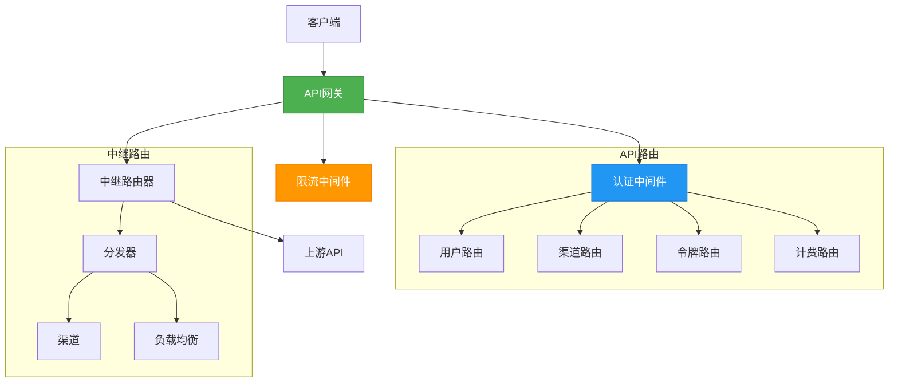
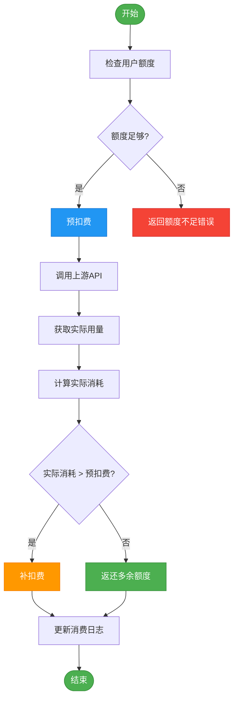
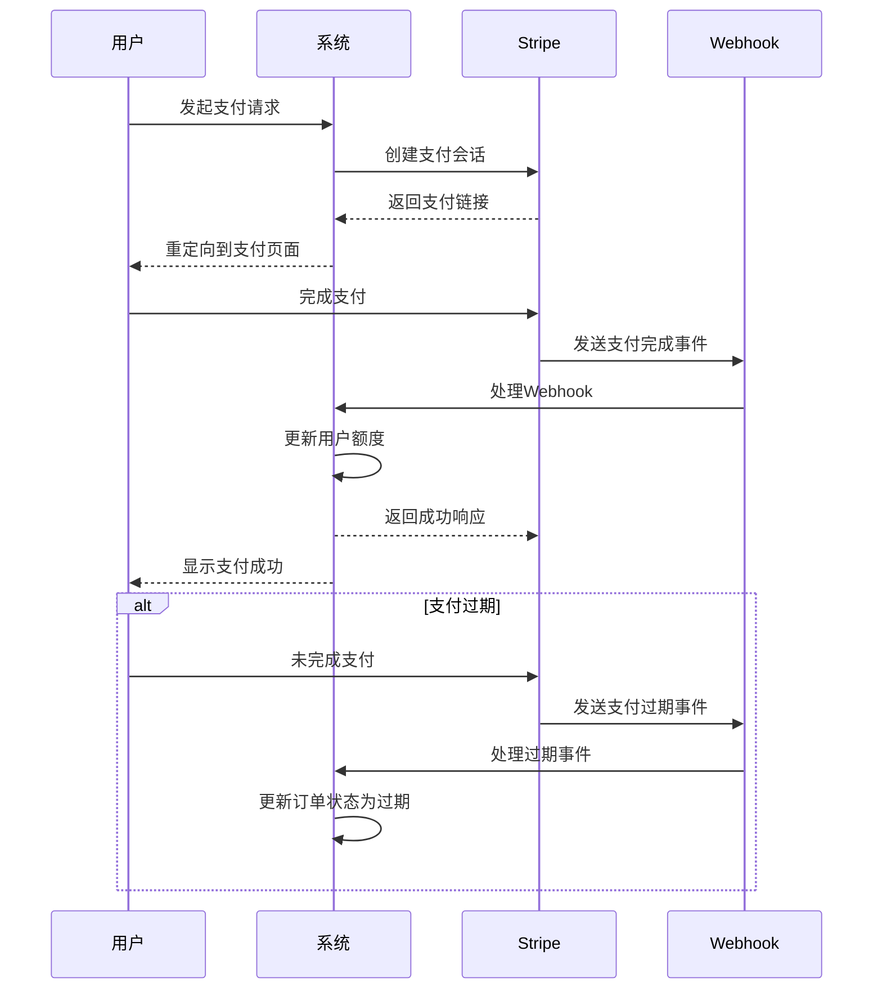
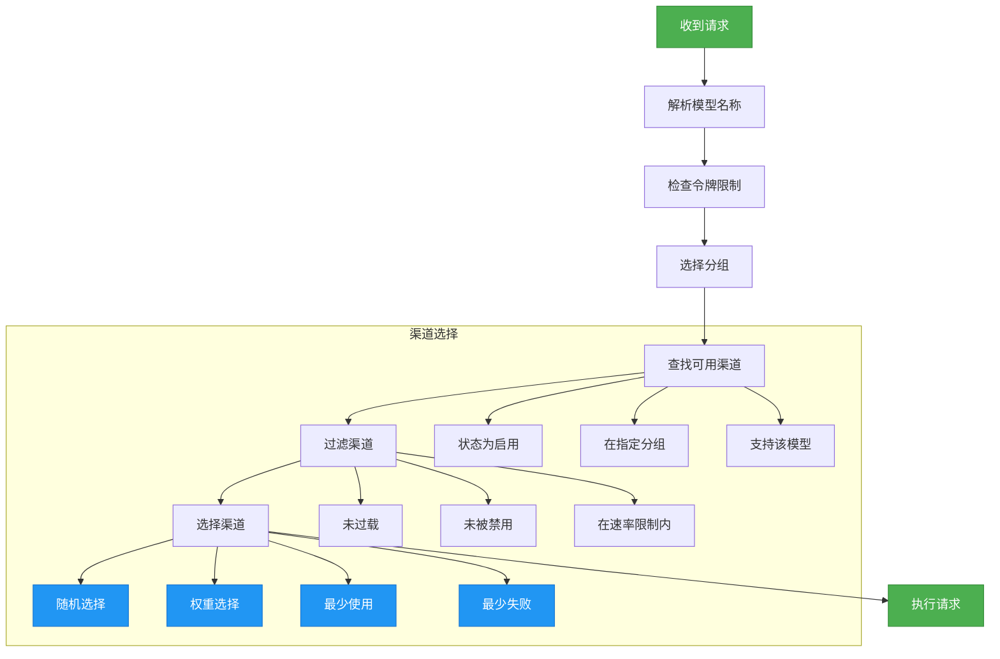

# 核心功能

<cite>
**本文档引用的文件**   
- [main.go](file://main.go)
- [router/main.go](file://router/main.go)
- [router/api-router.go](file://router/api-router.go)
- [router/relay-router.go](file://router/relay-router.go)
- [controller/user.go](file://controller/user.go)
- [controller/channel.go](file://controller/channel.go)
- [controller/billing.go](file://controller/billing.go)
- [controller/token.go](file://controller/token.go)
- [controller/topup_stripe.go](file://controller/topup_stripe.go)
- [service/quota.go](file://service/quota.go)
- [service/token_counter.go](file://service/token_counter.go)
- [middleware/distributor.go](file://middleware/distributor.go)
- [common/limiter/limiter.go](file://common/limiter/limiter.go)
- [setting/payment_stripe.go](file://setting/payment_stripe.go)
</cite>

## 目录
1. [API网关与路由](#api网关与路由)
2. [用户管理](#用户管理)
3. [渠道管理](#渠道管理)
4. [计费系统](#计费系统)
5. [配额与令牌系统](#配额与令牌系统)
6. [支付集成](#支付集成)
7. [智能路由与负载均衡](#智能路由与负载均衡)
8. [开发者扩展指南](#开发者扩展指南)

## API网关与路由

API网关是整个系统的核心入口，负责处理所有外部请求并将其路由到相应的后端服务。系统通过Gin框架构建了多层路由结构，实现了功能分离和安全控制。



**图源**
- [main.go](file://main.go#L1-L261)
- [router/main.go](file://router/main.go#L1-L34)
- [router/api-router.go](file://router/api-router.go#L1-L261)
- [router/relay-router.go](file://router/relay-router.go#L1-L206)

**API网关的主要功能包括：**
- **请求认证**：通过`middleware.UserAuth()`等中间件验证用户身份
- **速率限制**：使用`middleware.GlobalAPIRateLimit()`防止滥用
- **请求分发**：将不同路径的请求路由到相应的控制器
- **CORS支持**：允许跨域请求
- **GZIP压缩**：对响应进行压缩以提高传输效率

**API路由结构：**
- `/api`：管理API，用于用户、渠道、令牌等管理操作
- `/v1`：OpenAI兼容API，用于模型调用
- `/v1beta`：Gemini API，用于Google AI服务
- `/pg`：Playground路由，用于交互式测试

**Section sources**
- [main.go](file://main.go#L1-L261)
- [router/main.go](file://router/main.go#L1-L34)
- [router/api-router.go](file://router/api-router.go#L1-L261)
- [router/relay-router.go](file://router/relay-router.go#L1-L206)

## 用户管理

用户管理系统提供了完整的用户生命周期管理功能，包括注册、登录、权限控制和用户信息管理。

```mermaid
classDiagram
    class User {
        +int Id
        +string Username
        +string Password
        +string Email
        +int Role
        +int Status
        +string Group
        +int Quota
        +int UsedQuota
        +int RequestCount
        +string AffCode
        +int AffCount
        +int AffQuota
        +int InviterId
        +string Setting
        +string AccessToken
        +bool IsAdmin()
        +bool IsRoot()
        +bool IsDisabled()
        +bool IsBanned()
    }
    class UserController {
        +Login(c *gin.Context)
        +Logout(c *gin.Context)
        +Register(c *gin.Context)
        +GetSelf(c *gin.Context)
        +GetUser(c *gin.Context)
        +GetAllUsers(c *gin.Context)
        +UpdateUser(c *gin.Context)
        +DeleteUser(c *gin.Context)
        +GenerateAccessToken(c *gin.Context)
        +GetAffCode(c *gin.Context)
        +TransferAffQuota(c *gin.Context)
    }
    User --> UserController : "由控制器管理"
    note right of User
        "用户角色：<br/>- 普通用户 (1)<br/>- 管理员 (2)<br/>- 超级管理员 (3)"
    end
    note right of UserController
        "认证方式：<br/>- 密码登录<br/>- 第三方OAuth<br/>- 两步验证(2FA)<br/>- Passkey"
    end
```

**图源**
- [controller/user.go](file://controller/user.go#L1-L800)
- [model/user.go](file://model/user.go)

**用户管理核心功能：**
1. **身份认证**
   - 支持密码登录和注册
   - 集成GitHub、Discord、OIDC等第三方登录
   - 支持两步验证(2FA)和Passkey无密码登录
   - 邮箱验证功能

2. **权限控制**
   ```go
   func calculateUserPermissions(userRole int) map[string]interface{} {
       permissions := map[string]interface{}{}
       
       if userRole == common.RoleRootUser {
           permissions["sidebar_settings"] = false
       } else if userRole == common.RoleAdminUser {
           permissions["sidebar_settings"] = true
           permissions["sidebar_modules"] = map[string]interface{}{
               "admin": map[string]interface{}{
                   "setting": false, // 管理员不能访问系统设置
               },
           }
       } else {
           permissions["sidebar_settings"] = true
           permissions["sidebar_modules"] = map[string]interface{}{
               "admin": false, // 普通用户不能访问管理员区域
           }
       }
       
       return permissions
   }
   ```

3. **用户信息管理**
   - 获取用户信息（`GetSelf`）
   - 更新用户信息（`UpdateSelf`）
   - 生成访问令牌（`GenerateAccessToken`）
   - 推荐系统（`AffCode`）

**Section sources**
- [controller/user.go](file://controller/user.go#L1-L800)
- [model/user.go](file://model/user.go)

## 渠道管理

渠道管理系统是连接上游AI服务提供商的核心组件，负责管理各种AI服务渠道的配置、状态和性能。

```mermaid
classDiagram
class Channel {
+int Id
+string Name
+int Type
+string Key
+int Status
+int Weight
+int Priority
+int Group
+string BaseURL
+string Other
+int CreatedTime
+int UsedQuota
+ChannelInfo ChannelInfo
+ChannelSetting ChannelSetting
+GetNextEnabledKey() (string, int, *types.NewAPIError)
+ValidateSettings() error
+GetModels() []string
+GetBaseURL() string
}
class ChannelController {
+GetAllChannels(c *gin.Context)
+SearchChannels(c *gin.Context)
+GetChannel(c *gin.Context)
+AddChannel(c *gin.Context)
+UpdateChannel(c *gin.Context)
+DeleteChannel(c *gin.Context)
+TestChannel(c *gin.Context)
+FetchUpstreamModels(c *gin.Context)
+FixChannelsAbilities(c *gin.Context)
}
class ChannelInfo {
+bool IsMultiKey
+int MultiKeyMode
+int MultiKeySize
+int MultiKeyIndex
+*int MultiKeyDisabledTime
+*string MultiKeyDisabledReason
}
Channel --> ChannelInfo
Channel --> ChannelController : "由控制器管理"
note right of Channel
渠道类型：
- OpenAI (1)
- Azure (2)
- Claude (3)
- Gemini (4)
- 其他20+种
end
note right of ChannelInfo
多密钥模式：
- 轮询 (0)
- 随机 (1)
- 最少使用 (2)
- 最少失败 (3)
end
```

**图源**
- [controller/channel.go](file://controller/channel.go#L1-L800)
- [model/channel.go](file://model/channel.go)

**渠道管理核心功能：**
1. **渠道配置**
   - 支持单密钥和多密钥模式
   - 可配置基础URL和额外参数
   - 支持请求头和参数覆盖
   - 支持模型映射和分组管理

2. **渠道操作**
   ```go
   func AddChannel(c *gin.Context) {
       addChannelRequest := AddChannelRequest{}
       err := c.ShouldBindJSON(&addChannelRequest)
       if err != nil {
           common.ApiError(c, err)
           return
       }
       
       // 使用统一的校验函数
       if err := validateChannel(addChannelRequest.Channel, true); err != nil {
           c.JSON(http.StatusOK, gin.H{
               "success": false,
               "message": err.Error(),
           })
           return
       }
       
       // 处理不同模式的渠道添加
       switch addChannelRequest.Mode {
       case "multi_to_single":
           // 多密钥转单密钥
       case "batch":
           // 批量添加
       case "single":
           // 单密钥添加
       default:
           c.JSON(http.StatusOK, gin.H{
               "success": false,
               "message": "不支持的添加模式",
           })
           return
       }
       
       err = model.BatchInsertChannels(channels)
       if err != nil {
           common.ApiError(c, err)
           return
       }
       
       service.ResetProxyClientCache()
       c.JSON(http.StatusOK, gin.H{
           "success": true,
           "message": "",
       })
   }
   ```

3. **渠道测试与监控**
   - 单个渠道测试（`TestChannel`）
   - 所有渠道批量测试（`AutomaticallyTestChannels`）
   - 获取上游模型列表（`FetchUpstreamModels`）
   - 修复渠道能力（`FixChannelsAbilities`）

**Section sources**
- [controller/channel.go](file://controller/channel.go#L1-L800)
- [model/channel.go](file://model/channel.go)

## 计费系统

计费系统实现了完整的额度管理和消费记录功能，支持多种计费模式和额度计算方式。



**图源**
- [service/quota.go](file://service/quota.go#L1-L582)
- [service/token_counter.go](file://service/token_counter.go#L1-L453)

**计费系统核心功能：**
1. **额度计算**
   - 支持基于token数量和价格的两种计费模式
   - 不同模型有不同的倍率设置
   - 支持分组倍率和用户组倍率
   - 支持音频、视频等多媒体token计算

2. **消费流程**
   ```go
   func PostConsumeQuota(relayInfo *relaycommon.RelayInfo, quota int, preConsumedQuota int, sendEmail bool) (err error) {
       if quota > 0 {
           err = model.DecreaseUserQuota(relayInfo.UserId, quota)
       } else {
           err = model.IncreaseUserQuota(relayInfo.UserId, -quota, false)
       }
       if err != nil {
           return err
       }
       
       if !relayInfo.IsPlayground {
           if quota > 0 {
               err = model.DecreaseTokenQuota(relayInfo.TokenId, relayInfo.TokenKey, quota)
           } else {
               err = model.IncreaseTokenQuota(relayInfo.TokenId, relayInfo.TokenKey, -quota)
           }
           if err != nil {
               return err
           }
       }
       
       if sendEmail {
           if (quota + preConsumedQuota) != 0 {
               checkAndSendQuotaNotify(relayInfo, quota, preConsumedQuota)
           }
       }
       
       return nil
   }
   ```

3. **OpenAI兼容接口**
   - 订阅信息接口（`/v1/dashboard/billing/subscription`）
   - 使用量接口（`/v1/dashboard/billing/usage`）
   - 支持多种额度显示类型（USD、CNY、TOKENS）

**Section sources**
- [service/quota.go](file://service/quota.go#L1-L582)
- [service/token_counter.go](file://service/token_counter.go#L1-L453)
- [controller/billing.go](file://controller/billing.go#L1-L109)

## 配额与令牌系统

配额与令牌系统是API访问控制的核心，实现了细粒度的访问权限管理和额度控制。

```mermaid
classDiagram
class Token {
+int Id
+int UserId
+string Name
+string Key
+int CreatedTime
+int AccessedTime
+int ExpiredTime
+int RemainQuota
+int UsedQuota
+bool UnlimitedQuota
+bool ModelLimitsEnabled
+string ModelLimits
+string AllowIps
+string Group
+bool CrossGroupRetry
+int Status
+GetModelLimitsMap() map[string]bool
+Insert() error
+Update() error
+Delete() error
}
class TokenController {
+GetAllTokens(c *gin.Context)
+SearchTokens(c *gin.Context)
+GetToken(c *gin.Context)
+AddToken(c *gin.Context)
+UpdateToken(c *gin.Context)
+DeleteToken(c *gin.Context)
+DeleteTokenBatch(c *gin.Context)
+GetTokenStatus(c *gin.Context)
+GetTokenUsage(c *gin.Context)
}
Token --> TokenController : "由控制器管理"
note right of Token
令牌状态：
- 启用 (1)
- 禁用 (2)
- 过期 (3)
- 额度用尽 (4)
end
note right of Token
令牌功能：
- 无限额度
- 模型限制
- IP限制
- 分组限制
- 跨分组重试
end
```

**图源**
- [controller/token.go](file://controller/token.go#L1-L292)
- [model/token.go](file://model/token.go)

**配额与令牌系统核心功能：**
1. **令牌管理**
   - 创建令牌（`AddToken`）
   - 更新令牌（`UpdateToken`）
   - 删除令牌（`DeleteToken`）
   - 批量操作（`DeleteTokenBatch`）
   - 令牌状态查询（`GetTokenStatus`）

2. **令牌创建流程**
   ```go
   func AddToken(c *gin.Context) {
       token := model.Token{}
       err := c.ShouldBindJSON(&token)
       if err != nil {
           common.ApiError(c, err)
           return
       }
       if len(token.Name) > 50 {
           c.JSON(http.StatusOK, gin.H{
               "success": false,
               "message": "令牌名称过长",
           })
           return
       }
       
       key, err := common.GenerateKey()
       if err != nil {
           c.JSON(http.StatusOK, gin.H{
               "success": false,
               "message": "生成令牌失败",
           })
           common.SysLog("failed to generate token key: " + err.Error())
           return
       }
       
       cleanToken := model.Token{
           UserId:             c.GetInt("id"),
           Name:               token.Name,
           Key:                key,
           CreatedTime:        common.GetTimestamp(),
           AccessedTime:       common.GetTimestamp(),
           ExpiredTime:        token.ExpiredTime,
           RemainQuota:        token.RemainQuota,
           UnlimitedQuota:     token.UnlimitedQuota,
           ModelLimitsEnabled: token.ModelLimitsEnabled,
           ModelLimits:        token.ModelLimits,
           AllowIps:           token.AllowIps,
           Group:              token.Group,
           CrossGroupRetry:    token.CrossGroupRetry,
       }
       
       err = cleanToken.Insert()
       if err != nil {
           common.ApiError(c, err)
           return
       }
       
       c.JSON(http.StatusOK, gin.H{
           "success": true,
           "message": "",
       })
   }
   ```

3. **高级功能**
   - 模型限制：限制令牌只能访问特定模型
   - IP限制：限制令牌只能从特定IP地址访问
   - 分组限制：限制令牌只能在特定分组中使用
   - 跨分组重试：在主分组失败时是否尝试其他分组

**Section sources**
- [controller/token.go](file://controller/token.go#L1-L292)
- [model/token.go](file://model/token.go)

## 支付集成

支付集成系统支持多种支付方式，包括Stripe和易支付，实现了完整的支付流程和Webhook处理。



**图源**
- [controller/topup_stripe.go](file://controller/topup_stripe.go#L1-L289)
- [setting/payment_stripe.go](file://setting/payment_stripe.go#L1-L9)

**支付集成核心功能：**
1. **Stripe支付**
   - 请求支付金额（`RequestStripeAmount`）
   - 发起支付（`RequestStripePay`）
   - Webhook处理（`StripeWebhook`）
   - 支付会话完成处理（`sessionCompleted`）
   - 支付会话过期处理（`sessionExpired`）

2. **支付流程**
   ```go
   func RequestStripePay(c *gin.Context) {
       var req StripePayRequest
       err := c.ShouldBindJSON(&req)
       if err != nil {
           c.JSON(200, gin.H{"message": "error", "data": "参数错误"})
           return
       }
       stripeAdaptor.RequestPay(c, &req)
   }
   
   func (*StripeAdaptor) RequestPay(c *gin.Context, req *StripePayRequest) {
       if req.PaymentMethod != PaymentMethodStripe {
           c.JSON(200, gin.H{"message": "error", "data": "不支持的支付渠道"})
           return
       }
       
       id := c.GetInt("id")
       user, _ := model.GetUserById(id, false)
       chargedMoney := GetChargedAmount(float64(req.Amount), *user)
       
       reference := fmt.Sprintf("new-api-ref-%d-%d-%s", user.Id, time.Now().UnixMilli(), randstr.String(4))
       referenceId := "ref_" + common.Sha1([]byte(reference))
       
       payLink, err := genStripeLink(referenceId, user.StripeCustomer, user.Email, req.Amount)
       if err != nil {
           log.Println("获取Stripe Checkout支付链接失败", err)
           c.JSON(200, gin.H{"message": "error", "data": "拉起支付失败"})
           return
       }
       
       topUp := &model.TopUp{
           UserId:        id,
           Amount:        req.Amount,
           Money:         chargedMoney,
           TradeNo:       referenceId,
           PaymentMethod: PaymentMethodStripe,
           CreateTime:    time.Now().Unix(),
           Status:        common.TopUpStatusPending,
       }
       
       err = topUp.Insert()
       if err != nil {
           c.JSON(200, gin.H{"message": "error", "data": "创建订单失败"})
           return
       }
       
       c.JSON(200, gin.H{
           "message": "success",
           "data": gin.H{
               "pay_link": payLink,
           },
       })
   }
   ```

3. **Webhook处理**
   - 验证Webhook签名
   - 处理支付完成事件
   - 处理支付过期事件
   - 更新订单状态和用户额度

**Section sources**
- [controller/topup_stripe.go](file://controller/topup_stripe.go#L1-L289)
- [setting/payment_stripe.go](file://setting/payment_stripe.go#L1-L9)

## 智能路由与负载均衡

智能路由与负载均衡系统是API网关的核心组件，负责将请求智能地分发到最合适的渠道。



**图源**
- [middleware/distributor.go](file://middleware/distributor.go#L1-L392)
- [service/channel_select.go](file://service/channel_select.go)

**智能路由核心功能：**
1. **请求分发**
   - 根据请求路径和方法确定中继模式
   - 解析模型名称和分组信息
   - 处理特殊API（如Gemini、Midjourney）

2. **渠道选择逻辑**
   ```go
   func Distribute() func(c *gin.Context) {
       return func(c *gin.Context) {
           var channel *model.Channel
           channelId, ok := common.GetContextKey(c, constant.ContextKeyTokenSpecificChannelId)
           modelRequest, shouldSelectChannel, err := getModelRequest(c)
           if err != nil {
               abortWithOpenAiMessage(c, http.StatusBadRequest, "Invalid request, "+err.Error())
               return
           }
           
           if ok {
               // 使用指定渠道
           } else {
               // 智能选择渠道
               channel, selectGroup, err = service.CacheGetRandomSatisfiedChannel(&service.RetryParam{
                   Ctx:        c,
                   ModelName:  modelRequest.Model,
                   TokenGroup: usingGroup,
                   Retry:      common.GetPointer(0),
               })
           }
           
           SetupContextForSelectedChannel(c, channel, modelRequest.Model)
           c.Next()
       }
   }
   ```

3. **负载均衡策略**
   - 轮询（Round Robin）
   - 随机（Random）
   - 最少使用（Least Used）
   - 最少失败（Least Failed）
   - 权重（Weighted）

**Section sources**
- [middleware/distributor.go](file://middleware/distributor.go#L1-L392)
- [service/channel_select.go](file://service/channel_select.go)

## 开发者扩展指南

本指南为开发者提供了扩展和定制系统功能的指导。

### 扩展API路由
要添加新的API端点，需要在`router/api-router.go`中注册路由，并在相应的控制器中实现处理函数。

```go
// 在 router/api-router.go 中添加路由
apiRouter.GET("/custom/endpoint", middleware.UserAuth(), controller.CustomEndpoint)

// 在 controller/custom.go 中实现处理函数
func CustomEndpoint(c *gin.Context) {
    // 实现自定义逻辑
    c.JSON(http.StatusOK, gin.H{
        "success": true,
        "message": "Custom endpoint response",
    })
}
```

### 自定义计费逻辑
可以通过修改`service/quota.go`中的`calculateAudioQuota`函数来自定义计费逻辑。

```go
func calculateAudioQuota(info QuotaInfo) int {
    // 自定义计费逻辑
    if info.UsePrice {
        // 基于价格的计费
    } else {
        // 基于倍率的计费
    }
    return quota
}
```

### 添加新的支付方式
要添加新的支付方式，需要实现支付适配器接口，并在`controller/topup.go`中注册。

```go
type PaymentAdaptor interface {
    RequestAmount(c *gin.Context, req *TopupRequest)
    RequestPay(c *gin.Context, req *TopupRequest)
}

// 在 controller/topup.go 中注册新的支付方式
func RequestCustomPay(c *gin.Context) {
    var req TopupRequest
    err := c.ShouldBindJSON(&req)
    if err != nil {
        c.JSON(200, gin.H{"message": "error", "data": "参数错误"})
        return
    }
    customAdaptor.RequestPay(c, &req)
}
```

**Section sources**
- [router/api-router.go](file://router/api-router.go#L1-L261)
- [service/quota.go](file://service/quota.go#L1-L582)
- [controller/topup.go](file://controller/topup.go)