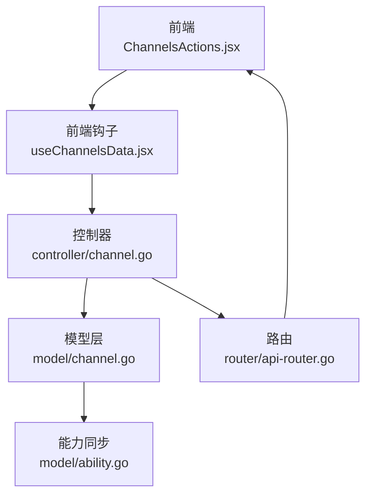
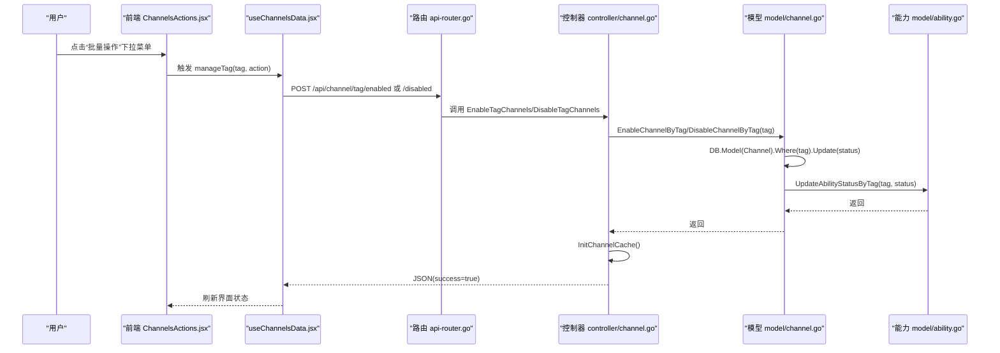
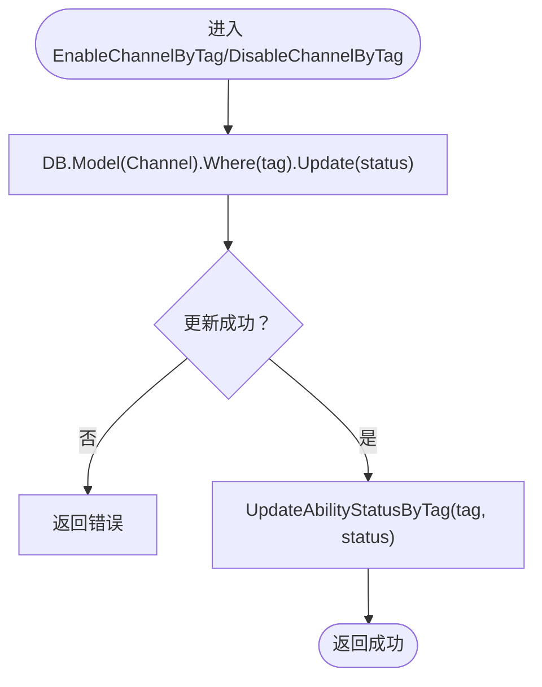
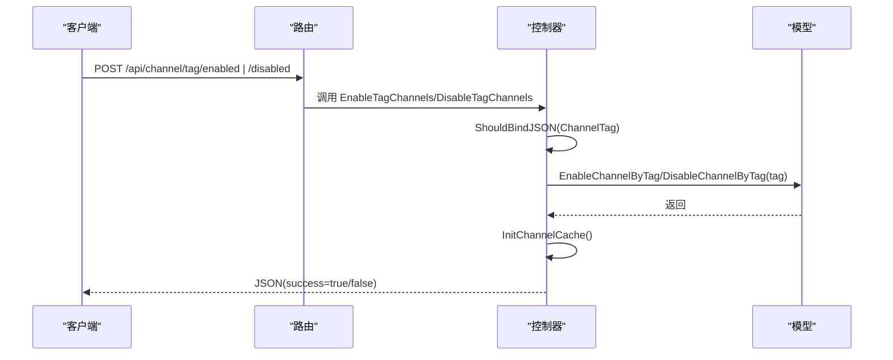
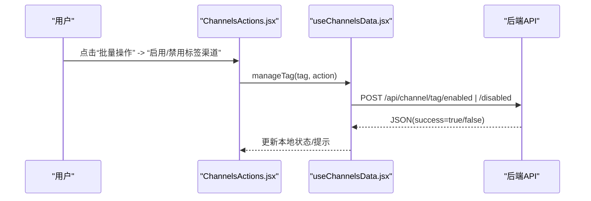
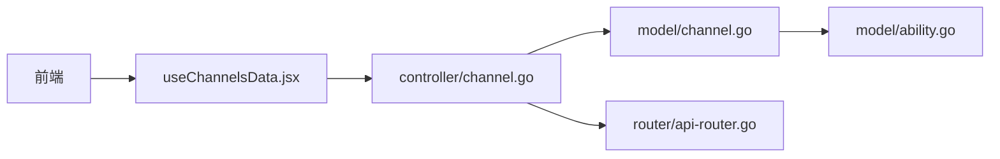

# 基于标签的批量启用/禁用

<cite>
**本文引用的文件**
- [channel.go](file://model/channel.go)
- [ability.go](file://model/ability.go)
- [channel.go](file://controller/channel.go)
- [api-router.go](file://router/api-router.go)
- [ChannelsActions.jsx](file://web/src/components/table/channels/ChannelsActions.jsx)
- [useChannelsData.jsx](file://web/src/hooks/channels/useChannelsData.jsx)
- [api.json](file://docs/openapi/api.json)
</cite>

## 目录
1. [简介](#简介)
2. [项目结构与角色定位](#项目结构与角色定位)
3. [核心组件与职责](#核心组件与职责)
4. [架构总览](#架构总览)
5. [详细组件分析](#详细组件分析)
6. [依赖关系分析](#依赖关系分析)
7. [性能特性与优化](#性能特性与优化)
8. [最佳实践与使用场景](#最佳实践与使用场景)
9. [故障排查指南](#故障排查指南)
10. [结论](#结论)

## 简介
本文件围绕“基于标签的批量启用/禁用”能力，系统性阐述以下内容：
- EnableChannelByTag 与 DisableChannelByTag 的实现机制与调用链
- 如何通过标签字段批量更新渠道状态，并联动调用 UpdateAbilityStatusByTag 同步更新能力状态
- 数据库层的批量更新策略与事务保障
- 前端 ChannelsActions 组件通过下拉菜单触发操作的交互流程
- 控制器 DisableTagChannels 与 EnableTagChannels 的请求处理逻辑
- 最佳实践、性能考量与常见使用场景建议

## 项目结构与角色定位
- 后端模型层：负责数据库操作与业务规则（渠道状态、能力表同步）
- 控制器层：接收前端请求，参数校验，调用模型层方法，返回响应
- 路由层：定义 /api/channel/tag/enabled 与 /api/channel/tag/disabled 接口
- 前端：ChannelsActions 提供批量操作入口；useChannelsData 负责与后端交互与状态更新

图表来源
- [channel.go](file://controller/channel.go#L712-L756)
- [channel.go](file://model/channel.go#L679-L695)
- [ability.go](file://model/ability.go#L263-L283)
- [api-router.go](file://router/api-router.go#L140-L160)
- [ChannelsActions.jsx](file://web/src/components/table/channels/ChannelsActions.jsx#L1-L284)
- [useChannelsData.jsx](file://web/src/hooks/channels/useChannelsData.jsx#L458-L486)

章节来源
- [channel.go](file://controller/channel.go#L712-L756)
- [channel.go](file://model/channel.go#L679-L695)
- [ability.go](file://model/ability.go#L263-L283)
- [api-router.go](file://router/api-router.go#L140-L160)
- [ChannelsActions.jsx](file://web/src/components/table/channels/ChannelsActions.jsx#L1-L284)
- [useChannelsData.jsx](file://web/src/hooks/channels/useChannelsData.jsx#L458-L486)

## 核心组件与职责
- EnableChannelByTag / DisableChannelByTag
  - 批量更新渠道状态（按 tag 字段）
  - 成功后调用 UpdateAbilityStatusByTag 同步能力表 enabled 字段
- UpdateAbilityStatusByTag
  - 批量更新能力表的 enabled 字段（按 tag）
- 控制器 DisableTagChannels / EnableTagChannels
  - 参数绑定与校验
  - 调用模型层方法
  - 触发缓存初始化
  - 返回统一响应
- 路由
  - 定义 /api/channel/tag/enabled 与 /api/channel/tag/disabled
- 前端 ChannelsActions
  - 提供“批量操作”下拉菜单入口
  - 通过 useChannelsData.jsx 发起 API 请求
- OpenAPI 文档
  - 明确接口请求体包含 tag 字段

章节来源
- [channel.go](file://model/channel.go#L679-L695)
- [ability.go](file://model/ability.go#L263-L283)
- [channel.go](file://controller/channel.go#L712-L756)
- [api-router.go](file://router/api-router.go#L140-L160)
- [ChannelsActions.jsx](file://web/src/components/table/channels/ChannelsActions.jsx#L1-L284)
- [useChannelsData.jsx](file://web/src/hooks/channels/useChannelsData.jsx#L458-L486)
- [api.json](file://docs/openapi/api.json#L3079-L3148)

## 架构总览
从用户点击到数据库更新与能力表同步的完整链路如下：

图表来源
- [ChannelsActions.jsx](file://web/src/components/table/channels/ChannelsActions.jsx#L1-L284)
- [useChannelsData.jsx](file://web/src/hooks/channels/useChannelsData.jsx#L458-L486)
- [api-router.go](file://router/api-router.go#L140-L160)
- [channel.go](file://controller/channel.go#L712-L756)
- [channel.go](file://model/channel.go#L679-L695)
- [ability.go](file://model/ability.go#L263-L283)

## 详细组件分析

### 模型层：EnableChannelByTag 与 DisableChannelByTag
- 功能要点
  - 通过 GORM Model 对 Channel 表执行批量更新，条件为 tag 等于指定值，设置 status 字段为目标状态
  - 成功后调用 UpdateAbilityStatusByTag(tag, status)，将能力表 abilities 中对应 tag 的 enabled 字段更新为相同状态
- 错误处理
  - 若数据库更新失败，立即返回错误，不继续后续步骤
- 并发与一致性
  - 该批处理在单次调用内完成，未显式使用事务包裹两个步骤，但通常数据库更新与能力表更新均在同一事务或原子性保证下执行

图表来源
- [channel.go](file://model/channel.go#L679-L695)
- [ability.go](file://model/ability.go#L263-L283)

章节来源
- [channel.go](file://model/channel.go#L679-L695)
- [ability.go](file://model/ability.go#L263-L283)

### 能力表同步：UpdateAbilityStatusByTag
- 功能要点
  - 通过 GORM Model 对 Ability 表执行批量更新，条件为 tag 等于指定值，设置 enabled 字段为目标状态
- 适用场景
  - 与 EnableChannelByTag/DisableChannelByTag 协同，确保渠道状态变更后，下游能力匹配也同步生效

章节来源
- [ability.go](file://model/ability.go#L263-L283)

### 控制器：DisableTagChannels 与 EnableTagChannels
- 功能要点
  - 从请求体绑定 ChannelTag 结构，要求 tag 非空
  - 调用模型层 EnableChannelByTag/DisableChannelByTag
  - 初始化渠道缓存
  - 返回统一 JSON 响应
- 错误处理
  - 参数非法或模型层返回错误时，通过统一错误封装返回

图表来源
- [channel.go](file://controller/channel.go#L712-L756)
- [api-router.go](file://router/api-router.go#L140-L160)

章节来源
- [channel.go](file://controller/channel.go#L712-L756)
- [api-router.go](file://router/api-router.go#L140-L160)

### 前端：ChannelsActions 与 useChannelsData
- 功能要点
  - ChannelsActions 提供“批量操作”下拉菜单，其中包含“启用标签渠道/禁用标签渠道”
  - useChannelsData.jsx 在用户确认后，向 /api/channel/tag/enabled 或 /disabled 发起 POST 请求
  - 成功后本地更新渠道状态，提升用户体验
- 交互细节
  - 通过 Modal.confirm 弹窗确认
  - manageTag(tag, action) 分发不同动作
  - 成功后刷新渠道列表或局部更新状态

图表来源
- [ChannelsActions.jsx](file://web/src/components/table/channels/ChannelsActions.jsx#L1-L284)
- [useChannelsData.jsx](file://web/src/hooks/channels/useChannelsData.jsx#L458-L486)

章节来源
- [ChannelsActions.jsx](file://web/src/components/table/channels/ChannelsActions.jsx#L1-L284)
- [useChannelsData.jsx](file://web/src/hooks/channels/useChannelsData.jsx#L458-L486)

### OpenAPI 文档与接口定义
- 接口路径
  - POST /api/channel/tag/enabled
  - POST /api/channel/tag/disabled
- 请求体
  - 包含字段 tag（字符串），用于标识要批量启用/禁用的渠道集合
- 权限
  - 需要管理员权限

章节来源
- [api.json](file://docs/openapi/api.json#L3079-L3148)

## 依赖关系分析
- 控制器依赖模型层
  - EnableTagChannels/DisableTagChannels 调用 EnableChannelByTag/DisableChannelByTag
- 模型层依赖能力模块
  - EnableChannelByTag/DisableChannelByTag 调用 UpdateAbilityStatusByTag
- 路由层依赖控制器
  - 定义 /api/channel/tag/* 路由并绑定到对应控制器方法
- 前端依赖路由与控制器
  - 通过 useChannelsData.jsx 调用 /api/channel/tag/enabled | /disabled

图表来源
- [channel.go](file://controller/channel.go#L712-L756)
- [channel.go](file://model/channel.go#L679-L695)
- [ability.go](file://model/ability.go#L263-L283)
- [api-router.go](file://router/api-router.go#L140-L160)
- [useChannelsData.jsx](file://web/src/hooks/channels/useChannelsData.jsx#L458-L486)

章节来源
- [channel.go](file://controller/channel.go#L712-L756)
- [channel.go](file://model/channel.go#L679-L695)
- [ability.go](file://model/ability.go#L263-L283)
- [api-router.go](file://router/api-router.go#L140-L160)
- [useChannelsData.jsx](file://web/src/hooks/channels/useChannelsData.jsx#L458-L486)

## 性能特性与优化
- 数据库批量更新
  - EnableChannelByTag/DisableChannelByTag 使用 GORM Model 的 Where(...).Update(...) 实现对满足 tag 条件的所有渠道一次性更新状态，避免逐条循环更新，显著降低网络往返与 SQL 执行次数
- 能力表同步
  - UpdateAbilityStatusByTag 同样采用批量更新，按 tag 条件更新能力表 enabled 字段，保持渠道状态与能力匹配的一致性
- 缓存与一致性
  - 控制器在更新完成后调用 InitChannelCache，确保后续读取与缓存一致
- 前端体验
  - 前端在成功后即时更新本地状态，减少等待时间

章节来源
- [channel.go](file://model/channel.go#L679-L695)
- [ability.go](file://model/ability.go#L263-L283)
- [channel.go](file://controller/channel.go#L712-L756)

## 最佳实践与使用场景
- 使用场景建议
  - 当需要对某一类渠道（如按供应商、地区、模型组等）进行统一启停时，优先使用基于标签的批量操作
  - 在大规模调整渠道可用性时，避免逐条更新，使用标签批量启用/禁用可显著提升效率
- 参数与安全
  - 确保请求体包含有效的 tag，避免误操作
  - 在生产环境谨慎使用批量禁用，建议配合监控与回滚预案
- 一致性与可观测性
  - 批量操作后及时检查能力表 enabled 字段是否同步更新
  - 关注 InitChannelCache 是否生效，避免缓存不一致导致的状态异常
- 前端交互
  - 建议在批量操作前进行二次确认弹窗，防止误触
  - 成功后提供明确的反馈信息与自动刷新

## 故障排查指南
- 常见问题
  - 参数错误：请求体缺少 tag 或格式不正确
  - 数据库更新失败：可能由于约束冲突或连接异常
  - 能力表未同步：检查 UpdateAbilityStatusByTag 是否被调用
  - 缓存未刷新：确认控制器是否调用了 InitChannelCache
- 排查步骤
  - 检查 OpenAPI 文档与路由定义，确认请求路径与请求体结构
  - 查看控制器日志与错误响应
  - 校验数据库中 Channel 与 Ability 表的 tag 字段是否一致
  - 验证前端是否收到成功响应并触发了本地状态更新

章节来源
- [api-router.go](file://router/api-router.go#L140-L160)
- [channel.go](file://controller/channel.go#L712-L756)
- [channel.go](file://model/channel.go#L679-L695)
- [ability.go](file://model/ability.go#L263-L283)
- [api.json](file://docs/openapi/api.json#L3079-L3148)

## 结论
基于标签的批量启用/禁用通过“模型层批量更新 + 能力表同步”的方式，实现了高效、一致的渠道状态管理。前端通过下拉菜单与确认弹窗提供了友好的交互体验，控制器与路由层则保证了请求处理的规范性与安全性。结合本文的最佳实践与排障建议，可在生产环境中稳定地使用该能力进行大规模渠道治理。