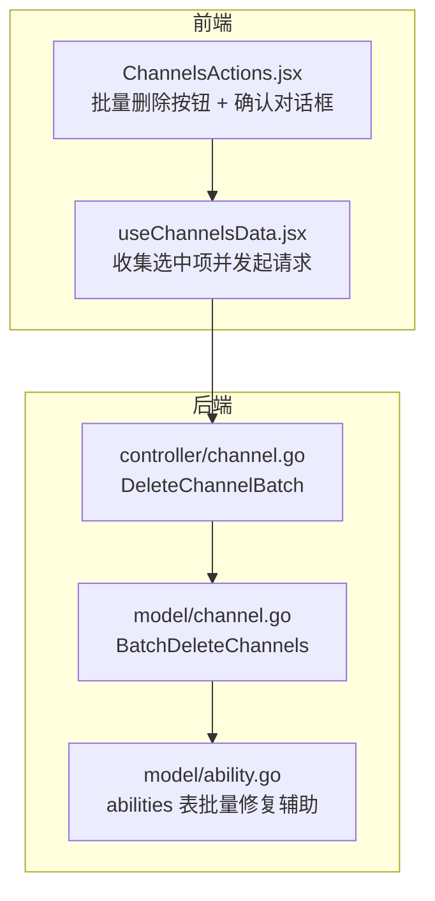
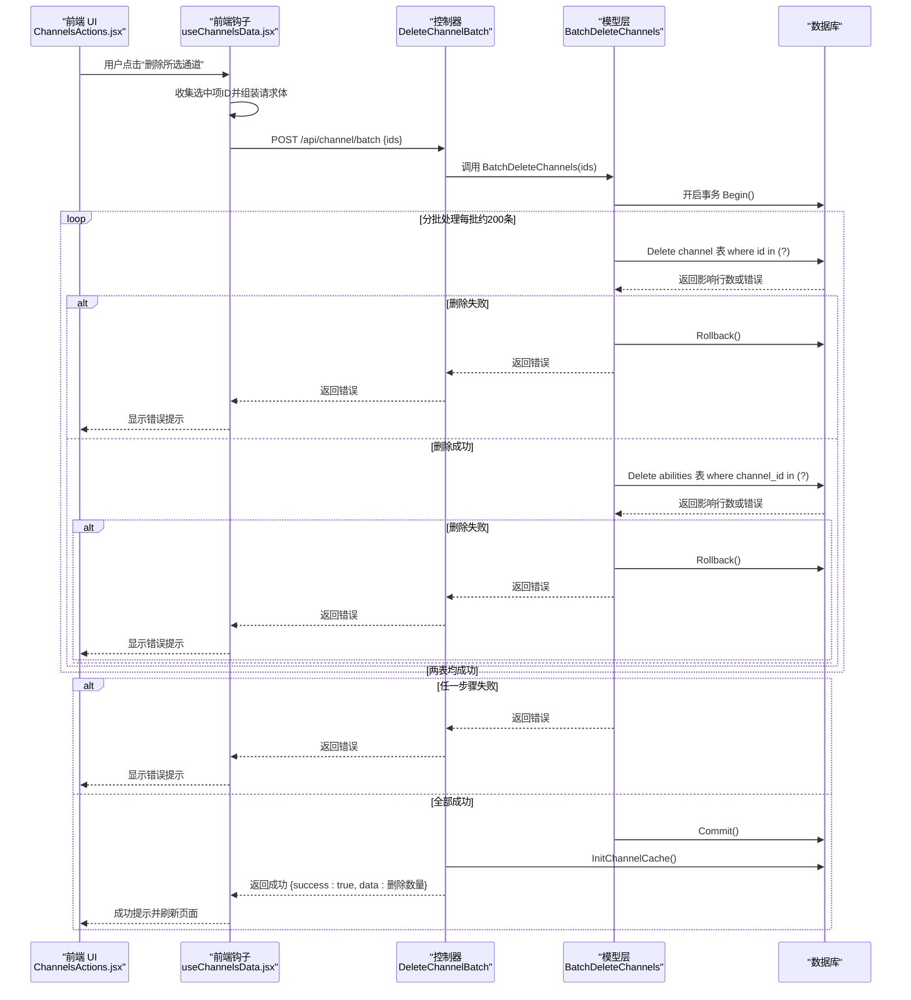
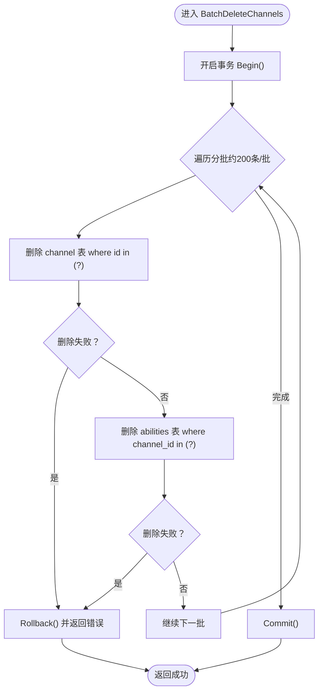
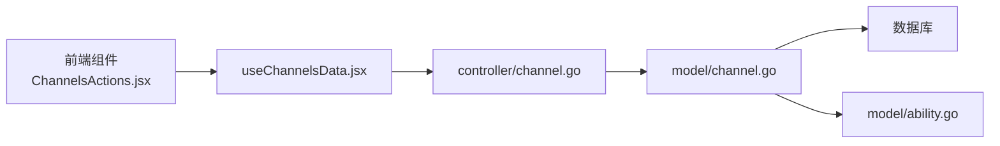

# 批量删除

<cite>
**本文引用的文件**
- [controller/channel.go](file://controller/channel.go)
- [model/channel.go](file://model/channel.go)
- [web/src/components/table/channels/ChannelsActions.jsx](file://web/src/components/table/channels/ChannelsActions.jsx)
- [web/src/hooks/channels/useChannelsData.jsx](file://web/src/hooks/channels/useChannelsData.jsx)
- [model/ability.go](file://model/ability.go)
</cite>

## 目录
1. [简介](#简介)
2. [项目结构](#项目结构)
3. [核心组件](#核心组件)
4. [架构总览](#架构总览)
5. [详细组件分析](#详细组件分析)
6. [依赖关系分析](#依赖关系分析)
7. [性能考量与优化建议](#性能考量与优化建议)
8. [故障排查指南](#故障排查指南)
9. [结论](#结论)

## 简介
本文件围绕“批量删除渠道”功能进行系统化说明，重点涵盖：
- 后端 BatchDeleteChannels 函数的实现机制：事务、分批删除、回滚策略
- 前端 ChannelsActions 组件中批量删除按钮的交互逻辑与防误操作设计
- 删除操作失败时的错误回滚策略
- 性能优化建议与使用注意事项（事务大小、批量处理）

## 项目结构
该功能涉及后端控制器、模型层、以及前端交互层三部分协作：
- 控制器负责接收请求、参数校验、调用模型层执行批量删除，并在成功后刷新缓存
- 模型层负责在单个事务内分批删除 channel 表与 abilities 表数据，并在任一步骤失败时回滚
- 前端通过 ChannelsActions 组件提供批量删除入口，配合确认对话框降低误操作风险；useChannelsData 钩子负责收集选中项并发起请求

图表来源
- [controller/channel.go](file://controller/channel.go#L810-L837)
- [model/channel.go](file://model/channel.go#L384-L404)
- [web/src/components/table/channels/ChannelsActions.jsx](file://web/src/components/table/channels/ChannelsActions.jsx#L31-L87)
- [web/src/hooks/channels/useChannelsData.jsx](file://web/src/hooks/channels/useChannelsData.jsx#L665-L689)
- [model/ability.go](file://model/ability.go#L294-L341)

章节来源
- [controller/channel.go](file://controller/channel.go#L810-L837)
- [model/channel.go](file://model/channel.go#L384-L404)
- [web/src/components/table/channels/ChannelsActions.jsx](file://web/src/components/table/channels/ChannelsActions.jsx#L31-L87)
- [web/src/hooks/channels/useChannelsData.jsx](file://web/src/hooks/channels/useChannelsData.jsx#L665-L689)

## 核心组件
- 后端控制器 DeleteChannelBatch：接收前端传入的批量 ID 列表，调用模型层执行删除，成功后刷新渠道缓存
- 模型层 BatchDeleteChannels：在单个事务中分批删除 channel 表与 abilities 表，任一步骤失败即回滚
- 前端 ChannelsActions：提供批量删除按钮与确认对话框，避免误删
- 前端 useChannelsData：收集选中项，组装请求体，处理响应与页面刷新

章节来源
- [controller/channel.go](file://controller/channel.go#L810-L837)
- [model/channel.go](file://model/channel.go#L384-L404)
- [web/src/components/table/channels/ChannelsActions.jsx](file://web/src/components/table/channels/ChannelsActions.jsx#L31-L87)
- [web/src/hooks/channels/useChannelsData.jsx](file://web/src/hooks/channels/useChannelsData.jsx#L665-L689)

## 架构总览
下面的序列图展示了从前端点击到后端完成删除的完整流程，包括事务与回滚的关键节点。

图表来源
- [controller/channel.go](file://controller/channel.go#L810-L837)
- [model/channel.go](file://model/channel.go#L384-L404)
- [web/src/components/table/channels/ChannelsActions.jsx](file://web/src/components/table/channels/ChannelsActions.jsx#L31-L87)
- [web/src/hooks/channels/useChannelsData.jsx](file://web/src/hooks/channels/useChannelsData.jsx#L665-L689)

## 详细组件分析

### 后端：BatchDeleteChannels 实现机制与回滚策略
- 事务与分批
  - 在单个事务中执行删除，确保 channel 与 abilities 两表的一致性
  - 使用分批（每批约200条）以平衡内存占用与吞吐
- 删除顺序
  - 先删除 channel 表，再删除 abilities 表
  - 任一步骤失败立即回滚，保证原子性
- 错误处理
  - 任一删除失败会触发回滚并返回错误给上层
  - 控制器收到错误后通过统一错误接口返回给前端

图表来源
- [model/channel.go](file://model/channel.go#L384-L404)

章节来源
- [model/channel.go](file://model/channel.go#L384-L404)

### 后端：DeleteChannelBatch 控制器
- 参数校验：要求请求体包含非空 ids 数组
- 调用模型层执行批量删除
- 成功后刷新渠道缓存，确保前端后续查询可见最新状态
- 失败时通过统一错误接口返回

章节来源
- [controller/channel.go](file://controller/channel.go#L810-L837)

### 前端：ChannelsActions 批量删除按钮与确认对话框
- 交互逻辑
  - 当未开启批量删除开关或未选中任何项时，按钮置灰不可用
  - 点击按钮弹出确认对话框，二次确认后才调用批量删除钩子
- 防误操作设计
  - 通过 Modal.confirm 强制用户显式确认
  - 仅在选中项存在时允许点击，避免空请求

章节来源
- [web/src/components/table/channels/ChannelsActions.jsx](file://web/src/components/table/channels/ChannelsActions.jsx#L31-L87)

### 前端：useChannelsData 批量删除钩子
- 数据准备：遍历选中项，提取 id 组成数组
- 请求发送：POST /api/channel/batch
- 结果处理：成功显示删除数量并刷新页面；失败显示错误消息
- 页面刷新：根据当前页与数据情况自动调整页码

章节来源
- [web/src/hooks/channels/useChannelsData.jsx](file://web/src/hooks/channels/useChannelsData.jsx#L665-L689)

### 辅助：abilities 表一致性修复（可选）
- 当批量删除后需要重建 abilities 一致性时，可参考 abilities 表的批量修复流程（按固定批次大小分批删除并重建），这有助于在大规模变更后恢复能力映射的正确性

章节来源
- [model/ability.go](file://model/ability.go#L294-L341)

## 依赖关系分析
- 控制器依赖模型层提供的批量删除方法
- 模型层依赖数据库事务与分批工具
- 前端组件依赖钩子与 API 层
- 前端确认对话框与按钮状态控制共同构成安全边界

图表来源
- [controller/channel.go](file://controller/channel.go#L810-L837)
- [model/channel.go](file://model/channel.go#L384-L404)
- [web/src/components/table/channels/ChannelsActions.jsx](file://web/src/components/table/channels/ChannelsActions.jsx#L31-L87)
- [web/src/hooks/channels/useChannelsData.jsx](file://web/src/hooks/channels/useChannelsData.jsx#L665-L689)
- [model/ability.go](file://model/ability.go#L294-L341)

## 性能考量与优化建议
- 事务大小与分批策略
  - 每批约200条，兼顾吞吐与内存占用；可根据数据库规模与连接池配置适当调整
  - 分批删除先删 channel 再删 abilities，避免中间状态不一致
- 事务原子性
  - 整个删除过程在一个事务中完成，任一步骤失败立即回滚，保证数据一致性
- 缓存刷新
  - 成功后刷新渠道缓存，确保前端后续查询与展示一致
- 前端体验
  - 使用确认对话框降低误操作概率；在大量删除时建议分批进行，避免一次性提交过多 ID 导致请求体过大
- 可选的批量修复
  - 若删除后发现 abilities 不一致，可按固定批次大小（如50）重建，以提升稳定性

章节来源
- [model/channel.go](file://model/channel.go#L384-L404)
- [controller/channel.go](file://controller/channel.go#L810-L837)
- [web/src/hooks/channels/useChannelsData.jsx](file://web/src/hooks/channels/useChannelsData.jsx#L665-L689)
- [model/ability.go](file://model/ability.go#L294-L341)

## 故障排查指南
- 常见问题
  - 参数错误：ids 为空或格式不正确
  - 数据库错误：某一批次删除失败导致回滚
  - 前端无选中项：按钮不可用或弹出提示
- 排查步骤
  - 检查前端是否正确收集选中项并发起请求
  - 查看控制器日志与返回体，定位是哪一步失败（channel 或 abilities 删除）
  - 若出现异常，确认事务是否回滚，避免脏数据
  - 如需恢复 abilities 一致性，可参考 abilities 表的批量修复流程
- 建议
  - 对于超大范围删除，建议分批进行并观察每批的耗时与错误
  - 关注数据库连接池与锁竞争情况，避免长时间持有事务

章节来源
- [controller/channel.go](file://controller/channel.go#L810-L837)
- [model/channel.go](file://model/channel.go#L384-L404)
- [web/src/components/table/channels/ChannelsActions.jsx](file://web/src/components/table/channels/ChannelsActions.jsx#L31-L87)
- [web/src/hooks/channels/useChannelsData.jsx](file://web/src/hooks/channels/useChannelsData.jsx#L665-L689)
- [model/ability.go](file://model/ability.go#L294-L341)

## 结论
批量删除渠道功能通过“事务 + 分批”的方式在后端保证了原子性与稳定性，前端通过确认对话框有效降低了误操作风险。结合缓存刷新与可选的 abilities 一致性修复，整体方案具备良好的可用性与可靠性。建议在生产环境中根据数据规模与资源情况合理设置分批大小，并分批执行以获得更稳定的性能表现。