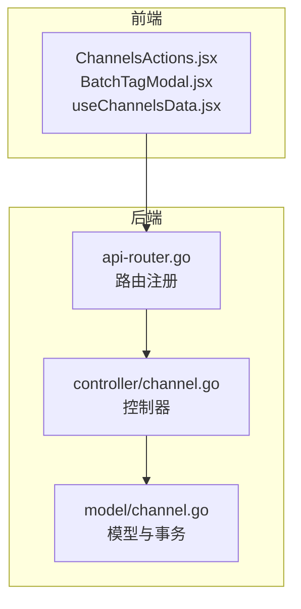
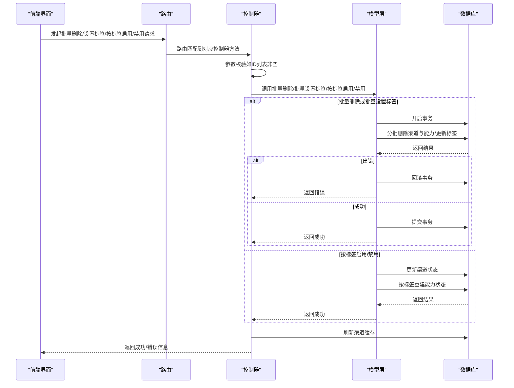
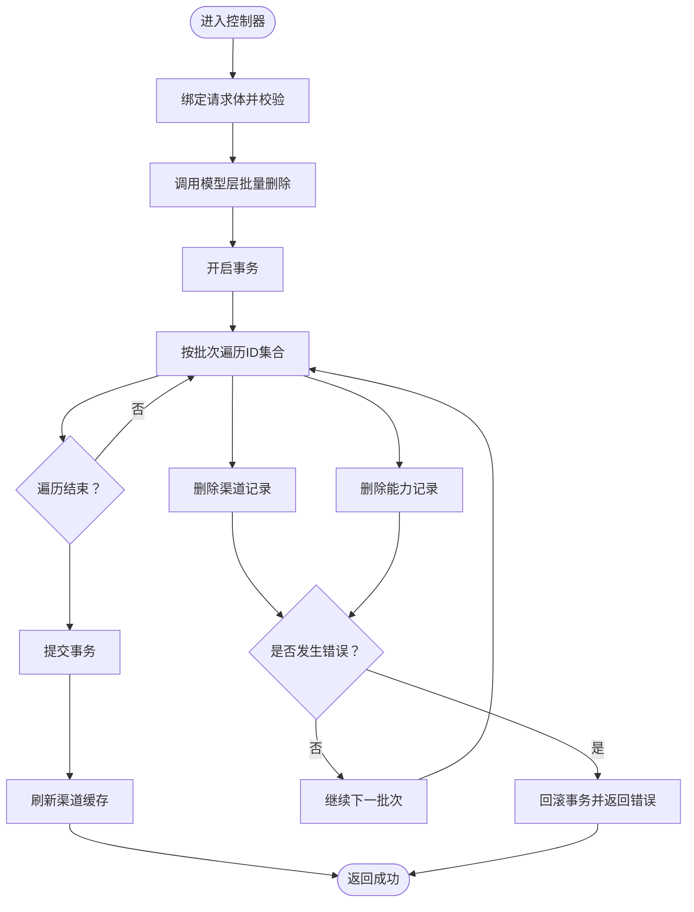
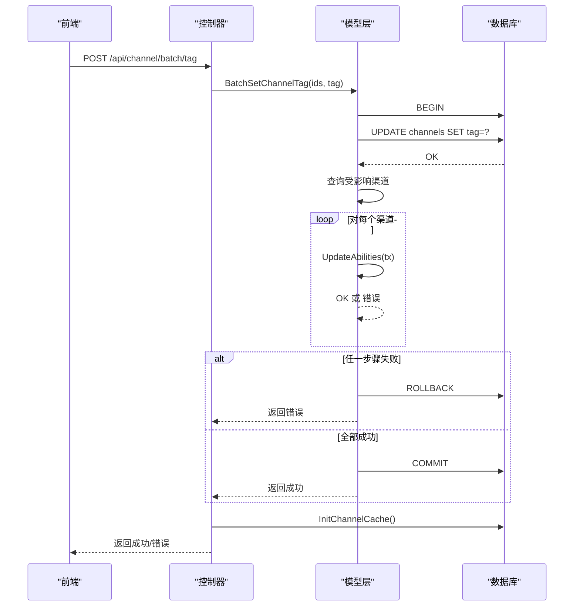
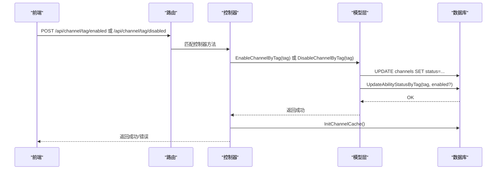
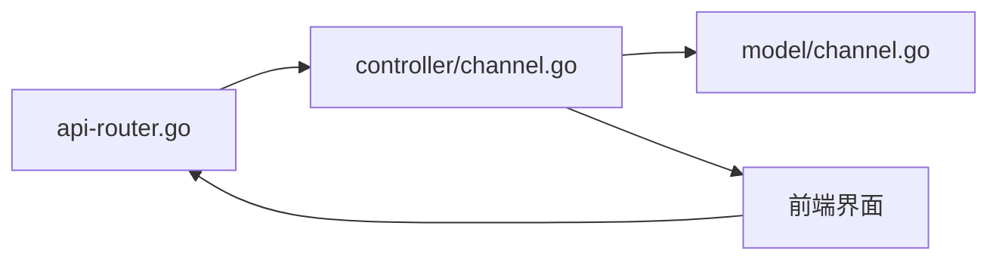

# 批量管理

<cite>
**本文引用的文件**
- [controller/channel.go](file://controller/channel.go)
- [model/channel.go](file://model/channel.go)
- [router/api-router.go](file://router/api-router.go)
- [web/src/hooks/channels/useChannelsData.jsx](file://web/src/hooks/channels/useChannelsData.jsx)
- [web/src/components/table/channels/ChannelsActions.jsx](file://web/src/components/table/channels/ChannelsActions.jsx)
- [web/src/components/table/channels/modals/BatchTagModal.jsx](file://web/src/components/table/channels/modals/BatchTagModal.jsx)
</cite>

## 目录
1. [简介](#简介)
2. [项目结构](#项目结构)
3. [核心组件](#核心组件)
4. [架构总览](#架构总览)
5. [详细组件分析](#详细组件分析)
6. [依赖关系分析](#依赖关系分析)
7. [性能考量](#性能考量)
8. [故障排查指南](#故障排查指南)
9. [结论](#结论)
10. [附录](#附录)

## 简介
本文件系统性阐述“批量管理”能力，包括：
- 批量删除渠道
- 批量设置标签
- 标签级别的批量启用/禁用
- 事务处理与错误回滚策略
- 基于标签的分组管理与能力重建
- 性能优化建议与使用注意事项

目标读者既包含后端开发者，也包含前端使用者与运维人员。

## 项目结构
批量管理涉及三层协作：
- 前端界面：提供批量勾选、确认与调用接口的能力
- 控制器层：接收请求、参数校验、调用模型层、返回响应
- 模型层：执行数据库操作、事务控制、能力重建与缓存刷新

图表来源
- [router/api-router.go](file://router/api-router.go#L150-L160)
- [controller/channel.go](file://controller/channel.go#L810-L837)
- [controller/channel.go](file://controller/channel.go#L1039-L1060)
- [model/channel.go](file://model/channel.go#L383-L403)
- [model/channel.go](file://model/channel.go#L923-L954)

章节来源
- [router/api-router.go](file://router/api-router.go#L150-L160)
- [controller/channel.go](file://controller/channel.go#L810-L837)
- [controller/channel.go](file://controller/channel.go#L1039-L1060)
- [model/channel.go](file://model/channel.go#L383-L403)
- [model/channel.go](file://model/channel.go#L923-L954)

## 核心组件
- 批量删除渠道
  - 接口：POST /api/channel/batch
  - 实现：控制器接收ID列表，调用模型层的批量删除函数；模型层以事务分批删除渠道与其能力数据；最后刷新缓存
- 批量设置标签
  - 接口：POST /api/channel/batch/tag
  - 实现：控制器接收ID列表与目标标签，调用模型层的批量设置标签函数；模型层事务内更新标签并逐条重建能力；提交后刷新缓存
- 标签级别启用/禁用
  - 接口：POST /api/channel/tag/enabled、POST /api/channel/tag/disabled
  - 实现：控制器接收标签，调用模型层的按标签启用/禁用函数；模型层更新状态并按标签重建能力状态

章节来源
- [controller/channel.go](file://controller/channel.go#L810-L837)
- [controller/channel.go](file://controller/channel.go#L1039-L1060)
- [controller/channel.go](file://controller/channel.go#L700-L756)
- [model/channel.go](file://model/channel.go#L383-L403)
- [model/channel.go](file://model/channel.go#L923-L954)
- [model/channel.go](file://model/channel.go#L678-L694)

## 架构总览
批量管理的端到端流程如下：

图表来源
- [router/api-router.go](file://router/api-router.go#L150-L160)
- [controller/channel.go](file://controller/channel.go#L810-L837)
- [controller/channel.go](file://controller/channel.go#L1039-L1060)
- [controller/channel.go](file://controller/channel.go#L700-L756)
- [model/channel.go](file://model/channel.go#L383-L403)
- [model/channel.go](file://model/channel.go#L923-L954)
- [model/channel.go](file://model/channel.go#L678-L694)

## 详细组件分析

### 批量删除渠道（BatchDeleteChannels）
- 控制器入口
  - 方法：DeleteChannelBatch
  - 行为：绑定请求体，校验ID列表非空；调用模型层批量删除；失败时返回错误；成功后刷新渠道缓存并返回删除数量
- 模型层实现
  - 方法：BatchDeleteChannels
  - 事务与分批：开启事务；按固定批次大小分批执行删除（渠道表与能力表），任一步出错即回滚；全部成功则提交
- 错误回滚策略
  - 任一子步骤（删除渠道或删除能力）失败，立即回滚整个事务，避免不一致
- 前端交互
  - 通过“删除所选通道”按钮触发，弹窗二次确认，成功后提示删除数量并刷新列表

图表来源
- [controller/channel.go](file://controller/channel.go#L810-L837)
- [model/channel.go](file://model/channel.go#L383-L403)

章节来源
- [controller/channel.go](file://controller/channel.go#L810-L837)
- [model/channel.go](file://model/channel.go#L383-L403)

### 批量设置标签（BatchSetChannelTag）
- 控制器入口
  - 方法：BatchSetChannelTag
  - 行为：绑定请求体，校验ID列表非空；调用模型层批量设置标签；失败返回错误；成功后刷新渠道缓存并返回受影响数量
- 模型层实现
  - 方法：BatchSetChannelTag
  - 事务与能力重建：开启事务；更新渠道标签；查询受影响渠道并逐条重建能力；任一步骤失败回滚；全部成功提交
- 错误回滚策略
  - 标签更新失败或能力重建失败均会回滚事务
- 前端交互
  - 通过“批量设置标签”弹窗输入标签值，选择多个渠道后提交；成功后提示设置数量并刷新列表

图表来源
- [controller/channel.go](file://controller/channel.go#L1039-L1060)
- [model/channel.go](file://model/channel.go#L923-L954)

章节来源
- [controller/channel.go](file://controller/channel.go#L1039-L1060)
- [model/channel.go](file://model/channel.go#L923-L954)

### 标签级别的批量启用/禁用（EnableChannelByTag / DisableChannelByTag）
- 控制器入口
  - 方法：EnableTagChannels / DisableTagChannels
  - 行为：绑定请求体，校验标签非空；调用模型层按标签启用/禁用；失败返回错误；成功后刷新渠道缓存
- 模型层实现
  - 方法：EnableChannelByTag / DisableChannelByTag
  - 行为：更新渠道状态；按标签重建能力状态
- 前端交互
  - 在“批量操作”下拉菜单中选择“启用/禁用标签”，确认后触发；成功后前端同步更新UI状态

图表来源
- [controller/channel.go](file://controller/channel.go#L700-L756)
- [model/channel.go](file://model/channel.go#L678-L694)

章节来源
- [controller/channel.go](file://controller/channel.go#L700-L756)
- [model/channel.go](file://model/channel.go#L678-L694)

### 前端批量管理交互
- 批量删除
  - “开启批量操作”开关控制是否允许勾选与批量删除
  - “删除所选通道”按钮触发删除流程，二次确认后调用后端接口
- 批量设置标签
  - “批量设置标签”按钮打开弹窗，输入标签值后提交
  - 勾选多个渠道后提交，后端返回受影响数量
- 标签级别启用/禁用
  - “批量操作”下拉菜单提供“启用标签/禁用标签”，确认后调用后端接口

章节来源
- [web/src/components/table/channels/ChannelsActions.jsx](file://web/src/components/table/channels/ChannelsActions.jsx#L60-L284)
- [web/src/hooks/channels/useChannelsData.jsx](file://web/src/hooks/channels/useChannelsData.jsx#L665-L713)
- [web/src/components/table/channels/modals/BatchTagModal.jsx](file://web/src/components/table/channels/modals/BatchTagModal.jsx#L20-L63)

## 依赖关系分析
- 路由与控制器
  - 路由注册了批量删除、批量设置标签、按标签启用/禁用等接口
  - 控制器负责参数校验与调用模型层
- 控制器与模型
  - 控制器在成功后统一调用渠道缓存初始化，确保前端与缓存一致
  - 模型层承担事务与能力重建，保证数据一致性
- 前端与控制器
  - 前端通过HTTP请求触发批量操作，控制器返回结构化结果供前端展示

图表来源
- [router/api-router.go](file://router/api-router.go#L150-L160)
- [controller/channel.go](file://controller/channel.go#L700-L756)
- [controller/channel.go](file://controller/channel.go#L810-L837)
- [controller/channel.go](file://controller/channel.go#L1039-L1060)
- [model/channel.go](file://model/channel.go#L383-L403)
- [model/channel.go](file://model/channel.go#L678-L694)
- [model/channel.go](file://model/channel.go#L923-L954)

章节来源
- [router/api-router.go](file://router/api-router.go#L150-L160)
- [controller/channel.go](file://controller/channel.go#L700-L756)
- [controller/channel.go](file://controller/channel.go#L810-L837)
- [controller/channel.go](file://controller/channel.go#L1039-L1060)
- [model/channel.go](file://model/channel.go#L383-L403)
- [model/channel.go](file://model/channel.go#L678-L694)
- [model/channel.go](file://model/channel.go#L923-L954)

## 性能考量
- 分批删除与设置标签
  - 批量删除与批量设置标签均采用分批处理，降低单次事务压力与锁竞争
  - 建议：根据数据库负载与网络延迟调整批次大小，避免过大批次导致长时间占用事务
- 事务边界
  - 批量删除与批量设置标签在模型层以事务包裹，确保原子性；建议在高并发场景下避免同时发起大量批量操作
- 能力重建成本
  - 批量设置标签后逐条重建能力，可能带来额外开销；建议在大批量场景下合并操作或在低峰期执行
- 缓存刷新
  - 控制器在成功后统一刷新渠道缓存，避免前后端状态不一致；建议在批量操作完成后统一刷新，减少多次刷新带来的抖动

[本节为通用指导，无需列出具体文件来源]

## 故障排查指南
- 批量删除失败
  - 现象：返回错误或部分删除未生效
  - 排查要点：检查ID列表是否为空、数据库连接是否正常、是否存在外键约束导致删除失败
  - 参考实现位置
    - [controller/channel.go](file://controller/channel.go#L810-L837)
    - [model/channel.go](file://model/channel.go#L383-L403)
- 批量设置标签失败
  - 现象：标签未更新或能力未重建
  - 排查要点：确认事务是否回滚、受影响渠道是否可查询、能力重建是否抛错
  - 参考实现位置
    - [controller/channel.go](file://controller/channel.go#L1039-L1060)
    - [model/channel.go](file://model/channel.go#L923-L954)
- 标签级别启用/禁用异常
  - 现象：状态未变更或能力状态不同步
  - 排查要点：确认标签是否正确、是否触发能力状态重建
  - 参考实现位置
    - [controller/channel.go](file://controller/channel.go#L700-L756)
    - [model/channel.go](file://model/channel.go#L678-L694)
- 前端无响应或状态不同步
  - 现象：点击按钮无反应或UI未更新
  - 排查要点：确认路由是否正确、控制器返回结构、前端是否正确刷新列表与缓存
  - 参考实现位置
    - [router/api-router.go](file://router/api-router.go#L150-L160)
    - [web/src/hooks/channels/useChannelsData.jsx](file://web/src/hooks/channels/useChannelsData.jsx#L665-L713)

章节来源
- [controller/channel.go](file://controller/channel.go#L700-L756)
- [controller/channel.go](file://controller/channel.go#L810-L837)
- [controller/channel.go](file://controller/channel.go#L1039-L1060)
- [model/channel.go](file://model/channel.go#L383-L403)
- [model/channel.go](file://model/channel.go#L678-L694)
- [model/channel.go](file://model/channel.go#L923-L954)
- [router/api-router.go](file://router/api-router.go#L150-L160)
- [web/src/hooks/channels/useChannelsData.jsx](file://web/src/hooks/channels/useChannelsData.jsx#L665-L713)

## 结论
- 批量删除、批量设置标签与标签级别启用/禁用均通过严格的事务控制保障一致性
- 前端提供直观的批量操作入口，配合后端的分批处理与能力重建，满足大规模渠道管理需求
- 建议在高并发与大批量场景下合理规划批次大小与执行时机，并关注缓存刷新策略

[本节为总结性内容，无需列出具体文件来源]

## 附录
- 接口清单
  - 批量删除：POST /api/channel/batch
  - 批量设置标签：POST /api/channel/batch/tag
  - 标签启用：POST /api/channel/tag/enabled
  - 标签禁用：POST /api/channel/tag/disabled
- 关键实现路径
  - 批量删除：[controller/channel.go](file://controller/channel.go#L810-L837)、[model/channel.go](file://model/channel.go#L383-L403)
  - 批量设置标签：[controller/channel.go](file://controller/channel.go#L1039-L1060)、[model/channel.go](file://model/channel.go#L923-L954)
  - 标签启用/禁用：[controller/channel.go](file://controller/channel.go#L700-L756)、[model/channel.go](file://model/channel.go#L678-L694)

章节来源
- [router/api-router.go](file://router/api-router.go#L150-L160)
- [controller/channel.go](file://controller/channel.go#L700-L756)
- [controller/channel.go](file://controller/channel.go#L810-L837)
- [controller/channel.go](file://controller/channel.go#L1039-L1060)
- [model/channel.go](file://model/channel.go#L383-L403)
- [model/channel.go](file://model/channel.go#L678-L694)
- [model/channel.go](file://model/channel.go#L923-L954)