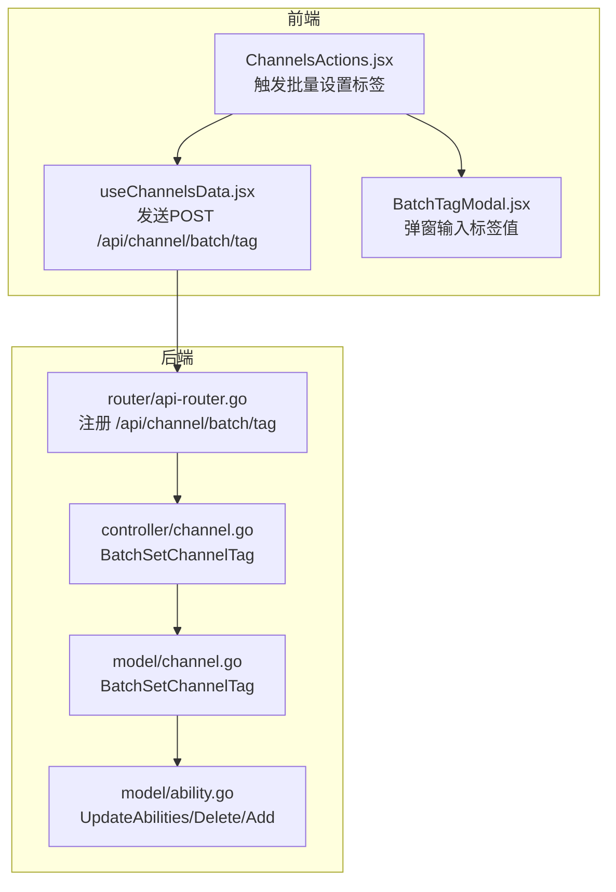
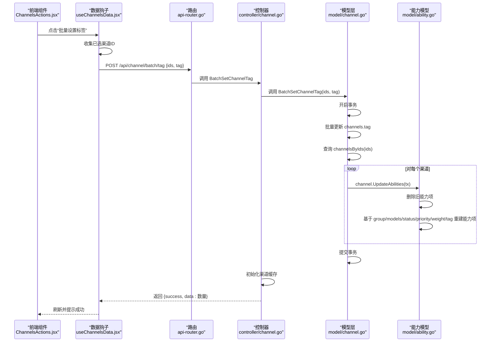

# 批量设置标签

<cite>
**本文引用的文件列表**
- [controller/channel.go](file://controller/channel.go)
- [model/channel.go](file://model/channel.go)
- [model/ability.go](file://model/ability.go)
- [router/api-router.go](file://router/api-router.go)
- [web/src/components/table/channels/ChannelsActions.jsx](file://web/src/components/table/channels/ChannelsActions.jsx)
- [web/src/hooks/channels/useChannelsData.jsx](file://web/src/hooks/channels/useChannelsData.jsx)
- [web/src/components/table/channels/modals/BatchTagModal.jsx](file://web/src/components/table/channels/modals/BatchTagModal.jsx)
- [docs/openapi/api.json](file://docs/openapi/api.json)
</cite>

## 目录
1. [简介](#简介)
2. [项目结构与入口](#项目结构与入口)
3. [核心组件](#核心组件)
4. [架构总览](#架构总览)
5. [详细组件分析](#详细组件分析)
6. [依赖关系分析](#依赖关系分析)
7. [性能考量](#性能考量)
8. [故障排查指南](#故障排查指南)
9. [结论](#结论)
10. [附录](#附录)

## 简介
本文件围绕“批量设置标签”功能进行系统化说明，涵盖以下方面：
- 后端模型层的批量更新逻辑与事务保障
- 前端 ChannelsActions 组件的交互流程与用户操作路径
- 控制器对 JSON 请求的解析、参数校验与调用模型层的方法
- 更新标签后如何同步更新 abilities 表以保持数据一致性
- 性能优化建议与使用注意事项

## 项目结构与入口
- 前端位于 web/src，包含表格操作组件与数据钩子，负责收集用户选择并发起批量设置标签的请求。
- 后端控制器在 controller/channel.go 中定义了 /api/channel/batch/tag 接口。
- 路由在 router/api-router.go 中注册，绑定到控制器方法。
- 模型层在 model/channel.go 实现批量设置标签的核心逻辑；同时 model/ability.go 定义了 abilities 表结构及能力项的增删改写逻辑。

图表来源
- [router/api-router.go](file://router/api-router.go#L150-L158)
- [controller/channel.go](file://controller/channel.go#L1039-L1061)
- [model/channel.go](file://model/channel.go#L924-L955)
- [model/ability.go](file://model/ability.go#L191-L261)

章节来源
- [router/api-router.go](file://router/api-router.go#L150-L158)
- [controller/channel.go](file://controller/channel.go#L1039-L1061)
- [model/channel.go](file://model/channel.go#L924-L955)
- [model/ability.go](file://model/ability.go#L191-L261)

## 核心组件
- 前端组件
  - ChannelsActions.jsx：提供“批量设置标签”按钮，打开 BatchTagModal 并触发 useChannelsData 中的批量设置逻辑。
  - useChannelsData.jsx：收集已选渠道 ID，向后端发送 POST /api/channel/batch/tag，携带 ids 和 tag（可为 null）。
  - BatchTagModal.jsx：弹窗输入标签值，确认后调用 batchSetChannelTag。
- 后端控制器
  - controller/channel.go 的 BatchSetChannelTag：解析 JSON，校验参数，调用模型层批量设置标签，并初始化渠道缓存。
- 模型层
  - model/channel.go 的 BatchSetChannelTag：开启事务，批量更新 channels 表的 tag 字段，随后逐条调用 UpdateAbilities(tx) 同步 abilities 表。
  - model/ability.go 的 UpdateAbilities：删除旧能力项，基于渠道的 group、models、status、priority、weight、tag 重建能力项，支持传入外部事务。

章节来源
- [web/src/components/table/channels/ChannelsActions.jsx](file://web/src/components/table/channels/ChannelsActions.jsx#L31-L90)
- [web/src/hooks/channels/useChannelsData.jsx](file://web/src/hooks/channels/useChannelsData.jsx#L639-L663)
- [web/src/components/table/channels/modals/BatchTagModal.jsx](file://web/src/components/table/channels/modals/BatchTagModal.jsx#L20-L63)
- [controller/channel.go](file://controller/channel.go#L1039-L1061)
- [model/channel.go](file://model/channel.go#L924-L955)
- [model/ability.go](file://model/ability.go#L191-L261)

## 架构总览
批量设置标签的端到端流程如下：
- 前端用户在 ChannelsActions 中点击“批量设置标签”，打开 BatchTagModal 输入标签值。
- useChannelsData 收集已选渠道 ID，向 /api/channel/batch/tag 发起 POST 请求，携带 ids 和 tag。
- 控制器解析请求体，校验参数长度，调用模型层 BatchSetChannelTag。
- 模型层开启事务，更新 channels 表 tag 字段，再逐条调用 UpdateAbilities(tx) 删除并重建 abilities 表记录，最后提交事务。
- 控制器初始化渠道缓存并返回成功响应。

图表来源
- [web/src/components/table/channels/ChannelsActions.jsx](file://web/src/components/table/channels/ChannelsActions.jsx#L31-L90)
- [web/src/hooks/channels/useChannelsData.jsx](file://web/src/hooks/channels/useChannelsData.jsx#L639-L663)
- [router/api-router.go](file://router/api-router.go#L150-L158)
- [controller/channel.go](file://controller/channel.go#L1039-L1061)
- [model/channel.go](file://model/channel.go#L924-L955)
- [model/ability.go](file://model/ability.go#L191-L261)

## 详细组件分析

### 后端控制器：BatchSetChannelTag
- 参数解析与校验
  - 解析 JSON 请求体为 ChannelBatch 结构，要求 ids 非空。
- 调用模型层
  - 调用 model.BatchSetChannelTag(ids, tag) 执行批量更新。
- 缓存与响应
  - 成功后调用 InitChannelCache，返回 {success: true, data: 数量}。

章节来源
- [controller/channel.go](file://controller/channel.go#L1039-L1061)

### 模型层：BatchSetChannelTag
- 事务控制
  - 开启事务 tx，若失败立即返回错误。
- 更新标签
  - 使用 Model().Where("id in (?)").Update("tag", tag) 批量更新 channels 表的 tag 字段。
- 同步 abilities
  - 通过 GetChannelsByIds(ids) 获取渠道列表。
  - 对每个渠道调用 channel.UpdateAbilities(tx)，确保在相同事务内删除旧能力并重建新能力。
- 提交事务
  - 全部成功后提交事务；任一失败则回滚。

章节来源
- [model/channel.go](file://model/channel.go#L924-L955)

### 能力项同步：UpdateAbilities
- 删除旧能力
  - 以 channel_id 为条件删除 abilities 表中对应记录。
- 重建能力
  - 基于渠道的 group、models、status、priority、weight、tag 生成能力项集合。
  - 使用分批插入（chunk）避免单次插入过多导致性能问题。
- 事务处理
  - 若未传入外部事务，则内部开启事务并在异常时回滚；若传入外部事务（如 BatchSetChannelTag），则复用外部事务。

章节来源
- [model/ability.go](file://model/ability.go#L191-L261)

### 前端交互：ChannelsActions 与 useChannelsData
- ChannelsActions.jsx
  - 提供“批量设置标签”按钮，点击后设置显示 BatchTagModal。
- BatchTagModal.jsx
  - 弹窗输入标签值，确认后调用父组件传入的 batchSetChannelTag。
- useChannelsData.jsx
  - 校验已选渠道数量与标签值非空；
  - 组装 {ids, tag} 请求体（tag 可为 null）；
  - 调用 API.post('/api/channel/batch/tag')；
  - 成功后刷新数据并关闭弹窗。

章节来源
- [web/src/components/table/channels/ChannelsActions.jsx](file://web/src/components/table/channels/ChannelsActions.jsx#L31-L90)
- [web/src/components/table/channels/modals/BatchTagModal.jsx](file://web/src/components/table/channels/modals/BatchTagModal.jsx#L20-L63)
- [web/src/hooks/channels/useChannelsData.jsx](file://web/src/hooks/channels/useChannelsData.jsx#L639-L663)

### OpenAPI 文档与接口定义
- 接口路径：/api/channel/batch/tag
- 方法：POST
- 请求体：包含 ids（数组，整数）、tag（字符串或 null）
- 响应：包含 success、message、data（数量）

章节来源
- [docs/openapi/api.json](file://docs/openapi/api.json#L3000-L3039)

## 依赖关系分析
- 控制器依赖模型层
  - controller/channel.go -> model/channel.go
- 模型层依赖能力模型
  - model/channel.go -> model/ability.go
- 路由依赖控制器
  - router/api-router.go -> controller/channel.go
- 前端依赖路由与控制器
  - web 组件 -> useChannelsData.jsx -> /api/channel/batch/tag

图表来源
- [router/api-router.go](file://router/api-router.go#L150-L158)
- [controller/channel.go](file://controller/channel.go#L1039-L1061)
- [model/channel.go](file://model/channel.go#L924-L955)
- [model/ability.go](file://model/ability.go#L191-L261)

## 性能考量
- 事务与批量更新
  - 模型层在单事务中执行批量更新与能力重建，减少锁竞争与重复扫描。
- 分批插入能力项
  - UpdateAbilities 内部按固定大小分批插入，降低单次 SQL 负载。
- 前端批量请求
  - useChannelsData 将已选渠道一次性提交，避免多次往返。
- 缓存刷新
  - 控制器在成功后初始化渠道缓存，保证后续查询与选择逻辑的一致性。

章节来源
- [model/channel.go](file://model/channel.go#L924-L955)
- [model/ability.go](file://model/ability.go#L191-L261)
- [controller/channel.go](file://controller/channel.go#L1039-L1061)
- [web/src/hooks/channels/useChannelsData.jsx](file://web/src/hooks/channels/useChannelsData.jsx#L639-L663)

## 故障排查指南
- 常见错误与定位
  - 参数错误：控制器对 JSON 解析失败或 ids 为空时返回错误信息。
  - 数据库错误：模型层在更新或重建能力项时发生错误，事务会回滚。
  - 前端无选择：useChannelsData 校验已选渠道数量为 0 时提示用户先选择。
- 建议排查步骤
  - 检查 /api/channel/batch/tag 的请求体是否包含 ids 且非空，tag 是否为字符串或 null。
  - 查看控制器返回的错误消息，确认是否为参数错误或数据库错误。
  - 在模型层日志中关注 BatchSetChannelTag 与 UpdateAbilities 的执行情况。
  - 确认 abilities 表是否正确重建，特别是 group、models、status、priority、weight、tag 字段是否一致。

章节来源
- [controller/channel.go](file://controller/channel.go#L1039-L1061)
- [model/channel.go](file://model/channel.go#L924-L955)
- [web/src/hooks/channels/useChannelsData.jsx](file://web/src/hooks/channels/useChannelsData.jsx#L639-L663)

## 结论
批量设置标签功能通过“事务内批量更新 + 能力项重建”的方式，确保渠道标签变更与 abilities 表状态保持一致。前端提供直观的交互入口，后端控制器与模型层分别承担参数校验与数据一致性保障职责。配合分批插入与缓存刷新，整体具备良好的性能与可靠性。

## 附录
- 接口定义参考
  - OpenAPI 文档中 /api/channel/batch/tag 的请求体与响应格式。

章节来源
- [docs/openapi/api.json](file://docs/openapi/api.json#L3000-L3039)