# 安全验证机制

<cite>
**本文引用的文件**
- [web/src/components/common/modals/SecureVerificationModal.jsx](file://web/src/components/common/modals/SecureVerificationModal.jsx)
- [web/src/hooks/common/useSecureVerification.jsx](file://web/src/hooks/common/useSecureVerification.jsx)
- [web/src/services/secureVerification.js](file://web/src/services/secureVerification.js)
- [web/src/helpers/secureApiCall.js](file://web/src/helpers/secureApiCall.js)
- [web/src/helpers/api.js](file://web/src/helpers/api.js)
- [middleware/secure_verification.go](file://middleware/secure_verification.go)
- [controller/channel-test.go](file://controller/channel-test.go)
- [router/api-router.go](file://router/api-router.go)
- [common/sys_log.go](file://common/sys_log.go)
- [service/sensitive.go](file://service/sensitive.go)
- [common/str.go](file://common/str.go)
- [middleware/rate-limit.go](file://middleware/rate-limit.go)
- [setting/operation_setting/monitor_setting.go](file://setting/operation_setting/monitor_setting.go)
</cite>

## 目录
1. [引言](#引言)
2. [项目结构](#项目结构)
3. [核心组件](#核心组件)
4. [架构总览](#架构总览)
5. [详细组件分析](#详细组件分析)
6. [依赖关系分析](#依赖关系分析)
7. [性能考量](#性能考量)
8. [故障排查指南](#故障排查指南)
9. [结论](#结论)

## 引言
本文件聚焦于“渠道测试安全验证机制”，围绕前端ModelTestModal组件的安全防护、后端测试接口的认证授权、日志审计与敏感信息保护、以及批量测试的并发控制与防重复提交策略进行系统化梳理。目标是帮助开发者与运维人员快速理解并正确使用该机制，确保测试操作在安全可控的前提下高效运行。

## 项目结构
本项目采用前后端分离架构：
- 前端位于 web/src，包含通用安全验证模态框、Hook与服务层，负责用户交互与二次确认、Passkey/2FA验证流程。
- 后端位于 Go 代码，包含路由、控制器、中间件、日志与敏感信息处理等模块，负责权限校验、测试执行、日志记录与审计。

```mermaid
graph TB
subgraph "前端"
A["SecureVerificationModal.jsx<br/>通用安全验证模态框"]
B["useSecureVerification.jsx<br/>Hook：封装验证流程"]
C["secureVerification.js<br/>服务：2FA/Passkey验证"]
D["secureApiCall.js<br/>辅助：识别需要验证的错误"]
E["api.js<br/>Axios实例与去重策略"]
end
subgraph "后端"
F["api-router.go<br/>路由：/api/channel/test*"]
G["secure_verification.go<br/>中间件：SecureVerificationRequired"]
H["channel-test.go<br/>控制器：TestChannel/TestAllChannels"]
I["sys_log.go<br/>系统日志输出"]
J["sensitive.go<br/>敏感词检测"]
K["str.go<br/>敏感信息掩码工具"]
L["rate-limit.go<br/>全局限流"]
M["monitor_setting.go<br/>自动测试配置"]
end
A --> B --> C --> D --> E
E --> F --> G --> H
H --> I
H --> J
H --> K
F --> L
H --> M
```

图表来源
- [web/src/components/common/modals/SecureVerificationModal.jsx](file://web/src/components/common/modals/SecureVerificationModal.jsx#L1-L322)
- [web/src/hooks/common/useSecureVerification.jsx](file://web/src/hooks/common/useSecureVerification.jsx#L1-L275)
- [web/src/services/secureVerification.js](file://web/src/services/secureVerification.js#L1-L233)
- [web/src/helpers/secureApiCall.js](file://web/src/helpers/secureApiCall.js#L1-L63)
- [web/src/helpers/api.js](file://web/src/helpers/api.js#L1-L327)
- [router/api-router.go](file://router/api-router.go#L140-L170)
- [middleware/secure_verification.go](file://middleware/secure_verification.go#L1-L132)
- [controller/channel-test.go](file://controller/channel-test.go#L1-L644)
- [common/sys_log.go](file://common/sys_log.go#L1-L56)
- [service/sensitive.go](file://service/sensitive.go#L1-L78)
- [common/str.go](file://common/str.go#L66-L208)
- [middleware/rate-limit.go](file://middleware/rate-limit.go#L1-L118)
- [setting/operation_setting/monitor_setting.go](file://setting/operation_setting/monitor_setting.go#L1-L35)

章节来源
- [router/api-router.go](file://router/api-router.go#L140-L170)
- [middleware/secure_verification.go](file://middleware/secure_verification.go#L1-L132)
- [controller/channel-test.go](file://controller/channel-test.go#L1-L644)

## 核心组件
- 前端安全验证模态框与Hook：提供二次确认、2FA/Passkey验证、自动弹窗与状态管理。
- 后端安全验证中间件：基于Session的5分钟有效期校验，拒绝未验证或过期请求。
- 测试接口控制器：执行单通道/全量通道测试，记录日志与消耗，支持自动测试调度。
- 日志与敏感信息处理：系统日志输出、敏感词检测、URL/IP掩码等。
- 限流与重复提交防护：全局限流、GET请求去重、批量测试互斥锁。

章节来源
- [web/src/components/common/modals/SecureVerificationModal.jsx](file://web/src/components/common/modals/SecureVerificationModal.jsx#L1-L322)
- [web/src/hooks/common/useSecureVerification.jsx](file://web/src/hooks/common/useSecureVerification.jsx#L1-L275)
- [web/src/services/secureVerification.js](file://web/src/services/secureVerification.js#L1-L233)
- [middleware/secure_verification.go](file://middleware/secure_verification.go#L1-L132)
- [controller/channel-test.go](file://controller/channel-test.go#L1-L644)
- [common/sys_log.go](file://common/sys_log.go#L1-L56)
- [service/sensitive.go](file://service/sensitive.go#L1-L78)
- [common/str.go](file://common/str.go#L66-L208)
- [middleware/rate-limit.go](file://middleware/rate-limit.go#L1-L118)
- [web/src/helpers/api.js](file://web/src/helpers/api.js#L1-L327)

## 架构总览
下图展示从前端到后端的完整调用链路，重点标注安全验证与日志审计的关键节点。

图表来源
- [web/src/components/common/modals/SecureVerificationModal.jsx](file://web/src/components/common/modals/SecureVerificationModal.jsx#L1-L322)
- [web/src/hooks/common/useSecureVerification.jsx](file://web/src/hooks/common/useSecureVerification.jsx#L1-L275)
- [web/src/services/secureVerification.js](file://web/src/services/secureVerification.js#L1-L233)
- [web/src/helpers/api.js](file://web/src/helpers/api.js#L1-L327)
- [router/api-router.go](file://router/api-router.go#L140-L170)
- [middleware/secure_verification.go](file://middleware/secure_verification.go#L1-L132)
- [controller/channel-test.go](file://controller/channel-test.go#L1-L644)
- [common/sys_log.go](file://common/sys_log.go#L1-L56)

## 详细组件分析

### 前端安全验证组件与流程
- 模态框组件提供2FA与Passkey两种验证方式，支持键盘事件与加载状态，避免重复提交。
- Hook封装验证流程：自动检测可用验证方式、弹窗、执行验证、调用业务API、回调处理与自动重置。
- 服务层实现2FA与Passkey验证步骤，并通过通用验证接口设置Session。
- 辅助工具识别后端返回的“需要验证”错误码，自动触发验证流程。
- Axios实例对GET请求做去重，避免重复提交。

图表来源
- [web/src/hooks/common/useSecureVerification.jsx](file://web/src/hooks/common/useSecureVerification.jsx#L1-L275)
- [web/src/services/secureVerification.js](file://web/src/services/secureVerification.js#L1-L233)
- [web/src/helpers/secureApiCall.js](file://web/src/helpers/secureApiCall.js#L1-L63)
- [web/src/helpers/api.js](file://web/src/helpers/api.js#L1-L327)

章节来源
- [web/src/components/common/modals/SecureVerificationModal.jsx](file://web/src/components/common/modals/SecureVerificationModal.jsx#L1-L322)
- [web/src/hooks/common/useSecureVerification.jsx](file://web/src/hooks/common/useSecureVerification.jsx#L1-L275)
- [web/src/services/secureVerification.js](file://web/src/services/secureVerification.js#L1-L233)
- [web/src/helpers/secureApiCall.js](file://web/src/helpers/secureApiCall.js#L1-L63)
- [web/src/helpers/api.js](file://web/src/helpers/api.js#L1-L327)

### 后端安全验证中间件
- 通过Session键“secure_verified_at”记录验证时间戳，有效期5分钟。
- 若未登录、未验证或过期，返回401/403并携带明确错误码，前端据此触发二次验证。
- 提供可选中间件用于区分是否已验证，便于统计与差异化处理。

图表来源
- [middleware/secure_verification.go](file://middleware/secure_verification.go#L1-L132)

章节来源
- [middleware/secure_verification.go](file://middleware/secure_verification.go#L1-L132)

### 测试接口与日志审计
- 路由暴露测试接口：单通道测试与全量测试。
- 控制器执行测试：构造请求、适配器转换、上游调用、用量计算与消费日志记录。
- 日志审计：系统日志输出、消费日志记录、自动测试调度与通知。
- 敏感信息处理：对日志中的敏感字段进行掩码，避免泄露。

图表来源
- [router/api-router.go](file://router/api-router.go#L140-L170)
- [middleware/secure_verification.go](file://middleware/secure_verification.go#L1-L132)
- [controller/channel-test.go](file://controller/channel-test.go#L1-L644)
- [common/sys_log.go](file://common/sys_log.go#L1-L56)

章节来源
- [router/api-router.go](file://router/api-router.go#L140-L170)
- [controller/channel-test.go](file://controller/channel-test.go#L1-L644)
- [common/sys_log.go](file://common/sys_log.go#L1-L56)

### 敏感信息处理与日志安全
- 敏感词检测：对消息内容进行敏感词扫描，必要时阻断或替换。
- URL/IP/域名掩码：统一将URL、IP、域名等敏感信息进行掩码处理，降低泄露风险。
- 日志输出：系统日志通过统一接口输出，避免直接打印原始密钥或敏感参数。

章节来源
- [service/sensitive.go](file://service/sensitive.go#L1-L78)
- [common/str.go](file://common/str.go#L66-L208)
- [common/sys_log.go](file://common/sys_log.go#L1-L56)

### 批量测试限制与防重复提交
- 批量测试互斥：全量测试使用互斥锁与运行状态标志，避免并发重复执行。
- 全局限流：提供全局Web/API限流中间件，按IP与时间段限制请求频率。
- GET请求去重：Axios实例对GET请求进行去重，避免重复提交导致的重复测试。

图表来源
- [controller/channel-test.go](file://controller/channel-test.go#L533-L603)
- [middleware/rate-limit.go](file://middleware/rate-limit.go#L1-L118)
- [web/src/helpers/api.js](file://web/src/helpers/api.js#L1-L327)

章节来源
- [controller/channel-test.go](file://controller/channel-test.go#L533-L603)
- [middleware/rate-limit.go](file://middleware/rate-limit.go#L1-L118)
- [web/src/helpers/api.js](file://web/src/helpers/api.js#L1-L327)

## 依赖关系分析
- 前端依赖：模态框依赖Hook；Hook依赖服务；服务依赖Axios；错误识别辅助工具与Axios拦截器共同作用。
- 后端依赖：路由依赖中间件；控制器依赖适配器与日志；日志依赖系统日志接口；敏感信息处理依赖工具库。
- 自动测试：受监控配置影响，周期性触发全量测试。

图表来源
- [web/src/components/common/modals/SecureVerificationModal.jsx](file://web/src/components/common/modals/SecureVerificationModal.jsx#L1-L322)
- [web/src/hooks/common/useSecureVerification.jsx](file://web/src/hooks/common/useSecureVerification.jsx#L1-L275)
- [web/src/services/secureVerification.js](file://web/src/services/secureVerification.js#L1-L233)
- [web/src/helpers/secureApiCall.js](file://web/src/helpers/secureApiCall.js#L1-L63)
- [web/src/helpers/api.js](file://web/src/helpers/api.js#L1-L327)
- [router/api-router.go](file://router/api-router.go#L140-L170)
- [middleware/secure_verification.go](file://middleware/secure_verification.go#L1-L132)
- [controller/channel-test.go](file://controller/channel-test.go#L1-L644)
- [common/sys_log.go](file://common/sys_log.go#L1-L56)
- [service/sensitive.go](file://service/sensitive.go#L1-L78)
- [common/str.go](file://common/str.go#L66-L208)
- [middleware/rate-limit.go](file://middleware/rate-limit.go#L1-L118)
- [setting/operation_setting/monitor_setting.go](file://setting/operation_setting/monitor_setting.go#L1-L35)

章节来源
- [router/api-router.go](file://router/api-router.go#L140-L170)
- [middleware/secure_verification.go](file://middleware/secure_verification.go#L1-L132)
- [controller/channel-test.go](file://controller/channel-test.go#L1-L644)
- [middleware/rate-limit.go](file://middleware/rate-limit.go#L1-L118)
- [setting/operation_setting/monitor_setting.go](file://setting/operation_setting/monitor_setting.go#L1-L35)

## 性能考量
- 互斥锁与运行状态：全量测试通过互斥锁与布尔标志避免重复执行，减少资源竞争。
- 限流策略：全局Web/API限流按时间段与次数控制，缓解突发流量。
- 日志输出：系统日志统一写入标准输出/文件，避免频繁IO阻塞。
- 前端去重：GET请求去重减少重复网络请求，提升用户体验与后端压力。

章节来源
- [controller/channel-test.go](file://controller/channel-test.go#L533-L603)
- [middleware/rate-limit.go](file://middleware/rate-limit.go#L1-L118)
- [common/sys_log.go](file://common/sys_log.go#L1-L56)
- [web/src/helpers/api.js](file://web/src/helpers/api.js#L1-L327)

## 故障排查指南
- 验证失败/过期
  - 现象：后端返回403并带有“需要验证/已过期/无效”错误码。
  - 排查：确认前端是否正确调用验证接口并设置Session；检查浏览器Session是否被清理。
  - 参考：中间件错误码与有效期逻辑。
- 重复测试
  - 现象：全量测试报错“测试已在运行中”。
  - 排查：检查互斥锁与运行状态是否正确释放；确认是否存在后台任务未退出。
  - 参考：互斥锁与运行状态标志。
- 重复提交
  - 现象：GET请求多次触发相同测试。
  - 排查：确认Axios实例的去重逻辑是否生效；避免手动重复点击。
  - 参考：GET请求去重实现。
- 敏感信息泄露
  - 现象：日志中出现API密钥或敏感URL/IP。
  - 排查：确保日志输出前经过掩码处理；避免直接打印原始请求体。
  - 参考：敏感信息掩码与敏感词检测。

章节来源
- [middleware/secure_verification.go](file://middleware/secure_verification.go#L1-L132)
- [controller/channel-test.go](file://controller/channel-test.go#L533-L603)
- [web/src/helpers/api.js](file://web/src/helpers/api.js#L1-L327)
- [service/sensitive.go](file://service/sensitive.go#L1-L78)
- [common/str.go](file://common/str.go#L66-L208)

## 结论
本机制通过“前端二次确认+后端Session验证”的双层保障，结合“日志审计与敏感信息掩码”“批量测试互斥与限流”“GET请求去重”等策略，实现了渠道测试在安全性、可追溯性与稳定性方面的综合平衡。建议在生产环境中：
- 严格启用安全验证中间件；
- 对日志输出进行敏感信息掩码；
- 合理配置限流与自动测试周期；
- 在前端统一使用Hook与服务层处理验证流程，避免绕过安全控制。