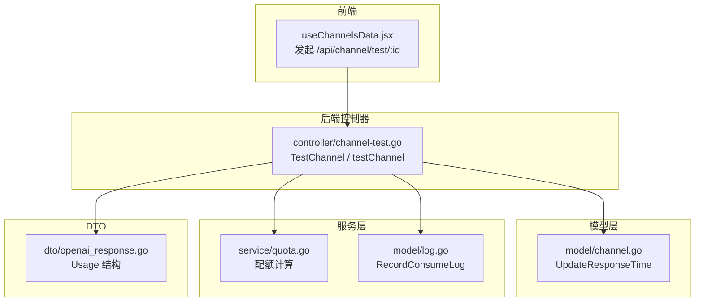
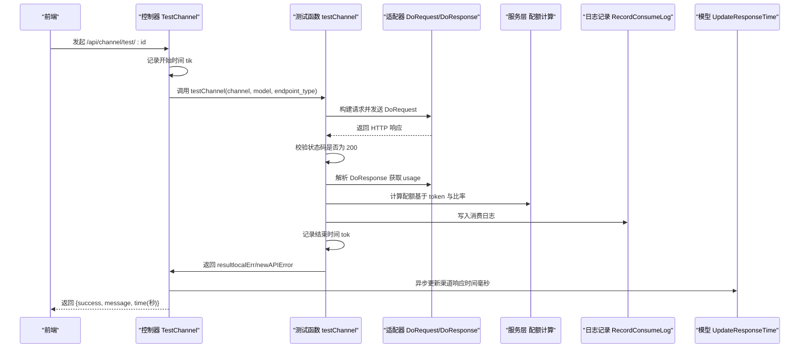
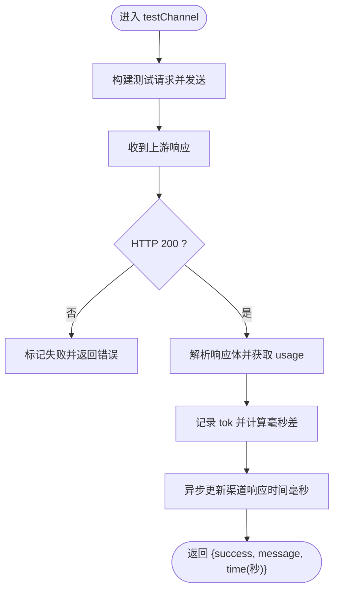
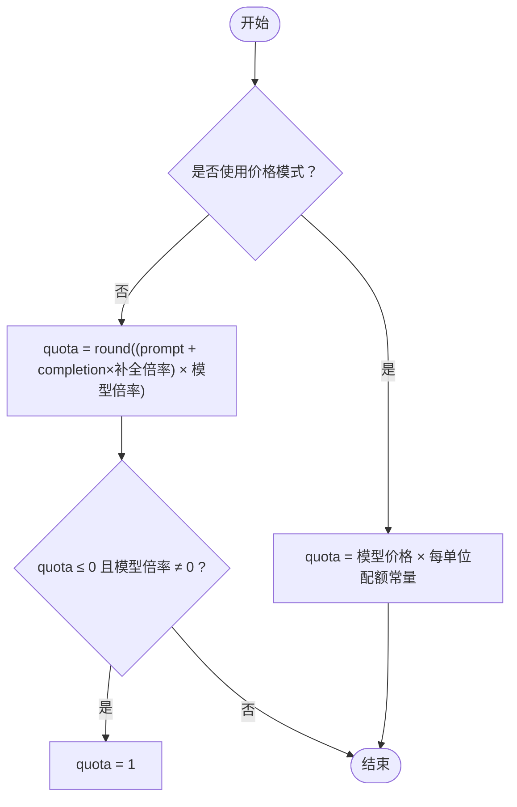
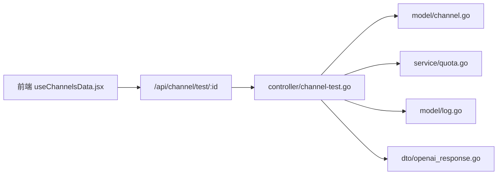

# 测试结果评估

<cite>
**本文引用的文件**
- [controller/channel-test.go](file://controller/channel-test.go)
- [model/channel.go](file://model/channel.go)
- [service/quota.go](file://service/quota.go)
- [dto/openai_response.go](file://dto/openai_response.go)
- [model/log.go](file://model/log.go)
- [common/constants.go](file://common/constants.go)
- [web/src/hooks/channels/useChannelsData.jsx](file://web/src/hooks/channels/useChannelsData.jsx)
</cite>

## 目录
1. [简介](#简介)
2. [项目结构](#项目结构)
3. [核心组件](#核心组件)
4. [架构总览](#架构总览)
5. [详细组件分析](#详细组件分析)
6. [依赖关系分析](#依赖关系分析)
7. [性能考量](#性能考量)
8. [故障排查指南](#故障排查指南)
9. [结论](#结论)

## 简介
本文件面向“渠道测试结果评估机制”，系统化说明以下内容：
- 响应时间测量：从发起测试请求到结束的毫秒级计时，以及如何通过 UpdateResponseTime 方法更新渠道的响应时间指标。
- 成功与失败判定：HTTP 200 状态码为基础要求，并结合 usage 对象的非空校验。
- 配额消耗计算：基于 token 数量与模型比率的配额换算逻辑。
- 日志记录：消费日志的字段与格式规范。

## 项目结构
围绕测试结果评估，涉及的关键模块与文件如下：
- 控制器层：负责接收测试请求、执行测试流程、返回结果。
- 模型层：提供渠道信息、响应时间更新能力。
- 服务层：封装配额计算与日志记录。
- DTO 层：定义 usage 等数据结构。
- Web 前端：触发单通道与批量测试，并展示测试结果。

图表来源
- [controller/channel-test.go](file://controller/channel-test.go#L483-L531)
- [model/channel.go](file://model/channel.go#L504-L512)
- [service/quota.go](file://service/quota.go#L50-L87)
- [dto/openai_response.go](file://dto/openai_response.go#L222-L240)
- [model/log.go](file://model/log.go#L141-L198)
- [web/src/hooks/channels/useChannelsData.jsx](file://web/src/hooks/channels/useChannelsData.jsx#L760-L798)

章节来源
- [controller/channel-test.go](file://controller/channel-test.go#L483-L531)
- [model/channel.go](file://model/channel.go#L504-L512)
- [service/quota.go](file://service/quota.go#L50-L87)
- [dto/openai_response.go](file://dto/openai_response.go#L222-L240)
- [model/log.go](file://model/log.go#L141-L198)
- [web/src/hooks/channels/useChannelsData.jsx](file://web/src/hooks/channels/useChannelsData.jsx#L760-L798)

## 核心组件
- 测试入口与计时
  - 单通道测试：TestChannel 在进入 testChannel 前后分别记录时间，计算毫秒差并转换为秒作为返回的 time 字段。
  - 批量测试：testAllChannels 循环遍历所有渠道，同样进行毫秒计时，并在满足条件时自动禁用或启用渠道。
- 响应时间更新
  - UpdateResponseTime 将毫秒级响应时间写入渠道记录，并同步更新测试时间。
- 成功/失败判定
  - 基础要求：HTTP 200；若上游返回非 200 或适配器处理异常，将返回错误并标记为失败。
  - 关键校验：usage 必须非空，否则视为失败。
- 配额消耗计算
  - 若未使用价格模式：按 prompt_tokens 与 completion_tokens 的加权组合乘以模型倍率与分组倍率，若最终配额为 0 且倍率非零则置为 1。
  - 若使用价格模式：按模型价格 × 每单位配额常量 计算。
- 日志记录
  - 消费日志包含用户、渠道、模型、令牌、用量、配额、耗时、流式标识、分组、其他扩展信息等字段。

章节来源
- [controller/channel-test.go](file://controller/channel-test.go#L356-L383)
- [controller/channel-test.go](file://controller/channel-test.go#L483-L531)
- [controller/channel-test.go](file://controller/channel-test.go#L536-L601)
- [model/channel.go](file://model/channel.go#L504-L512)
- [service/quota.go](file://service/quota.go#L50-L87)
- [dto/openai_response.go](file://dto/openai_response.go#L222-L240)
- [model/log.go](file://model/log.go#L141-L198)

## 架构总览
下面以序列图展示一次单通道测试的端到端流程，包括计时、适配器调用、响应解析、配额计算与日志记录。

图表来源
- [controller/channel-test.go](file://controller/channel-test.go#L483-L531)
- [controller/channel-test.go](file://controller/channel-test.go#L317-L383)
- [service/quota.go](file://service/quota.go#L50-L87)
- [model/log.go](file://model/log.go#L156-L198)
- [model/channel.go](file://model/channel.go#L504-L512)

## 详细组件分析

### 响应时间测量与更新
- 计时范围
  - 从进入 testChannel 开始计时，到读取响应体结束，计算毫秒差。
  - 控制器层将毫秒差转换为秒，作为接口返回的 time 字段。
- 更新策略
  - 控制器异步调用 UpdateResponseTime，将毫秒写入渠道记录，并更新测试时间。
  - 批量测试中，每轮循环同样更新渠道响应时间。

图表来源
- [controller/channel-test.go](file://controller/channel-test.go#L317-L383)
- [controller/channel-test.go](file://controller/channel-test.go#L483-L531)
- [model/channel.go](file://model/channel.go#L504-L512)

章节来源
- [controller/channel-test.go](file://controller/channel-test.go#L317-L383)
- [controller/channel-test.go](file://controller/channel-test.go#L483-L531)
- [model/channel.go](file://model/channel.go#L504-L512)

### 成功与失败判定标准
- 基本要求：HTTP 状态码必须为 200。
- 关键校验：usage 对象必须非空，否则视为失败。
- 错误处理：若请求阶段或响应解析阶段出现错误，将包装为新 API 错误并标记失败。
- 前端展示：当 success 为真时，前端会将 time 字段转换为毫秒并更新渠道的响应时间与测试时间。

章节来源
- [controller/channel-test.go](file://controller/channel-test.go#L317-L343)
- [controller/channel-test.go](file://controller/channel-test.go#L506-L531)
- [web/src/hooks/channels/useChannelsData.jsx](file://web/src/hooks/channels/useChannelsData.jsx#L760-L798)

### 配额消耗计算逻辑
- 未使用价格模式
  - 计算公式：quota = round((prompt_tokens + completion_tokens × 补全倍率) × 模型倍率)
  - 若最终配额为 0 且模型倍率非零，则强制置为 1。
- 使用价格模式
  - 计算公式：quota = 模型价格 × 每单位配额常量
- 倍率来源
  - 模型倍率、补全倍率、分组倍率等来自价格配置与上下文信息。
- 常量
  - 每单位配额常量由全局常量提供。

图表来源
- [service/quota.go](file://service/quota.go#L50-L87)
- [controller/channel-test.go](file://controller/channel-test.go#L356-L365)
- [common/constants.go](file://common/constants.go#L20-L23)

章节来源
- [service/quota.go](file://service/quota.go#L50-L87)
- [controller/channel-test.go](file://controller/channel-test.go#L356-L365)
- [common/constants.go](file://common/constants.go#L20-L23)

### 日志记录内容与格式规范
- 记录位置
  - 消费日志通过 RecordConsumeLog 写入日志表，仅在开启消费日志开关时生效。
- 关键字段
  - 用户、渠道、模型、令牌、用量（prompt/completion）、配额、耗时（秒）、是否流式、分组、IP（可选）、其他扩展信息（JSON）。
- 其他信息
  - 生成其他信息时会包含模型倍率、分组倍率、补全倍率、缓存相关等参数，便于审计与复盘。

章节来源
- [model/log.go](file://model/log.go#L141-L198)
- [controller/channel-test.go](file://controller/channel-test.go#L369-L383)

## 依赖关系分析
- 控制器依赖
  - 调用模型层的 UpdateResponseTime 更新渠道响应时间。
  - 调用服务层的 GenerateTextOtherInfo 与配额计算函数。
  - 依赖 DTO 中的 Usage 结构进行 token 统计。
- 前端依赖
  - 通过 /api/channel/test/:id 触发测试，解析返回的 success、message、time 字段，并在成功时更新渠道响应时间与测试时间。

图表来源
- [web/src/hooks/channels/useChannelsData.jsx](file://web/src/hooks/channels/useChannelsData.jsx#L760-L798)
- [controller/channel-test.go](file://controller/channel-test.go#L483-L531)
- [model/channel.go](file://model/channel.go#L504-L512)
- [service/quota.go](file://service/quota.go#L50-L87)
- [dto/openai_response.go](file://dto/openai_response.go#L222-L240)
- [model/log.go](file://model/log.go#L156-L198)

## 性能考量
- 计时粒度：毫秒级计时，返回秒级 time 字段，避免前端重复换算。
- 异步更新：UpdateResponseTime 采用 goroutine 异步更新，降低接口延迟。
- 批量测试节流：批量测试中对每个渠道间隔固定时间，避免对上游造成压力。
- 日志开关：消费日志默认开启，可通过配置关闭以减少写入开销。

章节来源
- [controller/channel-test.go](file://controller/channel-test.go#L514-L531)
- [controller/channel-test.go](file://controller/channel-test.go#L594-L596)
- [common/constants.go](file://common/constants.go#L74-L74)

## 故障排查指南
- 常见失败场景
  - HTTP 非 200：适配器会将错误映射为新 API 错误并返回。
  - usage 为空：视为失败，提示 usage 为空。
  - 请求阶段错误：如网络异常、上游超时等，包装为错误并返回。
- 响应时间异常
  - 若超过阈值，批量测试会自动禁用渠道并上报错误。
- 日志核对
  - 消费日志包含关键字段，可用于定位问题；若未记录，检查日志开关与数据库连接。

章节来源
- [controller/channel-test.go](file://controller/channel-test.go#L317-L343)
- [controller/channel-test.go](file://controller/channel-test.go#L568-L582)
- [model/log.go](file://model/log.go#L156-L198)

## 结论
本机制以“HTTP 200 + usage 非空”为基本成功判定，结合毫秒级计时与异步响应时间更新，确保测试结果的准确性与时效性。配额计算遵循 token 与倍率规则，消费日志提供完整审计线索。建议在生产环境中合理设置响应时间阈值与批量测试间隔，以平衡稳定性与效率。