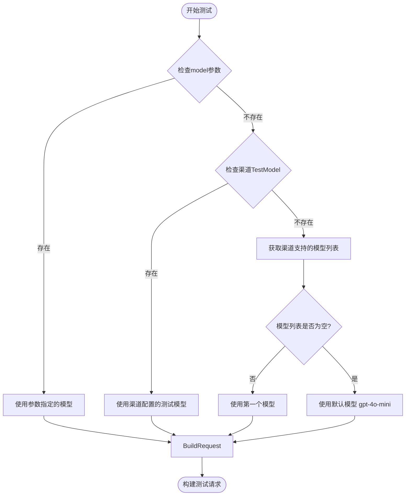
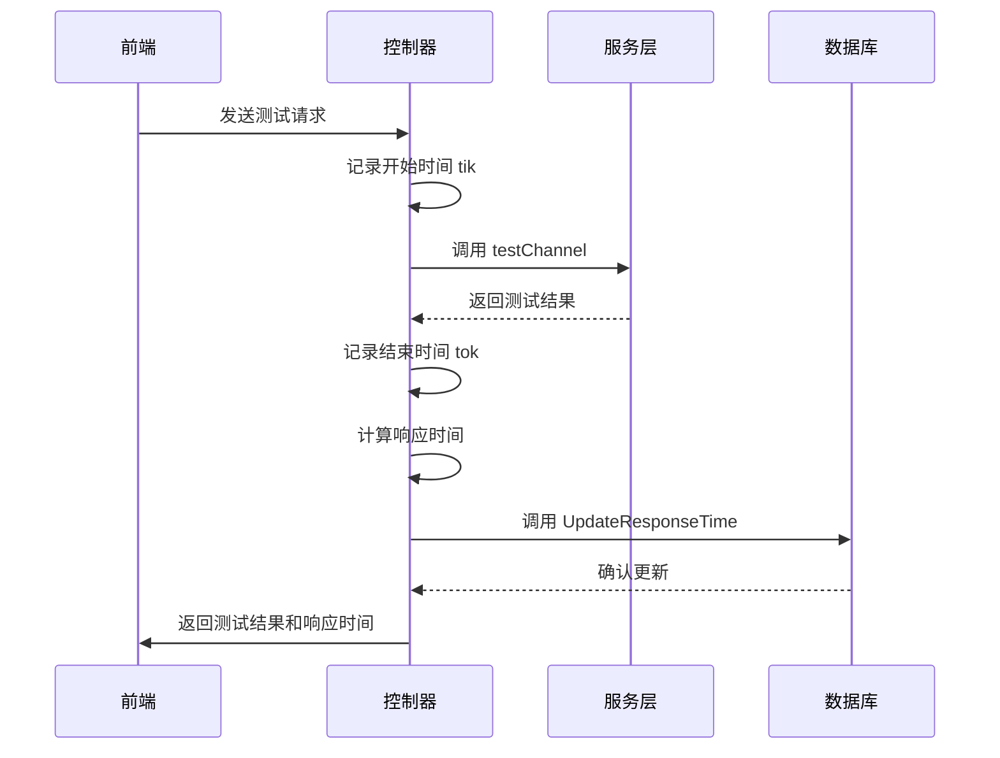
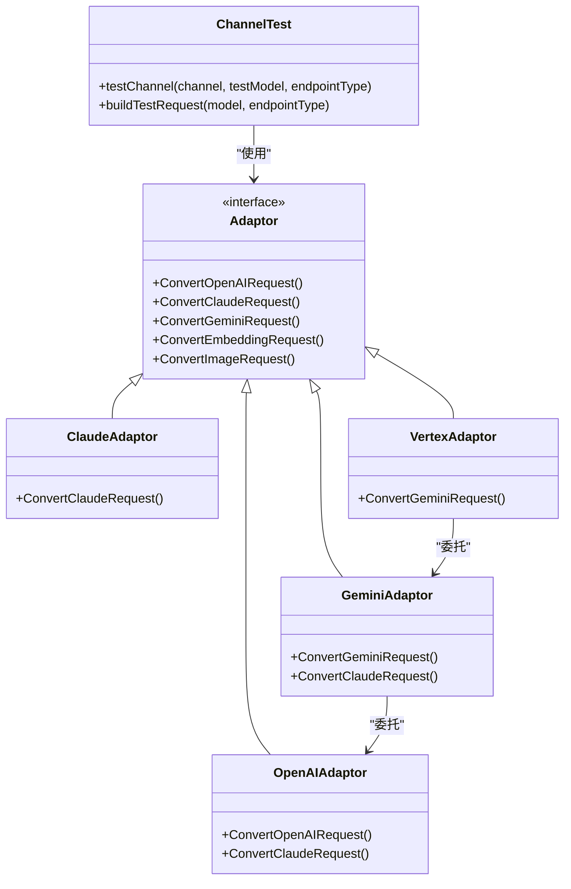
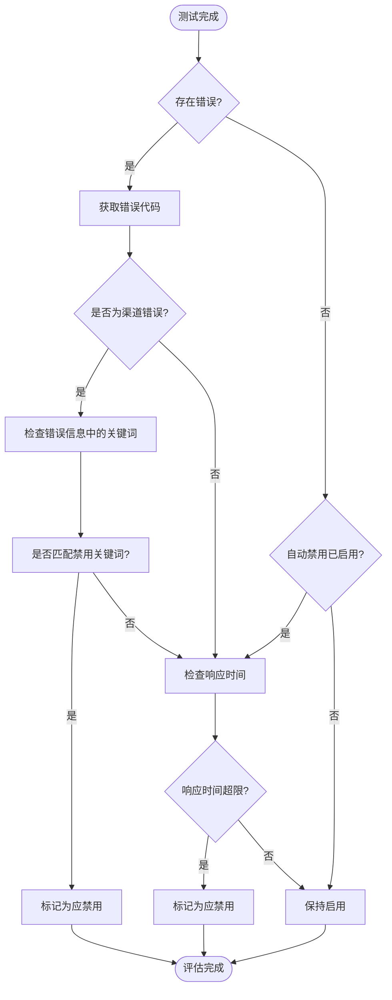

# 渠道测试

<cite>
**本文档引用的文件**   
- [channel-test.go](file://controller/channel-test.go)
- [channel.go](file://model/channel.go)
- [error.go](file://types/error.go)
- [service/channel.go](file://service/channel.go)
- [ModelTestModal.jsx](file://web/src/components/table/channels/modals/ModelTestModal.jsx)
- [useChannelsData.jsx](file://web/src/hooks/channels/useChannelsData.jsx)
- [adaptor.go](file://relay/channel/gemini/adaptor.go)
- [adaptor.go](file://relay/channel/claude/adaptor.go)
- [constants.go](file://relay/channel/claude/constants.go)
- [constants.go](file://relay/channel/vertex/constants.go)
</cite>

## 目录
1. [测试流程概述](#测试流程概述)
2. [测试模型选择与请求构建](#测试模型选择与请求构建)
3. [响应时间测量与状态更新](#响应时间测量与状态更新)
4. [AI服务适配测试机制](#ai服务适配测试机制)
5. [不支持测试的渠道类型](#不支持测试的渠道类型)
6. [测试结果评估与状态码映射](#测试结果评估与状态码映射)
7. [前端测试模态框交互流程](#前端测试模态框交互流程)
8. [安全验证机制](#安全验证机制)

## 测试流程概述

渠道测试功能通过`TestChannel`接口实现，该接口接收渠道ID、测试模型和端点类型作为参数。测试流程从获取渠道信息开始，然后调用内部的`testChannel`函数执行实际的测试逻辑。测试过程中会记录开始时间，在测试完成后计算响应时间，并将结果更新到渠道记录中。整个流程包含错误处理、响应时间测量和状态更新等关键步骤。

**Section sources**
- [channel-test.go](file://controller/channel-test.go#L483-L531)

## 测试模型选择与请求构建

测试模型的选择遵循特定的优先级顺序：首先检查请求参数中的`model`查询参数，如果未提供则检查渠道配置中的`TestModel`字段，如果仍然为空则从渠道支持的模型列表中选择第一个模型作为测试模型。如果所有尝试都失败，则默认使用`gpt-4o-mini`模型。

请求的构建由`buildTestRequest`函数负责，该函数根据指定的端点类型或自动检测逻辑创建相应的测试请求。系统支持多种端点类型，包括OpenAI、Anthropic、Gemini等，每种类型都有对应的请求格式。例如，对于Embedding模型会创建包含"hello world"输入的Embedding请求，而对于常规聊天模型则创建包含"hi"消息的聊天请求。

**Diagram sources **
- [channel-test.go](file://controller/channel-test.go#L64-L76)
- [channel-test.go](file://controller/channel-test.go#L392-L480)

**Section sources**
- [channel-test.go](file://controller/channel-test.go#L64-L480)

## 响应时间测量与状态更新

响应时间的测量从测试开始时记录时间戳，到测试完成时计算时间差。具体实现中，使用`time.Now()`函数在测试前后分别获取时间戳，然后通过`Sub`方法计算毫秒级的响应时间。测量结果会通过`UpdateResponseTime`方法更新到数据库中，同时也会更新测试时间戳。

状态更新不仅包括响应时间，还包括根据测试结果自动调整渠道状态的逻辑。如果测试失败且满足禁用条件，系统会自动将渠道状态设置为禁用；如果之前被自动禁用的渠道现在测试成功，系统也会自动将其重新启用。这种自动状态管理机制确保了渠道的可用性。

**Diagram sources **
- [channel-test.go](file://controller/channel-test.go#L504-L516)
- [channel.go](file://model/channel.go#L504-L512)

**Section sources**
- [channel-test.go](file://controller/channel-test.go#L504-L516)
- [channel.go](file://model/channel.go#L504-L512)

## AI服务适配测试机制

系统通过适配器模式支持多种AI服务的测试，包括OpenAI、Claude和Gemini等。每种服务类型都有对应的适配器实现，负责处理特定的请求格式转换和响应处理。测试时，系统会根据渠道类型获取相应的适配器，并通过该适配器执行测试请求。

对于Claude服务，系统在`relay/channel/claude`目录中定义了专门的常量和适配器。`constants.go`文件中列出了所有支持的Claude模型，如`claude-3-sonnet-20240229`和`claude-3-opus-20240229`等。适配器会根据这些模型列表构建测试请求，并处理Claude特有的请求格式。

对于Gemini服务，系统同样提供了专门的适配器实现。`relay/channel/gemini/adaptor.go`文件中的`ConvertGeminiRequest`方法负责将通用请求转换为Gemini API所需的格式。当测试Gemini渠道时，系统会使用这个适配器来确保请求符合Gemini API的规范。

**Diagram sources **
- [adaptor.go](file://relay/channel/gemini/adaptor.go#L24-L51)
- [adaptor.go](file://relay/channel/claude/adaptor.go)
- [constants.go](file://relay/channel/claude/constants.go#L3-L27)
- [constants.go](file://relay/channel/vertex/constants.go#L3-L13)

**Section sources**
- [adaptor.go](file://relay/channel/gemini/adaptor.go)
- [adaptor.go](file://relay/channel/claude/adaptor.go)
- [constants.go](file://relay/channel/claude/constants.go)
- [constants.go](file://relay/channel/vertex/constants.go)

## 不支持测试的渠道类型

系统明确列出了不支持测试的渠道类型，这些类型在`testChannel`函数的开头部分通过`unsupportedTestChannelTypes`数组定义。目前不支持测试的渠道包括Midjourney、SunoAPI、Kling、Jimeng、DoubaoVideo和Vidu等。当尝试测试这些渠道时，系统会立即返回错误信息，提示"不支持该渠道类型的测试"。

这种设计是合理的，因为这些渠道通常涉及复杂的异步处理流程或特殊的API调用模式，不适合通过简单的同步请求来测试。例如，Midjourney涉及图像生成的异步任务，而SunoAPI涉及音频生成，这些都需要特殊的测试逻辑，而不是简单的请求-响应模式。

**Section sources**
- [channel-test.go](file://controller/channel-test.go#L45-L53)

## 测试结果评估与状态码映射

测试结果的评估基于多个标准，包括请求是否成功、响应状态码是否为200、以及响应时间是否超过阈值。系统定义了详细的错误代码映射机制，将各种错误情况映射到标准化的错误码。这些错误码定义在`types/error.go`文件中，包括`ErrorCodeChannelResponseTimeExceeded`（响应时间超限）、`ErrorCodeChannelInvalidKey`（无效密钥）等。

当测试失败时，系统会根据错误类型决定是否自动禁用渠道。`ShouldDisableChannel`函数负责这一决策过程，它会检查错误信息是否包含预设的关键词（定义在`operation_setting.AutomaticDisableKeywords`中）。如果匹配成功，则返回true，表示应该禁用该渠道。同时，系统还支持基于响应时间的自动禁用，当响应时间超过`ChannelDisableThreshold`配置的阈值时，也会触发自动禁用。

**Diagram sources **
- [error.go](file://types/error.go#L51-L58)
- [service/channel.go](file://service/channel.go#L96-L98)
- [channel-test.go](file://controller/channel-test.go#L576-L582)

**Section sources**
- [error.go](file://types/error.go#L51-L58)
- [service/channel.go](file://service/channel.go#L96-L112)
- [channel-test.go](file://controller/channel-test.go#L576-L582)

## 前端测试模态框交互流程

前端的测试功能通过`ModelTestModal`组件实现，该组件提供了一个模态框界面，允许用户选择特定模型进行测试或批量测试所有模型。模态框显示渠道支持的所有模型列表，并提供搜索功能以便用户快速找到目标模型。

用户可以选择端点类型（如OpenAI、Anthropic、Gemini等），然后点击"测试"按钮开始测试。对于单个模型测试，系统会发送请求到`/api/channel/test/{id}?model={model}`端点；对于批量测试，系统会并发测试所有匹配的模型。测试过程中，界面会实时更新每个模型的测试状态（测试中、成功、失败）和响应时间。

批量测试支持并发执行，最多同时测试5个模型，以提高测试效率。用户可以随时点击"停止测试"按钮中断批量测试过程。测试完成后，系统会显示成功和失败的模型数量统计，并提供"复制已选"功能，方便用户复制成功模型的列表。

**Section sources**
- [ModelTestModal.jsx](file://web/src/components/table/channels/modals/ModelTestModal.jsx)
- [useChannelsData.jsx](file://web/src/hooks/channels/useChannelsData.jsx#L756-L955)

## 安全验证机制

系统的安全验证机制通过`SecureVerificationService`和`SecureVerificationModal`组件实现。当用户执行敏感操作（如渠道测试）时，如果系统检测到需要额外验证，会弹出安全验证模态框。该模态框支持多种验证方式，包括两步验证（2FA）和Passkey生物特征验证。

验证状态完全由后端Session控制，前端不存储任何验证状态，确保了安全性。`useSecureVerification` Hook负责管理验证流程，包括检查可用的验证方式、显示验证模态框和处理验证结果。如果用户未启用任何验证方式，系统会提示用户先启用两步验证或Passkey才能执行敏感操作。

这种分层的安全机制确保了只有经过身份验证的用户才能执行可能影响系统配置的操作，同时提供了现代化的Passkey验证选项，提升了用户体验和安全性。

**Section sources**
- [secureVerification.js](file://web/src/services/secureVerification.js)
- [SecureVerificationModal.jsx](file://web/src/components/common/modals/SecureVerificationModal.jsx)
- [useSecureVerification.jsx](file://web/src/hooks/common/useSecureVerification.jsx)