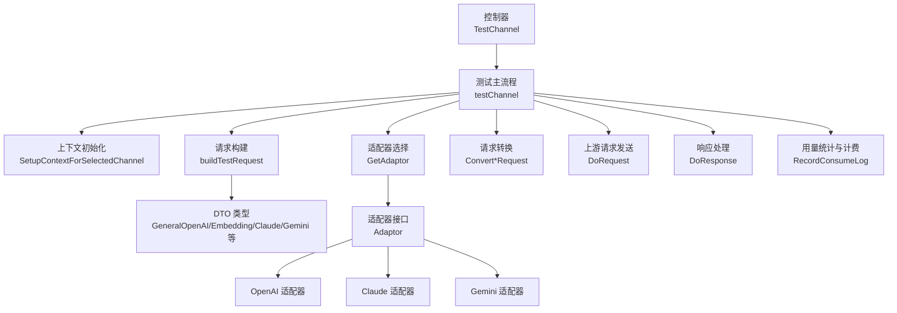
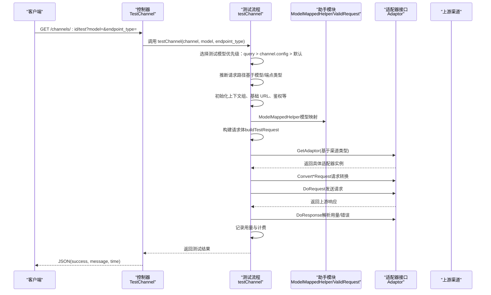
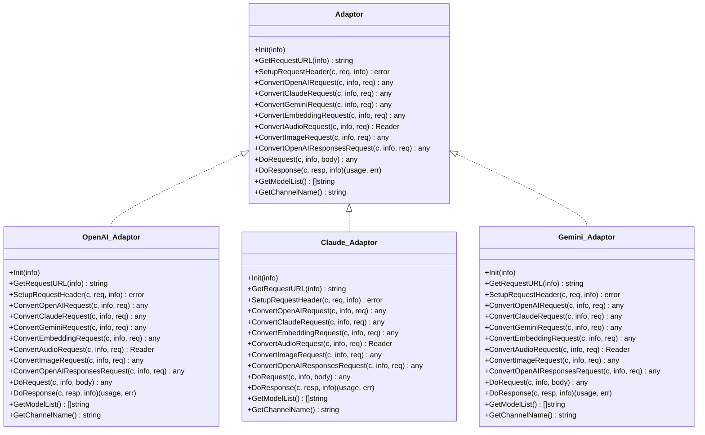
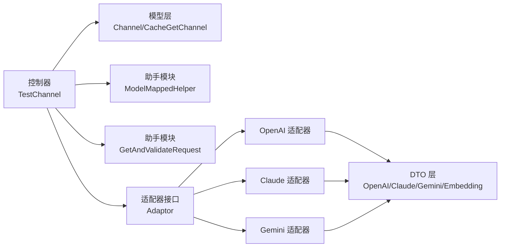

# 渠道测试流程

<cite>
**本文引用的文件**
- [controller/channel-test.go](file://controller/channel-test.go)
- [common/endpoint_defaults.go](file://common/endpoint_defaults.go)
- [dto/openai_request.go](file://dto/openai_request.go)
- [dto/embedding.go](file://dto/embedding.go)
- [dto/claude.go](file://dto/claude.go)
- [dto/gemini.go](file://dto/gemini.go)
- [relay/channel/adapter.go](file://relay/channel/adapter.go)
- [relay/channel/openai/adaptor.go](file://relay/channel/openai/adaptor.go)
- [relay/channel/claude/adaptor.go](file://relay/channel/claude/adaptor.go)
- [relay/channel/gemini/adaptor.go](file://relay/channel/gemini/adaptor.go)
- [relay/helper/model_mapped.go](file://relay/helper/model_mapped.go)
- [relay/helper/valid_request.go](file://relay/helper/valid_request.go)
- [service/channel.go](file://service/channel.go)
- [model/channel.go](file://model/channel.go)
- [types/channel_error.go](file://types/channel_error.go)
</cite>

## 目录
1. [引言](#引言)
2. [项目结构](#项目结构)
3. [核心组件](#核心组件)
4. [架构总览](#架构总览)
5. [详细组件分析](#详细组件分析)
6. [依赖关系分析](#依赖关系分析)
7. [性能考量](#性能考量)
8. [故障排查指南](#故障排查指南)
9. [结论](#结论)

## 引言
本文档围绕“渠道测试流程”展开，聚焦于 testChannel 函数的完整执行流程，涵盖以下关键主题：
- 测试模型选择逻辑（优先级：查询参数 > 通道配置 > 默认模型）
- 请求路径动态生成机制（根据模型类型自动判断 /v1/chat/completions、/v1/embeddings、/v1/messages、/v1beta/models 等）
- 上下文初始化、适配器选择与请求转换过程
- 不同端点类型（OpenAI、Claude、Gemini、Embedding、图像生成、Rerank、Responses 等）的差异化请求参数设置
- 测试过程中的错误处理机制与日志记录规范

## 项目结构
渠道测试位于控制器层，核心入口为 TestChannel；内部调用 testChannel 完成测试全流程，并通过适配器层对接不同上游渠道（OpenAI、Claude、Gemini 等），借助 DTO 层构建标准化请求体，利用助手模块进行模型映射与校验，最终记录用量与消费日志。

图表来源
- [controller/channel-test.go](file://controller/channel-test.go#L483-L531)
- [dto/openai_request.go](file://dto/openai_request.go#L26-L120)
- [dto/embedding.go](file://dto/embedding.go#L22-L56)
- [dto/claude.go](file://dto/claude.go#L192-L215)
- [dto/gemini.go](file://dto/gemini.go#L14-L41)
- [relay/channel/adapter.go](file://relay/channel/adapter.go#L15-L32)
- [relay/channel/openai/adaptor.go](file://relay/channel/openai/adaptor.go#L1-L120)
- [relay/channel/claude/adaptor.go](file://relay/channel/claude/adaptor.go#L1-L87)
- [relay/channel/gemini/adaptor.go](file://relay/channel/gemini/adaptor.go#L1-L175)

章节来源
- [controller/channel-test.go](file://controller/channel-test.go#L483-L531)

## 核心组件
- 控制器入口：TestChannel 接收请求参数（渠道 ID、可选 model、endpoint_type），调用 testChannel 并返回结果。
- 测试主流程：testChannel 完成模型选择、路径推断、上下文初始化、适配器选择、请求转换、请求发送、响应处理、用量统计与计费。
- DTO 层：统一承载不同端点类型的请求结构（通用聊天、嵌入、Claude、Gemini 等）。
- 适配器层：按渠道类型实现请求 URL、请求头、请求体转换、响应处理等。
- 助手模块：模型映射、请求校验、价格估算等辅助能力。

章节来源
- [controller/channel-test.go](file://controller/channel-test.go#L43-L390)
- [dto/openai_request.go](file://dto/openai_request.go#L26-L120)
- [dto/embedding.go](file://dto/embedding.go#L22-L56)
- [dto/claude.go](file://dto/claude.go#L192-L215)
- [dto/gemini.go](file://dto/gemini.go#L14-L41)
- [relay/channel/adapter.go](file://relay/channel/adapter.go#L15-L32)

## 架构总览
下图展示从控制器到适配器的调用链路，以及请求路径与端点类型之间的关系。

图表来源
- [controller/channel-test.go](file://controller/channel-test.go#L483-L531)
- [relay/helper/model_mapped.go](file://relay/helper/model_mapped.go#L13-L58)
- [relay/helper/valid_request.go](file://relay/helper/valid_request.go#L19-L52)
- [relay/channel/adapter.go](file://relay/channel/adapter.go#L15-L32)

## 详细组件分析

### 1) 模型选择与路径推断
- 模型选择优先级
  - 查询参数 model：若存在，则直接使用。
  - 通道配置 test_model：若通道配置了测试模型且非空，则使用。
  - 通道可用模型列表首项：若通道模型列表非空，则取首个模型。
  - 默认模型：若以上均不可用，则回退到默认模型（如 gpt-4o-mini）。
- 请求路径推断
  - 若 endpoint_type 显式指定，则依据默认端点映射表选择路径。
  - 否则根据模型名特征自动推断：
    - 嵌入类模型（包含特定关键词或前缀）：/v1/embeddings
    - VolcEngine 且包含特定关键词：/v1/images/generations
    - 其他默认：/v1/chat/completions
  - 进一步根据请求路径自动推断 relayFormat（OpenAI、Embedding、Image、Claude、Gemini、Rerank、Responses 等）。

章节来源
- [controller/channel-test.go](file://controller/channel-test.go#L43-L177)
- [common/endpoint_defaults.go](file://common/endpoint_defaults.go#L13-L33)

### 2) 上下文初始化与请求构建
- 上下文初始化
  - 使用缓存或数据库获取渠道信息。
  - 设置用户缓存上下文、组、基础 URL、鉴权头等。
  - 调用中间件 SetupContextForSelectedChannel 完成渠道选择与鉴权准备。
- 请求构建
  - 根据 endpoint_type 或自动推断的路径，构造不同类型的请求体：
    - Embedding：输入为文本或数组，维度、编码格式等参数按需设置。
    - 图像生成：prompt、n、size 等参数按需设置。
    - Rerank：query、documents、topN 等。
    - Responses：input、metadata 等。
    - OpenAI：消息数组、最大令牌数、温度、采样策略等；针对不同模型类型设置 MaxTokens/MaxCompletionTokens。
  - 对于 Gemini/Claude 的特殊转换，会在后续适配器阶段处理。

章节来源
- [controller/channel-test.go](file://controller/channel-test.go#L109-L177)
- [controller/channel-test.go](file://controller/channel-test.go#L392-L481)
- [dto/openai_request.go](file://dto/openai_request.go#L26-L120)
- [dto/embedding.go](file://dto/embedding.go#L22-L56)
- [dto/claude.go](file://dto/claude.go#L192-L215)
- [dto/gemini.go](file://dto/gemini.go#L14-L41)

### 3) 适配器选择与请求转换
- 适配器选择
  - 通过渠道类型映射到具体适配器（OpenAI、Claude、Gemini 等）。
- 请求转换
  - OpenAI 适配器：根据渠道类型调整推理参数、流式选项、头部等；必要时将 Claude/Gemini 请求转换为 OpenAI 格式。
  - Claude 适配器：根据模型版本选择消息/补全模式；设置 Anthropic 特定头部。
  - Gemini 适配器：根据模型类型选择 generateContent、embedContent、streamGenerateContent 等端点；处理 -thinking 后缀与批量嵌入。
- 请求发送与响应处理
  - DoRequest：根据 RelayMode 选择普通 API、表单上传、实时 WebSocket 等发送方式。
  - DoResponse：根据 RelayMode 选择对应处理器（流式/非流式、文本/图像/嵌入/音频等）。

图表来源
- [relay/channel/adapter.go](file://relay/channel/adapter.go#L15-L32)
- [relay/channel/openai/adaptor.go](file://relay/channel/openai/adaptor.go#L1-L120)
- [relay/channel/claude/adaptor.go](file://relay/channel/claude/adaptor.go#L1-L87)
- [relay/channel/gemini/adaptor.go](file://relay/channel/gemini/adaptor.go#L1-L175)

章节来源
- [relay/channel/adapter.go](file://relay/channel/adapter.go#L15-L32)
- [relay/channel/openai/adaptor.go](file://relay/channel/openai/adaptor.go#L1-L120)
- [relay/channel/claude/adaptor.go](file://relay/channel/claude/adaptor.go#L1-L87)
- [relay/channel/gemini/adaptor.go](file://relay/channel/gemini/adaptor.go#L1-L175)

### 4) 请求路径与端点类型映射
- 默认端点映射表提供常见端点的路径与方法，便于根据 endpoint_type 快速定位上游路径。
- 自动推断逻辑会结合模型名特征与请求路径进一步细化 relayFormat，确保后续转换与处理正确。

章节来源
- [common/endpoint_defaults.go](file://common/endpoint_defaults.go#L13-L33)
- [controller/channel-test.go](file://controller/channel-test.go#L134-L177)

### 5) 错误处理与日志记录
- 错误分类
  - 本地错误（localErr）：如模型选择失败、请求体构建失败、适配器初始化失败等。
  - 上游错误（newAPIError）：如请求转换失败、DoRequest 失败、上游返回非 200、用量为空等。
- 日志记录
  - 在关键步骤记录系统日志（SysLog），包含渠道 ID、模型名、RelayInfo 等关键信息。
  - 响应体读取与用量统计完成后，记录详细日志以便审计。
- 结果返回
  - 成功：返回 success=true，time 为耗时秒。
  - 失败：返回 success=false，message 为错误信息，time 为耗时秒（若已产生）。

章节来源
- [controller/channel-test.go](file://controller/channel-test.go#L310-L390)
- [controller/channel-test.go](file://controller/channel-test.go#L483-L531)

### 6) 自动化测试与禁用策略
- 自动测试
  - testAllChannels 会遍历所有渠道，逐个执行 testChannel，并记录响应时间与错误。
- 禁用/启用策略
  - 若测试出现请求错误，根据 ShouldDisableChannel 判断是否需要禁用渠道。
  - 若超过阈值（ChannelDisableThreshold），也会标记为禁用。
  - 若渠道处于自动禁用状态且当前无错误，可自动启用。

章节来源
- [controller/channel-test.go](file://controller/channel-test.go#L533-L643)
- [service/channel.go](file://service/channel.go#L96-L112)
- [types/channel_error.go](file://types/channel_error.go#L1-L21)

## 依赖关系分析
- 控制器依赖
  - 控制器依赖模型层获取渠道信息，依赖中间件初始化上下文，依赖助手模块进行模型映射与请求校验。
- 适配器依赖
  - 适配器依赖 DTO 层定义的请求结构，按渠道类型实现转换与处理。
- 价格与用量
  - 通过 ModelPriceHelper 估算价格，结合用量计算配额并记录消费日志。

图表来源
- [controller/channel-test.go](file://controller/channel-test.go#L125-L205)
- [relay/helper/model_mapped.go](file://relay/helper/model_mapped.go#L13-L58)
- [relay/helper/valid_request.go](file://relay/helper/valid_request.go#L19-L52)
- [relay/channel/adapter.go](file://relay/channel/adapter.go#L15-L32)
- [dto/openai_request.go](file://dto/openai_request.go#L26-L120)
- [dto/claude.go](file://dto/claude.go#L192-L215)
- [dto/gemini.go](file://dto/gemini.go#L14-L41)
- [dto/embedding.go](file://dto/embedding.go#L22-L56)

章节来源
- [controller/channel-test.go](file://controller/channel-test.go#L125-L205)
- [relay/helper/model_mapped.go](file://relay/helper/model_mapped.go#L13-L58)
- [relay/helper/valid_request.go](file://relay/helper/valid_request.go#L19-L52)

## 性能考量
- 响应时间统计：在测试开始与结束分别记录时间戳，计算耗时并异步更新渠道响应时间。
- 自动禁用阈值：超过阈值将触发禁用策略，避免慢通道影响整体稳定性。
- 并发控制：自动化测试使用互斥锁避免重复执行，同时在遍历渠道时加入间隔，降低上游压力。

章节来源
- [controller/channel-test.go](file://controller/channel-test.go#L504-L531)
- [controller/channel-test.go](file://controller/channel-test.go#L533-L603)
- [model/channel.go](file://model/channel.go#L504-L512)

## 故障排查指南
- 常见错误与定位
  - 模型选择失败：检查查询参数 model、通道配置 test_model、默认模型回退逻辑。
  - 路径推断错误：确认模型名特征是否命中嵌入/图像等分支，或显式指定 endpoint_type。
  - 适配器初始化失败：检查渠道类型映射与 API 类型转换。
  - 请求转换失败：核对 DTO 字段是否满足各端点要求（如嵌入的 input、Claude 的 messages、Gemini 的 contents 等）。
  - 上游非 200：查看 DoRequest/DoResponse 的错误封装与状态码映射。
- 日志与审计
  - 关注 SysLog 中的渠道 ID、模型名、RelayInfo ToString 输出，便于快速定位问题。
  - 消费日志包含 PromptTokens、CompletionTokens、模型名、配额、耗时等，可用于成本与性能分析。

章节来源
- [controller/channel-test.go](file://controller/channel-test.go#L310-L390)
- [model/channel.go](file://model/channel.go#L504-L512)

## 结论
testChannel 函数通过清晰的优先级模型选择、灵活的路径推断、完善的上下文初始化与适配器转换，实现了对多渠道、多端点类型的统一测试。配合错误分类与日志记录，能够有效定位问题并保障自动化测试的稳定性与可观测性。建议在生产环境中结合禁用阈值与自动启用策略，持续优化渠道健康度与用户体验。