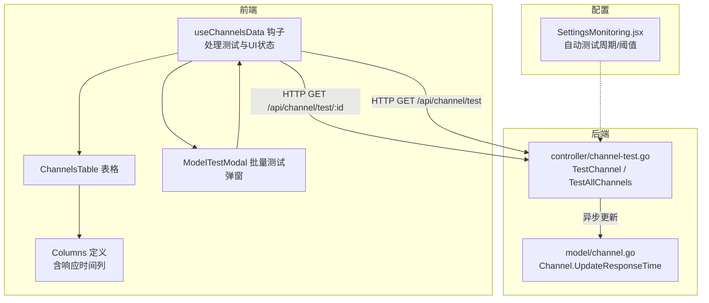
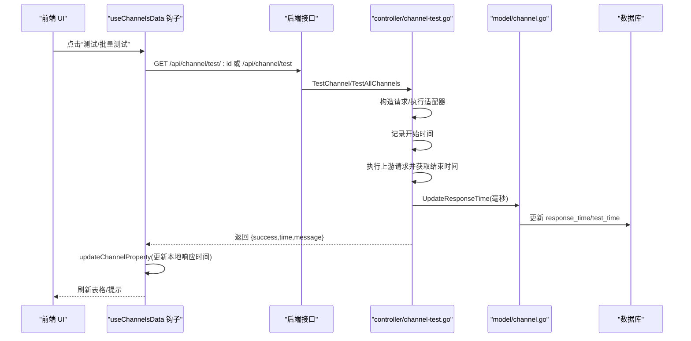
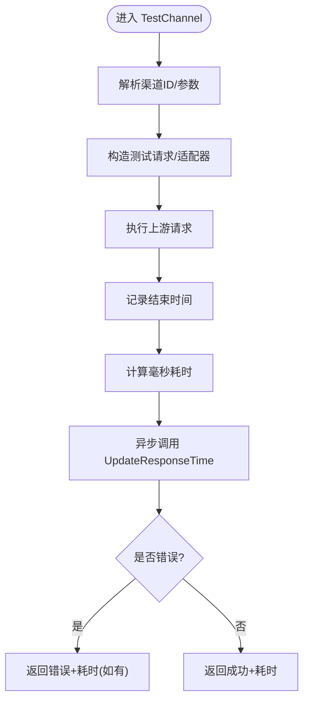
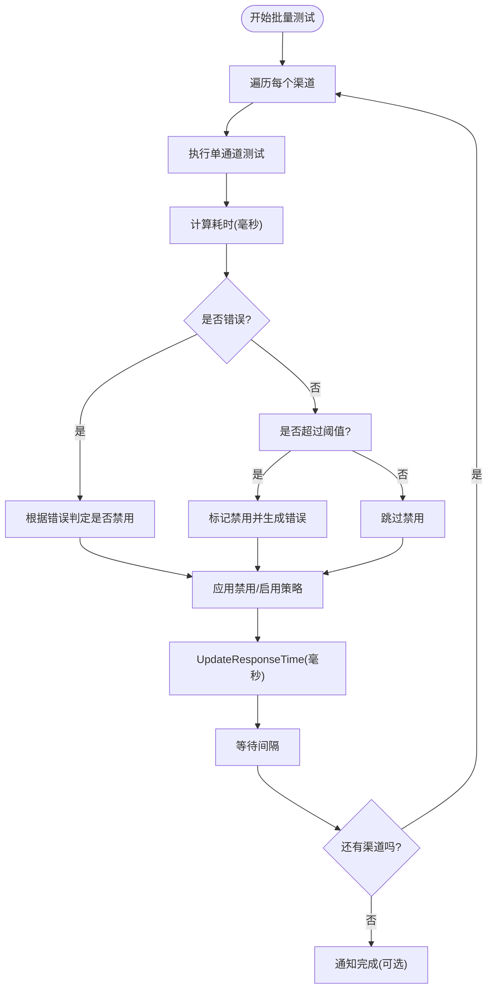
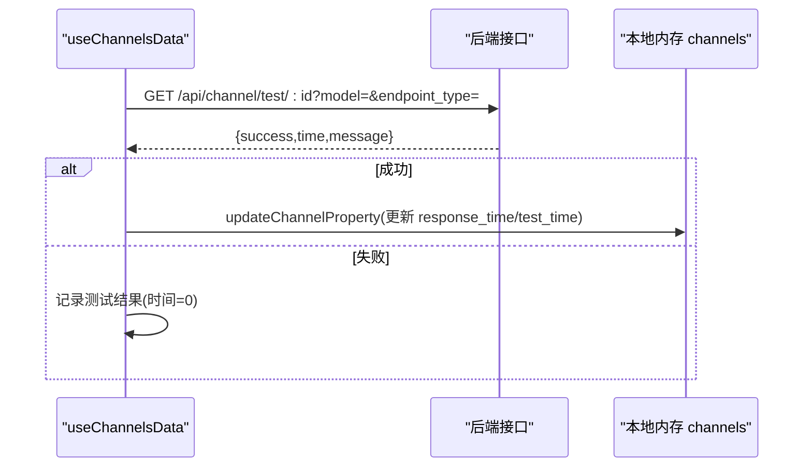
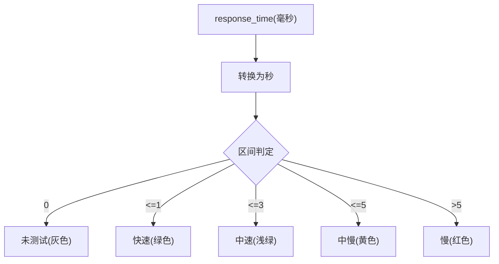
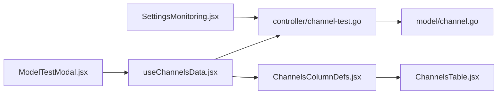

# 渠道性能监控

<cite>
**本文引用的文件**
- [controller/channel-test.go](file://controller/channel-test.go)
- [model/channel.go](file://model/channel.go)
- [web/src/hooks/channels/useChannelsData.jsx](file://web/src/hooks/channels/useChannelsData.jsx)
- [web/src/components/table/channels/ChannelsTable.jsx](file://web/src/components/table/channels/ChannelsTable.jsx)
- [web/src/components/table/channels/ChannelsColumnDefs.jsx](file://web/src/components/table/channels/ChannelsColumnDefs.jsx)
- [web/src/components/table/channels/modals/ModelTestModal.jsx](file://web/src/components/table/channels/modals/ModelTestModal.jsx)
- [web/src/pages/Setting/Operation/SettingsMonitoring.jsx](file://web/src/pages/Setting/Operation/SettingsMonitoring.jsx)
</cite>

## 目录
1. [简介](#简介)
2. [项目结构](#项目结构)
3. [核心组件](#核心组件)
4. [架构总览](#架构总览)
5. [详细组件分析](#详细组件分析)
6. [依赖关系分析](#依赖关系分析)
7. [性能考量](#性能考量)
8. [故障排查指南](#故障排查指南)
9. [结论](#结论)

## 简介
本文件聚焦“渠道性能监控”的实现机制，围绕响应时间监控展开，覆盖以下关键点：
- 后端通过 TestChannel 接口发起测试请求，计算毫秒级响应时间，并异步调用 UpdateResponseTime 更新数据库。
- 前端 useChannelsData 钩子负责处理测试结果，使用 updateChannelProperty 函数同步更新本地渠道数据中的响应时间与测试时间。
- ChannelsTable 与 Columns 定义负责在表格中展示响应时间，并提供批量测试能力与可视化反馈。
- 自动化测试流程支持定时全量测试与阈值自动禁用策略，保障渠道健康度。

## 项目结构
与渠道性能监控相关的核心模块分布如下：
- 后端控制器：controller/channel-test.go 提供单通道测试与全量测试入口。
- 数据模型：model/channel.go 定义 Channel 结构及 UpdateResponseTime 方法。
- 前端钩子：web/src/hooks/channels/useChannelsData.jsx 统一管理渠道数据、测试状态与更新逻辑。
- 前端表格：web/src/components/table/channels/ChannelsTable.jsx 与 ChannelsColumnDefs.jsx 负责渲染与交互；ModelTestModal.jsx 提供批量测试弹窗。
- 运维配置：web/src/pages/Setting/Operation/SettingsMonitoring.jsx 提供自动测试周期与阈值配置。

图表来源
- [controller/channel-test.go](file://controller/channel-test.go#L483-L531)
- [model/channel.go](file://model/channel.go#L504-L512)
- [web/src/hooks/channels/useChannelsData.jsx](file://web/src/hooks/channels/useChannelsData.jsx#L756-L840)
- [web/src/components/table/channels/ChannelsTable.jsx](file://web/src/components/table/channels/ChannelsTable.jsx#L1-L169)
- [web/src/components/table/channels/ChannelsColumnDefs.jsx](file://web/src/components/table/channels/ChannelsColumnDefs.jsx#L154-L188)
- [web/src/components/table/channels/modals/ModelTestModal.jsx](file://web/src/components/table/channels/modals/ModelTestModal.jsx#L1-L322)
- [web/src/pages/Setting/Operation/SettingsMonitoring.jsx](file://web/src/pages/Setting/Operation/SettingsMonitoring.jsx#L128-L165)

章节来源
- [controller/channel-test.go](file://controller/channel-test.go#L483-L531)
- [model/channel.go](file://model/channel.go#L504-L512)
- [web/src/hooks/channels/useChannelsData.jsx](file://web/src/hooks/channels/useChannelsData.jsx#L756-L840)
- [web/src/components/table/channels/ChannelsTable.jsx](file://web/src/components/table/channels/ChannelsTable.jsx#L1-L169)
- [web/src/components/table/channels/ChannelsColumnDefs.jsx](file://web/src/components/table/channels/ChannelsColumnDefs.jsx#L154-L188)
- [web/src/components/table/channels/modals/ModelTestModal.jsx](file://web/src/components/table/channels/modals/ModelTestModal.jsx#L1-L322)
- [web/src/pages/Setting/Operation/SettingsMonitoring.jsx](file://web/src/pages/Setting/Operation/SettingsMonitoring.jsx#L128-L165)

## 核心组件
- 后端测试接口
  - TestChannel：接收渠道ID与可选参数，执行一次测试请求，计算毫秒级耗时，异步更新数据库响应时间字段。
  - TestAllChannels：遍历所有渠道，逐个测试并根据阈值自动禁用或启用渠道，同时更新响应时间。
- 数据模型
  - Channel.UpdateResponseTime：原子更新 response_time 与 test_time 字段。
- 前端钩子
  - useChannelsData：封装渠道数据加载、搜索、分页、测试、批量测试、状态更新等逻辑。
  - updateChannelProperty：在本地内存中安全更新指定渠道的响应时间与测试时间。
- 前端表格与列
  - ChannelsTable：承载渠道列表与分页、行选择等交互。
  - Columns 定义：包含“响应时间”列，按耗时区间着色显示；“操作”列提供测试入口。
  - ModelTestModal：提供批量测试弹窗，支持端点类型选择、模型筛选、并发控制与结果汇总。
- 运维配置
  - SettingsMonitoring.jsx：提供自动测试周期与响应时间阈值配置项，影响后台自动测试调度与阈值判定。

章节来源
- [controller/channel-test.go](file://controller/channel-test.go#L483-L531)
- [controller/channel-test.go](file://controller/channel-test.go#L536-L601)
- [model/channel.go](file://model/channel.go#L504-L512)
- [web/src/hooks/channels/useChannelsData.jsx](file://web/src/hooks/channels/useChannelsData.jsx#L756-L840)
- [web/src/hooks/channels/useChannelsData.jsx](file://web/src/hooks/channels/useChannelsData.jsx#L842-L955)
- [web/src/components/table/channels/ChannelsColumnDefs.jsx](file://web/src/components/table/channels/ChannelsColumnDefs.jsx#L154-L188)
- [web/src/components/table/channels/modals/ModelTestModal.jsx](file://web/src/components/table/channels/modals/ModelTestModal.jsx#L1-L322)
- [web/src/pages/Setting/Operation/SettingsMonitoring.jsx](file://web/src/pages/Setting/Operation/SettingsMonitoring.jsx#L128-L165)

## 架构总览
响应时间监控的端到端流程如下：
- 前端触发测试
  - 用户在 ChannelsTable 或 ModelTestModal 中点击“测试”或“批量测试”，useChannelsData 发起 HTTP 请求至后端。
- 后端执行测试
  - TestChannel 选择合适的端点类型与请求体，构造上游请求并执行，记录耗时，随后异步调用 UpdateResponseTime 更新数据库。
- 前端更新视图
  - 前端收到响应后，使用 updateChannelProperty 将 response_time 与 test_time 写入本地内存，表格即时反映变化。
- 自动化与阈值
  - 后台定时任务按配置周期执行 TestAllChannels，结合阈值自动禁用慢响应渠道，并通知管理员。

图表来源
- [controller/channel-test.go](file://controller/channel-test.go#L483-L531)
- [controller/channel-test.go](file://controller/channel-test.go#L536-L601)
- [model/channel.go](file://model/channel.go#L504-L512)
- [web/src/hooks/channels/useChannelsData.jsx](file://web/src/hooks/channels/useChannelsData.jsx#L756-L840)

## 详细组件分析

### 后端：TestChannel 与响应时间计算
- 关键流程
  - 解析渠道ID与可选参数（model、endpoint_type）。
  - 记录开始时间，执行内部 testChannel 流程（构造请求、适配器转换、上游调用、响应处理）。
  - 计算毫秒级耗时，异步调用 channel.UpdateResponseTime(milliseconds)。
  - 根据是否有错误返回不同结构的 JSON。
- 异常处理
  - 若本地构造错误或上游返回非 200，返回错误信息与耗时（若已计算）。
- 并发与节流
  - UpdateResponseTime 采用异步 goroutine，避免阻塞主请求链路。

图表来源
- [controller/channel-test.go](file://controller/channel-test.go#L483-L531)
- [controller/channel-test.go](file://controller/channel-test.go#L504-L516)

章节来源
- [controller/channel-test.go](file://controller/channel-test.go#L483-L531)
- [controller/channel-test.go](file://controller/channel-test.go#L504-L516)

### 后端：批量测试与阈值自动禁用
- 关键流程
  - testAllChannels 获取所有渠道，逐个执行 testChannel，计算毫秒耗时。
  - 若出现错误或超过阈值（来自配置），则根据策略自动禁用或启用对应渠道。
  - 每次测试后调用 channel.UpdateResponseTime(milliseconds)，并按间隔 sleep。
  - 支持通知根用户测试完成。
- 阈值与自动禁用
  - 配置项 ChannelDisableThreshold（秒）决定响应时间阈值；超过阈值将产生特定错误码并可能触发自动禁用。

图表来源
- [controller/channel-test.go](file://controller/channel-test.go#L536-L601)
- [web/src/pages/Setting/Operation/SettingsMonitoring.jsx](file://web/src/pages/Setting/Operation/SettingsMonitoring.jsx#L128-L165)

章节来源
- [controller/channel-test.go](file://controller/channel-test.go#L536-L601)
- [web/src/pages/Setting/Operation/SettingsMonitoring.jsx](file://web/src/pages/Setting/Operation/SettingsMonitoring.jsx#L128-L165)

### 数据模型：UpdateResponseTime
- 功能
  - 仅更新 response_time 与 test_time 字段，避免不必要的写放大。
  - 失败时记录系统日志，便于排查。
- 注意
  - 字段单位：后端以毫秒计算，前端以秒返回；模型层保存毫秒，前端渲染时换算为秒。

章节来源
- [model/channel.go](file://model/channel.go#L504-L512)

### 前端：useChannelsData 钩子与 updateChannelProperty
- 单通道测试
  - testChannel：组装 URL（带 model 与 endpoint_type），发起 GET 请求；成功时调用 updateChannelProperty 更新本地响应时间与测试时间。
- 批量测试
  - batchTestModels：按并发上限（示例为 5）分批并发测试，支持中途停止；完成后汇总成功/失败计数并提示。
- updateChannelProperty
  - 在本地 channels 列表中定位目标渠道（支持标签聚合场景），安全更新 response_time（毫秒）与 test_time（秒）。

图表来源
- [web/src/hooks/channels/useChannelsData.jsx](file://web/src/hooks/channels/useChannelsData.jsx#L756-L840)
- [web/src/hooks/channels/useChannelsData.jsx](file://web/src/hooks/channels/useChannelsData.jsx#L842-L955)

章节来源
- [web/src/hooks/channels/useChannelsData.jsx](file://web/src/hooks/channels/useChannelsData.jsx#L756-L840)
- [web/src/hooks/channels/useChannelsData.jsx](file://web/src/hooks/channels/useChannelsData.jsx#L842-L955)

### 前端：表格与列定义（响应时间展示）
- 响应时间列
  - renderResponseTime：将毫秒转换为秒并按区间着色（未测试/快/中/较慢/慢）。
- 表格与交互
  - ChannelsTable：基于 Columns 定义渲染，支持分页、紧凑模式、行选择等。
  - 操作列：提供“测试”入口，打开 ModelTestModal 进行批量测试。

图表来源
- [web/src/components/table/channels/ChannelsColumnDefs.jsx](file://web/src/components/table/channels/ChannelsColumnDefs.jsx#L154-L188)
- [web/src/components/table/channels/ChannelsTable.jsx](file://web/src/components/table/channels/ChannelsTable.jsx#L1-L169)

章节来源
- [web/src/components/table/channels/ChannelsColumnDefs.jsx](file://web/src/components/table/channels/ChannelsColumnDefs.jsx#L154-L188)
- [web/src/components/table/channels/ChannelsTable.jsx](file://web/src/components/table/channels/ChannelsTable.jsx#L1-L169)

### 前端：ModelTestModal（批量测试）
- 功能
  - 端点类型选择（自动检测/OpenAI/Anthropic/Gemini/Jina/图像生成/Embeddings/Response）。
  - 模型搜索与分页、行选择、复制已选模型。
  - 并发批量测试，支持中途停止；展示每个模型的测试状态与耗时。
- 交互
  - 触发 batchTestModels，内部按并发上限分批执行 testChannel，最终汇总统计。

章节来源
- [web/src/components/table/channels/modals/ModelTestModal.jsx](file://web/src/components/table/channels/modals/ModelTestModal.jsx#L1-L322)
- [web/src/hooks/channels/useChannelsData.jsx](file://web/src/hooks/channels/useChannelsData.jsx#L842-L955)

## 依赖关系分析
- 控制器依赖
  - controller/channel-test.go 依赖 model.Channel.UpdateResponseTime 与内部 testChannel 流程（请求构造、适配器、错误处理）。
- 前端依赖
  - useChannelsData 依赖 API 层（HTTP 请求）、本地内存 channels、updateChannelProperty。
  - Columns 依赖渲染工具与翻译资源，依赖 updateChannelProperty 与操作回调。
- 配置依赖
  - SettingsMonitoring.jsx 的配置项影响 controller/channel-test.go 的自动测试频率与阈值。

图表来源
- [controller/channel-test.go](file://controller/channel-test.go#L483-L531)
- [model/channel.go](file://model/channel.go#L504-L512)
- [web/src/hooks/channels/useChannelsData.jsx](file://web/src/hooks/channels/useChannelsData.jsx#L756-L840)
- [web/src/components/table/channels/ChannelsColumnDefs.jsx](file://web/src/components/table/channels/ChannelsColumnDefs.jsx#L154-L188)
- [web/src/components/table/channels/ChannelsTable.jsx](file://web/src/components/table/channels/ChannelsTable.jsx#L1-L169)
- [web/src/components/table/channels/modals/ModelTestModal.jsx](file://web/src/components/table/channels/modals/ModelTestModal.jsx#L1-L322)
- [web/src/pages/Setting/Operation/SettingsMonitoring.jsx](file://web/src/pages/Setting/Operation/SettingsMonitoring.jsx#L128-L165)

章节来源
- [controller/channel-test.go](file://controller/channel-test.go#L483-L531)
- [model/channel.go](file://model/channel.go#L504-L512)
- [web/src/hooks/channels/useChannelsData.jsx](file://web/src/hooks/channels/useChannelsData.jsx#L756-L840)
- [web/src/components/table/channels/ChannelsColumnDefs.jsx](file://web/src/components/table/channels/ChannelsColumnDefs.jsx#L154-L188)
- [web/src/components/table/channels/ChannelsTable.jsx](file://web/src/components/table/channels/ChannelsTable.jsx#L1-L169)
- [web/src/components/table/channels/modals/ModelTestModal.jsx](file://web/src/components/table/channels/modals/ModelTestModal.jsx#L1-L322)
- [web/src/pages/Setting/Operation/SettingsMonitoring.jsx](file://web/src/pages/Setting/Operation/SettingsMonitoring.jsx#L128-L165)

## 性能考量
- 响应时间采集
  - 后端以毫秒为单位计算，前端统一以秒展示；模型层持久化毫秒，避免精度损失。
- 异步更新
  - UpdateResponseTime 采用异步 goroutine，避免阻塞请求返回，提升吞吐。
- 批量测试并发
  - 前端批量测试采用固定并发上限（示例为 5），避免对上游造成过大压力；支持中途停止，降低资源占用。
- 自动化测试节流
  - 后端自动测试受配置项控制，包含测试间隔与阈值，避免频繁全量测试带来的抖动。

[本节为通用指导，无需列出具体文件来源]

## 故障排查指南
- 前端测试无响应
  - 检查 useChannelsData 的 testChannel 与 batchTestModels 是否正确设置 modelTestResults 与 testingModels。
  - 确认 updateChannelProperty 是否命中目标渠道（标签聚合场景需遍历 children）。
- 后端测试异常
  - 查看 controller/channel-test.go 的错误分支与返回结构，确认是否返回了错误信息与耗时。
  - 检查 model/channel.go 的 UpdateResponseTime 是否有数据库写入失败的日志。
- 阈值导致自动禁用
  - 检查 SettingsMonitoring.jsx 的 ChannelDisableThreshold 设置是否过低。
  - 查看 testAllChannels 的阈值判定逻辑与错误码映射。

章节来源
- [web/src/hooks/channels/useChannelsData.jsx](file://web/src/hooks/channels/useChannelsData.jsx#L756-L840)
- [web/src/hooks/channels/useChannelsData.jsx](file://web/src/hooks/channels/useChannelsData.jsx#L842-L955)
- [controller/channel-test.go](file://controller/channel-test.go#L536-L601)
- [model/channel.go](file://model/channel.go#L504-L512)
- [web/src/pages/Setting/Operation/SettingsMonitoring.jsx](file://web/src/pages/Setting/Operation/SettingsMonitoring.jsx#L128-L165)

## 结论
本方案通过“后端精确计时 + 前端即时更新 + 配置驱动的自动化测试与阈值禁用”，实现了对渠道响应时间的闭环监控。后端以毫秒为单位计算并异步更新数据库，前端以秒为单位渲染并在本地内存中即时反映；批量测试与阈值策略进一步提升了可观测性与运维效率。建议在生产环境中合理设置自动测试周期与阈值，结合日志与告警完善监控体系。