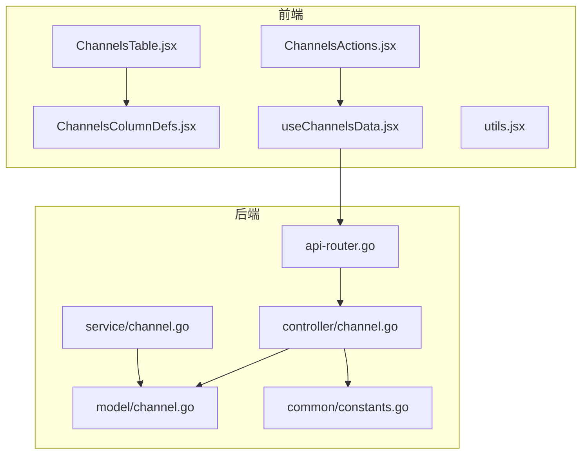
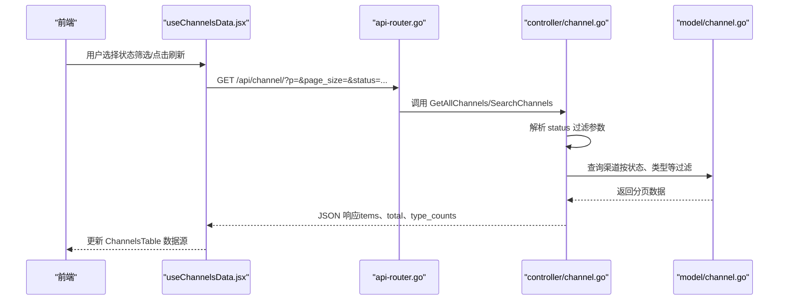
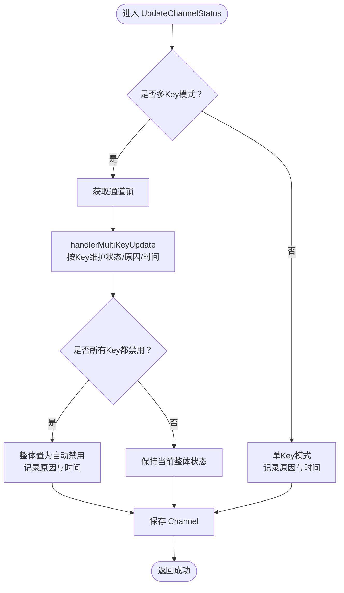
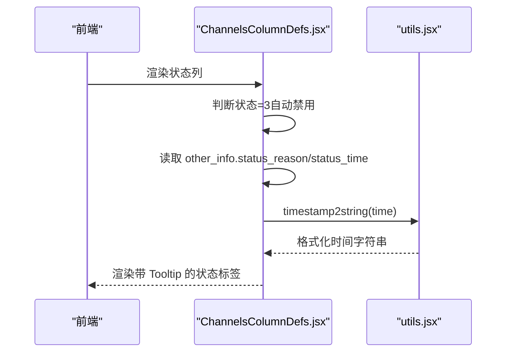
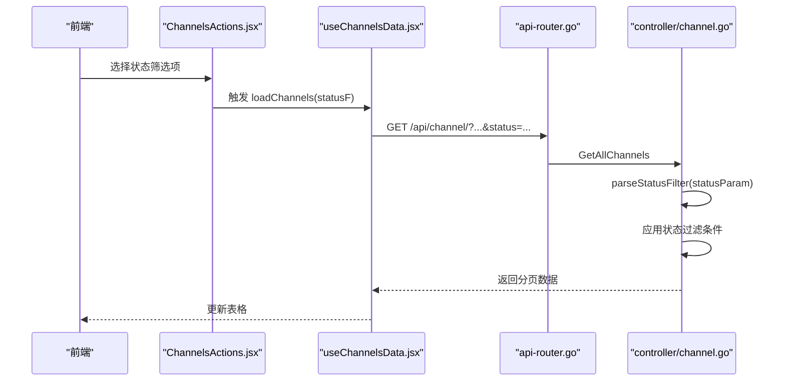
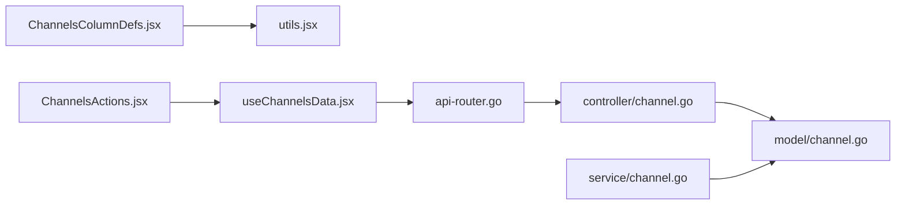

# 渠道状态监控

<cite>
**本文引用的文件**
- [controller/channel.go](file://controller/channel.go)
- [model/channel.go](file://model/channel.go)
- [service/channel.go](file://service/channel.go)
- [common/constants.go](file://common/constants.go)
- [router/api-router.go](file://router/api-router.go)
- [web/src/components/table/channels/ChannelsColumnDefs.jsx](file://web/src/components/table/channels/ChannelsColumnDefs.jsx)
- [web/src/components/table/channels/ChannelsActions.jsx](file://web/src/components/table/channels/ChannelsActions.jsx)
- [web/src/hooks/channels/useChannelsData.jsx](file://web/src/hooks/channels/useChannelsData.jsx)
- [web/src/helpers/utils.jsx](file://web/src/helpers/utils.jsx)
</cite>

## 目录
1. [简介](#简介)
2. [项目结构](#项目结构)
3. [核心组件](#核心组件)
4. [架构总览](#架构总览)
5. [详细组件分析](#详细组件分析)
6. [依赖关系分析](#依赖关系分析)
7. [性能考量](#性能考量)
8. [故障排查指南](#故障排查指南)
9. [结论](#结论)

## 简介
本文件系统性阐述渠道状态监控的设计与实现，覆盖以下要点：
- 渠道三种状态的定义与含义：启用、手动禁用、自动禁用
- 状态转换逻辑与触发条件
- UpdateStatus 方法的状态变更机制，包括状态变更原因与时间的记录
- 前端 ChannelsTable 组件如何展示状态信息，特别是自动禁用时的 Tooltip 显示原因与时间
- 状态过滤功能的 API 实现与使用方式

## 项目结构
围绕“渠道状态监控”的关键代码分布在后端控制器、模型层、服务层以及前端表格组件中：
- 后端路由：/api/channel 下的 GET/PUT/POST 接口负责渠道查询、状态变更与批量管理
- 控制器：解析查询参数、执行状态过滤、返回分页数据
- 模型层：Channel 结构体与 UpdateChannelStatus 方法，维护状态、原因与时间
- 服务层：根据错误类型与配置决定是否自动禁用渠道
- 前端：ChannelsTable/Columns 定义列渲染；ChannelsActions 提供状态筛选；useChannelsData 发起请求并携带 status 参数

图表来源
- [router/api-router.go](file://router/api-router.go#L131-L159)
- [controller/channel.go](file://controller/channel.go#L42-L130)
- [model/channel.go](file://model/channel.go#L608-L695)
- [service/channel.go](file://service/channel.go#L1-L112)
- [web/src/components/table/channels/ChannelsTable.jsx](file://web/src/components/table/channels/ChannelsTable.jsx#L1-L169)
- [web/src/components/table/channels/ChannelsColumnDefs.jsx](file://web/src/components/table/channels/ChannelsColumnDefs.jsx#L70-L120)
- [web/src/components/table/channels/ChannelsActions.jsx](file://web/src/components/table/channels/ChannelsActions.jsx#L251-L283)
- [web/src/hooks/channels/useChannelsData.jsx](file://web/src/hooks/channels/useChannelsData.jsx#L280-L409)
- [web/src/helpers/utils.jsx](file://web/src/helpers/utils.jsx#L190-L218)

章节来源
- [router/api-router.go](file://router/api-router.go#L131-L159)
- [controller/channel.go](file://controller/channel.go#L42-L130)

## 核心组件
- 渠道状态常量
  - 启用：1
  - 手动禁用：2
  - 自动禁用：3
- UpdateStatus 机制
  - 单 Key 模式：直接更新状态与记录原因、时间
  - 多 Key 模式：按 Key 索引维护状态列表、原因与时间；当所有 Key 都被禁用时，整体置为自动禁用
- 前端展示
  - ChannelsColumnDefs.jsx 渲染状态标签
  - ChannelsActions.jsx 提供状态筛选下拉框
  - useChannelsData.jsx 在请求中携带 status 参数
  - Tooltip 展示自动禁用的原因与时间

章节来源
- [common/constants.go](file://common/constants.go#L196-L201)
- [model/channel.go](file://model/channel.go#L608-L695)
- [web/src/components/table/channels/ChannelsColumnDefs.jsx](file://web/src/components/table/channels/ChannelsColumnDefs.jsx#L70-L120)
- [web/src/components/table/channels/ChannelsActions.jsx](file://web/src/components/table/channels/ChannelsActions.jsx#L251-L283)
- [web/src/hooks/channels/useChannelsData.jsx](file://web/src/hooks/channels/useChannelsData.jsx#L280-L409)

## 架构总览
后端通过路由暴露渠道查询与状态相关接口，控制器解析状态过滤参数并调用模型层进行数据库查询；模型层在 UpdateStatus 中写入状态、原因与时间；前端通过 ChannelsTable 与 Columns 渲染状态，并在自动禁用时通过 Tooltip 展示原因与时间。

图表来源
- [router/api-router.go](file://router/api-router.go#L131-L159)
- [controller/channel.go](file://controller/channel.go#L42-L130)
- [controller/channel.go](file://controller/channel.go#L303-L414)
- [web/src/hooks/channels/useChannelsData.jsx](file://web/src/hooks/channels/useChannelsData.jsx#L280-L409)

## 详细组件分析

### 渠道状态定义与转换逻辑
- 状态定义
  - 启用：1
  - 手动禁用：2
  - 自动禁用：3
- 转换逻辑
  - 手动禁用：通过控制器接口或标签批量禁用触发
  - 自动禁用：服务层根据错误类型与配置判断是否自动禁用，随后调用 UpdateStatus 写入原因与时间
  - 启用：可通过接口或标签批量启用恢复
- 多 Key 模式的特殊处理
  - 当所有 Key 都被禁用时，整体状态变为自动禁用
  - 按 Key 记录禁用原因与时间，便于前端展示

章节来源
- [common/constants.go](file://common/constants.go#L196-L201)
- [service/channel.go](file://service/channel.go#L1-L112)
- [model/channel.go](file://model/channel.go#L608-L695)

### UpdateStatus 方法与状态变更记录
- 单 Key 模式
  - 更新状态字段
  - 在 other_info 中记录 status_reason 与 status_time
- 多 Key 模式
  - 按 Key 索引维护 MultiKeyStatusList、MultiKeyDisabledReason、MultiKeyDisabledTime
  - 当 MultiKeyStatusList 的数量达到 MultiKeySize 时，整体置为自动禁用，并在 other_info 中记录原因与时间
- 线程安全
  - 使用 per-channel 锁保护并发更新

图表来源
- [model/channel.go](file://model/channel.go#L608-L695)

章节来源
- [model/channel.go](file://model/channel.go#L608-L695)

### 前端 ChannelsTable 状态展示与 Tooltip
- 状态渲染
  - ChannelsColumnDefs.jsx 根据状态值渲染不同颜色的标签
  - 多 Key 模式下同时显示可用 Key 数量
- Tooltip 显示自动禁用原因与时间
  - 当状态为自动禁用时，从 other_info 中读取 status_reason 与 status_time
  - 使用工具函数将时间戳格式化为可读字符串

图表来源
- [web/src/components/table/channels/ChannelsColumnDefs.jsx](file://web/src/components/table/channels/ChannelsColumnDefs.jsx#L294-L331)
- [web/src/helpers/utils.jsx](file://web/src/helpers/utils.jsx#L190-L218)

章节来源
- [web/src/components/table/channels/ChannelsColumnDefs.jsx](file://web/src/components/table/channels/ChannelsColumnDefs.jsx#L70-L120)
- [web/src/components/table/channels/ChannelsColumnDefs.jsx](file://web/src/components/table/channels/ChannelsColumnDefs.jsx#L294-L331)
- [web/src/helpers/utils.jsx](file://web/src/helpers/utils.jsx#L190-L218)

### 状态过滤功能的 API 实现
- 路由
  - GET /api/channel/：列出渠道，支持 status、type、id_sort、tag_mode、p、page_size 等参数
  - GET /api/channel/search：搜索渠道，支持 status、type、keyword、group、model、id_sort、tag_mode、p、page_size 等参数
- 控制器解析
  - parseStatusFilter 将字符串参数映射为数值状态过滤
  - 支持“全部”、“已启用”、“已禁用（包含手动与自动）”
- 前端交互
  - ChannelsActions.jsx 提供状态筛选下拉框
  - useChannelsData.jsx 在请求中拼接 status 参数

图表来源
- [router/api-router.go](file://router/api-router.go#L131-L159)
- [controller/channel.go](file://controller/channel.go#L42-L130)
- [controller/channel.go](file://controller/channel.go#L303-L414)
- [web/src/components/table/channels/ChannelsActions.jsx](file://web/src/components/table/channels/ChannelsActions.jsx#L251-L283)
- [web/src/hooks/channels/useChannelsData.jsx](file://web/src/hooks/channels/useChannelsData.jsx#L280-L409)

章节来源
- [router/api-router.go](file://router/api-router.go#L131-L159)
- [controller/channel.go](file://controller/channel.go#L42-L130)
- [controller/channel.go](file://controller/channel.go#L303-L414)
- [web/src/components/table/channels/ChannelsActions.jsx](file://web/src/components/table/channels/ChannelsActions.jsx#L251-L283)
- [web/src/hooks/channels/useChannelsData.jsx](file://web/src/hooks/channels/useChannelsData.jsx#L280-L409)

## 依赖关系分析
- 后端
  - 路由层：/api/channel 下的接口
  - 控制器层：解析参数、应用过滤、返回数据
  - 模型层：Channel 结构体、UpdateChannelStatus、多 Key 状态管理
  - 服务层：根据错误与配置自动禁用渠道
  - 常量层：状态枚举
- 前端
  - 表格列定义：状态渲染与 Tooltip
  - 状态筛选：下拉框与本地持久化
  - 数据钩子：发起请求并携带状态参数
  - 工具函数：时间戳格式化

图表来源
- [router/api-router.go](file://router/api-router.go#L131-L159)
- [controller/channel.go](file://controller/channel.go#L42-L130)
- [model/channel.go](file://model/channel.go#L608-L695)
- [service/channel.go](file://service/channel.go#L1-L112)
- [web/src/components/table/channels/ChannelsColumnDefs.jsx](file://web/src/components/table/channels/ChannelsColumnDefs.jsx#L294-L331)
- [web/src/helpers/utils.jsx](file://web/src/helpers/utils.jsx#L190-L218)
- [web/src/components/table/channels/ChannelsActions.jsx](file://web/src/components/table/channels/ChannelsActions.jsx#L251-L283)
- [web/src/hooks/channels/useChannelsData.jsx](file://web/src/hooks/channels/useChannelsData.jsx#L280-L409)

章节来源
- [router/api-router.go](file://router/api-router.go#L131-L159)
- [controller/channel.go](file://controller/channel.go#L42-L130)
- [model/channel.go](file://model/channel.go#L608-L695)
- [service/channel.go](file://service/channel.go#L1-L112)
- [web/src/components/table/channels/ChannelsColumnDefs.jsx](file://web/src/components/table/channels/ChannelsColumnDefs.jsx#L294-L331)
- [web/src/helpers/utils.jsx](file://web/src/helpers/utils.jsx#L190-L218)
- [web/src/components/table/channels/ChannelsActions.jsx](file://web/src/components/table/channels/ChannelsActions.jsx#L251-L283)
- [web/src/hooks/channels/useChannelsData.jsx](file://web/src/hooks/channels/useChannelsData.jsx#L280-L409)

## 性能考量
- 并发安全
  - 多 Key 模式下使用 per-channel 锁，避免竞态更新
- 查询优化
  - 控制器对状态与类型进行数据库层过滤，减少前端二次过滤
- 前端渲染
  - Tooltip 仅在自动禁用时触发，避免不必要的 DOM 开销
- 时间格式化
  - 工具函数一次性格式化，避免重复计算

[本节为通用指导，不涉及具体文件分析]

## 故障排查指南
- 自动禁用未生效
  - 检查服务层是否启用了自动禁用配置
  - 确认错误消息是否匹配自动禁用关键词
- 状态筛选无效
  - 确认前端请求是否正确携带 status 参数
  - 检查控制器 parseStatusFilter 的映射逻辑
- Tooltip 不显示原因与时间
  - 确认 other_info 中存在 status_reason 与 status_time
  - 检查时间戳格式化函数是否正常工作

章节来源
- [service/channel.go](file://service/channel.go#L1-L112)
- [controller/channel.go](file://controller/channel.go#L42-L130)
- [web/src/components/table/channels/ChannelsColumnDefs.jsx](file://web/src/components/table/channels/ChannelsColumnDefs.jsx#L294-L331)
- [web/src/helpers/utils.jsx](file://web/src/helpers/utils.jsx#L190-L218)

## 结论
本系统通过明确的状态定义、严谨的 UpdateStatus 机制、完善的前端展示与灵活的 API 状态过滤，实现了对渠道状态的全链路监控。多 Key 模式下的细粒度状态管理与整体状态联动，确保了在复杂场景下的稳定性与可观测性。建议在生产环境中结合日志与告警策略，持续优化自动禁用与启用的阈值与规则。