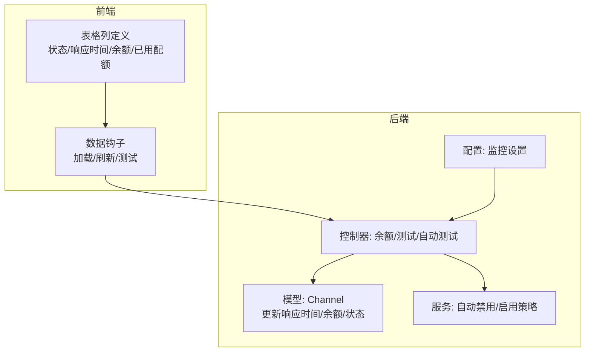
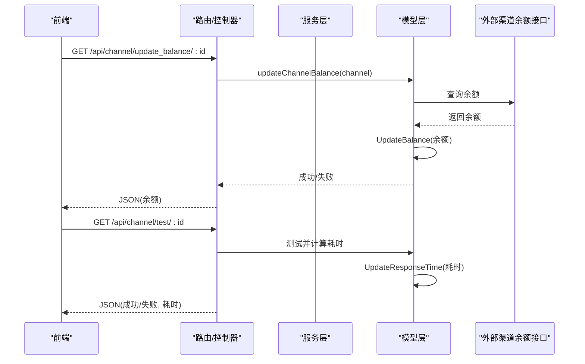
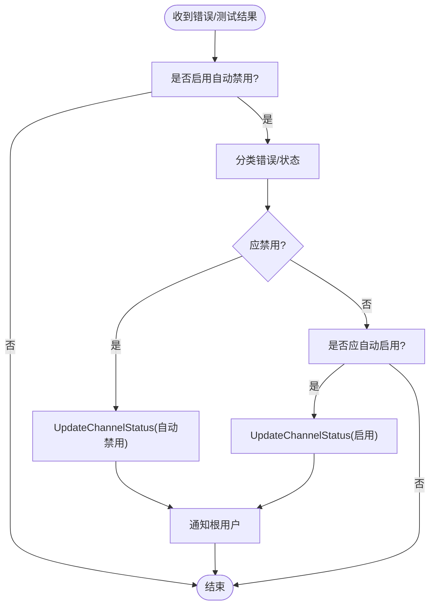
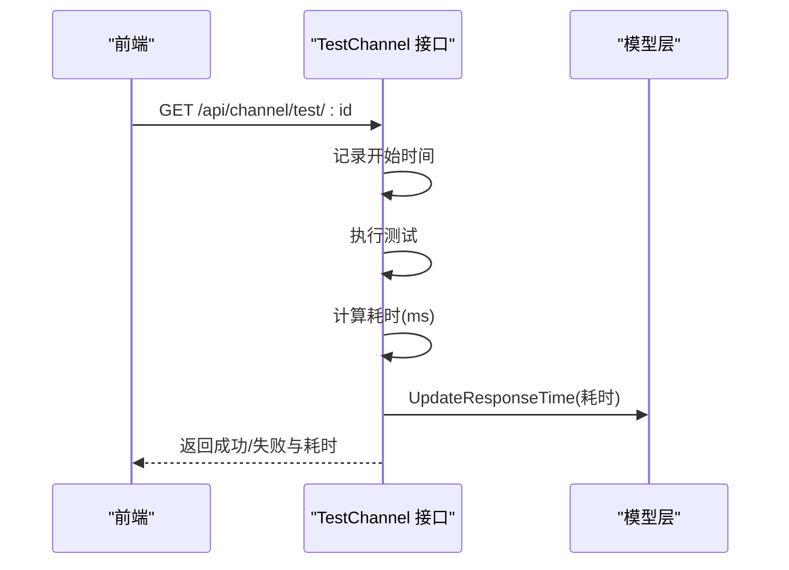
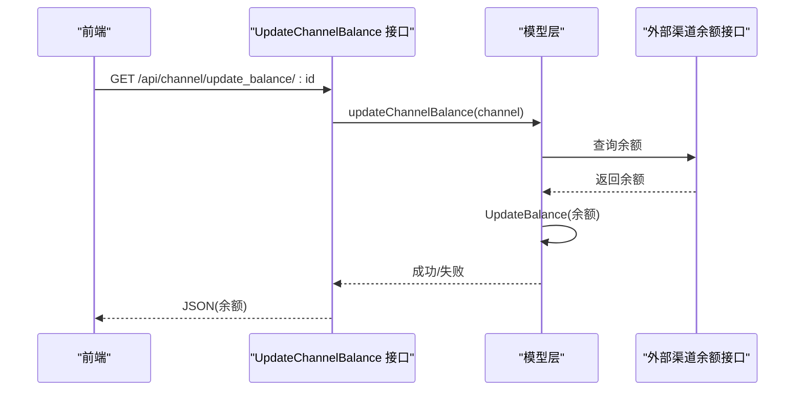
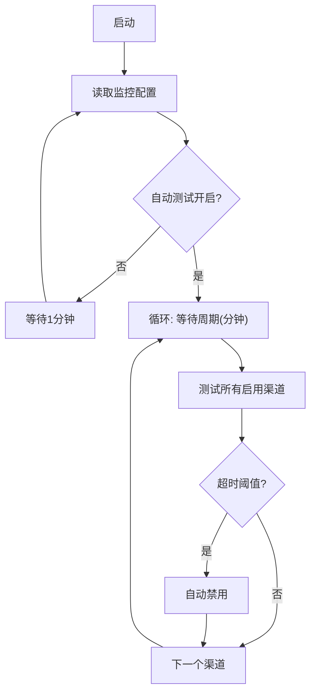
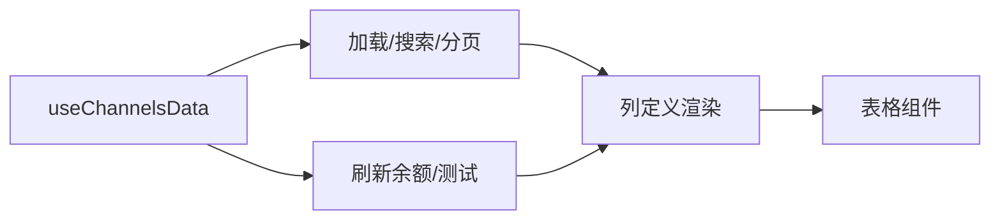
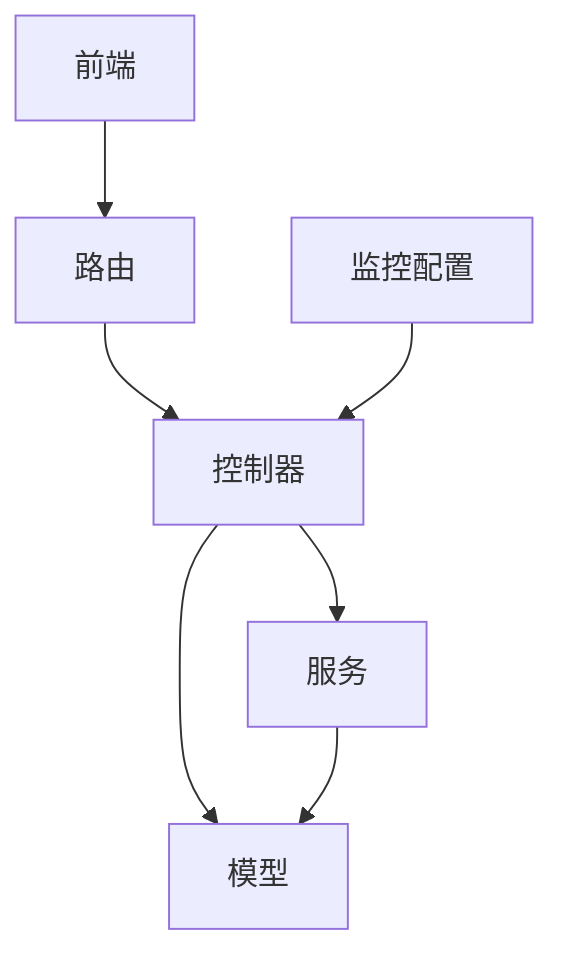

# 渠道监控

<cite>
**本文引用的文件**
- [model/channel.go](file://model/channel.go)
- [controller/channel-billing.go](file://controller/channel-billing.go)
- [service/channel.go](file://service/channel.go)
- [controller/channel-test.go](file://controller/channel-test.go)
- [router/api-router.go](file://router/api-router.go)
- [web/src/components/table/channels/ChannelsColumnDefs.jsx](file://web/src/components/table/channels/ChannelsColumnDefs.jsx)
- [web/src/components/table/channels/ChannelsTable.jsx](file://web/src/components/table/channels/ChannelsTable.jsx)
- [web/src/hooks/channels/useChannelsData.jsx](file://web/src/hooks/channels/useChannelsData.jsx)
- [common/constants.go](file://common/constants.go)
- [setting/operation_setting/monitor_setting.go](file://setting/operation_setting/monitor_setting.go)
- [web/src/pages/Setting/Operation/SettingsMonitoring.jsx](file://web/src/pages/Setting/Operation/SettingsMonitoring.jsx)
</cite>

## 目录
1. [简介](#简介)
2. [项目结构与定位](#项目结构与定位)
3. [核心组件](#核心组件)
4. [架构总览](#架构总览)
5. [详细组件分析](#详细组件分析)
6. [依赖关系分析](#依赖关系分析)
7. [性能与优化建议](#性能与优化建议)
8. [故障排查指南](#故障排查指南)
9. [结论](#结论)

## 简介
本文件面向“渠道监控”能力，系统性阐述渠道状态（启用、禁用、自动禁用）的监控机制与状态变更逻辑；详解响应时间、余额、已用配额等关键指标的采集与展示方式，覆盖定时更新与手动刷新流程；说明如何通过 UpdateResponseTime 和 UpdateBalance 方法更新渠道性能数据，并在前端表格中呈现；同时给出监控数据查询接口说明与性能优化建议。

## 项目结构与定位
- 后端模型层负责渠道状态与指标持久化（响应时间、余额、已用配额等），并提供状态变更与并发安全控制。
- 控制器层提供渠道余额刷新、全量余额刷新、渠道测试、自动测试等接口。
- 服务层封装自动禁用/启用策略与通知。
- 前端表格组件负责渲染状态、响应时间、余额与已用配额，并支持手动刷新余额。
- 运维配置提供自动测试开关与周期参数。

图表来源
- [model/channel.go](file://model/channel.go#L504-L548)
- [controller/channel-billing.go](file://controller/channel-billing.go#L424-L452)
- [controller/channel-test.go](file://controller/channel-test.go#L483-L531)
- [service/channel.go](file://service/channel.go#L21-L45)
- [setting/operation_setting/monitor_setting.go](file://setting/operation_setting/monitor_setting.go#L1-L36)
- [web/src/components/table/channels/ChannelsColumnDefs.jsx](file://web/src/components/table/channels/ChannelsColumnDefs.jsx#L285-L371)
- [web/src/hooks/channels/useChannelsData.jsx](file://web/src/hooks/channels/useChannelsData.jsx#L39-L368)

章节来源
- [model/channel.go](file://model/channel.go#L504-L548)
- [controller/channel-billing.go](file://controller/channel-billing.go#L424-L452)
- [controller/channel-test.go](file://controller/channel-test.go#L483-L531)
- [service/channel.go](file://service/channel.go#L21-L45)
- [setting/operation_setting/monitor_setting.go](file://setting/operation_setting/monitor_setting.go#L1-L36)
- [web/src/components/table/channels/ChannelsColumnDefs.jsx](file://web/src/components/table/channels/ChannelsColumnDefs.jsx#L285-L371)
- [web/src/hooks/channels/useChannelsData.jsx](file://web/src/hooks/channels/useChannelsData.jsx#L39-L368)

## 核心组件
- 渠道模型与指标
  - 响应时间：毫秒级，记录最近一次测试耗时。
  - 余额：美元单位，记录最近一次余额刷新时间。
  - 已用配额：累计消耗配额，支持批量累加更新。
  - 状态：启用、手动禁用、自动禁用。
- 控制器接口
  - 单渠道余额刷新、全量余额刷新、单渠道测试、全量测试。
- 服务策略
  - 自动禁用/启用：基于错误类型、响应时间阈值、关键词匹配等。
- 前端表格
  - 展示状态、响应时间、已用/剩余配额；支持点击刷新余额。

章节来源
- [model/channel.go](file://model/channel.go#L21-L58)
- [controller/channel-billing.go](file://controller/channel-billing.go#L424-L452)
- [controller/channel-test.go](file://controller/channel-test.go#L483-L531)
- [service/channel.go](file://service/channel.go#L21-L45)
- [web/src/components/table/channels/ChannelsColumnDefs.jsx](file://web/src/components/table/channels/ChannelsColumnDefs.jsx#L285-L371)

## 架构总览
后端通过控制器暴露接口，调用模型层更新指标与状态；服务层根据策略自动禁用/启用渠道；前端通过表格列渲染与交互触发刷新与测试。

图表来源
- [router/api-router.go](file://router/api-router.go#L131-L159)
- [controller/channel-billing.go](file://controller/channel-billing.go#L424-L452)
- [controller/channel-test.go](file://controller/channel-test.go#L483-L531)
- [model/channel.go](file://model/channel.go#L504-L522)

## 详细组件分析

### 渠道状态与变更逻辑
- 状态枚举
  - 启用、手动禁用、自动禁用。
- 状态变更入口
  - 服务层根据错误与阈值自动禁用，或根据条件自动启用。
  - 模型层提供统一的状态更新入口，支持多键模式下的键级状态维护与能力状态联动。
- 并发安全
  - 多键模式下使用 per-channel 锁保护状态映射写入，避免读写竞争。
- 自动禁用/启用判定
  - 基于错误码/类型、HTTP 状态、关键词匹配、响应时间阈值等综合判断。

图表来源
- [service/channel.go](file://service/channel.go#L21-L45)
- [service/channel.go](file://service/channel.go#L47-L112)
- [model/channel.go](file://model/channel.go#L608-L677)

章节来源
- [common/constants.go](file://common/constants.go#L196-L201)
- [service/channel.go](file://service/channel.go#L21-L45)
- [service/channel.go](file://service/channel.go#L47-L112)
- [model/channel.go](file://model/channel.go#L608-L677)

### 响应时间监控与更新
- 计算方式
  - 发起测试请求，记录开始/结束时间，计算毫秒级耗时。
- 更新方式
  - 测试完成后异步调用模型层 UpdateResponseTime 更新响应时间与测试时间戳。
- 前端展示
  - 表格列“响应时间”直接显示毫秒级数值，便于对比与排序。

图表来源
- [controller/channel-test.go](file://controller/channel-test.go#L483-L531)
- [model/channel.go](file://model/channel.go#L504-L512)
- [web/src/components/table/channels/ChannelsColumnDefs.jsx](file://web/src/components/table/channels/ChannelsColumnDefs.jsx#L322-L327)

章节来源
- [controller/channel-test.go](file://controller/channel-test.go#L483-L531)
- [model/channel.go](file://model/channel.go#L504-L512)
- [web/src/components/table/channels/ChannelsColumnDefs.jsx](file://web/src/components/table/channels/ChannelsColumnDefs.jsx#L322-L327)

### 余额与已用配额监控
- 余额刷新
  - 单渠道刷新：调用对应渠道余额接口，解析后通过模型层 UpdateBalance 写入。
  - 全量刷新：遍历启用且非多密钥渠道，逐个刷新并检查余额<=0自动禁用。
- 已用配额
  - 支持批量累加更新，减少数据库往返。
- 前端展示
  - “已用/剩余”列展示已用配额与剩余额度；点击余额标签可触发单渠道刷新。

图表来源
- [controller/channel-billing.go](file://controller/channel-billing.go#L424-L452)
- [controller/channel-billing.go](file://controller/channel-billing.go#L454-L482)
- [model/channel.go](file://model/channel.go#L514-L522)
- [web/src/components/table/channels/ChannelsColumnDefs.jsx](file://web/src/components/table/channels/ChannelsColumnDefs.jsx#L329-L366)

章节来源
- [controller/channel-billing.go](file://controller/channel-billing.go#L424-L452)
- [controller/channel-billing.go](file://controller/channel-billing.go#L454-L482)
- [model/channel.go](file://model/channel.go#L514-L522)
- [web/src/components/table/channels/ChannelsColumnDefs.jsx](file://web/src/components/table/channels/ChannelsColumnDefs.jsx#L329-L366)

### 自动化监控与定时任务
- 自动测试
  - 周期性执行全量渠道测试，超过响应时间阈值则自动禁用。
  - 受运维配置控制：开关与分钟数。
- 自动余额刷新
  - 定时遍历启用渠道刷新余额，余额<=0自动禁用。

图表来源
- [controller/channel-test.go](file://controller/channel-test.go#L617-L643)
- [setting/operation_setting/monitor_setting.go](file://setting/operation_setting/monitor_setting.go#L1-L36)
- [web/src/pages/Setting/Operation/SettingsMonitoring.jsx](file://web/src/pages/Setting/Operation/SettingsMonitoring.jsx#L128-L165)

章节来源
- [controller/channel-test.go](file://controller/channel-test.go#L617-L643)
- [setting/operation_setting/monitor_setting.go](file://setting/operation_setting/monitor_setting.go#L1-L36)
- [web/src/pages/Setting/Operation/SettingsMonitoring.jsx](file://web/src/pages/Setting/Operation/SettingsMonitoring.jsx#L128-L165)

### 前端表格展示与交互
- 列定义
  - 状态：显示启用/禁用/自动禁用；自动禁用时展示禁用原因与时间。
  - 响应时间：毫秒级。
  - 已用/剩余：已用配额与剩余额度；点击余额标签触发刷新。
- 数据加载与刷新
  - 钩子负责分页、筛选、排序与加载；支持手动刷新余额与测试。
- 表格容器
  - 统一卡片表格组件，支持紧凑模式、分页与空态。

图表来源
- [web/src/hooks/channels/useChannelsData.jsx](file://web/src/hooks/channels/useChannelsData.jsx#L39-L368)
- [web/src/components/table/channels/ChannelsColumnDefs.jsx](file://web/src/components/table/channels/ChannelsColumnDefs.jsx#L285-L371)
- [web/src/components/table/channels/ChannelsTable.jsx](file://web/src/components/table/channels/ChannelsTable.jsx#L1-L168)

章节来源
- [web/src/hooks/channels/useChannelsData.jsx](file://web/src/hooks/channels/useChannelsData.jsx#L39-L368)
- [web/src/components/table/channels/ChannelsColumnDefs.jsx](file://web/src/components/table/channels/ChannelsColumnDefs.jsx#L285-L371)
- [web/src/components/table/channels/ChannelsTable.jsx](file://web/src/components/table/channels/ChannelsTable.jsx#L1-L168)

## 依赖关系分析
- 控制器依赖模型层进行指标更新与状态变更。
- 服务层依赖模型层状态更新与通知机制。
- 前端依赖路由接口与列定义组件。
- 运维配置影响自动测试周期与阈值。

图表来源
- [router/api-router.go](file://router/api-router.go#L131-L159)
- [controller/channel-billing.go](file://controller/channel-billing.go#L424-L452)
- [controller/channel-test.go](file://controller/channel-test.go#L483-L531)
- [service/channel.go](file://service/channel.go#L21-L45)
- [setting/operation_setting/monitor_setting.go](file://setting/operation_setting/monitor_setting.go#L1-L36)

章节来源
- [router/api-router.go](file://router/api-router.go#L131-L159)
- [controller/channel-billing.go](file://controller/channel-billing.go#L424-L452)
- [controller/channel-test.go](file://controller/channel-test.go#L483-L531)
- [service/channel.go](file://service/channel.go#L21-L45)
- [setting/operation_setting/monitor_setting.go](file://setting/operation_setting/monitor_setting.go#L1-L36)

## 性能与优化建议
- 并发与锁
  - 多键模式使用 per-channel 锁，避免状态映射并发写入；建议保持锁粒度最小化，仅在必要路径持有。
- 请求间隔
  - 全量余额/测试时使用统一请求间隔，避免对外部接口造成压力；可结合环境变量或配置动态调整。
- 批量更新
  - 已用配额支持批量累加，减少数据库往返；建议在高并发场景下启用批量更新。
- 缓存与内存
  - 若启用内存缓存，状态更新需同步至缓存并注意一致性；必要时清理无效锁。
- 前端渲染
  - 对大表格采用虚拟滚动与分页；对频繁刷新的列（余额/响应时间）采用节流或延迟更新策略。

[本节为通用建议，无需列出具体文件来源]

## 故障排查指南
- 余额刷新失败
  - 检查渠道类型与余额接口是否支持；确认鉴权头与代理设置正确；查看控制器返回的错误信息。
- 响应时间异常
  - 确认测试接口可用与网络延迟；检查阈值配置是否合理；查看自动禁用日志。
- 状态未更新
  - 检查服务层自动禁用/启用策略是否生效；确认模型层 UpdateChannelStatus 是否成功写入。
- 前端不显示最新数据
  - 确认列渲染函数是否正确读取字段；检查钩子的数据格式转换与刷新触发逻辑。

章节来源
- [controller/channel-billing.go](file://controller/channel-billing.go#L424-L452)
- [controller/channel-test.go](file://controller/channel-test.go#L483-L531)
- [service/channel.go](file://service/channel.go#L21-L45)
- [web/src/hooks/channels/useChannelsData.jsx](file://web/src/hooks/channels/useChannelsData.jsx#L760-L798)

## 结论
本方案通过模型层指标更新、控制器接口与服务层策略，构建了完整的渠道监控闭环：状态变更（启用/禁用/自动禁用）、响应时间与余额的采集与展示、以及定时与手动刷新机制。前端表格直观呈现关键指标，运维可通过配置灵活控制自动化行为。建议在高并发场景下进一步优化锁与批量更新策略，并完善前端节流与缓存策略以提升用户体验。