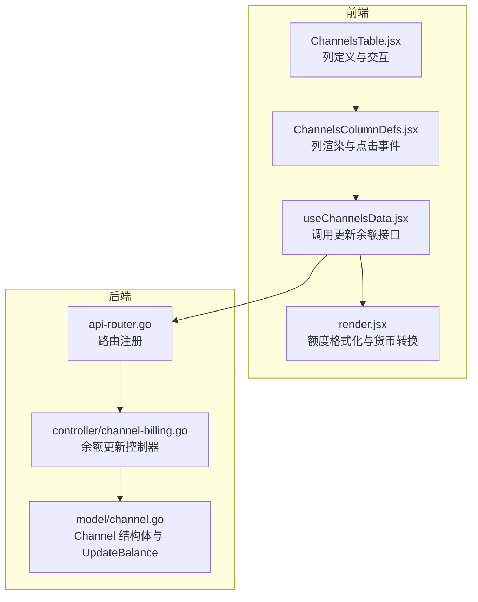
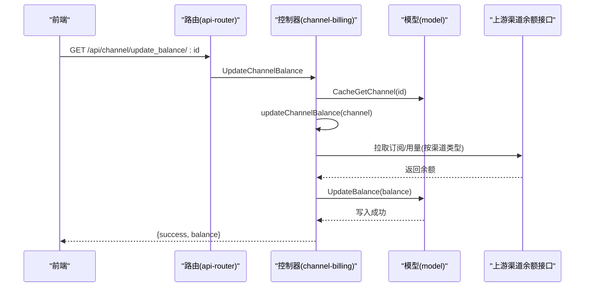
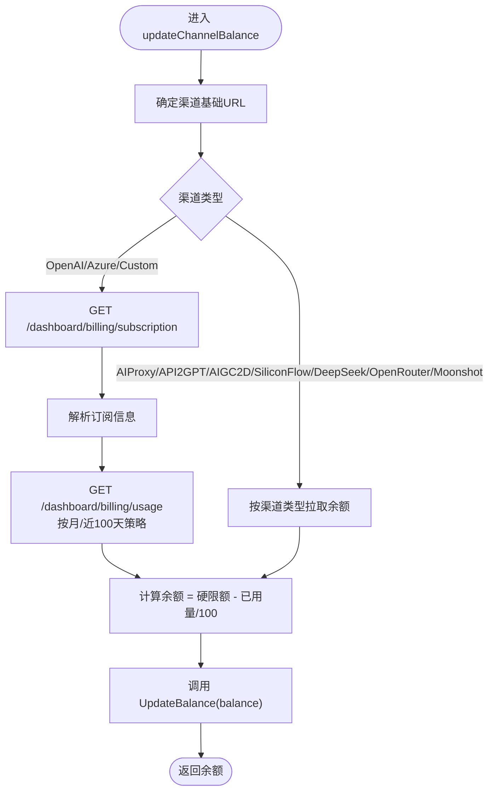
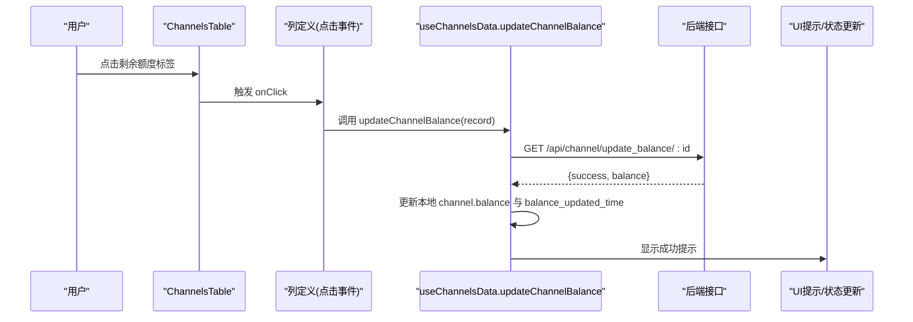
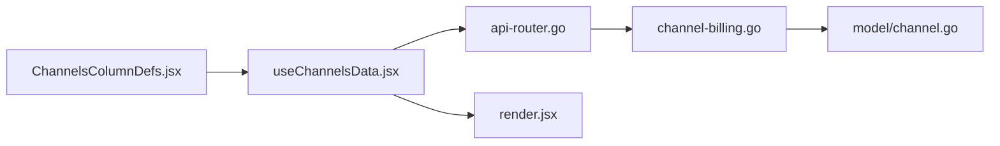

# 渠道财务监控

<cite>
**本文引用的文件**
- [model/channel.go](file://model/channel.go)
- [controller/channel-billing.go](file://controller/channel-billing.go)
- [router/api-router.go](file://router/api-router.go)
- [web/src/components/table/channels/ChannelsColumnDefs.jsx](file://web/src/components/table/channels/ChannelsColumnDefs.jsx)
- [web/src/hooks/channels/useChannelsData.jsx](file://web/src/hooks/channels/useChannelsData.jsx)
- [web/src/helpers/render.jsx](file://web/src/helpers/render.jsx)
</cite>

## 目录
1. [简介](#简介)
2. [项目结构](#项目结构)
3. [核心组件](#核心组件)
4. [架构总览](#架构总览)
5. [详细组件分析](#详细组件分析)
6. [依赖关系分析](#依赖关系分析)
7. [性能考量](#性能考量)
8. [故障排查指南](#故障排查指南)
9. [结论](#结论)

## 简介
本文件聚焦于“渠道财务监控”的实现与使用说明，围绕以下目标展开：
- 余额监控的后端实现：UpdateBalance 方法如何更新渠道余额与余额更新时间
- 前端 ChannelsTable 中余额展示与交互：用户点击剩余额度标签即触发余额更新
- 已用额度的计算与展示逻辑
- 财务数据在管理界面中的呈现方式
- 更新余额 API 接口的使用说明与安全考虑

## 项目结构
该功能涉及后端模型层、控制器层、路由层与前端表格组件、数据钩子及渲染工具的协同：
- 后端
  - 模型层：定义渠道结构体与余额字段，并提供更新余额的方法
  - 控制器层：封装各渠道类型的余额拉取与统一更新流程
  - 路由层：暴露更新余额的 REST 接口
- 前端
  - 表格列定义：在“已用/剩余”列中展示已用额度与剩余额度，并绑定点击事件
  - 数据钩子：封装调用更新余额接口、刷新本地状态的逻辑
  - 渲染工具：根据站点配置将额度转换为 USD/CNY/TOKENS 或自定义货币格式

图表来源
- [router/api-router.go](file://router/api-router.go#L131-L159)
- [controller/channel-billing.go](file://controller/channel-billing.go#L424-L452)
- [model/channel.go](file://model/channel.go#L514-L522)
- [web/src/components/table/channels/ChannelsColumnDefs.jsx](file://web/src/components/table/channels/ChannelsColumnDefs.jsx#L328-L367)
- [web/src/hooks/channels/useChannelsData.jsx](file://web/src/hooks/channels/useChannelsData.jsx#L715-L739)
- [web/src/helpers/render.jsx](file://web/src/helpers/render.jsx#L933-L1039)

章节来源
- [router/api-router.go](file://router/api-router.go#L131-L159)
- [controller/channel-billing.go](file://controller/channel-billing.go#L424-L452)
- [model/channel.go](file://model/channel.go#L514-L522)
- [web/src/components/table/channels/ChannelsColumnDefs.jsx](file://web/src/components/table/channels/ChannelsColumnDefs.jsx#L328-L367)
- [web/src/hooks/channels/useChannelsData.jsx](file://web/src/hooks/channels/useChannelsData.jsx#L715-L739)
- [web/src/helpers/render.jsx](file://web/src/helpers/render.jsx#L933-L1039)

## 核心组件
- Channel 模型与余额字段
  - 字段：balance、balance_updated_time、used_quota
  - 方法：UpdateBalance 仅更新余额与余额更新时间
- 余额更新控制器
  - UpdateChannelBalance：单个渠道余额更新
  - UpdateAllChannelsBalance：批量更新已启用渠道余额
  - updateChannelBalance：根据渠道类型拉取余额并调用 UpdateBalance
- 前端表格列
  - “已用/剩余”列：展示已用额度与剩余额度；剩余额度标签可点击触发更新
- 前端数据钩子
  - updateChannelBalance：调用后端接口，更新本地状态并提示
  - updateAllChannelsBalance：批量触发更新
- 前端渲染工具
  - renderQuota、renderQuotaWithAmount：根据站点配置输出 USD/CNY/TOKENS 或自定义货币

章节来源
- [model/channel.go](file://model/channel.go#L21-L58)
- [model/channel.go](file://model/channel.go#L514-L522)
- [controller/channel-billing.go](file://controller/channel-billing.go#L424-L452)
- [controller/channel-billing.go](file://controller/channel-billing.go#L454-L496)
- [controller/channel-billing.go](file://controller/channel-billing.go#L359-L422)
- [web/src/components/table/channels/ChannelsColumnDefs.jsx](file://web/src/components/table/channels/ChannelsColumnDefs.jsx#L328-L367)
- [web/src/hooks/channels/useChannelsData.jsx](file://web/src/hooks/channels/useChannelsData.jsx#L715-L739)
- [web/src/helpers/render.jsx](file://web/src/helpers/render.jsx#L933-L1039)

## 架构总览
后端通过路由将前端请求转发至控制器，控制器根据渠道类型调用上游服务获取余额，再写入数据库并更新余额更新时间；前端通过表格列与数据钩子实现余额的展示与一键刷新。

图表来源
- [router/api-router.go](file://router/api-router.go#L141-L144)
- [controller/channel-billing.go](file://controller/channel-billing.go#L424-L452)
- [controller/channel-billing.go](file://controller/channel-billing.go#L359-L422)
- [model/channel.go](file://model/channel.go#L514-L522)

章节来源
- [router/api-router.go](file://router/api-router.go#L141-L144)
- [controller/channel-billing.go](file://controller/channel-billing.go#L424-L452)
- [controller/channel-billing.go](file://controller/channel-billing.go#L359-L422)
- [model/channel.go](file://model/channel.go#L514-L522)

## 详细组件分析

### 后端：余额更新实现（UpdateBalance 与控制器）
- UpdateBalance
  - 作用：原子性更新渠道的余额与余额更新时间
  - 实现要点：仅更新指定字段，避免覆盖其他字段
- 控制器
  - UpdateChannelBalance：鉴权后获取渠道，校验非多密钥渠道，调用 updateChannelBalance 并写回余额
  - UpdateAllChannelsBalance：遍历已启用渠道，跳过多密钥渠道，逐个更新并按余额阈值禁用
  - updateChannelBalance：根据渠道类型构造上游 URL，拉取订阅与用量，计算余额并调用 UpdateBalance

图表来源
- [controller/channel-billing.go](file://controller/channel-billing.go#L359-L422)
- [controller/channel-billing.go](file://controller/channel-billing.go#L169-L205)
- [controller/channel-billing.go](file://controller/channel-billing.go#L207-L241)
- [controller/channel-billing.go](file://controller/channel-billing.go#L243-L292)
- [controller/channel-billing.go](file://controller/channel-billing.go#L294-L358)
- [controller/channel-billing.go](file://controller/channel-billing.go#L309-L323)
- [controller/channel-billing.go](file://controller/channel-billing.go#L325-L357)
- [model/channel.go](file://model/channel.go#L514-L522)

章节来源
- [model/channel.go](file://model/channel.go#L514-L522)
- [controller/channel-billing.go](file://controller/channel-billing.go#L359-L422)
- [controller/channel-billing.go](file://controller/channel-billing.go#L424-L452)
- [controller/channel-billing.go](file://controller/channel-billing.go#L454-L496)

### 前端：ChannelsTable 余额展示与交互
- 列定义
  - “已用/剩余”列：左侧为已用额度，右侧为剩余额度标签
  - 剩余额度标签支持点击，触发 updateChannelBalance(record)
- 数据钩子
  - updateChannelBalance：调用后端接口，成功后更新本地 balance 与 balance_updated_time，并提示成功
  - updateAllChannelsBalance：批量触发更新，提示完成
- 渲染
  - renderQuota：根据站点配置将额度转换为 USD/CNY/TOKENS 或自定义货币
  - renderQuotaWithAmount：直接输出金额（带货币符号）

图表来源
- [web/src/components/table/channels/ChannelsColumnDefs.jsx](file://web/src/components/table/channels/ChannelsColumnDefs.jsx#L328-L367)
- [web/src/hooks/channels/useChannelsData.jsx](file://web/src/hooks/channels/useChannelsData.jsx#L725-L739)
- [router/api-router.go](file://router/api-router.go#L141-L144)

章节来源
- [web/src/components/table/channels/ChannelsColumnDefs.jsx](file://web/src/components/table/channels/ChannelsColumnDefs.jsx#L328-L367)
- [web/src/hooks/channels/useChannelsData.jsx](file://web/src/hooks/channels/useChannelsData.jsx#L715-L739)
- [web/src/helpers/render.jsx](file://web/src/helpers/render.jsx#L933-L1039)

### 已用额度的计算与展示
- 已用额度字段：used_quota（整型，单位通常为分或最小货币单位）
- 展示逻辑：
  - “已用/剩余”列左侧标签展示已用额度，使用 renderQuota 进行格式化
  - 右侧剩余额度标签展示剩余额度，点击可刷新
- 计算关系：
  - 已用额度来自数据库字段 used_quota
  - 剩余额度来自 balance 字段（由后端拉取并写入）
  - 若余额为 0 或负数，控制器可能触发禁用逻辑（依据业务策略）

章节来源
- [model/channel.go](file://model/channel.go#L21-L58)
- [web/src/components/table/channels/ChannelsColumnDefs.jsx](file://web/src/components/table/channels/ChannelsColumnDefs.jsx#L328-L367)
- [web/src/helpers/render.jsx](file://web/src/helpers/render.jsx#L933-L1039)
- [controller/channel-billing.go](file://controller/channel-billing.go#L454-L496)

### 财务数据在管理界面中的呈现
- 管理界面表格包含“已用/剩余”列，支持：
  - 单个渠道余额刷新
  - 批量刷新所有已启用渠道余额
  - 多密钥渠道的特殊处理（多密钥渠道不支持余额查询）
- 前端状态更新：
  - 成功后更新本地 balance 与 balance_updated_time
  - 提示成功或错误信息

章节来源
- [web/src/components/table/channels/ChannelsActions.jsx](file://web/src/components/table/channels/ChannelsActions.jsx#L122-L157)
- [web/src/hooks/channels/useChannelsData.jsx](file://web/src/hooks/channels/useChannelsData.jsx#L715-L739)
- [controller/channel-billing.go](file://controller/channel-billing.go#L424-L452)

### 更新余额 API 接口使用说明与安全考虑
- 接口
  - GET /api/channel/update_balance：批量更新所有已启用渠道余额
  - GET /api/channel/update_balance/:id：更新指定渠道余额
- 安全与鉴权
  - 路由层使用管理员鉴权中间件，确保仅管理员可调用
  - 多密钥渠道不支持余额查询，接口会返回明确提示
- 错误处理
  - 上游渠道接口异常、解析失败、HTTP 非 200 等均会被捕获并返回错误
  - 成功时返回 {success: true, balance}

章节来源
- [router/api-router.go](file://router/api-router.go#L131-L159)
- [controller/channel-billing.go](file://controller/channel-billing.go#L424-L452)
- [controller/channel-billing.go](file://controller/channel-billing.go#L454-L496)

## 依赖关系分析
- 后端
  - 路由层依赖控制器层
  - 控制器层依赖模型层进行余额写入
  - 控制器层依赖上游渠道余额接口
- 前端
  - 表格列定义依赖数据钩子
  - 数据钩子依赖路由层接口
  - 渲染工具依赖站点配置与用户状态

图表来源
- [router/api-router.go](file://router/api-router.go#L131-L159)
- [controller/channel-billing.go](file://controller/channel-billing.go#L424-L452)
- [model/channel.go](file://model/channel.go#L514-L522)
- [web/src/components/table/channels/ChannelsColumnDefs.jsx](file://web/src/components/table/channels/ChannelsColumnDefs.jsx#L328-L367)
- [web/src/hooks/channels/useChannelsData.jsx](file://web/src/hooks/channels/useChannelsData.jsx#L715-L739)
- [web/src/helpers/render.jsx](file://web/src/helpers/render.jsx#L933-L1039)

章节来源
- [router/api-router.go](file://router/api-router.go#L131-L159)
- [controller/channel-billing.go](file://controller/channel-billing.go#L424-L452)
- [model/channel.go](file://model/channel.go#L514-L522)
- [web/src/components/table/channels/ChannelsColumnDefs.jsx](file://web/src/components/table/channels/ChannelsColumnDefs.jsx#L328-L367)
- [web/src/hooks/channels/useChannelsData.jsx](file://web/src/hooks/channels/useChannelsData.jsx#L715-L739)
- [web/src/helpers/render.jsx](file://web/src/helpers/render.jsx#L933-L1039)

## 性能考量
- 批量更新频率控制
  - 控制器中对每个渠道更新后有固定间隔，避免对上游服务造成压力
- 并发与线程安全
  - 多密钥渠道状态更新使用 per-channel 锁，保证并发安全
- 前端渲染优化
  - 使用本地存储的货币配置与配额单位，减少重复计算
  - 表格列可见性与排序状态持久化，降低重复渲染成本

章节来源
- [controller/channel-billing.go](file://controller/channel-billing.go#L484-L506)
- [model/channel.go](file://model/channel.go#L534-L548)
- [web/src/helpers/render.jsx](file://web/src/helpers/render.jsx#L933-L1039)

## 故障排查指南
- 常见问题
  - 多密钥渠道无法查询余额：接口会返回提示，需改用其他方式或调整渠道类型
  - 上游渠道接口异常：检查网络、鉴权头、代理设置
  - 余额为 0 自动禁用：控制器在余额小于等于 0 时会触发禁用逻辑
- 前端提示
  - 成功/失败消息通过提示组件反馈
  - 余额更新后，表格中剩余额度与余额更新时间应同步刷新

章节来源
- [controller/channel-billing.go](file://controller/channel-billing.go#L424-L452)
- [controller/channel-billing.go](file://controller/channel-billing.go#L454-L496)
- [web/src/hooks/channels/useChannelsData.jsx](file://web/src/hooks/channels/useChannelsData.jsx#L715-L739)

## 结论
本方案通过“后端统一拉取 + 前端一键刷新”的方式实现了渠道财务监控闭环：后端以 UpdateBalance 为核心，按渠道类型拉取余额并写入数据库；前端以“已用/剩余”列直观展示，并通过点击事件触发刷新。配合站点货币配置与额度单位，用户可在不同币种与单位间灵活切换，满足多场景财务展示需求。