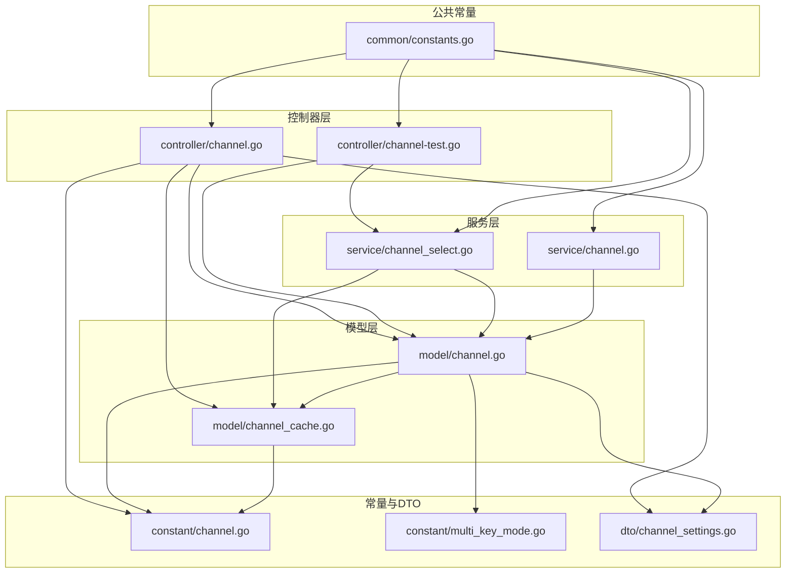
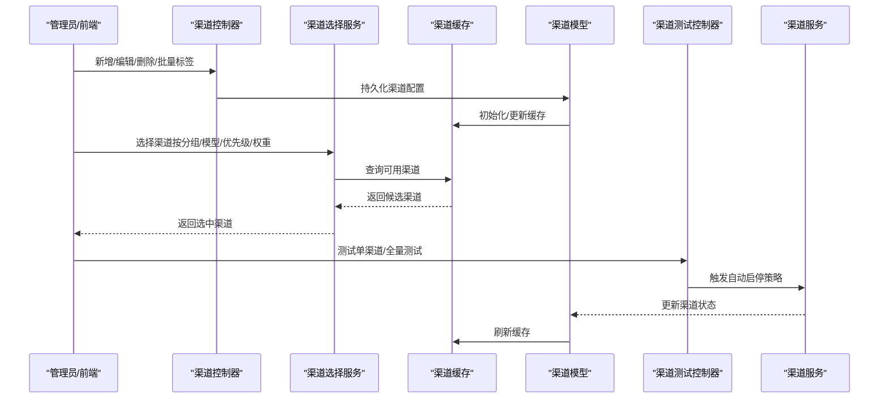
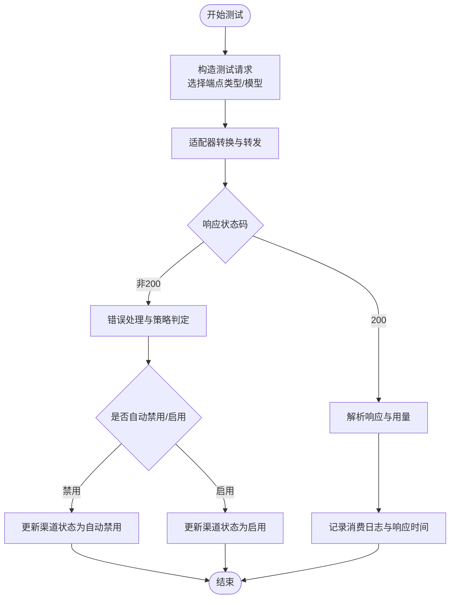
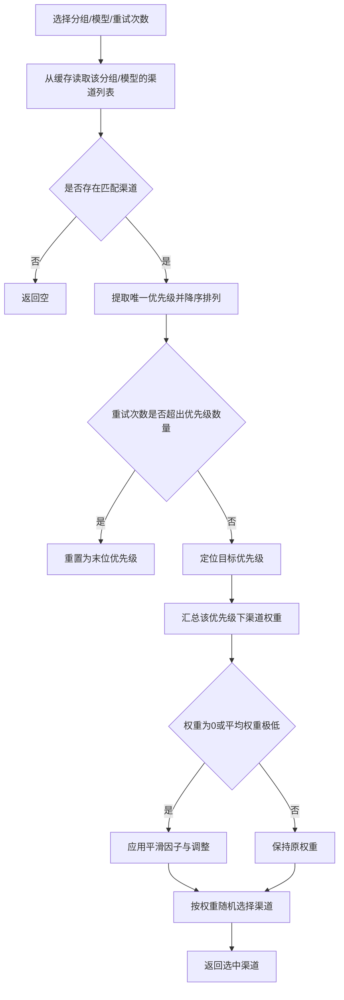
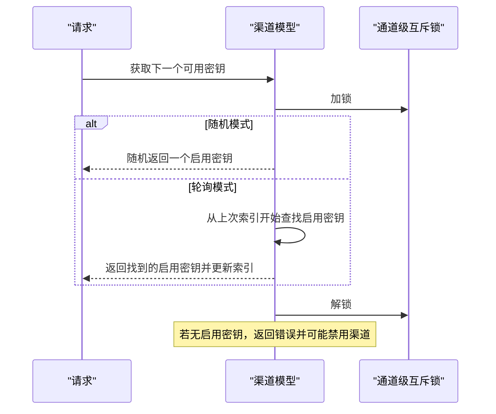
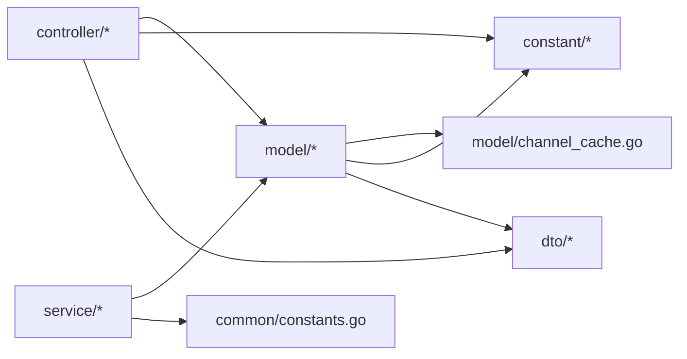

# 渠道管理

<cite>
**本文引用的文件**
- [controller/channel.go](file://controller/channel.go)
- [controller/channel-test.go](file://controller/channel-test.go)
- [service/channel_select.go](file://service/channel_select.go)
- [service/channel.go](file://service/channel.go)
- [model/channel.go](file://model/channel.go)
- [model/channel_cache.go](file://model/channel_cache.go)
- [constant/channel.go](file://constant/channel.go)
- [constant/multi_key_mode.go](file://constant/multi_key_mode.go)
- [common/constants.go](file://common/constants.go)
- [dto/channel_settings.go](file://dto/channel_settings.go)
</cite>

## 目录
1. [简介](#简介)
2. [项目结构](#项目结构)
3. [核心组件](#核心组件)
4. [架构总览](#架构总览)
5. [详细组件分析](#详细组件分析)
6. [依赖关系分析](#依赖关系分析)
7. [性能考量](#性能考量)
8. [故障排查指南](#故障排查指南)
9. [结论](#结论)
10. [附录](#附录)

## 简介
本文件系统性阐述“渠道管理”功能，涵盖渠道配置、状态监控、负载均衡与智能路由、多密钥与标签体系、以及渠道测试与隔离验证机制。文档以代码为依据，结合图示与流程，帮助开发者与运维人员快速理解并高效使用渠道管理能力。

## 项目结构
渠道管理涉及后端控制器、服务层、模型层、常量与DTO定义，以及前端表格与交互组件。后端通过控制器暴露REST接口，服务层负责智能路由与自动启停策略，模型层负责渠道数据持久化与内存缓存，常量与DTO提供渠道类型、多键模式、额外设置等规范。

图表来源
- [controller/channel.go](file://controller/channel.go#L1-L1643)
- [controller/channel-test.go](file://controller/channel-test.go#L1-L644)
- [service/channel_select.go](file://service/channel_select.go#L1-L163)
- [service/channel.go](file://service/channel.go#L1-L113)
- [model/channel.go](file://model/channel.go#L1-L1006)
- [model/channel_cache.go](file://model/channel_cache.go#L1-L266)
- [constant/channel.go](file://constant/channel.go#L1-L207)
- [constant/multi_key_mode.go](file://constant/multi_key_mode.go#L1-L9)
- [dto/channel_settings.go](file://dto/channel_settings.go#L1-L42)
- [common/constants.go](file://common/constants.go#L1-L208)

章节来源
- [controller/channel.go](file://controller/channel.go#L1-L1643)
- [controller/channel-test.go](file://controller/channel-test.go#L1-L644)
- [service/channel_select.go](file://service/channel_select.go#L1-L163)
- [service/channel.go](file://service/channel.go#L1-L113)
- [model/channel.go](file://model/channel.go#L1-L1006)
- [model/channel_cache.go](file://model/channel_cache.go#L1-L266)
- [constant/channel.go](file://constant/channel.go#L1-L207)
- [constant/multi_key_mode.go](file://constant/multi_key_mode.go#L1-L9)
- [dto/channel_settings.go](file://dto/channel_settings.go#L1-L42)
- [common/constants.go](file://common/constants.go#L1-L208)

## 核心组件
- 渠道控制器：提供渠道增删改查、批量标签管理、模型拉取、渠道密钥查看、多密钥管理等接口。
- 渠道测试控制器：提供单渠道测试、全量自动测试、响应时间与错误处理、自动启停策略触发。
- 渠道选择服务：实现基于分组、模型、优先级、权重的智能路由与跨组重试。
- 渠道模型与缓存：封装渠道数据结构、多密钥状态、优先级与权重、内存缓存与失效策略。
- 常量与DTO：定义渠道类型、多键模式、额外设置项，保障配置一致性。
- 公共常量：提供自动禁用阈值、重试次数、主节点标识等全局开关。

章节来源
- [controller/channel.go](file://controller/channel.go#L1-L1643)
- [controller/channel-test.go](file://controller/channel-test.go#L1-L644)
- [service/channel_select.go](file://service/channel_select.go#L1-L163)
- [model/channel.go](file://model/channel.go#L1-L1006)
- [model/channel_cache.go](file://model/channel_cache.go#L1-L266)
- [constant/channel.go](file://constant/channel.go#L1-L207)
- [constant/multi_key_mode.go](file://constant/multi_key_mode.go#L1-L9)
- [dto/channel_settings.go](file://dto/channel_settings.go#L1-L42)
- [common/constants.go](file://common/constants.go#L1-L208)

## 架构总览
渠道管理采用“控制器-服务-模型-缓存”的分层架构，配合常量与DTO进行配置约束，形成可扩展、可观测、可自动化的渠道管理体系。

图表来源
- [controller/channel.go](file://controller/channel.go#L1-L1643)
- [service/channel_select.go](file://service/channel_select.go#L1-L163)
- [model/channel_cache.go](file://model/channel_cache.go#L1-L266)
- [model/channel.go](file://model/channel.go#L1-L1006)
- [controller/channel-test.go](file://controller/channel-test.go#L1-L644)
- [service/channel.go](file://service/channel.go#L1-L113)

## 详细组件分析

### 渠道配置与管理
- 渠道类型与基地址：通过常量映射渠道类型与默认基地址，支持按渠道类型覆盖或自定义基地址。
- 渠道配置字段：包含类型、密钥、状态、权重、优先级、分组、模型集合、标签、其他设置、参数与请求头覆盖等。
- 批量与多密钥：支持单密钥、多密钥（随机/轮询）、批量导入、追加/覆盖密钥、按索引禁用/启用/删除密钥等。
- 标签与批量标签：支持按标签聚合查询、批量设置标签、按标签启用/禁用、按标签编辑属性（优先级、权重、模型、分组、参数/头覆盖）。
- 密钥查看：受安全验证中间件保护，仅授权用户可查看密钥。

章节来源
- [constant/channel.go](file://constant/channel.go#L1-L207)
- [controller/channel.go](file://controller/channel.go#L1-L1643)
- [model/channel.go](file://model/channel.go#L1-L1006)
- [constant/multi_key_mode.go](file://constant/multi_key_mode.go#L1-L9)
- [dto/channel_settings.go](file://dto/channel_settings.go#L1-L42)

### 渠道状态监控与健康检查
- 响应时间与错误统计：测试控制器记录请求耗时，更新渠道响应时间；根据错误类型与阈值决定自动禁用/启用。
- 自动启停策略：服务层根据错误类型、HTTP状态码、关键词匹配等判定是否自动禁用或启用；公共常量提供禁用阈值、重试次数、主节点标识等。
- 健康检查流程：单渠道测试构造适配器请求，执行转换与转发，解析响应并计算用量，记录消费日志；全量测试按间隔轮询，自动启停并通知根用户。

图表来源
- [controller/channel-test.go](file://controller/channel-test.go#L1-L644)
- [service/channel.go](file://service/channel.go#L1-L113)
- [common/constants.go](file://common/constants.go#L1-L208)

章节来源
- [controller/channel-test.go](file://controller/channel-test.go#L1-L644)
- [service/channel.go](file://service/channel.go#L1-L113)
- [common/constants.go](file://common/constants.go#L1-L208)

### 负载均衡与智能路由
- 内存缓存：按分组与模型维护可用渠道列表，按优先级排序，优先级相同按权重随机选择。
- 跨组重试：当某分组内优先级用尽，自动切换到下一组；支持跨组重试计数与优先级回退。
- 权重平滑：当权重为0或平均权重较低时引入平滑因子与调整，保证低权重渠道也能被选中。

图表来源
- [service/channel_select.go](file://service/channel_select.go#L1-L163)
- [model/channel_cache.go](file://model/channel_cache.go#L1-L266)

章节来源
- [service/channel_select.go](file://service/channel_select.go#L1-L163)
- [model/channel_cache.go](file://model/channel_cache.go#L1-L266)

### 多密钥管理与故障转移
- 多密钥模式：随机模式与轮询模式；轮询模式下使用通道级互斥锁，线程安全地推进索引。
- 密钥状态：支持按索引禁用/启用/删除密钥；当全部密钥禁用时，整体禁用渠道并记录原因与时间。
- 故障转移：当多密钥通道出现错误时，自动切换到下一个可用密钥；若无可用密钥则标记渠道不可用。

图表来源
- [model/channel.go](file://model/channel.go#L1-L1006)
- [constant/multi_key_mode.go](file://constant/multi_key_mode.go#L1-L9)

章节来源
- [model/channel.go](file://model/channel.go#L1-L1006)
- [constant/multi_key_mode.go](file://constant/multi_key_mode.go#L1-L9)

### 标签系统与批量管理
- 标签聚合：支持按标签分页查询、按标签启用/禁用、按标签编辑属性。
- 批量操作：支持批量设置标签、批量删除禁用渠道、按标签统计类型分布。
- 属性编辑：支持优先级、权重、模型、分组、参数覆盖、头覆盖的批量更新。

章节来源
- [controller/channel.go](file://controller/channel.go#L1-L1643)
- [model/channel.go](file://model/channel.go#L1-L1006)

### 渠道测试功能与隔离验证
- 隔离环境：测试使用独立的测试上下文与记录器，避免污染生产流量。
- 安全验证：查看密钥接口需通过安全验证中间件，确保权限控制。
- 端点类型与模型推断：根据端点类型或模型关键字自动选择请求路径与适配器。
- 错误分类与阈值：对认证失败、余额不足、超时等错误进行分类，结合阈值触发自动禁用/启用。

章节来源
- [controller/channel-test.go](file://controller/channel-test.go#L1-L644)
- [controller/channel.go](file://controller/channel.go#L1-L1643)

## 依赖关系分析
- 控制器依赖模型层进行数据访问与缓存初始化；依赖常量与DTO进行类型与配置约束。
- 服务层依赖模型层进行渠道状态更新与缓存同步；依赖公共常量进行策略控制。
- 模型层依赖缓存层进行内存缓存与失效；依赖常量与DTO进行类型与配置解析。
- 常量与DTO为各层提供统一的类型与配置定义，降低耦合度。

图表来源
- [controller/channel.go](file://controller/channel.go#L1-L1643)
- [controller/channel-test.go](file://controller/channel-test.go#L1-L644)
- [service/channel_select.go](file://service/channel_select.go#L1-L163)
- [service/channel.go](file://service/channel.go#L1-L113)
- [model/channel.go](file://model/channel.go#L1-L1006)
- [model/channel_cache.go](file://model/channel_cache.go#L1-L266)
- [constant/channel.go](file://constant/channel.go#L1-L207)
- [constant/multi_key_mode.go](file://constant/multi_key_mode.go#L1-L9)
- [dto/channel_settings.go](file://dto/channel_settings.go#L1-L42)
- [common/constants.go](file://common/constants.go#L1-L208)

章节来源
- [controller/channel.go](file://controller/channel.go#L1-L1643)
- [controller/channel-test.go](file://controller/channel-test.go#L1-L644)
- [service/channel_select.go](file://service/channel_select.go#L1-L163)
- [service/channel.go](file://service/channel.go#L1-L113)
- [model/channel.go](file://model/channel.go#L1-L1006)
- [model/channel_cache.go](file://model/channel_cache.go#L1-L266)
- [constant/channel.go](file://constant/channel.go#L1-L207)
- [constant/multi_key_mode.go](file://constant/multi_key_mode.go#L1-L9)
- [dto/channel_settings.go](file://dto/channel_settings.go#L1-L42)
- [common/constants.go](file://common/constants.go#L1-L208)

## 性能考量
- 内存缓存：启用内存缓存时，按分组与模型维护可用渠道列表，减少数据库查询；权重随机选择时引入平滑因子，避免极端权重导致的热点问题。
- 线程安全：多密钥轮询使用通道级互斥锁，避免并发写冲突；状态更新与缓存同步采用锁保护。
- 批量更新：支持批量更新渠道使用量，降低数据库压力。
- 主节点测试：全量测试仅在主节点执行，避免重复测试带来的资源浪费。

章节来源
- [model/channel_cache.go](file://model/channel_cache.go#L1-L266)
- [model/channel.go](file://model/channel.go#L1-L1006)
- [controller/channel-test.go](file://controller/channel-test.go#L1-L644)
- [common/constants.go](file://common/constants.go#L1-L208)

## 故障排查指南
- 渠道不可用：检查渠道状态（手动/自动禁用）、多密钥状态（是否全部禁用）、响应时间是否超过阈值。
- 选择异常：确认分组与模型是否正确、优先级与权重配置是否合理、缓存是否已同步。
- 测试失败：查看错误类型与HTTP状态码，核对密钥有效性、模型映射、请求头覆盖、代理设置等。
- 自动启停：检查自动禁用/启用开关、关键词匹配规则、阈值配置。

章节来源
- [service/channel.go](file://service/channel.go#L1-L113)
- [controller/channel-test.go](file://controller/channel-test.go#L1-L644)
- [common/constants.go](file://common/constants.go#L1-L208)

## 结论
本渠道管理方案通过清晰的分层设计、完善的缓存与路由机制、严格的健康检查与自动启停策略，以及灵活的多密钥与标签体系，实现了高可用、可观测、易扩展的渠道治理能力。建议在生产环境中开启内存缓存、合理配置权重与优先级、启用自动测试与启停策略，并结合标签体系进行精细化运营。

## 附录
- 渠道类型与基地址参考：constant/channel.go
- 多密钥模式定义：constant/multi_key_mode.go
- 渠道额外设置与其它设置：dto/channel_settings.go
- 全局开关与阈值：common/constants.go