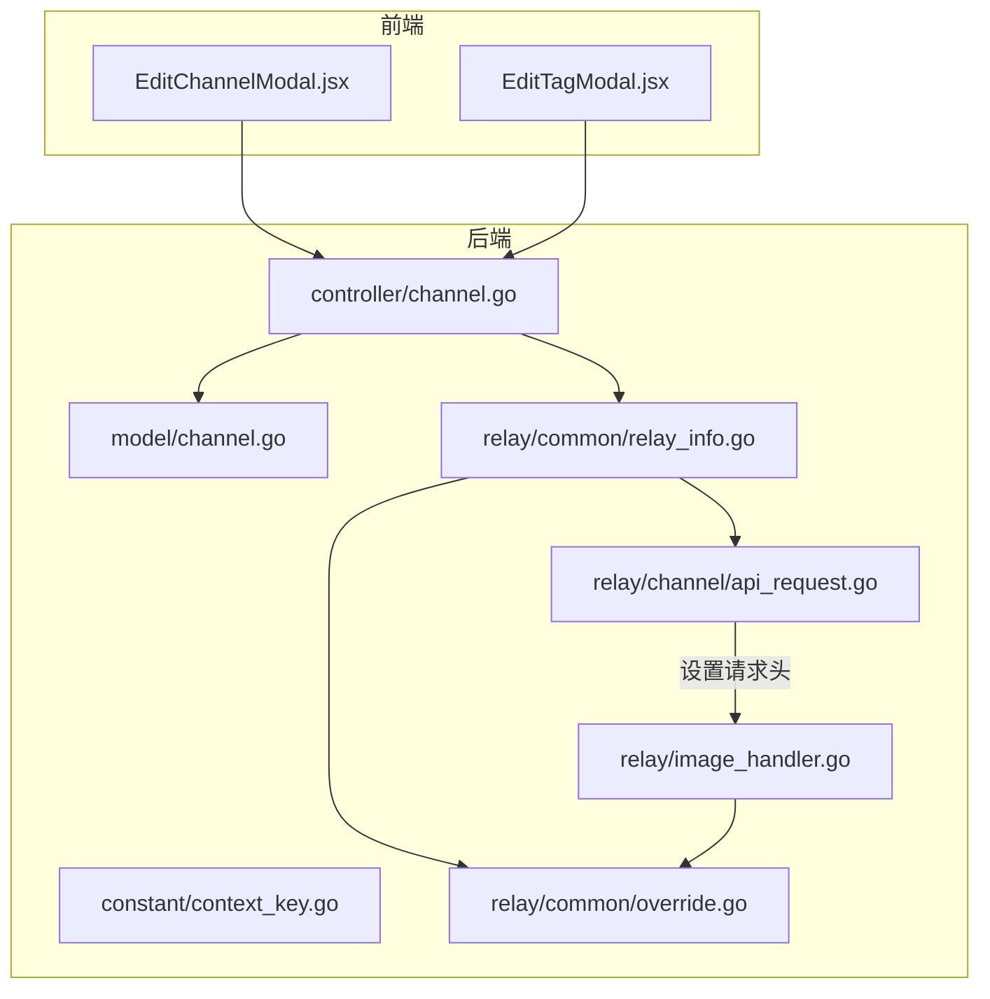
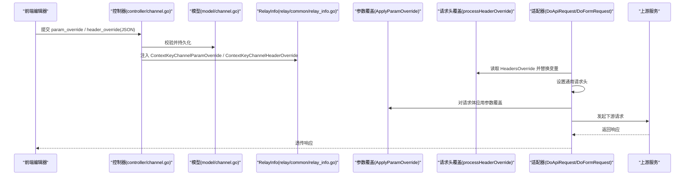
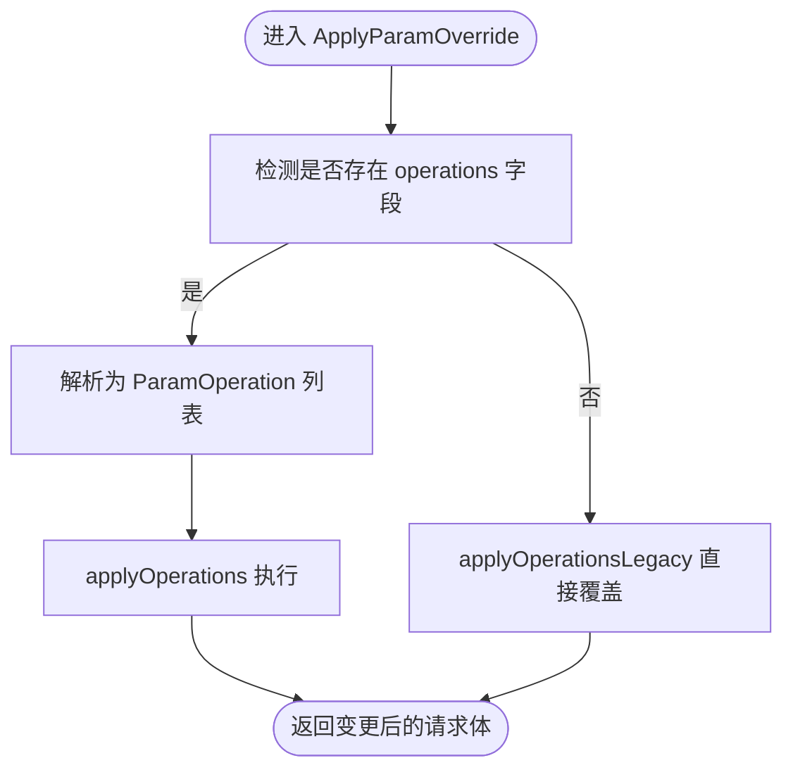
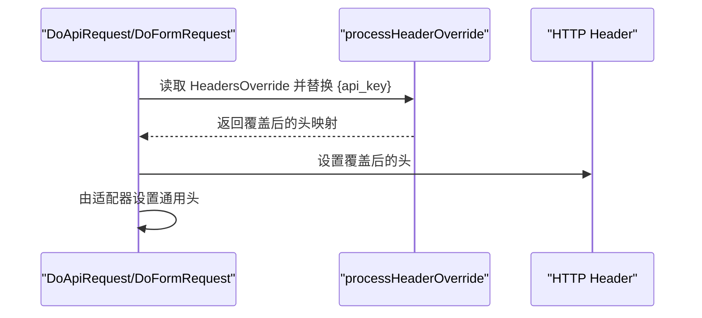
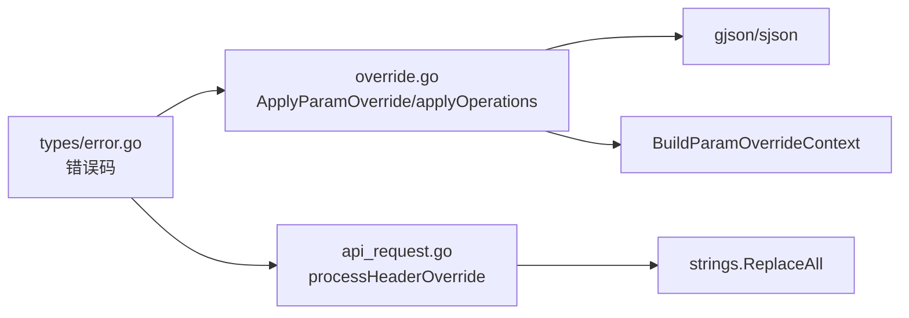

# 参数与请求头覆盖

<cite>
**本文引用的文件**
- [override.go](file://relay/common/override.go)
- [api_request.go](file://relay/channel/api_request.go)
- [relay_info.go](file://relay/common/relay_info.go)
- [context_key.go](file://constant/context_key.go)
- [channel.go](file://controller/channel.go)
- [channel.go](file://model/channel.go)
- [error.go](file://types/error.go)
- [EditChannelModal.jsx](file://web/src/components/table/channels/modals/EditChannelModal.jsx)
- [EditTagModal.jsx](file://web/src/components/table/channels/modals/EditTagModal.jsx)
- [image_handler.go](file://relay/image_handler.go)
</cite>

## 目录
1. [简介](#简介)
2. [项目结构](#项目结构)
3. [核心组件](#核心组件)
4. [架构总览](#架构总览)
5. [详细组件分析](#详细组件分析)
6. [依赖关系分析](#依赖关系分析)
7. [性能考量](#性能考量)
8. [故障排查指南](#故障排查指南)
9. [结论](#结论)
10. [附录](#附录)

## 简介
本文件聚焦于“参数覆盖（Param Override）”与“请求头覆盖（Header Override）”两大能力，面向渠道（Channel）级配置，帮助用户通过 JSON 结构化配置实现对上游请求参数与请求头的统一控制与动态替换。内容涵盖：
- JSON 语法结构与字段语义
- 使用场景与最佳实践
- 变量替换机制与安全注意事项
- 与前端管理界面的交互方式
- 高级用例（如系统提示词注入、请求超时调整）的实现思路与限制

## 项目结构
围绕参数与请求头覆盖的关键代码分布在如下模块：
- 后端通用覆盖逻辑：relay/common/override.go
- 请求头覆盖执行：relay/channel/api_request.go
- 渠道元数据与上下文：relay/common/relay_info.go
- 上下文键常量：constant/context_key.go
- 渠道控制器与模型：controller/channel.go、model/channel.go
- 错误码定义：types/error.go
- 前端表单与占位示例：web/src/components/table/channels/modals/EditChannelModal.jsx、EditTagModal.jsx
- 参数覆盖应用位置示例：relay/image_handler.go

图表来源
- [EditChannelModal.jsx](file://web/src/components/table/channels/modals/EditChannelModal.jsx#L2673-L2763)
- [EditTagModal.jsx](file://web/src/components/table/channels/modals/EditTagModal.jsx#L547-L682)
- [controller/channel.go](file://controller/channel.go#L700-L808)
- [model/channel.go](file://model/channel.go#L40-L52)
- [constant/context_key.go](file://constant/context_key.go#L23-L33)
- [relay_info.go](file://relay/common/relay_info.go#L56-L74)
- [override.go](file://relay/common/override.go#L35-L49)
- [api_request.go](file://relay/channel/api_request.go#L41-L59)
- [image_handler.go](file://relay/image_handler.go#L70-L76)

章节来源
- [EditChannelModal.jsx](file://web/src/components/table/channels/modals/EditChannelModal.jsx#L2673-L2763)
- [EditTagModal.jsx](file://web/src/components/table/channels/modals/EditTagModal.jsx#L547-L682)
- [controller/channel.go](file://controller/channel.go#L700-L808)
- [model/channel.go](file://model/channel.go#L40-L52)
- [constant/context_key.go](file://constant/context_key.go#L23-L33)
- [relay_info.go](file://relay/common/relay_info.go#L56-L74)
- [override.go](file://relay/common/override.go#L35-L49)
- [api_request.go](file://relay/channel/api_request.go#L41-L59)
- [image_handler.go](file://relay/image_handler.go#L70-L76)

## 核心组件
- 参数覆盖（Param Override）
  - 作用：在请求体层面进行参数覆盖或结构化变更，支持旧格式直接覆盖与新格式条件判断+路径操作。
  - 关键实现：ApplyParamOverride、applyOperations、applyOperationsLegacy、BuildParamOverrideContext。
  - 应用点：在适配器转换请求体后、发起上游请求前调用，确保下游请求符合策略。
- 请求头覆盖（Header Override）
  - 作用：在请求头层面进行覆盖，并支持变量替换（如 {api_key}）。
  - 关键实现：processHeaderOverride、DoApiRequest/DoFormRequest/DoWssRequest。
  - 应用点：在构造下游请求头时，先应用覆盖，再由适配器设置特定头部。

章节来源
- [override.go](file://relay/common/override.go#L35-L49)
- [api_request.go](file://relay/channel/api_request.go#L41-L59)
- [image_handler.go](file://relay/image_handler.go#L70-L76)

## 架构总览
参数与请求头覆盖贯穿“前端配置—后端解析—请求构建—下游转发”的链路。

图表来源
- [controller/channel.go](file://controller/channel.go#L700-L808)
- [model/channel.go](file://model/channel.go#L40-L52)
- [constant/context_key.go](file://constant/context_key.go#L23-L33)
- [relay_info.go](file://relay/common/relay_info.go#L131-L176)
- [api_request.go](file://relay/channel/api_request.go#L61-L90)
- [override.go](file://relay/common/override.go#L35-L49)
- [image_handler.go](file://relay/image_handler.go#L70-L76)

## 详细组件分析

### 参数覆盖（Param Override）
- JSON 语法与字段
  - 旧格式（直接覆盖）：顶层键即为要覆盖的请求参数键，值为目标值。
  - 新格式（结构化操作）：包含 operations 数组，每条操作包含：
    - path：目标参数路径（支持负索引，如 .messages.-1.content）
    - mode：操作模式，包括 set、delete、move、prepend、append
    - value：写入值（仅 set/append/prepend 使用）
    - keep_origin：是否保留原值（仅 set/merge 时生效）
    - from/to：move 操作的源路径与目标路径
    - conditions：条件列表，支持 full/prefix/suffix/contains/gt/gte/lt/lte 与 invert/pass_missing_key
    - logic：AND/OR（默认 OR）
  - 条件上下文：BuildParamOverrideContext 提供 model、upstream_model、original_model 等上下文键，便于按模型分支控制。
- 应用流程
  - 在适配器转换请求体后，读取 RelayInfo 中的 ParamOverride，调用 ApplyParamOverride。
  - 若包含 operations 字段且解析成功，走新流程 applyOperations；否则走旧流程 applyOperationsLegacy。
- 典型使用场景
  - 统一温度与最大生成长度：通过 set 模式覆盖 temperature、max_tokens。
  - 条件化覆盖：仅当 model 前缀匹配某前缀时才覆盖，避免影响其他模型。
  - 结构化变更：对数组或对象进行 prepend/append/merge，实现系统提示词拼接等。
- 安全与限制
  - 不建议覆盖 stream 参数，前端占位已明确标注。
  - 严格校验 JSON 格式，非法 JSON 将被拒绝。
  - 路径访问失败或类型不匹配会触发错误，需确保 path 正确。

图表来源
- [override.go](file://relay/common/override.go#L35-L49)
- [override.go](file://relay/common/override.go#L296-L309)
- [override.go](file://relay/common/override.go#L311-L358)

章节来源
- [override.go](file://relay/common/override.go#L16-L33)
- [override.go](file://relay/common/override.go#L35-L49)
- [override.go](file://relay/common/override.go#L51-L126)
- [override.go](file://relay/common/override.go#L128-L188)
- [override.go](file://relay/common/override.go#L190-L218)
- [override.go](file://relay/common/override.go#L220-L294)
- [override.go](file://relay/common/override.go#L296-L309)
- [override.go](file://relay/common/override.go#L311-L358)
- [override.go](file://relay/common/override.go#L360-L370)
- [override.go](file://relay/common/override.go#L372-L411)
- [override.go](file://relay/common/override.go#L413-L424)
- [override.go](file://relay/common/override.go#L425-L454)
- [override.go](file://relay/common/override.go#L456-L482)
- [EditChannelModal.jsx](file://web/src/components/table/channels/modals/EditChannelModal.jsx#L2673-L2690)
- [EditTagModal.jsx](file://web/src/components/table/channels/modals/EditTagModal.jsx#L547-L561)
- [image_handler.go](file://relay/image_handler.go#L70-L76)

### 请求头覆盖（Header Override）
- JSON 语法与字段
  - 键为请求头名称，值为字符串；支持变量替换 {api_key}，将被替换为当前渠道密钥。
- 变量替换机制
  - processHeaderOverride 会对每个覆盖值检查是否包含 {api_key}，若存在则替换为 info.ApiKey。
  - 若覆盖值非字符串，将返回 header_override_invalid 错误。
- 应用流程
  - 在 DoApiRequest/DoFormRequest/DoWssRequest 中，先调用 processHeaderOverride 获取覆盖后的头集合，再由适配器设置通用头。
- 典型使用场景
  - 自定义 User-Agent：用于伪装客户端或满足下游要求。
  - 动态 Authorization：通过 {api_key} 插入渠道密钥，避免硬编码。
- 安全注意事项
  - 仅支持 {api_key} 变量，避免引入敏感信息泄露面。
  - 若覆盖值类型不正确，将直接报错，避免错误头导致请求异常。

图表来源
- [api_request.go](file://relay/channel/api_request.go#L41-L59)
- [api_request.go](file://relay/channel/api_request.go#L61-L90)
- [api_request.go](file://relay/channel/api_request.go#L92-L122)
- [api_request.go](file://relay/channel/api_request.go#L125-L150)

章节来源
- [api_request.go](file://relay/channel/api_request.go#L41-L59)
- [api_request.go](file://relay/channel/api_request.go#L61-L90)
- [api_request.go](file://relay/channel/api_request.go#L92-L122)
- [api_request.go](file://relay/channel/api_request.go#L125-L150)
- [EditChannelModal.jsx](file://web/src/components/table/channels/modals/EditChannelModal.jsx#L2740-L2763)
- [EditTagModal.jsx](file://web/src/components/table/channels/modals/EditTagModal.jsx#L623-L682)

### 渠道元数据与上下文
- ChannelMeta
  - 包含 ParamOverride、HeadersOverride、ApiKey 等，作为请求构建阶段的输入。
- RelayInfo.InitChannelMeta
  - 从上下文中提取 param_override/header_override，并注入到 ChannelMeta。
- 上下文键
  - ContextKeyChannelParamOverride、ContextKeyChannelHeaderOverride 用于在中间件/控制器层注入配置。

章节来源
- [relay_info.go](file://relay/common/relay_info.go#L56-L74)
- [relay_info.go](file://relay/common/relay_info.go#L131-L176)
- [context_key.go](file://constant/context_key.go#L23-L33)

### 前端配置与校验
- 编辑器占位与示例
  - 参数覆盖与请求头覆盖均提供 JSON 示例与“填入模板”快捷按钮，便于快速配置。
  - 明确标注不支持覆盖 stream 参数。
- 校验规则
  - 控制器对 param_override/header_override 进行 JSON 格式校验，非法将拒绝保存。

章节来源
- [EditChannelModal.jsx](file://web/src/components/table/channels/modals/EditChannelModal.jsx#L2673-L2763)
- [EditTagModal.jsx](file://web/src/components/table/channels/modals/EditTagModal.jsx#L547-L682)
- [controller/channel.go](file://controller/channel.go#L758-L808)

### 实际应用示例与高级用例
- 系统提示词注入（建议做法）
  - 通过参数覆盖的新格式，使用 prepend/append/merge 对消息数组或系统提示字段进行拼接，实现“前置系统提示词”或“拼接用户系统提示词”。
  - 注意：不要直接覆盖用户显式提供的系统提示词，应采用拼接策略。
- 请求超时调整（限制说明）
  - Header Override 仅能设置请求头，无法直接设置 TCP/HTTP 层超时；超时通常由客户端或网络栈控制。
  - 如需超时控制，可在上游适配器或网络层配置，不在 header_override 的职责范围内。

章节来源
- [override.go](file://relay/common/override.go#L372-L424)
- [override.go](file://relay/common/override.go#L425-L454)
- [EditChannelModal.jsx](file://web/src/components/table/channels/modals/EditChannelModal.jsx#L2978-L3008)

## 依赖关系分析
- 参数覆盖依赖
  - gjson/sjson：用于 JSON 路径读取与写入，支持复杂结构变更。
  - 条件判断：基于 gjson 的类型与字符串比较，支持多种模式。
- 请求头覆盖依赖
  - 字符串替换：简单字符串替换，保证变量安全。
- 错误处理
  - 参数覆盖无效：返回 channel:param_override_invalid。
  - 请求头覆盖无效：返回 channel:header_override_invalid。

图表来源
- [override.go](file://relay/common/override.go#L10-L12)
- [override.go](file://relay/common/override.go#L128-L188)
- [override.go](file://relay/common/override.go#L311-L358)
- [api_request.go](file://relay/channel/api_request.go#L41-L59)
- [error.go](file://types/error.go#L50-L60)

章节来源
- [override.go](file://relay/common/override.go#L10-L12)
- [override.go](file://relay/common/override.go#L128-L188)
- [override.go](file://relay/common/override.go#L311-L358)
- [api_request.go](file://relay/channel/api_request.go#L41-L59)
- [error.go](file://types/error.go#L50-L60)

## 性能考量
- 参数覆盖
  - 新格式的条件判断与路径解析会带来一定 CPU 开销，建议仅在必要时使用复杂条件。
  - 对大型数组或深层嵌套对象进行 prepend/append/merge 时，注意内存与序列化成本。
- 请求头覆盖
  - 字符串替换为 O(n) 操作，通常开销很小；但请避免在高频请求中频繁变更大量头字段。

## 故障排查指南
- 参数覆盖无效
  - 检查 JSON 格式是否合法。
  - 检查 path 是否正确，类型是否匹配。
  - 检查 conditions 的模式与值类型是否一致。
  - 查看错误码 channel:param_override_invalid。
- 请求头覆盖无效
  - 检查覆盖值是否为字符串。
  - 检查 {api_key} 是否存在于覆盖值中。
  - 查看错误码 channel:header_override_invalid。
- 建议步骤
  - 在前端编辑器中使用“填入模板”快速生成示例。
  - 逐步简化 JSON，定位问题字段。
  - 结合日志与调试开关观察请求体与请求头的实际内容。

章节来源
- [controller/channel.go](file://controller/channel.go#L758-L808)
- [error.go](file://types/error.go#L50-L60)
- [EditChannelModal.jsx](file://web/src/components/table/channels/modals/EditChannelModal.jsx#L2740-L2763)
- [EditTagModal.jsx](file://web/src/components/table/channels/modals/EditTagModal.jsx#L623-L682)

## 结论
- 参数覆盖与请求头覆盖为渠道级统一治理提供了强大而灵活的能力。
- 参数覆盖支持旧格式直接覆盖与新格式条件+路径操作，适合精细化参数控制与系统提示词拼接。
- 请求头覆盖支持 {api_key} 变量替换，适合动态鉴权与客户端标识定制。
- 建议遵循最小变更原则，配合条件判断与路径操作，确保行为可控、可审计。

## 附录
- 前端配置入口
  - 渠道编辑弹窗与标签编辑弹窗均提供 param_override 与 header_override 的输入框与示例。
- 参数覆盖应用位置参考
  - 图像请求等场景在转换请求体后应用参数覆盖，确保下游请求符合策略。

章节来源
- [EditChannelModal.jsx](file://web/src/components/table/channels/modals/EditChannelModal.jsx#L2673-L2763)
- [EditTagModal.jsx](file://web/src/components/table/channels/modals/EditTagModal.jsx#L547-L682)
- [image_handler.go](file://relay/image_handler.go#L70-L76)