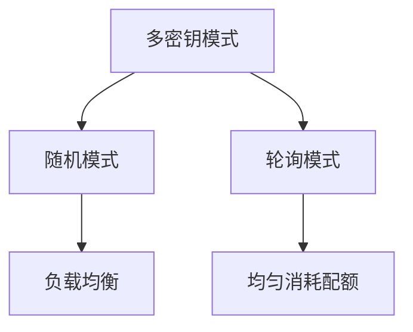
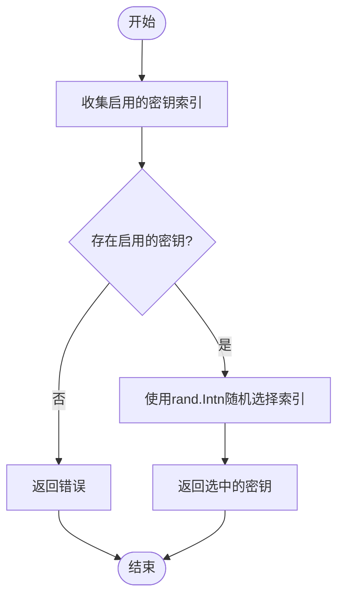
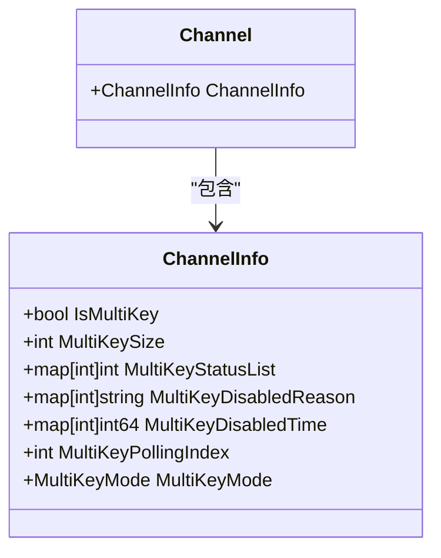

# 多密钥模式配置

<cite>
**本文档引用的文件**   
- [multi_key_mode.go](file://constant/multi_key_mode.go)
- [channel.go](file://model/channel.go)
- [channel_cache.go](file://model/channel_cache.go)
- [channel.go](file://controller/channel.go)
- [channel_settings.go](file://dto/channel_settings.go)
</cite>

## 目录
1. [简介](#简介)
2. [多密钥模式概述](#多密钥模式概述)
3. [随机模式](#随机模式)
4. [轮询模式](#轮询模式)
5. [通道信息管理](#通道信息管理)
6. [管理界面配置](#管理界面配置)
7. [故障转移与高可用性](#故障转移与高可用性)

## 简介
多密钥模式是系统中用于管理多个API密钥的重要功能，旨在提高服务的可用性和负载均衡能力。通过支持随机和轮询两种模式，系统能够灵活应对不同的使用场景和需求。本文档详细阐述了这两种模式的工作原理、实现机制以及如何在管理界面进行配置。

**Section sources**
- [multi_key_mode.go](file://constant/multi_key_mode.go#L3-L8)

## 多密钥模式概述
多密钥模式允许一个通道（Channel）配置多个API密钥，并根据指定的策略选择使用哪个密钥。这种设计不仅提高了系统的容错能力，还能够实现更均匀的配额消耗。系统支持两种主要的密钥选择模式：随机模式和轮询模式，每种模式都有其特定的应用场景和优势。



**Diagram sources **
- [multi_key_mode.go](file://constant/multi_key_mode.go#L3-L8)

**Section sources**
- [multi_key_mode.go](file://constant/multi_key_mode.go#L3-L8)

## 随机模式
随机模式通过`rand.Intn`函数从启用的密钥列表中随机选择一个密钥。这种方式适用于需要负载均衡的场景，可以有效分散请求压力，避免单个密钥过载。实现上，系统会先收集所有启用状态的密钥索引，然后从中随机选取一个作为当前请求使用的密钥。



**Diagram sources **
- [channel.go](file://model/channel.go#L148-L152)

**Section sources**
- [channel.go](file://model/channel.go#L148-L152)

## 轮询模式
轮询模式基于`MultiKeyPollingIndex`实现线程安全的密钥选择。每次请求时，系统会从上次使用的索引位置开始，按顺序查找下一个启用状态的密钥。为了确保并发安全，系统使用`GetChannelPollingLock`获取通道级别的锁，防止多个goroutine同时修改索引。索引在每次成功选择后自动递增，实现了均匀消耗多个密钥配额的目标。

```mermaid
sequenceDiagram
participant Client as "客户端"
participant Channel as "通道"
participant Lock as "轮询锁"
Client->>Channel : 请求API密钥
Channel->>Lock : 获取通道锁
Lock-->>Channel : 锁定成功
Channel->>Channel : 从MultiKeyPollingIndex开始查找
loop 遍历密钥列表
Channel->>Channel : 检查密钥状态
alt 密钥启用
Channel->>Channel : 选择该密钥
Channel->>Channel : 更新MultiKeyPollingIndex
break
end
end
Channel->>Lock : 释放锁
Channel-->>Client : 返回选中的密钥
```

**Diagram sources **
- [channel.go](file://model/channel.go#L153-L185)
- [channel_cache.go](file://model/channel_cache.go#L73-L78)

**Section sources**
- [channel.go](file://model/channel.go#L153-L185)
- [channel_cache.go](file://model/channel_cache.go#L73-L78)

## 通道信息管理
通道信息通过`ChannelInfo`结构体进行管理，包含了多密钥模式下的各种状态信息。这些信息包括是否启用多密钥模式、密钥数量、密钥状态列表、禁用原因、禁用时间以及轮询索引等。通过这个结构体，系统能够有效地跟踪和管理每个通道的多密钥状态，实现高可用性和故障转移。



**Diagram sources **
- [channel.go](file://model/channel.go#L60-L68)

**Section sources**
- [channel.go](file://model/channel.go#L60-L68)

## 管理界面配置
在管理界面中，用户可以通过通道配置页面设置多密钥模式。系统提供了直观的界面来添加、编辑和删除密钥，同时支持批量操作。用户可以选择随机或轮询模式，并查看每个密钥的状态和使用情况。此外，系统还提供了详细的日志记录和监控功能，帮助管理员及时发现和解决问题。

**Section sources**
- [channel.go](file://controller/channel.go#L529-L807)
- [channel_settings.go](file://dto/channel_settings.go#L3-L42)

## 故障转移与高可用性
系统通过多密钥模式实现了强大的故障转移和高可用性。当某个密钥失效时，系统会自动切换到其他可用的密钥，确保服务不中断。同时，通过定期检查密钥状态和自动更新配置，系统能够快速响应环境变化，保持最佳的运行状态。这种设计大大提高了系统的稳定性和可靠性。

**Section sources**
- [channel.go](file://model/channel.go#L570-L677)
- [channel_cache.go](file://model/channel_cache.go#L225-L248)