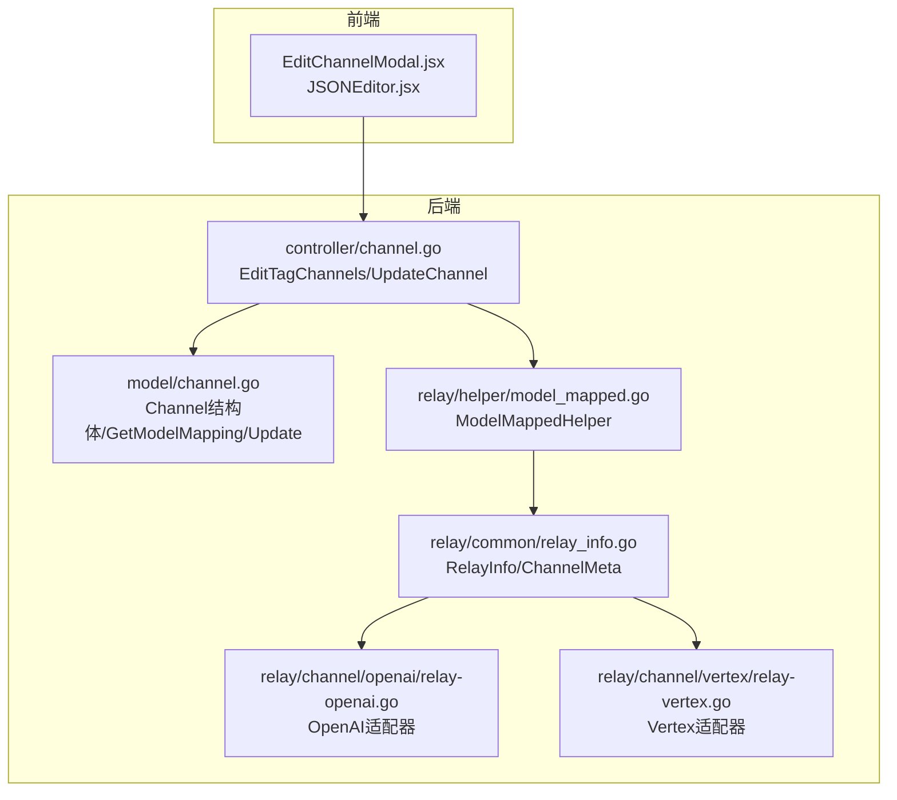
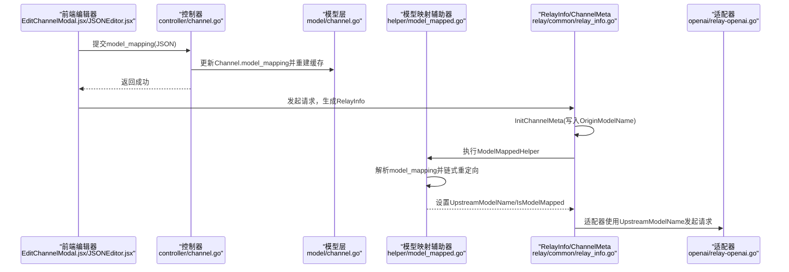
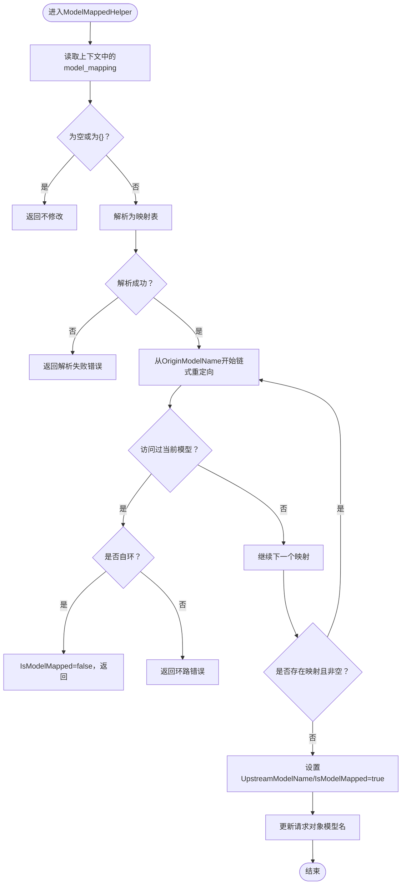
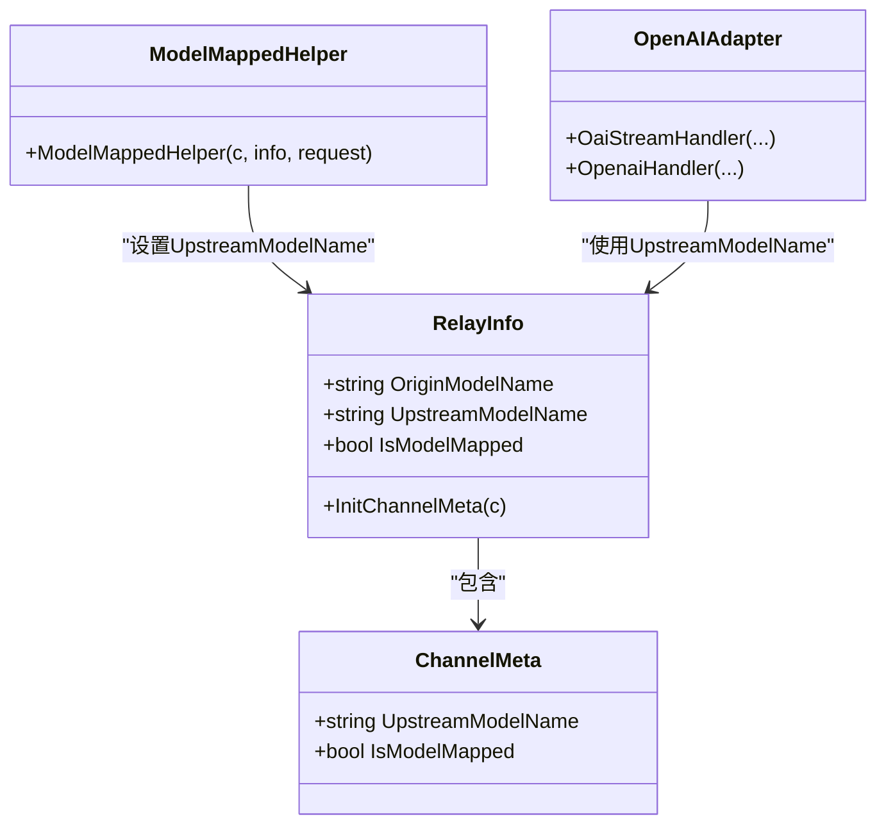
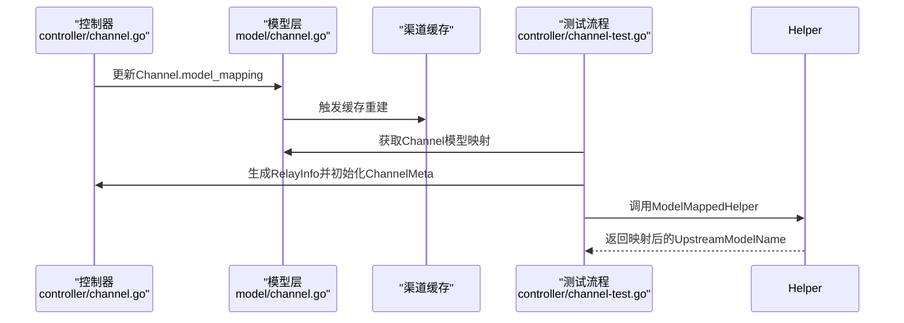
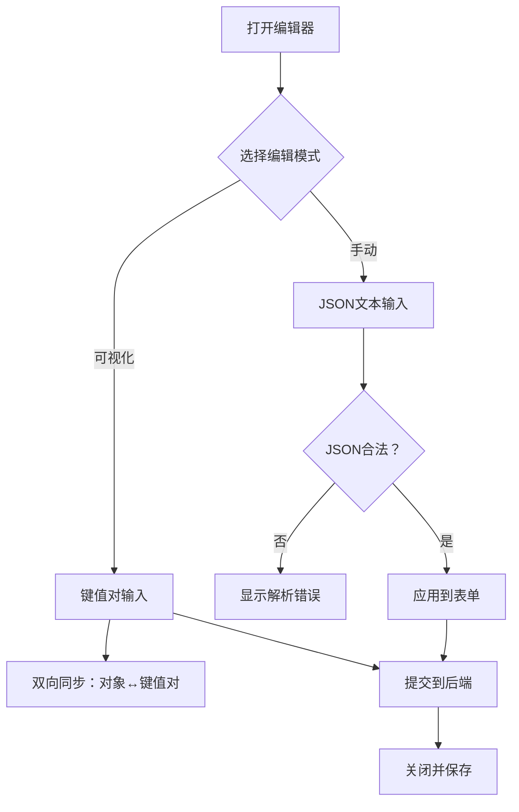
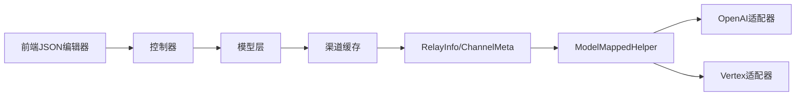

# 模型映射配置

<cite>
**本文引用的文件**
- [model_mapped.go](file://relay/helper/model_mapped.go)
- [context_key.go](file://constant/context_key.go)
- [channel.go](file://model/channel.go)
- [channel.go](file://controller/channel.go)
- [relay_info.go](file://relay/common/relay_info.go)
- [EditChannelModal.jsx](file://web/src/components/table/channels/modals/EditChannelModal.jsx)
- [EditTagModal.jsx](file://web/src/components/table/channels/modals/EditTagModal.jsx)
- [JSONEditor.jsx](file://web/src/components/common/ui/JSONEditor.jsx)
- [channel-test.go](file://controller/channel-test.go)
- [openai/relay-openai.go](file://relay/channel/openai/relay-openai.go)
- [vertex/relay-vertex.go](file://relay/channel/vertex/relay-vertex.go)
</cite>

## 目录
1. [简介](#简介)
2. [项目结构](#项目结构)
3. [核心组件](#核心组件)
4. [架构总览](#架构总览)
5. [详细组件分析](#详细组件分析)
6. [依赖关系分析](#依赖关系分析)
7. [性能考量](#性能考量)
8. [故障排查指南](#故障排查指南)
9. [结论](#结论)
10. [附录](#附录)

## 简介
本文件围绕“模型映射（Model Mapping）”功能展开，系统性说明如何通过JSON格式配置源模型到目标模型的转换规则，使统一API接口屏蔽后端渠道差异，为前端提供一致的模型命名空间。文档重点涵盖：
- 配置项：model_mapping 的JSON结构与语义（键为客户端请求中的模型名称，值为目标上游模型名称）
- 示例：将请求中的 gpt-3.5-turbo 映射为 gpt-3.5-turbo-1106 以启用特定功能
- 统一API接口中的作用：在请求进入各适配器前完成模型名称转换，确保后端渠道接收的模型名与能力匹配
- 数据库与API交互：model_mapping 在Channel结构体中的持久化、控制器更新与缓存初始化
- 管理界面：在前端JSON编辑器中进行配置、填入模板与清空操作

## 项目结构
模型映射功能横跨后端Go服务与前端React界面，关键位置如下：
- 后端
  - 请求处理链：RelayInfo初始化、ModelMappedHelper执行模型映射、各适配器（OpenAI、Vertex等）消费映射后的模型名
  - 数据层：Channel结构体包含model_mapping字段，控制器负责更新并触发缓存重建
- 前端
  - JSON编辑器组件支持键值对可视化编辑与手动文本编辑，提供模板与清空入口

图表来源
- [EditChannelModal.jsx](file://web/src/components/table/channels/modals/EditChannelModal.jsx#L2555-L2576)
- [JSONEditor.jsx](file://web/src/components/common/ui/JSONEditor.jsx#L49-L120)
- [controller/channel.go](file://controller/channel.go#L758-L808)
- [model/channel.go](file://model/channel.go#L1-L80)
- [model/channel.go](file://model/channel.go#L431-L436)
- [model/channel.go](file://model/channel.go#L697-L751)
- [relay/helper/model_mapped.go](file://relay/helper/model_mapped.go#L13-L58)
- [relay/common/relay_info.go](file://relay/common/relay_info.go#L81-L129)
- [relay/common/relay_info.go](file://relay/common/relay_info.go#L131-L182)
- [openai/relay-openai.go](file://relay/channel/openai/relay-openai.go#L1-L200)
- [vertex/relay-vertex.go](file://relay/channel/vertex/relay-vertex.go#L1-L22)

章节来源
- [EditChannelModal.jsx](file://web/src/components/table/channels/modals/EditChannelModal.jsx#L2555-L2576)
- [JSONEditor.jsx](file://web/src/components/common/ui/JSONEditor.jsx#L49-L120)
- [controller/channel.go](file://controller/channel.go#L758-L808)
- [model/channel.go](file://model/channel.go#L1-L80)
- [model/channel.go](file://model/channel.go#L431-L436)
- [model/channel.go](file://model/channel.go#L697-L751)
- [relay/helper/model_mapped.go](file://relay/helper/model_mapped.go#L13-L58)
- [relay/common/relay_info.go](file://relay/common/relay_info.go#L81-L182)
- [openai/relay-openai.go](file://relay/channel/openai/relay-openai.go#L1-L200)
- [vertex/relay-vertex.go](file://relay/channel/vertex/relay-vertex.go#L1-L22)

## 核心组件
- 模型映射辅助器（ModelMappedHelper）
  - 负责从上下文读取model_mapping字符串，解析为映射表；支持链式重定向与环路检测；最终将上游模型名写回RelayInfo，并更新请求对象的模型名
- 上游模型元信息（RelayInfo/ChannelMeta）
  - 包含OriginModelName（原始模型名）、UpstreamModelName（上游模型名）与IsModelMapped标记
- 渠道模型映射（Channel）
  - 结构体字段model_mapping用于持久化映射配置；提供GetModelMapping方法读取
- 控制器更新（EditTagChannels/UpdateChannel）
  - 接收前端提交的model_mapping，调用model层更新并触发缓存重建
- 前端JSON编辑器（JSONEditor.jsx）
  - 提供键值对可视化编辑与手动文本编辑，支持模板填入与清空

章节来源
- [relay/helper/model_mapped.go](file://relay/helper/model_mapped.go#L13-L58)
- [relay/common/relay_info.go](file://relay/common/relay_info.go#L81-L182)
- [model/channel.go](file://model/channel.go#L1-L80)
- [model/channel.go](file://model/channel.go#L431-L436)
- [model/channel.go](file://model/channel.go#L697-L751)
- [controller/channel.go](file://controller/channel.go#L758-L808)
- [JSONEditor.jsx](file://web/src/components/common/ui/JSONEditor.jsx#L49-L120)

## 架构总览
模型映射在统一API中的处理流程如下：
- 前端通过JSON编辑器提交model_mapping（键为请求模型名，值为目标上游模型名）
- 控制器接收并更新Channel记录，随后初始化或刷新渠道缓存
- 请求到达时，生成RelayInfo并初始化ChannelMeta，将原始模型名写入OriginModelName
- 调用ModelMappedHelper，根据model_mapping解析并链式重定向，得到UpstreamModelName
- 适配器（如OpenAI、Vertex）使用UpstreamModelName发起下游请求

图表来源
- [EditChannelModal.jsx](file://web/src/components/table/channels/modals/EditChannelModal.jsx#L2555-L2576)
- [JSONEditor.jsx](file://web/src/components/common/ui/JSONEditor.jsx#L49-L120)
- [controller/channel.go](file://controller/channel.go#L758-L808)
- [model/channel.go](file://model/channel.go#L697-L751)
- [relay/helper/model_mapped.go](file://relay/helper/model_mapped.go#L13-L58)
- [relay/common/relay_info.go](file://relay/common/relay_info.go#L131-L182)
- [openai/relay-openai.go](file://relay/channel/openai/relay-openai.go#L1-L200)

## 详细组件分析

### 组件A：模型映射辅助器（ModelMappedHelper）
- 功能要点
  - 从上下文读取model_mapping字符串，解析为映射表
  - 支持链式重定向：从OriginModelName开始，逐次查找映射，直到链尾
  - 环路检测：若出现循环（包括自环），返回错误；否则设置IsModelMapped与UpstreamModelName
  - 最终将请求对象的模型名更新为UpstreamModelName
- 错误处理
  - JSON解析失败返回错误
  - 检测到环路返回错误
  - 自环且未发生重定向时，不视为映射（IsModelMapped=false）

图表来源
- [relay/helper/model_mapped.go](file://relay/helper/model_mapped.go#L13-L58)

章节来源
- [relay/helper/model_mapped.go](file://relay/helper/model_mapped.go#L13-L58)

### 组件B：统一API中的模型命名空间
- RelayInfo/ChannelMeta
  - OriginModelName：原始请求模型名
  - UpstreamModelName：经映射后的上游模型名
  - IsModelMapped：是否发生模型映射
- 适配器使用
  - OpenAI适配器在流式与非流式处理中均使用UpstreamModelName
  - Vertex适配器根据模型名选择请求模式（如Claude/Gemini/Llama）

图表来源
- [relay/common/relay_info.go](file://relay/common/relay_info.go#L81-L182)
- [relay/helper/model_mapped.go](file://relay/helper/model_mapped.go#L13-L58)
- [openai/relay-openai.go](file://relay/channel/openai/relay-openai.go#L1-L200)

章节来源
- [relay/common/relay_info.go](file://relay/common/relay_info.go#L81-L182)
- [openai/relay-openai.go](file://relay/channel/openai/relay-openai.go#L1-L200)

### 组件C：数据库存储与API交互
- Channel结构体
  - 字段model_mapping为指针字符串，类型为TEXT，用于持久化映射配置
  - 提供GetModelMapping读取方法
- 控制器更新
  - EditTagChannels/UpdateChannel接收model_mapping，调用model层更新并重建缓存
- 测试流程
  - channel-test中先生成RelayInfo，再调用ModelMappedHelper，随后使用映射后的模型名初始化适配器

图表来源
- [model/channel.go](file://model/channel.go#L1-L80)
- [model/channel.go](file://model/channel.go#L431-L436)
- [model/channel.go](file://model/channel.go#L697-L751)
- [controller/channel.go](file://controller/channel.go#L758-L808)
- [channel-test.go](file://controller/channel-test.go#L179-L230)

章节来源
- [model/channel.go](file://model/channel.go#L1-L80)
- [model/channel.go](file://model/channel.go#L431-L436)
- [model/channel.go](file://model/channel.go#L697-L751)
- [controller/channel.go](file://controller/channel.go#L758-L808)
- [channel-test.go](file://controller/channel-test.go#L179-L230)

### 组件D：管理界面的JSON编辑器
- 编辑器特性
  - 支持键值对可视化编辑与手动文本编辑
  - 自动解析JSON，显示重复键警告
  - 提供模板填入与清空入口
- 模板与清空
  - 模板示例键为请求模型名，值为目标上游模型名
  - 清空时写入空对象字符串

图表来源
- [JSONEditor.jsx](file://web/src/components/common/ui/JSONEditor.jsx#L49-L120)
- [EditChannelModal.jsx](file://web/src/components/table/channels/modals/EditChannelModal.jsx#L2555-L2576)
- [EditTagModal.jsx](file://web/src/components/table/channels/modals/EditTagModal.jsx#L487-L516)

章节来源
- [JSONEditor.jsx](file://web/src/components/common/ui/JSONEditor.jsx#L49-L120)
- [EditChannelModal.jsx](file://web/src/components/table/channels/modals/EditChannelModal.jsx#L2555-L2576)
- [EditTagModal.jsx](file://web/src/components/table/channels/modals/EditTagModal.jsx#L487-L516)

## 依赖关系分析
- 组件耦合
  - ModelMappedHelper依赖上下文键“model_mapping”（由常量定义）
  - RelayInfo/ChannelMeta承载模型名与映射状态
  - OpenAI/Vertex等适配器依赖UpstreamModelName
- 关键依赖链
  - 前端编辑器 → 控制器 → 模型层 → 缓存 → 请求处理链 → 适配器
- 外部依赖
  - JSON解析与键值对编辑由前端组件提供
  - 渠道类型与适配器选择由统一路由与适配器工厂决定

图表来源
- [context_key.go](file://constant/context_key.go#L34-L35)
- [controller/channel.go](file://controller/channel.go#L758-L808)
- [model/channel.go](file://model/channel.go#L697-L751)
- [relay/helper/model_mapped.go](file://relay/helper/model_mapped.go#L13-L58)
- [relay/common/relay_info.go](file://relay/common/relay_info.go#L131-L182)
- [openai/relay-openai.go](file://relay/channel/openai/relay-openai.go#L1-L200)
- [vertex/relay-vertex.go](file://relay/channel/vertex/relay-vertex.go#L1-L22)

章节来源
- [context_key.go](file://constant/context_key.go#L34-L35)
- [controller/channel.go](file://controller/channel.go#L758-L808)
- [model/channel.go](file://model/channel.go#L697-L751)
- [relay/helper/model_mapped.go](file://relay/helper/model_mapped.go#L13-L58)
- [relay/common/relay_info.go](file://relay/common/relay_info.go#L131-L182)
- [openai/relay-openai.go](file://relay/channel/openai/relay-openai.go#L1-L200)
- [vertex/relay-vertex.go](file://relay/channel/vertex/relay-vertex.go#L1-L22)

## 性能考量
- JSON解析与键值对转换
  - 前端编辑器在键值对与对象间转换时需注意重复键覆盖行为，避免不必要的重渲染
- 链式重定向
  - 映射表规模较大时，链式遍历成本线性增长；建议控制映射层级与长度，减少环路检测开销
- 缓存与并发
  - 渠道更新后重建缓存，避免并发读取到不一致状态；RelayInfo初始化时应确保上下文键正确注入

## 故障排查指南
- JSON解析失败
  - 现象：后端返回模型映射解析错误
  - 排查：确认前端JSON编辑器中JSON合法；检查是否有重复键导致覆盖
- 环路错误
  - 现象：提示模型映射包含环路
  - 排查：检查映射表中是否存在自环或多步环；修正为线性映射
- 自环但未重定向
  - 现象：IsModelMapped=false，未发生模型重定向
  - 排查：确认OriginModelName与UpstreamModelName相同且未发生链式跳转
- 适配器不识别模型名
  - 现象：下游渠道报错或不支持模型名
  - 排查：确认UpstreamModelName与渠道支持的模型名一致；必要时调整映射

章节来源
- [relay/helper/model_mapped.go](file://relay/helper/model_mapped.go#L13-L58)
- [JSONEditor.jsx](file://web/src/components/common/ui/JSONEditor.jsx#L49-L120)

## 结论
模型映射通过统一的JSON配置，将前端请求中的模型名转换为后端渠道可识别的上游模型名，从而在统一API接口中屏蔽渠道差异，实现一致的模型命名空间。该机制在请求处理链的早期阶段生效，确保后续适配器与渠道均使用正确的模型名。配合前端JSON编辑器与后端控制器的协同，既保证了易用性，也确保了可维护性与可扩展性。

## 附录

### 配置示例与说明
- 配置项：model_mapping（JSON对象）
  - 键：客户端请求中的模型名称
  - 值：目标上游模型名称
- 示例场景
  - 将请求中的 gpt-3.5-turbo 映射为 gpt-3.5-turbo-1106，以启用特定功能
- 管理界面操作
  - 填入模板：一键写入示例键值对
  - 清空操作：将model_mapping写为空对象字符串

章节来源
- [EditTagModal.jsx](file://web/src/components/table/channels/modals/EditTagModal.jsx#L487-L516)
- [EditChannelModal.jsx](file://web/src/components/table/channels/modals/EditChannelModal.jsx#L2555-L2576)
- [JSONEditor.jsx](file://web/src/components/common/ui/JSONEditor.jsx#L49-L120)