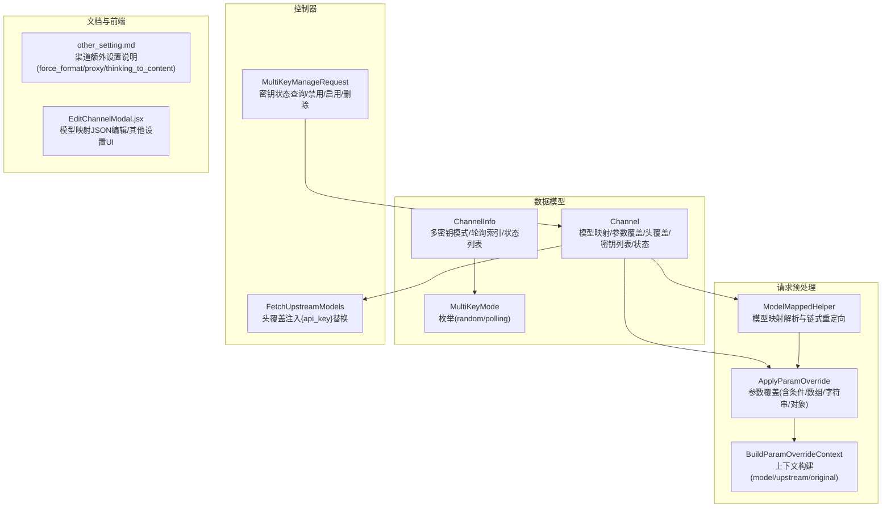
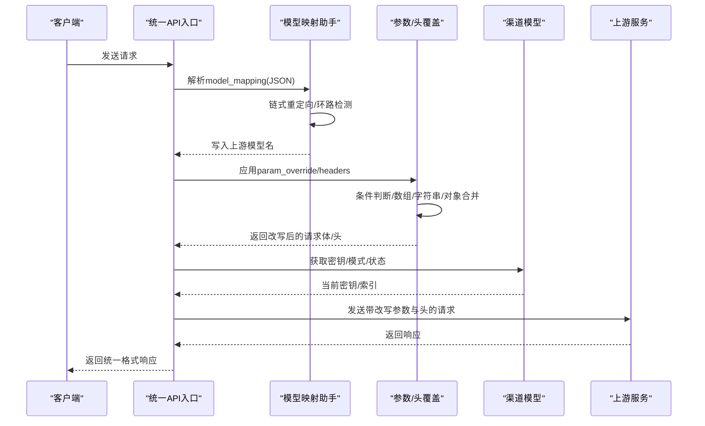
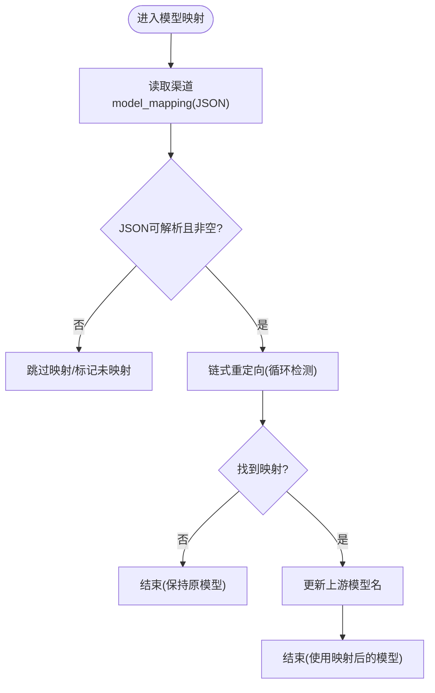
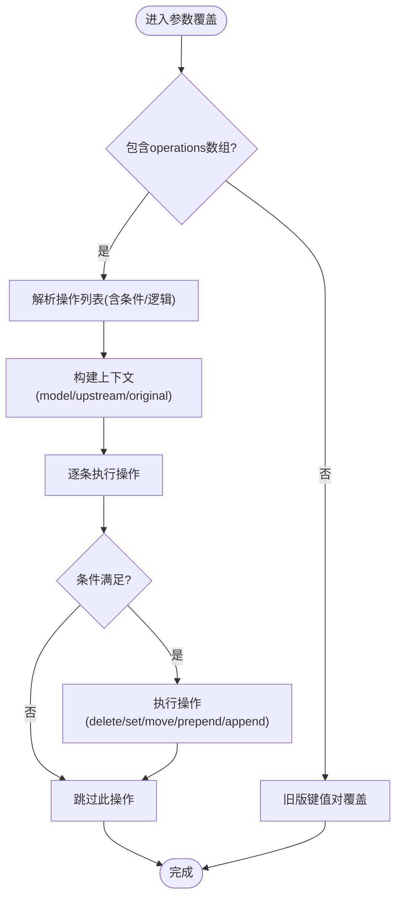
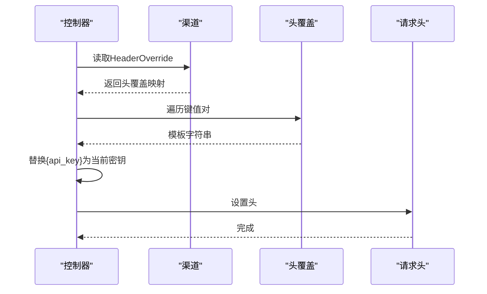
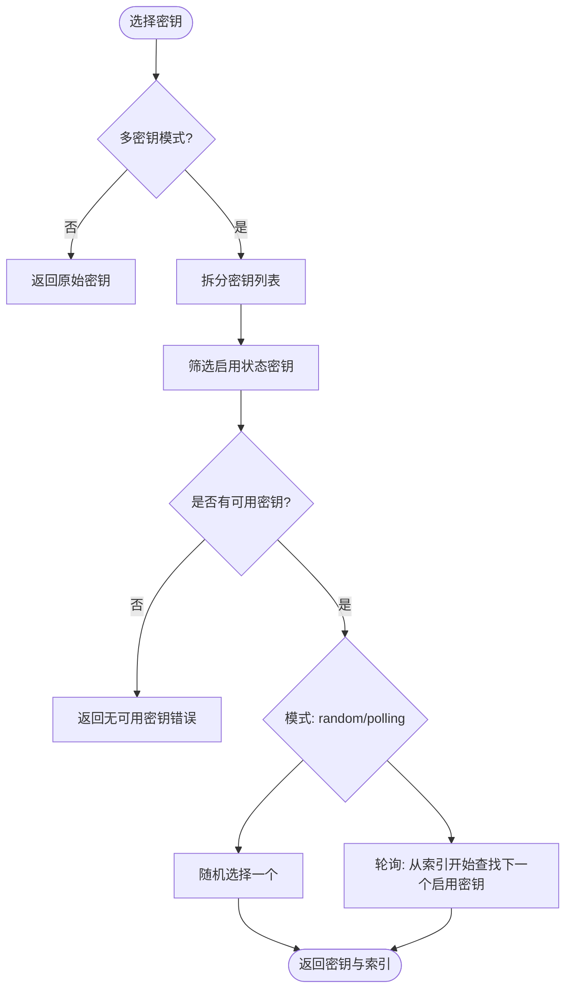
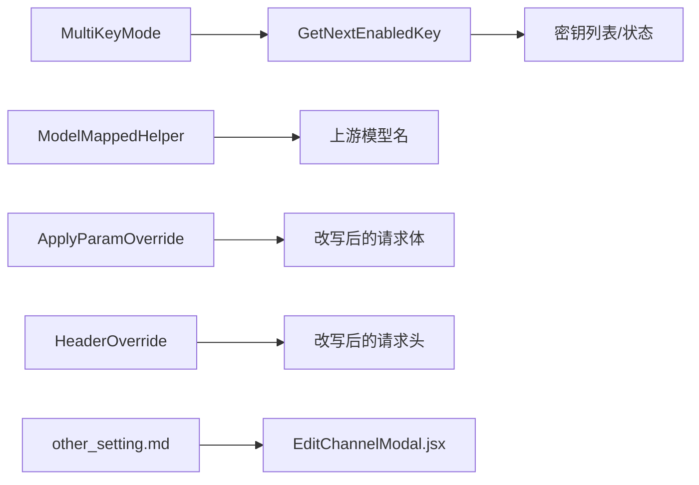

# 高级配置

<cite>
**本文引用的文件**
- [model/channel.go](file://model/channel.go)
- [constant/multi_key_mode.go](file://constant/multi_key_mode.go)
- [relay/helper/model_mapped.go](file://relay/helper/model_mapped.go)
- [relay/common/override.go](file://relay/common/override.go)
- [controller/channel.go](file://controller/channel.go)
- [dto/channel_settings.go](file://dto/channel_settings.go)
- [common/constants.go](file://common/constants.go)
- [docs/channel/other_setting.md](file://docs/channel/other_setting.md)
- [web/src/components/table/channels/modals/EditChannelModal.jsx](file://web/src/components/table/channels/modals/EditChannelModal.jsx)
</cite>

## 目录
1. [简介](#简介)
2. [项目结构](#项目结构)
3. [核心组件](#核心组件)
4. [架构总览](#架构总览)
5. [详细组件分析](#详细组件分析)
6. [依赖关系分析](#依赖关系分析)
7. [性能考量](#性能考量)
8. [故障排查指南](#故障排查指南)
9. [结论](#结论)
10. [附录](#附录)

## 简介
本文件面向渠道高级配置，围绕三大主题展开：
- 模型映射（Model Mapping）：通过JSON定义源模型到目标模型的转换规则，并在统一API接口中生效。
- 参数覆盖（Param Override）与请求头覆盖（Header Override）：提供灵活的请求体与请求头改写能力，支持条件判断、数组/字符串/对象合并等操作。
- 多密钥模式（Multi-Key Mode）：支持轮询（Polling）与随机（Random）两种模式，结合密钥状态管理实现高可用与弹性。

## 项目结构
与高级配置直接相关的模块分布如下：
- 数据模型与状态：渠道实体、密钥状态、模式常量
- 请求预处理：模型映射、参数/头覆盖应用
- 控制器：密钥状态查询与管理、请求头覆盖注入
- 文档与前端：渠道额外设置说明、编辑界面

图表来源
- [model/channel.go](file://model/channel.go#L1-L200)
- [constant/multi_key_mode.go](file://constant/multi_key_mode.go#L1-L9)
- [relay/helper/model_mapped.go](file://relay/helper/model_mapped.go#L1-L59)
- [relay/common/override.go](file://relay/common/override.go#L1-L483)
- [controller/channel.go](file://controller/channel.go#L177-L190)
- [docs/channel/other_setting.md](file://docs/channel/other_setting.md#L1-L34)
- [web/src/components/table/channels/modals/EditChannelModal.jsx](file://web/src/components/table/channels/modals/EditChannelModal.jsx#L488-L526)

章节来源
- [model/channel.go](file://model/channel.go#L1-L200)
- [constant/multi_key_mode.go](file://constant/multi_key_mode.go#L1-L9)
- [relay/helper/model_mapped.go](file://relay/helper/model_mapped.go#L1-L59)
- [relay/common/override.go](file://relay/common/override.go#L1-L483)
- [controller/channel.go](file://controller/channel.go#L177-L190)
- [docs/channel/other_setting.md](file://docs/channel/other_setting.md#L1-L34)
- [web/src/components/table/channels/modals/EditChannelModal.jsx](file://web/src/components/table/channels/modals/EditChannelModal.jsx#L488-L526)

## 核心组件
- 渠道模型与多密钥状态
  - 渠道实体包含模型映射、参数覆盖、头覆盖、密钥列表与状态；多密钥模式通过ChannelInfo定义。
- 模型映射
  - 在请求进入适配器前解析JSON映射，支持链式重定向与环路检测，最终将上游模型名写入RelayInfo。
- 参数覆盖与头覆盖
  - 参数覆盖支持多种操作（删除、设置、移动、前置/追加），并可按条件执行；头覆盖支持模板字符串，其中{api_key}会被替换为当前密钥。
- 多密钥模式
  - 支持随机与轮询两种模式；轮询模式使用ChannelInfo中的轮询索引，线程安全地遍历可用密钥；状态列表记录每个密钥的启用/禁用状态及原因。

章节来源
- [model/channel.go](file://model/channel.go#L1-L200)
- [relay/helper/model_mapped.go](file://relay/helper/model_mapped.go#L1-L59)
- [relay/common/override.go](file://relay/common/override.go#L1-L483)
- [controller/channel.go](file://controller/channel.go#L177-L190)
- [constant/multi_key_mode.go](file://constant/multi_key_mode.go#L1-L9)

## 架构总览
下面的序列图展示了“统一API接口”在请求到达时如何应用高级配置：

图表来源
- [relay/helper/model_mapped.go](file://relay/helper/model_mapped.go#L1-L59)
- [relay/common/override.go](file://relay/common/override.go#L1-L483)
- [controller/channel.go](file://controller/channel.go#L177-L190)
- [model/channel.go](file://model/channel.go#L105-L190)

## 详细组件分析

### 模型映射（Model Mapping）
- 配置位置与格式
  - 渠道实体包含模型映射字段，前端编辑界面支持以JSON形式输入映射表。
  - JSON键为源模型名，值为目标模型名；支持链式重定向（如A->B->C），并在环路时进行检测与处理。
- 执行流程
  - 在请求进入适配器前调用模型映射助手，读取渠道的映射JSON，解析为字典；随后根据映射链查找最终上游模型名，并写入RelayInfo。
- 统一API接口中的作用
  - 通过将上游模型名写入RelayInfo，后续适配器与上游对接均使用该名称，确保统一对外模型命名。

图表来源
- [relay/helper/model_mapped.go](file://relay/helper/model_mapped.go#L1-L59)
- [web/src/components/table/channels/modals/EditChannelModal.jsx](file://web/src/components/table/channels/modals/EditChannelModal.jsx#L488-L526)

章节来源
- [relay/helper/model_mapped.go](file://relay/helper/model_mapped.go#L1-L59)
- [web/src/components/table/channels/modals/EditChannelModal.jsx](file://web/src/components/table/channels/modals/EditChannelModal.jsx#L488-L526)

### 参数覆盖（Param Override）
- 配置与语法
  - 渠道实体包含参数覆盖字段，支持两种方式：
    - 旧版：直接键值对覆盖。
    - 新版：以“operations”数组形式描述复杂操作，支持删除、设置、移动、前置/追加等模式，并可配合条件（包含/前缀/后缀/数值比较/逻辑AND/OR）与上下文（model/upstream_model/original_model）。
- 上下文构建
  - 构建上下文时优先使用上游模型名，否则回退到原始模型名，便于条件判断。
- 负数索引与数组/字符串/对象操作
  - 支持在路径中使用负数索引（自动转为正向索引），并对数组、字符串、对象分别提供前置/追加与对象合并策略。
- 使用场景
  - 强制添加系统提示词（通过设置或移动）、修改请求超时时间（通过设置）、在数组头部/尾部插入参数、合并对象字段等。

图表来源
- [relay/common/override.go](file://relay/common/override.go#L1-L483)

章节来源
- [relay/common/override.go](file://relay/common/override.go#L1-L483)

### 请求头覆盖（Header Override）
- 配置与语法
  - 渠道实体包含头覆盖字段，键为HTTP头名，值为字符串模板；当模板中包含{api_key}时，会在注入时替换为当前使用的密钥。
- 注入时机
  - 在获取上游模型列表等流程中，会读取头覆盖并进行替换，然后设置到请求头中。
- 使用场景
  - 为某些平台注入鉴权头（如Authorization），或在需要动态替换密钥的场景中使用。

图表来源
- [controller/channel.go](file://controller/channel.go#L177-L190)

章节来源
- [controller/channel.go](file://controller/channel.go#L177-L190)

### 多密钥模式（Multi-Key Mode）
- 模式定义
  - 支持随机（random）与轮询（polling）两种模式，模式类型由常量定义。
- 密钥选择逻辑
  - 若非多密钥模式，直接返回原始密钥。
  - 多密钥模式下：
    - 随机：从可用密钥中随机挑选。
    - 轮询：基于ChannelInfo中的轮询索引，线程安全地遍历可用密钥，更新下一次索引。
- 状态管理
  - 通过状态列表记录每个密钥的启用/禁用状态、禁用原因与时间；当全部密钥被禁用时，渠道整体状态也会被置为自动禁用。
- 适用场景
  - 高可用：当某密钥触发限流或错误时，轮询能自动切换到下一个可用密钥；随机适合负载分散。
  - 可运维：通过管理接口查看/禁用/启用单个密钥，便于快速定位问题。

图表来源
- [model/channel.go](file://model/channel.go#L105-L190)
- [constant/multi_key_mode.go](file://constant/multi_key_mode.go#L1-L9)

章节来源
- [model/channel.go](file://model/channel.go#L105-L190)
- [constant/multi_key_mode.go](file://constant/multi_key_mode.go#L1-L9)

## 依赖关系分析
- 渠道模型依赖多密钥模式常量，用于选择密钥策略。
- 模型映射与参数覆盖共同作用于请求预处理阶段，前者决定上游模型名，后者改写请求体与头。
- 头覆盖在控制器阶段注入，确保上游认证正确。
- 前端编辑界面支持模型映射JSON编辑与渠道额外设置（force_format/proxy/thinking_to_content）。

图表来源
- [constant/multi_key_mode.go](file://constant/multi_key_mode.go#L1-L9)
- [model/channel.go](file://model/channel.go#L105-L190)
- [relay/helper/model_mapped.go](file://relay/helper/model_mapped.go#L1-L59)
- [relay/common/override.go](file://relay/common/override.go#L1-L483)
- [controller/channel.go](file://controller/channel.go#L177-L190)
- [docs/channel/other_setting.md](file://docs/channel/other_setting.md#L1-L34)
- [web/src/components/table/channels/modals/EditChannelModal.jsx](file://web/src/components/table/channels/modals/EditChannelModal.jsx#L488-L526)

章节来源
- [constant/multi_key_mode.go](file://constant/multi_key_mode.go#L1-L9)
- [model/channel.go](file://model/channel.go#L105-L190)
- [relay/helper/model_mapped.go](file://relay/helper/model_mapped.go#L1-L59)
- [relay/common/override.go](file://relay/common/override.go#L1-L483)
- [controller/channel.go](file://controller/channel.go#L177-L190)
- [docs/channel/other_setting.md](file://docs/channel/other_setting.md#L1-L34)
- [web/src/components/table/channels/modals/EditChannelModal.jsx](file://web/src/components/table/channels/modals/EditChannelModal.jsx#L488-L526)

## 性能考量
- 模型映射
  - 链式重定向与环路检测在请求路径上开销极小，建议仅在必要时启用映射。
- 参数覆盖
  - 复杂条件与多次数组/字符串/对象操作可能带来额外CPU开销；建议尽量简化条件与操作数量。
- 多密钥模式
  - 轮询模式使用通道级锁，避免并发冲突；随机模式每次随机选择，适合低延迟场景。
- 头覆盖
  - 头覆盖注入为简单字符串替换，开销很小。

## 故障排查指南
- 模型映射
  - 症状：请求模型名未按预期变化。
  - 排查：确认JSON映射是否可解析、是否存在环路、链式重定向是否正确。
- 参数覆盖
  - 症状：覆盖未生效或条件误判。
  - 排查：检查条件模式（包含/前缀/后缀/数值比较/逻辑AND/OR）、路径是否正确、上下文字段是否包含（model/upstream_model/original_model）。
- 头覆盖
  - 症状：上游认证失败。
  - 排查：确认头覆盖模板中{api_key}是否被正确替换为当前密钥。
- 多密钥模式
  - 症状：频繁切换密钥或全部不可用。
  - 排查：查看密钥状态列表（启用/手动禁用/自动禁用）、禁用原因与时间；轮询索引是否异常；随机模式下是否出现可用密钥为空的情况。

章节来源
- [relay/helper/model_mapped.go](file://relay/helper/model_mapped.go#L1-L59)
- [relay/common/override.go](file://relay/common/override.go#L1-L483)
- [controller/channel.go](file://controller/channel.go#L177-L190)
- [model/channel.go](file://model/channel.go#L570-L606)

## 结论
- 模型映射、参数覆盖与头覆盖构成了统一API接口的“请求预处理层”，能够灵活适配多厂商上游差异。
- 多密钥模式与状态管理保障了高可用与可运维性，结合轮询与随机策略可满足不同SLA需求。
- 建议在生产环境中：
  - 明确各渠道的模型映射与覆盖策略，避免过度复杂化。
  - 使用头覆盖时严格管理{api_key}替换，防止泄露。
  - 对多密钥渠道定期巡检密钥状态，及时处置自动禁用。

## 附录
- 渠道额外设置（force_format/proxy/thinking_to_content）参考文档与前端界面说明。

章节来源
- [docs/channel/other_setting.md](file://docs/channel/other_setting.md#L1-L34)
- [web/src/components/table/channels/modals/EditChannelModal.jsx](file://web/src/components/table/channels/modals/EditChannelModal.jsx#L488-L526)
- [dto/channel_settings.go](file://dto/channel_settings.go#L1-L42)