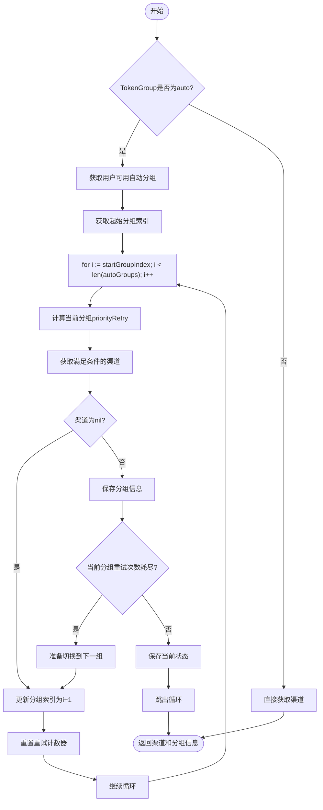
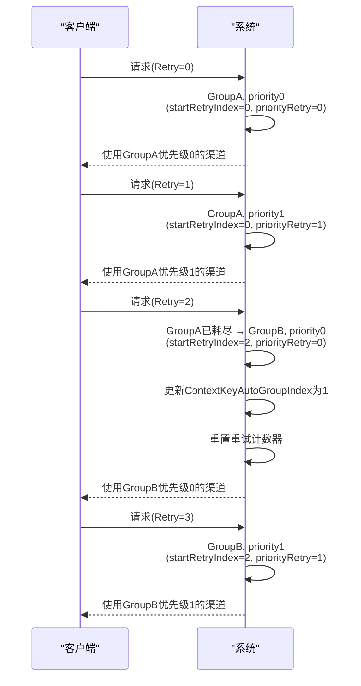

# 优先级重试机制

<cite>
**本文档引用的文件**
- [channel_select.go](file://service/channel_select.go)
- [context_key.go](file://constant/context_key.go)
- [auto_group.go](file://setting/auto_group.go)
</cite>

## 目录
1. [简介](#简介)
2. [核心组件分析](#核心组件分析)
3. [优先级重试机制详解](#优先级重试机制详解)
4. [分组切换状态跟踪](#分组切换状态跟踪)
5. [跨分组重试流程](#跨分组重试流程)
6. [示例流程分析](#示例流程分析)
7. [resetNextTry标志位作用](#resetnexttry标志位作用)

## 简介
本文档深入解析负载均衡中的优先级重试机制，重点说明RetryParam结构体中Retry字段的递增逻辑，以及如何通过ContextKeyAutoGroupIndex和ContextKeyAutoGroupRetryIndex跟踪分组切换状态。文档将详细解释在CacheGetRandomSatisfiedChannel函数中，当启用跨分组重试时，系统如何按优先级顺序遍历自动分组（auto groups），并结合示例流程说明从GroupA到GroupB的平滑切换过程。

**Section sources**
- [channel_select.go](file://service/channel_select.go#L48-L162)

## 核心组件分析

### RetryParam结构体
RetryParam结构体是优先级重试机制的核心数据结构，包含重试相关的上下文信息和状态。

```go
type RetryParam struct {
	Ctx          *gin.Context
	TokenGroup   string
	ModelName    string
	Retry        *int
	resetNextTry bool
}
```

该结构体提供了GetRetry、SetRetry、IncreaseRetry和ResetRetryNextTry等方法来管理重试状态。

**Section sources**
- [channel_select.go](file://service/channel_select.go#L14-L20)

### 上下文键定义
系统定义了多个上下文键用于跟踪重试状态和分组信息。

```go
ContextKeyAutoGroup           ContextKey = "auto_group"
ContextKeyAutoGroupIndex      ContextKey = "auto_group_index"
ContextKeyAutoGroupRetryIndex ContextKey = "auto_group_retry_index"
```

这些键用于在请求上下文中存储和检索分组状态信息。

**Section sources**
- [context_key.go](file://constant/context_key.go#L41-L43)

## 优先级重试机制详解

### Retry字段递增逻辑
Retry字段的递增逻辑由IncreaseRetry方法实现，该方法会检查resetNextTry标志位，如果为true则重置标志位并返回，否则递增Retry值。

```go
func (p *RetryParam) IncreaseRetry() {
	if p.resetNextTry {
		p.resetNextTry = false
		return
	}
	if p.Retry == nil {
		p.Retry = new(int)
	}
	*p.Retry++
}
```

这种设计允许在特定条件下重置重试计数器，实现更灵活的重试策略。

**Section sources**
- [channel_select.go](file://service/channel_select.go#L33-L42)

### priorityRetry计算方式
priorityRetry的计算方式为`priorityRetry = Retry - startRetryIndex`，表示当前分组内的优先级级别。这个计算方式确保了在切换到新分组时，优先级计数从0开始。

```go
priorityRetry := param.GetRetry()
if i > startGroupIndex {
	priorityRetry = 0
}
```

当切换到新的自动分组时，系统会重置priorityRetry为0，确保从该分组的最高优先级开始尝试。

**Section sources**
- [channel_select.go](file://service/channel_select.go#L110-L115)

## 分组切换状态跟踪

### ContextKeyAutoGroupIndex
ContextKeyAutoGroupIndex用于跟踪当前分组索引，系统通过该键在请求上下文中记录当前正在使用的自动分组索引。

```go
if lastGroupIndex, exists := common.GetContextKey(param.Ctx, constant.ContextKeyAutoGroupIndex); exists {
	if idx, ok := lastGroupIndex.(int); ok {
		startGroupIndex = idx
	}
}
```

当需要切换到下一个分组时，系统会更新该索引值。

**Section sources**
- [channel_select.go](file://service/channel_select.go#L100-L104)

### ContextKeyAutoGroupRetryIndex
ContextKeyAutoGroupRetryIndex用于跟踪当前分组开始时的全局重试次数。虽然在当前代码中未直接使用，但该键的设计意图是记录分组切换时的重试基准值，用于计算分组内的相对重试次数。

**Section sources**
- [context_key.go](file://constant/context_key.go#L43)

## 跨分组重试流程

### CacheGetRandomSatisfiedChannel函数
CacheGetRandomSatisfiedChannel函数实现了跨分组重试的核心逻辑，当启用跨分组重试时，系统会按优先级顺序遍历自动分组。



**Diagram sources**
- [channel_select.go](file://service/channel_select.go#L89-L154)

**Section sources**
- [channel_select.go](file://service/channel_select.go#L89-L154)

## 示例流程分析

### 从GroupA到GroupB的平滑切换
以下示例展示了从GroupA到GroupB的平滑切换过程，假设有2个分组，每个分组有2个优先级，RetryTimes=3：



**Diagram sources**
- [channel_select.go](file://service/channel_select.go#L72-L82)

**Section sources**
- [channel_select.go](file://service/channel_select.go#L72-L82)

## resetNextTry标志位作用

### 标志位功能
resetNextTry标志位用于控制下一次重试时是否重置重试计数器。当该标志位为true时，IncreaseRetry方法会将其重置为false并立即返回，不递增重试次数。

```go
func (p *RetryParam) IncreaseRetry() {
	if p.resetNextTry {
		p.resetNextTry = false
		return
	}
	// 递增重试次数
}
```

### 使用场景
该标志位在以下场景中被使用：

1. 当当前分组已耗尽所有重试次数，准备切换到下一个分组时
2. 当需要在不增加重试次数的情况下进行下一次尝试时

```go
if crossGroupRetry && priorityRetry >= common.RetryTimes {
	// 准备切换到下一组
	common.SetContextKey(param.Ctx, constant.ContextKeyAutoGroupIndex, i+1)
	param.SetRetry(0)
	param.ResetRetryNextTry()
} else {
	// 保持在当前分组
	common.SetContextKey(param.Ctx, constant.ContextKeyAutoGroupIndex, i)
}
```

**Section sources**
- [channel_select.go](file://service/channel_select.go#L33-L37)
- [channel_select.go](file://service/channel_select.go#L147)