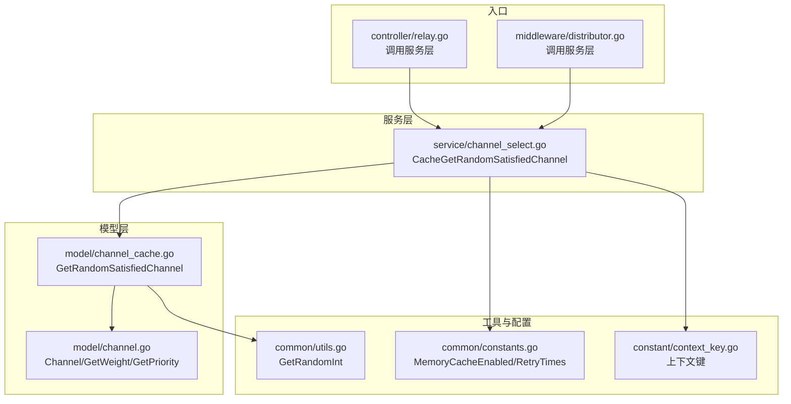
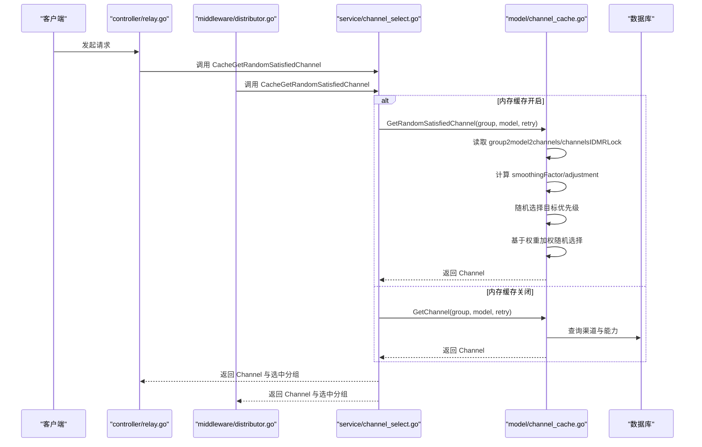
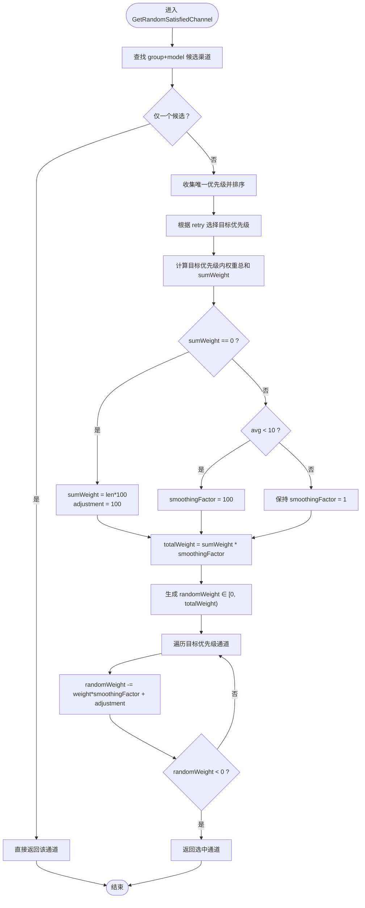
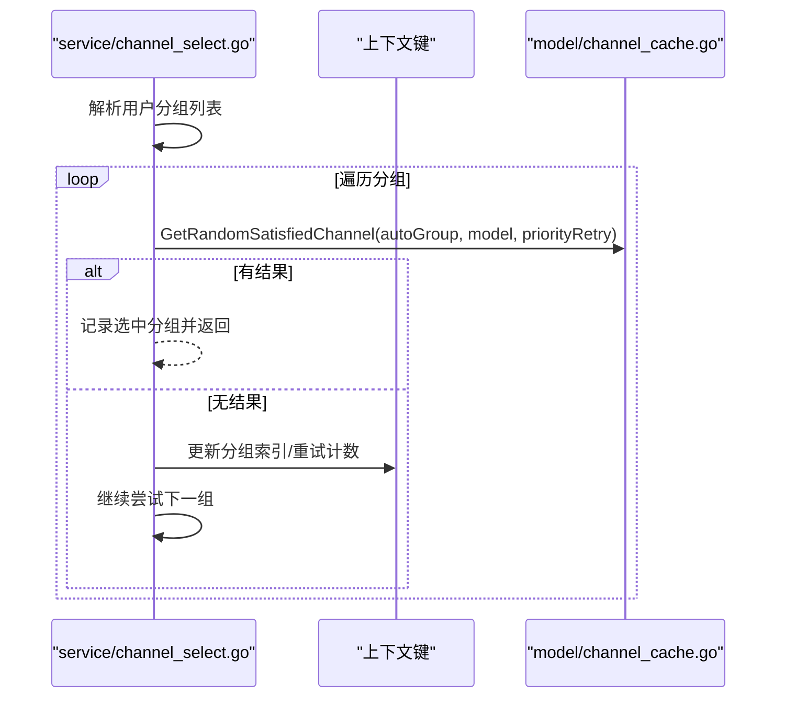
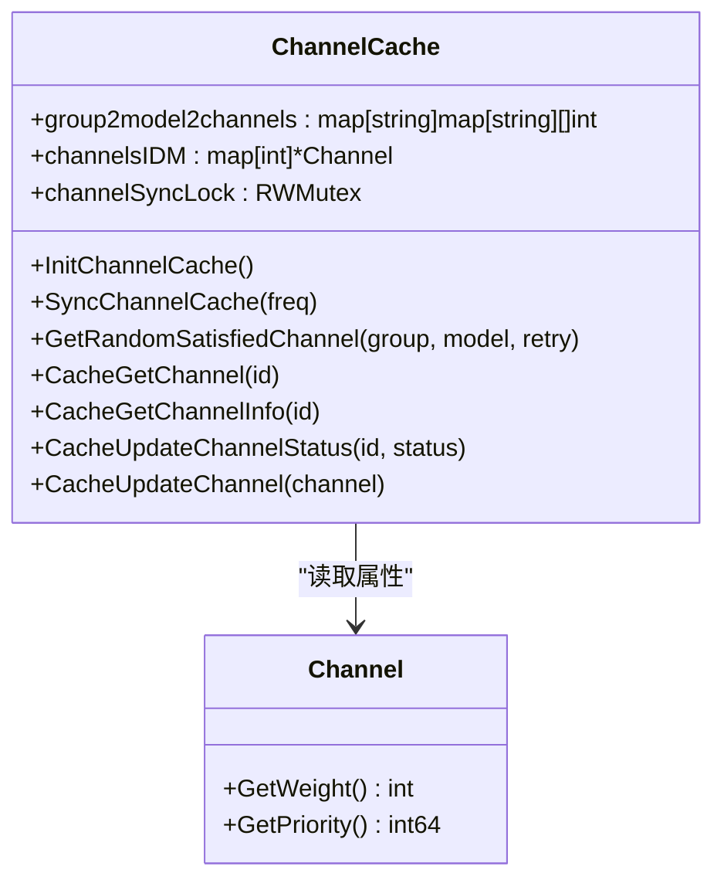
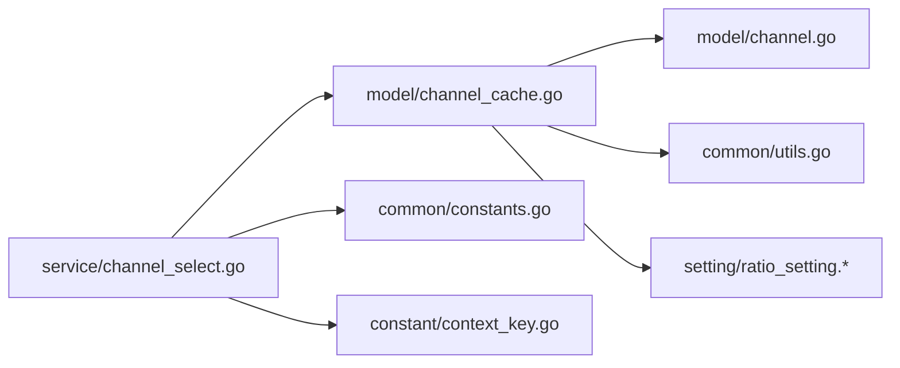

# 基于权重的随机选择算法

<cite>
**本文引用的文件**
- [model/channel_cache.go](file://model/channel_cache.go)
- [service/channel_select.go](file://service/channel_select.go)
- [model/channel.go](file://model/channel.go)
- [common/utils.go](file://common/utils.go)
- [common/constants.go](file://common/constants.go)
- [constant/context_key.go](file://constant/context_key.go)
- [controller/relay.go](file://controller/relay.go)
- [middleware/distributor.go](file://middleware/distributor.go)
</cite>

## 目录
1. [简介](#简介)
2. [项目结构与入口](#项目结构与入口)
3. [核心组件](#核心组件)
4. [架构总览](#架构总览)
5. [详细组件分析](#详细组件分析)
6. [依赖关系分析](#依赖关系分析)
7. [性能考量](#性能考量)
8. [故障排查指南](#故障排查指南)
9. [结论](#结论)

## 简介
本文件围绕 GetRandomSatisfiedChannel 函数所实现的“加权随机选择算法”进行深入解析，重点说明：
- 渠道权重（Weight）字段如何影响选择概率；
- 平滑因子（smoothing factor）与调整值（adjustment value）在动态权重计算中的作用机制；
- 当所有渠道权重为零时系统的降级处理策略（如轮询或随机选择）；
- 结合 channel_cache.go 中的内存缓存机制，解释读写锁控制下的并发安全实现；
- 提供性能优化建议，包括缓存同步策略与热点数据预加载。

## 项目结构与入口
- 服务层通过 CacheGetRandomSatisfiedChannel 统一调度自动分组与重试逻辑，最终调用模型层的 GetRandomSatisfiedChannel 完成具体的选择。
- 模型层在内存缓存开启时，从 group2model2channels、channelsIDM 等结构中按优先级与权重进行加权随机选择；在关闭时回退到数据库直连路径。
- 工具层提供随机数生成与系统常量配置，上下文键用于跨请求传递自动分组与重试状态。

图表来源
- [service/channel_select.go](file://service/channel_select.go#L82-L162)
- [model/channel_cache.go](file://model/channel_cache.go#L96-L191)
- [model/channel.go](file://model/channel.go#L406-L418)
- [common/utils.go](file://common/utils.go#L261-L264)
- [common/constants.go](file://common/constants.go#L71-L110)
- [constant/context_key.go](file://constant/context_key.go#L1-L59)
- [controller/relay.go](file://controller/relay.go#L234-L234)
- [middleware/distributor.go](file://middleware/distributor.go#L99-L99)

章节来源
- [service/channel_select.go](file://service/channel_select.go#L82-L162)
- [model/channel_cache.go](file://model/channel_cache.go#L96-L191)
- [model/channel.go](file://model/channel.go#L406-L418)
- [common/utils.go](file://common/utils.go#L261-L264)
- [common/constants.go](file://common/constants.go#L71-L110)
- [constant/context_key.go](file://constant/context_key.go#L1-L59)
- [controller/relay.go](file://controller/relay.go#L234-L234)
- [middleware/distributor.go](file://middleware/distributor.go#L99-L99)

## 核心组件
- 加权随机选择算法（GetRandomSatisfiedChannel）
  - 在内存缓存开启时，从 group2model2channels 与 channelsIDM 中读取，按优先级分层，再对同层渠道按权重进行加权随机选择。
  - 权重字段 Weight 通过 Channel.GetWeight() 获取，作为概率分布的基础。
  - 平滑因子 smoothingFactor 与调整值 smoothingAdjustment 用于在权重过低或全零时稳定分布。
- 自动分组与重试（CacheGetRandomSatisfiedChannel）
  - 支持“auto”分组，按用户分组顺序逐个尝试，优先级由 retry 参数决定；当某分组优先级耗尽时切换到下一组。
  - 通过上下文键维护当前分组索引与重试计数，支持跨分组重试策略。
- 内存缓存与并发控制（channel_cache.go）
  - 使用 RWMutex 保护 group2model2channels 与 channelsIDM 的读写，保证高并发场景下的线程安全。
  - 提供周期性同步与状态更新接口，确保缓存与数据库一致。
- 工具与配置
  - GetRandomInt 提供随机数生成；MemoryCacheEnabled 控制是否启用内存缓存；RetryTimes 控制跨分组重试上限。

章节来源
- [model/channel_cache.go](file://model/channel_cache.go#L96-L191)
- [service/channel_select.go](file://service/channel_select.go#L82-L162)
- [model/channel.go](file://model/channel.go#L406-L418)
- [common/utils.go](file://common/utils.go#L261-L264)
- [common/constants.go](file://common/constants.go#L71-L110)
- [constant/context_key.go](file://constant/context_key.go#L1-L59)

## 架构总览
下面的序列图展示了从控制器到服务层再到模型层的完整调用链，以及在内存缓存开启与关闭两种路径下的差异。

图表来源
- [controller/relay.go](file://controller/relay.go#L234-L234)
- [middleware/distributor.go](file://middleware/distributor.go#L99-L99)
- [service/channel_select.go](file://service/channel_select.go#L82-L162)
- [model/channel_cache.go](file://model/channel_cache.go#L96-L191)

## 详细组件分析

### 加权随机选择算法（GetRandomSatisfiedChannel）
- 输入与过滤
  - 首先根据 group 与 model 查找候选渠道集合；若无精确匹配则尝试标准化后的模型名。
  - 若仅有一个候选，直接返回该渠道。
  - 收集候选渠道的唯一优先级并排序，依据 retry 参数确定目标优先级。
- 权重聚合与平滑
  - 对目标优先级内的所有渠道求和权重 sumWeight。
  - 若 sumWeight == 0：将 sumWeight 设为“通道数 × 100”，并将 smoothingAdjustment 设为 100，使每个通道的有效权重相等，实现均匀随机。
  - 若平均权重小于阈值（sumWeight/len(targetChannels) < 10）：将 smoothingFactor 设为 100，进一步拉平分布。
- 随机选择
  - 计算 totalWeight = sumWeight × smoothingFactor。
  - 生成随机数 randomWeight ∈ [0, totalWeight)。
  - 遍历目标优先级内的通道，累计减去“通道权重×smoothingFactor + smoothingAdjustment”，当累计值首次小于 0 时，即为选中通道。
- 降级策略
  - 当所有通道权重均为 0 时，采用“每通道有效权重=100”的策略，确保公平性与可选性。
  - 当平均权重过低时，通过增大 smoothingFactor 实现“近似均匀”分布，避免极端偏斜。

图表来源
- [model/channel_cache.go](file://model/channel_cache.go#L96-L191)

章节来源
- [model/channel_cache.go](file://model/channel_cache.go#L96-L191)

### 平滑因子与调整值的作用机制
- smoothingFactor
  - 默认为 1；当平均权重过低时提升至 100，以拉平分布，避免权重极小导致的偏差。
- smoothingAdjustment
  - 默认为 0；当 sumWeight == 0 时设为 100，使每通道有效权重相等，实现均匀随机。
- 总体效果
  - 在权重缺失或过低时，系统自动“降级”为近似均匀选择，保障用户体验与公平性。

章节来源
- [model/channel_cache.go](file://model/channel_cache.go#L162-L174)

### 权重字段（Weight）对选择概率的影响
- 权重来源于 Channel.GetWeight()，作为概率分布的权重基础。
- 选中概率与权重成正比：权重越大，被选中的机会越高。
- 当 sumWeight == 0 或平均权重过低时，系统通过平滑因子与调整值进行补偿，使分布更均衡。

章节来源
- [model/channel.go](file://model/channel.go#L406-L418)
- [model/channel_cache.go](file://model/channel_cache.go#L145-L188)

### 自动分组与重试（CacheGetRandomSatisfiedChannel）
- “auto”分组
  - 根据用户所属分组顺序依次尝试，优先级由 retry 参数决定。
  - 当某分组在当前优先级下无可选通道时，切换到下一组；同时通过上下文键维护当前分组索引与重试计数。
- 跨分组重试
  - 当开启跨分组重试且达到重试上限时，为下一次重试准备切换到下一组。
- 返回值
  - 返回选中的 Channel 与实际选中分组，便于后续统计与日志记录。

图表来源
- [service/channel_select.go](file://service/channel_select.go#L82-L162)
- [constant/context_key.go](file://constant/context_key.go#L41-L44)

章节来源
- [service/channel_select.go](file://service/channel_select.go#L82-L162)
- [constant/context_key.go](file://constant/context_key.go#L41-L44)

### 内存缓存与并发安全（channel_cache.go）
- 缓存结构
  - group2model2channels：按分组与模型组织的渠道ID列表（仅启用状态的渠道）。
  - channelsIDM：按ID映射的完整渠道对象（包含禁用渠道），用于读取权重、优先级等属性。
- 并发控制
  - 初始化与更新时使用写锁（Lock）保护，确保结构替换与字段迁移期间的原子性。
  - 读取时使用读锁（RLock）保护，允许多个读操作并发执行，降低锁竞争。
- 同步策略
  - 提供周期性同步函数，定时从数据库重建缓存，保证缓存与数据库一致。
  - 状态变更（如启用/禁用）时，及时从 group2model2channels 中剔除或更新对应条目。
- 多Key轮询
  - 对多Key模式的轮询索引进行独立管理，避免并发冲突。

图表来源
- [model/channel_cache.go](file://model/channel_cache.go#L1-L86)
- [model/channel_cache.go](file://model/channel_cache.go#L96-L191)
- [model/channel.go](file://model/channel.go#L406-L418)

章节来源
- [model/channel_cache.go](file://model/channel_cache.go#L1-L86)
- [model/channel_cache.go](file://model/channel_cache.go#L96-L191)
- [model/channel.go](file://model/channel.go#L406-L418)

### 降级处理策略（权重为零时）
- 当 sumWeight == 0：
  - 将 sumWeight 设为“通道数 × 100”，并设置 smoothingAdjustment = 100，使每个通道的有效权重相等，实现均匀随机选择。
- 当平均权重过低（avg < 10）：
  - 将 smoothingFactor 提升至 100，进一步拉平分布，避免极端偏斜。
- 行为特征
  - 即使所有渠道权重为零，系统也能保证至少有一个可选通道，避免完全不可用的情况。
  - 该策略适用于新部署或权重尚未配置完成的场景。

章节来源
- [model/channel_cache.go](file://model/channel_cache.go#L162-L174)

## 依赖关系分析
- 服务层依赖
  - service/channel_select.go 依赖 model/channel_cache.go 进行选择；依赖 common/constants.go 读取配置；依赖 constant/context_key.go 读写上下文键。
- 模型层依赖
  - model/channel_cache.go 依赖 model/channel.go 获取权重与优先级；依赖 common/utils.go 生成随机数；依赖 setting/ratio_setting（在模型名标准化时使用）。
- 工具与配置
  - common/utils.go 提供随机数生成；common/constants.go 提供内存缓存开关与重试上限；constant/context_key.go 提供上下文键常量。

图表来源
- [service/channel_select.go](file://service/channel_select.go#L82-L162)
- [model/channel_cache.go](file://model/channel_cache.go#L96-L191)
- [model/channel.go](file://model/channel.go#L406-L418)
- [common/utils.go](file://common/utils.go#L261-L264)
- [common/constants.go](file://common/constants.go#L71-L110)
- [constant/context_key.go](file://constant/context_key.go#L1-L59)

章节来源
- [service/channel_select.go](file://service/channel_select.go#L82-L162)
- [model/channel_cache.go](file://model/channel_cache.go#L96-L191)
- [model/channel.go](file://model/channel.go#L406-L418)
- [common/utils.go](file://common/utils.go#L261-L264)
- [common/constants.go](file://common/constants.go#L71-L110)
- [constant/context_key.go](file://constant/context_key.go#L1-L59)

## 性能考量
- 缓存同步策略
  - 使用 RWMutex 降低读写竞争：读多写少场景下，读锁允许并发读取，显著提升吞吐。
  - 周期性同步（SyncChannelCache）与增量更新相结合，减少全量重建频率，降低抖动。
- 热点数据预加载
  - 对高频模型与分组，可在启动阶段或定时任务中预热 group2model2channels 与 channelsIDM，缩短首次命中延迟。
- 随机数与分布
  - GetRandomInt 为轻量级随机数生成，适合高频选择场景；平滑因子与调整值在权重异常时自动生效，避免额外开销。
- 锁粒度与范围
  - 读取阶段仅持有读锁，写入阶段持有写锁；尽量缩短写锁持有时间，避免阻塞读路径。
- 多Key轮询
  - 对多Key模式的轮询索引进行独立管理，避免全局锁竞争，提高并发吞吐。

[本节为通用性能建议，不直接分析具体文件，故无章节来源]

## 故障排查指南
- 现象：选择结果不符合预期（权重未生效）
  - 检查 Channel.Weight 是否正确设置；确认内存缓存已启用且缓存已同步。
  - 观察 smoothingFactor/adjustment 是否被触发（sumWeight==0 或 avg<10）。
- 现象：所有渠道权重为零
  - 系统会自动降级为“每通道有效权重=100”的均匀随机；可通过调整权重或等待缓存同步恢复加权分布。
- 现象：跨分组重试未生效
  - 检查上下文键 ContextKeyAutoGroupIndex 与 ContextKeyAutoGroupRetryIndex 是否正确设置；确认 RetryTimes 配置。
- 现象：多Key轮询异常
  - 检查多Key模式下的轮询索引是否被正确更新；关注 per-channel 锁的使用是否一致。

章节来源
- [model/channel_cache.go](file://model/channel_cache.go#L96-L191)
- [service/channel_select.go](file://service/channel_select.go#L82-L162)
- [constant/context_key.go](file://constant/context_key.go#L41-L44)
- [common/constants.go](file://common/constants.go#L108-L110)

## 结论
- GetRandomSatisfiedChannel 通过“优先级分层 + 权重加权 + 平滑因子/调整值”的组合，在保证公平性的同时兼顾了权重的表达力。
- 当权重缺失或过低时，系统自动降级为均匀随机，确保可用性与稳定性。
- 内存缓存与读写锁配合，提供了高并发下的高效选择能力；结合周期性同步与上下文键状态管理，实现了灵活的自动分组与重试策略。
- 建议在生产环境中启用内存缓存、合理设置权重、监控平均权重与降级触发情况，并对热点模型进行预热，以获得最佳性能与稳定性。