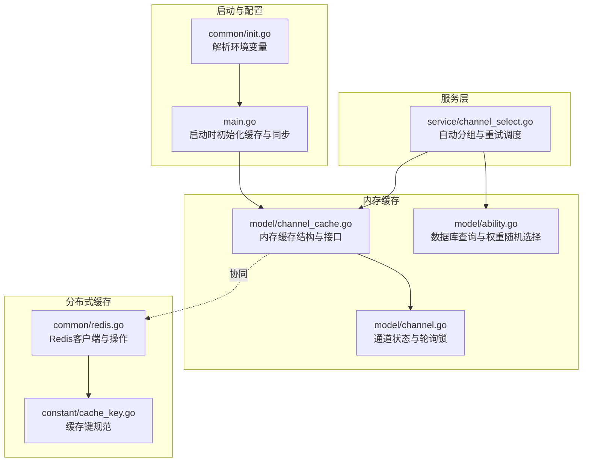
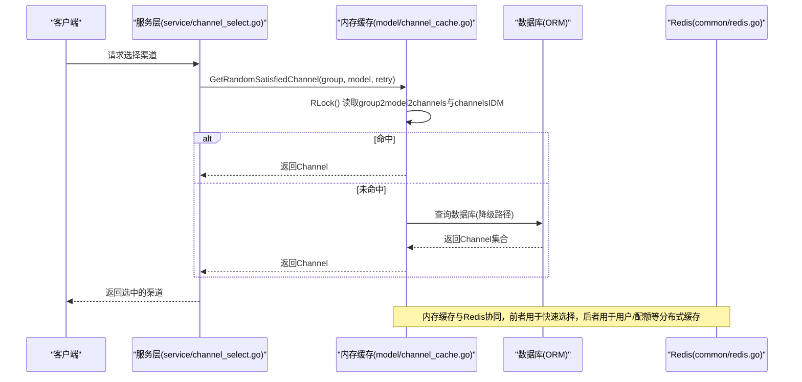
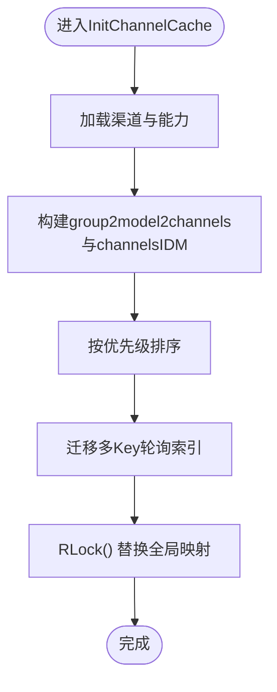
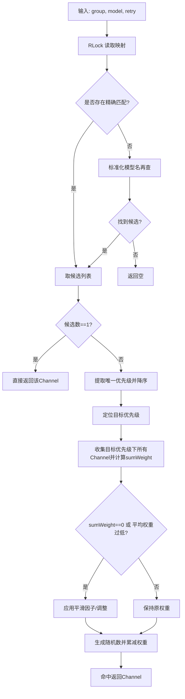
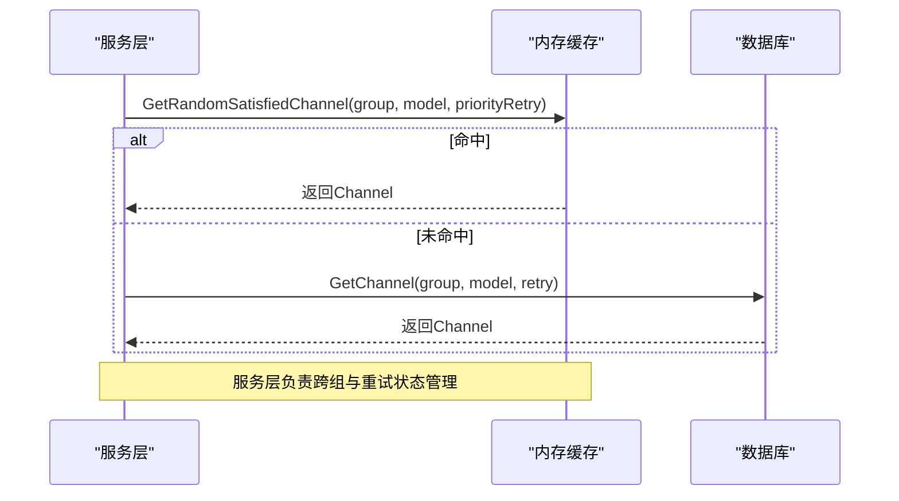
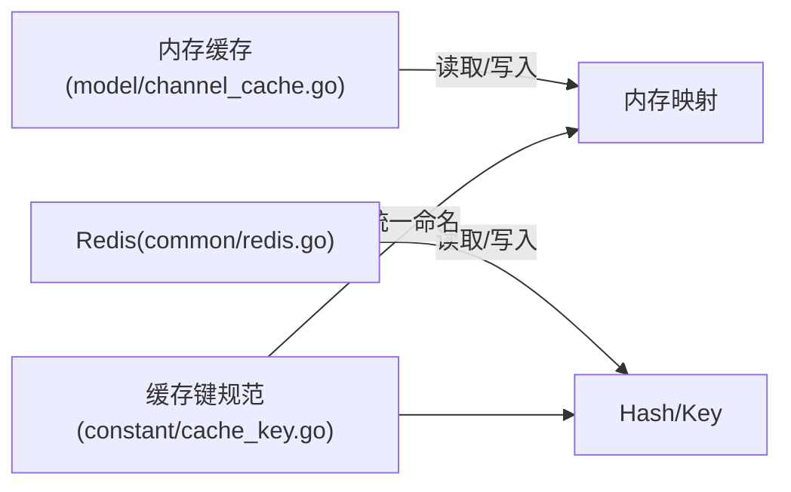
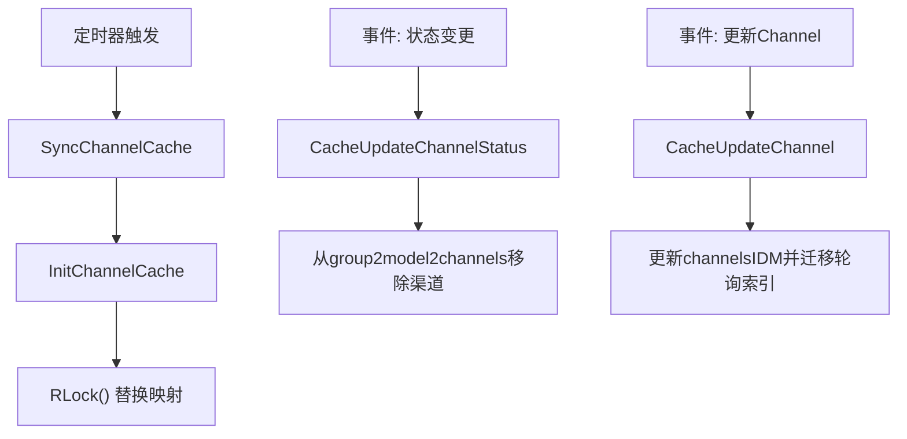
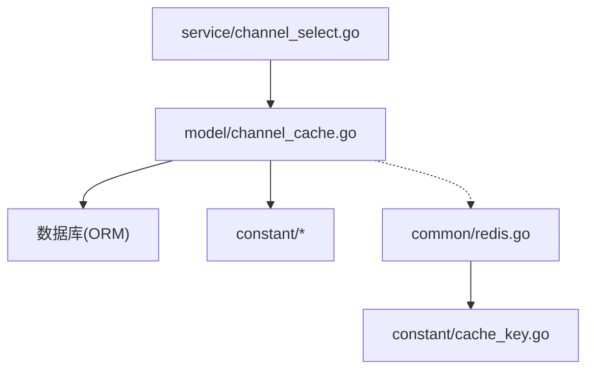

# 缓存机制与性能优化

<cite>
**本文引用的文件**
- [model/channel_cache.go](file://model/channel_cache.go)
- [service/channel_select.go](file://service/channel_select.go)
- [common/redis.go](file://common/redis.go)
- [common/init.go](file://common/init.go)
- [main.go](file://main.go)
- [model/channel.go](file://model/channel.go)
- [model/ability.go](file://model/ability.go)
- [setting/ratio_setting/cache_ratio.go](file://setting/ratio_setting/cache_ratio.go)
- [constant/cache_key.go](file://constant/cache_key.go)
- [constant/channel.go](file://constant/channel.go)
- [constant/multi_key_mode.go](file://constant/multi_key_mode.go)
</cite>

## 目录
1. [简介](#简介)
2. [项目结构](#项目结构)
3. [核心组件](#核心组件)
4. [架构总览](#架构总览)
5. [详细组件分析](#详细组件分析)
6. [依赖关系分析](#依赖关系分析)
7. [性能考量](#性能考量)
8. [故障排查指南](#故障排查指南)
9. [结论](#结论)
10. [附录](#附录)

## 简介
本文件聚焦于系统中的“通道（Channel）缓存”机制，围绕内存缓存结构、读写锁（RWMutex）的使用、缓存更新策略（定时刷新与事件驱动失效）、与Redis分布式缓存的协同工作、对GetRandomSatisfiedChannel性能的影响、命中率监控与防护措施，以及实际性能测试与调优建议进行系统化阐述。目标是帮助读者在高并发场景下理解并优化负载均衡与缓存命中效率。

## 项目结构
- 内存缓存位于model包，负责将数据库中的渠道能力映射到内存结构，并通过RWMutex保证并发安全。
- 服务层通过service包封装自动分组与重试逻辑，最终调用内存缓存选择合适的渠道。
- Redis作为分布式缓存，用于用户、配额等其他维度的缓存，与内存缓存互补。
- 启动阶段根据环境变量决定是否启用内存缓存，并按周期同步。

图表来源
- [common/init.go](file://common/init.go#L80-L113)
- [main.go](file://main.go#L56-L103)
- [model/channel_cache.go](file://model/channel_cache.go#L1-L266)
- [service/channel_select.go](file://service/channel_select.go#L1-L163)
- [model/ability.go](file://model/ability.go#L106-L144)
- [model/channel.go](file://model/channel.go#L534-L548)
- [common/redis.go](file://common/redis.go#L1-L328)
- [constant/cache_key.go](file://constant/cache_key.go#L1-L200)

章节来源
- [common/init.go](file://common/init.go#L80-L113)
- [main.go](file://main.go#L56-L103)
- [model/channel_cache.go](file://model/channel_cache.go#L1-L266)
- [service/channel_select.go](file://service/channel_select.go#L1-L163)
- [model/ability.go](file://model/ability.go#L106-L144)
- [model/channel.go](file://model/channel.go#L534-L548)
- [common/redis.go](file://common/redis.go#L1-L328)
- [constant/cache_key.go](file://constant/cache_key.go#L1-L200)

## 核心组件
- 内存缓存结构
  - group2model2channels：按分组与模型名维护可用渠道ID列表，排序依据优先级。
  - channelsIDM：按ID维护完整Channel对象，包含权重、优先级、多Key轮询索引等。
  - channelSyncLock：RWMutex，保护上述两个全局映射的并发访问与原子替换。
- 关键接口
  - InitChannelCache：从数据库加载并构建内存映射，支持多Key轮询索引迁移。
  - SyncChannelCache：按周期定时刷新。
  - GetRandomSatisfiedChannel：基于分组、模型与重试次数选择渠道，支持权重平滑与优先级分层。
  - CacheGetChannel/CacheGetChannelInfo：按ID读取缓存中的Channel或ChannelInfo。
  - CacheUpdateChannelStatus/CacheUpdateChannel：更新状态与对象，必要时删除对应映射项。
- 服务层接口
  - CacheGetRandomSatisfiedChannel：结合自动分组与跨组重试策略，逐优先级/分组选择渠道。

章节来源
- [model/channel_cache.go](file://model/channel_cache.go#L1-L266)
- [service/channel_select.go](file://service/channel_select.go#L48-L163)

## 架构总览
内存缓存与服务层、数据库的关系如下：

图表来源
- [service/channel_select.go](file://service/channel_select.go#L48-L163)
- [model/channel_cache.go](file://model/channel_cache.go#L96-L223)
- [model/ability.go](file://model/ability.go#L106-L144)
- [common/redis.go](file://common/redis.go#L1-L328)

## 详细组件分析

### 内存缓存结构与并发控制
- 结构设计
  - group2model2channels[group][model] -> []int：存储满足条件的渠道ID列表，按优先级降序排列。
  - channelsIDM[id] -> *Channel：完整渠道对象，包含权重、优先级、多Key模式与轮询索引等。
- 并发控制
  - 读路径：RLock，允许多个并发读取，避免阻塞。
  - 写路径：Lock，替换整个映射，保证原子性；同时在写入期间迁移多Key轮询索引，避免丢失状态。
- 初始化与定时刷新
  - InitChannelCache：从数据库加载渠道与能力，过滤禁用渠道，构建映射并排序。
  - SyncChannelCache：按周期睡眠后触发InitChannelCache，实现定时刷新。

图表来源
- [model/channel_cache.go](file://model/channel_cache.go#L21-L86)

章节来源
- [model/channel_cache.go](file://model/channel_cache.go#L1-L86)

### 渠道选择算法与权重平滑
- 选择流程
  - 首先按精确模型名查找，若无则尝试标准化后的模型名。
  - 若仅有一个候选，直接返回。
  - 若多个候选，提取唯一优先级并降序排列；根据retry定位目标优先级。
  - 在目标优先级内收集所有渠道，计算sumWeight与平滑因子/调整，再进行加权随机选择。
- 权重平滑
  - 当sumWeight为0或平均权重过低时，采用平滑策略提升公平性与稳定性。
- 性能影响
  - 读路径为常数时间复杂度O(1)（忽略排序），写路径为O(n log n)（排序）。
  - 加权随机选择为O(k)，k为目标优先级内的渠道数。

图表来源
- [model/channel_cache.go](file://model/channel_cache.go#L96-L191)

章节来源
- [model/channel_cache.go](file://model/channel_cache.go#L96-L191)

### 与服务层的协作
- 自动分组与跨组重试
  - 服务层根据上下文中的用户分组与自动分组配置，逐分组、逐优先级尝试选择渠道。
  - 当某分组优先级耗尽时，切换到下一组；重试计数器与上下文状态在跨组切换时正确维护。
- 与降级路径的关系
  - 若内存缓存不可用或未命中，服务层可回退到数据库查询（GetChannel）。

图表来源
- [service/channel_select.go](file://service/channel_select.go#L48-L163)
- [model/ability.go](file://model/ability.go#L106-L144)

章节来源
- [service/channel_select.go](file://service/channel_select.go#L48-L163)
- [model/ability.go](file://model/ability.go#L106-L144)

### 与Redis分布式缓存的协同
- Redis职责
  - 用户、配额等维度的分布式缓存，提供原子增减与哈希字段更新，保障一致性与性能。
- 协同方式
  - 内存缓存专注“渠道选择”的高性能读取；Redis负责用户态与业务态的分布式缓存。
  - 两者共享统一的缓存键规范与过期策略（由环境变量控制）。
- 键规范
  - 通过constant/cache_key.go定义统一的键前缀与命名规则，便于集中管理与失效。

图表来源
- [common/redis.go](file://common/redis.go#L1-L328)
- [constant/cache_key.go](file://constant/cache_key.go#L1-L200)

章节来源
- [common/redis.go](file://common/redis.go#L1-L328)
- [constant/cache_key.go](file://constant/cache_key.go#L1-L200)

### 更新策略与失效机制
- 定时刷新
  - SyncChannelCache按周期睡眠后调用InitChannelCache，实现定期同步。
- 事件驱动失效
  - CacheUpdateChannelStatus：当渠道状态非启用时，从group2model2channels中移除该渠道，达到“事件驱动失效”的效果。
  - CacheUpdateChannel：更新channelsIDM中的Channel对象，必要时保留多Key轮询索引。
- 启动与配置
  - main.go在启动时根据环境变量决定是否启用内存缓存，并设置同步频率。
  - common/init.go解析MEMORY_CACHE_ENABLED、SYNC_FREQUENCY等关键配置。

图表来源
- [model/channel_cache.go](file://model/channel_cache.go#L88-L116)
- [model/channel_cache.go](file://model/channel_cache.go#L225-L266)
- [main.go](file://main.go#L56-L103)
- [common/init.go](file://common/init.go#L80-L113)

章节来源
- [model/channel_cache.go](file://model/channel_cache.go#L88-L116)
- [model/channel_cache.go](file://model/channel_cache.go#L225-L266)
- [main.go](file://main.go#L56-L103)
- [common/init.go](file://common/init.go#L80-L113)

### 多Key轮询与线程安全
- 多Key轮询
  - 当Channel为多Key且模式为轮询时，InitChannelCache会迁移旧Channel的轮询索引，保证重启/热更新后不丢失状态。
- 线程安全
  - RWMutex保证读写隔离；此外，model/channel.go还提供按Channel ID的互斥锁，确保多Key轮询过程中的原子性。

章节来源
- [model/channel_cache.go](file://model/channel_cache.go#L67-L86)
- [model/channel.go](file://model/channel.go#L534-L548)

## 依赖关系分析
- 组件耦合
  - 服务层依赖内存缓存接口；内存缓存依赖数据库ORM与常量模块。
  - Redis与缓存键规范相互独立，通过公共常量解耦。
- 外部依赖
  - Go-Redis客户端；GORM ORM；环境变量配置。

图表来源
- [service/channel_select.go](file://service/channel_select.go#L1-L163)
- [model/channel_cache.go](file://model/channel_cache.go#L1-L266)
- [common/redis.go](file://common/redis.go#L1-L328)
- [constant/cache_key.go](file://constant/cache_key.go#L1-L200)

章节来源
- [service/channel_select.go](file://service/channel_select.go#L1-L163)
- [model/channel_cache.go](file://model/channel_cache.go#L1-L266)
- [common/redis.go](file://common/redis.go#L1-L328)
- [constant/cache_key.go](file://constant/cache_key.go#L1-L200)

## 性能考量
- 读写锁的收益
  - 多读并发：RLock允许多个读操作并行，显著降低读路径的锁竞争。
  - 写路径原子替换：整体替换映射，避免细粒度更新带来的复杂性。
- 选择算法复杂度
  - 读路径：O(1)（忽略排序）；写路径：O(n log n)（排序）。
  - 加权随机：O(k)，k为目标优先级内的渠道数。
- 定时刷新频率
  - SYNC_FREQUENCY控制刷新周期，需在“一致性”与“性能”之间平衡。
- 多Key轮询与状态迁移
  - 通过迁移轮询索引避免状态丢失，减少因重启导致的流量抖动。

[本节为通用性能讨论，无需列出具体文件来源]

## 故障排查指南
- 内存缓存未生效
  - 检查MEMORY_CACHE_ENABLED是否为true；确认main.go启动流程中InitChannelCache是否执行。
- 选择结果异常
  - 排查group2model2channels与channelsIDM是否一致；检查优先级排序与权重设置。
- 多Key轮询索引丢失
  - 确认InitChannelCache在更新时是否迁移旧索引；检查CacheUpdateChannel是否覆盖了索引。
- Redis协同问题
  - 检查REDIS_CONN_STRING与SYNC_FREQUENCY；确认Redis连接与TTL设置。
- 事件驱动失效未生效
  - 确认CacheUpdateChannelStatus在状态非启用时确实移除了映射项。

章节来源
- [main.go](file://main.go#L56-L103)
- [common/init.go](file://common/init.go#L80-L113)
- [model/channel_cache.go](file://model/channel_cache.go#L67-L116)
- [common/redis.go](file://common/redis.go#L1-L328)

## 结论
内存缓存通过RWMutex实现了高并发下的读写分离，结合定时刷新与事件驱动失效，有效提升了GetRandomSatisfiedChannel的命中率与响应速度。与Redis的协同进一步完善了系统的分布式缓存能力。通过合理的配置与调优，可在一致性与性能之间取得良好平衡。

[本节为总结性内容，无需列出具体文件来源]

## 附录

### 实际性能测试与调优建议
- 测试方法
  - 压测工具：ab、wrk、ghz等。
  - 指标：QPS、P95/P99延迟、命中率、CPU/内存占用。
  - 场景：不同分组/模型组合、不同权重分布、不同重试次数。
- 建议参数
  - SYNC_FREQUENCY：建议在10–60秒范围内，视数据变更频率而定。
  - 内存缓存大小：根据渠道总数与分组/模型维度估算，确保group2model2channels与channelsIDM的内存占用可控。
  - 权重平滑：当平均权重较低时启用平滑，避免极端权重导致的不公平。
  - 多Key轮询：开启轮询模式时，确保索引迁移逻辑稳定运行。
- 命中率监控
  - 可在服务层埋点统计命中/未命中次数，结合日志输出与仪表盘展示。
- 缓存穿透/雪崩防护
  - 缓存穿透：对不存在的模型名/分组进行短时缓存（TTL较短），避免持续打到数据库。
  - 缓存雪崩：分散刷新时间窗口，避免集中刷新；为热点键设置随机抖动；降级路径使用数据库查询。
- 与Redis的配合
  - 用户态缓存使用Redis Hash，字段原子增减；键过期时间与内存缓存同步频率保持一致。

[本节为通用指导，无需列出具体文件来源]