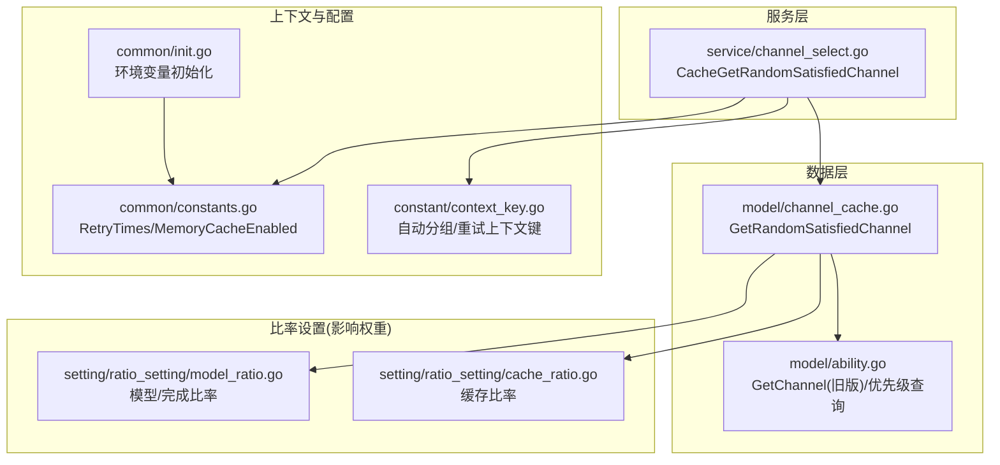
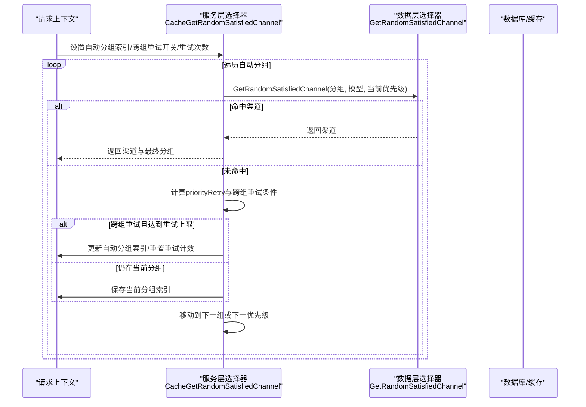
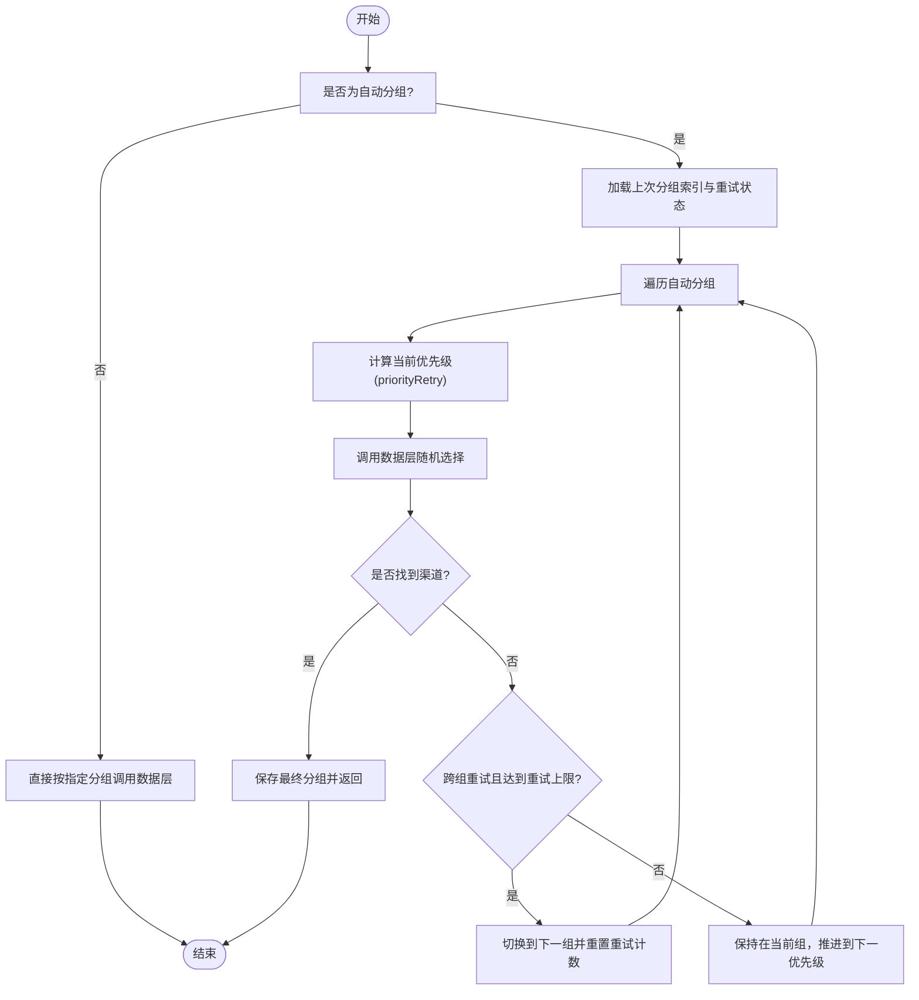
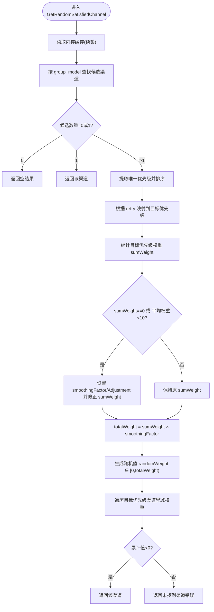
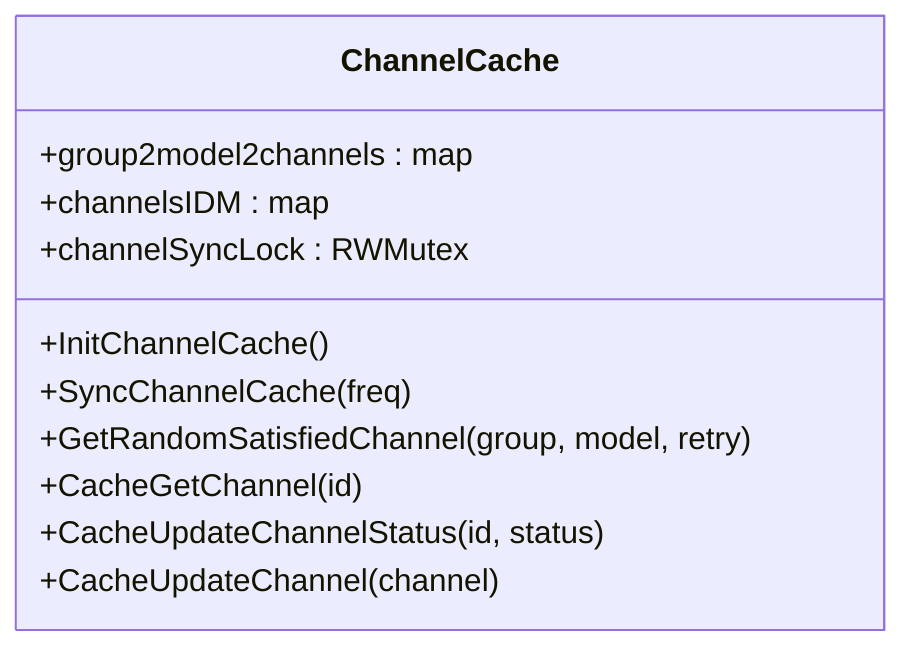
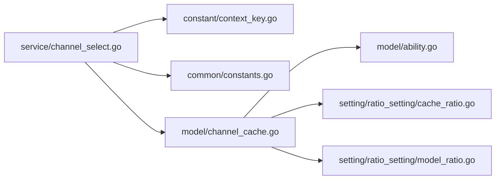

# 负载均衡

<cite>
**本文引用的文件列表**
- [model/channel_cache.go](file://model/channel_cache.go)
- [service/channel_select.go](file://service/channel_select.go)
- [model/ability.go](file://model/ability.go)
- [constant/context_key.go](file://constant/context_key.go)
- [common/constants.go](file://common/constants.go)
- [common/init.go](file://common/init.go)
- [setting/ratio_setting/cache_ratio.go](file://setting/ratio_setting/cache_ratio.go)
- [setting/ratio_setting/model_ratio.go](file://setting/ratio_setting/model_ratio.go)
</cite>

## 目录
1. [简介](#简介)
2. [项目结构与定位](#项目结构与定位)
3. [核心组件](#核心组件)
4. [架构总览](#架构总览)
5. [关键算法详解](#关键算法详解)
6. [依赖关系分析](#依赖关系分析)
7. [性能与复杂度](#性能与复杂度)
8. [故障排查指南](#故障排查指南)
9. [结论](#结论)
10. [附录](#附录)

## 简介
本文件聚焦于系统中的“智能路由与负载均衡”能力，围绕 GetRandomSatisfiedChannel 函数所实现的优先级重试机制与基于权重的随机选择算法进行深入解析，并补充说明平滑因子与调整值在权重计算中的作用、全零权重场景的特殊处理、以及缓存机制在负载均衡中的应用（含内存缓存的读写锁控制与缓存同步策略）。同时给出算法复杂度分析与性能优化建议，帮助读者快速理解并正确使用与扩展该策略。

## 项目结构与定位
- 负载均衡的核心逻辑位于数据层与服务层：
  - 数据层负责从数据库构建与维护渠道缓存，按优先级与权重进行筛选与随机选择。
  - 服务层负责根据用户组、自动分组、跨组重试等上下文参数，驱动优先级递增与分组切换。
- 关键上下文键用于记录当前自动分组索引、重试起始索引与跨组重试开关，确保重试状态在请求生命周期内可追踪。

图表来源
- [service/channel_select.go](file://service/channel_select.go#L48-L162)
- [model/channel_cache.go](file://model/channel_cache.go#L96-L191)
- [model/ability.go](file://model/ability.go#L91-L144)
- [constant/context_key.go](file://constant/context_key.go#L1-L58)
- [common/constants.go](file://common/constants.go#L108-L110)
- [common/init.go](file://common/init.go#L80-L87)
- [setting/ratio_setting/cache_ratio.go](file://setting/ratio_setting/cache_ratio.go#L97-L147)
- [setting/ratio_setting/model_ratio.go](file://setting/ratio_setting/model_ratio.go#L477-L528)

章节来源
- [service/channel_select.go](file://service/channel_select.go#L48-L162)
- [model/channel_cache.go](file://model/channel_cache.go#L96-L191)
- [model/ability.go](file://model/ability.go#L91-L144)
- [constant/context_key.go](file://constant/context_key.go#L1-L58)
- [common/constants.go](file://common/constants.go#L108-L110)
- [common/init.go](file://common/init.go#L80-L87)
- [setting/ratio_setting/cache_ratio.go](file://setting/ratio_setting/cache_ratio.go#L97-L147)
- [setting/ratio_setting/model_ratio.go](file://setting/ratio_setting/model_ratio.go#L477-L528)

## 核心组件
- 服务层选择器
  - CacheGetRandomSatisfiedChannel：根据 token_group、用户组、跨组重试开关与重试次数，按优先级逐组/逐优先级地调用数据层的随机选择函数；当某组或某优先级无可用渠道时，推进到下一组或下一优先级。
- 数据层随机选择
  - GetRandomSatisfiedChannel：在内存缓存中按 group+model 定位候选渠道，提取目标优先级的所有渠道，计算加权随机值并返回匹配的渠道；若 sumWeight 为 0 或平均权重过低，采用平滑因子与调整值保证公平性。
- 上下文与配置
  - 自动分组索引、重试起始索引、跨组重试开关等通过上下文键传递；重试上限 RetryTimes 与内存缓存开关 MemoryCacheEnabled 通过常量与环境变量控制。
- 比率设置
  - 缓存比率与模型/完成比率在不同场景下可能影响渠道权重或选择策略（例如上游倍率同步），但本节重点聚焦于 GetRandomSatisfiedChannel 的权重计算路径。

章节来源
- [service/channel_select.go](file://service/channel_select.go#L48-L162)
- [model/channel_cache.go](file://model/channel_cache.go#L96-L191)
- [constant/context_key.go](file://constant/context_key.go#L1-L58)
- [common/constants.go](file://common/constants.go#L108-L110)
- [common/init.go](file://common/init.go#L80-L87)
- [setting/ratio_setting/cache_ratio.go](file://setting/ratio_setting/cache_ratio.go#L97-L147)
- [setting/ratio_setting/model_ratio.go](file://setting/ratio_setting/model_ratio.go#L477-L528)

## 架构总览
下面的序列图展示了从服务层到数据层的调用链路，以及跨组重试与优先级推进的关键步骤。

图表来源
- [service/channel_select.go](file://service/channel_select.go#L89-L161)
- [model/channel_cache.go](file://model/channel_cache.go#L96-L191)
- [constant/context_key.go](file://constant/context_key.go#L1-L58)

## 关键算法详解

### 1) 优先级重试机制
- 自动分组遍历：当 token_group 为 "auto" 时，服务层根据用户组获取自动分组列表，并从上次记录的分组索引开始遍历。
- 优先级推进：每组内部按 retry 次数映射到对应优先级；若某组某优先级无可用渠道，推进到下一优先级；若达到该组的重试上限且允许跨组重试，则切换到下一组。
- 状态持久化：通过上下文键记录当前自动分组索引与该组开始时的全局重试计数，确保重试状态在请求生命周期内一致。

图表来源
- [service/channel_select.go](file://service/channel_select.go#L89-L161)
- [constant/context_key.go](file://constant/context_key.go#L1-L58)

章节来源
- [service/channel_select.go](file://service/channel_select.go#L89-L161)
- [constant/context_key.go](file://constant/context_key.go#L1-L58)

### 2) 基于权重的随机选择算法
- 选择目标优先级：根据 retry 次数映射到当前组内的目标优先级，仅在该优先级范围内筛选渠道。
- 权重聚合：统计目标优先级下所有渠道的权重之和 sumWeight。
- 平滑因子与调整值：
  - 若 sumWeight 为 0（所有渠道权重为 0），则将 sumWeight 设为渠道数量乘以 100，并设置 smoothingAdjustment 为 100，使每个渠道的有效权重均为 100。
  - 若平均权重小于 10，则设置 smoothingFactor 为 100，从而放大权重差异，避免极端稀疏权重导致的偏差。
- 总权重与随机值：
  - totalWeight = sumWeight × smoothingFactor
  - 在 [0, totalWeight) 范围内生成随机值 randomWeight
  - 遍历目标优先级下的渠道，依次减去 channel.GetWeight()×smoothingFactor + smoothingAdjustment，当累计值首次小于 0 时，返回该渠道。
- 特殊情况：若遍历结束后仍未命中，返回“未找到渠道”的错误。

图表来源
- [model/channel_cache.go](file://model/channel_cache.go#L96-L191)

章节来源
- [model/channel_cache.go](file://model/channel_cache.go#L96-L191)

### 3) 平滑因子与调整值的作用
- 平滑因子 smoothingFactor：当平均权重过低时提升其影响力，使权重分布更明显，避免因权重普遍很小而造成随机性失真。
- 平滑调整值 smoothingAdjustment：当所有渠道权重为 0 时，统一增加一个正的偏移，使每个渠道都有非零的“有效权重”，确保随机选择的公平性。
- 这两个参数共同保证了在极端权重情况下（全零或极小）仍能稳定地进行随机选择。

章节来源
- [model/channel_cache.go](file://model/channel_cache.go#L162-L174)

### 4) 所有渠道权重为零的特殊情况
- 当 sumWeight 为 0 时，系统将 sumWeight 重设为“渠道数量 × 100”，并将 smoothingAdjustment 设为 100，使得每个渠道的有效权重均为 100，从而在全零权重场景下也能进行均匀随机选择。
- 此设计避免了因权重全零导致的不可用状态，提升了系统的鲁棒性。

章节来源
- [model/channel_cache.go](file://model/channel_cache.go#L166-L171)

### 5) 缓存机制在负载均衡中的应用
- 内存缓存结构：
  - group2model2channels：按分组与模型维护渠道 ID 列表，并按优先级降序排列。
  - channelsIDM：按渠道 ID 维护完整渠道对象。
  - channelSyncLock：全局读写锁，保护缓存的并发访问与更新。
- 初始化与同步：
  - InitChannelCache：从数据库加载渠道与能力，构建 group2model2channels 与 channelsIDM，并在必要时保留多 key 轮询索引。
  - SyncChannelCache：周期性同步数据库与内存缓存。
- 读写锁控制：
  - 读操作（如 GetRandomSatisfiedChannel）使用 RLock，写操作（如 CacheUpdateChannelStatus/Clear）使用 Lock，确保高并发下的安全与性能平衡。
- 缓存同步策略：
  - 通过定时任务定期拉取最新数据，减少对数据库的实时压力；同时在状态变更时即时更新内存缓存，保证一致性。

图表来源
- [model/channel_cache.go](file://model/channel_cache.go#L21-L86)
- [model/channel_cache.go](file://model/channel_cache.go#L193-L266)

章节来源
- [model/channel_cache.go](file://model/channel_cache.go#L21-L86)
- [model/channel_cache.go](file://model/channel_cache.go#L193-L266)

## 依赖关系分析
- 服务层依赖：
  - 上下文键：用于记录自动分组索引、重试起始索引与跨组重试开关。
  - 重试上限：RetryTimes 作为跨组重试的阈值。
  - 内存缓存开关：MemoryCacheEnabled 控制是否走内存缓存路径。
- 数据层依赖：
  - 内存缓存：group2model2channels 与 channelsIDM 提供快速查找与排序。
  - 权重计算：sumWeight、smoothingFactor、smoothingAdjustment 影响随机选择概率。
- 比率设置：
  - 缓存比率与模型/完成比率在其他模块中使用，但与 GetRandomSatisfiedChannel 的权重计算路径无直接耦合。

图表来源
- [service/channel_select.go](file://service/channel_select.go#L48-L162)
- [model/channel_cache.go](file://model/channel_cache.go#L96-L191)
- [constant/context_key.go](file://constant/context_key.go#L1-L58)
- [common/constants.go](file://common/constants.go#L108-L110)
- [setting/ratio_setting/cache_ratio.go](file://setting/ratio_setting/cache_ratio.go#L97-L147)
- [setting/ratio_setting/model_ratio.go](file://setting/ratio_setting/model_ratio.go#L477-L528)

章节来源
- [service/channel_select.go](file://service/channel_select.go#L48-L162)
- [model/channel_cache.go](file://model/channel_cache.go#L96-L191)
- [constant/context_key.go](file://constant/context_key.go#L1-L58)
- [common/constants.go](file://common/constants.go#L108-L110)
- [setting/ratio_setting/cache_ratio.go](file://setting/ratio_setting/cache_ratio.go#L97-L147)
- [setting/ratio_setting/model_ratio.go](file://setting/ratio_setting/model_ratio.go#L477-L528)

## 性能与复杂度
- 时间复杂度
  - 选择目标优先级：O(P)，P 为该组内唯一优先级数量。
  - 权重聚合：O(C)，C 为目标优先级下渠道数量。
  - 随机选择：O(C)，线性扫描目标优先级渠道。
  - 总体：O(P + C)，通常 P 与 C 均较小，整体近似 O(N)。
- 空间复杂度
  - 内存缓存占用：O(T + M)，T 为渠道总数，M 为模型-分组映射条目数。
- 并发与锁
  - 读多写少场景下，RWMutex 的读锁可显著提升并发吞吐；写操作集中在缓存重建与状态变更。
- 优化建议
  - 合理设置重试上限 RetryTimes，避免过多优先级导致扫描成本上升。
  - 在高并发场景下，确保 MemoryCacheEnabled 已开启，减少数据库访问。
  - 对于权重极小或全零的渠道，可通过业务侧调整权重或启用平滑因子，避免极端情况。
  - 定期检查与优化 SyncChannelCache 频率，平衡一致性与性能。

[本节为通用性能讨论，不直接分析具体文件]

## 故障排查指南
- 现象：返回“未找到渠道”
  - 可能原因：目标优先级下无可用渠道、模型名称未匹配到任何渠道、或内存缓存尚未同步。
  - 排查要点：确认 group 与 model 是否正确；检查是否启用 MemoryCacheEnabled；查看 InitChannelCache 是否成功执行。
- 现象：跨组重试未生效
  - 可能原因：未设置 token_cross_group_retry 上下文键，或重试次数未超过 RetryTimes。
  - 排查要点：确认上下文键 token_cross_group_retry；核对 RetryTimes 配置。
- 现象：全零权重导致随机性异常
  - 系统已内置平滑处理；若仍异常，检查是否手动将权重设为 0 且未触发平滑逻辑。
- 现象：高并发下性能下降
  - 检查是否关闭 MemoryCacheEnabled；评估 SyncChannelCache 频率与缓存重建成本。

章节来源
- [model/channel_cache.go](file://model/channel_cache.go#L166-L171)
- [service/channel_select.go](file://service/channel_select.go#L137-L154)
- [common/constants.go](file://common/constants.go#L108-L110)
- [common/init.go](file://common/init.go#L80-L87)

## 结论
本文对 GetRandomSatisfiedChannel 的智能路由与负载均衡策略进行了系统性解析，重点覆盖了：
- 优先级重试机制与跨组重试的推进逻辑；
- 基于权重的随机选择算法，以及平滑因子与调整值在极端权重场景下的作用；
- 内存缓存的结构、读写锁控制与同步策略；
- 算法复杂度与性能优化建议。

这些机制共同确保了在多分组、多优先级、多模型的复杂场景下，系统能够稳定、公平且高效地进行渠道选择。

[本节为总结性内容，不直接分析具体文件]

## 附录
- 关键配置项
  - RetryTimes：重试上限，决定跨组重试的触发条件。
  - MemoryCacheEnabled：内存缓存开关，控制是否启用内存缓存路径。
- 关键上下文键
  - token_cross_group_retry：跨组重试开关。
  - auto_group/auto_group_index/auto_group_retry_index：自动分组与重试状态跟踪。
- 相关实现位置
  - 服务层选择器：[service/channel_select.go](file://service/channel_select.go#L48-L162)
  - 数据层随机选择：[model/channel_cache.go](file://model/channel_cache.go#L96-L191)
  - 上下文键定义：[constant/context_key.go](file://constant/context_key.go#L1-L58)
  - 配置与环境变量：[common/constants.go](file://common/constants.go#L108-L110)、[common/init.go](file://common/init.go#L80-L87)