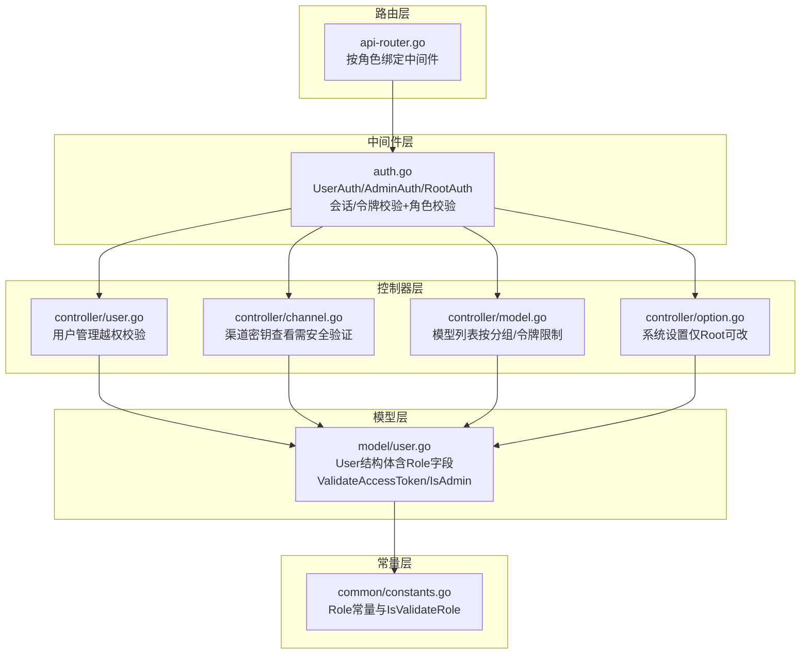
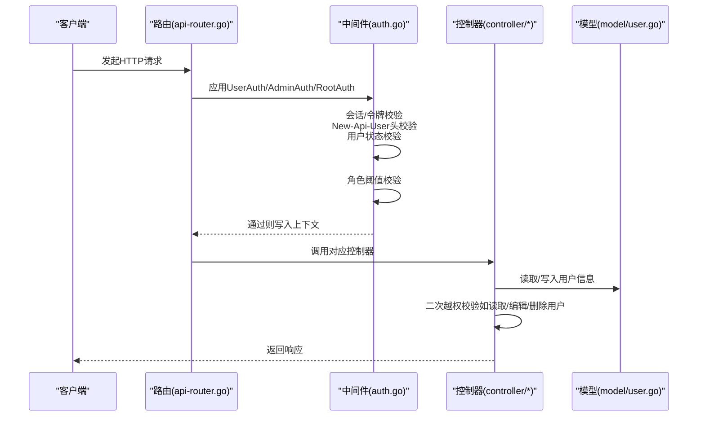
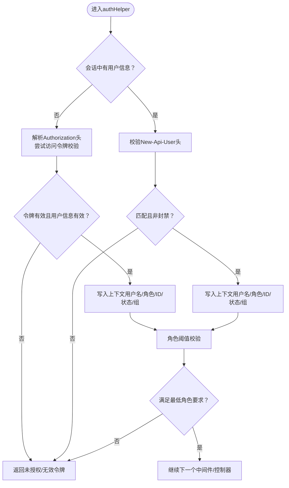
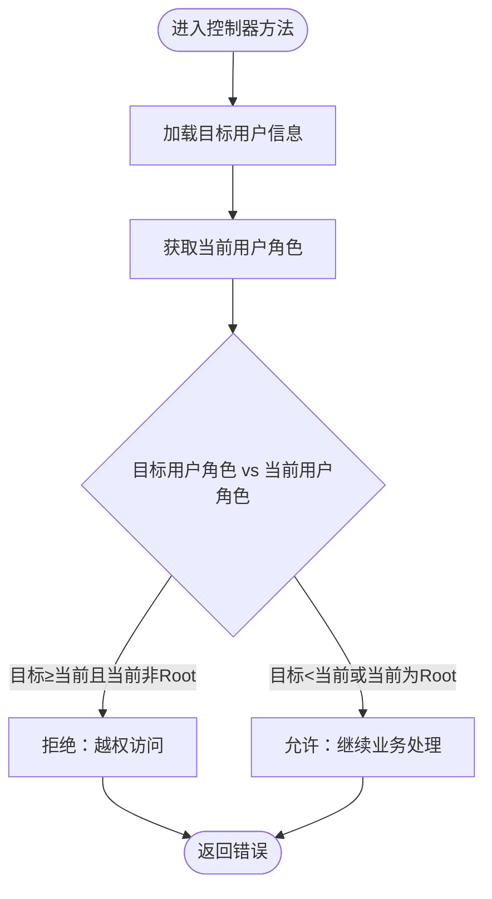
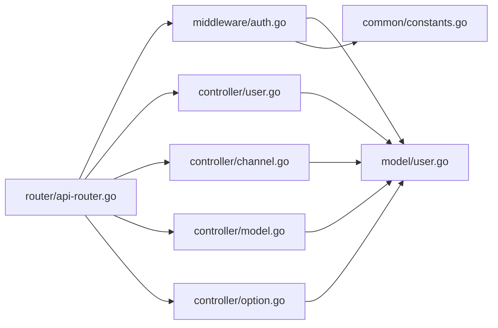

# 基于角色的访问控制（RBAC）

<cite>
**本文引用的文件**
- [model/user.go](file://model/user.go)
- [middleware/auth.go](file://middleware/auth.go)
- [controller/user.go](file://controller/user.go)
- [router/api-router.go](file://router/api-router.go)
- [common/constants.go](file://common/constants.go)
- [controller/channel.go](file://controller/channel.go)
- [controller/setup.go](file://controller/setup.go)
- [controller/model.go](file://controller/model.go)
- [controller/option.go](file://controller/option.go)
</cite>

## 目录
1. [引言](#引言)
2. [项目结构](#项目结构)
3. [核心组件](#核心组件)
4. [架构总览](#架构总览)
5. [详细组件分析](#详细组件分析)
6. [依赖关系分析](#依赖关系分析)
7. [性能考量](#性能考量)
8. [故障排查指南](#故障排查指南)
9. [结论](#结论)

## 引言
本文件围绕系统中的基于角色的访问控制（RBAC）机制展开，重点阐述“超级管理员（Root）—管理员（Admin）—普通用户（Common）”三级权限模型，说明角色字段（Role）在用户模型中的实现方式，以及不同角色在渠道管理、用户管理、系统设置等模块的访问边界。同时，文档给出权限检查中间件的实现逻辑（会话验证、角色校验、权限提升机制），并列举常见越权问题的防范措施与最佳实践。

## 项目结构
RBAC相关能力主要分布在以下层次：
- 路由层：按模块与角色绑定路由中间件，形成粗粒度的访问边界
- 中间件层：统一的认证与授权检查，负责会话/令牌校验、角色比对、用户状态校验
- 控制器层：在关键业务接口上执行细粒度的越权校验（如用户信息读取/编辑/删除）
- 模型层：用户实体包含角色字段，提供角色判定与访问令牌校验等支撑方法
- 常量层：定义角色常量与角色有效性校验

图表来源
- [router/api-router.go](file://router/api-router.go#L1-L261)
- [middleware/auth.go](file://middleware/auth.go#L1-L170)
- [controller/user.go](file://controller/user.go#L300-L700)
- [controller/channel.go](file://controller/channel.go#L430-L471)
- [controller/model.go](file://controller/model.go#L112-L203)
- [controller/option.go](file://controller/option.go#L1-L224)
- [model/user.go](file://model/user.go#L20-L60)
- [common/constants.go](file://common/constants.go#L132-L150)

章节来源
- [router/api-router.go](file://router/api-router.go#L1-L261)
- [middleware/auth.go](file://middleware/auth.go#L1-L170)
- [controller/user.go](file://controller/user.go#L300-L700)
- [controller/channel.go](file://controller/channel.go#L430-L471)
- [controller/model.go](file://controller/model.go#L112-L203)
- [controller/option.go](file://controller/option.go#L1-L224)
- [model/user.go](file://model/user.go#L20-L60)
- [common/constants.go](file://common/constants.go#L132-L150)

## 核心组件
- 角色常量与有效性校验
  - 角色枚举：访客、普通用户、管理员、超级管理员
  - 角色有效性校验函数用于中间件前置校验
- 用户模型与角色字段
  - User结构体包含Role字段，默认普通用户
  - 提供访问令牌校验方法，用于令牌场景下的身份识别
  - 提供IsAdmin快速判定管理员
- 权限检查中间件
  - UserAuth：最低权限为普通用户
  - AdminAuth：最低权限为管理员
  - RootAuth：最低权限为超级管理员
  - authHelper：统一实现会话/令牌校验、New-Api-User头校验、用户状态校验、角色阈值校验
- 路由绑定
  - 各模块路由按角色绑定对应中间件，形成粗粒度访问边界
- 控制器内的越权校验
  - 用户信息读取/编辑/删除时，执行“不得越权”的二次校验
  - 创建用户时，禁止创建权限不低于自身的用户
  - 渠道密钥查看接口需额外安全验证中间件

章节来源
- [common/constants.go](file://common/constants.go#L132-L150)
- [model/user.go](file://model/user.go#L20-L60)
- [middleware/auth.go](file://middleware/auth.go#L1-L170)
- [router/api-router.go](file://router/api-router.go#L1-L261)
- [controller/user.go](file://controller/user.go#L300-L700)
- [controller/channel.go](file://controller/channel.go#L430-L471)

## 架构总览
RBAC在系统中的运行流程如下：
- 请求进入路由层，按模块绑定中间件
- 中间件层执行会话/令牌校验与角色校验，必要时写入上下文
- 控制器层在业务逻辑处执行二次越权校验
- 模型层提供角色判定与访问令牌校验等支撑

图表来源
- [router/api-router.go](file://router/api-router.go#L1-L261)
- [middleware/auth.go](file://middleware/auth.go#L1-L170)
- [controller/user.go](file://controller/user.go#L300-L700)
- [model/user.go](file://model/user.go#L20-L60)

## 详细组件分析

### 角色模型与角色字段（Role）
- 角色定义
  - 访客、普通用户、管理员、超级管理员
  - 角色有效性校验函数确保角色值合法
- 用户模型
  - User结构体包含Role字段，默认普通用户
  - 提供访问令牌校验方法，用于令牌场景下的身份识别
  - 提供IsAdmin快速判定管理员
- 默认边栏配置与权限
  - 根据用户角色生成默认边栏配置，超级管理员可访问系统设置，管理员不可访问系统设置，普通用户不可访问管理员区域

章节来源
- [common/constants.go](file://common/constants.go#L132-L150)
- [model/user.go](file://model/user.go#L20-L60)
- [model/user.go](file://model/user.go#L96-L156)

### 权限检查中间件（authHelper）
- 会话/令牌校验
  - 若会话中无用户信息，则尝试从Authorization头解析访问令牌
  - 对令牌用户进行用户信息有效性校验
- New-Api-User头校验
  - 校验New-Api-User与会话中的用户ID一致
- 用户状态校验
  - 禁止封禁用户继续访问
- 角色阈值校验
  - 最低角色要求由UserAuth/AdminAuth/RootAuth传入
- 上下文注入
  - 将用户名、角色、用户ID、用户组等写入上下文，供控制器使用

图表来源
- [middleware/auth.go](file://middleware/auth.go#L1-L170)

章节来源
- [middleware/auth.go](file://middleware/auth.go#L1-L170)

### 路由与角色绑定
- 路由层按模块绑定中间件，形成粗粒度访问边界
  - 用户模块：普通用户以上可访问自身资源；管理员以上可访问用户管理接口
  - 渠道模块：管理员以上可访问渠道管理；部分敏感接口（如获取渠道密钥）需Root权限
  - 日志/用量/数据模块：管理员以上可访问
  - 系统设置模块：仅超级管理员可访问
  - 模型/供应商/预填充分组等：管理员以上可访问

章节来源
- [router/api-router.go](file://router/api-router.go#L1-L261)

### 控制器内的越权校验
- 用户信息读取
  - 不得读取权限不低于自身的用户信息（普通用户不得读取管理员及以上）
- 用户信息编辑/删除
  - 不得编辑/删除权限不低于自身的用户（普通用户不得编辑/删除管理员及以上）
  - 不得将他人权限提升到不低于自己的等级
- 创建用户
  - 不得创建权限不低于自身的用户
- 渠道密钥查看
  - 该接口额外绑定安全验证中间件，防止越权查看

图表来源
- [controller/user.go](file://controller/user.go#L300-L700)
- [controller/channel.go](file://controller/channel.go#L430-L471)

章节来源
- [controller/user.go](file://controller/user.go#L300-L700)
- [controller/channel.go](file://controller/channel.go#L430-L471)

### 不同角色的访问边界与功能模块
- 普通用户（RoleCommonUser）
  - 可访问自身资源（个人信息、令牌、额度、日志等）
  - 不可访问用户管理、渠道管理、系统设置等管理接口
- 管理员（RoleAdminUser）
  - 可访问用户管理、渠道管理、日志统计、模型元数据管理等
  - 不可访问系统设置（如选项配置）
- 超级管理员（RoleRootUser）
  - 可访问全部功能，包括系统设置、敏感渠道密钥查看等

章节来源
- [router/api-router.go](file://router/api-router.go#L1-L261)
- [controller/user.go](file://controller/user.go#L430-L510)
- [model/user.go](file://model/user.go#L96-L156)

### 权限提升机制与令牌场景
- 令牌场景下的权限提升
  - TokenAuth中间件在令牌有效时，会将令牌所属用户上下文写入，同时根据令牌的模型限制、分组等进行进一步约束
  - 管理员在令牌场景下可指定渠道ID（特定通道），普通用户不允许指定渠道
- 会话与令牌的协同
  - authHelper优先使用会话；若无会话则尝试令牌；两者均失败则拒绝

章节来源
- [middleware/auth.go](file://middleware/auth.go#L170-L322)
- [controller/user.go](file://controller/user.go#L430-L510)

### 初始化与根用户创建
- 系统初始化时可创建超级管理员账户，角色设为超级管理员
- 初始化完成后，后续不再允许重复初始化

章节来源
- [controller/setup.go](file://controller/setup.go#L1-L183)

## 依赖关系分析
- 路由层依赖中间件层提供的UserAuth/AdminAuth/RootAuth
- 中间件层依赖模型层的访问令牌校验与用户状态校验
- 控制器层依赖中间件层提供的上下文信息与模型层的用户信息读取/写入
- 角色常量定义位于常量层，被中间件与控制器共同使用

图表来源
- [router/api-router.go](file://router/api-router.go#L1-L261)
- [middleware/auth.go](file://middleware/auth.go#L1-L170)
- [controller/user.go](file://controller/user.go#L300-L700)
- [controller/channel.go](file://controller/channel.go#L430-L471)
- [controller/model.go](file://controller/model.go#L112-L203)
- [controller/option.go](file://controller/option.go#L1-L224)
- [model/user.go](file://model/user.go#L20-L60)
- [common/constants.go](file://common/constants.go#L132-L150)

章节来源
- [router/api-router.go](file://router/api-router.go#L1-L261)
- [middleware/auth.go](file://middleware/auth.go#L1-L170)
- [controller/user.go](file://controller/user.go#L300-L700)
- [controller/channel.go](file://controller/channel.go#L430-L471)
- [controller/model.go](file://controller/model.go#L112-L203)
- [controller/option.go](file://controller/option.go#L1-L224)
- [model/user.go](file://model/user.go#L20-L60)
- [common/constants.go](file://common/constants.go#L132-L150)

## 性能考量
- 中间件层的会话/令牌校验与用户状态校验均为轻量操作，通常不会成为瓶颈
- 对于高并发场景，建议结合全局限流中间件与Redis限流策略，避免滥用
- 模型层的用户信息读取建议配合缓存策略，减少数据库压力

[本节为通用指导，无需具体文件引用]

## 故障排查指南
- 401/403错误
  - 未登录且未提供访问令牌：检查会话或Authorization头
  - New-Api-User头缺失或与会话ID不匹配：核对请求头
  - 用户被封禁：检查用户状态
  - 权限不足：确认当前角色是否满足接口最低角色要求
- 越权访问被拒
  - 读取/编辑/删除用户时，若目标用户角色不低于当前用户（且当前非Root），会被拒绝
  - 创建用户时，若目标角色不低于当前用户，会被拒绝
- 渠道密钥查看失败
  - 该接口需要Root权限或额外安全验证中间件，请确认调用方具备相应权限

章节来源
- [middleware/auth.go](file://middleware/auth.go#L1-L170)
- [controller/user.go](file://controller/user.go#L300-L700)
- [controller/channel.go](file://controller/channel.go#L430-L471)

## 结论
本系统采用明确的角色常量与中间件校验相结合的方式实现RBAC，辅以控制器层面的二次越权校验，确保在用户管理、渠道管理、系统设置等关键模块中形成清晰的权限边界。通过路由层的角色绑定与令牌场景下的权限提升机制，系统既保证了易用性，也强化了安全性。建议在生产环境中持续监控权限相关日志，定期审计越权行为，确保RBAC策略的有效执行。