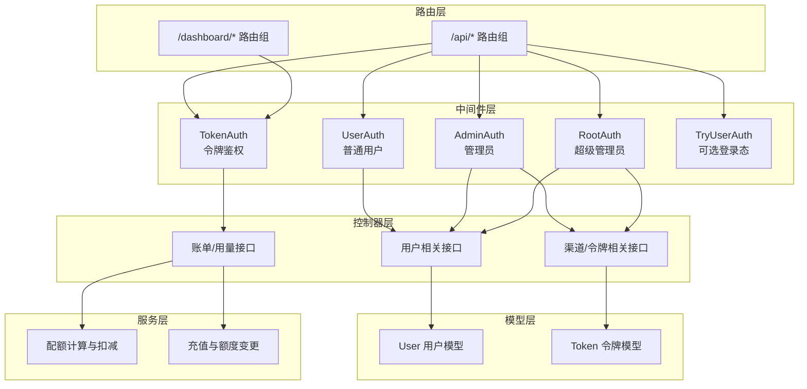
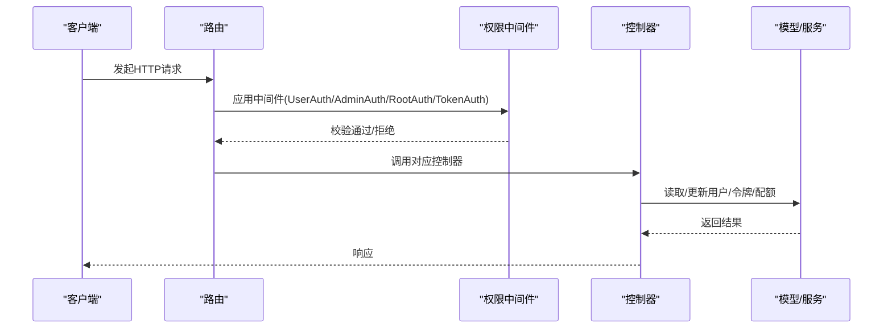
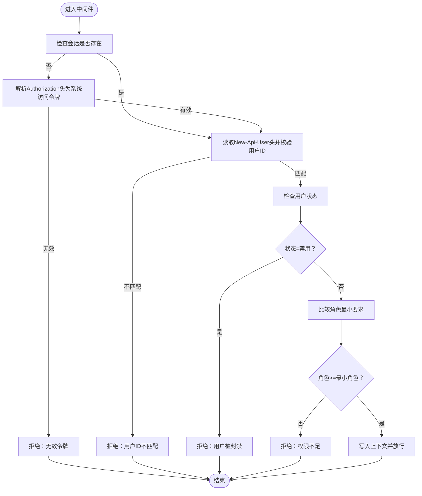
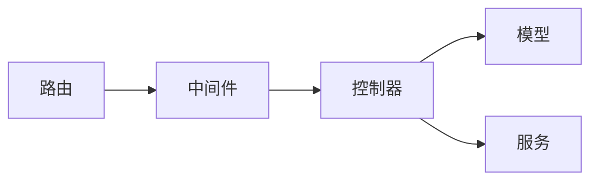

# 授权与权限控制

<cite>
**本文引用的文件**
- [middleware/auth.go](file://middleware/auth.go)
- [common/constants.go](file://common/constants.go)
- [router/api-router.go](file://router/api-router.go)
- [router/dashboard.go](file://router/dashboard.go)
- [controller/user.go](file://controller/user.go)
- [controller/channel.go](file://controller/channel.go)
- [controller/token.go](file://controller/token.go)
- [model/user.go](file://model/user.go)
- [model/token.go](file://model/token.go)
- [service/quota.go](file://service/quota.go)
- [controller/topup.go](file://controller/topup.go)
</cite>

## 目录
1. [引言](#引言)
2. [项目结构](#项目结构)
3. [核心组件](#核心组件)
4. [架构总览](#架构总览)
5. [详细组件分析](#详细组件分析)
6. [依赖关系分析](#依赖关系分析)
7. [性能考量](#性能考量)
8. [故障排查指南](#故障排查指南)
9. [结论](#结论)

## 引言
本文件围绕用户授权与权限控制体系，系统阐述基于角色的访问控制（RBAC）模型、权限分级机制、API访问控制策略、配额使用与令牌创建流程、邀请奖励等业务规则如何与权限关联，并提供权限检查中间件的实现逻辑与调用示例，以及常见越权问题的防范建议。文档面向技术与非技术读者，力求以循序渐进的方式呈现复杂实现。

## 项目结构
- 权限控制入口集中在中间件层，通过路由分组与中间件组合实现细粒度的访问控制。
- 用户与令牌模型提供权限与配额相关的数据结构与校验逻辑。
- 控制器层负责具体业务接口，结合中间件完成权限校验与业务规则执行。
- 服务层处理配额计算、扣减与通知等核心业务。

图表来源
- [router/api-router.go](file://router/api-router.go#L1-L261)
- [router/dashboard.go](file://router/dashboard.go#L1-L23)
- [middleware/auth.go](file://middleware/auth.go#L1-L161)
- [controller/user.go](file://controller/user.go#L1-L200)
- [controller/channel.go](file://controller/channel.go#L1-L120)
- [controller/token.go](file://controller/token.go#L1-L120)
- [model/user.go](file://model/user.go#L1-L120)
- [model/token.go](file://model/token.go#L1-L120)
- [service/quota.go](file://service/quota.go#L1-L120)

章节来源
- [router/api-router.go](file://router/api-router.go#L1-L261)
- [router/dashboard.go](file://router/dashboard.go#L1-L23)

## 核心组件
- 角色常量与权限级别
  - 定义角色枚举与校验函数，确保角色值合法。
  - 关键路径参考：[common/constants.go](file://common/constants.go#L132-L145)

- 中间件权限检查
  - UserAuth/AdminAuth/RootAuth：基于会话或系统访问令牌进行角色校验。
  - TokenAuth：针对令牌调用链路进行令牌有效性、额度、IP白名单、分组切换等校验。
  - 关键路径参考：[middleware/auth.go](file://middleware/auth.go#L1-L161)

- 用户模型与权限
  - 用户角色、状态、配额、分组、邀请相关字段与方法。
  - 关键路径参考：[model/user.go](file://model/user.go#L1-L120)

- 令牌模型与权限
  - 令牌状态、额度、有效期、模型限制、IP白名单、分组与跨组重试等。
  - 关键路径参考：[model/token.go](file://model/token.go#L1-L120)

- 配额与业务规则
  - 预扣费、后补扣费、额度计算、通知阈值、充值映射。
  - 关键路径参考：[service/quota.go](file://service/quota.go#L1-L120)

章节来源
- [common/constants.go](file://common/constants.go#L132-L145)
- [middleware/auth.go](file://middleware/auth.go#L1-L161)
- [model/user.go](file://model/user.go#L1-L120)
- [model/token.go](file://model/token.go#L1-L120)
- [service/quota.go](file://service/quota.go#L1-L120)

## 架构总览
RBAC模型采用“角色驱动”的访问控制，结合令牌维度的资源隔离与配额约束，形成“用户-角色-令牌-分组-额度”的多层防护。

图表来源
- [router/api-router.go](file://router/api-router.go#L1-L261)
- [middleware/auth.go](file://middleware/auth.go#L1-L161)
- [controller/user.go](file://controller/user.go#L1-L200)
- [controller/token.go](file://controller/token.go#L1-L120)
- [model/user.go](file://model/user.go#L1-L120)
- [model/token.go](file://model/token.go#L1-L120)
- [service/quota.go](file://service/quota.go#L1-L120)

## 详细组件分析

### RBAC角色与权限分级
- 角色定义
  - Guest/Common/Admin/Root 四级角色，分别对应访客、普通用户、管理员、超级管理员。
  - 角色校验函数确保输入合法。
  - 参考路径：[common/constants.go](file://common/constants.go#L132-L145)

- 权限边界
  - 普通用户：仅能访问自身资源与部分公开接口。
  - 管理员：可管理用户、渠道、模型、兑换码、日志等后台功能，但不可访问系统设置。
  - 超级管理员：拥有最高权限，可访问系统设置与全部后台功能。
  - 参考路径：[controller/user.go](file://controller/user.go#L484-L510)

- 边栏模块权限
  - 根据角色动态生成默认边栏配置，管理员可设置边栏但不包含系统设置；超级管理员不包含边栏设置项。
  - 参考路径：[model/user.go](file://model/user.go#L96-L156)

章节来源
- [common/constants.go](file://common/constants.go#L132-L145)
- [controller/user.go](file://controller/user.go#L484-L510)
- [model/user.go](file://model/user.go#L96-L156)

### 权限检查中间件实现
- 会话与系统访问令牌
  - 若会话缺失，尝试从 Authorization 头解析系统访问令牌；若仍无效则拒绝。
  - 校验 New-Api-User 头与当前会话用户ID一致，防止越权。
  - 参考路径：[middleware/auth.go](file://middleware/auth.go#L30-L144)

- 角色校验
  - 依据最小角色要求进行比较，角色不足则拒绝。
  - 参考路径：[middleware/auth.go](file://middleware/auth.go#L146-L173)

- 令牌鉴权链路（TokenAuth）
  - 解析多种协议头中的密钥来源，统一注入 Authorization。
  - 校验令牌有效性、状态、过期、额度、IP白名单、分组切换与跨组重试。
  - 参考路径：[middleware/auth.go](file://middleware/auth.go#L179-L322)

- 令牌上下文设置
  - 将用户ID、令牌ID、令牌名称、额度、模型限制、分组等写入上下文，供后续处理使用。
  - 参考路径：[middleware/auth.go](file://middleware/auth.go#L292-L321)

- 实际调用示例
  - 用户路由组：UserAuth 保护用户自服务接口。
    - 参考路径：[router/api-router.go](file://router/api-router.go#L63-L97)
  - 管理员路由组：AdminAuth 保护后台管理接口。
    - 参考路径：[router/api-router.go](file://router/api-router.go#L98-L116)
  - 超级管理员路由组：RootAuth 保护系统设置接口。
    - 参考路径：[router/api-router.go](file://router/api-router.go#L117-L125)
  - 令牌调用链：TokenAuth 保护仪表盘用量接口。
    - 参考路径：[router/dashboard.go](file://router/dashboard.go#L1-L23)

章节来源
- [middleware/auth.go](file://middleware/auth.go#L30-L173)
- [middleware/auth.go](file://middleware/auth.go#L179-L322)
- [router/api-router.go](file://router/api-router.go#L63-L125)
- [router/dashboard.go](file://router/dashboard.go#L1-L23)

### API访问控制与业务规则
- 用户管理
  - 创建用户时，管理员不可创建权限不低于自身的用户；更新用户时，禁止越权提升他人权限。
  - 参考路径：[controller/user.go](file://controller/user.go#L831-L877)
  - 参考路径：[controller/user.go](file://controller/user.go#L601-L657)

- 渠道管理
  - 渠道密钥查看需通过安全验证中间件，记录操作日志。
  - 参考路径：[controller/channel.go](file://controller/channel.go#L438-L471)

- 令牌管理
  - 令牌创建、查询、更新、删除均受用户身份保护；状态启用前校验过期与额度。
  - 参考路径：[controller/token.go](file://controller/token.go#L1-L120)
  - 参考路径：[controller/token.go](file://controller/token.go#L138-L201)

- 配额使用与扣减
  - 预扣费与后补扣费结合，确保额度一致性；用户与令牌额度分别扣减。
  - 参考路径：[service/quota.go](file://service/quota.go#L480-L533)

- 令牌额度与IP白名单
  - 令牌可配置模型限制、IP白名单、分组与跨组重试；TokenAuth 中进行校验。
  - 参考路径：[middleware/auth.go](file://middleware/auth.go#L243-L288)
  - 参考路径：[model/token.go](file://model/token.go#L38-L58)

- 业务规则与邀请奖励
  - 注册赠送额度、邀请人与被邀请人额度赠送、邀请额度向用户额度转移。
  - 参考路径：[model/user.go](file://model/user.go#L328-L429)
  - 参考路径：[controller/user.go](file://controller/user.go#L375-L403)

- 充值与额度变更
  - 在线支付、Stripe、Creem 等多种充值方式；回调完成后按规则增加用户额度。
  - 参考路径：[controller/topup.go](file://controller/topup.go#L1-L120)
  - 参考路径：[controller/topup.go](file://controller/topup.go#L232-L293)

章节来源
- [controller/user.go](file://controller/user.go#L375-L403)
- [controller/user.go](file://controller/user.go#L601-L657)
- [controller/user.go](file://controller/user.go#L831-L877)
- [controller/channel.go](file://controller/channel.go#L438-L471)
- [controller/token.go](file://controller/token.go#L1-L120)
- [controller/token.go](file://controller/token.go#L138-L201)
- [service/quota.go](file://service/quota.go#L480-L533)
- [model/token.go](file://model/token.go#L38-L58)
- [model/user.go](file://model/user.go#L328-L429)
- [controller/topup.go](file://controller/topup.go#L1-L120)
- [controller/topup.go](file://controller/topup.go#L232-L293)

### 权限检查流程图

图表来源
- [middleware/auth.go](file://middleware/auth.go#L30-L144)

## 依赖关系分析
- 路由与中间件
  - 路由组通过中间件组合实现不同层级的权限控制。
  - 参考路径：[router/api-router.go](file://router/api-router.go#L1-L261)
  - 参考路径：[router/dashboard.go](file://router/dashboard.go#L1-L23)

- 中间件与控制器
  - 控制器在路由层声明的中间件保护下执行业务逻辑。
  - 参考路径：[middleware/auth.go](file://middleware/auth.go#L1-L161)

- 控制器与模型/服务
  - 控制器调用模型与服务完成数据读写与业务处理。
  - 参考路径：[controller/user.go](file://controller/user.go#L1-L200)
  - 参考路径：[controller/token.go](file://controller/token.go#L1-L120)
  - 参考路径：[service/quota.go](file://service/quota.go#L1-L120)

图表来源
- [router/api-router.go](file://router/api-router.go#L1-L261)
- [middleware/auth.go](file://middleware/auth.go#L1-L161)
- [controller/user.go](file://controller/user.go#L1-L200)
- [controller/token.go](file://controller/token.go#L1-L120)
- [service/quota.go](file://service/quota.go#L1-L120)

章节来源
- [router/api-router.go](file://router/api-router.go#L1-L261)
- [middleware/auth.go](file://middleware/auth.go#L1-L161)
- [controller/user.go](file://controller/user.go#L1-L200)
- [controller/token.go](file://controller/token.go#L1-L120)
- [service/quota.go](file://service/quota.go#L1-L120)

## 性能考量
- 中间件层采用内存与Redis混合缓存策略，减少频繁数据库查询。
- 令牌与用户额度变更支持批量更新与异步缓存更新，降低写放大。
- TokenAuth 对令牌与用户状态进行快速校验，避免不必要的数据库访问。
- 配额计算采用比例与价格双模式，兼顾灵活性与性能。

[本节为通用指导，无需特定文件引用]

## 故障排查指南
- 常见越权问题
  - 未携带 New-Api-User 或与会话用户ID不一致导致拒绝。
  - 角色低于最小要求或用户状态为禁用。
  - 参考路径：[middleware/auth.go](file://middleware/auth.go#L73-L144)

- 令牌相关问题
  - 令牌状态异常（过期/额度耗尽）、IP不在白名单、模型限制不匹配。
  - 参考路径：[middleware/auth.go](file://middleware/auth.go#L243-L288)
  - 参考路径：[model/token.go](file://model/token.go#L75-L117)

- 配额不足
  - 用户或令牌额度不足导致消费失败；检查预扣费与后补扣费差异。
  - 参考路径：[service/quota.go](file://service/quota.go#L480-L533)

- 充值回调异常
  - 订单状态与并发锁处理；确认回调签名与状态。
  - 参考路径：[controller/topup.go](file://controller/topup.go#L232-L293)

章节来源
- [middleware/auth.go](file://middleware/auth.go#L73-L144)
- [middleware/auth.go](file://middleware/auth.go#L243-L288)
- [model/token.go](file://model/token.go#L75-L117)
- [service/quota.go](file://service/quota.go#L480-L533)
- [controller/topup.go](file://controller/topup.go#L232-L293)

## 结论
本系统通过“角色+令牌+分组+额度”的多维权限控制，实现了细粒度的API访问控制与业务规则落地。中间件层承担统一的权限校验职责，控制器层聚焦业务逻辑，模型与服务层保障数据一致性与性能。配合严格的越权防护与完善的配额/充值闭环，系统在安全性与可用性之间取得良好平衡。