# 认证机制

<cite>
**本文档引用的文件**   
- [auth.go](file://middleware/auth.go)
- [user.go](file://controller/user.go)
- [twofa.go](file://controller/twofa.go)
- [discord.go](file://controller/discord.go)
- [telegram.go](file://controller/telegram.go)
- [oidc.go](file://controller/oidc.go)
- [user.go](file://model/user.go)
- [token.go](file://model/token.go)
- [twofa.go](file://model/twofa.go)
- [totp.go](file://common/totp.go)
- [api-router.go](file://router/api-router.go)
- [web-router.go](file://router/web-router.go)
- [discord.go](file://setting/system_setting/discord.go)
- [oidc.go](file://setting/system_setting/oidc.go)
</cite>

## 目录
1. [简介](#简介)
2. [双重认证机制](#双重认证机制)
3. [两步验证实现](#两步验证实现)
4. [第三方授权登录](#第三方授权登录)
5. [认证中间件](#认证中间件)
6. [认证失败处理](#认证失败处理)

## 简介
本系统实现了一套完整的用户认证体系，支持基于会话和访问令牌的双重认证方式，同时集成了两步验证（2FA）和多种第三方授权登录功能。系统通过灵活的认证中间件对请求进行权限校验，确保了系统的安全性和可用性。

**Section sources**
- [user.go](file://controller/user.go#L1-L1295)
- [auth.go](file://middleware/auth.go#L1-L322)

## 双重认证机制

### 登录与会话管理
系统实现了基于会话的用户认证流程。用户通过用户名和密码进行登录，服务器验证成功后创建会话并返回用户信息。会话信息存储在服务端，包含用户ID、用户名、角色、状态和用户组等关键信息。

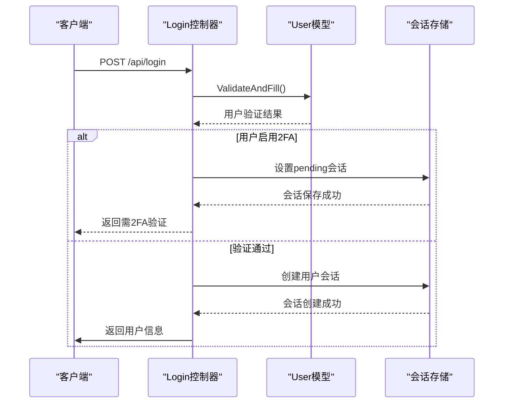

**Diagram sources**
- [user.go](file://controller/user.go#L30-L95)
- [user.go](file://model/user.go#L500-L517)

### 访问令牌认证
系统支持访问令牌（Access Token）认证方式，为API调用提供无状态的认证机制。用户可以通过生成访问令牌，用于替代传统的会话认证。

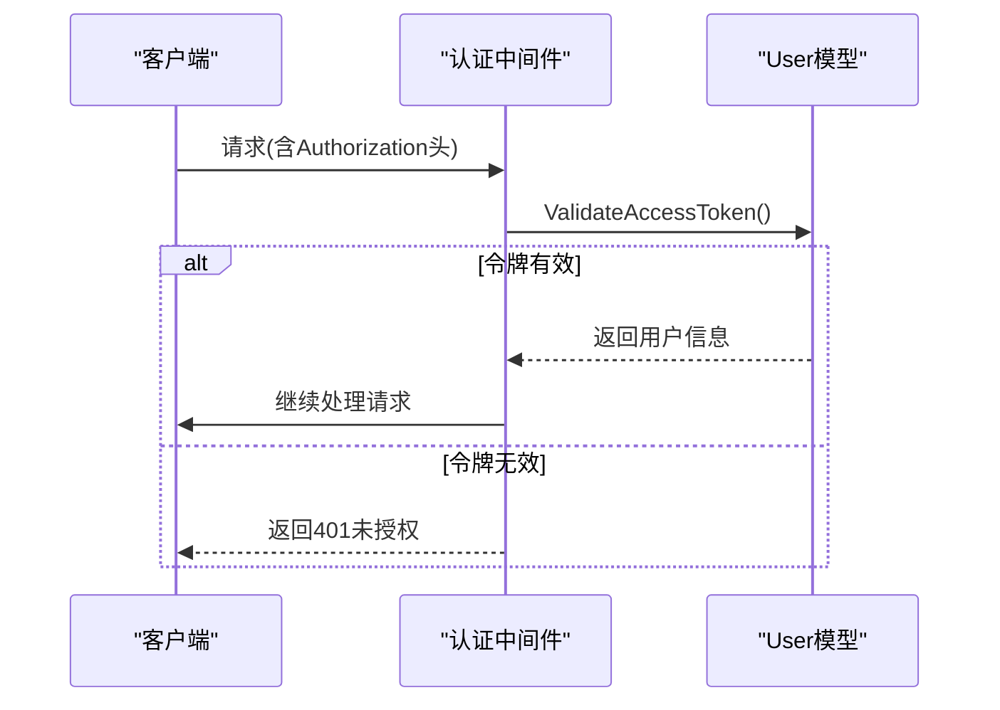

**Diagram sources**
- [auth.go](file://middleware/auth.go#L37-L71)
- [user.go](file://model/user.go#L657-L667)

### 注销流程
用户注销时，系统会清除会话中的所有信息，确保用户身份立即失效。

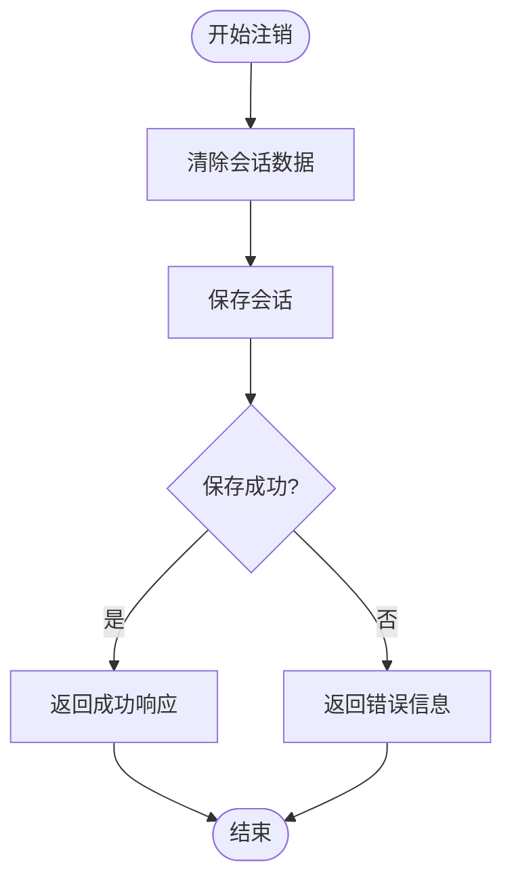

**Diagram sources**
- [user.go](file://controller/user.go#L128-L143)

**Section sources**
- [auth.go](file://middleware/auth.go#L1-L322)
- [user.go](file://controller/user.go#L30-L143)

## 两步验证实现

### TOTP生成与验证
系统采用基于时间的一次性密码（TOTP）算法实现两步验证。用户启用2FA时，系统生成一个密钥，并将其编码为二维码供用户扫描添加到认证器应用中。

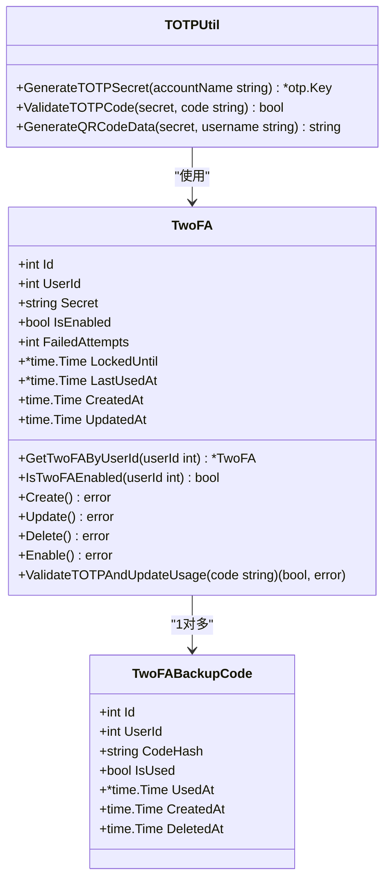

**Diagram sources**
- [twofa.go](file://model/twofa.go#L13-L324)
- [totp.go](file://common/totp.go#L1-L151)

### 2FA完整流程
两步验证的实现包括设置、启用、禁用和验证等多个环节，确保了用户账户的安全性。

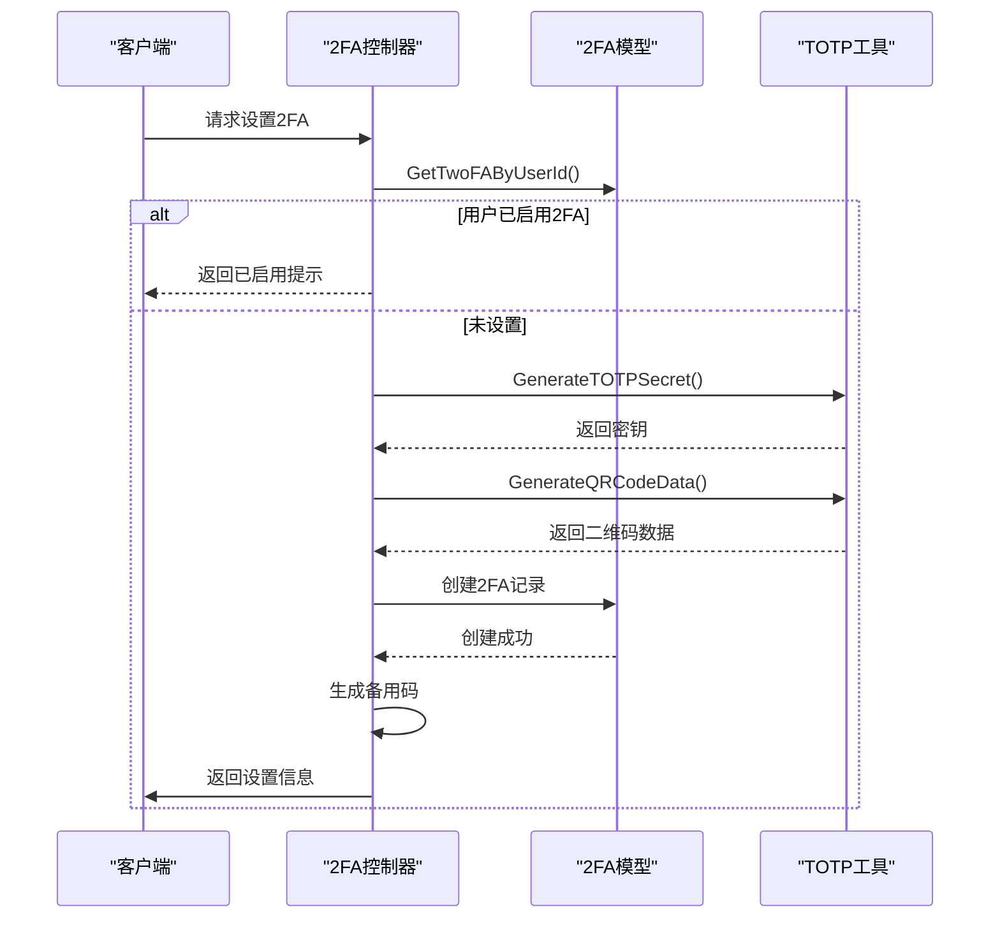

**Diagram sources**
- [twofa.go](file://controller/twofa.go#L34-L135)

### 备用码机制
为防止用户丢失认证设备，系统提供了备用码机制。用户在设置2FA时会生成一组备用码，可用于在无法访问认证器时进行身份验证。

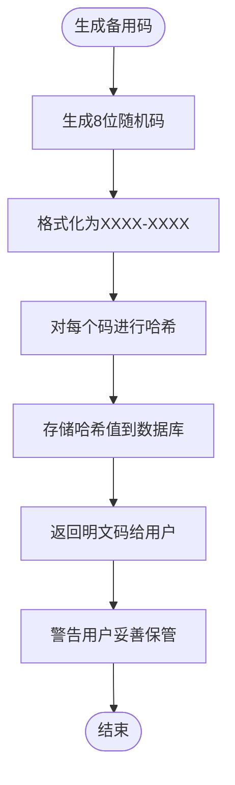

**Diagram sources**
- [totp.go](file://common/totp.go#L48-L61)
- [twofa.go](file://model/twofa.go#L144-L172)

**Section sources**
- [twofa.go](file://controller/twofa.go#L1-L555)
- [twofa.go](file://model/twofa.go#L1-L324)
- [totp.go](file://common/totp.go#L1-L151)

## 第三方授权登录

### Discord集成
系统支持通过Discord账号进行登录和注册。用户点击Discord登录按钮后，会被重定向到Discord的授权页面，授权后返回应用完成登录或注册流程。

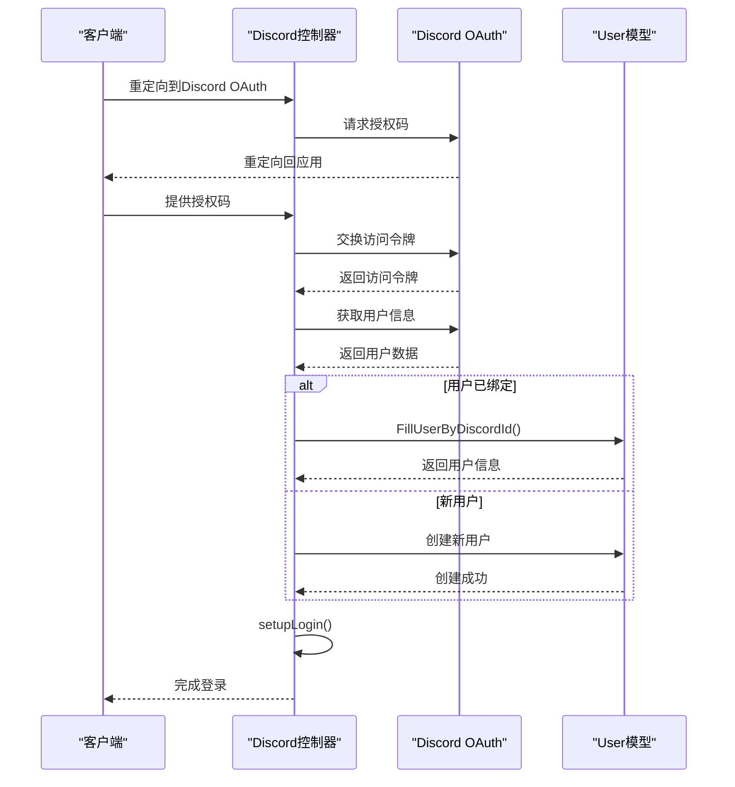

**Diagram sources**
- [discord.go](file://controller/discord.go#L102-L179)

### Telegram集成
Telegram登录采用Telegram的WebApp授权机制，通过验证请求参数的签名来确保请求的合法性。

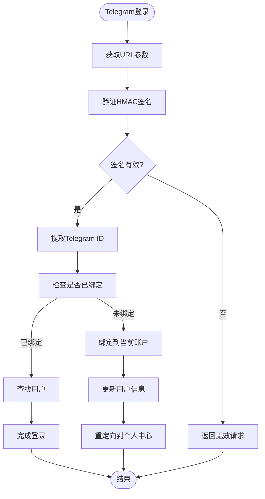

**Diagram sources**
- [telegram.go](file://controller/telegram.go#L72-L99)

### OIDC集成
系统支持OpenID Connect标准，允许用户通过任何符合OIDC标准的身份提供商进行登录。

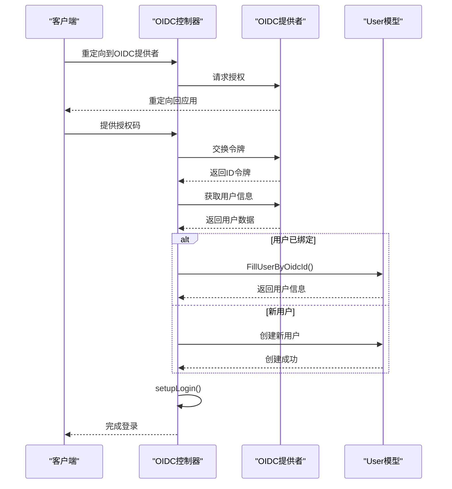

**Diagram sources**
- [oidc.go](file://controller/oidc.go#L104-L182)

### 用户绑定流程
已登录用户可以将第三方账户绑定到自己的账号上，实现多方式登录。

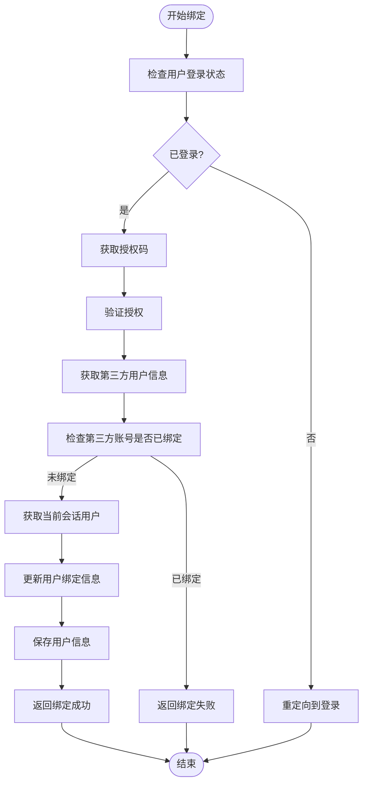

**Diagram sources**
- [discord.go](file://controller/discord.go#L181-L224)
- [oidc.go](file://controller/oidc.go#L184-L228)

**Section sources**
- [discord.go](file://controller/discord.go#L1-L224)
- [telegram.go](file://controller/telegram.go#L1-L126)
- [oidc.go](file://controller/oidc.go#L1-L229)
- [discord.go](file://setting/system_setting/discord.go#L1-L22)
- [oidc.go](file://setting/system_setting/oidc.go#L1-L26)

## 认证中间件

### 请求头解析
认证中间件负责解析请求头中的认证信息，包括Authorization头和New-Api-User头，确保请求的合法性。

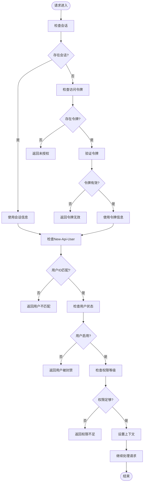

**Diagram sources**
- [auth.go](file://middleware/auth.go#L30-L143)

### 权限校验
系统实现了基于角色的权限控制（RBAC），不同角色具有不同的操作权限。

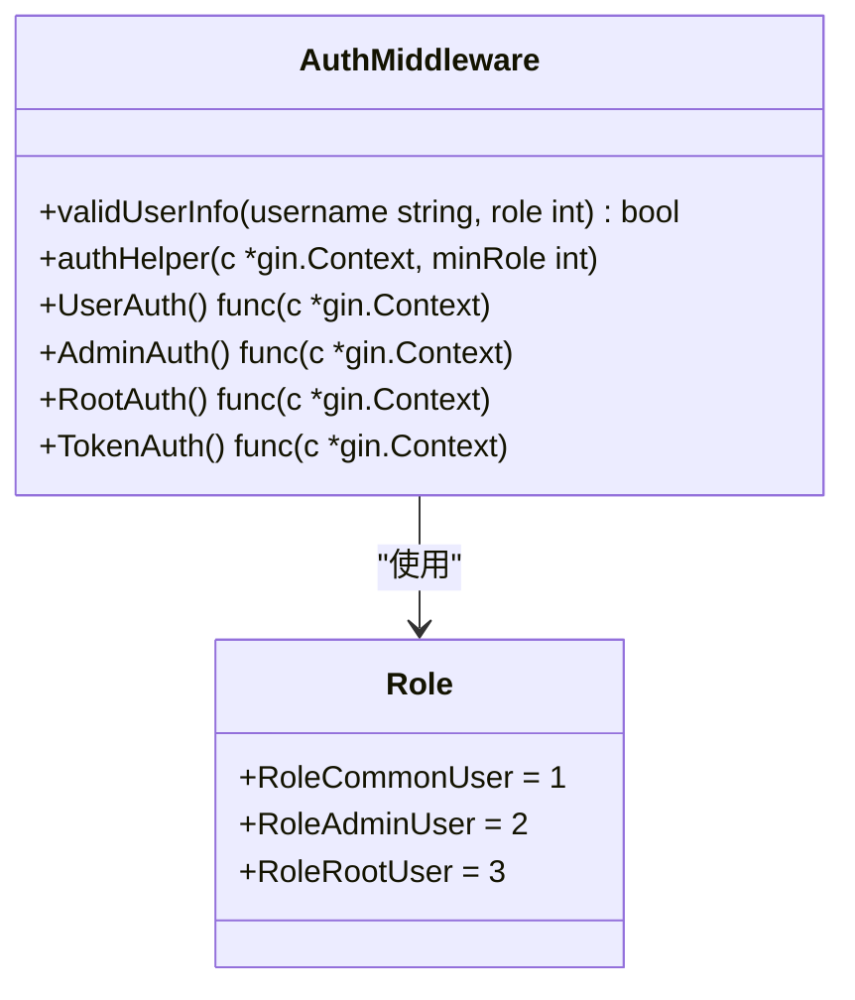

**Diagram sources**
- [auth.go](file://middleware/auth.go#L19-L173)

### 令牌认证
对于API令牌认证，中间件会解析各种来源的令牌密钥，包括标准的Authorization头、WebSocket协议头、查询参数等。

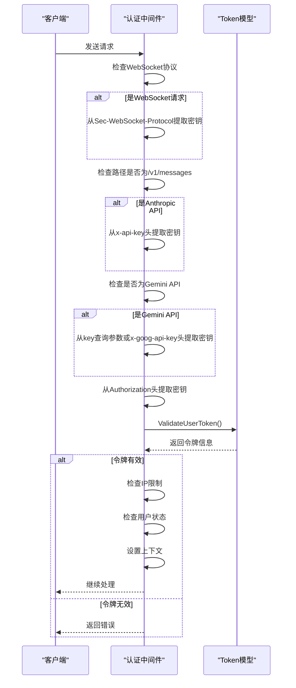

**Diagram sources**
- [auth.go](file://middleware/auth.go#L179-L289)

**Section sources**
- [auth.go](file://middleware/auth.go#L1-L322)

## 认证失败处理

### 常见失败场景
系统对各种认证失败场景进行了详细的处理和反馈，帮助用户和开发者快速定位问题。

| 失败场景 | 错误代码 | 错误信息 | 处理建议 |
|---------|---------|---------|---------|
| 未提供访问令牌 | 401 | 无权进行此操作，未登录且未提供 access token | 检查是否提供了有效的访问令牌 |
| 访问令牌无效 | 401 | 无权进行此操作，access token 无效 | 生成新的访问令牌并重试 |
| New-Api-User缺失 | 401 | 无权进行此操作，未提供 New-Api-User | 在请求头中添加New-Api-User字段 |
| 用户ID不匹配 | 401 | 无权进行此操作，New-Api-User 与登录用户不匹配 | 确保New-Api-User与当前登录用户一致 |
| 用户被封禁 | 200 | 用户已被封禁 | 联系管理员解封账户 |
| 权限不足 | 200 | 无权进行此操作，权限不足 | 使用具有足够权限的账户登录 |
| 2FA验证码错误 | 200 | 验证码或备用码错误，请重试 | 检查验证码是否正确，或使用备用码 |
| 账户被锁定 | 200 | 账户已被锁定，请在XX后重试 | 等待锁定时间结束后重试 |
| IP不在允许列表 | 403 | 您的 IP 不在令牌允许访问的列表中 | 将当前IP添加到令牌的IP限制列表中 |

**Section sources**
- [auth.go](file://middleware/auth.go#L1-L322)
- [twofa.go](file://controller/twofa.go#L1-L555)