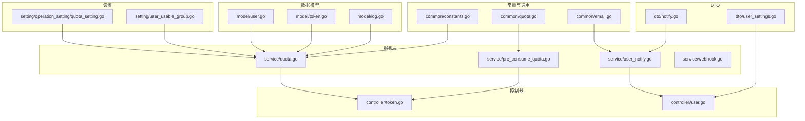
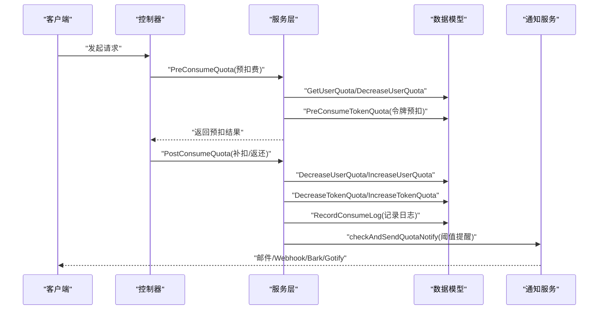
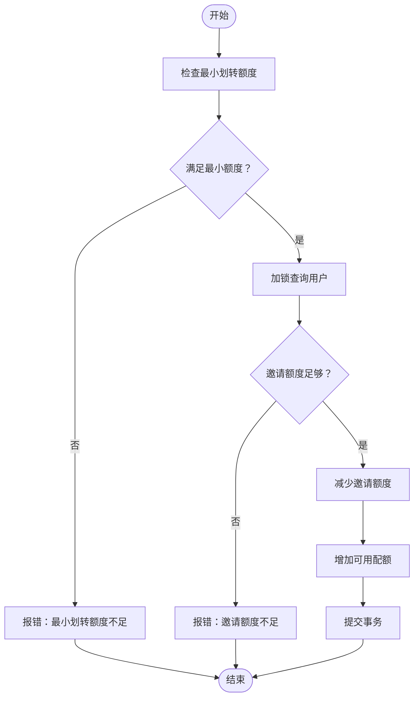
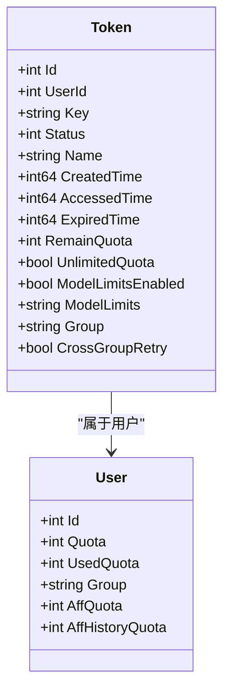
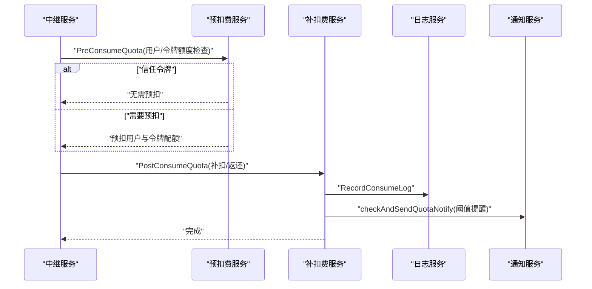
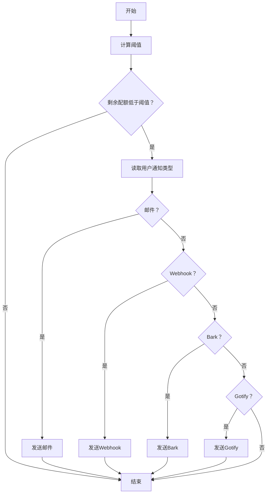
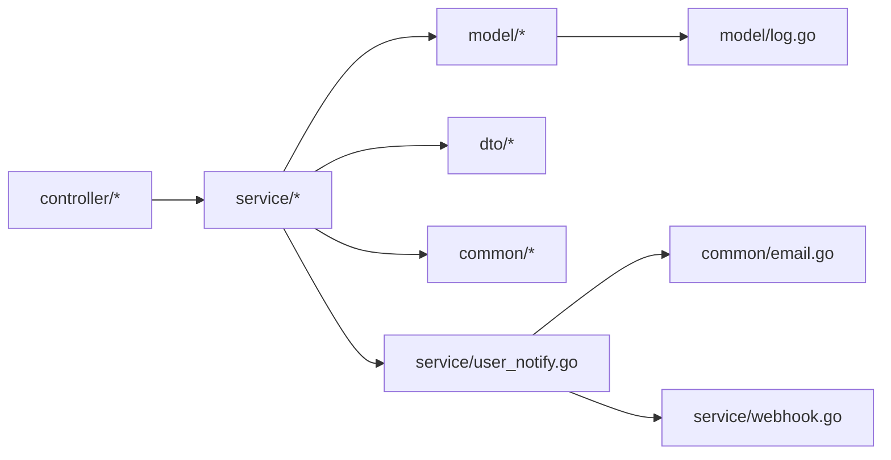

# 配额与令牌管理

<cite>
**本文引用的文件列表**
- [common/constants.go](file://common/constants.go)
- [common/quota.go](file://common/quota.go)
- [common/email.go](file://common/email.go)
- [dto/notify.go](file://dto/notify.go)
- [dto/user_settings.go](file://dto/user_settings.go)
- [model/user.go](file://model/user.go)
- [model/token.go](file://model/token.go)
- [model/log.go](file://model/log.go)
- [service/quota.go](file://service/quota.go)
- [service/pre_consume_quota.go](file://service/pre_consume_quota.go)
- [service/user_notify.go](file://service/user_notify.go)
- [service/webhook.go](file://service/webhook.go)
- [controller/token.go](file://controller/token.go)
- [controller/user.go](file://controller/user.go)
- [setting/operation_setting/quota_setting.go](file://setting/operation_setting/quota_setting.go)
- [setting/user_usable_group.go](file://setting/user_usable_group.go)
</cite>

## 目录
1. [简介](#简介)
2. [项目结构](#项目结构)
3. [核心组件](#核心组件)
4. [架构总览](#架构总览)
5. [详细组件分析](#详细组件分析)
6. [依赖关系分析](#依赖关系分析)
7. [性能考量](#性能考量)
8. [故障排查指南](#故障排查指南)
9. [结论](#结论)
10. [附录](#附录)

## 简介
本文件围绕“配额与令牌管理”主题，系统性梳理用户配额（Quota）、已用配额（UsedQuota）与邀请额度（AffQuota）等核心概念，阐述配额划转、预扣费与补扣费的完整流程，说明API令牌（Token）如何与用户配额关联并实现基于令牌的访问控制与额度管理，并给出配额变更日志记录与额度不足提醒机制（邮件、Webhook、Bark、Gotify）的实现要点与最佳实践。

## 项目结构
围绕配额与令牌管理的关键目录与文件：
- 常量与通用能力：common/constants.go、common/quota.go、common/email.go
- 数据模型：model/user.go、model/token.go、model/log.go
- 服务层：service/quota.go、service/pre_consume_quota.go、service/user_notify.go、service/webhook.go
- 控制器：controller/token.go、controller/user.go
- 设置项：setting/operation_setting/quota_setting.go、setting/user_usable_group.go
- DTO：dto/notify.go、dto/user_settings.go

图表来源
- [common/constants.go](file://common/constants.go#L1-L208)
- [common/quota.go](file://common/quota.go#L1-L6)
- [common/email.go](file://common/email.go#L1-L94)
- [dto/notify.go](file://dto/notify.go#L1-L26)
- [dto/user_settings.go](file://dto/user_settings.go#L1-L23)
- [model/user.go](file://model/user.go#L1-L120)
- [model/token.go](file://model/token.go#L1-L120)
- [model/log.go](file://model/log.go#L1-L120)
- [service/quota.go](file://service/quota.go#L1-L120)
- [service/pre_consume_quota.go](file://service/pre_consume_quota.go#L1-L80)
- [service/user_notify.go](file://service/user_notify.go#L1-L120)
- [service/webhook.go](file://service/webhook.go#L1-L59)
- [controller/token.go](file://controller/token.go#L1-L120)
- [controller/user.go](file://controller/user.go#L1101-L1294)
- [setting/operation_setting/quota_setting.go](file://setting/operation_setting/quota_setting.go#L1-L22)
- [setting/user_usable_group.go](file://setting/user_usable_group.go#L1-L55)

章节来源
- [common/constants.go](file://common/constants.go#L1-L208)
- [model/user.go](file://model/user.go#L1-L120)
- [model/token.go](file://model/token.go#L1-L120)
- [service/quota.go](file://service/quota.go#L1-L120)

## 核心组件
- 用户配额（Quota）与已用配额（UsedQuota）
  - 用户表包含配额与已用配额字段，提供查询与增减操作，支持批量更新与缓存。
- 邀请额度（AffQuota）与历史邀请额度（AffHistoryQuota）
  - 新用户注册、邀请奖励发放、邀请者奖励累计与历史累计；支持将邀请额度划转为可用配额。
- API令牌（Token）
  - 令牌具备剩余额度、无限额度标记、模型限制、分组、跨分组重试等属性；提供令牌校验、额度增减与缓存。
- 预扣费与补扣费
  - 预扣费用于降低交易失败风险；补扣费在实际用量确定后进行多退少补。
- 配额变更日志与通知
  - 记录消费日志；按用户设置触发邮件、Webhook、Bark、Gotify等通知。

章节来源
- [model/user.go](file://model/user.go#L1-L120)
- [model/token.go](file://model/token.go#L1-L120)
- [service/quota.go](file://service/quota.go#L1-L120)
- [service/pre_consume_quota.go](file://service/pre_consume_quota.go#L1-L80)
- [dto/notify.go](file://dto/notify.go#L1-L26)
- [dto/user_settings.go](file://dto/user_settings.go#L1-L23)

## 架构总览
下图展示了从请求到额度结算与通知的整体流程，涵盖预扣费、补扣费、日志记录与通知。

图表来源
- [service/pre_consume_quota.go](file://service/pre_consume_quota.go#L31-L79)
- [service/quota.go](file://service/quota.go#L480-L582)
- [model/log.go](file://model/log.go#L141-L203)
- [service/user_notify.go](file://service/user_notify.go#L25-L80)
- [dto/notify.go](file://dto/notify.go#L1-L26)

## 详细组件分析

### 用户配额与邀请额度（Quota/AffQuota）
- 用户配额（Quota）与已用配额（UsedQuota）
  - 用户表字段包含配额与已用配额，提供查询与增减接口，支持批量更新与缓存。
- 邀请额度（AffQuota）与历史邀请额度（AffHistoryQuota）
  - 新用户注册时可获赠配额；邀请他人注册成功后，邀请者获得奖励额度；支持将邀请额度划转为可用配额。
- 划转规则
  - 最小划转额度为“单位配额”的整数倍；划转采用数据库事务保证一致性，减少邀请额度并增加可用配额。

图表来源
- [model/user.go](file://model/user.go#L339-L374)

章节来源
- [model/user.go](file://model/user.go#L1-L120)
- [model/user.go](file://model/user.go#L339-L374)

### API令牌（Token）与访问控制
- 令牌模型
  - 字段包含剩余额度、无限额度标记、模型限制、允许IP、分组、跨分组重试等；提供令牌校验、额度增减与缓存。
- 访问控制
  - 令牌校验会检查状态、过期时间与剩余额度；支持无限额度令牌跳过预扣费；支持模型限制与IP白名单。
- 令牌额度管理
  - 预扣费与补扣费均会同步更新令牌剩余额度与已用额度；支持批量更新与缓存异步刷新。

图表来源
- [model/token.go](file://model/token.go#L1-L120)
- [model/user.go](file://model/user.go#L1-L120)

章节来源
- [model/token.go](file://model/token.go#L1-L120)
- [controller/token.go](file://controller/token.go#L1-L120)

### 预扣费与补扣费流程
- 预扣费（PreConsumeQuota）
  - 当用户配额充足且令牌额度也充足时，可信任令牌，不进行预扣费；否则按配置的预扣额度进行令牌与用户配额的预扣。
- 补扣费（PostConsumeQuota）
  - 实际用量确定后，根据差额进行补扣或返还；同时更新用户与令牌的配额，并记录消费日志。
- 预扣费返还
  - 若请求失败，服务端会异步返还预扣的配额。

图表来源
- [service/pre_consume_quota.go](file://service/pre_consume_quota.go#L31-L79)
- [service/quota.go](file://service/quota.go#L480-L582)
- [model/log.go](file://model/log.go#L141-L203)
- [service/user_notify.go](file://service/user_notify.go#L25-L80)

章节来源
- [service/pre_consume_quota.go](file://service/pre_consume_quota.go#L1-L80)
- [service/quota.go](file://service/quota.go#L480-L582)

### 配额变更日志与通知机制
- 日志记录
  - 消费日志包含用户、令牌、模型、用量、耗时、分组、其他扩展信息等；支持按用户、模型、时间等维度检索。
- 通知类型与渠道
  - 支持邮件、Webhook、Bark、Gotify四种通知方式；用户可在个人设置中选择通知类型与阈值，并配置对应参数。
- 额度不足提醒
  - 当用户剩余配额低于阈值时，触发提醒通知；支持不同通知类型的差异化内容格式。

图表来源
- [service/quota.go](file://service/quota.go#L535-L582)
- [service/user_notify.go](file://service/user_notify.go#L25-L80)
- [dto/notify.go](file://dto/notify.go#L1-L26)
- [dto/user_settings.go](file://dto/user_settings.go#L1-L23)
- [common/email.go](file://common/email.go#L1-L94)
- [service/webhook.go](file://service/webhook.go#L1-L59)

章节来源
- [model/log.go](file://model/log.go#L141-L203)
- [service/quota.go](file://service/quota.go#L535-L582)
- [service/user_notify.go](file://service/user_notify.go#L1-L256)
- [dto/notify.go](file://dto/notify.go#L1-L26)
- [dto/user_settings.go](file://dto/user_settings.go#L1-L23)
- [common/email.go](file://common/email.go#L1-L94)
- [service/webhook.go](file://service/webhook.go#L1-L59)

### 业务规则与配置要点
- 常量与阈值
  - 单位配额、信任阈值、预扣费额度、新用户初始配额、邀请奖励额度等均在常量中定义。
- 分组与倍率
  - 用户分组与模型倍率影响最终配额计算；系统支持用户自定义分组描述。
- 免费模型预扣
  - 可配置是否对免费模型启用预扣费。

章节来源
- [common/constants.go](file://common/constants.go#L1-L208)
- [common/quota.go](file://common/quota.go#L1-L6)
- [setting/user_usable_group.go](file://setting/user_usable_group.go#L1-L55)
- [setting/operation_setting/quota_setting.go](file://setting/operation_setting/quota_setting.go#L1-L22)

## 依赖关系分析
- 组件耦合
  - 服务层（service）依赖数据模型（model）与DTO；控制器（controller）依赖服务层；通知服务依赖通用邮件与Webhook实现。
- 关键依赖链
  - 预扣费/补扣费依赖用户与令牌模型；通知依赖用户设置与通知DTO；日志依赖日志模型。
- 外部集成点
  - 邮件发送依赖SMTP配置；Webhook发送依赖签名与HTTP客户端；Gotify/Bark依赖外部服务。

图表来源
- [controller/token.go](file://controller/token.go#L1-L120)
- [controller/user.go](file://controller/user.go#L1101-L1294)
- [service/quota.go](file://service/quota.go#L1-L120)
- [service/pre_consume_quota.go](file://service/pre_consume_quota.go#L1-L80)
- [service/user_notify.go](file://service/user_notify.go#L1-L120)
- [service/webhook.go](file://service/webhook.go#L1-L59)
- [common/email.go](file://common/email.go#L1-L94)
- [model/log.go](file://model/log.go#L1-L120)

章节来源
- [controller/token.go](file://controller/token.go#L1-L120)
- [controller/user.go](file://controller/user.go#L1101-L1294)
- [service/quota.go](file://service/quota.go#L1-L120)
- [service/pre_consume_quota.go](file://service/pre_consume_quota.go#L1-L80)
- [service/user_notify.go](file://service/user_notify.go#L1-L120)
- [service/webhook.go](file://service/webhook.go#L1-L59)
- [common/email.go](file://common/email.go#L1-L94)
- [model/log.go](file://model/log.go#L1-L120)

## 性能考量
- 缓存与批量更新
  - 用户与令牌配额支持缓存与批量更新，减少数据库压力；预扣费与补扣费均支持批量更新路径。
- 异步处理
  - 通知与日志写入采用异步协程，避免阻塞主流程。
- 预扣费信任策略
  - 当用户与令牌额度均充足时跳过预扣，降低数据库写入次数。

章节来源
- [service/pre_consume_quota.go](file://service/pre_consume_quota.go#L31-L79)
- [service/quota.go](file://service/quota.go#L480-L582)
- [model/token.go](file://model/token.go#L266-L331)
- [model/user.go](file://model/user.go#L766-L809)

## 故障排查指南
- 令牌状态异常
  - 令牌过期、额度用尽、状态不可用等情况会在校验阶段直接返回错误；可通过控制器接口查看令牌状态与使用情况。
- 额度不足
  - 预扣失败或补扣失败时，检查用户与令牌剩余额度；确认预扣额度配置与信任阈值。
- 通知失败
  - 邮件：检查SMTP配置；Webhook：检查URL、密钥与签名；Bark/Gotify：检查URL、Token与优先级。
- 日志核对
  - 通过消费日志核对用量、模型、分组与耗时；必要时开启IP记录以便定位问题。

章节来源
- [controller/token.go](file://controller/token.go#L66-L136)
- [service/pre_consume_quota.go](file://service/pre_consume_quota.go#L31-L79)
- [service/quota.go](file://service/quota.go#L480-L582)
- [service/user_notify.go](file://service/user_notify.go#L25-L80)
- [common/email.go](file://common/email.go#L1-L94)
- [model/log.go](file://model/log.go#L141-L203)

## 结论
本系统通过“用户配额+令牌额度+预扣费/补扣费”的组合，实现了高可靠、低风险的额度管理机制；配合灵活的通知与日志体系，能够有效支撑业务运营与用户体验。邀请额度划转进一步提升了用户留存与活跃度。建议在生产环境中合理配置信任阈值、预扣额度与通知策略，并结合缓存与批量更新优化性能。

## 附录
- 常用配置项参考
  - 单位配额、信任阈值、预扣额度、新用户初始配额、邀请奖励额度等。
- 用户设置项参考
  - 通知类型、阈值、邮件地址、Webhook URL/密钥、Bark URL、Gotify URL/Token/优先级等。

章节来源
- [common/constants.go](file://common/constants.go#L1-L208)
- [controller/user.go](file://controller/user.go#L1101-L1294)
- [dto/user_settings.go](file://dto/user_settings.go#L1-L23)