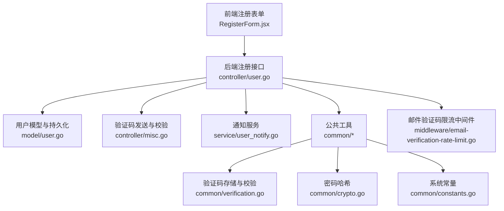
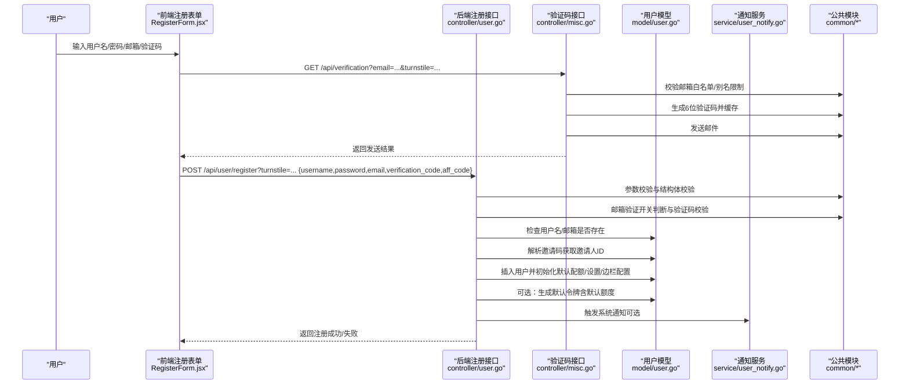
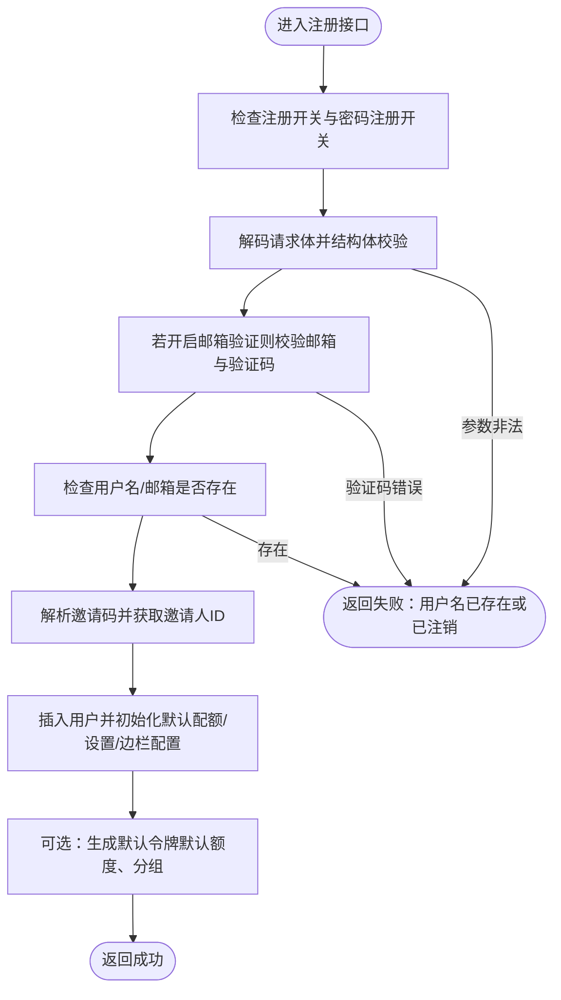
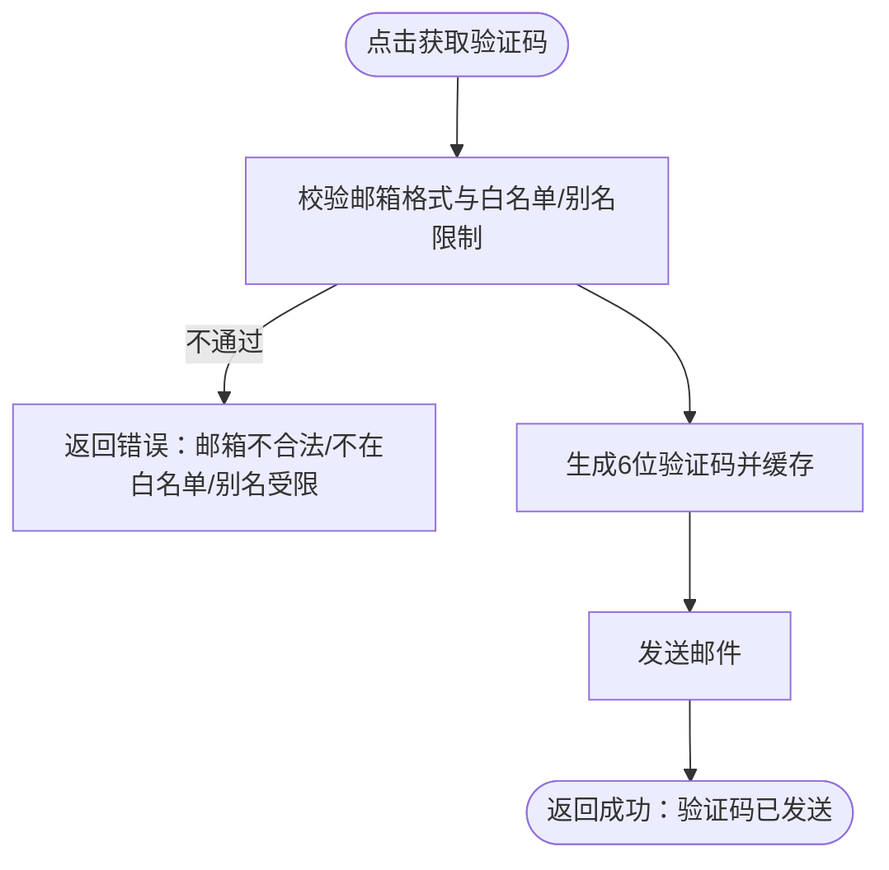
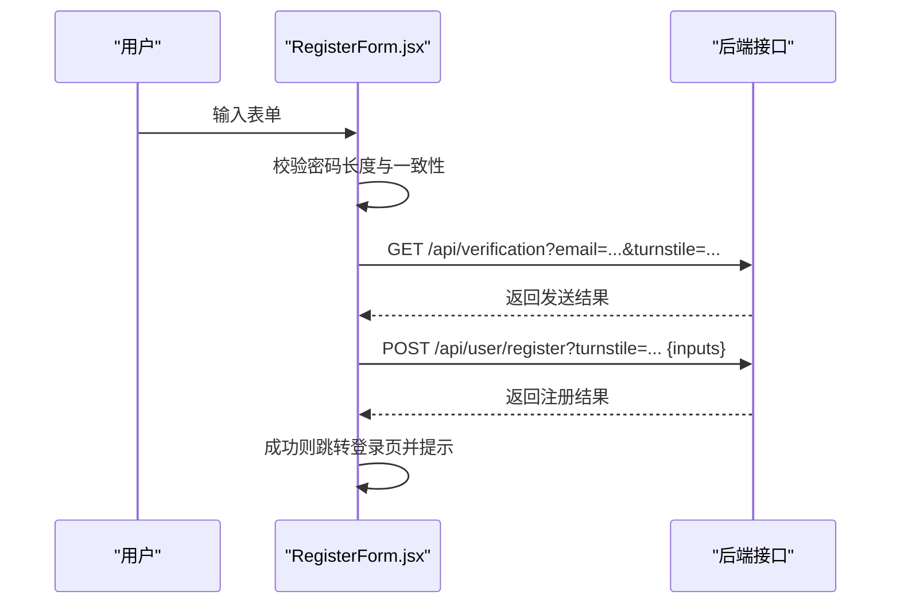
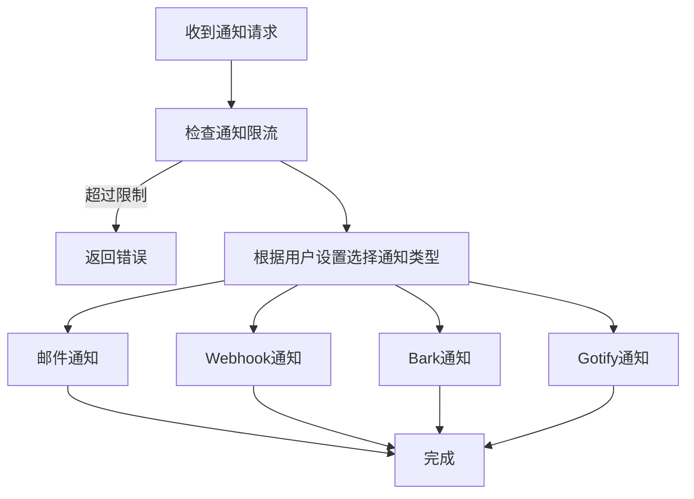
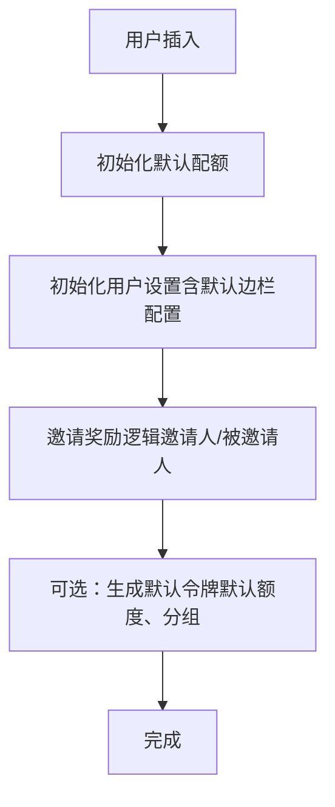
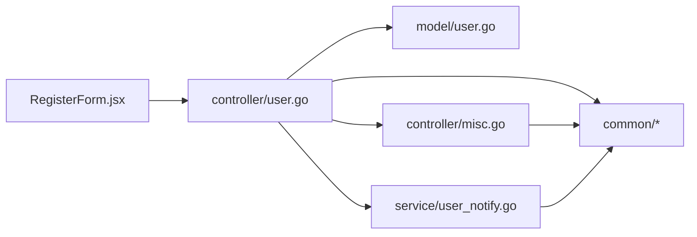

# 用户注册与激活

<cite>
**本文引用的文件列表**
- [controller/user.go](file://controller/user.go)
- [controller/misc.go](file://controller/misc.go)
- [web/src/components/auth/RegisterForm.jsx](file://web/src/components/auth/RegisterForm.jsx)
- [service/user_notify.go](file://service/user_notify.go)
- [model/user.go](file://model/user.go)
- [common/verification.go](file://common/verification.go)
- [common/crypto.go](file://common/crypto.go)
- [common/constants.go](file://common/constants.go)
- [setting/auto_group.go](file://setting/auto_group.go)
- [setting/user_usable_group.go](file://setting/user_usable_group.go)
- [middleware/email-verification-rate-limit.go](file://middleware/email-verification-rate-limit.go)
</cite>

## 目录
1. [简介](#简介)
2. [项目结构与入口](#项目结构与入口)
3. [核心组件](#核心组件)
4. [架构总览](#架构总览)
5. [详细组件分析](#详细组件分析)
6. [依赖关系分析](#依赖关系分析)
7. [性能与安全考量](#性能与安全考量)
8. [故障排查指南](#故障排查指南)
9. [结论](#结论)

## 简介
本文件面向“用户注册与激活”流程，系统性梳理后端控制器、模型、服务与前端表单之间的协作关系，覆盖以下关键点：
- 注册接口的实现逻辑：参数校验、邮箱验证、密码强度校验、邀请码机制
- 邮件通知服务（service/user_notify.go）在注册过程中的调用方式与重发验证邮件能力
- 前端注册表单（RegisterForm.jsx）与后端API的交互流程
- 成功注册后的初始状态设置：默认配额、用户组分配
- 异常处理场景：重复注册、无效邀请码、验证码错误等

## 项目结构与入口
- 后端注册入口位于控制器层，负责接收请求、参数校验、业务规则执行与响应返回
- 前端注册表单负责收集用户输入、触发验证码发送与注册提交
- 邮件通知服务提供统一的通知通道（邮件、Webhook、Bark、Gotify），用于系统消息推送
- 模型层负责用户实体、数据库交互与默认配额/组初始化
- 公共模块提供验证码生成与校验、密码哈希、系统常量等通用能力

图表来源
- [controller/user.go](file://controller/user.go#L145-L274)
- [controller/misc.go](file://controller/misc.go#L200-L269)
- [service/user_notify.go](file://service/user_notify.go#L25-L80)
- [model/user.go](file://model/user.go#L376-L430)
- [common/verification.go](file://common/verification.go#L1-L62)
- [common/crypto.go](file://common/crypto.go#L1-L33)
- [common/constants.go](file://common/constants.go#L43-L52)
- [middleware/email-verification-rate-limit.go](file://middleware/email-verification-rate-limit.go#L57-L81)

章节来源
- [controller/user.go](file://controller/user.go#L145-L274)
- [controller/misc.go](file://controller/misc.go#L200-L269)
- [web/src/components/auth/RegisterForm.jsx](file://web/src/components/auth/RegisterForm.jsx#L180-L221)
- [service/user_notify.go](file://service/user_notify.go#L25-L80)
- [model/user.go](file://model/user.go#L376-L430)
- [common/verification.go](file://common/verification.go#L1-L62)
- [common/crypto.go](file://common/crypto.go#L1-L33)
- [common/constants.go](file://common/constants.go#L43-L52)
- [middleware/email-verification-rate-limit.go](file://middleware/email-verification-rate-limit.go#L57-L81)

## 核心组件
- 后端注册控制器：处理注册请求、参数校验、邮箱验证、邀请码解析、用户创建与默认令牌生成
- 验证码控制器：发送邮箱验证码、校验邮箱白名单/别名限制、记录验证码并发送邮件
- 通知服务：按用户设置选择通知渠道（邮件/Webhook/Bark/Gotify），并做限流与SSRF防护
- 用户模型：负责用户实体、默认配额初始化、邀请奖励与日志记录、边栏配置初始化
- 前端注册表单：收集用户名、密码、邮箱、验证码，触发验证码发送与注册提交
- 公共模块：验证码生成/校验、密码哈希、系统常量（注册开关、邮箱验证开关、默认配额）

章节来源
- [controller/user.go](file://controller/user.go#L145-L274)
- [controller/misc.go](file://controller/misc.go#L200-L269)
- [service/user_notify.go](file://service/user_notify.go#L25-L80)
- [model/user.go](file://model/user.go#L376-L430)
- [web/src/components/auth/RegisterForm.jsx](file://web/src/components/auth/RegisterForm.jsx#L180-L221)
- [common/verification.go](file://common/verification.go#L1-L62)
- [common/crypto.go](file://common/crypto.go#L1-L33)
- [common/constants.go](file://common/constants.go#L43-L52)

## 架构总览
下图展示了从用户在前端填写注册信息到后端完成注册与默认令牌生成的关键步骤。

图表来源
- [web/src/components/auth/RegisterForm.jsx](file://web/src/components/auth/RegisterForm.jsx#L180-L221)
- [web/src/components/auth/RegisterForm.jsx](file://web/src/components/auth/RegisterForm.jsx#L223-L246)
- [controller/user.go](file://controller/user.go#L145-L274)
- [controller/misc.go](file://controller/misc.go#L200-L269)
- [model/user.go](file://model/user.go#L376-L430)
- [service/user_notify.go](file://service/user_notify.go#L25-L80)
- [common/verification.go](file://common/verification.go#L1-L62)
- [common/crypto.go](file://common/crypto.go#L1-L33)

## 详细组件分析

### 后端注册接口（controller/user.go）
- 功能要点
  - 注册开关与密码注册开关控制
  - 参数解码与结构体校验
  - 邮箱验证开关与验证码校验
  - 用户名/邮箱存在性检查
  - 邀请码解析与邀请人ID获取
  - 用户插入与默认配额初始化
  - 可选默认令牌生成（默认额度、分组）
  - 成功响应

- 关键流程图（注册主流程）

图表来源
- [controller/user.go](file://controller/user.go#L145-L274)
- [model/user.go](file://model/user.go#L376-L430)

章节来源
- [controller/user.go](file://controller/user.go#L145-L274)

### 邮箱验证码发送与校验（controller/misc.go）
- 功能要点
  - 邮箱格式与白名单/别名限制校验
  - 生成6位验证码并缓存（带有效期）
  - 发送邮件通知
  - 重发验证码时的限流控制

- 重发验证码流程图

图表来源
- [controller/misc.go](file://controller/misc.go#L200-L269)
- [middleware/email-verification-rate-limit.go](file://middleware/email-verification-rate-limit.go#L57-L81)

章节来源
- [controller/misc.go](file://controller/misc.go#L200-L269)
- [middleware/email-verification-rate-limit.go](file://middleware/email-verification-rate-limit.go#L57-L81)

### 前端注册表单（web/src/components/auth/RegisterForm.jsx）
- 功能要点
  - 收集用户名、密码、确认密码、邮箱、验证码
  - 密码长度与一致性校验
  - 触发验证码发送（支持Turnstile）
  - 提交注册请求（携带邀请码与Turnstile）
  - 成功/失败提示与路由跳转

- 前端交互序列图

图表来源
- [web/src/components/auth/RegisterForm.jsx](file://web/src/components/auth/RegisterForm.jsx#L180-L221)
- [web/src/components/auth/RegisterForm.jsx](file://web/src/components/auth/RegisterForm.jsx#L223-L246)

章节来源
- [web/src/components/auth/RegisterForm.jsx](file://web/src/components/auth/RegisterForm.jsx#L180-L221)
- [web/src/components/auth/RegisterForm.jsx](file://web/src/components/auth/RegisterForm.jsx#L223-L246)

### 通知服务（service/user_notify.go）
- 功能要点
  - 根据用户设置选择通知类型（邮件/Webhook/Bark/Gotify）
  - 通知限流检查
  - SSRF防护与Worker模式支持
  - 邮件发送、Bark、Gotify等通道实现

- 通知调用流程图

图表来源
- [service/user_notify.go](file://service/user_notify.go#L25-L80)
- [service/user_notify.go](file://service/user_notify.go#L82-L256)

章节来源
- [service/user_notify.go](file://service/user_notify.go#L25-L80)
- [service/user_notify.go](file://service/user_notify.go#L82-L256)

### 用户模型与默认状态（model/user.go）
- 功能要点
  - 用户插入时初始化默认配额、邀请码、设置与边栏配置
  - 邀请奖励与日志记录
  - 默认令牌生成（可选）

- 默认配额与边栏配置初始化流程

图表来源
- [model/user.go](file://model/user.go#L376-L430)

章节来源
- [model/user.go](file://model/user.go#L376-L430)

### 邀请码机制与用户组分配
- 邀请码解析
  - 注册时解析邀请码，获取邀请人ID
  - 被邀请人与邀请人均有额度奖励与日志记录
- 用户组分配
  - 默认用户组为“default”
  - 若开启自动分组策略，则默认令牌分组为“auto”
  - 用户可用分组可通过系统设置管理

章节来源
- [controller/user.go](file://controller/user.go#L208-L223)
- [model/user.go](file://model/user.go#L376-L430)
- [setting/auto_group.go](file://setting/auto_group.go#L1-L38)
- [setting/user_usable_group.go](file://setting/user_usable_group.go#L1-L55)

### 密码强度与哈希（common/crypto.go）
- 密码强度
  - 前端要求密码长度≥8
  - 后端结构体校验包含最小长度约束
- 密码哈希
  - 使用bcrypt进行哈希存储
  - 登录时进行密码与哈希比对

章节来源
- [web/src/components/auth/RegisterForm.jsx](file://web/src/components/auth/RegisterForm.jsx#L184-L192)
- [controller/user.go](file://controller/user.go#L169-L175)
- [common/crypto.go](file://common/crypto.go#L1-L33)

### 验证码生成与校验（common/verification.go）
- 验证码生成：6位随机码
- 验证码缓存：按目的+键存储，带过期时间
- 验证码校验：比较当前码与缓存码，且未过期

章节来源
- [common/verification.go](file://common/verification.go#L1-L62)
- [controller/misc.go](file://controller/misc.go#L200-L269)
- [controller/user.go](file://controller/user.go#L176-L191)

## 依赖关系分析
- 控制器依赖
  - controller/user.go 依赖 model/user.go、common/*、setting/*
  - controller/misc.go 依赖 common/*、model/user.go
  - service/user_notify.go 依赖 dto、setting/system_setting、common/*
- 前端依赖
  - RegisterForm.jsx 通过API模块调用后端接口
- 中间件
  - 邮件验证码发送限流中间件保护后端接口

图表来源
- [controller/user.go](file://controller/user.go#L145-L274)
- [controller/misc.go](file://controller/misc.go#L200-L269)
- [service/user_notify.go](file://service/user_notify.go#L25-L80)
- [model/user.go](file://model/user.go#L376-L430)
- [web/src/components/auth/RegisterForm.jsx](file://web/src/components/auth/RegisterForm.jsx#L180-L221)

章节来源
- [controller/user.go](file://controller/user.go#L145-L274)
- [controller/misc.go](file://controller/misc.go#L200-L269)
- [service/user_notify.go](file://service/user_notify.go#L25-L80)
- [model/user.go](file://model/user.go#L376-L430)
- [web/src/components/auth/RegisterForm.jsx](file://web/src/components/auth/RegisterForm.jsx#L180-L221)

## 性能与安全考量
- 验证码限流
  - 通过内存或Redis限流中间件控制验证码发送频率，避免滥用
- 邮件发送
  - 通知服务支持Worker模式与SSRF防护，降低风险
- 密码安全
  - bcrypt哈希存储，避免明文密码
- 参数校验
  - 后端结构体校验与前端输入校验共同保障数据合法性

章节来源
- [middleware/email-verification-rate-limit.go](file://middleware/email-verification-rate-limit.go#L57-L81)
- [service/user_notify.go](file://service/user_notify.go#L82-L256)
- [common/crypto.go](file://common/crypto.go#L1-L33)
- [controller/user.go](file://controller/user.go#L169-L175)

## 故障排查指南
- 常见异常与响应策略
  - 注册开关关闭：返回“管理员关闭了新用户注册”
  - 密码注册关闭：返回“管理员关闭了通过密码进行注册”
  - 参数非法：返回“无效的参数”或“输入不合法”
  - 邮箱验证开启但未提供邮箱/验证码：返回“请提供邮箱地址和验证码”
  - 验证码错误或过期：返回“验证码错误或已过期”
  - 用户名/邮箱已存在：返回“用户名已存在，或已注销”
  - 数据库错误：返回“数据库错误，请稍后重试”
  - 邮箱已被占用：验证码发送接口返回“邮箱地址已被占用”
  - 验证码发送过于频繁：返回“发送过于频繁，请稍后再试”

- 排查建议
  - 确认系统常量中注册与邮箱验证开关状态
  - 检查SMTP配置与邮件发送链路
  - 核对验证码有效期与缓存状态
  - 检查限流中间件配置与Redis连接

章节来源
- [controller/user.go](file://controller/user.go#L145-L207)
- [controller/misc.go](file://controller/misc.go#L200-L269)
- [middleware/email-verification-rate-limit.go](file://middleware/email-verification-rate-limit.go#L57-L81)
- [common/constants.go](file://common/constants.go#L43-L52)

## 结论
本流程围绕“注册—邮箱验证—邀请奖励—默认状态初始化—通知”的主线展开，前后端职责清晰、依赖关系明确。通过严格的参数校验、验证码与限流保护、密码哈希与通知服务，系统在保证安全性的同时提供了良好的用户体验。后续可在邀请奖励日志可视化、通知渠道扩展与限流策略精细化方面持续优化。