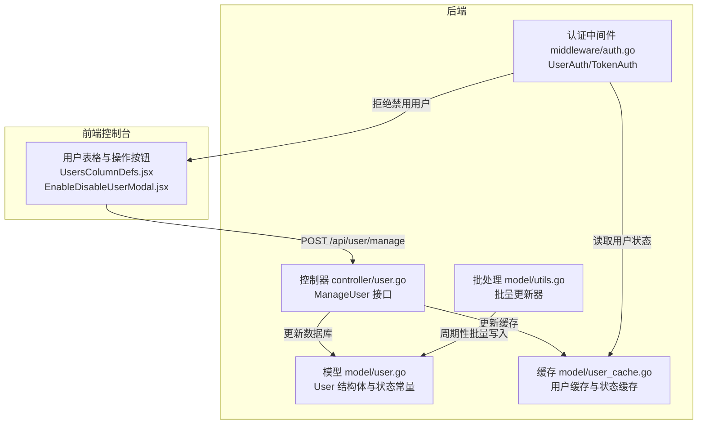
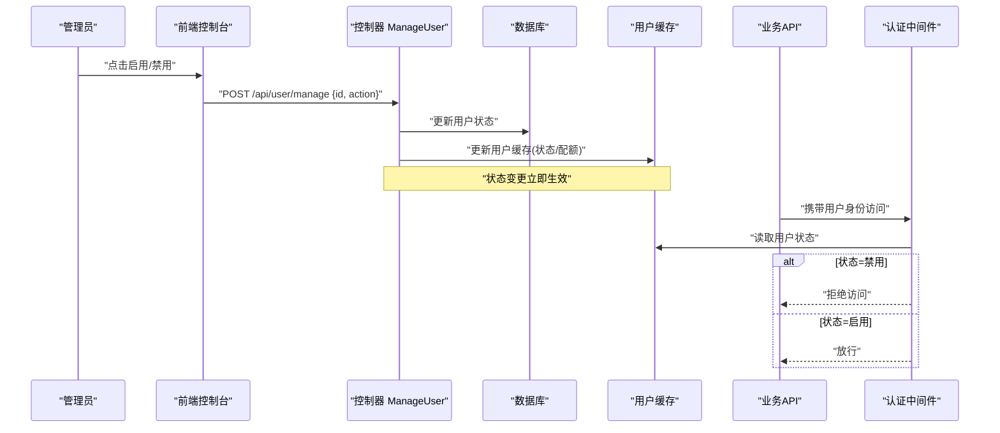
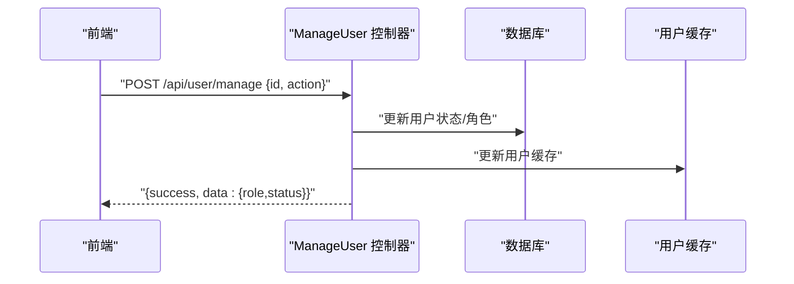
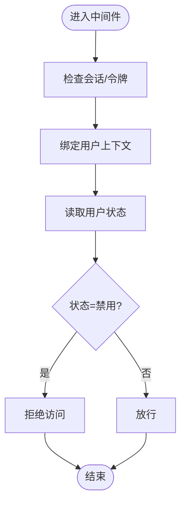
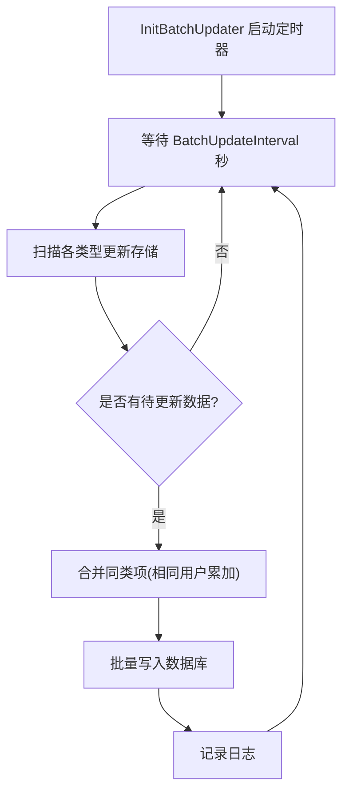
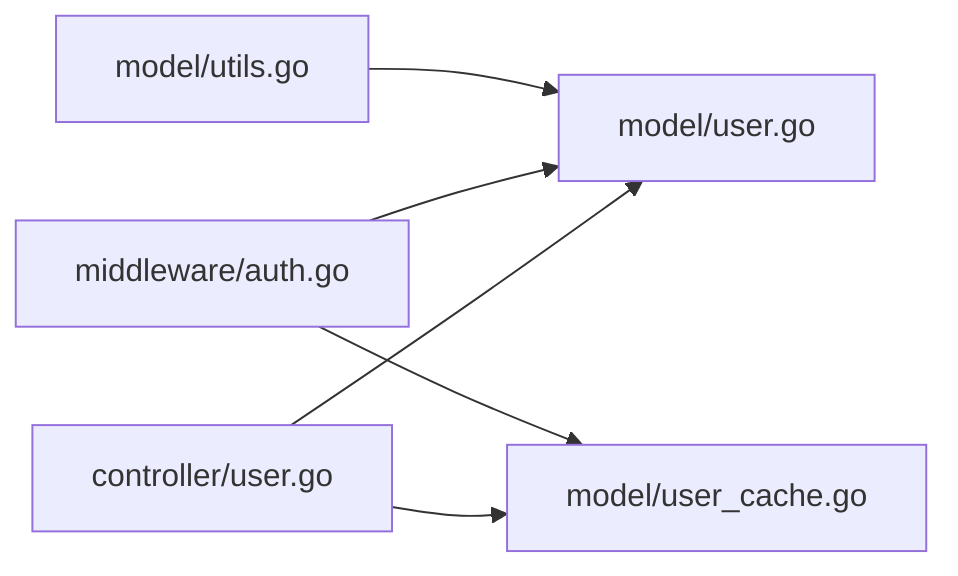

# 用户状态控制

<cite>
**本文引用的文件**
- [model/user.go](file://model/user.go)
- [controller/user.go](file://controller/user.go)
- [middleware/auth.go](file://middleware/auth.go)
- [model/user_cache.go](file://model/user_cache.go)
- [common/constants.go](file://common/constants.go)
- [model/utils.go](file://model/utils.go)
- [service/pre_consume_quota.go](file://service/pre_consume_quota.go)
- [web/src/components/table/users/UsersColumnDefs.jsx](file://web/src/components/table/users/UsersColumnDefs.jsx)
- [web/src/hooks/users/useUsersData.jsx](file://web/src/hooks/users/useUsersData.jsx)
- [web/src/components/table/users/modals/EnableDisableUserModal.jsx](file://web/src/components/table/users/modals/EnableDisableUserModal.jsx)
</cite>

## 目录
1. [简介](#简介)
2. [项目结构](#项目结构)
3. [核心组件](#核心组件)
4. [架构总览](#架构总览)
5. [详细组件分析](#详细组件分析)
6. [依赖关系分析](#依赖关系分析)
7. [性能考量](#性能考量)
8. [故障排查指南](#故障排查指南)
9. [结论](#结论)
10. [附录](#附录)

## 简介
本文件围绕“用户启用/禁用状态”的管理机制展开，重点覆盖：
- User 模型中 Status 字段的定义与数据库存储方式
- 管理员通过控制台修改用户状态的 API 调用链路
- 该操作如何实时影响用户的 API 访问权限（结合 auth 中间件验证逻辑）
- 用户被禁用时的配额冻结行为与正在进行的请求处理策略
- 批量更新用户状态的后台任务实现方式与性能优化措施

## 项目结构
本项目采用典型的分层架构：控制器（controller）、中间件（middleware）、模型（model）、服务（service）、前端（web）等模块协同工作。用户状态控制涉及以下关键路径：
- 控制台前端通过 /api/user/manage 发起状态变更请求
- 后端控制器解析请求、校验权限并持久化到数据库
- 中间件在后续 API 请求中读取用户状态，拒绝禁用用户访问
- 缓存层（Redis）用于加速用户状态与配额的读取
- 批量更新器按周期聚合配额变更，减少数据库写压力

图表来源
- [controller/user.go](file://controller/user.go#L884-L991)
- [middleware/auth.go](file://middleware/auth.go#L30-L144)
- [model/user.go](file://model/user.go#L20-L40)
- [model/user_cache.go](file://model/user_cache.go#L47-L113)
- [model/utils.go](file://model/utils.go#L33-L98)

章节来源
- [controller/user.go](file://controller/user.go#L884-L991)
- [middleware/auth.go](file://middleware/auth.go#L30-L144)
- [model/user.go](file://model/user.go#L20-L40)
- [model/user_cache.go](file://model/user_cache.go#L47-L113)
- [model/utils.go](file://model/utils.go#L33-L98)

## 核心组件
- User 模型与状态常量
  - User 结构体包含 Status 字段，并在数据库中以整型存储，默认值为启用状态
  - 状态常量定义了启用与禁用两种状态
- 控制器 ManageUser 接口
  - 接收管理员请求，执行启用/禁用/删除/晋升/降级等操作
  - 对超级管理员用户施加额外保护（不可禁用/删除）
- 认证中间件
  - 在用户态与令牌态两条路径均校验用户状态，若为禁用则直接拒绝
- 缓存与批处理
  - 用户缓存包含状态字段；配额缓存支持原子增量/减量
  - 批量更新器按固定间隔聚合写入，降低数据库写放大

章节来源
- [model/user.go](file://model/user.go#L20-L40)
- [common/constants.go](file://common/constants.go#L176-L188)
- [controller/user.go](file://controller/user.go#L884-L991)
- [middleware/auth.go](file://middleware/auth.go#L30-L144)
- [model/user_cache.go](file://model/user_cache.go#L47-L113)
- [model/utils.go](file://model/utils.go#L33-L98)

## 架构总览
下图展示了从控制台发起状态变更到中间件拦截请求的完整链路，以及状态变更对后续 API 访问的影响。

图表来源
- [controller/user.go](file://controller/user.go#L884-L991)
- [middleware/auth.go](file://middleware/auth.go#L30-L144)
- [model/user_cache.go](file://model/user_cache.go#L47-L113)

## 详细组件分析

### User 模型与状态字段
- 字段定义
  - Status 为整型字段，数据库默认值为启用状态
  - 与之配套的状态常量定义了启用与禁用两个枚举值
- 数据存储
  - Status 存储于数据库表 users 的对应列，类型为整型
- 读取与缓存
  - 用户缓存包含 Status 字段，支持从 Redis 读取，失败时回退数据库
  - 状态变更后，控制器会同步更新缓存，确保中间件读取到最新状态

章节来源
- [model/user.go](file://model/user.go#L20-L40)
- [common/constants.go](file://common/constants.go#L176-L188)
- [model/user_cache.go](file://model/user_cache.go#L47-L113)

### 管理员控制台修改用户状态的 API 调用链
- 前端交互
  - 用户表格渲染状态标签，启用/禁用/已注销状态分别以不同颜色标识
  - 启用/禁用弹窗确认后触发管理操作
- 控制器处理
  - ManageUser 接口接收 {id, action} 请求
  - 支持动作：disable、enable、delete、promote、demote
  - 对超级管理员用户施加保护：不可禁用/删除/晋升
  - 成功后返回更新后的角色与状态
- 权限校验
  - 调用方角色需低于被操作用户，除非是根用户
- 数据持久化与缓存
  - 更新数据库后，控制器会更新用户缓存，确保中间件读取到最新状态

图表来源
- [controller/user.go](file://controller/user.go#L884-L991)
- [web/src/components/table/users/UsersColumnDefs.jsx](file://web/src/components/table/users/UsersColumnDefs.jsx#L95-L134)
- [web/src/hooks/users/useUsersData.jsx](file://web/src/hooks/users/useUsersData.jsx#L123-L172)
- [web/src/components/table/users/modals/EnableDisableUserModal.jsx](file://web/src/components/table/users/modals/EnableDisableUserModal.jsx#L1-L46)

章节来源
- [controller/user.go](file://controller/user.go#L884-L991)
- [web/src/components/table/users/UsersColumnDefs.jsx](file://web/src/components/table/users/UsersColumnDefs.jsx#L95-L134)
- [web/src/hooks/users/useUsersData.jsx](file://web/src/hooks/users/useUsersData.jsx#L123-L172)
- [web/src/components/table/users/modals/EnableDisableUserModal.jsx](file://web/src/components/table/users/modals/EnableDisableUserModal.jsx#L1-L46)

### 中间件验证逻辑与实时生效
- 用户态中间件
  - 从会话读取用户信息，若无会话则尝试 Access Token
  - 校验 New-Api-User 头与登录用户一致
  - 若用户状态为禁用，则直接拒绝
- 令牌态中间件
  - 从令牌缓存读取用户状态，若为禁用则拒绝
- 实时性
  - 状态变更后，控制器更新缓存；中间件优先从缓存读取，保证即时生效

图表来源
- [middleware/auth.go](file://middleware/auth.go#L30-L144)
- [middleware/auth.go](file://middleware/auth.go#L179-L322)
- [model/user_cache.go](file://model/user_cache.go#L47-L113)

章节来源
- [middleware/auth.go](file://middleware/auth.go#L30-L144)
- [middleware/auth.go](file://middleware/auth.go#L179-L322)
- [model/user_cache.go](file://model/user_cache.go#L47-L113)

### 用户被禁用时的配额冻结与请求处理
- 配额冻结
  - 用户被禁用后，其配额不再变化（缓存与数据库均不再增加/减少）
  - 预扣费与消费流程在禁用状态下不会继续
- 正在进行的请求处理策略
  - 对于已建立连接的请求，中间件在进入业务处理前已完成状态校验
  - 若请求在中间件阶段即被拒绝，则不会产生新的配额消耗
  - 对于已开始的请求，若业务层依赖预扣费/消费，应在预扣费阶段因额度不足而失败

章节来源
- [service/pre_consume_quota.go](file://service/pre_consume_quota.go#L31-L80)
- [middleware/auth.go](file://middleware/auth.go#L179-L322)

### 批量更新用户状态的后台任务与性能优化
- 批量更新器
  - 通过全局开关与周期配置，定时触发批量写入
  - 将同一用户多条更新合并为一次写入，减少数据库压力
- 性能优化
  - 使用内存映射存储待更新记录，避免频繁分配
  - 定时器按固定间隔扫描，避免热点写放大
  - 只在有数据时执行，空闲时自动休眠

图表来源
- [model/utils.go](file://model/utils.go#L33-L98)

章节来源
- [model/utils.go](file://model/utils.go#L33-L98)

## 依赖关系分析
- 控制器依赖模型与缓存模块，负责状态变更与缓存更新
- 中间件依赖缓存模块，负责状态读取与访问控制
- 批量更新器独立运行，定期汇总并写入数据库

图表来源
- [controller/user.go](file://controller/user.go#L884-L991)
- [middleware/auth.go](file://middleware/auth.go#L30-L144)
- [model/user.go](file://model/user.go#L20-L40)
- [model/user_cache.go](file://model/user_cache.go#L47-L113)
- [model/utils.go](file://model/utils.go#L33-L98)

章节来源
- [controller/user.go](file://controller/user.go#L884-L991)
- [middleware/auth.go](file://middleware/auth.go#L30-L144)
- [model/user.go](file://model/user.go#L20-L40)
- [model/user_cache.go](file://model/user_cache.go#L47-L113)
- [model/utils.go](file://model/utils.go#L33-L98)

## 性能考量
- 缓存命中优先：中间件优先从 Redis 读取用户状态，失败再回退数据库
- 批量写入：配额与状态变更通过批量更新器合并写入，降低数据库写放大
- 预扣费与信任策略：在额度充足时可跳过预扣费，减少不必要的数据库写操作
- 并发安全：批量更新器使用互斥锁保护共享存储，避免竞态

[本节为通用指导，无需特定文件引用]

## 故障排查指南
- 管理员无法禁用/删除超级管理员
  - 现象：接口返回“无法禁用/删除超级管理员用户”
  - 原因：控制器对超级管理员施加保护
  - 处理：仅根用户可执行相关操作
- 禁用用户仍可访问
  - 现象：用户被禁用后仍能访问 API
  - 原因：缓存未及时更新或中间件未读取缓存
  - 处理：确认控制器已更新缓存；检查 Redis 是否可用；确认中间件读取顺序
- 预扣费失败
  - 现象：请求被拒绝，提示额度不足
  - 原因：用户剩余额度不足或预扣费额度超过剩余
  - 处理：检查用户配额；调整预扣费策略；确认令牌额度情况

章节来源
- [controller/user.go](file://controller/user.go#L884-L991)
- [middleware/auth.go](file://middleware/auth.go#L30-L144)
- [service/pre_consume_quota.go](file://service/pre_consume_quota.go#L31-L80)

## 结论
- 用户状态通过整型字段在数据库中持久化，状态常量统一管理
- 管理员通过控制台发起状态变更，控制器更新数据库与缓存，中间件实时生效
- 禁用用户将被中间件拒绝访问，配额不再变化；正在处理的请求在中间件阶段即可被拦截
- 批量更新器通过定时聚合写入，显著降低数据库写压力，配合缓存实现高并发下的低延迟访问

[本节为总结性内容，无需特定文件引用]

## 附录
- 状态字段与常量定义位置
  - [model/user.go](file://model/user.go#L20-L40)
  - [common/constants.go](file://common/constants.go#L176-L188)
- 前端状态显示与操作入口
  - [web/src/components/table/users/UsersColumnDefs.jsx](file://web/src/components/table/users/UsersColumnDefs.jsx#L95-L134)
  - [web/src/hooks/users/useUsersData.jsx](file://web/src/hooks/users/useUsersData.jsx#L123-L172)
  - [web/src/components/table/users/modals/EnableDisableUserModal.jsx](file://web/src/components/table/users/modals/EnableDisableUserModal.jsx#L1-L46)