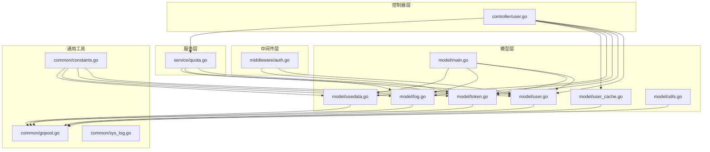
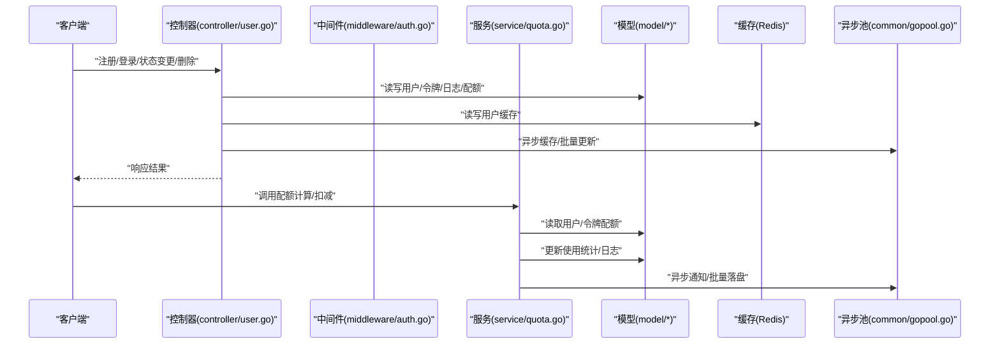
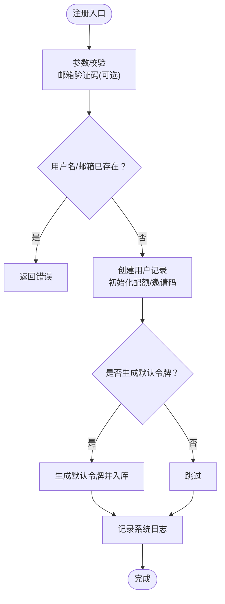
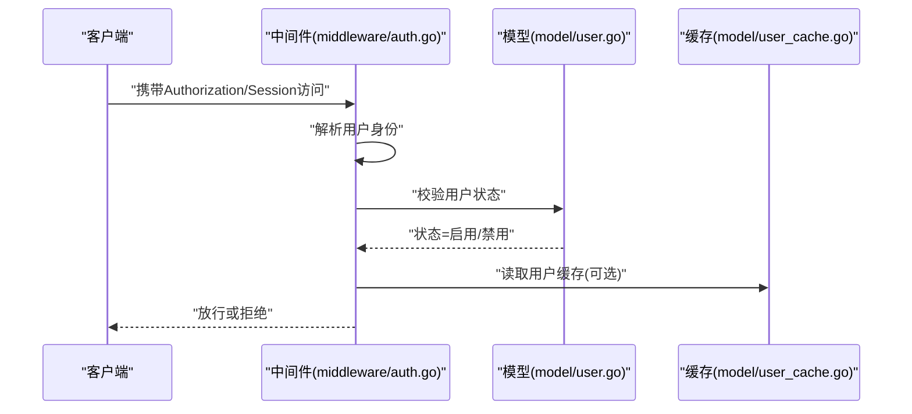
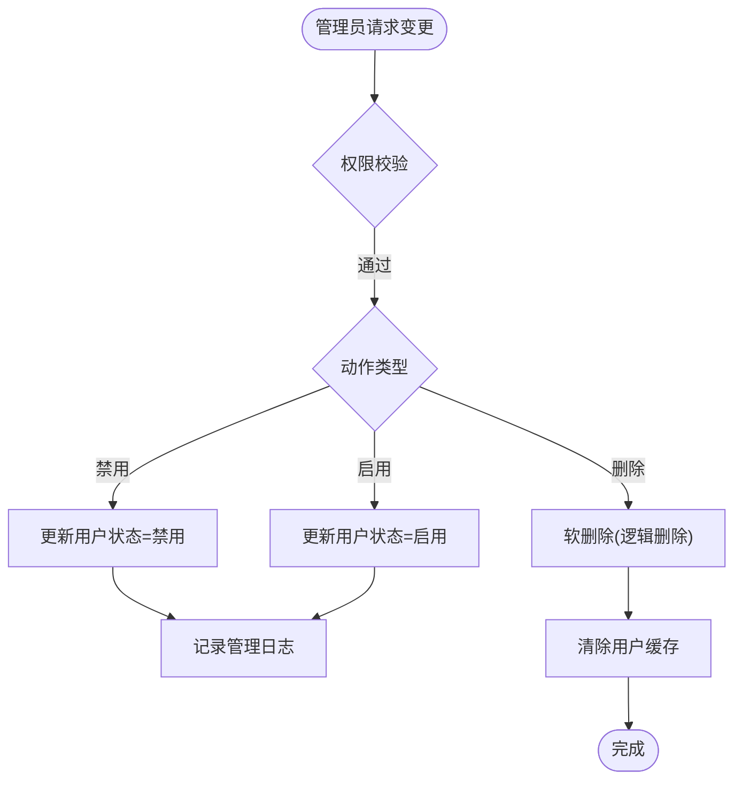
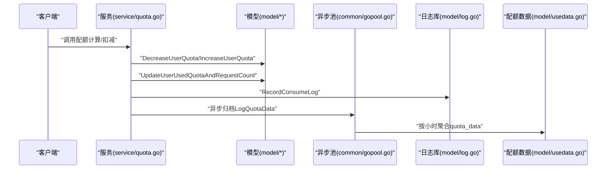
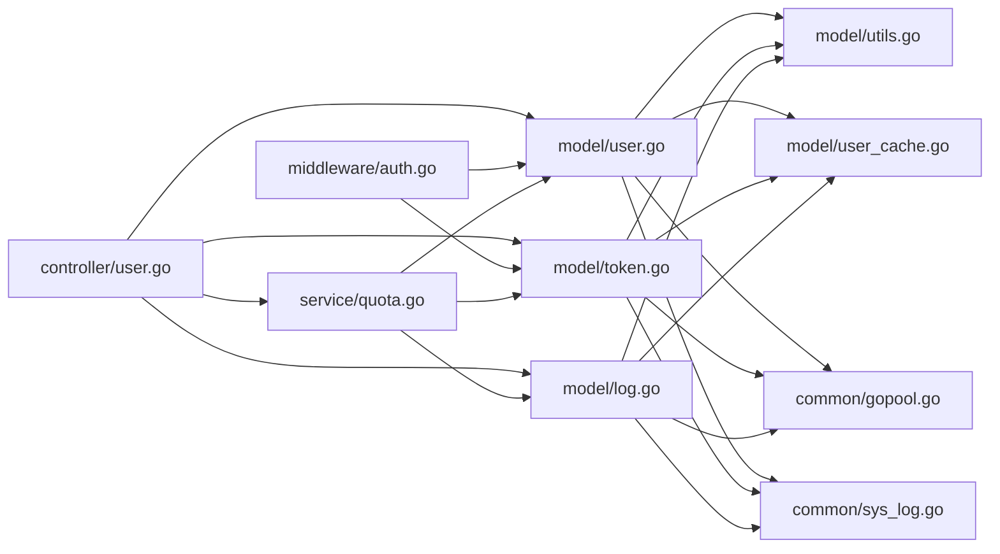

# 用户生命周期管理

<cite>
**本文引用的文件**
- [controller/user.go](file://controller/user.go)
- [model/user.go](file://model/user.go)
- [model/user_cache.go](file://model/user_cache.go)
- [middleware/auth.go](file://middleware/auth.go)
- [service/quota.go](file://service/quota.go)
- [common/gopool.go](file://common/gopool.go)
- [common/sys_log.go](file://common/sys_log.go)
- [model/log.go](file://model/log.go)
- [model/token.go](file://model/token.go)
- [model/utils.go](file://model/utils.go)
- [model/main.go](file://model/main.go)
- [common/constants.go](file://common/constants.go)
- [controller/usedata.go](file://controller/usedata.go)
- [model/usedata.go](file://model/usedata.go)
</cite>

## 目录
1. [简介](#简介)
2. [项目结构](#项目结构)
3. [核心组件](#核心组件)
4. [架构总览](#架构总览)
5. [详细组件分析](#详细组件分析)
6. [依赖关系分析](#依赖关系分析)
7. [性能考量](#性能考量)
8. [故障排查指南](#故障排查指南)
9. [结论](#结论)
10. [附录](#附录)

## 简介
本文件面向开发者与运维人员，系统化阐述用户从注册、激活、正常使用到禁用或删除的全生命周期管理流程；解释用户状态（启用/禁用）的控制逻辑及其对API访问的影响；说明用户删除操作的软删除机制（DeletedAt字段）与数据清理策略；描述用户配额初始化、使用统计更新、历史数据归档的处理方式；并给出异步任务（GoPool）在批量用户处理中的应用示例与日志记录规范。

## 项目结构
围绕用户生命周期的关键模块分布如下：
- 控制器层：用户注册、登录、信息维护、状态变更、删除等入口
- 模型层：用户实体、令牌、日志、配额数据、缓存与批量更新工具
- 中间件层：认证鉴权、令牌校验、用户状态校验
- 服务层：配额计算、消费与通知
- 通用工具：异步池、系统日志、常量定义

图表来源
- [controller/user.go](file://controller/user.go#L1-L1295)
- [model/user.go](file://model/user.go#L1-L932)
- [model/user_cache.go](file://model/user_cache.go#L1-L220)
- [middleware/auth.go](file://middleware/auth.go#L1-L322)
- [service/quota.go](file://service/quota.go#L1-L582)
- [common/gopool.go](file://common/gopool.go#L1-L26)
- [common/sys_log.go](file://common/sys_log.go#L1-L56)
- [model/log.go](file://model/log.go#L1-L412)
- [model/token.go](file://model/token.go#L1-L366)
- [model/utils.go](file://model/utils.go#L1-L112)
- [model/main.go](file://model/main.go#L1-L479)
- [common/constants.go](file://common/constants.go#L1-L208)

章节来源
- [controller/user.go](file://controller/user.go#L1-L1295)
- [model/user.go](file://model/user.go#L1-L932)
- [middleware/auth.go](file://middleware/auth.go#L1-L322)

## 核心组件
- 用户模型与状态：用户实体包含状态字段、配额、使用统计、分组、备注、设置等；提供启用/禁用、登录校验、配额读写、缓存同步等能力。
- 令牌模型：令牌与用户关联，支持状态、过期、限额、跨分组重试、IP白名单等；提供令牌校验与配额扣减/增加。
- 日志与配额归档：消费日志记录、统计数据聚合、历史配额数据归档。
- 缓存与批量更新：用户缓存（Redis哈希）、批量更新队列，降低数据库压力。
- 异步任务：统一GoPool池，用于缓存更新、日志归档、配额批量落盘等。

章节来源
- [model/user.go](file://model/user.go#L1-L932)
- [model/token.go](file://model/token.go#L1-L366)
- [model/log.go](file://model/log.go#L1-L412)
- [model/usedata.go](file://model/usedata.go#L1-L128)
- [model/utils.go](file://model/utils.go#L1-L112)
- [common/gopool.go](file://common/gopool.go#L1-L26)

## 架构总览
用户生命周期管理贯穿“控制器-模型-中间件-服务-日志/缓存”的链路，关键流程包括：
- 注册：参数校验、邮箱验证码（可选）、唯一性检查、初始化配额与默认令牌、记录系统日志。
- 登录：密码校验、状态校验、2FA（可选）、会话建立、返回用户信息。
- 使用：令牌校验、用户状态校验、配额计算与扣减、使用统计更新、日志记录。
- 状态变更：管理员端启用/禁用、删除（软删），权限校验与日志记录。
- 删除：软删除（逻辑删除，DeletedAt非空）与硬删除（物理删除），缓存失效。
- 历史数据：消费日志与配额数据按小时聚合，支持导出与趋势分析。

图表来源
- [controller/user.go](file://controller/user.go#L1-L1295)
- [middleware/auth.go](file://middleware/auth.go#L1-L322)
- [service/quota.go](file://service/quota.go#L1-L582)
- [model/user.go](file://model/user.go#L1-L932)
- [model/token.go](file://model/token.go#L1-L366)
- [model/log.go](file://model/log.go#L1-L412)
- [common/gopool.go](file://common/gopool.go#L1-L26)

## 详细组件分析

### 用户注册与激活
- 参数校验与邮箱验证码（可选）：注册接口对输入进行校验，若开启邮箱验证则要求提供邮箱与验证码。
- 唯一性检查：用户名/邮箱存在性检查（包含已删除记录）。
- 初始化配额与默认令牌：新用户初始化配额，可选择生成默认令牌并设置分组、无限额度等。
- 记录系统日志：赠送额度与邀请奖励等事件记录。

图表来源
- [controller/user.go](file://controller/user.go#L145-L274)
- [model/user.go](file://model/user.go#L376-L429)
- [common/sys_log.go](file://common/sys_log.go#L1-L56)

章节来源
- [controller/user.go](file://controller/user.go#L145-L274)
- [model/user.go](file://model/user.go#L376-L429)

### 登录与会话
- 密码校验与状态校验：登录时校验密码与用户状态（启用/禁用）。
- 2FA支持：若启用双因素认证，则登录后进入待验证状态，后续完成验证再建立会话。
- 会话建立：写入session（id/username/role/status/group），返回用户信息。

章节来源
- [controller/user.go](file://controller/user.go#L30-L143)
- [model/user.go](file://model/user.go#L500-L517)

### API访问控制与用户状态影响
- 用户认证中间件：优先从session读取用户信息，否则从access token校验；校验用户状态（禁用则拒绝）。
- 令牌认证中间件：解析Authorization头，校验令牌有效性、过期、额度、IP白名单；读取用户缓存并校验用户状态。
- 状态影响：用户被禁用后，所有API访问将被拒绝。

图表来源
- [middleware/auth.go](file://middleware/auth.go#L30-L144)
- [middleware/auth.go](file://middleware/auth.go#L179-L321)
- [model/user.go](file://model/user.go#L500-L517)
- [model/user_cache.go](file://model/user_cache.go#L73-L113)

章节来源
- [middleware/auth.go](file://middleware/auth.go#L30-L144)
- [middleware/auth.go](file://middleware/auth.go#L179-L321)
- [model/user.go](file://model/user.go#L500-L517)
- [model/user_cache.go](file://model/user_cache.go#L73-L113)

### 用户状态变更（启用/禁用/删除）
- 管理员权限校验：仅根管理员可执行删除；禁用/启用需满足权限层级。
- 禁用：将用户状态置为禁用，阻止API访问。
- 删除：软删除（逻辑删除，DeletedAt非空），同时清除缓存；硬删除（物理删除）用于彻底移除数据。

图表来源
- [controller/user.go](file://controller/user.go#L889-L946)
- [model/user.go](file://model/user.go#L480-L498)
- [model/user_cache.go](file://model/user_cache.go#L52-L58)

章节来源
- [controller/user.go](file://controller/user.go#L889-L946)
- [model/user.go](file://model/user.go#L480-L498)
- [model/user_cache.go](file://model/user_cache.go#L52-L58)

### 用户配额初始化、使用统计与历史数据归档
- 初始化配额：注册时为新用户设置初始配额；邀请奖励与邀请者奖励分别记录。
- 使用统计：每次消费后更新用户used_quota与request_count；支持批量更新减少数据库压力。
- 历史数据归档：消费日志按小时聚合到quota_data表，支持按用户/模型/时间维度查询与导出。

图表来源
- [service/quota.go](file://service/quota.go#L480-L582)
- [model/user.go](file://model/user.go#L766-L880)
- [model/log.go](file://model/log.go#L156-L203)
- [model/usedata.go](file://model/usedata.go#L34-L128)
- [common/gopool.go](file://common/gopool.go#L1-L26)

章节来源
- [service/quota.go](file://service/quota.go#L480-L582)
- [model/user.go](file://model/user.go#L766-L880)
- [model/log.go](file://model/log.go#L156-L203)
- [model/usedata.go](file://model/usedata.go#L34-L128)

### 异步任务（GoPool）在批量用户处理中的应用
- 缓存原子更新：用户配额、令牌配额、用户名、分组、设置等字段的增量/减量通过Redis哈希字段实现，异步落盘。
- 批量更新：批量更新队列将多条更新合并，定时批量写入数据库，降低写放大。
- 日志归档：消费日志完成后异步触发quota_data归档，避免阻塞主流程。

章节来源
- [model/user.go](file://model/user.go#L766-L880)
- [model/token.go](file://model/token.go#L266-L324)
- [model/log.go](file://model/log.go#L199-L203)
- [model/utils.go](file://model/utils.go#L65-L98)
- [common/gopool.go](file://common/gopool.go#L1-L26)

### 日志记录规范
- 系统日志：统一通过SysLog/SysError/FatalLog输出，便于排障与审计。
- 消费日志：记录用户、令牌、模型、用量、耗时、分组、IP等信息；支持按类型过滤。
- 管理日志：管理员对用户额度调整、状态变更等操作进行记录。

章节来源
- [common/sys_log.go](file://common/sys_log.go#L1-L56)
- [model/log.go](file://model/log.go#L81-L111)
- [model/log.go](file://model/log.go#L156-L198)

## 依赖关系分析
- 控制器依赖模型与服务，负责业务编排与参数校验。
- 中间件依赖模型与服务，负责认证、授权与用户状态校验。
- 服务层依赖模型与配置，负责配额计算、通知与日志。
- 模型层依赖数据库与缓存，提供CRUD与缓存同步。
- 通用工具提供异步池与系统日志，支撑高并发与可观测性。

图表来源
- [controller/user.go](file://controller/user.go#L1-L1295)
- [middleware/auth.go](file://middleware/auth.go#L1-L322)
- [service/quota.go](file://service/quota.go#L1-L582)
- [model/user.go](file://model/user.go#L1-L932)
- [model/token.go](file://model/token.go#L1-L366)
- [model/log.go](file://model/log.go#L1-L412)
- [model/utils.go](file://model/utils.go#L1-L112)
- [model/user_cache.go](file://model/user_cache.go#L1-L220)
- [common/gopool.go](file://common/gopool.go#L1-L26)
- [common/sys_log.go](file://common/sys_log.go#L1-L56)

## 性能考量
- 缓存优先：用户状态、配额、分组、设置均支持Redis缓存，减少DB压力。
- 批量更新：通过批量更新队列合并多次更新，降低写放大。
- 异步落盘：日志与配额归档异步执行，避免阻塞主流程。
- 事务与索引：用户列表、搜索、统计等查询使用事务与索引优化，保证一致性与性能。

章节来源
- [model/user_cache.go](file://model/user_cache.go#L73-L113)
- [model/utils.go](file://model/utils.go#L65-L98)
- [model/log.go](file://model/log.go#L199-L203)
- [model/user.go](file://model/user.go#L188-L220)

## 故障排查指南
- 登录失败：检查用户名/密码、用户状态（是否被禁用）、2FA配置。
- API访问被拒：确认Authorization头、令牌有效性、用户状态、IP白名单。
- 配额不足：核对用户配额、令牌剩余配额、分组倍率与模型倍率。
- 删除异常：区分软删除与硬删除，确认权限与缓存失效。
- 日志缺失：检查日志开关、日志库配置、异步归档是否正常。

章节来源
- [middleware/auth.go](file://middleware/auth.go#L30-L144)
- [middleware/auth.go](file://middleware/auth.go#L179-L321)
- [service/quota.go](file://service/quota.go#L480-L582)
- [model/user.go](file://model/user.go#L480-L498)
- [model/log.go](file://model/log.go#L81-L111)

## 结论
本系统通过严格的控制器-模型-中间件-服务-日志/缓存架构，实现了用户从注册到删除的全生命周期闭环管理。启用/禁用状态直接影响API访问；软删除机制保障数据安全与可恢复性；配额初始化、使用统计与历史归档形成完整的运营数据体系；异步池与批量更新显著提升了系统吞吐与稳定性。

## 附录
- 常量与阈值：用户状态枚举、配额单位、提醒阈值、批处理开关等。
- 数据库迁移：用户、令牌、日志、配额数据等模型的自动迁移。
- 前端集成：用户表格、模态框与API交互，支持启用/禁用、删除等操作。

章节来源
- [common/constants.go](file://common/constants.go#L136-L208)
- [model/main.go](file://model/main.go#L250-L337)
- [controller/usedata.go](file://controller/usedata.go#L1-L53)
- [model/usedata.go](file://model/usedata.go#L104-L128)