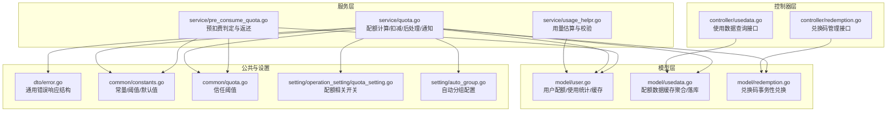
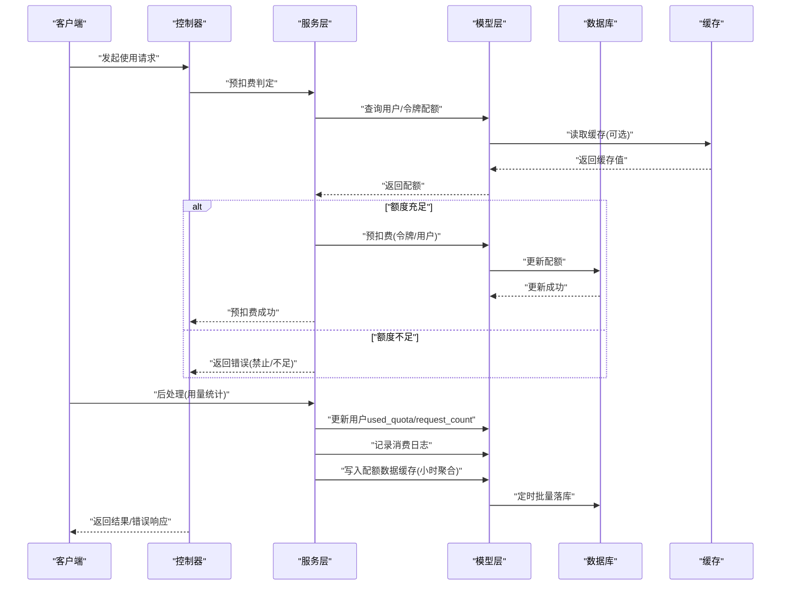
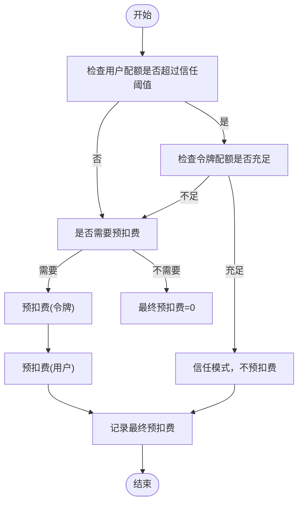
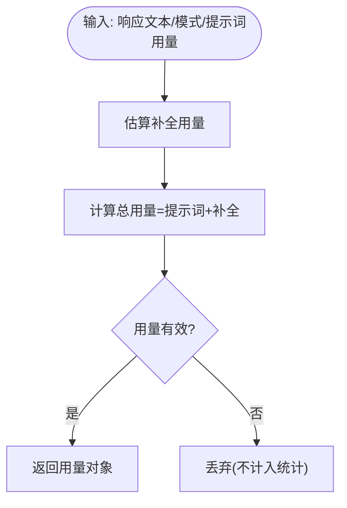
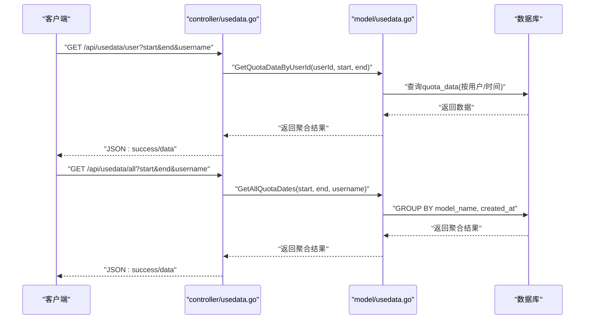
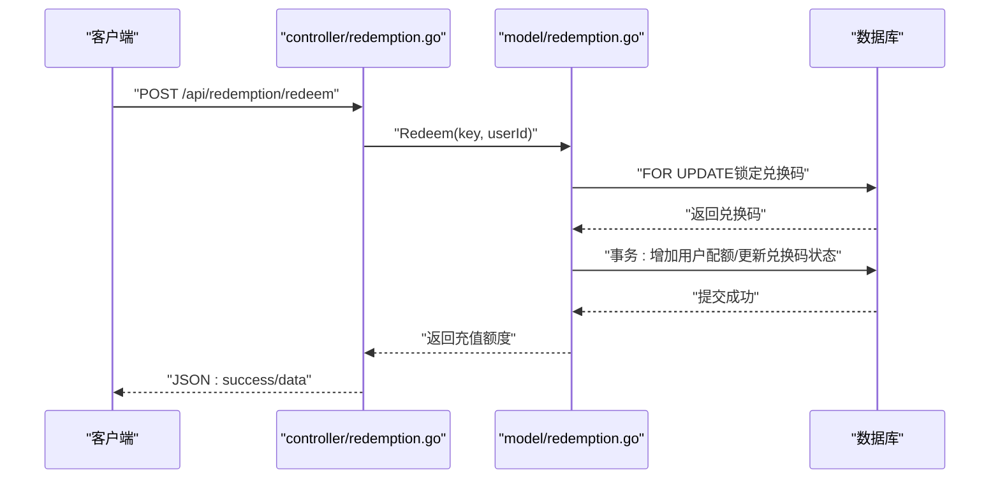
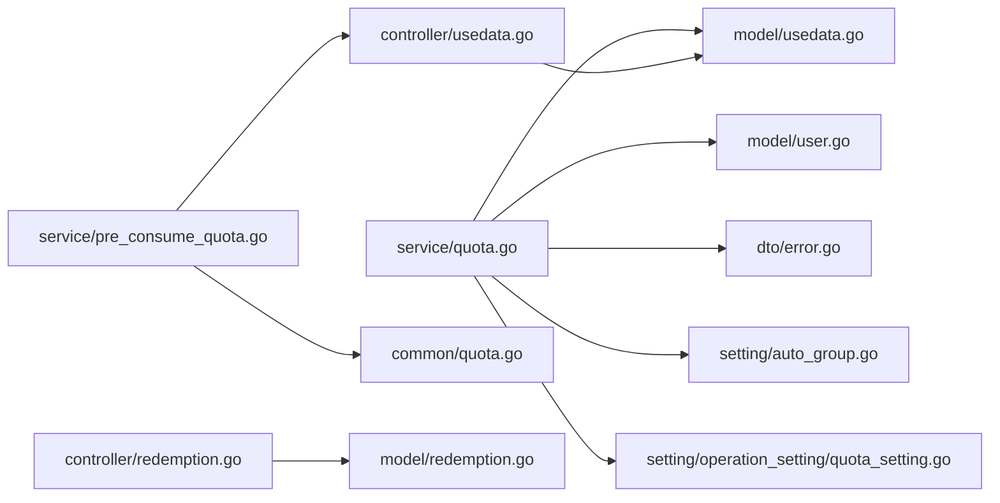

# 用户配额与使用统计

<cite>
**本文引用的文件列表**
- [service/usage_helpr.go](file://service/usage_helpr.go)
- [service/quota.go](file://service/quota.go)
- [service/pre_consume_quota.go](file://service/pre_consume_quota.go)
- [controller/usedata.go](file://controller/usedata.go)
- [model/usedata.go](file://model/usedata.go)
- [model/user.go](file://model/user.go)
- [model/redemption.go](file://model/redemption.go)
- [controller/redemption.go](file://controller/redemption.go)
- [dto/error.go](file://dto/error.go)
- [common/constants.go](file://common/constants.go)
- [common/quota.go](file://common/quota.go)
- [setting/operation_setting/quota_setting.go](file://setting/operation_setting/quota_setting.go)
- [setting/auto_group.go](file://setting/auto_group.go)
</cite>

## 目录
1. [简介](#简介)
2. [项目结构](#项目结构)
3. [核心组件](#核心组件)
4. [架构总览](#架构总览)
5. [详细组件分析](#详细组件分析)
6. [依赖关系分析](#依赖关系分析)
7. [性能与并发特性](#性能与并发特性)
8. [故障排查指南](#故障排查指南)
9. [结论](#结论)

## 简介
本文件面向“用户配额管理系统”的全面文档化目标，围绕以下主题展开：
- 用户初始配额的设置逻辑（基于用户组或注册奖励）
- 配额消耗的实时更新机制
- usage_helpr.go 中统计信息的聚合方式
- usedata.go 提供的使用数据查询接口
- 配额耗尽时的错误响应（参考 dto/error.go 中的定义）
- 自动充值/兑换码补充配额的联动逻辑
- 高并发场景下配额扣减的原子性保障方案与缓存同步策略

## 项目结构
围绕配额与使用统计的关键模块分布如下：
- 服务层（service）：配额计算、预扣费、后扣费、通知等
- 控制器层（controller）：对外暴露的使用数据查询接口
- 模型层（model）：用户、配额数据、兑换码、使用统计缓存与落库
- DTO/常量/设置：错误响应结构、常量、配额阈值、预扣费开关、自动分组等

图表来源
- [controller/usedata.go](file://controller/usedata.go#L1-L54)
- [controller/redemption.go](file://controller/redemption.go#L1-L196)
- [service/usage_helpr.go](file://service/usage_helpr.go#L1-L34)
- [service/quota.go](file://service/quota.go#L1-L582)
- [service/pre_consume_quota.go](file://service/pre_consume_quota.go#L1-L80)
- [model/user.go](file://model/user.go#L1-L932)
- [model/usedata.go](file://model/usedata.go#L1-L129)
- [model/redemption.go](file://model/redemption.go#L1-L198)
- [dto/error.go](file://dto/error.go#L1-L89)
- [common/constants.go](file://common/constants.go#L1-L208)
- [common/quota.go](file://common/quota.go#L1-L6)
- [setting/operation_setting/quota_setting.go](file://setting/operation_setting/quota_setting.go#L1-L22)
- [setting/auto_group.go](file://setting/auto_group.go#L1-L38)

章节来源
- [controller/usedata.go](file://controller/usedata.go#L1-L54)
- [model/usedata.go](file://model/usedata.go#L1-L129)
- [service/quota.go](file://service/quota.go#L1-L582)
- [service/usage_helpr.go](file://service/usage_helpr.go#L1-L34)
- [dto/error.go](file://dto/error.go#L1-L89)
- [common/constants.go](file://common/constants.go#L1-L208)
- [common/quota.go](file://common/quota.go#L1-L6)
- [setting/operation_setting/quota_setting.go](file://setting/operation_setting/quota_setting.go#L1-L22)
- [setting/auto_group.go](file://setting/auto_group.go#L1-L38)

## 核心组件
- 预扣费与配额扣减
  - 预扣费判定与信任阈值控制，避免高频请求的重复扣减
  - 实际扣减发生在后处理阶段，支持正负差额补偿
- 使用统计与聚合
  - usage_helpr.go 提供文本/音频用量估算与有效性校验
  - model/usedata.go 聚合小时粒度的配额使用数据，定时批量落库
- 使用数据查询接口
  - controller/usedata.go 提供按用户/按时间段的配额使用数据查询
- 错误响应
  - dto/error.go 定义统一的错误响应结构，便于前端/客户端解析
- 自动充值/兑换码联动
  - model/redemption.go 通过数据库事务完成兑换码核销与用户配额增加
  - controller/redemption.go 对外提供兑换码管理接口

章节来源
- [service/pre_consume_quota.go](file://service/pre_consume_quota.go#L1-L80)
- [service/quota.go](file://service/quota.go#L1-L582)
- [service/usage_helpr.go](file://service/usage_helpr.go#L1-L34)
- [model/usedata.go](file://model/usedata.go#L1-L129)
- [controller/usedata.go](file://controller/usedata.go#L1-L54)
- [dto/error.go](file://dto/error.go#L1-L89)
- [model/redemption.go](file://model/redemption.go#L1-L198)
- [controller/redemption.go](file://controller/redemption.go#L1-L196)

## 架构总览
下图展示了从请求到配额扣减、统计聚合与错误响应的整体流程。

图表来源
- [service/pre_consume_quota.go](file://service/pre_consume_quota.go#L1-L80)
- [service/quota.go](file://service/quota.go#L1-L582)
- [model/user.go](file://model/user.go#L1-L932)
- [model/usedata.go](file://model/usedata.go#L1-L129)
- [dto/error.go](file://dto/error.go#L1-L89)

## 详细组件分析

### 组件A：预扣费与配额扣减（service/pre_consume_quota.go、service/quota.go）
- 预扣费判定
  - 依据用户剩余配额与“信任阈值”决定是否进行预扣费
  - 若用户配额高于信任阈值且令牌配额也充足，则信任模式，不进行预扣费
  - 预扣费成功后，记录最终预扣费额度，用于后续补扣/返还
- 后处理扣减
  - PostConsumeQuota 支持正负差额补偿，实现“先预扣、后结算”
  - 用户与令牌配额分别扣减/返还，保证原子性
- 通知与阈值
  - 当配额低于阈值时触发通知，支持多种通知渠道

图表来源
- [service/pre_consume_quota.go](file://service/pre_consume_quota.go#L1-L80)
- [service/quota.go](file://service/quota.go#L1-L582)
- [common/quota.go](file://common/quota.go#L1-L6)
- [common/constants.go](file://common/constants.go#L1-L208)

章节来源
- [service/pre_consume_quota.go](file://service/pre_consume_quota.go#L1-L80)
- [service/quota.go](file://service/quota.go#L1-L582)
- [common/quota.go](file://common/quota.go#L1-L6)
- [common/constants.go](file://common/constants.go#L1-L208)

### 组件B：用量估算与有效性校验（service/usage_helpr.go）
- 文本/音频用量估算
  - 基于模型名称与响应文本估算补全用量
  - 计算总用量（提示词+补全）
- 用量有效性
  - 校验用量对象非空且至少存在一种用量大于0

图表来源
- [service/usage_helpr.go](file://service/usage_helpr.go#L1-L34)

章节来源
- [service/usage_helpr.go](file://service/usage_helpr.go#L1-L34)

### 组件C：使用数据查询接口（controller/usedata.go、model/usedata.go）
- 接口能力
  - 查询指定用户在某时间段内的配额使用明细
  - 查询全站按模型/小时维度的汇总数据（支持按用户名过滤）
- 数据聚合
  - model/usedata.go 将每小时的用量按用户、模型、时间聚合，批量写入数据库
  - 提供按用户ID/用户名/时间范围的查询方法

图表来源
- [controller/usedata.go](file://controller/usedata.go#L1-L54)
- [model/usedata.go](file://model/usedata.go#L1-L129)

章节来源
- [controller/usedata.go](file://controller/usedata.go#L1-L54)
- [model/usedata.go](file://model/usedata.go#L1-L129)

### 组件D：错误响应与配额耗尽处理（dto/error.go）
- 统一错误结构
  - 支持携带错误体、状态码、消息等字段
- 配额耗尽场景
  - 预扣费阶段：当用户配额不足或令牌配额不足时，返回禁止访问的错误
  - 扣减阶段：当用户或令牌配额不足时，返回相应错误

章节来源
- [dto/error.go](file://dto/error.go#L1-L89)
- [service/pre_consume_quota.go](file://service/pre_consume_quota.go#L1-L80)
- [service/quota.go](file://service/quota.go#L1-L582)

### 组件E：自动充值/兑换码联动（model/redemption.go、controller/redemption.go）
- 兑换流程
  - 通过唯一键锁定兑换码，检查状态与有效期
  - 在事务内为用户增加配额，标记兑换码为已使用
- 管理接口
  - 支持新增、查询、更新、删除、批量清理失效兑换码
  - 对批量生成数量与名称长度进行约束

图表来源
- [controller/redemption.go](file://controller/redemption.go#L1-L196)
- [model/redemption.go](file://model/redemption.go#L1-L198)

章节来源
- [controller/redemption.go](file://controller/redemption.go#L1-L196)
- [model/redemption.go](file://model/redemption.go#L1-L198)

### 组件F：初始配额设置逻辑（注册奖励与用户组）
- 注册奖励
  - 新用户创建时设置初始配额（常量定义）
- 邀请奖励
  - 邀请人与被邀请人均可获得配额奖励
- 用户组影响
  - 分组倍率参与最终配额计算（在配额计算函数中体现）

章节来源
- [model/user.go](file://model/user.go#L1-L932)
- [common/constants.go](file://common/constants.go#L1-L208)
- [service/quota.go](file://service/quota.go#L1-L582)

## 依赖关系分析
- 服务层依赖
  - service/quota.go 依赖 model/user.go 的用户/令牌配额操作、model/usedata.go 的统计缓存、dto/error.go 的错误结构
  - service/pre_consume_quota.go 依赖 common/constants.go 的信任阈值与默认预扣费
- 控制器层依赖
  - controller/usedata.go 依赖 model/usedata.go 的查询与聚合
  - controller/redemption.go 依赖 model/redemption.go 的事务性兑换
- 设置与常量
  - setting/operation_setting/quota_setting.go 提供配额相关开关
  - setting/auto_group.go 提供自动分组配置

图表来源
- [service/quota.go](file://service/quota.go#L1-L582)
- [service/pre_consume_quota.go](file://service/pre_consume_quota.go#L1-L80)
- [controller/usedata.go](file://controller/usedata.go#L1-L54)
- [controller/redemption.go](file://controller/redemption.go#L1-L196)
- [model/user.go](file://model/user.go#L1-L932)
- [model/usedata.go](file://model/usedata.go#L1-L129)
- [model/redemption.go](file://model/redemption.go#L1-L198)
- [dto/error.go](file://dto/error.go#L1-L89)
- [common/constants.go](file://common/constants.go#L1-L208)
- [common/quota.go](file://common/quota.go#L1-L6)
- [setting/auto_group.go](file://setting/auto_group.go#L1-L38)
- [setting/operation_setting/quota_setting.go](file://setting/operation_setting/quota_setting.go#L1-L22)

## 性能与并发特性
- 原子性保障
  - 预扣费与扣减均通过数据库表达式更新，避免竞态
  - 兑换码核销使用 FOR UPDATE 锁定，确保幂等与一致性
- 缓存与批量更新
  - 用户配额与使用统计支持批量更新，减少数据库压力
  - 使用统计缓存按小时聚合，定时批量落库，降低写放大
- 信任阈值与预扣费
  - 通过信任阈值减少高频请求的预扣费开销，提升吞吐
- 并发安全
  - 预扣费返还采用异步协程，避免阻塞主流程
  - 通知发送在独立协程中执行，降低延迟抖动

章节来源
- [service/quota.go](file://service/quota.go#L1-L582)
- [service/pre_consume_quota.go](file://service/pre_consume_quota.go#L1-L80)
- [model/user.go](file://model/user.go#L1-L932)
- [model/usedata.go](file://model/usedata.go#L1-L129)
- [model/redemption.go](file://model/redemption.go#L1-L198)
- [common/constants.go](file://common/constants.go#L1-L208)
- [common/quota.go](file://common/quota.go#L1-L6)

## 故障排查指南
- 预扣费失败
  - 检查用户配额是否低于信任阈值且令牌配额不足
  - 查看预扣费错误码与状态码，确认是否跳过重试
- 配额耗尽
  - 确认用户/令牌配额是否为0或负数
  - 检查是否触发了通知阈值
- 使用统计异常
  - 核对聚合周期（小时）与时间范围
  - 检查定时任务是否正常运行
- 兑换码问题
  - 核对兑换码状态、有效期与唯一键
  - 查看事务是否成功提交

章节来源
- [service/pre_consume_quota.go](file://service/pre_consume_quota.go#L1-L80)
- [service/quota.go](file://service/quota.go#L1-L582)
- [model/usedata.go](file://model/usedata.go#L1-L129)
- [model/redemption.go](file://model/redemption.go#L1-L198)
- [dto/error.go](file://dto/error.go#L1-L89)

## 结论
本系统通过“预扣费+后结算”的机制，在保证高并发下的原子性与一致性的同时，提供了灵活的配额计算与统计聚合能力。结合兑换码与通知机制，实现了从初始配额到持续运营的闭环管理。建议在生产环境中：
- 合理设置信任阈值与预扣费额度
- 关注批量更新与缓存同步策略
- 对兑换码与统计落库进行监控与告警