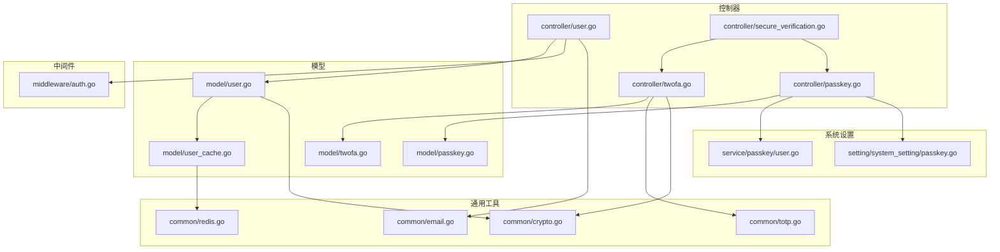
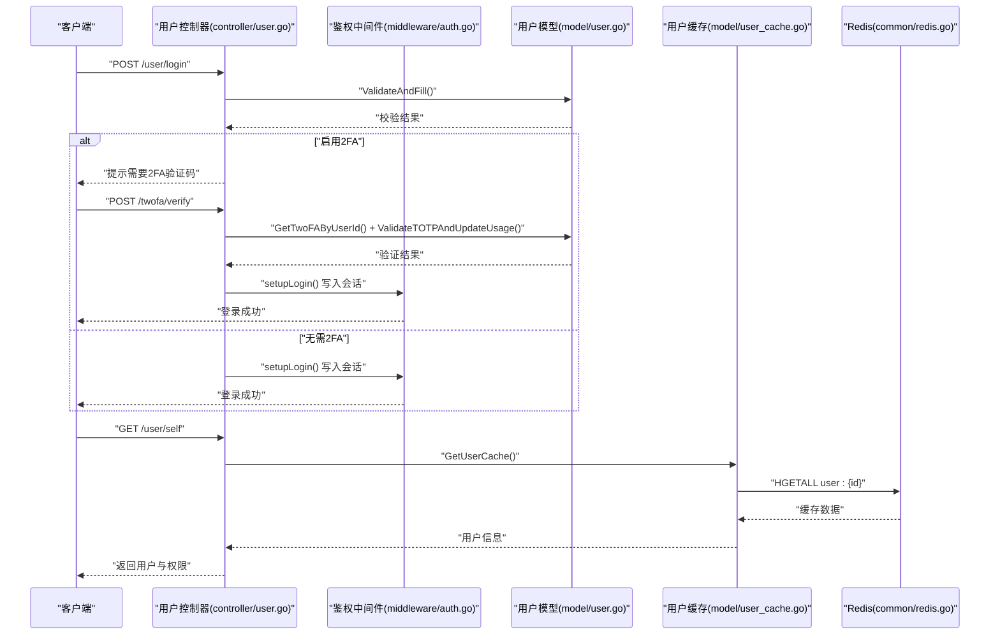
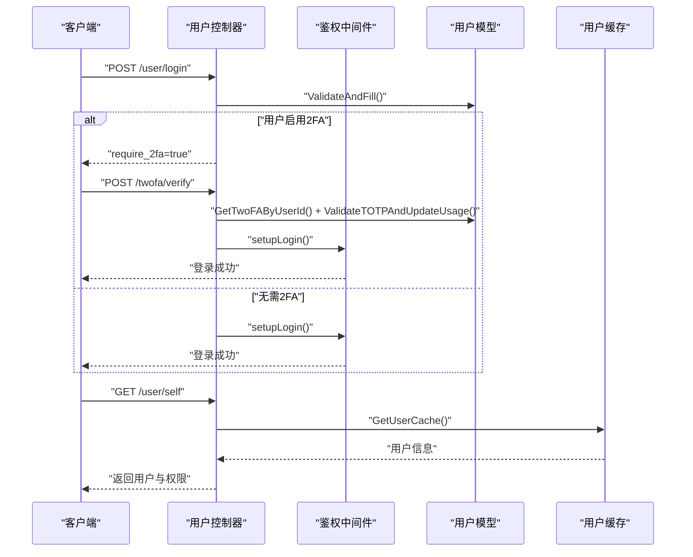
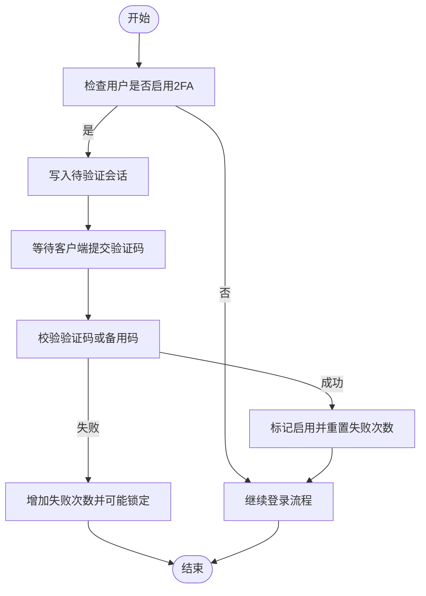
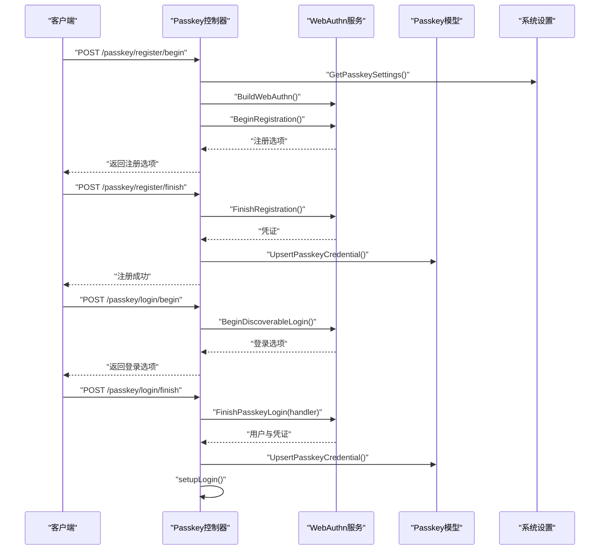
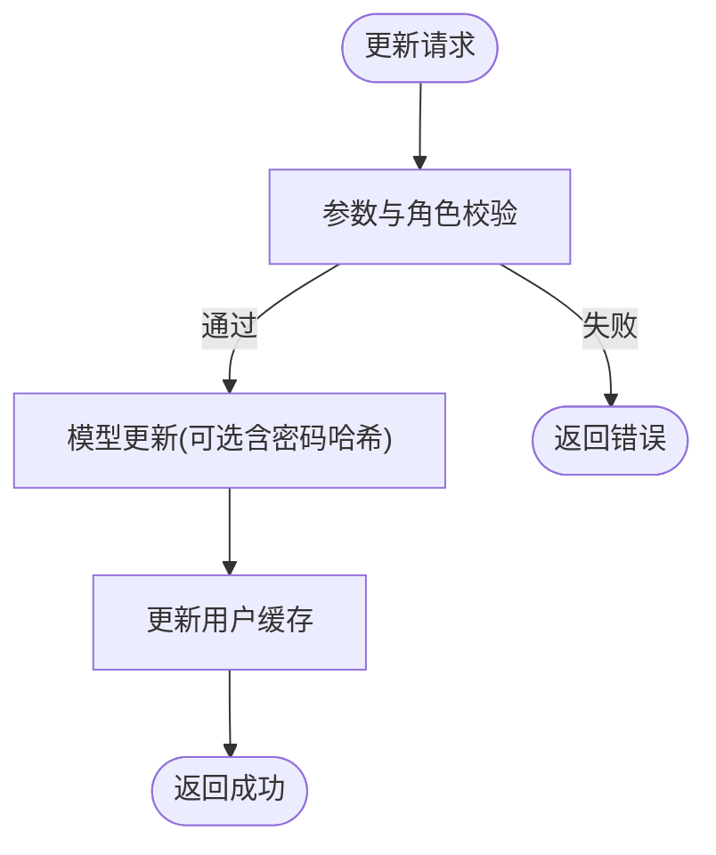
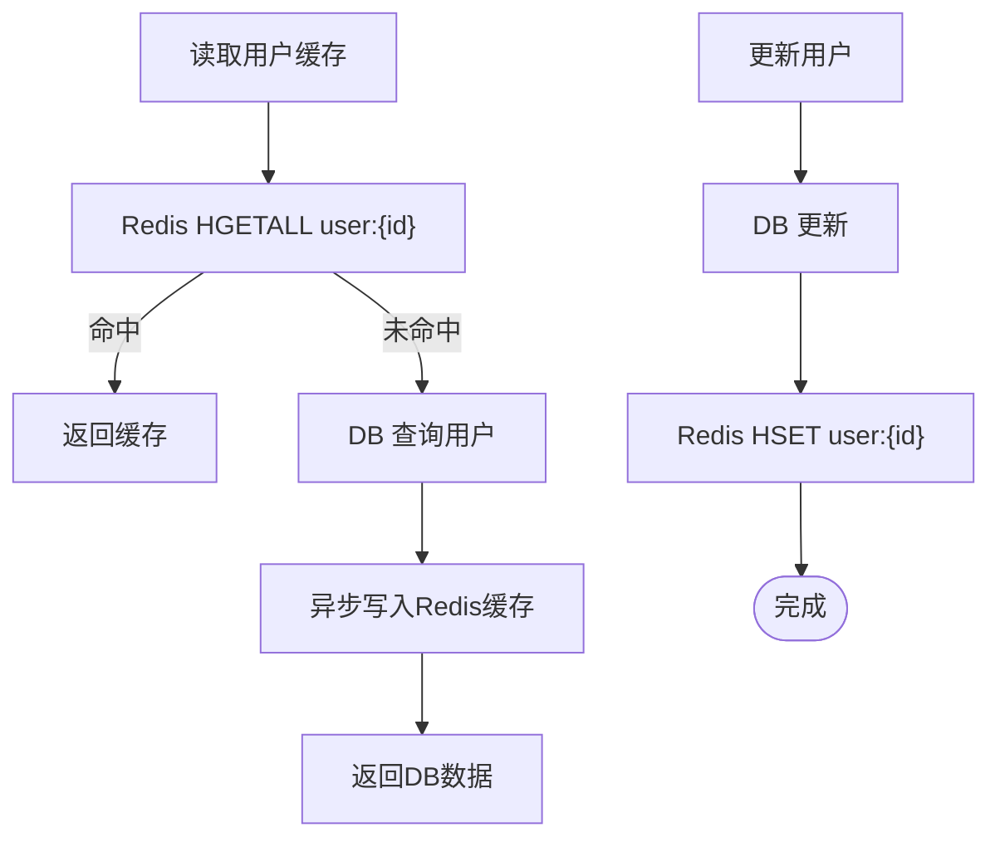
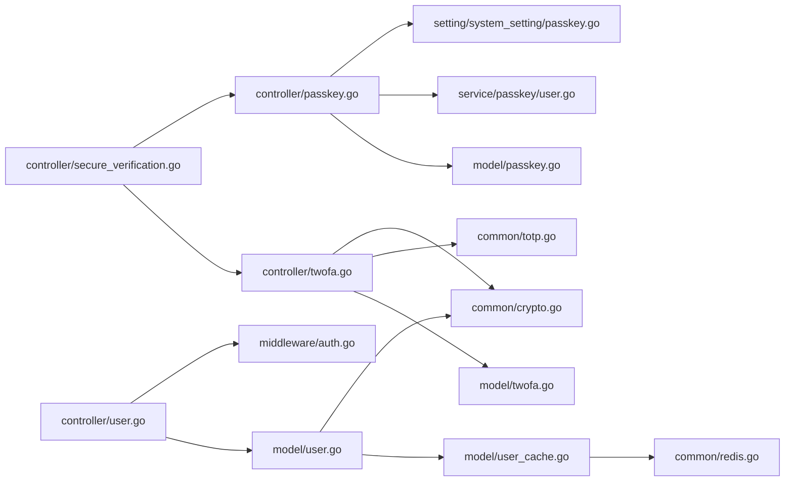

# 用户管理

<cite>
**本文引用的文件**
- [controller/user.go](file://controller/user.go)
- [model/user.go](file://model/user.go)
- [middleware/auth.go](file://middleware/auth.go)
- [common/totp.go](file://common/totp.go)
- [controller/twofa.go](file://controller/twofa.go)
- [model/twofa.go](file://model/twofa.go)
- [controller/passkey.go](file://controller/passkey.go)
- [model/passkey.go](file://model/passkey.go)
- [service/passkey/user.go](file://service/passkey/user.go)
- [setting/system_setting/passkey.go](file://setting/system_setting/passkey.go)
- [controller/secure_verification.go](file://controller/secure_verification.go)
- [common/crypto.go](file://common/crypto.go)
- [model/user_cache.go](file://model/user_cache.go)
- [common/redis.go](file://common/redis.go)
- [common/email.go](file://common/email.go)
</cite>

## 目录
1. [简介](#简介)
2. [项目结构](#项目结构)
3. [核心组件](#核心组件)
4. [架构总览](#架构总览)
5. [详细组件分析](#详细组件分析)
6. [依赖关系分析](#依赖关系分析)
7. [性能考量](#性能考量)
8. [故障排查指南](#故障排查指南)
9. [结论](#结论)
10. [附录](#附录)

## 简介
本文件面向“用户管理系统”的开发者与运维人员，系统性阐述用户认证、授权与权限控制的实现机制；详解双因素认证（2FA）与 Passkey 的集成流程；说明用户信息管理、密码重置与账户安全功能的技术实现；给出用户生命周期管理（注册、登录、权限变更等）的操作路径与代码示例定位；并总结用户数据在 Redis 缓存与数据库之间的同步策略与安全最佳实践。

## 项目结构
用户管理相关代码主要分布在以下模块：
- 控制器层：用户登录/注册/信息维护、2FA、Passkey、安全验证等
- 模型层：用户实体、2FA、Passkey 凭证、用户缓存读写
- 中间件层：统一鉴权、令牌鉴权、上下文注入
- 通用工具：TOTP、加密、邮件、Redis 客户端
- 系统设置：Passkey 相关运行参数

图表来源
- [controller/user.go](file://controller/user.go#L1-L200)
- [model/user.go](file://model/user.go#L1-L200)
- [middleware/auth.go](file://middleware/auth.go#L1-L120)
- [common/totp.go](file://common/totp.go#L1-L120)
- [controller/twofa.go](file://controller/twofa.go#L1-L120)
- [model/twofa.go](file://model/twofa.go#L1-L120)
- [controller/passkey.go](file://controller/passkey.go#L1-L120)
- [model/passkey.go](file://model/passkey.go#L1-L120)
- [service/passkey/user.go](file://service/passkey/user.go#L1-L72)
- [setting/system_setting/passkey.go](file://setting/system_setting/passkey.go#L1-L51)
- [controller/secure_verification.go](file://controller/secure_verification.go#L1-L120)
- [common/crypto.go](file://common/crypto.go#L1-L33)
- [model/user_cache.go](file://model/user_cache.go#L1-L120)
- [common/redis.go](file://common/redis.go#L1-L120)
- [common/email.go](file://common/email.go#L1-L94)

章节来源
- [controller/user.go](file://controller/user.go#L1-L200)
- [model/user.go](file://model/user.go#L1-L200)
- [middleware/auth.go](file://middleware/auth.go#L1-L120)

## 核心组件
- 用户控制器：负责登录、注册、登出、用户信息查询与更新、自服务侧边栏配置更新、生成访问令牌、邀请配额划转、获取邀请码等。
- 用户模型：封装用户实体、密码哈希、访问令牌校验、用户缓存读取与更新、额度增减、状态与分组查询等。
- 2FA 控制器与模型：提供 2FA 初始化、启用、禁用、备用码生成与校验、登录时二次验证、统计与管理员强制禁用等功能。
- Passkey 控制器与模型：提供注册/登录/删除/状态查询、凭证存储与更新、WebAuthn 协议交互。
- 安全验证控制器：统一 2FA 与 Passkey 的二次确认，结合会话实现短期安全验证状态。
- 中间件：会话与令牌鉴权、上下文注入、令牌分组与限额校验。
- 通用工具：TOTP 生成与校验、备份码处理、密码哈希与校验、Redis 客户端、邮件发送。

章节来源
- [controller/user.go](file://controller/user.go#L1-L200)
- [model/user.go](file://model/user.go#L1-L200)
- [controller/twofa.go](file://controller/twofa.go#L1-L200)
- [model/twofa.go](file://model/twofa.go#L1-L200)
- [controller/passkey.go](file://controller/passkey.go#L1-L200)
- [model/passkey.go](file://model/passkey.go#L1-L200)
- [controller/secure_verification.go](file://controller/secure_verification.go#L1-L200)
- [middleware/auth.go](file://middleware/auth.go#L1-L200)
- [common/totp.go](file://common/totp.go#L1-L120)
- [common/crypto.go](file://common/crypto.go#L1-L33)
- [model/user_cache.go](file://model/user_cache.go#L1-L200)
- [common/redis.go](file://common/redis.go#L1-L200)
- [common/email.go](file://common/email.go#L1-L94)

## 架构总览
用户管理采用“控制器-模型-中间件-通用工具-系统设置”的分层架构。登录与访问令牌校验通过中间件完成，用户信息与权限通过模型层与缓存层协同提供，2FA 与 Passkey 通过专用控制器与模型实现，安全验证通过会话实现短期保护。

图表来源
- [controller/user.go](file://controller/user.go#L1-L160)
- [middleware/auth.go](file://middleware/auth.go#L1-L120)
- [model/user.go](file://model/user.go#L500-L670)
- [model/user_cache.go](file://model/user_cache.go#L70-L120)
- [common/redis.go](file://common/redis.go#L100-L180)

## 详细组件分析

### 用户认证与会话登录
- 登录流程要点
  - 参数校验与密码校验：控制器接收用户名/密码，调用模型的校验方法，若状态非启用则拒绝。
  - 2FA 检测：若用户已启用 2FA，则写入“待验证”会话并返回提示，要求客户端提交 2FA 验证码。
  - 登录成功：调用中间件的登录设置函数，写入会话并返回用户信息。
- 会话与令牌鉴权
  - 会话鉴权：中间件优先从会话读取用户信息，若无则解析 Authorization 头中的访问令牌并校验。
  - 令牌鉴权：对令牌进行来源校验、IP 白名单校验、用户状态校验、分组与限额校验，并将用户缓存写入上下文。

图表来源
- [controller/user.go](file://controller/user.go#L1-L160)
- [middleware/auth.go](file://middleware/auth.go#L1-L120)
- [model/user.go](file://model/user.go#L500-L670)
- [model/user_cache.go](file://model/user_cache.go#L70-L120)

章节来源
- [controller/user.go](file://controller/user.go#L1-L160)
- [middleware/auth.go](file://middleware/auth.go#L1-L120)
- [model/user.go](file://model/user.go#L500-L670)
- [model/user_cache.go](file://model/user_cache.go#L70-L120)

### 双因素认证（2FA）
- 初始化与启用
  - 生成 TOTP 密钥与二维码数据，生成备用码并持久化，返回给前端。
  - 启用时校验一次性验证码，成功后标记启用并清零失败计数。
- 登录验证
  - 登录阶段若检测到用户启用 2FA，则在会话中保留待验证状态，客户端提交验证码后完成登录。
- 禁用与备用码
  - 支持使用 TOTP 或备用码禁用 2FA；备用码使用哈希存储，使用后标记为已用。
- 统计与管理员强制禁用
  - 提供启用率统计；管理员可强制禁用指定用户 2FA。

图表来源
- [controller/twofa.go](file://controller/twofa.go#L1-L200)
- [model/twofa.go](file://model/twofa.go#L1-L200)
- [common/totp.go](file://common/totp.go#L1-L120)

章节来源
- [controller/twofa.go](file://controller/twofa.go#L1-L200)
- [model/twofa.go](file://model/twofa.go#L1-L200)
- [common/totp.go](file://common/totp.go#L1-L120)

### Passkey 集成
- 注册流程
  - 判断系统是否启用 Passkey；获取当前用户；构建 WebAuthn；生成注册选项并保存会话；完成注册后持久化凭证。
- 登录流程
  - 构建发现式登录选项并保存会话；完成登录后更新凭证使用时间并执行登录设置。
- 状态与删除
  - 查询用户是否绑定 Passkey；支持管理员重置用户 Passkey；支持删除绑定。
- 安全验证
  - 通过通用验证接口支持 2FA 与 Passkey 的二次确认，并在会话中记录到期时间。

图表来源
- [controller/passkey.go](file://controller/passkey.go#L1-L200)
- [model/passkey.go](file://model/passkey.go#L1-L200)
- [service/passkey/user.go](file://service/passkey/user.go#L1-L72)
- [setting/system_setting/passkey.go](file://setting/system_setting/passkey.go#L1-L51)

章节来源
- [controller/passkey.go](file://controller/passkey.go#L1-L200)
- [model/passkey.go](file://model/passkey.go#L1-L200)
- [service/passkey/user.go](file://service/passkey/user.go#L1-L72)
- [setting/system_setting/passkey.go](file://setting/system_setting/passkey.go#L1-L51)

### 用户信息管理与权限
- 自服务信息更新
  - 支持更新显示名、分组、额度等；当更新密码时进行原密码校验；支持更新侧边栏模块配置。
- 管理员视角
  - 支持按关键词/分组搜索用户；支持按角色上限更新用户信息；记录管理日志。
- 权限计算
  - 根据用户角色动态生成侧边栏模块权限，超级管理员与管理员权限不同。

图表来源
- [controller/user.go](file://controller/user.go#L600-L760)
- [model/user.go](file://model/user.go#L430-L490)
- [model/user_cache.go](file://model/user_cache.go#L60-L120)

章节来源
- [controller/user.go](file://controller/user.go#L600-L760)
- [model/user.go](file://model/user.go#L430-L490)
- [model/user_cache.go](file://model/user_cache.go#L60-L120)

### 密码重置与账户安全
- 密码重置
  - 通过邮箱找回密码（需系统配置 SMTP），重置后使用哈希存储。
- 安全验证
  - 通用验证接口支持 2FA 与 Passkey，验证成功后在会话中记录时间戳，有效期 5 分钟，用于敏感操作保护。

章节来源
- [model/user.go](file://model/user.go#L600-L620)
- [common/email.go](file://common/email.go#L1-L94)
- [controller/secure_verification.go](file://controller/secure_verification.go#L1-L200)

### 用户生命周期管理（操作路径与示例定位）
- 注册
  - 控制器入口：[Register](file://controller/user.go#L145-L274)
  - 用户插入与默认令牌生成：[User.Insert](file://model/user.go#L376-L430)
- 登录
  - 密码登录与 2FA 流程：[Login](file://controller/user.go#L30-L120)
  - 会话设置：[setupLogin](file://controller/user.go#L97-L126)
- 权限变更
  - 管理员更新用户角色与额度：[UpdateUser](file://controller/user.go#L601-L657)
- 侧边栏配置更新
  - 自服务更新 sidebar_modules：[UpdateSelf](file://controller/user.go#L659-L759)
- 2FA 生命周期
  - 初始化/启用/禁用/备用码重生成/登录验证：[controller/twofa.go](file://controller/twofa.go#L1-L200)
- Passkey 生命周期
  - 注册/登录/删除/状态查询/管理员重置：[controller/passkey.go](file://controller/passkey.go#L1-L200)
- 安全验证
  - 通用验证与状态查询：[controller/secure_verification.go](file://controller/secure_verification.go#L1-L200)

章节来源
- [controller/user.go](file://controller/user.go#L145-L274)
- [model/user.go](file://model/user.go#L376-L430)
- [controller/user.go](file://controller/user.go#L601-L759)
- [controller/twofa.go](file://controller/twofa.go#L1-L200)
- [controller/passkey.go](file://controller/passkey.go#L1-L200)
- [controller/secure_verification.go](file://controller/secure_verification.go#L1-L200)

### 用户数据在 Redis 与数据库中的同步策略
- 读路径
  - 优先从 Redis 哈希读取用户缓存；若命中则直接返回；未命中则从数据库读取并异步写入 Redis。
- 写路径
  - 用户信息更新后，调用更新缓存函数，将用户对象序列化为哈希并设置过期时间。
- 字段级原子操作
  - 额度增减使用 Redis 哈希字段原子递增/递减，保证并发安全。
- 过期与失效
  - 缓存键带过期时间；删除用户时主动失效对应缓存键；部分字段更新使用 HSET 并保持 TTL。

图表来源
- [model/user_cache.go](file://model/user_cache.go#L70-L120)
- [common/redis.go](file://common/redis.go#L100-L180)
- [common/redis.go](file://common/redis.go#L275-L328)

章节来源
- [model/user_cache.go](file://model/user_cache.go#L1-L220)
- [common/redis.go](file://common/redis.go#L1-L328)

## 依赖关系分析
- 控制器依赖模型与中间件；模型依赖通用工具（加密、Redis、TOTP）；Passkey 控制器依赖系统设置与服务层用户包装。
- 中间件在令牌鉴权时依赖令牌模型与比率设置；在用户鉴权时依赖会话与用户缓存。
- 2FA 与 Passkey 依赖各自专用模型与通用工具（TOTP、哈希）。

图表来源
- [controller/user.go](file://controller/user.go#L1-L200)
- [model/user.go](file://model/user.go#L1-L200)
- [middleware/auth.go](file://middleware/auth.go#L1-L200)
- [controller/twofa.go](file://controller/twofa.go#L1-L200)
- [model/twofa.go](file://model/twofa.go#L1-L200)
- [common/totp.go](file://common/totp.go#L1-L120)
- [controller/passkey.go](file://controller/passkey.go#L1-L200)
- [model/passkey.go](file://model/passkey.go#L1-L200)
- [service/passkey/user.go](file://service/passkey/user.go#L1-L72)
- [setting/system_setting/passkey.go](file://setting/system_setting/passkey.go#L1-L51)
- [controller/secure_verification.go](file://controller/secure_verification.go#L1-L200)
- [model/user_cache.go](file://model/user_cache.go#L1-L200)
- [common/redis.go](file://common/redis.go#L1-L200)
- [common/crypto.go](file://common/crypto.go#L1-L33)

章节来源
- [controller/user.go](file://controller/user.go#L1-L200)
- [model/user.go](file://model/user.go#L1-L200)
- [middleware/auth.go](file://middleware/auth.go#L1-L200)
- [controller/twofa.go](file://controller/twofa.go#L1-L200)
- [model/twofa.go](file://model/twofa.go#L1-L200)
- [controller/passkey.go](file://controller/passkey.go#L1-L200)
- [model/passkey.go](file://model/passkey.go#L1-L200)
- [service/passkey/user.go](file://service/passkey/user.go#L1-L72)
- [setting/system_setting/passkey.go](file://setting/system_setting/passkey.go#L1-L51)
- [controller/secure_verification.go](file://controller/secure_verification.go#L1-L200)
- [model/user_cache.go](file://model/user_cache.go#L1-L200)
- [common/redis.go](file://common/redis.go#L1-L200)
- [common/crypto.go](file://common/crypto.go#L1-L33)

## 性能考量
- 缓存命中优先：用户信息读取优先走 Redis 哈希，未命中再回源数据库，并异步写入缓存，降低数据库压力。
- 原子字段操作：额度增减使用 HINCRBY，避免竞争条件，提高并发吞吐。
- 会话与令牌：登录成功写入会话；令牌鉴权时仅做必要校验并写入上下文，减少重复查询。
- 2FA/Passkey：登录阶段仅做一次性校验，后续通过会话短期保护敏感操作。

[本节为通用指导，不直接分析具体文件]

## 故障排查指南
- 登录失败
  - 检查用户名/密码是否为空、用户状态是否启用；若启用 2FA，确认验证码是否正确且未锁定。
  - 参考：[Login](file://controller/user.go#L30-L120)、[ValidateAndFill](file://model/user.go#L500-L517)、[ValidateTOTPAndUpdateUsage](file://model/twofa.go#L236-L263)
- 2FA 问题
  - 检查失败次数与锁定状态；确认备用码格式与未使用记录；必要时重置 2FA。
  - 参考：[GetTwoFAByUserId](file://model/twofa.go#L40-L56)、[IncrementFailedAttempts](file://model/twofa.go#L123-L134)、[IsLocked](file://model/twofa.go#L136-L142)
- Passkey 问题
  - 确认系统设置启用 Passkey；检查凭证是否存在与 LastUsedAt 是否更新；必要时删除或重置。
  - 参考：[GetPasskeySettings](file://setting/system_setting/passkey.go#L35-L51)、[GetPasskeyByUserID](file://model/passkey.go#L142-L158)、[UpsertPasskeyCredential](file://model/passkey.go#L180-L197)
- 缓存异常
  - 检查 Redis 连接与键过期；确认 HSET/HGETALL 是否成功；必要时手动失效缓存键。
  - 参考：[InitRedisClient](file://common/redis.go#L23-L54)、[RedisHSetObj](file://common/redis.go#L107-L159)、[invalidateUserCache](file://model/user_cache.go#L52-L58)
- 邮件发送失败
  - 检查 SMTP 配置与 TLS 设置；确认账号与口令；查看系统日志。
  - 参考：[SendEmail](file://common/email.go#L22-L94)

章节来源
- [controller/user.go](file://controller/user.go#L30-L120)
- [model/user.go](file://model/user.go#L500-L517)
- [model/twofa.go](file://model/twofa.go#L123-L142)
- [setting/system_setting/passkey.go](file://setting/system_setting/passkey.go#L35-L51)
- [model/passkey.go](file://model/passkey.go#L142-L197)
- [common/redis.go](file://common/redis.go#L23-L54)
- [common/email.go](file://common/email.go#L22-L94)

## 结论
本系统通过“会话+令牌+缓存+2FA/Passkey”的组合实现了高可用、高安全性的用户管理体系。登录与权限控制清晰分离，2FA 与 Passkey 提供多因子安全增强，Redis 缓存显著降低了数据库压力。建议在生产环境中严格配置 SMTP、Redis、系统设置与速率限制，持续监控 2FA 启用率与 Passkey 使用情况，定期审计用户与令牌行为。

[本节为总结性内容，不直接分析具体文件]

## 附录
- 安全最佳实践
  - 强制启用 2FA 或 Passkey；对 2FA 失败次数与锁定策略进行合理配置。
  - 使用 HTTPS 与安全的 Cookie 设置；对敏感操作启用短期安全验证。
  - 定期轮换系统密钥与 SMTP 凭据；限制 API 速率与来源 IP。
  - 对用户输入进行严格校验与最小权限原则；避免在日志中泄露敏感信息。
- 常见漏洞防范
  - 防暴力破解：2FA/登录失败计数与锁定；速率限制与人机验证。
  - 防会话劫持：HTTPS、HttpOnly Cookie、短会话与刷新策略。
  - 防注入与越权：严格的参数校验、角色与权限检查、最小可见范围。
  - 数据保护：密码使用强哈希；敏感字段不在前端展示；缓存键过期与失效策略。

[本节为通用指导，不直接分析具体文件]