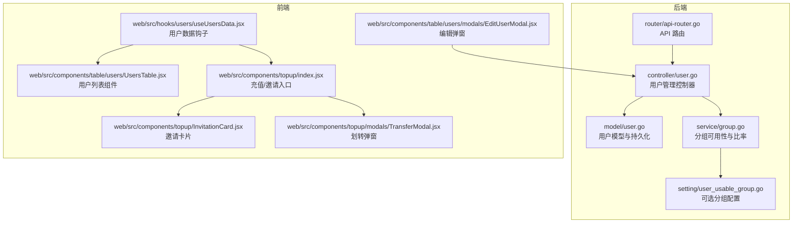
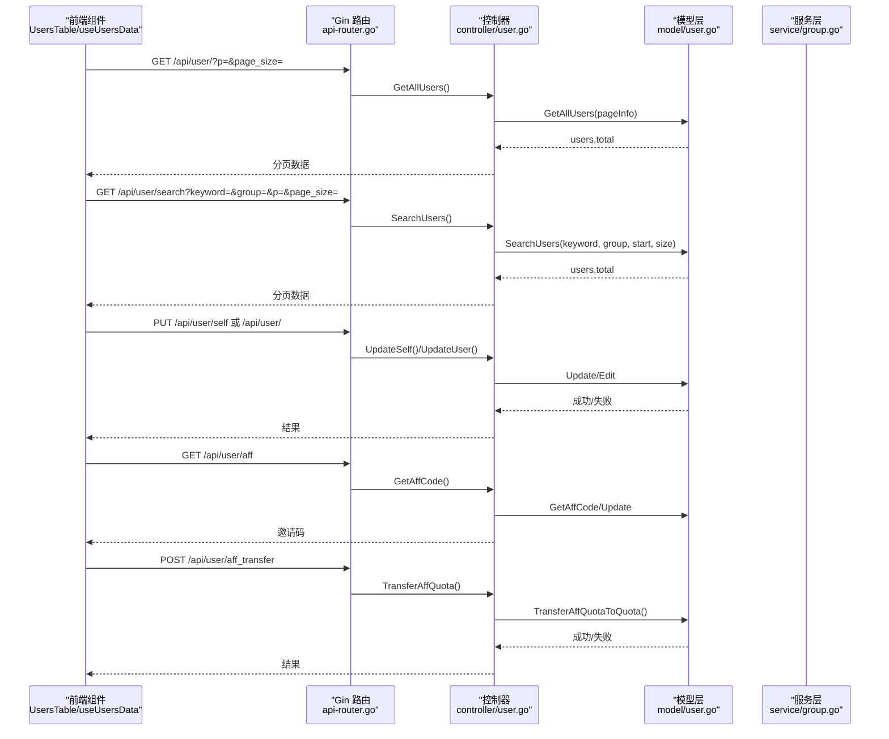
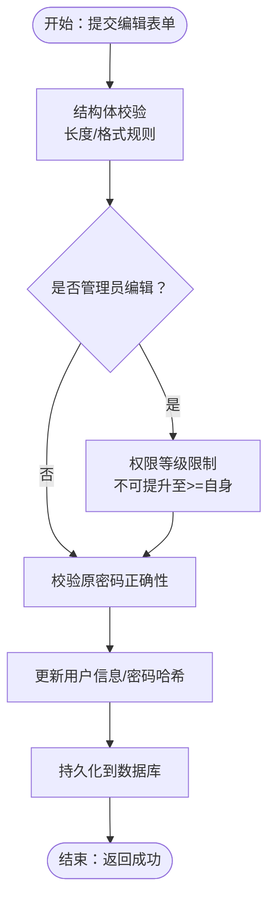
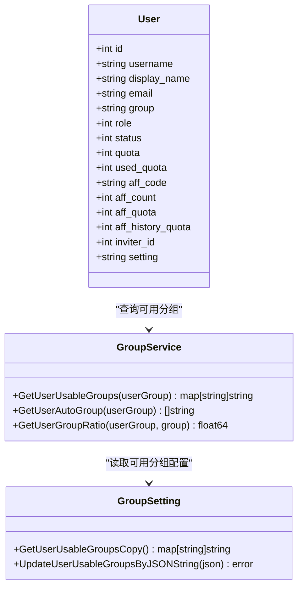
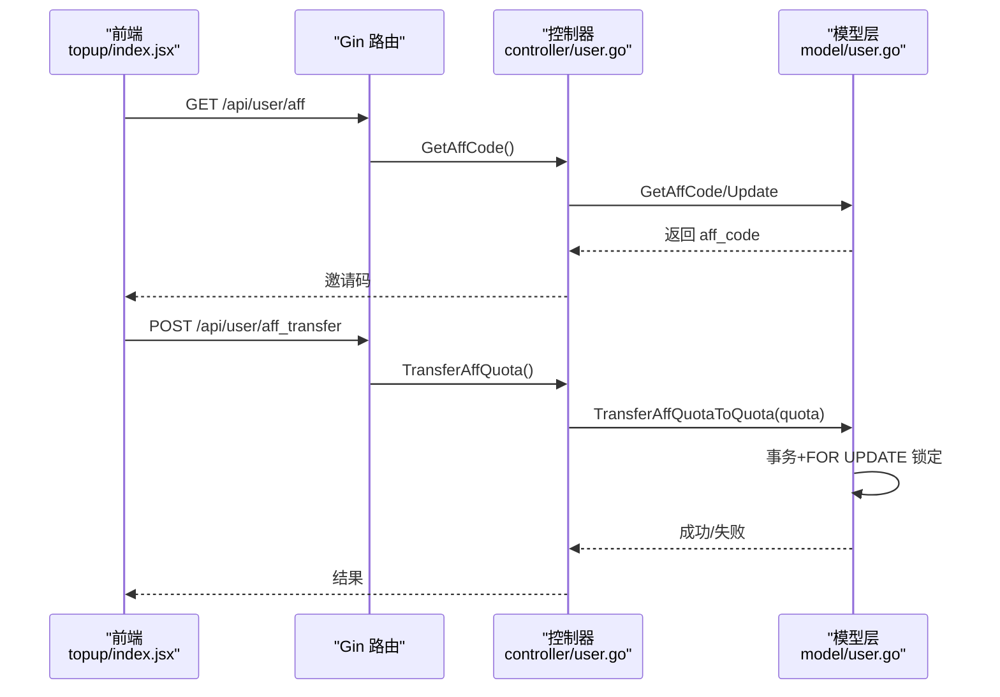
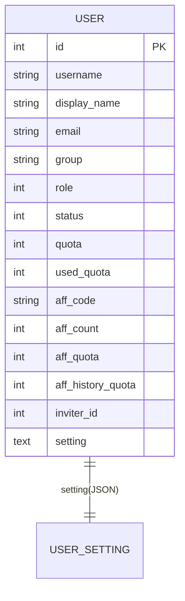
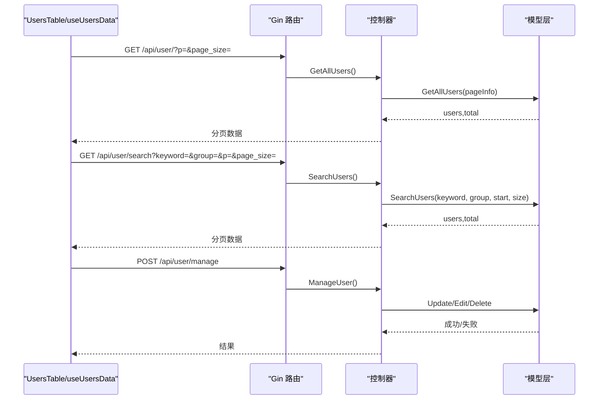
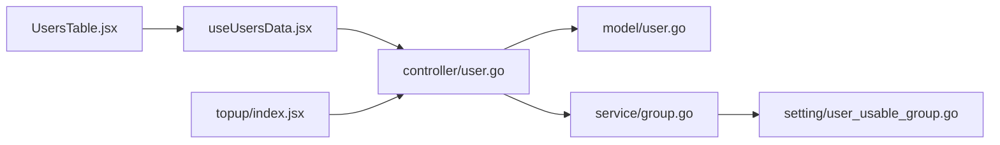

# 用户资料管理

<cite>
**本文引用的文件**
- [controller/user.go](file://controller/user.go)
- [model/user.go](file://model/user.go)
- [dto/user_settings.go](file://dto/user_settings.go)
- [service/group.go](file://service/group.go)
- [setting/user_usable_group.go](file://setting/user_usable_group.go)
- [router/api-router.go](file://router/api-router.go)
- [web/src/components/table/users/UsersTable.jsx](file://web/src/components/table/users/UsersTable.jsx)
- [web/src/hooks/users/useUsersData.jsx](file://web/src/hooks/users/useUsersData.jsx)
- [web/src/components/table/users/modals/EditUserModal.jsx](file://web/src/components/table/users/modals/EditUserModal.jsx)
- [web/src/components/topup/index.jsx](file://web/src/components/topup/index.jsx)
- [web/src/components/topup/InvitationCard.jsx](file://web/src/components/topup/InvitationCard.jsx)
- [web/src/components/topup/modals/TransferModal.jsx](file://web/src/components/topup/modals/TransferModal.jsx)
</cite>

## 目录
1. [简介](#简介)
2. [项目结构](#项目结构)
3. [核心组件](#核心组件)
4. [架构总览](#架构总览)
5. [详细组件分析](#详细组件分析)
6. [依赖关系分析](#依赖关系分析)
7. [性能考量](#性能考量)
8. [故障排查指南](#故障排查指南)
9. [结论](#结论)
10. [附录](#附录)

## 简介
本文件围绕“用户资料管理”主题，系统性梳理后端控制器、模型、服务与前端组件之间的协作关系，覆盖以下要点：
- 用户基本信息（用户名、显示名、邮箱）的编辑流程与验证规则
- 用户分组（Group）机制及其在路由调度与模型可用性中的作用
- 邀请码（Affiliate Code）系统的工作原理、邀请统计与额度奖励计算
- 用户设置持久化存储结构（Setting 字段 JSON 格式）
- 前端用户列表组件（UsersTable）与后端 API 的交互示例，以及分页、筛选、导出能力说明

## 项目结构
用户资料管理涉及后端控制器、模型层、服务层与前端表格组件、钩子与设置页面等模块。后端通过 Gin 路由暴露用户管理接口；模型层负责数据结构与持久化；服务层提供分组可用性与比率计算；前端通过自定义 Hook 与组件实现用户列表、筛选、分页与邀请额度划转等交互。

图表来源
- [controller/user.go](file://controller/user.go#L276-L482)
- [model/user.go](file://model/user.go#L1-L120)
- [service/group.go](file://service/group.go#L1-L66)
- [setting/user_usable_group.go](file://setting/user_usable_group.go#L1-L55)
- [router/api-router.go](file://router/api-router.go#L80-L120)
- [web/src/components/table/users/UsersTable.jsx](file://web/src/components/table/users/UsersTable.jsx#L1-L250)
- [web/src/hooks/users/useUsersData.jsx](file://web/src/hooks/users/useUsersData.jsx#L1-L322)
- [web/src/components/table/users/modals/EditUserModal.jsx](file://web/src/components/table/users/modals/EditUserModal.jsx#L55-L253)
- [web/src/components/topup/index.jsx](file://web/src/components/topup/index.jsx#L430-L725)
- [web/src/components/topup/InvitationCard.jsx](file://web/src/components/topup/InvitationCard.jsx#L1-L55)
- [web/src/components/topup/modals/TransferModal.jsx](file://web/src/components/topup/modals/TransferModal.jsx#L20-L77)

章节来源
- [controller/user.go](file://controller/user.go#L276-L482)
- [model/user.go](file://model/user.go#L1-L120)
- [service/group.go](file://service/group.go#L1-L66)
- [setting/user_usable_group.go](file://setting/user_usable_group.go#L1-L55)
- [router/api-router.go](file://router/api-router.go#L80-L120)
- [web/src/components/table/users/UsersTable.jsx](file://web/src/components/table/users/UsersTable.jsx#L1-L250)
- [web/src/hooks/users/useUsersData.jsx](file://web/src/hooks/users/useUsersData.jsx#L1-L322)
- [web/src/components/table/users/modals/EditUserModal.jsx](file://web/src/components/table/users/modals/EditUserModal.jsx#L55-L253)
- [web/src/components/topup/index.jsx](file://web/src/components/topup/index.jsx#L430-L725)
- [web/src/components/topup/InvitationCard.jsx](file://web/src/components/topup/InvitationCard.jsx#L1-L55)
- [web/src/components/topup/modals/TransferModal.jsx](file://web/src/components/topup/modals/TransferModal.jsx#L20-L77)

## 核心组件
- 后端控制器（用户管理）
  - 提供用户列表、搜索、详情、编辑、创建、删除、邀请码生成、邀请额度划转等接口
  - 关键方法路径参考：
    - [GetAllUsers/SearchUsers/GetUser/UpdateUser/CreateUser/ManageUser/DeleteUser](file://controller/user.go#L276-L482)
    - [GetAffCode/TransferAffQuota](file://controller/user.go#L379-L428)
- 用户模型（数据结构与持久化）
  - 定义用户字段（含用户名、显示名、邮箱、分组、邀请相关字段、配额、设置等），并提供查询、更新、插入、删除等方法
  - 关键方法路径参考：
    - [User 结构体与字段](file://model/user.go#L18-L50)
    - [GetAllUsers/SearchUsers/GetUserById/Insert/Update/Edit/Delete](file://model/user.go#L188-L490)
    - [GetSetting/SetSetting/GetUserSetting](file://model/user.go#L76-L120)
- 分组服务与设置
  - 提供用户可用分组集合、特殊分组叠加、自动分组、分组倍率等能力
  - 关键方法路径参考：
    - [GetUserUsableGroups/GetUserAutoGroup/GetUserGroupRatio](file://service/group.go#L1-L66)
    - [GetUserUsableGroupsCopy/UpdateUserUsableGroupsByJSONString](file://setting/user_usable_group.go#L1-L55)
- 前端用户列表组件与钩子
  - UsersTable 负责渲染表格、分页、筛选、操作弹窗；useUsersData 钩子负责加载数据、搜索、分页、刷新、调用管理操作
  - 关键路径参考：
    - [UsersTable](file://web/src/components/table/users/UsersTable.jsx#L1-L250)
    - [useUsersData](file://web/src/hooks/users/useUsersData.jsx#L1-L322)
    - [EditUserModal](file://web/src/components/table/users/modals/EditUserModal.jsx#L55-L253)
- 邀请与额度划转
  - 前端通过充值入口与划转弹窗发起邀请额度划转请求，后端提供生成邀请码与划转接口
  - 关键路径参考：
    - [GetAffCode/TransferAffQuota](file://controller/user.go#L379-L428)
    - [topup/index.jsx](file://web/src/components/topup/index.jsx#L430-L725)
    - [InvitationCard/TransferModal](file://web/src/components/topup/InvitationCard.jsx#L1-L55)
    - [TransferModal.jsx](file://web/src/components/topup/modals/TransferModal.jsx#L20-L77)

章节来源
- [controller/user.go](file://controller/user.go#L276-L482)
- [model/user.go](file://model/user.go#L18-L120)
- [service/group.go](file://service/group.go#L1-L66)
- [setting/user_usable_group.go](file://setting/user_usable_group.go#L1-L55)
- [web/src/components/table/users/UsersTable.jsx](file://web/src/components/table/users/UsersTable.jsx#L1-L250)
- [web/src/hooks/users/useUsersData.jsx](file://web/src/hooks/users/useUsersData.jsx#L1-L322)
- [web/src/components/table/users/modals/EditUserModal.jsx](file://web/src/components/table/users/modals/EditUserModal.jsx#L55-L253)
- [web/src/components/topup/index.jsx](file://web/src/components/topup/index.jsx#L430-L725)
- [web/src/components/topup/InvitationCard.jsx](file://web/src/components/topup/InvitationCard.jsx#L1-L55)
- [web/src/components/topup/modals/TransferModal.jsx](file://web/src/components/topup/modals/TransferModal.jsx#L20-L77)

## 架构总览
后端采用 MVC 模式：Gin 路由接收请求，控制器处理业务逻辑，模型层负责数据访问，服务层提供分组与比率等通用能力。前端通过自定义 Hook 与组件与后端 API 交互，实现用户列表、筛选、分页与邀请额度划转等场景。

图表来源
- [router/api-router.go](file://router/api-router.go#L80-L120)
- [controller/user.go](file://controller/user.go#L276-L482)
- [model/user.go](file://model/user.go#L188-L490)
- [service/group.go](file://service/group.go#L1-L66)

## 详细组件分析

### 用户基本信息编辑流程与验证规则
- 编辑入口
  - 自己编辑：PUT /api/user/self
  - 管理员编辑：PUT /api/user/
- 请求体字段
  - 用户名、显示名、密码、备注等；管理员编辑时可包含分组、配额等
- 验证规则
  - 使用结构体校验器对字段长度、格式进行约束
  - 管理员编辑时，对目标用户权限等级与自身权限等级进行限制，防止越权提升
  - 修改密码时需提供原始密码校验
- 数据持久化
  - UpdateSelf：支持更新 sidebar_modules 等用户设置字段
  - UpdateUser/Edit：按需更新用户信息与密码哈希
- 关键路径参考
  - [UpdateSelf](file://controller/user.go#L659-L759)
  - [UpdateUser](file://controller/user.go#L601-L658)
  - [EditUserModal 表单提交](file://web/src/components/table/users/modals/EditUserModal.jsx#L115-L134)

图表来源
- [controller/user.go](file://controller/user.go#L601-L759)
- [web/src/components/table/users/modals/EditUserModal.jsx](file://web/src/components/table/users/modals/EditUserModal.jsx#L115-L134)

章节来源
- [controller/user.go](file://controller/user.go#L601-L759)
- [web/src/components/table/users/modals/EditUserModal.jsx](file://web/src/components/table/users/modals/EditUserModal.jsx#L55-L253)

### 用户分组（Group）机制与路由调度
- 分组来源
  - 用户模型字段 group 存储用户所属分组
  - 可用分组集合来自系统设置，支持动态更新
- 分组可用性
  - 服务层提供 GetUserUsableGroups，结合特殊设置（如某用户分组的特殊可用分组）进行叠加或替换
  - 支持自动分组与分组倍率计算
- 路由调度
  - 管理员路由组 /api/user/ 下的接口均受 AdminAuth 中间件保护
  - 用户模型查询与可用分组查询等接口受相应中间件保护
- 关键路径参考
  - [User.Group 字段](file://model/user.go#L38-L40)
  - [GetUserUsableGroups](file://service/group.go#L10-L37)
  - [GetUserUsableGroupsCopy](file://setting/user_usable_group.go#L16-L25)
  - [路由组 /api/user/](file://router/api-router.go#L98-L116)

图表来源
- [model/user.go](file://model/user.go#L18-L50)
- [service/group.go](file://service/group.go#L1-L66)
- [setting/user_usable_group.go](file://setting/user_usable_group.go#L1-L55)

章节来源
- [model/user.go](file://model/user.go#L18-L50)
- [service/group.go](file://service/group.go#L1-L66)
- [setting/user_usable_group.go](file://setting/user_usable_group.go#L1-L55)
- [router/api-router.go](file://router/api-router.go#L98-L116)

### 邀请码（Affiliate Code）系统
- 邀请码生成
  - 用户首次访问 /api/user/aff 时若为空则生成随机邀请码并保存
- 邀请奖励
  - 注册时使用邀请码：被邀请人获得奖励额度
  - 邀请人获得邀请计数与邀请额度奖励，历史累计额度也会增加
- 邀请额度划转
  - 用户可将邀请额度划转为系统配额，存在最小单位限制
  - 划转采用数据库事务，先加锁再更新，保证一致性
- 前端交互
  - 充值/邀请入口页面提供邀请链接生成、划转弹窗与最低额度提示
- 关键路径参考
  - [GetAffCode](file://controller/user.go#L405-L428)
  - [TransferAffQuota](file://controller/user.go#L379-L404)
  - [TransferAffQuotaToQuota 事务逻辑](file://model/user.go#L339-L374)
  - [topup/index.jsx 邀请链接与划转](file://web/src/components/topup/index.jsx#L430-L725)
  - [InvitationCard/TransferModal](file://web/src/components/topup/InvitationCard.jsx#L1-L55)
  - [TransferModal.jsx](file://web/src/components/topup/modals/TransferModal.jsx#L20-L77)

图表来源
- [controller/user.go](file://controller/user.go#L379-L428)
- [model/user.go](file://model/user.go#L339-L374)
- [web/src/components/topup/index.jsx](file://web/src/components/topup/index.jsx#L430-L725)
- [web/src/components/topup/modals/TransferModal.jsx](file://web/src/components/topup/modals/TransferModal.jsx#L20-L77)

章节来源
- [controller/user.go](file://controller/user.go#L379-L428)
- [model/user.go](file://model/user.go#L339-L374)
- [web/src/components/topup/index.jsx](file://web/src/components/topup/index.jsx#L430-L725)
- [web/src/components/topup/InvitationCard.jsx](file://web/src/components/topup/InvitationCard.jsx#L1-L55)
- [web/src/components/topup/modals/TransferModal.jsx](file://web/src/components/topup/modals/TransferModal.jsx#L20-L77)

### 用户设置持久化存储结构（Setting 字段 JSON）
- 存储位置
  - 用户模型字段 setting 以文本形式存储 JSON
- 结构定义
  - 包含通知类型、额度预警阈值、Webhook 地址与密钥、通知邮箱、Bark/Gotify 推送配置、是否接受未设置价格模型、是否记录 IP 日志、左侧边栏模块配置等
- 读写流程
  - GetSetting：解析 JSON 为 DTO 对象
  - SetSetting：将 DTO 序列化为 JSON 字符串
- 关键路径参考
  - [User.GetSetting/SetSetting](file://model/user.go#L76-L120)
  - [DTO UserSetting 字段定义](file://dto/user_settings.go#L1-L24)

图表来源
- [model/user.go](file://model/user.go#L18-L50)
- [dto/user_settings.go](file://dto/user_settings.go#L1-L24)

章节来源
- [model/user.go](file://model/user.go#L76-L120)
- [dto/user_settings.go](file://dto/user_settings.go#L1-L24)

### 前端用户列表组件与后端 API 交互
- 组件职责
  - UsersTable：渲染用户列表、分页、筛选、操作弹窗（晋升/降级、启用/禁用、删除、重置 Passkey/2FA）
  - useUsersData：封装分页、搜索、刷新、管理操作调用
  - EditUserModal：编辑用户信息（管理员可编辑分组、配额等）
- API 交互
  - 列表与分页：GET /api/user/?p=&page_size=
  - 搜索：GET /api/user/search?keyword=&group=&p=&page_size=
  - 管理操作：POST /api/user/manage（支持 promote/demote/enable/disable/delete 等动作）
  - 编辑：PUT /api/user/self 或 /api/user/
  - 分组选项：GET /api/group/
- 关键路径参考
  - [UsersTable](file://web/src/components/table/users/UsersTable.jsx#L1-L250)
  - [useUsersData](file://web/src/hooks/users/useUsersData.jsx#L72-L213)
  - [EditUserModal](file://web/src/components/table/users/modals/EditUserModal.jsx#L55-L253)
  - [路由组 /api/user/](file://router/api-router.go#L98-L116)

图表来源
- [web/src/components/table/users/UsersTable.jsx](file://web/src/components/table/users/UsersTable.jsx#L1-L250)
- [web/src/hooks/users/useUsersData.jsx](file://web/src/hooks/users/useUsersData.jsx#L72-L213)
- [router/api-router.go](file://router/api-router.go#L98-L116)
- [controller/user.go](file://controller/user.go#L276-L482)
- [model/user.go](file://model/user.go#L188-L490)

章节来源
- [web/src/components/table/users/UsersTable.jsx](file://web/src/components/table/users/UsersTable.jsx#L1-L250)
- [web/src/hooks/users/useUsersData.jsx](file://web/src/hooks/users/useUsersData.jsx#L1-L322)
- [web/src/components/table/users/modals/EditUserModal.jsx](file://web/src/components/table/users/modals/EditUserModal.jsx#L55-L253)
- [router/api-router.go](file://router/api-router.go#L98-L116)
- [controller/user.go](file://controller/user.go#L276-L482)
- [model/user.go](file://model/user.go#L188-L490)

## 依赖关系分析
- 控制器依赖模型层进行数据访问与持久化
- 控制器依赖服务层进行分组可用性与比率计算
- 前端钩子依赖控制器提供的 API
- 分组设置通过服务层读取系统配置

图表来源
- [controller/user.go](file://controller/user.go#L276-L482)
- [model/user.go](file://model/user.go#L188-L490)
- [service/group.go](file://service/group.go#L1-L66)
- [setting/user_usable_group.go](file://setting/user_usable_group.go#L1-L55)
- [web/src/hooks/users/useUsersData.jsx](file://web/src/hooks/users/useUsersData.jsx#L1-L322)
- [web/src/components/table/users/UsersTable.jsx](file://web/src/components/table/users/UsersTable.jsx#L1-L250)
- [web/src/components/topup/index.jsx](file://web/src/components/topup/index.jsx#L430-L725)

章节来源
- [controller/user.go](file://controller/user.go#L276-L482)
- [model/user.go](file://model/user.go#L188-L490)
- [service/group.go](file://service/group.go#L1-L66)
- [setting/user_usable_group.go](file://setting/user_usable_group.go#L1-L55)
- [web/src/hooks/users/useUsersData.jsx](file://web/src/hooks/users/useUsersData.jsx#L1-L322)
- [web/src/components/table/users/UsersTable.jsx](file://web/src/components/table/users/UsersTable.jsx#L1-L250)
- [web/src/components/topup/index.jsx](file://web/src/components/topup/index.jsx#L430-L725)

## 性能考量
- 分页与事务
  - 列表与搜索接口在模型层使用事务获取总数与分页数据，避免并发不一致
- 缓存与批量更新
  - 模型层提供配额缓存与批量更新能力，减少数据库压力
- 并发安全
  - 邀请额度划转采用数据库行级锁（FOR UPDATE），确保并发安全性
- 前端分页与筛选
  - 前端通过分页参数与关键词/分组筛选减少一次性传输数据量

章节来源
- [model/user.go](file://model/user.go#L188-L287)
- [model/user.go](file://model/user.go#L339-L374)
- [web/src/hooks/users/useUsersData.jsx](file://web/src/hooks/users/useUsersData.jsx#L72-L121)

## 故障排查指南
- 登录/注册失败
  - 检查用户名/密码是否为空、邮箱验证开关与验证码是否正确
  - 参考：[Login/Register](file://controller/user.go#L30-L274)
- 权限不足
  - 管理员编辑时若尝试提升权限至等于或高于自身，将被拒绝
  - 参考：[UpdateUser 权限检查](file://controller/user.go#L626-L640)
- 密码修改失败
  - 需提供正确的原密码，否则返回错误
  - 参考：[checkUpdatePassword](file://controller/user.go#L761-L776)
- 邀请额度不足
  - 划转时若邀请额度不足或低于最小单位，将返回错误
  - 参考：[TransferAffQuotaToQuota](file://model/user.go#L339-L374)
- 分组不可用
  - 确认系统设置中的可用分组配置，以及用户分组的特殊叠加设置
  - 参考：[GetUserUsableGroups](file://service/group.go#L10-L37)

章节来源
- [controller/user.go](file://controller/user.go#L30-L274)
- [controller/user.go](file://controller/user.go#L626-L640)
- [controller/user.go](file://controller/user.go#L761-L776)
- [model/user.go](file://model/user.go#L339-L374)
- [service/group.go](file://service/group.go#L10-L37)

## 结论
本方案通过清晰的控制器-模型-服务-前端组件分层，实现了用户资料管理的完整闭环：从基本资料编辑、分组可用性控制、邀请码与额度奖励，到前端列表与交互体验，均具备完善的接口与数据流设计。建议在生产环境中关注并发安全（邀请额度划转）、权限边界（管理员越权）与前端分页/筛选的性能优化。

## 附录
- API 路由概览（节选）
  - 自助路由：/api/user/*（登录、注册、邀请码、额度划转、设置等）
  - 管理员路由：/api/user/*（列表、搜索、详情、编辑、删除、管理等）
  - 参考：[router/api-router.go](file://router/api-router.go#L80-L120)

章节来源
- [router/api-router.go](file://router/api-router.go#L80-L120)