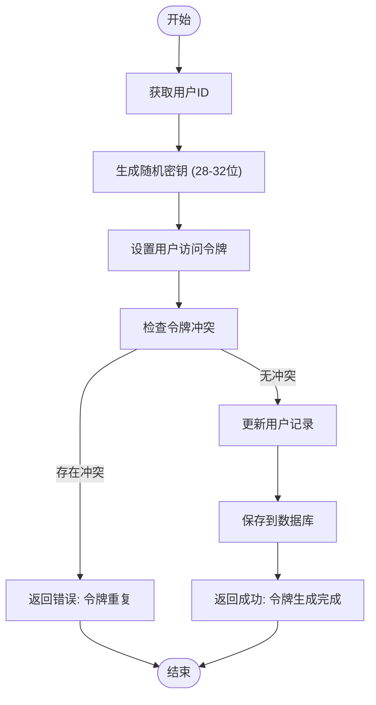
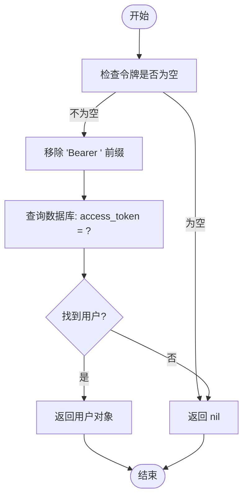
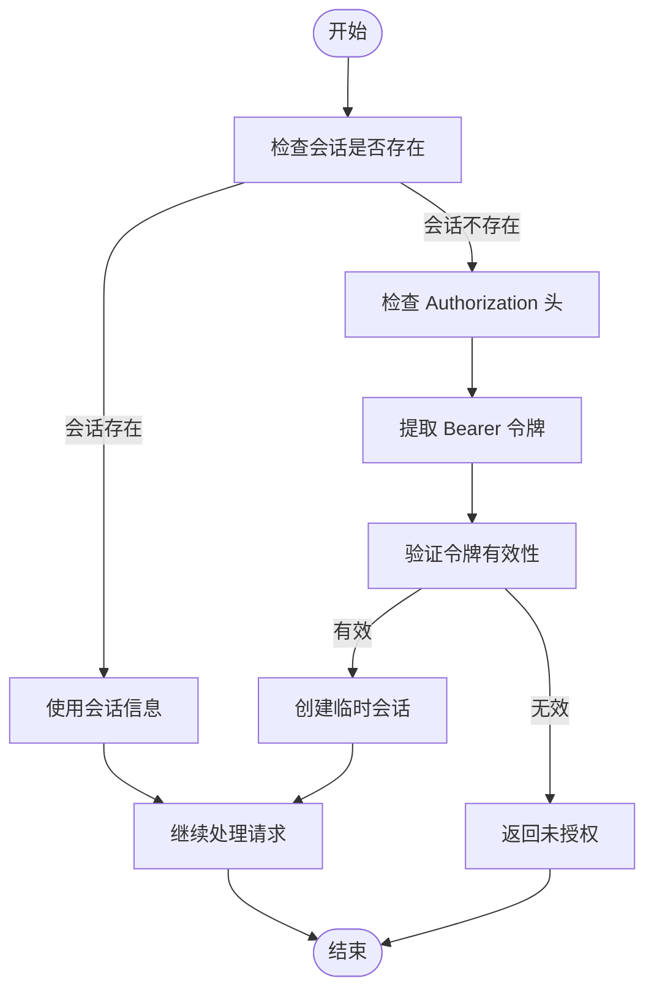
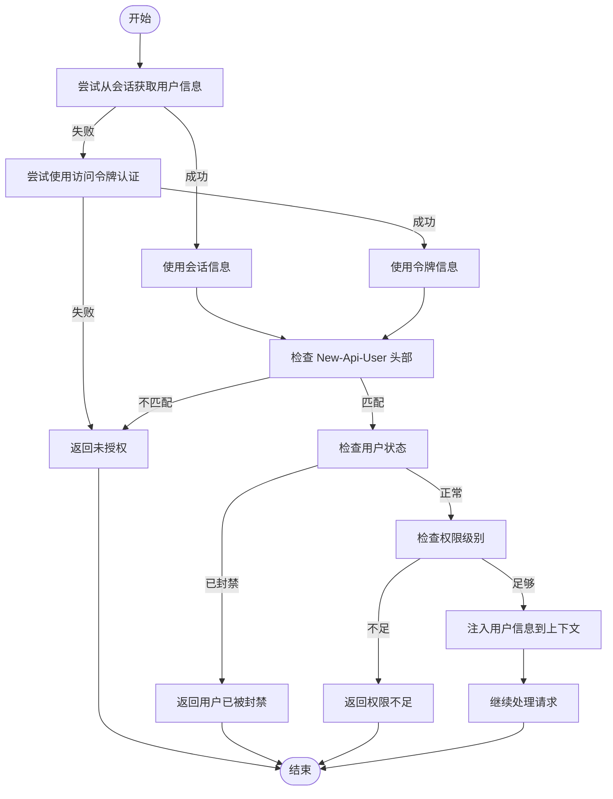
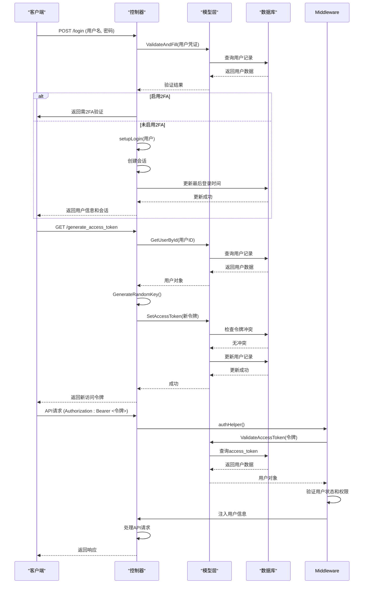

# JWT认证流程

<cite>
**本文档引用的文件**
- [auth.go](file://middleware/auth.go)
- [user.go](file://model/user.go)
- [token.go](file://controller/token.go)
- [user.go](file://controller/user.go)
</cite>

## 目录
1. [简介](#简介)
2. [认证流程概述](#认证流程概述)
3. [令牌生成机制](#令牌生成机制)
4. [令牌验证机制](#令牌验证机制)
5. [HTTP请求中的令牌传递](#http请求中的令牌传递)
6. [会话失效后的备用认证方案](#会话失效后的备用认证方案)
7. [认证中间件分析](#认证中间件分析)
8. [认证流程时序图](#认证流程时序图)

## 简介
本项目实现了一套基于JWT的认证系统，用于保护API端点和用户会话。系统支持多种认证方式，包括基于会话的认证和基于访问令牌的认证。核心功能包括访问令牌的生成、验证和管理，以及通过中间件对请求进行身份验证。

**Section sources**
- [auth.go](file://middleware/auth.go#L1-L322)
- [user.go](file://model/user.go#L657-L667)

## 认证流程概述
系统的认证流程主要分为两种模式：基于会话的认证和基于访问令牌的认证。用户可以通过登录获取会话，或者生成访问令牌用于API调用。认证中间件会检查请求中的认证信息，验证用户身份，并将用户信息注入到请求上下文中。

**Section sources**
- [auth.go](file://middleware/auth.go#L30-L143)
- [user.go](file://controller/user.go#L30-L95)

## 令牌生成机制
访问令牌的生成通过`GenerateAccessToken`函数实现。该函数为用户生成一个随机的访问令牌，并将其存储在用户记录中。令牌的生成遵循以下步骤：

1. 获取当前用户ID
2. 生成一个长度在28-32位之间的随机密钥
3. 将生成的密钥设置为用户的访问令牌
4. 检查生成的令牌是否已存在（避免冲突）
5. 更新用户记录并保存到数据库

**Diagram sources**
- [user.go](file://controller/user.go#L333-L372)

**Section sources**
- [user.go](file://controller/user.go#L333-L372)
- [user.go](file://model/user.go#L351-L364)

## 令牌验证机制
访问令牌的验证通过`ValidateAccessToken`函数实现。该函数接收一个令牌字符串，验证其有效性，并返回对应的用户对象。验证过程包括：

1. 检查令牌是否为空
2. 移除令牌前缀"Bearer "
3. 在数据库中查询具有匹配访问令牌的用户
4. 如果找到匹配的用户，返回用户对象；否则返回nil

**Diagram sources**
- [user.go](file://model/user.go#L657-L667)

**Section sources**
- [user.go](file://model/user.go#L657-L667)

## HTTP请求中的令牌传递
系统支持通过HTTP请求头传递访问令牌。客户端需要在请求头中包含`Authorization`字段，格式为`Bearer <access_token>`。认证中间件会从请求头中提取令牌并进行验证。

除了标准的`Authorization`头，系统还支持从其他头部和查询参数中提取认证信息：
- `New-Api-User`头部：用于指定用户ID
- `Sec-WebSocket-Protocol`头部：用于WebSocket连接
- `x-api-key`头部：用于特定API
- `key`查询参数：用于Gemini API

**Section sources**
- [auth.go](file://middleware/auth.go#L39-L49)
- [auth.go](file://middleware/auth.go#L196-L215)

## 会话失效后的备用认证方案
当会话失效时，系统提供基于访问令牌的备用认证方案。用户可以通过提供有效的访问令牌来重新获得认证。认证中间件会优先检查会话，如果会话不存在，则尝试使用访问令牌进行认证。

备用认证流程：
1. 检查会话是否存在
2. 如果会话不存在，检查`Authorization`头部中的访问令牌
3. 验证访问令牌的有效性
4. 如果令牌有效，使用令牌中的用户信息建立临时会话
5. 继续请求处理

**Diagram sources**
- [auth.go](file://middleware/auth.go#L37-L72)

**Section sources**
- [auth.go](file://middleware/auth.go#L37-L72)

## 认证中间件分析
认证中间件是系统安全的核心组件，负责验证用户身份和权限。中间件通过`authHelper`函数实现通用的认证逻辑，支持不同级别的权限控制（普通用户、管理员、超级管理员）。

中间件的主要功能包括：
- 会话和令牌的双重认证支持
- 用户状态检查（是否被封禁）
- 权限级别验证
- 用户信息注入到请求上下文

中间件的执行流程：
1. 尝试从会话获取用户信息
2. 如果会话不存在，尝试使用访问令牌认证
3. 验证`New-Api-User`头部与认证用户匹配
4. 检查用户状态是否正常
5. 验证用户权限级别
6. 将用户信息注入到请求上下文
7. 继续处理请求

**Diagram sources**
- [auth.go](file://middleware/auth.go#L30-L143)

**Section sources**
- [auth.go](file://middleware/auth.go#L30-L143)

## 认证流程时序图
以下是完整的认证流程时序图，展示了从登录请求到令牌验证的完整数据流：

**Diagram sources**
- [user.go](file://controller/user.go#L30-L95)
- [user.go](file://controller/user.go#L333-L372)
- [auth.go](file://middleware/auth.go#L48-L69)
- [user.go](file://model/user.go#L657-L667)

**Section sources**
- [user.go](file://controller/user.go#L30-L95)
- [user.go](file://controller/user.go#L333-L372)
- [auth.go](file://middleware/auth.go#L48-L69)
- [user.go](file://model/user.go#L657-L667)