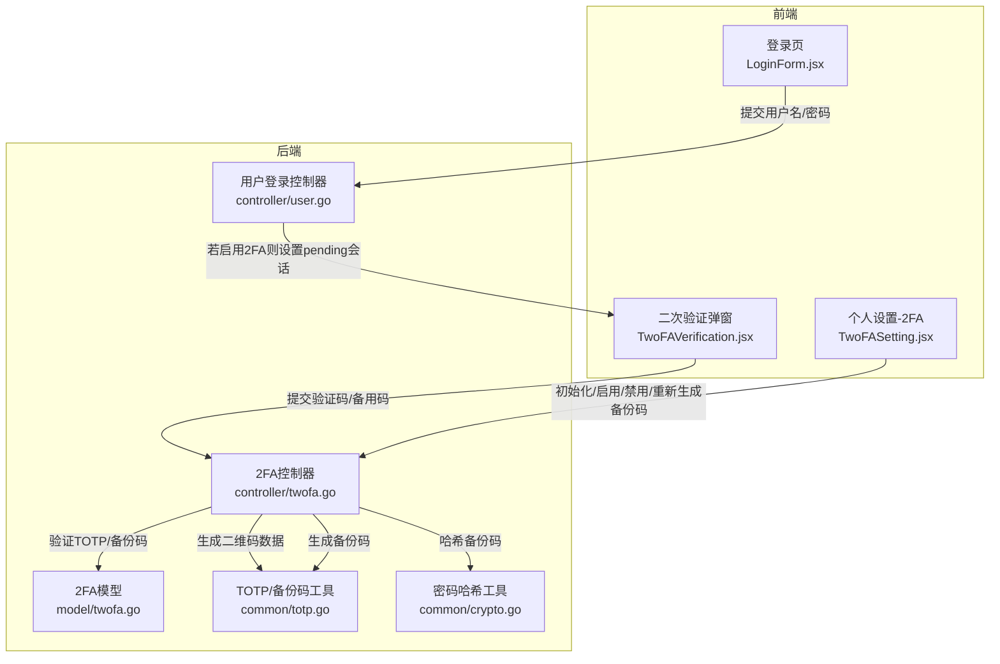
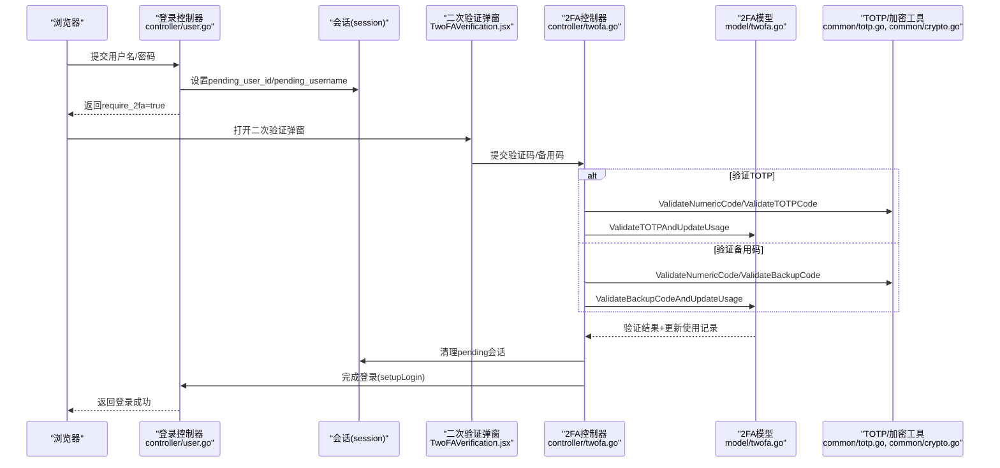
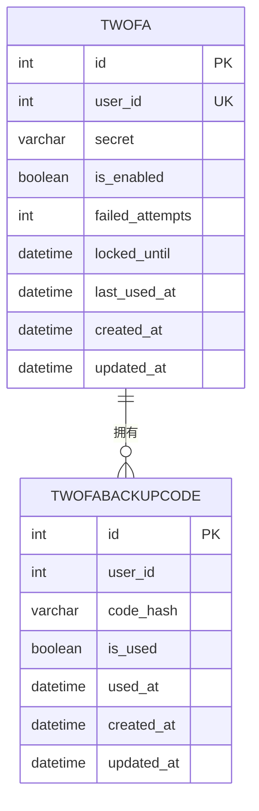
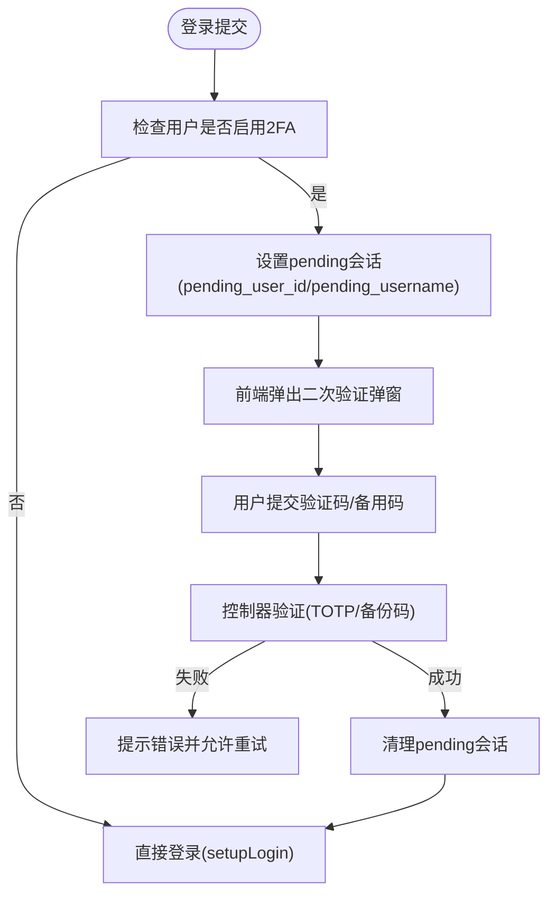
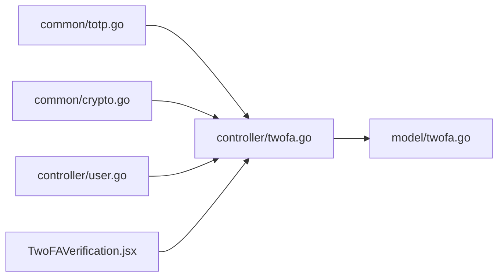

# 双因素认证

<cite>
**本文引用的文件**
- [common/totp.go](file://common/totp.go)
- [controller/twofa.go](file://controller/twofa.go)
- [model/twofa.go](file://model/twofa.go)
- [controller/user.go](file://controller/user.go)
- [web/src/components/auth/TwoFAVerification.jsx](file://web/src/components/auth/TwoFAVerification.jsx)
- [web/src/components/settings/personal/components/TwoFASetting.jsx](file://web/src/components/settings/personal/components/TwoFASetting.jsx)
- [common/crypto.go](file://common/crypto.go)
</cite>

## 目录
1. [简介](#简介)
2. [项目结构](#项目结构)
3. [核心组件](#核心组件)
4. [架构总览](#架构总览)
5. [详细组件分析](#详细组件分析)
6. [依赖关系分析](#依赖关系分析)
7. [性能考量](#性能考量)
8. [故障排查指南](#故障排查指南)
9. [结论](#结论)

## 简介
本文件系统性阐述本项目的双因素认证（2FA）实现，重点覆盖：
- TOTP（基于时间的一次性密码）算法原理与实现要点：密钥生成、二维码数据生成、验证码校验。
- 两步验证完整流程：从用户启用2FA，到登录时的二次验证（含pending会话机制）。
- 备份码（Backup Codes）生成与验证机制，以及设备丢失时的恢复流程。
- 2FA状态的存储方式与安全策略，并给出性能优化建议。

## 项目结构
围绕2FA的关键代码分布在以下模块：
- 通用工具层：TOTP与备份码生成、校验、哈希等逻辑。
- 控制器层：2FA设置、启用、禁用、状态查询、登录二次验证等接口。
- 模型层：2FA与备份码的数据模型、持久化与使用记录。
- 前端组件：登录二次验证弹窗、个人设置中的2FA管理界面。
- 登录流程：用户登录成功且启用2FA时，控制器设置pending会话，前端引导用户完成二次验证。

图表来源
- [controller/user.go](file://controller/user.go#L69-L95)
- [controller/twofa.go](file://controller/twofa.go#L34-L135)
- [model/twofa.go](file://model/twofa.go#L15-L38)
- [common/totp.go](file://common/totp.go#L24-L150)
- [common/crypto.go](file://common/crypto.go#L23-L33)

章节来源
- [controller/user.go](file://controller/user.go#L69-L95)
- [controller/twofa.go](file://controller/twofa.go#L34-L135)
- [model/twofa.go](file://model/twofa.go#L15-L38)
- [common/totp.go](file://common/totp.go#L24-L150)
- [common/crypto.go](file://common/crypto.go#L23-L33)

## 核心组件
- TOTP工具（common/totp.go）
  - 生成TOTP密钥、生成二维码数据、验证TOTP验证码、生成备份码、备份码格式校验与标准化、备份码哈希、数字验证码格式校验。
- 2FA控制器（controller/twofa.go）
  - 初始化2FA设置（生成密钥、二维码数据、备份码）、启用2FA、禁用2FA、获取状态、重新生成备份码、登录时二次验证。
- 2FA模型（model/twofa.go）
  - 2FA与备份码数据结构、创建/更新/删除、失败计数与锁定、备份码哈希验证、使用记录更新、统计查询。
- 登录控制器（controller/user.go）
  - 登录成功且用户启用2FA时，设置pending会话，前端引导二次验证；二次验证成功后清理pending会话并完成登录。
- 前端组件
  - 二次验证弹窗（TwoFAVerification.jsx）：输入6位验证码或8位备用码，切换模式。
  - 个人设置-2FA（TwoFASetting.jsx）：初始化设置、启用、重新生成备份码、查看状态。

章节来源
- [common/totp.go](file://common/totp.go#L24-L150)
- [controller/twofa.go](file://controller/twofa.go#L34-L555)
- [model/twofa.go](file://model/twofa.go#L15-L324)
- [controller/user.go](file://controller/user.go#L69-L126)
- [web/src/components/auth/TwoFAVerification.jsx](file://web/src/components/auth/TwoFAVerification.jsx#L1-L245)
- [web/src/components/settings/personal/components/TwoFASetting.jsx](file://web/src/components/settings/personal/components/TwoFASetting.jsx#L1-L723)

## 架构总览
下图展示了从登录到二次验证的整体调用链路，以及关键数据流。

图表来源
- [controller/user.go](file://controller/user.go#L69-L95)
- [controller/twofa.go](file://controller/twofa.go#L399-L487)
- [model/twofa.go](file://model/twofa.go#L236-L297)
- [common/totp.go](file://common/totp.go#L36-L46)
- [common/crypto.go](file://common/crypto.go#L23-L33)

## 详细组件分析

### TOTP算法与密钥生成
- 密钥生成
  - 使用TOTP库生成密钥，周期为30秒，6位数字，算法SHA1，发行者名称来自系统名。
- 二维码数据生成
  - 生成otpauth://totp链接，包含issuer、accountName、secret、digits、period等参数，供认证器扫描。
- 验证流程
  - 输入清洗（去除空格），长度校验（6位），再调用TOTP库验证。
- 数字验证码格式校验
  - 去除空格后校验长度与仅数字。

章节来源
- [common/totp.go](file://common/totp.go#L24-L46)
- [common/totp.go](file://common/totp.go#L144-L150)
- [common/totp.go](file://common/totp.go#L127-L142)

### 备份码生成与验证机制
- 生成策略
  - 生成固定数量的随机备用码，每个8位，字符集为字母与数字，格式为XXXX-XXXX。
- 存储策略
  - 备份码以哈希形式存储，便于安全验证；每次重新生成会先删除旧记录，再插入新记录。
- 验证流程
  - 格式标准化（去分隔符、大写），查找未使用记录，逐条比对哈希，命中后标记为已使用并更新时间。
- 使用限制
  - 每个备用码仅能使用一次；前端提示“每个备用码只能使用一次”。

章节来源
- [common/totp.go](file://common/totp.go#L48-L106)
- [common/crypto.go](file://common/crypto.go#L23-L33)
- [model/twofa.go](file://model/twofa.go#L144-L172)
- [model/twofa.go](file://model/twofa.go#L174-L205)

### 两步验证完整流程（含pending会话）
- 启用2FA
  - 初始化设置：生成TOTP密钥、二维码数据、备份码，保存未启用状态的2FA记录与备份码哈希。
  - 启用：提交6位验证码，验证通过后启用并重置失败计数与锁定状态。
- 登录二次验证
  - 登录成功且用户启用2FA时，控制器设置pending会话（包含pending_user_id与pending_username），前端弹出二次验证弹窗。
  - 用户提交验证码或备用码，控制器分别调用TOTP或备份码验证方法；验证成功后清理pending会话并完成登录。
- 状态查询与统计
  - 查询2FA状态（启用、锁定、剩余备用码数量）；管理员可查看启用率统计。

章节来源
- [controller/twofa.go](file://controller/twofa.go#L34-L202)
- [controller/twofa.go](file://controller/twofa.go#L204-L310)
- [controller/twofa.go](file://controller/twofa.go#L312-L396)
- [controller/twofa.go](file://controller/twofa.go#L399-L487)
- [controller/user.go](file://controller/user.go#L69-L95)
- [web/src/components/auth/TwoFAVerification.jsx](file://web/src/components/auth/TwoFAVerification.jsx#L1-L245)
- [model/twofa.go](file://model/twofa.go#L299-L324)

### 设备丢失与恢复流程
- 备份码作为恢复手段
  - 用户在初始化设置时获得一组一次性备用码；当设备丢失或无法访问时，可用备用码完成二次验证。
- 重新生成备份码
  - 在启用2FA后，可通过二次验证（TOTP）保护的接口重新生成备用码，旧码自动失效。
- 前端交互
  - 个人设置界面提供“重新生成备用码”入口，二次验证通过后展示新码并提示旧码失效。

章节来源
- [controller/twofa.go](file://controller/twofa.go#L312-L396)
- [web/src/components/settings/personal/components/TwoFASetting.jsx](file://web/src/components/settings/personal/components/TwoFASetting.jsx#L1-L723)

### 数据模型与存储方式
- TwoFA表
  - 字段：用户ID、密钥、启用状态、失败次数、锁定截止时间、最后使用时间、创建/更新时间。
- TwoFABackupCode表
  - 字段：用户ID、哈希后的备用码、是否已使用、使用时间、创建/更新时间。
- 关键行为
  - 启用/禁用：更新启用状态与失败计数、锁定时间。
  - 失败锁定：超过阈值自动锁定一段时间；解锁需等待。
  - 使用记录：验证成功重置失败计数与锁定，更新最后使用时间。

图表来源
- [model/twofa.go](file://model/twofa.go#L15-L38)
- [model/twofa.go](file://model/twofa.go#L144-L172)

章节来源
- [model/twofa.go](file://model/twofa.go#L15-L38)
- [model/twofa.go](file://model/twofa.go#L116-L143)
- [model/twofa.go](file://model/twofa.go#L236-L297)

### 登录二次验证的pending会话机制
- 登录成功且用户启用2FA时，控制器将用户信息写入会话的pending字段，前端收到require_2fa=true后弹出二次验证弹窗。
- 二次验证成功后，控制器清理pending会话并调用setupLogin完成登录。

图表来源
- [controller/user.go](file://controller/user.go#L69-L95)
- [controller/twofa.go](file://controller/twofa.go#L399-L487)
- [web/src/components/auth/TwoFAVerification.jsx](file://web/src/components/auth/TwoFAVerification.jsx#L1-L245)

章节来源
- [controller/user.go](file://controller/user.go#L69-L95)
- [controller/twofa.go](file://controller/twofa.go#L399-L487)
- [web/src/components/auth/TwoFAVerification.jsx](file://web/src/components/auth/TwoFAVerification.jsx#L1-L245)

## 依赖关系分析
- 组件耦合
  - controller/twofa.go依赖common/totp.go进行TOTP与备份码处理，依赖model/twofa.go进行持久化与使用记录更新。
  - controller/user.go负责登录阶段的pending会话设置，与前端二次验证流程衔接。
  - 前端TwoFAVerification.jsx与controller/twofa.go通过HTTP接口交互。
- 外部依赖
  - TOTP库用于密钥生成与验证码验证。
  - bcrypt用于备份码哈希存储。
- 潜在循环依赖
  - 当前文件间无循环导入迹象；各层职责清晰：工具层、控制器层、模型层、前端组件。

图表来源
- [controller/twofa.go](file://controller/twofa.go#L34-L135)
- [model/twofa.go](file://model/twofa.go#L15-L38)
- [common/totp.go](file://common/totp.go#L24-L150)
- [common/crypto.go](file://common/crypto.go#L23-L33)
- [controller/user.go](file://controller/user.go#L69-L95)
- [web/src/components/auth/TwoFAVerification.jsx](file://web/src/components/auth/TwoFAVerification.jsx#L1-L245)

章节来源
- [controller/twofa.go](file://controller/twofa.go#L34-L135)
- [model/twofa.go](file://model/twofa.go#L15-L38)
- [common/totp.go](file://common/totp.go#L24-L150)
- [common/crypto.go](file://common/crypto.go#L23-L33)
- [controller/user.go](file://controller/user.go#L69-L95)
- [web/src/components/auth/TwoFAVerification.jsx](file://web/src/components/auth/TwoFAVerification.jsx#L1-L245)

## 性能考量
- 验证复杂度
  - TOTP验证为常量时间操作，开销极低；备份码验证为线性扫描未使用记录，通常记录数有限（固定数量），复杂度可接受。
- 数据库写入
  - 失败计数与锁定状态更新、使用记录更新均为轻量写入；备份码重新生成采用事务批量删除+插入，避免并发竞争。
- 并发与锁
  - 失败计数与锁定采用单记录更新，避免热点冲突；备用码验证按未使用条件查询，索引在user_id与is_used上可提升效率。
- 前端体验
  - 二维码数据生成与备份码展示在服务端完成，前端仅渲染，减少计算压力。

[本节为通用指导，无需列出具体文件来源]

## 故障排查指南
- 常见问题与定位
  - 会话过期：二次验证接口检测到pending会话缺失或类型不符，提示会话已过期或无效。
  - 验证码错误：数字验证码格式不正确（非6位或含非数字）、TOTP验证失败、或备用码格式/哈希不匹配。
  - 账户锁定：失败次数达到阈值后被锁定，需等待锁定时间结束。
  - 未启用2FA：登录时用户未启用2FA，二次验证接口返回相应提示。
- 排查步骤
  - 检查登录控制器是否正确设置pending会话。
  - 检查前端二次验证弹窗是否正确提交验证码或备用码。
  - 检查模型层失败计数与锁定逻辑是否生效。
  - 检查备份码哈希存储与验证流程是否一致。
- 相关实现位置
  - 会话设置与二次验证清理：登录控制器与2FA控制器。
  - 验证失败与锁定：模型层失败计数与锁定判断。
  - 备份码哈希与使用：模型层与通用加密工具。

章节来源
- [controller/user.go](file://controller/user.go#L69-L95)
- [controller/twofa.go](file://controller/twofa.go#L399-L487)
- [model/twofa.go](file://model/twofa.go#L116-L143)
- [model/twofa.go](file://model/twofa.go#L236-L297)
- [common/crypto.go](file://common/crypto.go#L23-L33)

## 结论
本项目实现了完整的双因素认证方案：
- 基于TOTP的6位验证码与一次性备用码双重保护，兼顾易用性与安全性。
- 通过pending会话机制在登录后无缝引导二次验证，用户体验流畅。
- 备份码以哈希形式存储，重新生成时原子替换，保障恢复能力。
- 模型层提供失败计数与锁定、使用记录更新等安全控制，配合阈值与锁定时长降低暴力破解风险。
- 前端提供直观的二次验证弹窗与个人设置界面，便于用户启用、禁用与重新生成备份码。