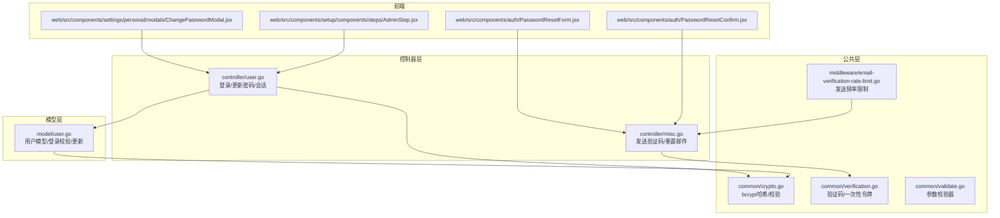
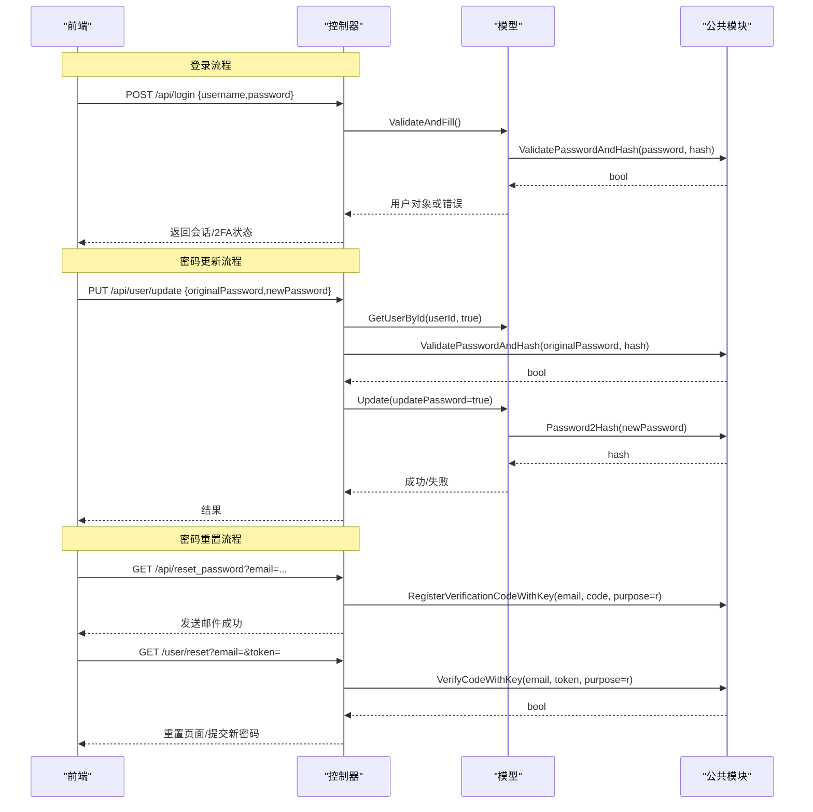
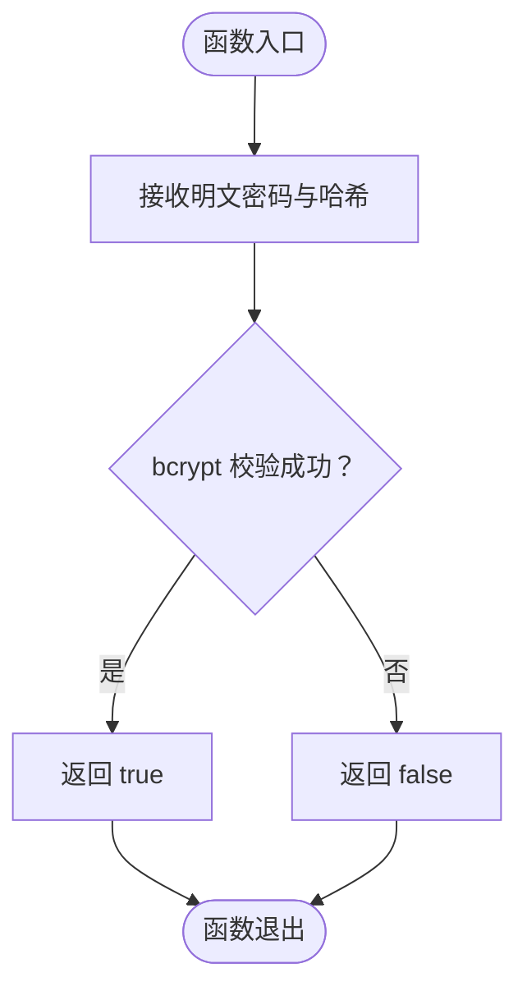
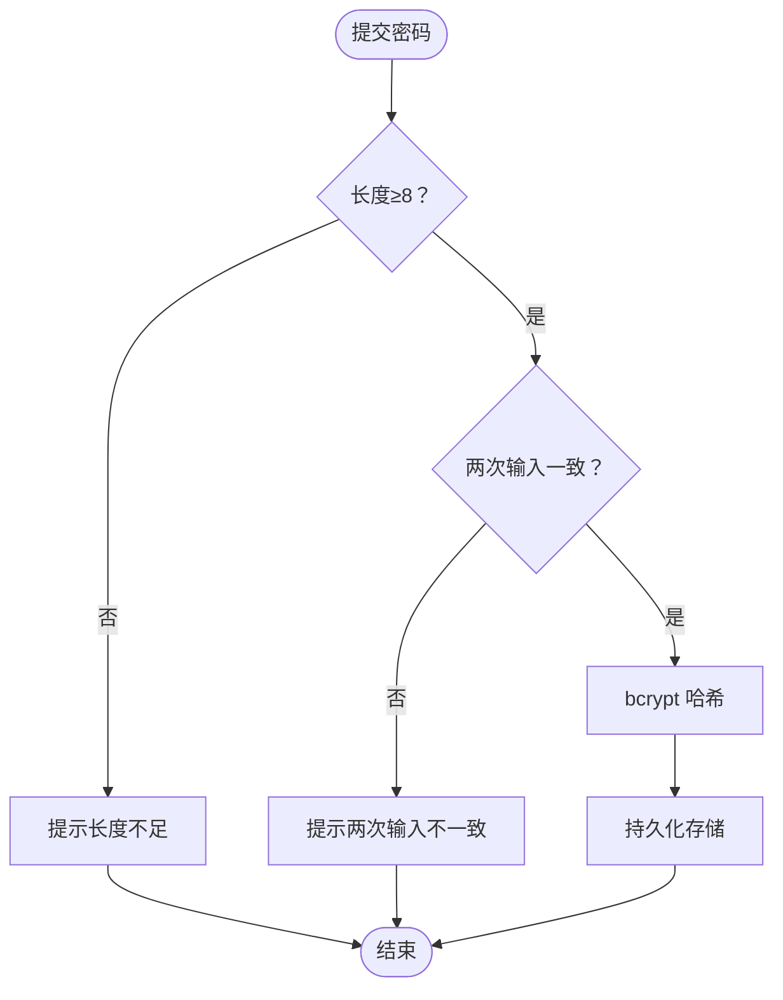
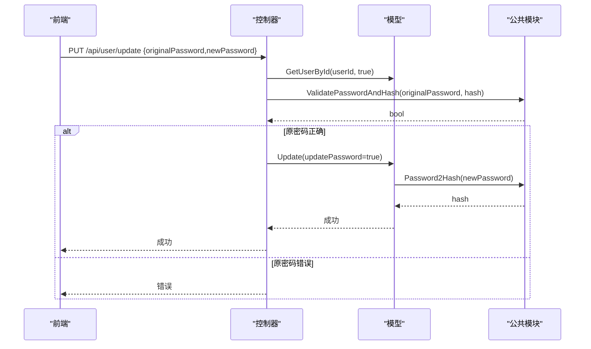
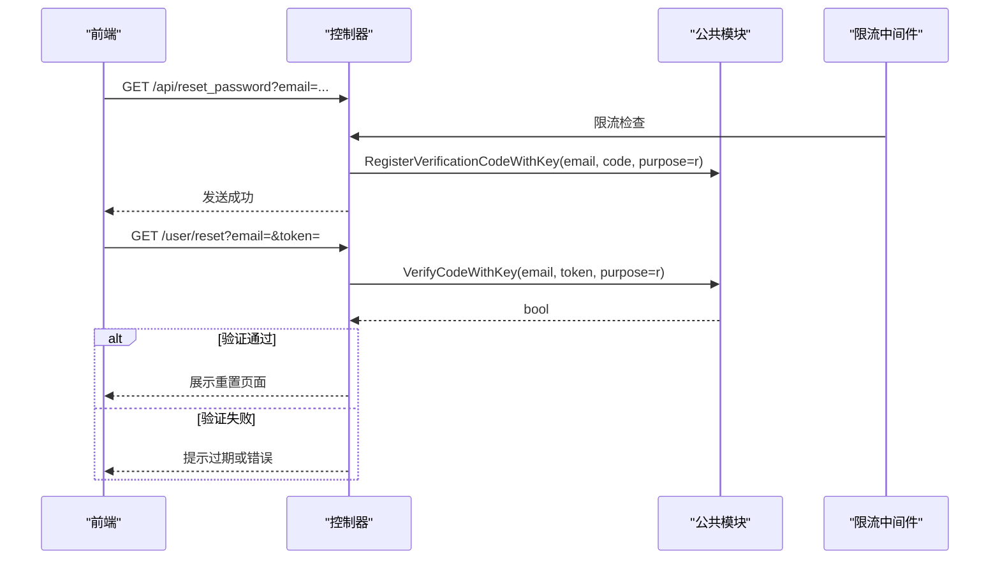
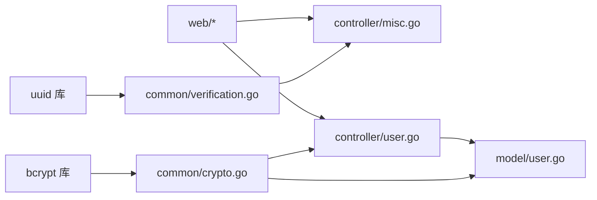

# 密码安全策略

<cite>
**本文引用的文件列表**
- [common/crypto.go](file://common/crypto.go)
- [common/verification.go](file://common/verification.go)
- [controller/user.go](file://controller/user.go)
- [controller/misc.go](file://controller/misc.go)
- [model/user.go](file://model/user.go)
- [common/validate.go](file://common/validate.go)
- [middleware/email-verification-rate-limit.go](file://middleware/email-verification-rate-limit.go)
- [web/src/components/auth/PasswordResetForm.jsx](file://web/src/components/auth/PasswordResetForm.jsx)
- [web/src/components/auth/PasswordResetConfirm.jsx](file://web/src/components/auth/PasswordResetConfirm.jsx)
- [web/src/components/settings/PersonalSetting.jsx](file://web/src/components/settings/PersonalSetting.jsx)
- [web/src/components/settings/personal/modals/ChangePasswordModal.jsx](file://web/src/components/settings/personal/modals/ChangePasswordModal.jsx)
- [web/src/components/setup/components/steps/AdminStep.jsx](file://web/src/components/setup/components/steps/AdminStep.jsx)
</cite>

## 目录
1. [引言](#引言)
2. [项目结构](#项目结构)
3. [核心组件](#核心组件)
4. [架构总览](#架构总览)
5. [详细组件分析](#详细组件分析)
6. [依赖关系分析](#依赖关系分析)
7. [性能考量](#性能考量)
8. [故障排查指南](#故障排查指南)
9. [结论](#结论)
10. [附录](#附录)

## 引言
本文件系统性阐述本项目的密码安全策略，重点覆盖以下方面：
- bcrypt 哈希算法的实现与使用，包括 Password2Hash 函数的参数配置与 ValidatePasswordAndHash 的验证流程
- 密码强度要求与存储策略，涵盖 bcrypt 成本因子（cost factor）的设置现状与建议
- 密码更新流程的安全实现，包括原密码验证机制 checkUpdatePassword 的设计
- 密码重置功能的安全性，包括验证码/一次性链接的时效性与一次性使用策略
- 前端交互与限流配合，确保用户体验与安全性的平衡

## 项目结构
围绕密码安全的关键代码分布在如下模块：
- 公共加密与校验：common/crypto.go
- 验证码与一次性令牌管理：common/verification.go、controller/misc.go
- 用户模型与登录/更新逻辑：model/user.go、controller/user.go
- 前端密码重置与修改界面：web/* 组件
- 注册/验证限流中间件：middleware/email-verification-rate-limit.go
- 参数校验器：common/validate.go

图表来源
- [common/crypto.go](file://common/crypto.go#L1-L33)
- [common/verification.go](file://common/verification.go#L1-L79)
- [controller/user.go](file://controller/user.go#L1-L200)
- [controller/misc.go](file://controller/misc.go#L200-L310)
- [model/user.go](file://model/user.go#L370-L569)
- [middleware/email-verification-rate-limit.go](file://middleware/email-verification-rate-limit.go#L1-L81)
- [web/src/components/auth/PasswordResetForm.jsx](file://web/src/components/auth/PasswordResetForm.jsx#L1-L193)
- [web/src/components/auth/PasswordResetConfirm.jsx](file://web/src/components/auth/PasswordResetConfirm.jsx#L45-L182)
- [web/src/components/settings/personal/modals/ChangePasswordModal.jsx](file://web/src/components/settings/personal/modals/ChangePasswordModal.jsx#L68-L117)
- [web/src/components/setup/components/steps/AdminStep.jsx](file://web/src/components/setup/components/steps/AdminStep.jsx#L69-L107)

章节来源
- [common/crypto.go](file://common/crypto.go#L1-L33)
- [common/verification.go](file://common/verification.go#L1-L79)
- [controller/user.go](file://controller/user.go#L1-L200)
- [controller/misc.go](file://controller/misc.go#L200-L310)
- [model/user.go](file://model/user.go#L370-L569)
- [middleware/email-verification-rate-limit.go](file://middleware/email-verification-rate-limit.go#L1-L81)
- [web/src/components/auth/PasswordResetForm.jsx](file://web/src/components/auth/PasswordResetForm.jsx#L1-L193)
- [web/src/components/auth/PasswordResetConfirm.jsx](file://web/src/components/auth/PasswordResetConfirm.jsx#L45-L182)
- [web/src/components/settings/personal/modals/ChangePasswordModal.jsx](file://web/src/components/settings/personal/modals/ChangePasswordModal.jsx#L68-L117)
- [web/src/components/setup/components/steps/AdminStep.jsx](file://web/src/components/setup/components/steps/AdminStep.jsx#L69-L107)

## 核心组件
- bcrypt 哈希与校验
  - Password2Hash：对明文密码进行哈希，使用 bcrypt 默认成本因子
  - ValidatePasswordAndHash：比较明文密码与哈希值，返回布尔结果
- 验证码与一次性令牌
  - GenerateVerificationCode：生成一次性验证码/令牌
  - RegisterVerificationCodeWithKey：注册并记录目的、时间
  - VerifyCodeWithKey/DeleteKey：验证与清理，具备有效期控制
- 用户模型与登录/更新
  - 用户插入/更新时对密码进行哈希
  - 登录时通过 ValidateAndFill 校验密码与状态
  - 更新密码流程通过 checkUpdatePassword 校验原密码
- 前端交互
  - 密码重置表单与确认页，携带一次性 token 与邮箱
  - 修改密码弹窗，支持二次验证与验证码
  - 系统初始化管理员密码设置，包含最小长度规则

章节来源
- [common/crypto.go](file://common/crypto.go#L1-L33)
- [common/verification.go](file://common/verification.go#L1-L79)
- [model/user.go](file://model/user.go#L370-L569)
- [controller/user.go](file://controller/user.go#L760-L776)
- [web/src/components/auth/PasswordResetForm.jsx](file://web/src/components/auth/PasswordResetForm.jsx#L1-L193)
- [web/src/components/auth/PasswordResetConfirm.jsx](file://web/src/components/auth/PasswordResetConfirm.jsx#L45-L182)
- [web/src/components/settings/personal/modals/ChangePasswordModal.jsx](file://web/src/components/settings/personal/modals/ChangePasswordModal.jsx#L68-L117)
- [web/src/components/setup/components/steps/AdminStep.jsx](file://web/src/components/setup/components/steps/AdminStep.jsx#L69-L107)

## 架构总览
密码安全相关的关键流程如下：
- 登录流程：接收用户名/密码，查询用户并校验密码与状态
- 注册流程：可选邮箱验证码，通过后创建用户并哈希密码
- 密码更新流程：先校验原密码，再对新密码进行哈希并持久化
- 密码重置流程：发送一次性链接/验证码，验证后允许重置

图表来源
- [controller/user.go](file://controller/user.go#L1-L200)
- [controller/user.go](file://controller/user.go#L760-L776)
- [controller/misc.go](file://controller/misc.go#L200-L310)
- [model/user.go](file://model/user.go#L370-L569)
- [common/crypto.go](file://common/crypto.go#L1-L33)
- [common/verification.go](file://common/verification.go#L1-L79)

## 详细组件分析

### bcrypt 哈希与校验
- Password2Hash
  - 输入：明文密码字符串
  - 处理：调用 bcrypt.GenerateFromPassword，使用默认成本因子
  - 输出：哈希后的字符串
- ValidatePasswordAndHash
  - 输入：明文密码、哈希字符串
  - 处理：bcrypt.CompareHashAndPassword
  - 输出：布尔值，表示匹配与否

图表来源
- [common/crypto.go](file://common/crypto.go#L1-L33)

章节来源
- [common/crypto.go](file://common/crypto.go#L1-L33)

### 密码强度要求与存储策略
- 存储策略
  - 用户插入/更新时，若提供密码则对其进行 bcrypt 哈希
  - 登录时通过 ValidateAndFill 校验密码与状态
- 强度要求
  - 系统初始化管理员密码设置包含最小长度规则（至少8位）
  - 前端修改密码弹窗包含“新密码”和“确认新密码”的二次校验
  - 注册流程可结合邮箱验证码增强门槛（可选）

图表来源
- [web/src/components/setup/components/steps/AdminStep.jsx](file://web/src/components/setup/components/steps/AdminStep.jsx#L69-L107)
- [web/src/components/settings/personal/modals/ChangePasswordModal.jsx](file://web/src/components/settings/personal/modals/ChangePasswordModal.jsx#L68-L117)
- [model/user.go](file://model/user.go#L370-L569)

章节来源
- [web/src/components/setup/components/steps/AdminStep.jsx](file://web/src/components/setup/components/steps/AdminStep.jsx#L69-L107)
- [web/src/components/settings/personal/modals/ChangePasswordModal.jsx](file://web/src/components/settings/personal/modals/ChangePasswordModal.jsx#L68-L117)
- [model/user.go](file://model/user.go#L370-L569)

### 密码更新流程的安全实现
- checkUpdatePassword
  - 查询当前用户并获取其密码哈希
  - 使用 ValidatePasswordAndHash 校验原密码
  - 若提供新密码，则标记需要更新密码
- 用户模型 Update/Edit
  - 当 updatePassword 为真时，对新密码进行 bcrypt 哈希
  - 更新数据库并刷新缓存

图表来源
- [controller/user.go](file://controller/user.go#L760-L776)
- [model/user.go](file://model/user.go#L432-L478)
- [common/crypto.go](file://common/crypto.go#L1-L33)

章节来源
- [controller/user.go](file://controller/user.go#L760-L776)
- [model/user.go](file://model/user.go#L432-L478)
- [common/crypto.go](file://common/crypto.go#L1-L33)

### 密码重置功能的安全性
- 一次性令牌与有效期
  - 生成一次性验证码/令牌并注册，记录目的与时间
  - 验证时检查有效期与一致性，并在验证后清理
- 邮件发送与限流
  - 发送密码重置邮件时，对邮箱进行基础校验与白名单/别名限制
  - 通过 Redis 或内存实现发送频率限制，避免滥用
- 前端交互
  - 密码重置表单：输入邮箱，触发发送重置邮件
  - 密码重置确认页：携带 token 与邮箱，提交新密码

图表来源
- [controller/misc.go](file://controller/misc.go#L200-L310)
- [common/verification.go](file://common/verification.go#L1-L79)
- [middleware/email-verification-rate-limit.go](file://middleware/email-verification-rate-limit.go#L1-L81)
- [web/src/components/auth/PasswordResetForm.jsx](file://web/src/components/auth/PasswordResetForm.jsx#L1-L193)
- [web/src/components/auth/PasswordResetConfirm.jsx](file://web/src/components/auth/PasswordResetConfirm.jsx#L45-L182)

章节来源
- [controller/misc.go](file://controller/misc.go#L200-L310)
- [common/verification.go](file://common/verification.go#L1-L79)
- [middleware/email-verification-rate-limit.go](file://middleware/email-verification-rate-limit.go#L1-L81)
- [web/src/components/auth/PasswordResetForm.jsx](file://web/src/components/auth/PasswordResetForm.jsx#L1-L193)
- [web/src/components/auth/PasswordResetConfirm.jsx](file://web/src/components/auth/PasswordResetConfirm.jsx#L45-L182)

## 依赖关系分析
- bcrypt 依赖
  - common/crypto.go 依赖 golang.org/x/crypto/bcrypt
- 验证码依赖
  - common/verification.go 依赖 github.com/google/uuid
  - controller/misc.go 依赖 common/verification.go
- 登录/更新依赖
  - controller/user.go 依赖 model/user.go 与 common/crypto.go
  - model/user.go 依赖 common/crypto.go
- 前端依赖
  - web/* 组件依赖后端接口与一次性 token/验证码

图表来源
- [common/crypto.go](file://common/crypto.go#L1-L33)
- [common/verification.go](file://common/verification.go#L1-L79)
- [controller/misc.go](file://controller/misc.go#L200-L310)
- [controller/user.go](file://controller/user.go#L1-L200)
- [model/user.go](file://model/user.go#L370-L569)

章节来源
- [common/crypto.go](file://common/crypto.go#L1-L33)
- [common/verification.go](file://common/verification.go#L1-L79)
- [controller/misc.go](file://controller/misc.go#L200-L310)
- [controller/user.go](file://controller/user.go#L1-L200)
- [model/user.go](file://model/user.go#L370-L569)

## 性能考量
- bcrypt 成本因子
  - 当前使用默认成本因子，兼顾安全性与性能
  - 建议在高负载场景下评估成本因子，以平衡验证延迟与资源消耗
- 缓存与数据库
  - 用户模型在更新后刷新缓存，减少重复查询
  - 登录流程直接从数据库加载用户并校验，避免不必要的缓存穿透
- 验证码存储
  - 内存存储用于短期验证，容量有限且带过期清理
  - 生产环境建议使用 Redis 存储验证码，提高并发与持久性

[本节为通用指导，不直接分析具体文件]

## 故障排查指南
- 登录失败
  - 检查用户名/密码是否为空，以及用户状态是否启用
  - 确认 ValidateAndFill 是否返回密码错误或封禁提示
- 更新密码失败
  - 确认原密码校验是否通过
  - 检查新密码是否为空或未提供
- 密码重置失败
  - 验证码/链接是否过期（默认有效期分钟数）
  - 发送过于频繁是否触发限流
- 参数校验失败
  - 使用公共校验器对请求体进行结构化校验

章节来源
- [controller/user.go](file://controller/user.go#L1-L200)
- [controller/user.go](file://controller/user.go#L760-L776)
- [model/user.go](file://model/user.go#L500-L517)
- [common/verification.go](file://common/verification.go#L1-L79)
- [middleware/email-verification-rate-limit.go](file://middleware/email-verification-rate-limit.go#L1-L81)
- [common/validate.go](file://common/validate.go#L1-L10)

## 结论
本项目采用 bcrypt 对密码进行安全哈希存储，并通过 ValidatePasswordAndHash 实现高效校验；密码更新流程严格要求原密码校验，确保变更可控；密码重置流程结合一次性验证码/链接与有效期控制，配合发送限流，形成较为完整的安全闭环。建议在生产环境中进一步优化成本因子与验证码存储介质，以提升整体安全性与稳定性。

[本节为总结性内容，不直接分析具体文件]

## 附录
- 关键实现路径参考
  - bcrypt 哈希与校验：[common/crypto.go](file://common/crypto.go#L1-L33)
  - 验证码与一次性令牌：[common/verification.go](file://common/verification.go#L1-L79)
  - 登录与更新流程：[controller/user.go](file://controller/user.go#L1-L200), [controller/user.go](file://controller/user.go#L760-L776)
  - 用户模型与密码存储：[model/user.go](file://model/user.go#L370-L569)
  - 密码重置邮件与限流：[controller/misc.go](file://controller/misc.go#L200-L310), [middleware/email-verification-rate-limit.go](file://middleware/email-verification-rate-limit.go#L1-L81)
  - 前端交互组件：[web/src/components/auth/PasswordResetForm.jsx](file://web/src/components/auth/PasswordResetForm.jsx#L1-L193), [web/src/components/auth/PasswordResetConfirm.jsx](file://web/src/components/auth/PasswordResetConfirm.jsx#L45-L182), [web/src/components/settings/personal/modals/ChangePasswordModal.jsx](file://web/src/components/settings/personal/modals/ChangePasswordModal.jsx#L68-L117), [web/src/components/setup/components/steps/AdminStep.jsx](file://web/src/components/setup/components/steps/AdminStep.jsx#L69-L107)