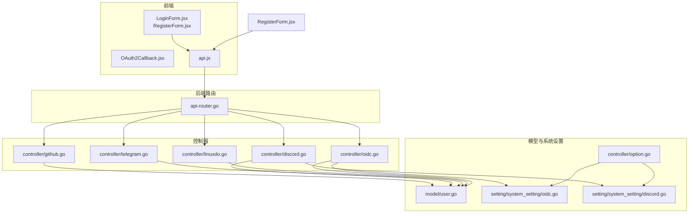
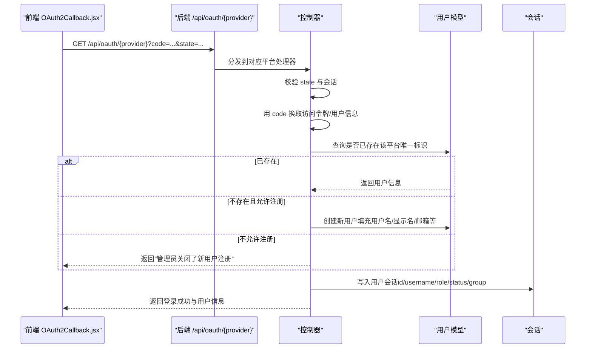
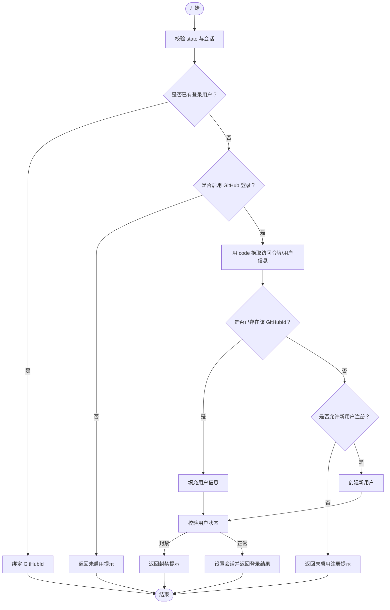
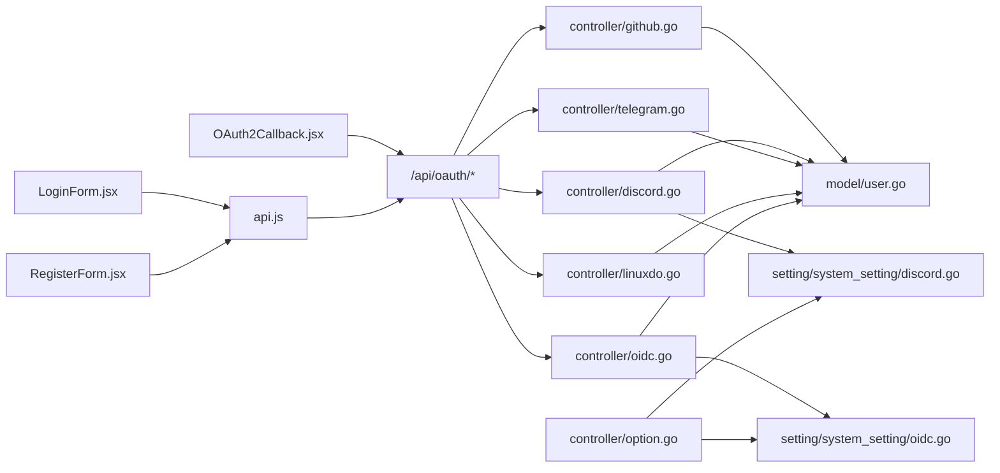

# 第三方登录集成

<cite>
**本文引用的文件**
- [OAuth2Callback.jsx](file://web/src/components/auth/OAuth2Callback.jsx)
- [LoginForm.jsx](file://web/src/components/auth/LoginForm.jsx)
- [RegisterForm.jsx](file://web/src/components/auth/RegisterForm.jsx)
- [api.js](file://web/src/helpers/api.js)
- [SystemSetting.jsx](file://web/src/components/settings/SystemSetting.jsx)
- [api-router.go](file://router/api-router.go)
- [github.go](file://controller/github.go)
- [discord.go](file://controller/discord.go)
- [telegram.go](file://controller/telegram.go)
- [linuxdo.go](file://controller/linuxdo.go)
- [oidc.go](file://controller/oidc.go)
- [user.go](file://model/user.go)
- [oidc.go（系统设置）](file://setting/system_setting/oidc.go)
- [discord.go（系统设置）](file://setting/system_setting/discord.go)
- [option.go](file://controller/option.go)
- [user.go（登录会话）](file://controller/user.go)
</cite>

## 目录
1. [简介](#简介)
2. [项目结构](#项目结构)
3. [核心组件](#核心组件)
4. [架构总览](#架构总览)
5. [详细组件分析](#详细组件分析)
6. [依赖关系分析](#依赖关系分析)
7. [性能与安全考量](#性能与安全考量)
8. [故障排查指南](#故障排查指南)
9. [结论](#结论)
10. [附录：平台接入配置与回调策略](#附录平台接入配置与回调策略)

## 简介
本文件面向开发者与运维人员，系统性阐述本项目的第三方登录集成方案，覆盖 OAuth2.0 协议在 GitHub、Discord、Telegram、OIDC 以及 LinuxDO 平台的实现细节，重点解析前端 OAuth2Callback 组件的授权码获取、验证与用户绑定流程，并给出各平台应用注册配置要点、回调 URL 处理策略、用户信息同步机制（唯一标识符存储与自动创建流程）等关键内容。

## 项目结构
后端采用 Go + Gin 框架，前端采用 React + Vite。第三方登录由前端触发授权跳转，后端路由接收回调并完成用户认证与绑定，最终通过会话与响应返回登录结果。

图表来源
- [api-router.go](file://router/api-router.go#L32-L41)
- [github.go](file://controller/github.go#L82-L174)
- [discord.go](file://controller/discord.go#L102-L179)
- [telegram.go](file://controller/telegram.go#L1-L126)
- [linuxdo.go](file://controller/linuxdo.go#L158-L269)
- [oidc.go](file://controller/oidc.go#L104-L172)
- [user.go](file://model/user.go#L21-L49)
- [oidc.go（系统设置）](file://setting/system_setting/oidc.go#L1-L26)
- [discord.go（系统设置）](file://setting/system_setting/discord.go#L1-L22)
- [option.go](file://controller/option.go#L83-L119)

章节来源
- [api-router.go](file://router/api-router.go#L32-L41)

## 核心组件
- 前端 OAuth2Callback 组件：负责接收授权码与 state，向后端发起 /api/oauth/{provider} 请求，处理登录成功或绑定成功后的页面跳转与本地状态更新。
- 后端 OAuth 路由：统一暴露 /api/oauth/{provider} 接口，分别对接 GitHub、Discord、Telegram、LinuxDO、OIDC 的授权回调处理。
- 各平台控制器：
  - GitHub：换取访问令牌、拉取用户信息、判断是否已绑定或注册新用户、设置会话并返回登录结果。
  - Discord：换取访问令牌、拉取用户信息、判断是否已绑定或注册新用户、设置会话并返回登录结果。
  - Telegram：校验哈希签名、判断是否已绑定或登录、设置会话并返回登录结果。
  - LinuxDO：换取访问令牌、拉取用户信息、信任等级校验、判断是否已绑定或注册新用户、设置会话并返回登录结果。
  - OIDC：换取访问令牌与 ID Token、拉取用户信息、判断是否已绑定或注册新用户、设置会话并返回登录结果。
- 用户模型：统一存储各平台唯一标识（GitHubId、DiscordId、TelegramId、OidcId、LinuxDOId），并提供按唯一标识查找用户的方法。
- 系统设置：OIDC 与 Discord 的客户端配置通过系统设置模块集中管理；后端选项接口对启用开关进行前置校验。

章节来源
- [OAuth2Callback.jsx](file://web/src/components/auth/OAuth2Callback.jsx#L39-L95)
- [api-router.go](file://router/api-router.go#L32-L41)
- [github.go](file://controller/github.go#L82-L174)
- [discord.go](file://controller/discord.go#L102-L179)
- [telegram.go](file://controller/telegram.go#L1-L126)
- [linuxdo.go](file://controller/linuxdo.go#L158-L269)
- [oidc.go](file://controller/oidc.go#L104-L172)
- [user.go](file://model/user.go#L21-L49)
- [oidc.go（系统设置）](file://setting/system_setting/oidc.go#L1-L26)
- [discord.go（系统设置）](file://setting/system_setting/discord.go#L1-L22)
- [option.go](file://controller/option.go#L83-L119)

## 架构总览
以下序列图展示通用 OAuth2.0 回调流程（以 GitHub 为例），其他平台遵循相同模式：前端触发授权跳转 -> 后端路由接收回调 -> 控制器换取令牌/拉取用户信息 -> 判断绑定/注册 -> 设置会话 -> 返回登录结果。

图表来源
- [OAuth2Callback.jsx](file://web/src/components/auth/OAuth2Callback.jsx#L39-L95)
- [api-router.go](file://router/api-router.go#L32-L41)
- [github.go](file://controller/github.go#L82-L174)
- [discord.go](file://controller/discord.go#L102-L179)
- [linuxdo.go](file://controller/linuxdo.go#L158-L269)
- [telegram.go](file://controller/telegram.go#L1-L126)
- [oidc.go](file://controller/oidc.go#L104-L172)
- [user.go（登录会话）](file://controller/user.go#L98-L126)

## 详细组件分析

### OAuth2Callback 组件（前端）
- 功能职责
  - 从 URL 查询参数读取 code 与 state。
  - 对缺失参数进行保护性处理并提示。
  - 向后端发送 /api/oauth/{provider} 请求，携带 code 与 state。
  - 成功路径：若 message 为 bind，则跳转到个人设置页；否则写入用户上下文、本地存储、更新 API 凭据并跳转到令牌页。
  - 失败路径：最多重试 3 次，指数退避等待；重试耗尽则提示错误并返回设置页。
- 关键点
  - 与后端约定 message 为 bind 表示绑定成功，非 bind 表示登录成功。
  - 使用本地状态与用户上下文驱动前端路由跳转。

章节来源
- [OAuth2Callback.jsx](file://web/src/components/auth/OAuth2Callback.jsx#L39-L95)

### 前端触发授权与回调 URL
- 触发入口
  - 登录页与注册页均提供 GitHub、Discord、OIDC、LinuxDO、Telegram 的一键登录按钮。
- 授权跳转
  - GitHub：使用 GitHub 官方授权端点，scope 包含用户邮箱等。
  - Discord：使用 Discord 授权端点，scope 包含 identify+openid。
  - OIDC：使用系统配置中的授权端点，scope 包含 openid profile email。
  - Telegram：通过 bot 发起登录，回调参数包含哈希校验。
  - LinuxDO：使用系统配置的 token/user 端点，回调参数包含 code。
- 回调 URL
  - GitHub/Discord/LinuxDO：/oauth/{provider}
  - OIDC：/oauth/oidc
  - Telegram：/oauth/telegram/login 与 /oauth/telegram/bind

章节来源
- [LoginForm.jsx](file://web/src/components/auth/LoginForm.jsx#L511-L543)
- [RegisterForm.jsx](file://web/src/components/auth/RegisterForm.jsx#L248-L442)
- [api.js](file://web/src/helpers/api.js#L241-L286)

### 后端路由与速率限制
- 路由定义
  - /api/oauth/github、/api/oauth/discord、/api/oauth/oidc、/api/oauth/linuxdo、/api/oauth/state、/api/oauth/telegram/login、/api/oauth/telegram/bind
- 速率限制
  - 所有 OAuth 路由均应用 CriticalRateLimit 中间件，防止暴力尝试与滥用。

章节来源
- [api-router.go](file://router/api-router.go#L32-L41)

### GitHub 登录/绑定流程
- 流程要点
  - 校验 state 与会话一致性。
  - 若已登录用户携带 code，则走绑定流程。
  - 用 code 换取访问令牌并拉取用户信息（登录名、显示名、邮箱）。
  - 若已存在该 GitHubId，则填充用户；否则在允许注册时创建新用户（用户名/显示名/邮箱/角色/状态等）。
  - 校验用户状态是否启用，设置会话并返回登录结果。
- 绑定流程
  - 校验 state 与会话一致性。
  - 用 code 拉取用户信息，检查该 GitHubId 是否已被绑定。
  - 从会话中取出当前用户 id，更新其 GitHubId 并保存，返回 bind。

图表来源
- [github.go](file://controller/github.go#L82-L174)
- [github.go](file://controller/github.go#L176-L220)

章节来源
- [github.go](file://controller/github.go#L82-L174)
- [github.go](file://controller/github.go#L176-L220)

### Discord 登录/绑定流程
- 流程要点
  - 从系统设置读取 ClientId/ClientSecret 与服务端地址，构造 token 交换请求。
  - 用 code 换取访问令牌与用户信息（UID、用户名、显示名）。
  - 若已存在该 DiscordId，则填充用户；否则在允许注册时创建新用户。
  - 校验用户状态是否启用，设置会话并返回登录结果。
- 绑定流程
  - 用 code 换取访问令牌与用户信息，检查该 DiscordId 是否已被绑定。
  - 从会话中取出当前用户 id，更新其 DiscordId 并保存，返回 bind。

章节来源
- [discord.go](file://controller/discord.go#L102-L179)
- [discord.go](file://controller/discord.go#L181-L224)

### Telegram 登录/绑定流程
- 流程要点
  - 校验回调参数的哈希签名，确保来自 Telegram Bot。
  - 登录：根据 TelegramId 查找用户并设置会话。
  - 绑定：检查 TelegramId 是否已被绑定，若未绑定则更新当前用户的 TelegramId。
- 特点
  - 无需后端换取令牌，直接通过签名校验与用户信息。

章节来源
- [telegram.go](file://controller/telegram.go#L1-L126)

### LinuxDO 登录/绑定流程
- 流程要点
  - 用 code 与 Basic 认证换取访问令牌，再拉取用户信息（id、name、trust_level 等）。
  - 信任等级需达到系统设置的最低要求，否则拒绝登录。
  - 若已存在该 LinuxDOId，则填充用户；否则在允许注册时创建新用户。
  - 校验用户状态是否启用，设置会话并返回登录结果。
- 绑定流程
  - 用 code 换取访问令牌与用户信息，检查该 LinuxDOId 是否已被绑定。
  - 从会话中取出当前用户 id，更新其 LinuxDOId 并保存，返回 bind。

章节来源
- [linuxdo.go](file://controller/linuxdo.go#L158-L269)
- [linuxdo.go](file://controller/linuxdo.go#L30-L79)

### OIDC 登录/绑定流程
- 流程要点
  - 从系统设置读取 OIDC 的授权端点、令牌端点、用户信息端点、ClientId/ClientSecret。
  - 用 code 换取访问令牌与 ID Token，解析用户信息（OpenID、邮箱、显示名、用户名）。
  - 若已存在该 OidcId，则填充用户；否则在允许注册时创建新用户。
  - 校验用户状态是否启用，设置会话并返回登录结果。
- 绑定流程
  - 用 code 换取访问令牌与 ID Token，解析用户信息，检查该 OidcId 是否已被绑定。
  - 从会话中取出当前用户 id，更新其 OidcId 并保存，返回 bind。

章节来源
- [oidc.go](file://controller/oidc.go#L104-L172)
- [oidc.go（系统设置）](file://setting/system_setting/oidc.go#L1-L26)

### 用户信息同步与唯一标识存储
- 唯一标识字段
  - GitHubId、DiscordId、TelegramId、OidcId、LinuxDOId 存储于用户表。
- 同步策略
  - 各平台控制器在换取用户信息后，优先按唯一标识查找用户；若不存在且允许注册，则创建新用户并填充用户名、显示名、邮箱等。
- 自动创建流程
  - 注册开关受系统配置控制；创建时设置默认配额、邀请码、默认侧边栏配置等。

章节来源
- [user.go](file://model/user.go#L21-L49)
- [github.go](file://controller/github.go#L133-L164)
- [discord.go](file://controller/discord.go#L142-L169)
- [linuxdo.go](file://controller/linuxdo.go#L223-L249)
- [oidc.go](file://controller/oidc.go#L144-L165)

## 依赖关系分析
- 前端依赖
  - OAuth2Callback.jsx 依赖路由参数与后端 /api/oauth/{provider} 接口。
  - LoginForm.jsx/ RegisterForm.jsx 依赖 api.js 的 onXXXOAuthClicked 方法，负责构造授权 URL 与 state。
- 后端依赖
  - 各平台控制器依赖 model.User 的唯一标识查询与插入方法。
  - OIDC/ Discord 控制器依赖系统设置模块读取客户端配置。
  - option.go 在启用相关开关前进行前置校验，避免配置缺失导致异常。

图表来源
- [OAuth2Callback.jsx](file://web/src/components/auth/OAuth2Callback.jsx#L39-L95)
- [LoginForm.jsx](file://web/src/components/auth/LoginForm.jsx#L511-L543)
- [RegisterForm.jsx](file://web/src/components/auth/RegisterForm.jsx#L248-L442)
- [api.js](file://web/src/helpers/api.js#L241-L286)
- [api-router.go](file://router/api-router.go#L32-L41)
- [github.go](file://controller/github.go#L82-L174)
- [discord.go](file://controller/discord.go#L102-L179)
- [telegram.go](file://controller/telegram.go#L1-L126)
- [linuxdo.go](file://controller/linuxdo.go#L158-L269)
- [oidc.go](file://controller/oidc.go#L104-L172)
- [user.go](file://model/user.go#L21-L49)
- [oidc.go（系统设置）](file://setting/system_setting/oidc.go#L1-L26)
- [discord.go（系统设置）](file://setting/system_setting/discord.go#L1-L22)
- [option.go](file://controller/option.go#L83-L119)

## 性能与安全考量
- 速率限制
  - 所有 OAuth 路由均应用 CriticalRateLimit，降低暴力尝试风险。
- 状态校验
  - 后端严格校验 state 与会话一致性，防止 CSRF 攻击。
- 超时与重试
  - 前端对回调接口调用采用最大重试次数与指数退避，提升弱网环境下的成功率。
- 会话安全
  - 登录成功后写入 id、username、role、status、group 等关键会话字段，后续接口鉴权依赖会话。

章节来源
- [api-router.go](file://router/api-router.go#L32-L41)
- [github.go](file://controller/github.go#L82-L106)
- [discord.go](file://controller/discord.go#L102-L124)
- [linuxdo.go](file://controller/linuxdo.go#L158-L178)
- [telegram.go](file://controller/telegram.go#L1-L126)
- [oidc.go](file://controller/oidc.go#L104-L120)
- [OAuth2Callback.jsx](file://web/src/components/auth/OAuth2Callback.jsx#L39-L95)
- [user.go（登录会话）](file://controller/user.go#L98-L126)

## 故障排查指南
- “未获取到授权码”
  - 检查前端是否正确传递 code 与 state；确认回调 URL 与平台应用配置一致。
- “state is empty or not same”
  - 检查前端是否正确生成并保存 state；确认后端会话中 state 与回调参数一致。
- “管理员未开启通过 X 账户登录以及注册”
  - 检查系统设置中对应开关是否开启；必要时在后台更新配置。
- “无法启用 X 登录，请先填入 X Client Id 以及 X Client Secret！”
  - 检查系统设置中对应客户端配置是否完整；确认 option 接口返回的前置校验通过。
- “用户已被封禁”
  - 检查用户状态字段；确认用户未被禁用。
- “该 X 账户已被绑定”
  - 检查用户唯一标识字段是否重复；解绑后再尝试绑定。
- “Linux DO 信任等级未达到管理员设置的最低信任等级”
  - 检查 LinuxDO 用户 trust_level 配置；调整系统设置的最低信任等级阈值。

章节来源
- [github.go](file://controller/github.go#L98-L110)
- [discord.go](file://controller/discord.go#L117-L123)
- [linuxdo.go](file://controller/linuxdo.go#L192-L200)
- [telegram.go](file://controller/telegram.go#L18-L31)
- [option.go](file://controller/option.go#L83-L119)
- [OAuth2Callback.jsx](file://web/src/components/auth/OAuth2Callback.jsx#L39-L95)

## 结论
本项目在前后端协同下，实现了对 GitHub、Discord、Telegram、OIDC 与 LinuxDO 的标准化 OAuth2.0 集成。前端通过 OAuth2Callback.jsx 统一处理回调结果，后端控制器按平台差异完成令牌交换与用户同步，结合系统设置与速率限制保障安全性与可用性。建议在生产环境中完善平台应用配置与回调 URL 校验，并持续监控登录成功率与错误日志。

## 附录：平台接入配置与回调策略

- GitHub
  - 授权端点：GitHub 官方授权端点
  - 回调 URL：/oauth/github
  - scope：user:email
  - 唯一标识：GitHubId
- Discord
  - 授权端点：Discord 官方授权端点
  - 回调 URL：/oauth/discord
  - scope：identify+openid
  - 唯一标识：DiscordId
  - 客户端配置：通过系统设置中的 ClientId/ClientSecret 管理
- Telegram
  - 登录回调：/oauth/telegram/login
  - 绑定回调：/oauth/telegram/bind
  - 唯一标识：TelegramId
  - 签名校验：服务端对回调参数进行哈希校验
- LinuxDO
  - 授权端点：系统环境变量可配置（默认 https://connect.linux.do/oauth2/token）
  - 用户信息端点：系统环境变量可配置（默认 https://connect.linux.do/api/user）
  - 回调 URL：/oauth/linuxdo
  - 唯一标识：LinuxDOId
  - 信任等级：需达到系统设置的最低信任等级
- OIDC
  - 授权端点、令牌端点、用户信息端点：通过系统设置配置
  - 回调 URL：/oauth/oidc
  - scope：openid profile email
  - 唯一标识：OidcId

章节来源
- [api.js](file://web/src/helpers/api.js#L241-L286)
- [api-router.go](file://router/api-router.go#L32-L41)
- [discord.go（系统设置）](file://setting/system_setting/discord.go#L1-L22)
- [oidc.go（系统设置）](file://setting/system_setting/oidc.go#L1-L26)
- [linuxdo.go](file://controller/linuxdo.go#L81-L156)
- [telegram.go](file://controller/telegram.go#L1-L126)
- [oidc.go](file://controller/oidc.go#L104-L172)