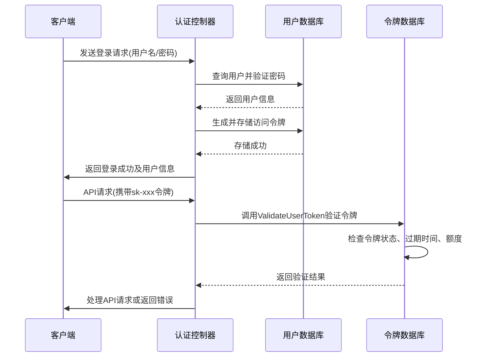
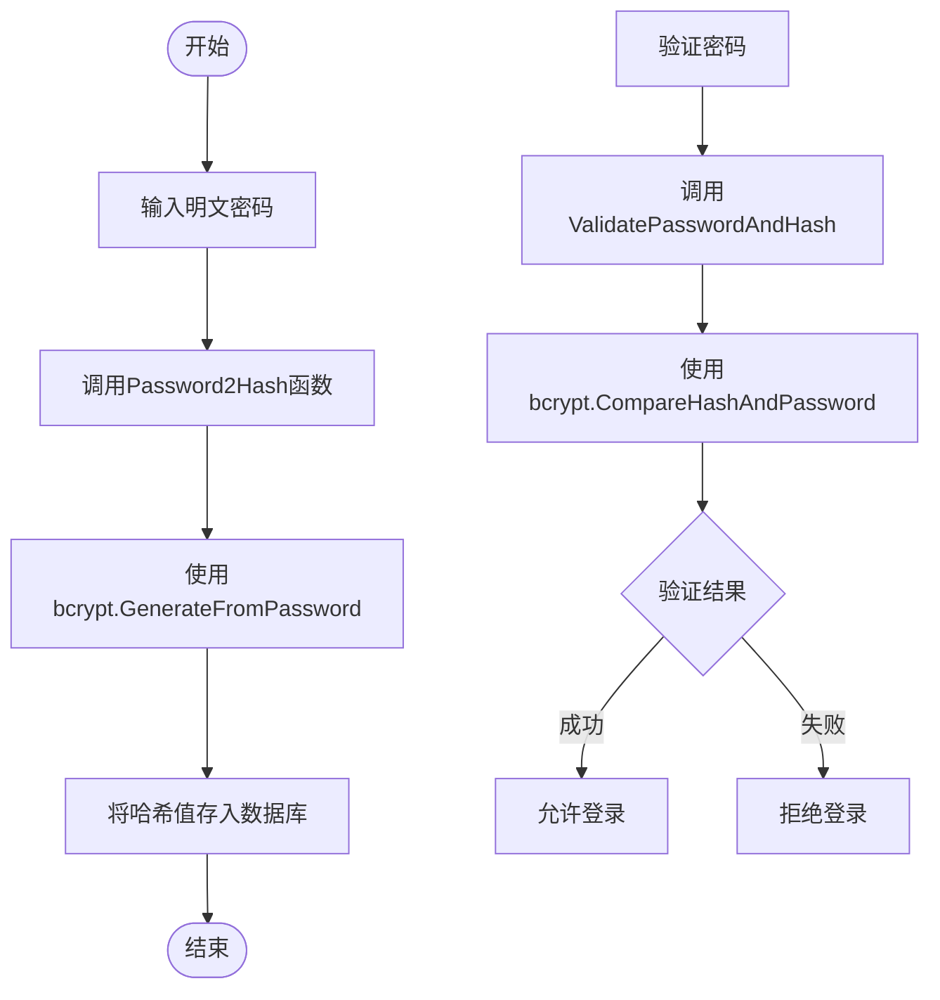
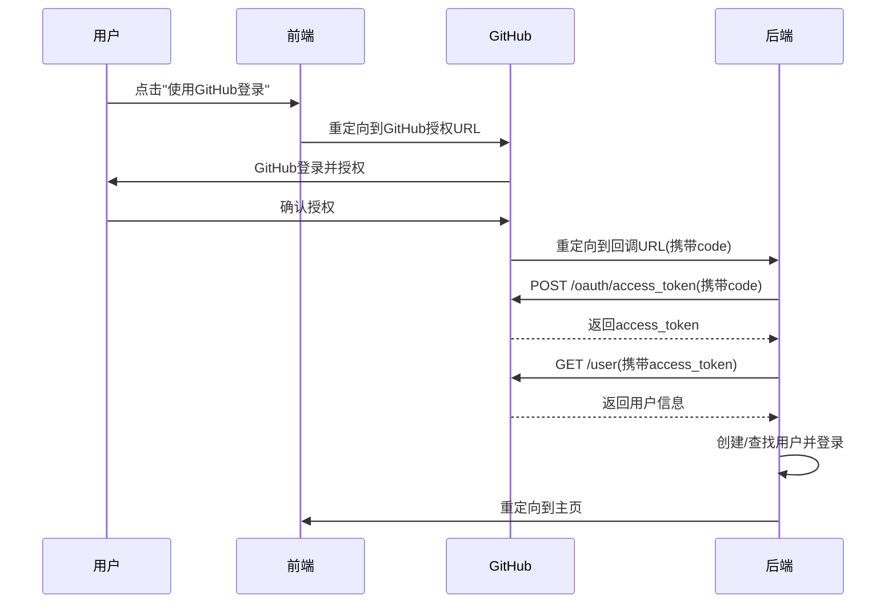

# 认证机制

<cite>
**本文档引用的文件**   
- [auth.go](file://middleware/auth.go)
- [user.go](file://controller/user.go)
- [token.go](file://controller/token.go)
- [crypto.go](file://common/crypto.go)
- [hash.go](file://common/hash.go)
- [user.go](file://model/user.go)
- [token.go](file://model/token.go)
- [github.go](file://controller/github.go)
- [discord.go](file://controller/discord.go)
- [telegram.go](file://controller/telegram.go)
- [oidc.go](file://controller/oidc.go)
- [linuxdo.go](file://controller/linuxdo.go)
- [verification.go](file://common/verification.go)
- [email.go](file://common/email.go)
- [secure_verification.go](file://middleware/secure_verification.go)
</cite>

## 目录
1. [简介](#简介)
2. [基于JWT的认证流程](#基于jwt的认证流程)
3. [密码哈希与敏感数据加密](#密码哈希与敏感数据加密)
4. [第三方登录实现](#第三方登录实现)
5. [核心接口与代码示例](#核心接口与代码示例)
6. [安全头设置与防护策略](#安全头设置与防护策略)
7. [认证中间件与异常处理](#认证中间件与异常处理)

## 简介
本系统实现了一套完整的用户认证机制，支持基于JWT的令牌认证、传统用户名密码登录以及多种第三方平台（GitHub、Discord、Telegram、OIDC、LinuxDO）的OAuth2.0登录。系统通过Gin框架的中间件机制实现了分层的权限控制，结合Redis缓存优化了性能，并提供了邮箱验证、密码重置等安全功能。认证流程设计注重安全性，采用了bcrypt进行密码哈希，HMAC进行数据完整性校验，并通过会话管理和安全验证中间件防止CSRF等攻击。

## 基于JWT的认证流程
系统采用基于JWT（JSON Web Token）的认证机制，但并非直接使用标准JWT库，而是通过自定义的访问令牌（Access Token）和API令牌（API Token）来实现类似功能。认证流程分为令牌生成、验证和刷新三个核心环节。

### 令牌生成与验证
当用户登录成功后，系统会生成一个32位的UUID作为访问令牌（Access Token），并将其存储在用户数据库记录中。此令牌用于系统内部管理操作的身份验证。对于API调用，系统使用API令牌（API Token），其格式为`sk-xxxxxxxx`，通过`common.GenerateKey()`函数生成。

**Diagram sources**
- [user.go](file://model/user.go#L657-L667)
- [token.go](file://model/token.go#L75-L117)
- [auth.go](file://middleware/auth.go#L231-L263)

**Section sources**
- [user.go](file://model/user.go#L657-L667)
- [token.go](file://model/token.go#L75-L117)

### 令牌刷新机制
系统没有实现标准的JWT刷新令牌（Refresh Token）机制，而是通过重新生成访问令牌来实现“刷新”功能。普通用户可以通过调用`/api/user/generate_access_token`接口来生成一个新的访问令牌，旧的令牌将自动失效。这一过程由`GenerateAccessToken`函数处理，它会生成一个新的UUID并更新到用户记录中。

## 密码哈希与敏感数据加密
系统在密码处理和敏感数据保护方面采用了行业标准的加密技术，确保用户凭证的安全。

### 密码哈希处理
所有用户密码在存储前都会通过bcrypt算法进行哈希处理。bcrypt是一种自适应的哈希函数，能够有效抵御彩虹表和暴力破解攻击。系统使用`golang.org/x/crypto/bcrypt`库，以默认成本因子（DefaultCost）进行哈希计算。

**Diagram sources**
- [crypto.go](file://common/crypto.go#L23-L32)
- [user.go](file://model/user.go#L512)

**Section sources**
- [crypto.go](file://common/crypto.go#L23-L32)

### 敏感数据加密策略
系统对敏感数据采取了多层次的保护策略：
1.  **HMAC校验**：使用HMAC-SHA256对关键数据进行完整性校验，防止数据被篡改。
2.  **环境变量加密**：如数据库密码、API密钥等敏感配置信息通过环境变量注入，不硬编码在代码中。
3.  **会话保护**：用户会话信息存储在服务器端的Redis中，客户端仅持有会话ID（Session ID），避免敏感信息泄露。

## 第三方登录实现
系统支持多种第三方平台的OAuth2.0登录，包括GitHub、Discord、Telegram、OIDC和LinuxDO。这些实现遵循统一的模式：通过OAuth2.0授权码流程获取用户信息，然后在本地系统中创建或绑定用户账户。

### GitHub登录
GitHub登录流程如下：
1.  用户点击“使用GitHub登录”，前端重定向到GitHub授权页面。
2.  GitHub授权后，回调到系统的`/oauth/github`接口。
3.  系统使用授权码（code）向GitHub的Token Endpoint请求访问令牌。
4.  使用访问令牌调用GitHub的User API获取用户信息（如GitHub ID、用户名）。
5.  根据GitHub ID在本地数据库中查找用户。若存在则登录，若不存在且注册开放则创建新用户。

**Diagram sources**
- [github.go](file://controller/github.go#L82-L174)

### Discord、OIDC与LinuxDO登录
Discord、OIDC和LinuxDO的登录流程与GitHub基本相同，都是标准的OAuth2.0授权码流程。主要区别在于：
-   **Discord**：需要配置Discord应用的Client ID和Client Secret，并在Discord开发者门户设置重定向URI。
-   **OIDC**：支持通用的OpenID Connect协议，可以与任何符合标准的OIDC提供者（如Keycloak、Auth0）集成。
-   **LinuxDO**：使用了Basic Auth来获取访问令牌，且在注册时会检查用户的信任等级（Trust Level）是否达到管理员设定的最低要求。

### Telegram登录
Telegram登录采用了一种独特的“即时登录”（Instant Login）机制，不依赖OAuth2.0。其流程如下：
1.  用户在Telegram中点击登录链接。
2.  链接中包含用户信息和一个HMAC签名。
3.  后端收到请求后，使用预设的Bot Token重新计算HMAC签名。
4.  比对计算出的签名与请求中的签名是否一致，以验证请求的合法性。
5.  验证通过后，使用Telegram ID查找或创建用户并登录。

**Section sources**
- [github.go](file://controller/github.go#L82-L174)
- [discord.go](file://controller/discord.go#L102-L179)
- [oidc.go](file://controller/oidc.go#L104-L182)
- [linuxdo.go](file://controller/linuxdo.go#L158-L268)
- [telegram.go](file://controller/telegram.go#L72-L99)

## 核心接口与代码示例
系统提供了丰富的RESTful API接口来支持认证功能。

### 登录与注册接口
-   **登录接口** (`POST /api/user/login`): 接收用户名和密码，验证成功后通过`setupLogin`函数设置会话并返回用户信息。
-   **注册接口** (`POST /api/user/register`): 在`Register`函数中处理。若开启了邮箱验证，则需要提供邮箱和验证码。新用户注册后，系统会为其生成一个初始的API令牌。

### 令牌管理接口
-   **获取所有令牌** (`GET /api/token`): 返回当前用户的所有API令牌。
-   **添加令牌** (`POST /api/token`): 调用`AddToken`函数，生成一个新的`sk-xxx`格式的令牌。
-   **删除令牌** (`DELETE /api/token/{id}`): 调用`DeleteToken`函数，从数据库和Redis缓存中移除令牌。

### 密码重置接口
密码重置流程通过邮箱完成：
1.  用户请求重置密码，系统生成一个验证码并发送到其注册邮箱。
2.  用户点击邮件中的链接，该链接包含验证码。
3.  用户在页面上输入新密码，提交请求。
4.  后端验证验证码的有效性，若有效则调用`ResetUserPasswordByEmail`函数更新密码。

**Section sources**
- [user.go](file://controller/user.go#L30-L95)
- [user.go](file://controller/user.go#L145-L274)
- [token.go](file://controller/token.go#L138-L292)
- [user.go](file://controller/user.go#L760-L777)

## 安全头设置与防护策略
系统通过中间件和配置实现了全面的安全防护。

### 安全头设置
虽然代码中未直接设置HTTP安全头，但系统通过以下方式保障安全：
-   **HTTPS强制**：生产环境中应通过反向代理（如Nginx）强制HTTPS。
-   **CORS控制**：通过`middleware/cors.go`中间件配置跨域资源共享策略，限制可访问的源。
-   **内容安全策略**：前端应用应配置CSP头，防止XSS攻击。

### CSRF防护
系统主要通过以下机制防范CSRF攻击：
1.  **状态参数（State Parameter）**：在所有OAuth2.0登录流程中，系统生成一个随机的`state`参数并存储在会话中。回调时会验证请求中的`state`与会话中的是否一致，防止跨站请求伪造。
2.  **安全验证中间件**：`secure_verification.go`中间件要求对敏感操作（如修改密码、删除账户）进行二次验证。用户在执行这些操作前必须通过一个安全验证流程，该验证在5分钟内有效。

### 会话管理策略
-   **会话存储**：会话数据存储在服务器端的Redis中，客户端仅持有会话ID Cookie。
-   **会话超时**：会话的有效期由Redis的过期策略控制。
-   **登出机制**：`Logout`函数会清除会话中的所有数据并保存，实现安全登出。

**Section sources**
- [github.go](file://controller/github.go#L222-L240)
- [secure_verification.go](file://middleware/secure_verification.go#L21-L80)
- [user.go](file://controller/user.go#L128-L143)

## 认证中间件与异常处理
认证中间件是整个系统安全的核心，位于请求处理链的最前端。

### 认证中间件作用
系统定义了多个级别的认证中间件：
-   `TryUserAuth`：尝试获取用户ID，用于非强制登录的场景。
-   `UserAuth`：要求用户必须登录。
-   `AdminAuth`：要求用户为管理员角色。
-   `RootAuth`：要求用户为超级管理员角色。
-   `TokenAuth`：专门用于验证API令牌，处理来自不同渠道（如WebSocket、Gemini API）的特殊认证头。

这些中间件通过`authHelper`函数统一处理，检查会话或请求头中的认证信息，并将用户信息注入到Gin的Context中，供后续处理器使用。

### 异常处理流程
当认证失败时，中间件会立即中断请求链，并返回相应的错误信息：
-   **未登录**：返回401状态码，提示“未登录”。
-   **权限不足**：返回200状态码（兼容性考虑），提示“权限不足”。
-   **令牌无效**：返回401状态码，提示“access token 无效”。
-   **IP限制**：返回403状态码，提示“您的 IP 不在令牌允许访问的列表中”。

这种分层的异常处理确保了系统的健壮性和用户体验。

**Section sources**
- [auth.go](file://middleware/auth.go#L30-L322)