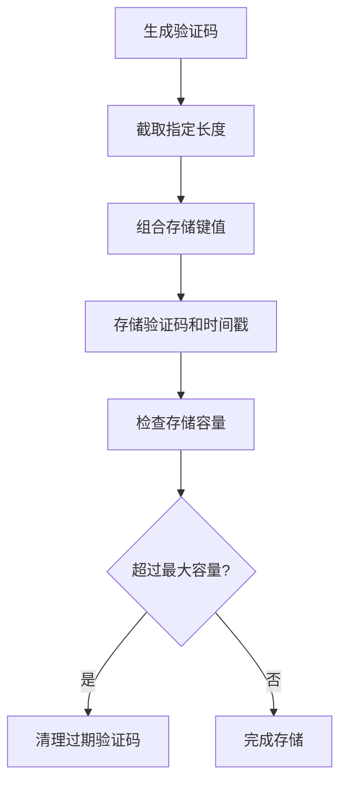
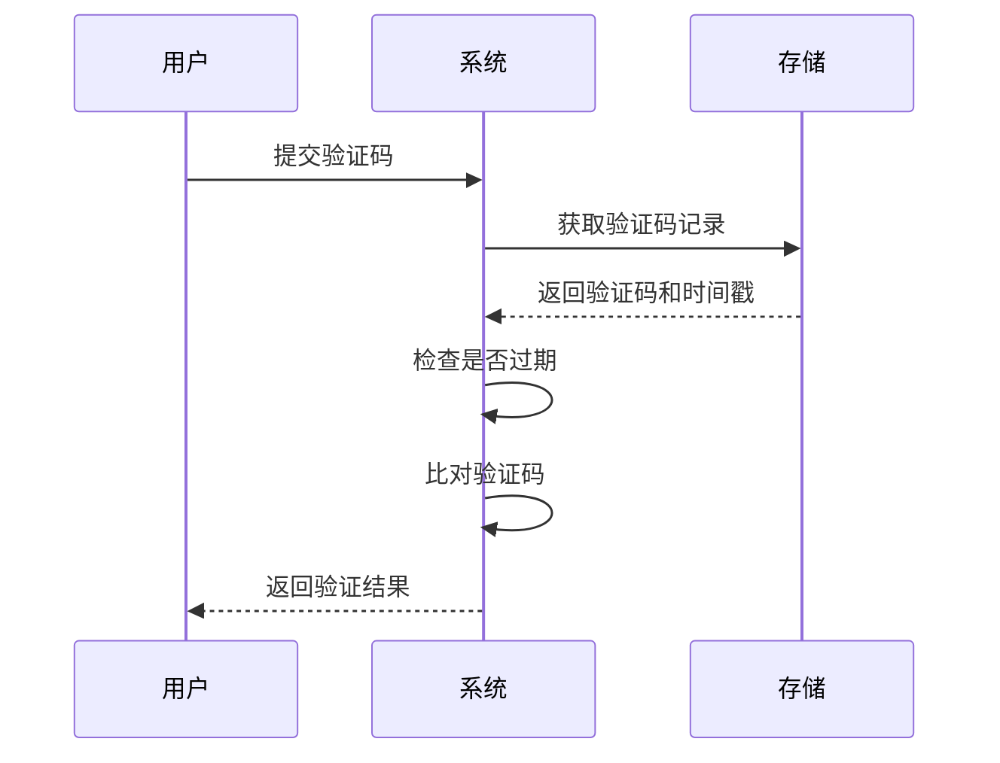
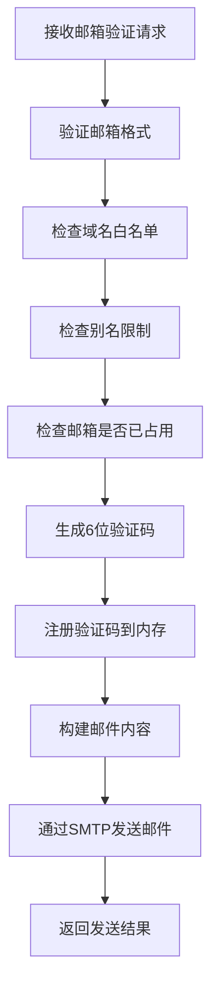
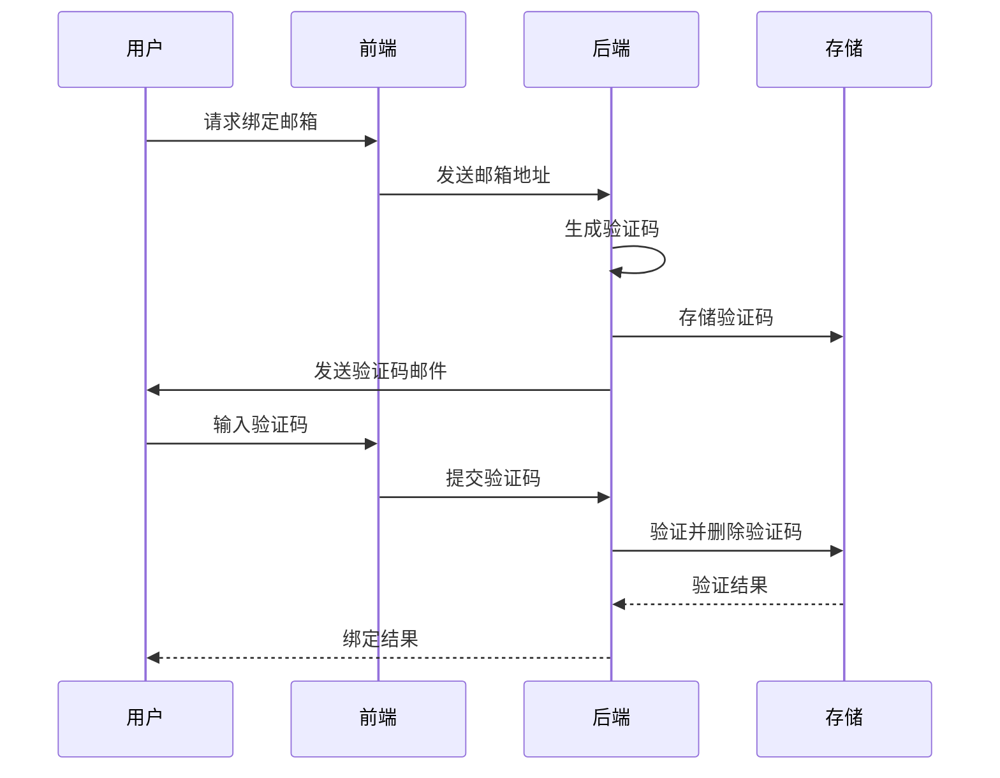
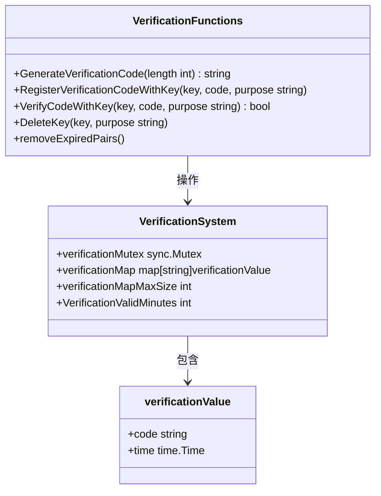
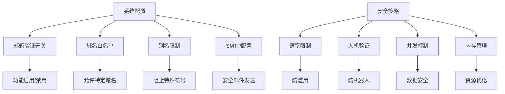

# 邮箱验证机制

<cite>
**本文档引用的文件**   
- [verification.go](file://common/verification.go)
- [misc.go](file://controller/misc.go)
- [email.go](file://common/email.go)
- [constants.go](file://common/constants.go)
- [email-verification-rate-limit.go](file://middleware/email-verification-rate-limit.go)
- [user.go](file://controller/user.go)
- [api-router.go](file://router/api-router.go)
</cite>

## 目录
1. [验证码生成与存储机制](#验证码生成与存储机制)
2. [验证码验证流程](#验证码验证流程)
3. [邮件发送与触发条件](#邮件发送与触发条件)
4. [邮箱绑定与解绑安全实现](#邮箱绑定与解绑安全实现)
5. [并发安全与内存管理](#并发安全与内存管理)
6. [系统配置与限制策略](#系统配置与限制策略)

## 验证码生成与存储机制

邮箱验证机制的核心是验证码的生成、存储和验证流程。系统通过`GenerateVerificationCode`函数生成验证码，该函数使用UUID生成唯一标识符，并根据需要截取指定长度的字符串作为验证码。验证码的存储采用内存映射方式，通过`verificationMap`全局变量存储验证码与邮箱的对应关系。

验证码的存储键值由目的前缀和邮箱地址组合而成，系统定义了两种验证目的：邮箱验证（"v"）和密码重置（"r"）。这种设计确保了不同用途的验证码互不干扰。当验证码注册时，系统会记录当前时间戳，用于后续的时效性验证。

**Section sources**
- [verification.go](file://common/verification.go#L26-L33)
- [verification.go](file://common/verification.go#L35-L45)
- [verification.go](file://common/verification.go#L16-L19)

**Diagram sources**
- [verification.go](file://common/verification.go#L26-L33)
- [verification.go](file://common/verification.go#L35-L45)

## 验证码验证流程

验证码验证通过`VerifyCodeWithKey`函数实现，该函数首先获取当前时间，然后与存储的时间戳进行比较，确保验证码在有效期内。系统通过`VerificationValidMinutes`常量定义验证码的有效时长，默认为10分钟。验证过程包含两个关键检查：验证码是否存在以及是否已过期。

验证流程采用线程安全设计，使用`verificationMutex`互斥锁保护共享资源，防止并发访问导致的数据竞争。验证成功后，系统会比对用户输入的验证码与存储的验证码是否完全匹配，确保验证的安全性。

**Section sources**
- [verification.go](file://common/verification.go#L47-L56)
- [verification.go](file://common/verification.go#L24)
- [verification.go](file://common/verification.go#L21)

**Diagram sources**
- [verification.go](file://common/verification.go#L47-L56)

## 邮件发送与触发条件

邮件发送由`SendEmailVerification`控制器函数触发，该函数首先验证邮箱格式的合法性，然后检查邮箱域名限制和别名限制策略。系统支持管理员配置邮箱域名白名单，仅允许特定域名的邮箱注册。同时，系统可启用邮箱别名限制，阻止包含"+"或"."符号的邮箱地址。

邮件发送前会检查邮箱是否已被占用，避免重复注册。验证码通过`GenerateVerificationCode(6)`生成6位数字验证码，并通过`RegisterVerificationCodeWithKey`函数注册到内存存储中。邮件内容包含系统名称、验证码和有效期信息，通过SMTP服务发送到用户邮箱。

**Section sources**
- [misc.go](file://controller/misc.go#L200-L268)
- [email.go](file://common/email.go#L22-L92)
- [constants.go](file://common/constants.go#L45)

**Diagram sources**
- [misc.go](file://controller/misc.go#L200-L268)
- [email.go](file://common/email.go#L22-L92)

## 邮箱绑定与解绑安全实现

邮箱绑定安全实现包含验证码的注册和使用后删除策略。当用户请求绑定邮箱时，系统通过`/api/verification`端点发送验证码，该端点受速率限制中间件保护，防止滥用。验证码注册后，用户需要在有效期内输入正确的验证码完成绑定。

绑定完成后，系统会调用`DeleteKey`函数删除已使用的验证码，防止重复使用。这种一次性使用策略增强了系统的安全性。邮箱解绑操作同样需要验证用户身份，确保只有账户所有者才能修改邮箱设置。

**Section sources**
- [api-router.go](file://router/api-router.go#L29)
- [verification.go](file://common/verification.go#L58-L62)
- [user.go](file://controller/user.go#L176-L191)

**Diagram sources**
- [api-router.go](file://router/api-router.go#L29)
- [verification.go](file://common/verification.go#L58-L62)

## 并发安全与内存管理

验证系统的并发安全机制基于`sync.Mutex`实现，`verificationMutex`互斥锁确保对`verificationMap`的读写操作是线程安全的。所有对验证码存储的访问都必须先获取锁，操作完成后释放锁，防止多个goroutine同时修改共享数据导致的数据竞争。

内存管理通过`removeExpiredPairs`函数实现，该函数在每次注册新验证码时检查存储容量，当超过`verificationMapMaxSize`（默认10个）时自动清理过期的验证码对。清理过程不加锁，由调用者负责在持有锁的情况下调用，确保操作的原子性。

**Section sources**
- [verification.go](file://common/verification.go#L21)
- [verification.go](file://common/verification.go#L64-L72)
- [verification.go](file://common/verification.go#L42-L44)

**Diagram sources**
- [verification.go](file://common/verification.go#L21-L24)

## 系统配置与限制策略

系统配置包含多项安全策略，通过`constants.go`文件中的全局变量进行配置。邮箱验证功能可由`EmailVerificationEnabled`开关控制，管理员可根据需要启用或禁用。系统实施严格的速率限制策略，通过`EmailVerificationRateLimit`中间件限制30秒内最多发送2次验证码，防止滥用。

邮件发送服务配置包含SMTP服务器地址、端口、账号和令牌等信息，支持SSL加密连接。系统还支持Turnstile人机验证，在发送验证码前进行环境检查，进一步增强安全性。这些配置共同构成了多层次的安全防护体系。

**Section sources**
- [constants.go](file://common/constants.go#L45)
- [email-verification-rate-limit.go](file://middleware/email-verification-rate-limit.go#L14-L18)
- [email.go](file://common/email.go#L76-L88)

**Diagram sources**
- [constants.go](file://common/constants.go#L45)
- [email-verification-rate-limit.go](file://middleware/email-verification-rate-limit.go#L14-L18)
- [email.go](file://common/email.go#L76-L88)