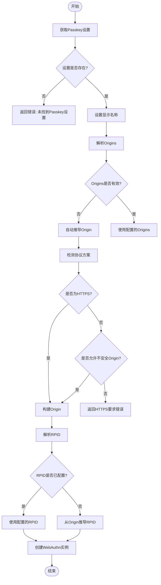
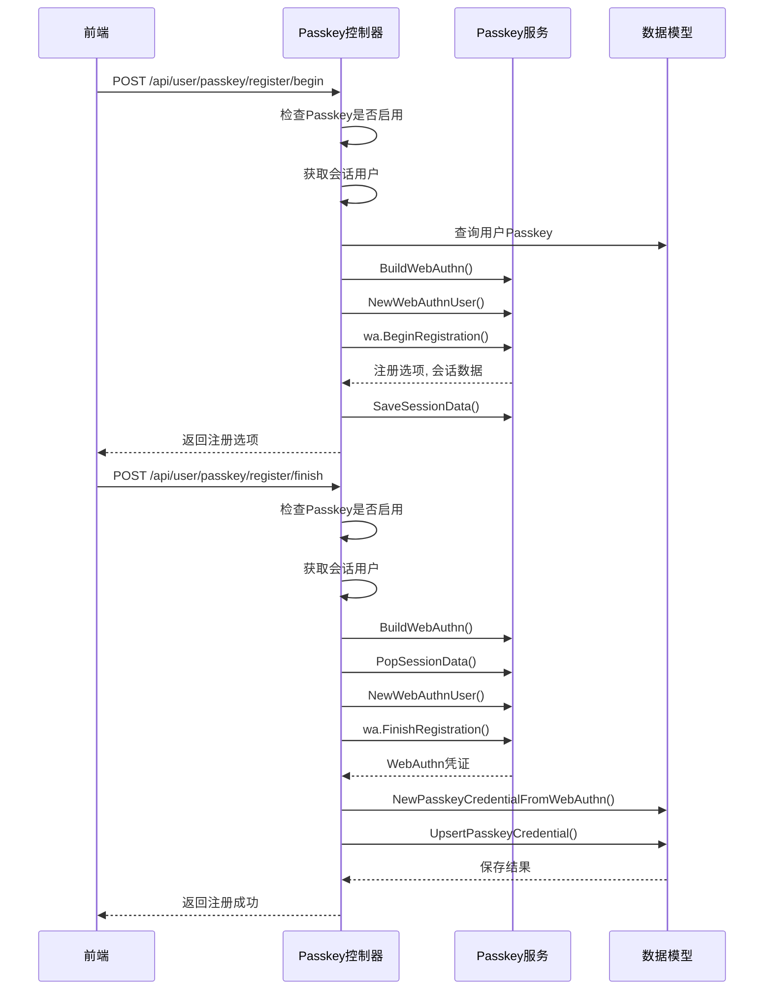
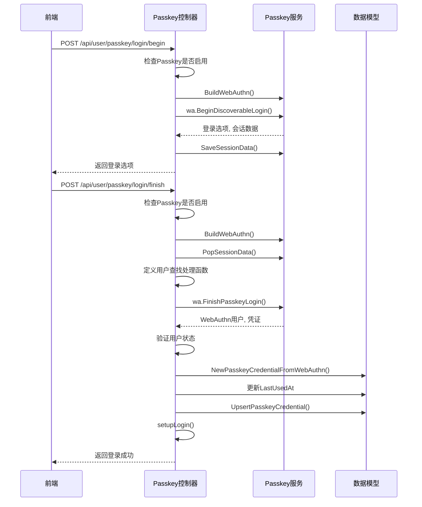
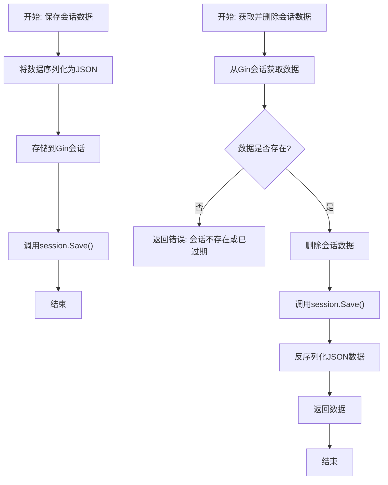
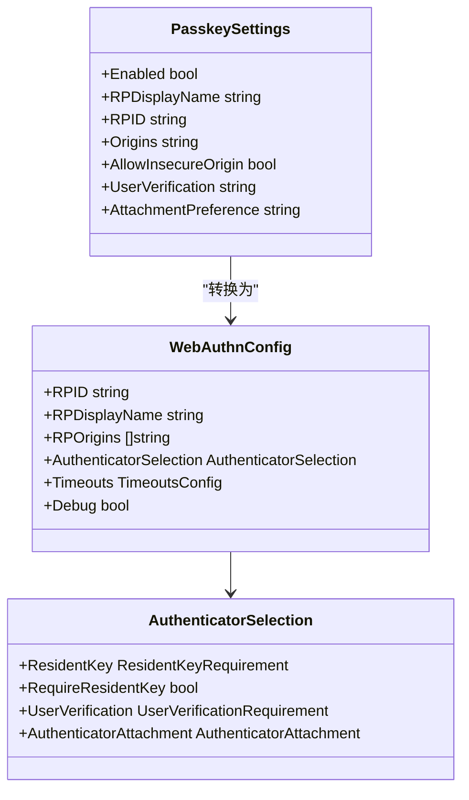
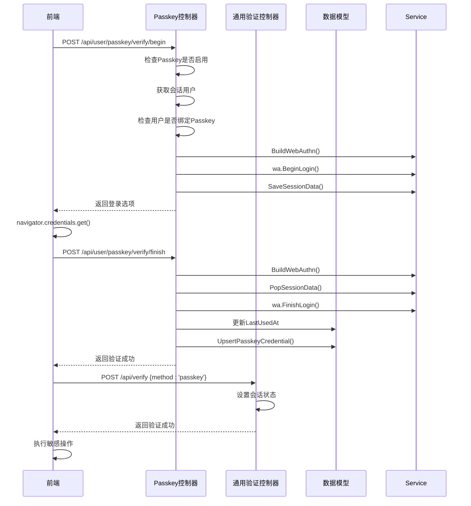
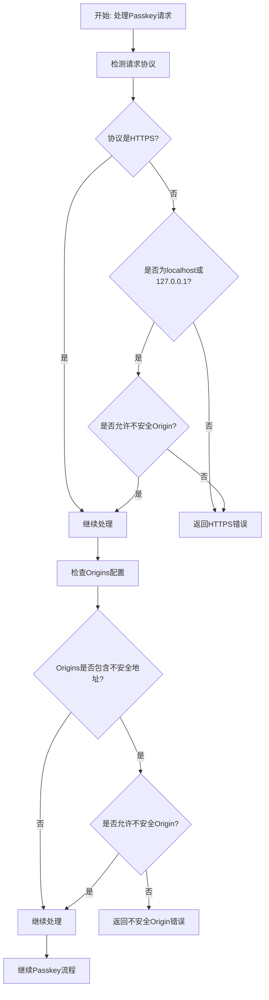

# Passkey 认证

<cite>
**本文档引用的文件**   
- [passkey.go](file://controller/passkey.go)
- [service.go](file://service/passkey/service.go)
- [session.go](file://service/passkey/session.go)
- [user.go](file://service/passkey/user.go)
- [passkey.go](file://model/passkey.go)
- [passkey.js](file://web/src/helpers/passkey.js)
- [secureVerification.js](file://web/src/services/secureVerification.js)
- [passkey.go](file://setting/system_setting/passkey.go)
</cite>

## 目录
1. [简介](#简介)
2. [Passkey 服务初始化](#passkey-服务初始化)
3. [注册与登录流程](#注册与登录流程)
4. [会话状态管理](#会话状态管理)
5. [系统设置与行为控制](#系统设置与行为控制)
6. [安全验证场景应用](#安全验证场景应用)
7. [HTTPS 部署与跨域配置](#https-部署与跨域配置)
8. [常见集成问题排查指南](#常见集成问题排查指南)

## 简介

Passkey（基于WebAuthn协议）是一种无密码身份验证技术，它允许用户使用生物识别、PIN码或设备解锁方式安全地登录网站和应用。本系统实现了完整的Passkey认证功能，支持用户注册、登录、验证以及管理自己的Passkey。通过集成`go-webauthn`库，系统遵循FIDO联盟的WebAuthn标准，确保了跨平台兼容性和高安全性。

**Section sources**
- [passkey.go](file://controller/passkey.go#L1-L498)

## Passkey 服务初始化

Passkey服务的初始化由`BuildWebAuthn`函数完成，该函数根据当前的Passkey设置和请求上下文构建一个`WebAuthn`实例。初始化过程包括以下几个关键步骤：

1. **获取配置**：从系统设置中获取Passkey相关配置。
2. **设置显示名称**：使用配置中的`RPDisplayName`，如果为空则使用系统默认名称。
3. **解析Origins**：确定允许进行认证的源地址列表。
4. **解析RPID**：确定依赖方（Relying Party）的标识符。
5. **配置认证器选择**：根据用户验证要求和附件偏好设置认证器选择策略。
6. **创建WebAuthn实例**：使用上述配置创建并返回`WebAuthn`实例。

**Diagram sources**
- [service.go](file://service/passkey/service.go#L26-L80)

**Section sources**
- [service.go](file://service/passkey/service.go#L26-L80)

## 注册与登录流程

### 注册流程

Passkey注册流程分为两个阶段：开始注册和完成注册。

#### 开始注册 (PasskeyRegisterBegin)

1. 检查管理员是否启用了Passkey登录功能。
2. 获取当前会话用户。
3. 查询用户是否已绑定Passkey，如果已绑定，则在注册选项中排除现有凭证以防止重复注册。
4. 构建WebAuthn实例。
5. 创建WebAuthn用户对象。
6. 调用`BeginRegistration`方法生成注册选项。
7. 将会话数据保存到Gin会话中。
8. 返回注册选项给前端。

#### 完成注册 (PasskeyRegisterFinish)

1. 检查管理员是否启用了Passkey登录功能。
2. 获取当前会话用户。
3. 构建WebAuthn实例。
4. 从会话中获取注册会话数据。
5. 创建WebAuthn用户对象。
6. 调用`FinishRegistration`方法完成注册，验证客户端响应。
7. 将WebAuthn凭证转换为系统内部的Passkey凭证。
8. 将Passkey凭证保存到数据库。
9. 返回成功响应。

**Diagram sources**
- [passkey.go](file://controller/passkey.go#L21-L142)
- [service.go](file://service/passkey/service.go#L26-L80)
- [user.go](file://service/passkey/user.go#L18-L71)
- [passkey.go](file://model/passkey.go#L102-L122)

**Section sources**
- [passkey.go](file://controller/passkey.go#L21-L142)

### 登录流程

Passkey登录流程也分为两个阶段：开始登录和完成登录。

#### 开始登录 (PasskeyLoginBegin)

1. 检查管理员是否启用了Passkey登录功能。
2. 构建WebAuthn实例。
3. 调用`BeginDiscoverableLogin`方法生成登录断言选项。
4. 将会话数据保存到Gin会话中。
5. 返回登录选项给前端。

#### 完成登录 (PasskeyLoginFinish)

1. 检查管理员是否启用了Passkey登录功能。
2. 构建WebAuthn实例。
3. 从会话中获取登录会话数据。
4. 定义一个处理函数，用于根据凭证ID查找用户。
5. 调用`FinishPasskeyLogin`方法完成登录，验证客户端响应。
6. 验证用户状态是否正常。
7. 更新Passkey凭证的最后使用时间。
8. 调用`setupLogin`函数设置用户登录状态。
9. 返回成功响应。

**Diagram sources**
- [passkey.go](file://controller/passkey.go#L203-L327)
- [service.go](file://service/passkey/service.go#L26-L80)
- [session.go](file://service/passkey/session.go#L14-L51)
- [user.go](file://service/passkey/user.go#L18-L71)
- [passkey.go](file://model/passkey.go#L102-L122)

**Section sources**
- [passkey.go](file://controller/passkey.go#L203-L327)

## 会话状态管理

Passkey认证过程中的会话状态管理是通过Gin框架的会话机制实现的。系统使用三个不同的会话键来存储不同阶段的会话数据：

- `RegistrationSessionKey`: 用于存储注册过程中的会话数据。
- `LoginSessionKey`: 用于存储登录过程中的会话数据。
- `VerifySessionKey`: 用于存储安全验证过程中的会话数据。

会话数据的管理由`SaveSessionData`和`PopSessionData`两个函数负责：

- `SaveSessionData`: 将会话数据序列化为JSON字符串后存储到Gin会话中。
- `PopSessionData`: 从Gin会话中获取并反序列化会话数据，然后删除该会话数据以防止重放攻击。

这种"使用即销毁"的模式确保了每个会话数据只能被使用一次，提高了系统的安全性。

**Diagram sources**
- [session.go](file://service/passkey/session.go#L14-L51)

**Section sources**
- [session.go](file://service/passkey/session.go#L14-L51)

## 系统设置与行为控制

Passkey的行为可以通过系统设置进行精细控制。这些设置定义在`PasskeySettings`结构体中，位于`setting/system_setting/passkey.go`文件。

### PasskeySettings 结构体

| 字段 | 类型 | 描述 |
|------|------|------|
| Enabled | bool | 是否启用Passkey登录功能 |
| RPDisplayName | string | 依赖方（Relying Party）的显示名称 |
| RPID | string | 依赖方（Relying Party）的标识符 |
| Origins | string | 允许进行认证的源地址列表，多个地址用逗号分隔 |
| AllowInsecureOrigin | bool | 是否允许使用不安全的Origin（HTTP） |
| UserVerification | string | 用户验证要求，可选值："required", "preferred", "discouraged" |
| AttachmentPreference | string | 认证器附件偏好，可选值："platform", "cross-platform" |

### 自动推导逻辑

当`RPID`或`Origins`未在设置中明确配置时，系统会尝试自动推导：

- **RPID推导**：如果`RPID`为空，则使用`Origins`中的第一个地址的主机名（去除端口）作为RPID。
- **Origin推导**：如果`Origins`为空，则根据当前请求的协议和主机名自动构建Origin。系统会优先使用请求的`Host`头，如果无法获取，则尝试从`ServerAddress`配置中解析。

### 用户验证要求

`UserVerification`字段控制认证过程中对用户验证的要求：
- `required`: 必须进行用户验证（如生物识别或PIN码）。
- `preferred`: 优先进行用户验证，但允许不验证。
- `discouraged`: 不鼓励进行用户验证。

**Diagram sources**
- [passkey.go](file://setting/system_setting/passkey.go#L11-L19)
- [service.go](file://service/passkey/service.go#L59-L77)

**Section sources**
- [passkey.go](file://setting/system_setting/passkey.go#L11-L51)
- [service.go](file://service/passkey/service.go#L26-L80)

## 安全验证场景应用

Passkey不仅可用于用户登录，还可以集成到通用的安全验证接口中，用于保护敏感操作，如查看渠道密钥、修改重要设置等。

### 与通用验证接口的集成

系统提供了一个通用的验证接口`/api/verify`，支持多种验证方式，包括2FA和Passkey。Passkey验证流程如下：

1. 前端调用`/api/user/passkey/verify/begin`开始验证。
2. 后端返回WebAuthn登录选项。
3. 前端使用`navigator.credentials.get()`调用浏览器的Passkey认证。
4. 前端将认证结果发送到`/api/user/passkey/verify/finish`完成验证。
5. 后端验证通过后，前端调用`/api/verify`方法为`passkey`的通用验证接口。
6. 通用验证接口设置会话状态，允许用户执行敏感操作。

**Diagram sources**
- [passkey.go](file://controller/passkey.go#L365-L477)
- [secureVerification.js](file://web/src/services/secureVerification.js#L117-L158)

**Section sources**
- [passkey.go](file://controller/passkey.go#L365-L477)
- [secureVerification.js](file://web/src/services/secureVerification.js#L117-L158)

## HTTPS 部署与跨域配置

Passkey认证对部署环境有严格的安全要求，主要涉及HTTPS和跨域配置。

### HTTPS 部署要求

根据WebAuthn规范，Passkey认证在生产环境中必须通过HTTPS进行。系统对此有严格的检查：

1. **自动检测协议**：系统通过检查`X-Forwarded-Proto`头、TLS连接、`X-Forwarded-Protocol`头等来确定请求的协议。
2. **强制HTTPS**：如果`AllowInsecureOrigin`设置为`false`，且请求不是通过HTTPS发起的（除了`localhost`和`127.0.0.1`），系统将拒绝请求并返回错误。
3. **错误提示**：系统会返回详细的错误信息，指导管理员如何解决HTTPS问题。

### 跨域配置

跨域配置通过`Origins`设置项进行管理：

- **配置格式**：`Origins`是一个逗号分隔的URL列表，例如`https://example.com,https://api.example.com`。
- **安全检查**：如果`AllowInsecureOrigin`为`false`，则不允许包含`http://`开头的不安全Origin。
- **自动推导**：如果未配置`Origins`，系统会根据当前请求的Host自动推导Origin。

### 配置建议

1. **生产环境**：必须配置有效的HTTPS证书，并将`AllowInsecureOrigin`设置为`false`。
2. **开发环境**：可以将`AllowInsecureOrigin`设置为`true`以方便开发，但仅限于`localhost`和`127.0.0.1`。
3. **多域名支持**：如果应用部署在多个域名下，需要在`Origins`中列出所有允许的域名。

**Diagram sources**
- [service.go](file://service/passkey/service.go#L82-L128)
- [passkey.go](file://setting/system_setting/passkey.go#L15-L16)

**Section sources**
- [service.go](file://service/passkey/service.go#L82-L128)

## 常见集成问题排查指南

### 1. Passkey注册/登录失败，提示"管理员未启用 Passkey 登录"

**原因**：系统管理员未在后台启用Passkey功能。

**解决方案**：
- 登录管理员账户。
- 进入系统设置 -> 安全设置。
- 找到Passkey设置，将“启用Passkey登录”选项打开。

### 2. Passkey注册/登录失败，提示"Passkey 仅支持 HTTPS"

**原因**：当前访问不是通过HTTPS，且系统设置不允许不安全的Origin。

**解决方案**：
- **方案一（推荐）**：为您的服务器配置有效的HTTPS证书。
- **方案二（仅限开发环境）**：在系统设置中勾选“允许不安全的Origin”，但仅限于`localhost`和`127.0.0.1`。

### 3. Passkey注册时提示"无法创建 Passkey 凭证"

**原因**：后端在处理客户端返回的凭证时发生错误。

**排查步骤**：
- 检查浏览器控制台是否有错误信息。
- 确认客户端返回的凭证格式是否正确。
- 检查服务器日志，查看是否有更详细的错误信息。

### 4. Passkey登录时提示"未找到 Passkey 凭证"

**原因**：后端数据库中找不到与凭证ID匹配的记录。

**排查步骤**：
- 确认用户确实已经注册了Passkey。
- 检查数据库中的`passkey_credentials`表，确认凭证是否存在。
- 检查凭证ID的编码/解码过程是否正确。

### 5. Passkey验证在部分浏览器上不工作

**原因**：不同浏览器对WebAuthn API的支持程度不同。

**解决方案**：
- 使用`isPasskeySupported()`函数在调用API前检查浏览器支持情况。
- 为不支持的浏览器提供备用的验证方式（如2FA）。

### 6. Passkey注册成功，但登录时无法选择Passkey

**原因**：浏览器的“条件性中介”（Conditional Mediation）功能未启用或不支持。

**解决方案**：
- 确保在`BeginDiscoverableLogin`时，浏览器支持相关功能。
- 检查浏览器设置，确保Passkey功能已启用。

**Section sources**
- [passkey.go](file://controller/passkey.go#L22-L27)
- [service.go](file://service/passkey/service.go#L106-L108)
- [passkey.js](file://web/src/helpers/passkey.js#L150-L177)
- [passkey.go](file://controller/passkey.go#L261-L264)