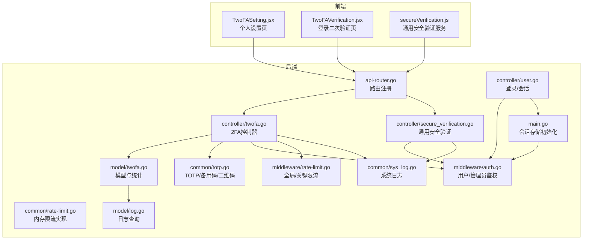
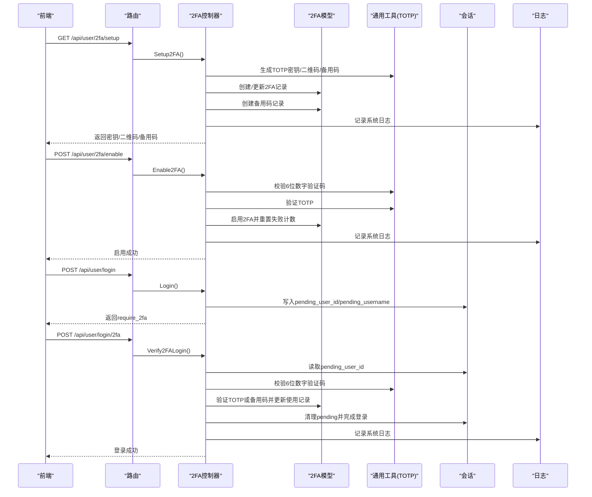
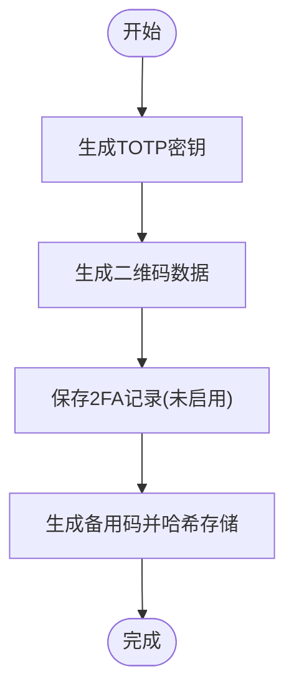
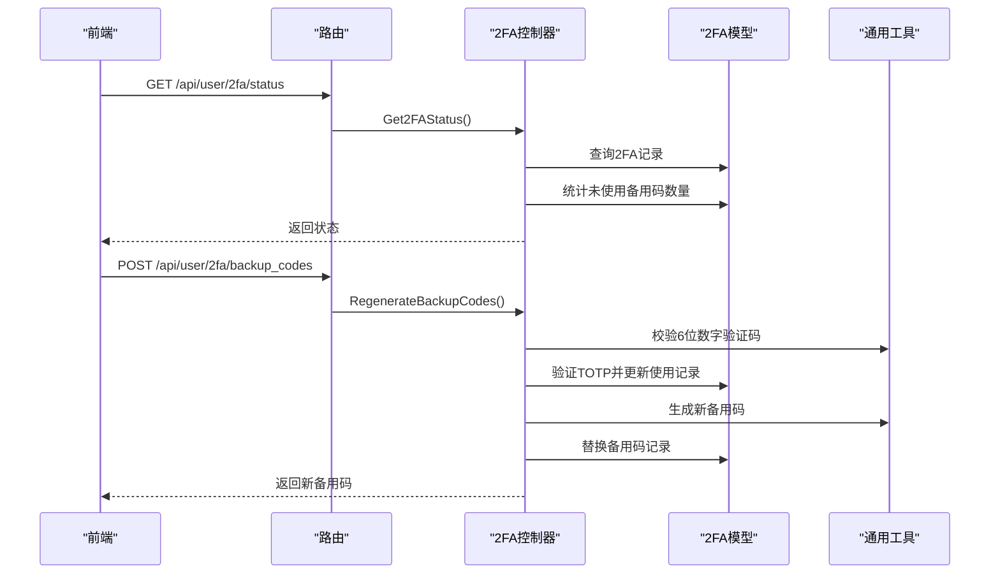
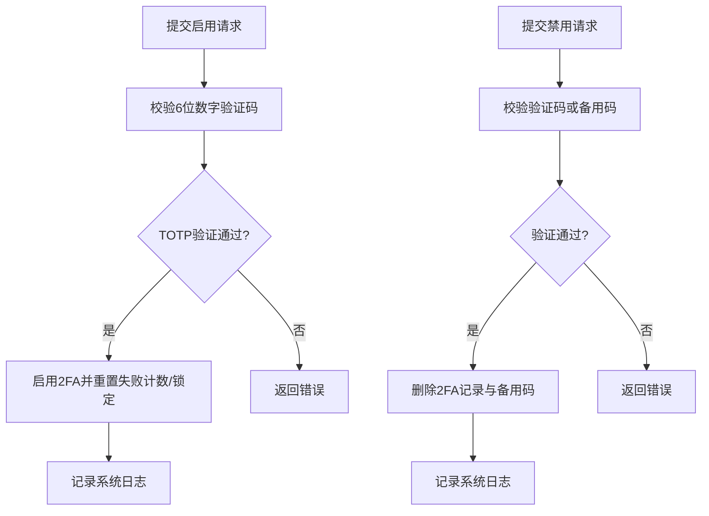
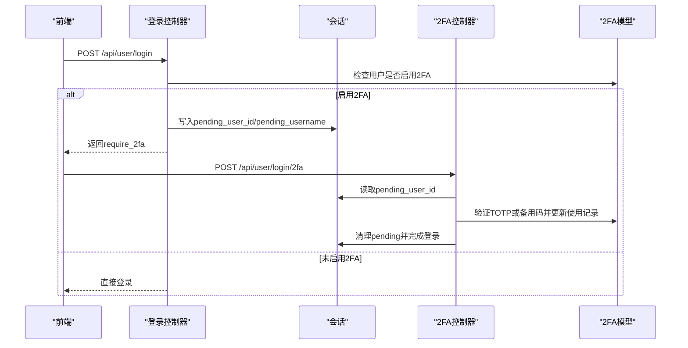
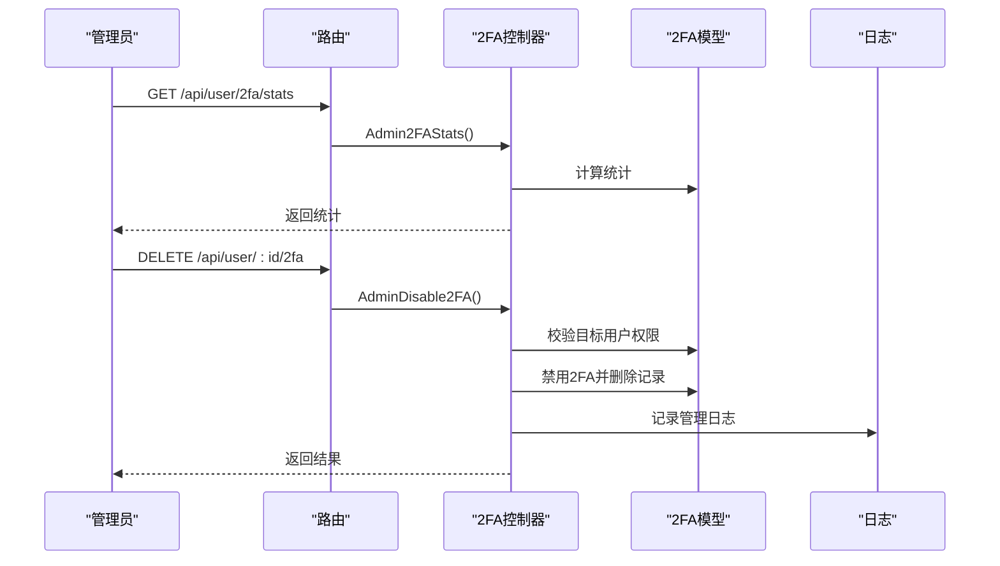
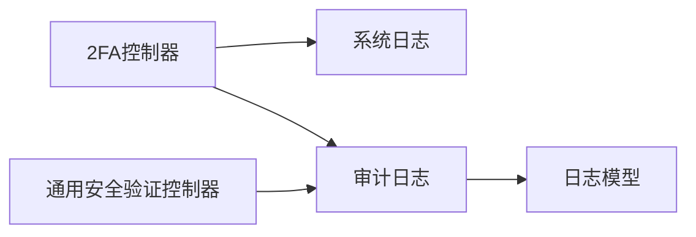
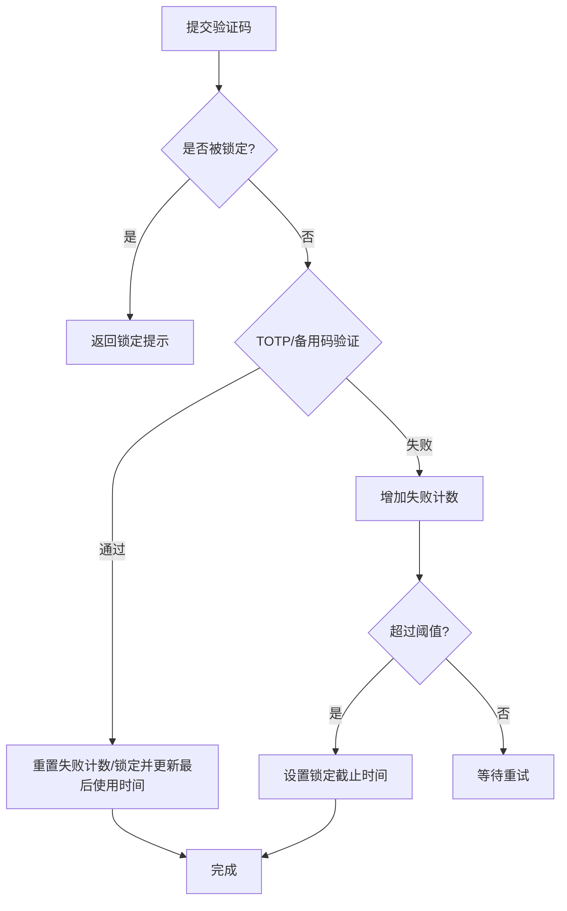
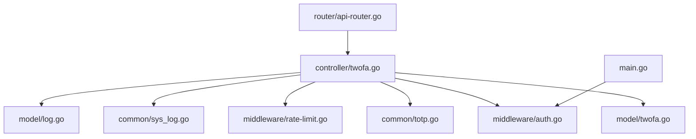

# 双因素认证 (2FA)

<cite>
**本文引用的文件**
- [twofa.go](file://controller/twofa.go)
- [twofa.go](file://model/twofa.go)
- [totp.go](file://common/totp.go)
- [api-router.go](file://router/api-router.go)
- [auth.go](file://middleware/auth.go)
- [user.go](file://controller/user.go)
- [sys_log.go](file://common/sys_log.go)
- [rate-limit.go](file://middleware/rate-limit.go)
- [rate-limit.go](file://common/rate-limit.go)
- [log.go](file://model/log.go)
- [secure_verification.go](file://controller/secure_verification.go)
- [secureVerification.js](file://web/src/services/secureVerification.js)
- [TwoFAVerification.jsx](file://web/src/components/auth/TwoFAVerification.jsx)
- [TwoFASetting.jsx](file://web/src/components/settings/personal/components/TwoFASetting.jsx)
- [main.go](file://main.go)
</cite>

## 目录
1. [简介](#简介)
2. [项目结构](#项目结构)
3. [核心组件](#核心组件)
4. [架构总览](#架构总览)
5. [详细组件分析](#详细组件分析)
6. [依赖关系分析](#依赖关系分析)
7. [性能考量](#性能考量)
8. [故障排查指南](#故障排查指南)
9. [结论](#结论)
10. [附录](#附录)

## 简介
本文件系统性阐述本仓库中的双因素认证（2FA）能力，重点覆盖：
- TOTP（基于时间的一次性密码）的完整实现流程：密钥生成、二维码绑定、验证码校验、备用码生成与使用
- 2FA 的启用/禁用 API 设计与业务逻辑：初始化设置、验证码校验、备用码校验、状态查询
- 管理员视角：统计信息获取与强制禁用接口
- 安全事件日志记录：登录验证、设置变更等操作审计
- 防暴力破解的限流策略与会话管理机制
- 常见问题与最佳实践

## 项目结构
围绕 2FA 的相关模块分布如下：
- 控制器层：处理 2FA 的初始化、启用、禁用、状态查询、备用码重生成、登录二次验证以及管理员统计与强制禁用
- 模型层：持久化 2FA 设置、备用码、失败次数与锁定状态、统计计算
- 通用工具：TOTP 密钥生成、TOTP 验证、备用码生成与哈希、二维码数据生成、会话与日志
- 路由层：暴露 2FA 的 REST 接口
- 中间件：全局限流、用户认证、管理员鉴权
- 前端：2FA 设置页、登录二次验证页、通用安全验证服务

图表来源
- [api-router.go](file://router/api-router.go#L90-L115)
- [twofa.go](file://controller/twofa.go#L33-L555)
- [twofa.go](file://model/twofa.go#L1-L324)
- [totp.go](file://common/totp.go#L1-L151)
- [auth.go](file://middleware/auth.go#L1-L322)
- [rate-limit.go](file://middleware/rate-limit.go#L67-L117)
- [rate-limit.go](file://common/rate-limit.go#L1-L70)
- [sys_log.go](file://common/sys_log.go#L1-L56)
- [user.go](file://controller/user.go#L69-L143)
- [main.go](file://main.go#L140-L151)
- [log.go](file://model/log.go#L205-L276)

章节来源
- [api-router.go](file://router/api-router.go#L90-L115)
- [twofa.go](file://controller/twofa.go#L33-L555)
- [twofa.go](file://model/twofa.go#L1-L324)
- [totp.go](file://common/totp.go#L1-L151)
- [auth.go](file://middleware/auth.go#L1-L322)
- [rate-limit.go](file://middleware/rate-limit.go#L67-L117)
- [rate-limit.go](file://common/rate-limit.go#L1-L70)
- [sys_log.go](file://common/sys_log.go#L1-L56)
- [user.go](file://controller/user.go#L69-L143)
- [main.go](file://main.go#L140-L151)
- [log.go](file://model/log.go#L205-L276)

## 核心组件
- 2FA 控制器：负责初始化设置、启用、禁用、状态查询、备用码重生成、登录二次验证、管理员统计与强制禁用
- 2FA 模型：维护用户 2FA 设置、失败次数与锁定、备用码哈希与使用状态、统计计算
- 通用工具（TOTP/备用码/二维码）：生成密钥、验证 TOTP、生成备用码、标准化与哈希备用码、生成二维码数据
- 路由：暴露 2FA 的 REST 接口，含用户自服务与管理员专用接口
- 中间件：全局 API 限流、关键接口限流、用户/管理员鉴权
- 会话与登录：登录阶段若用户启用 2FA，则进入“待确认”会话；二次验证通过后完成登录
- 日志：系统日志与审计日志（用户操作、登录验证、设置变更）

章节来源
- [twofa.go](file://controller/twofa.go#L33-L555)
- [twofa.go](file://model/twofa.go#L1-L324)
- [totp.go](file://common/totp.go#L1-L151)
- [api-router.go](file://router/api-router.go#L90-L115)
- [auth.go](file://middleware/auth.go#L1-L322)
- [user.go](file://controller/user.go#L69-L143)
- [sys_log.go](file://common/sys_log.go#L1-L56)
- [log.go](file://model/log.go#L205-L276)

## 架构总览
2FA 的端到端流程：
- 初始化设置：生成 TOTP 密钥与二维码数据，生成备用码并持久化，记录系统日志
- 启用 2FA：校验 TOTP 验证码，成功则启用并记录系统日志
- 登录二次验证：登录成功但用户启用 2FA 时，将用户信息放入“待确认”会话；随后通过 /api/user/login/2fa 提交验证码，验证通过后完成登录
- 禁用 2FA：支持 TOTP 验证码或备用码校验，成功则删除 2FA 设置与备用码
- 备用码重生成：通过 TOTP 验证后生成新备用码并替换旧码
- 管理员操作：统计启用率、强制禁用用户 2FA 并记录管理日志

图表来源
- [twofa.go](file://controller/twofa.go#L33-L555)
- [twofa.go](file://model/twofa.go#L1-L324)
- [totp.go](file://common/totp.go#L1-L151)
- [user.go](file://controller/user.go#L69-L143)
- [log.go](file://model/log.go#L205-L276)

## 详细组件分析

### TOTP 实现与密钥生成
- 密钥生成：使用标准 TOTP 库生成密钥，周期 30 秒，6 位数字，算法 SHA1
- 二维码数据：根据发行者与用户名生成 otpauth URI，供认证器应用扫描
- 验证：清理空白字符后校验 6 位数字验证码
- 备用码：生成固定数量与长度的字母数字组合，支持标准化与哈希存储

图表来源
- [totp.go](file://common/totp.go#L24-L51)
- [totp.go](file://common/totp.go#L144-L151)
- [twofa.go](file://controller/twofa.go#L67-L121)

章节来源
- [totp.go](file://common/totp.go#L1-L151)
- [twofa.go](file://controller/twofa.go#L67-L121)

### 2FA 状态查询与备用码管理
- 状态查询：返回 enabled、locked、backup_codes_remaining
- 备用码数量：按用户维度统计未使用备用码数量
- 备用码重生成：通过 TOTP 验证后生成新备用码并替换旧码

图表来源
- [twofa.go](file://controller/twofa.go#L276-L396)
- [twofa.go](file://model/twofa.go#L207-L212)
- [totp.go](file://common/totp.go#L1-L151)

章节来源
- [twofa.go](file://controller/twofa.go#L276-L396)
- [twofa.go](file://model/twofa.go#L207-L212)

### 启用/禁用 2FA 的业务逻辑
- 启用 2FA：要求用户提供 TOTP 验证码，校验通过后启用并重置失败计数与锁定状态
- 禁用 2FA：支持 TOTP 验证码或备用码校验，成功后删除 2FA 记录与备用码

图表来源
- [twofa.go](file://controller/twofa.go#L137-L274)
- [twofa.go](file://model/twofa.go#L236-L297)

章节来源
- [twofa.go](file://controller/twofa.go#L137-L274)
- [twofa.go](file://model/twofa.go#L236-L297)

### 登录二次验证与会话管理
- 登录阶段：若用户启用 2FA，登录成功后写入“待确认”会话（pending_user_id/pending_username），并返回 require_2fa
- 二次验证：前端提交 /api/user/login/2fa，控制器读取会话中的 pending_user_id，校验 TOTP 或备用码，成功后清理会话并完成登录

图表来源
- [user.go](file://controller/user.go#L69-L143)
- [twofa.go](file://controller/twofa.go#L398-L487)
- [main.go](file://main.go#L140-L151)

章节来源
- [user.go](file://controller/user.go#L69-L143)
- [twofa.go](file://controller/twofa.go#L398-L487)
- [main.go](file://main.go#L140-L151)

### 管理员操作接口
- 统计信息：返回总用户数、启用 2FA 的用户数与启用率
- 强制禁用：管理员可对指定用户强制禁用 2FA，校验权限后执行并记录管理日志

图表来源
- [twofa.go](file://controller/twofa.go#L489-L555)
- [twofa.go](file://model/twofa.go#L299-L323)

章节来源
- [twofa.go](file://controller/twofa.go#L489-L555)
- [twofa.go](file://model/twofa.go#L299-L323)

### 安全事件日志记录机制
- 系统日志：在关键路径（如初始化、启用、禁用、备用码重生成、登录二次验证）记录系统日志
- 审计日志：通用安全验证成功后记录审计日志，便于追踪用户行为
- 日志查询：提供管理员与用户侧的日志查询接口，支持多维过滤

图表来源
- [twofa.go](file://controller/twofa.go#L123-L135)
- [twofa.go](file://controller/twofa.go#L195-L202)
- [twofa.go](file://controller/twofa.go#L267-L274)
- [twofa.go](file://controller/twofa.go#L386-L396)
- [twofa.go](file://controller/twofa.go#L486-L487)
- [secure_verification.go](file://controller/secure_verification.go#L109-L134)
- [log.go](file://model/log.go#L205-L276)

章节来源
- [twofa.go](file://controller/twofa.go#L123-L135)
- [twofa.go](file://controller/twofa.go#L195-L202)
- [twofa.go](file://controller/twofa.go#L267-L274)
- [twofa.go](file://controller/twofa.go#L386-L396)
- [twofa.go](file://controller/twofa.go#L486-L487)
- [secure_verification.go](file://controller/secure_verification.go#L109-L134)
- [log.go](file://model/log.go#L205-L276)

### 防暴力破解与会话管理
- 限流策略：
  - 全局 Web/API 限流与关键接口限流
  - 内存限流器按客户端 IP 维度滑动窗口控制请求速率
  - Redis 可选启用，否则使用内存限流
- 2FA 失败与锁定：
  - 连续失败达到阈值后锁定账户一段时间
  - 验证成功后重置失败计数与锁定状态
- 会话管理：
  - 登录阶段写入“待确认”会话，二次验证通过后清理并完成登录
  - 会话存储使用 Cookie Store，配置 HttpOnly、SameSite 等安全属性

图表来源
- [twofa.go](file://model/twofa.go#L123-L142)
- [twofa.go](file://model/twofa.go#L236-L297)
- [rate-limit.go](file://middleware/rate-limit.go#L67-L117)
- [rate-limit.go](file://common/rate-limit.go#L1-L70)
- [user.go](file://controller/user.go#L69-L143)
- [main.go](file://main.go#L140-L151)

章节来源
- [twofa.go](file://model/twofa.go#L123-L142)
- [twofa.go](file://model/twofa.go#L236-L297)
- [rate-limit.go](file://middleware/rate-limit.go#L67-L117)
- [rate-limit.go](file://common/rate-limit.go#L1-L70)
- [user.go](file://controller/user.go#L69-L143)
- [main.go](file://main.go#L140-L151)

## 依赖关系分析
- 控制器依赖模型与通用工具，同时受中间件（鉴权、限流）约束
- 路由层统一注册 2FA 接口，区分用户自服务与管理员专用
- 会话存储在主程序初始化时注入，登录与 2FA 验证均依赖会话
- 日志模块既支持系统日志也支持审计日志

图表来源
- [twofa.go](file://controller/twofa.go#L33-L555)
- [twofa.go](file://model/twofa.go#L1-L324)
- [totp.go](file://common/totp.go#L1-L151)
- [api-router.go](file://router/api-router.go#L90-L115)
- [auth.go](file://middleware/auth.go#L1-L322)
- [rate-limit.go](file://middleware/rate-limit.go#L67-L117)
- [sys_log.go](file://common/sys_log.go#L1-L56)
- [main.go](file://main.go#L140-L151)
- [log.go](file://model/log.go#L205-L276)

章节来源
- [twofa.go](file://controller/twofa.go#L33-L555)
- [twofa.go](file://model/twofa.go#L1-L324)
- [totp.go](file://common/totp.go#L1-L151)
- [api-router.go](file://router/api-router.go#L90-L115)
- [auth.go](file://middleware/auth.go#L1-L322)
- [rate-limit.go](file://middleware/rate-limit.go#L67-L117)
- [sys_log.go](file://common/sys_log.go#L1-L56)
- [main.go](file://main.go#L140-L151)
- [log.go](file://model/log.go#L205-L276)

## 性能考量
- TOTP 验证与备用码哈希均为 O(1)，数据库层面主要开销在查询与更新 2FA 记录、备用码记录
- 失败计数与锁定采用内存结构，避免频繁 IO；建议在高并发场景结合 Redis 限流
- 二维码生成与密钥生成为一次性操作，对性能影响可忽略
- 建议对登录与 2FA 相关接口开启关键限流，防止暴力破解

[本节为通用指导，无需列出具体文件来源]

## 故障排查指南
- 启用 2FA 失败
  - 检查验证码格式是否为 6 位数字
  - 确认 TOTP 验证是否通过
  - 查看系统日志定位错误原因
- 禁用 2FA 失败
  - 确认当前用户已启用 2FA
  - 支持 TOTP 验证或备用码验证，注意备用码格式与标准化
- 登录二次验证失败
  - 确认会话是否仍处于“待确认”状态
  - 检查验证码是否正确，注意时钟偏差
- 账户被锁定
  - 查看锁定截止时间，等待后重试
  - 验证成功后会自动解锁
- 备用码不可用
  - 检查备用码是否已被使用
  - 重新生成备用码并妥善保存

章节来源
- [twofa.go](file://controller/twofa.go#L137-L274)
- [twofa.go](file://controller/twofa.go#L398-L487)
- [twofa.go](file://model/twofa.go#L123-L142)
- [twofa.go](file://model/twofa.go#L236-L297)
- [sys_log.go](file://common/sys_log.go#L1-L56)

## 结论
本项目的 2FA 能力以 TOTP 为核心，配合备用码、失败计数与锁定机制，提供了完整的二次验证闭环。通过严格的会话管理与多层限流策略，有效降低了暴力破解风险。管理员可通过统计与强制禁用接口进行运维与安全管控。建议在生产环境中启用 Redis 限流与更强的会话安全配置，并定期轮换备用码。

[本节为总结性内容，无需列出具体文件来源]

## 附录

### API 接口一览（用户自服务）
- GET /api/user/2fa/status：查询 2FA 状态（enabled、locked、backup_codes_remaining）
- POST /api/user/2fa/setup：初始化 2FA 设置（返回密钥、二维码、备用码）
- POST /api/user/2fa/enable：启用 2FA（需提供 TOTP 验证码）
- POST /api/user/2fa/disable：禁用 2FA（支持 TOTP 验证码或备用码）
- POST /api/user/2fa/backup_codes：重新生成备用码（需提供 TOTP 验证码）
- POST /api/user/login/2fa：登录二次验证（提交验证码）

章节来源
- [api-router.go](file://router/api-router.go#L90-L115)
- [twofa.go](file://controller/twofa.go#L33-L555)

### 管理员接口
- GET /api/user/2fa/stats：获取 2FA 统计（总用户、启用用户、启用率）
- DELETE /api/user/:id/2fa：强制禁用指定用户 2FA

章节来源
- [api-router.go](file://router/api-router.go#L112-L115)
- [twofa.go](file://controller/twofa.go#L489-L555)

### 前端组件与服务
- TwoFASetting.jsx：个人设置页，展示状态与备用码数量，支持初始化、启用、禁用、重新生成备用码
- TwoFAVerification.jsx：登录二次验证页，支持 TOTP 与备用码
- secureVerification.js：通用安全验证服务，检查可用验证方式（2FA/Passkey）

章节来源
- [TwoFASetting.jsx](file://web/src/components/settings/personal/components/TwoFASetting.jsx#L1-L432)
- [TwoFAVerification.jsx](file://web/src/components/auth/TwoFAVerification.jsx#L1-L85)
- [secureVerification.js](file://web/src/services/secureVerification.js#L1-L43)