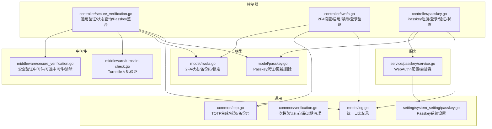
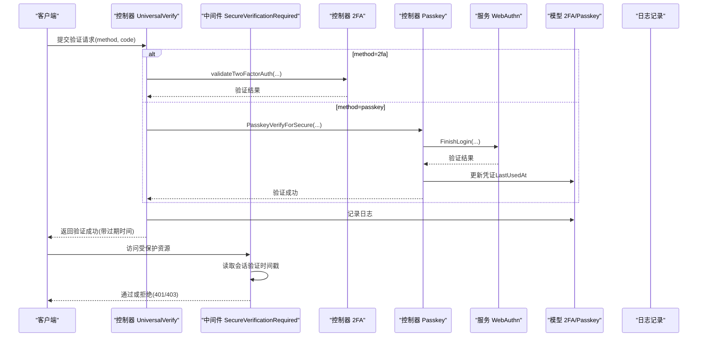
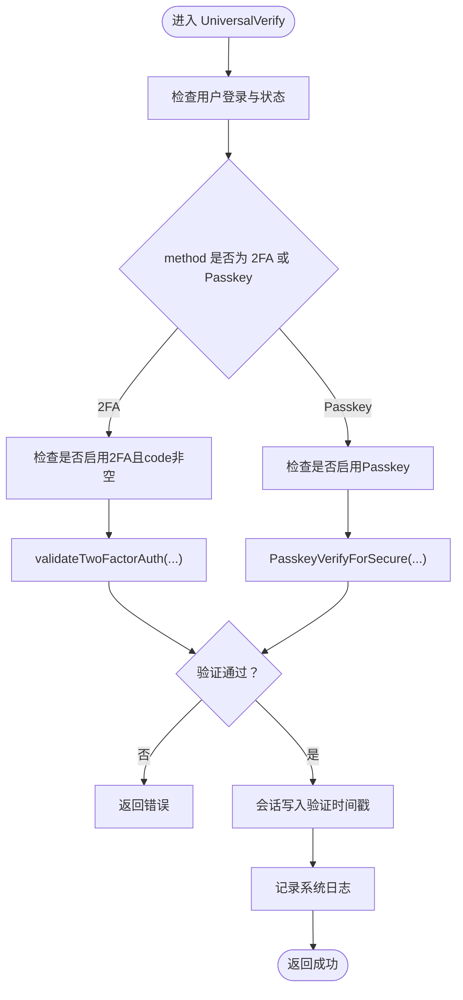
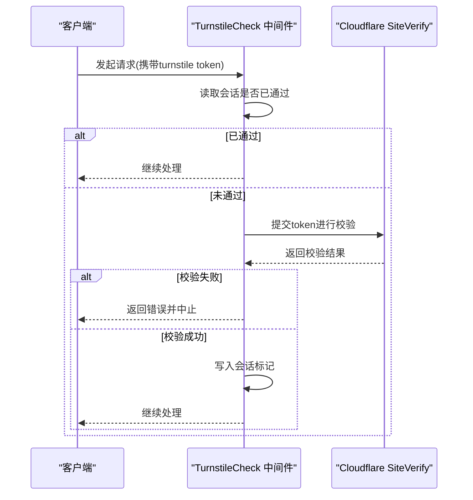
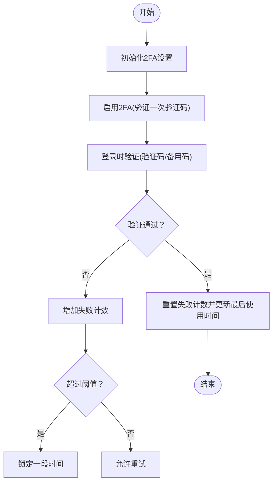
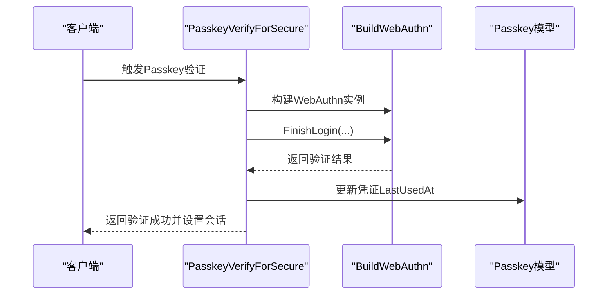
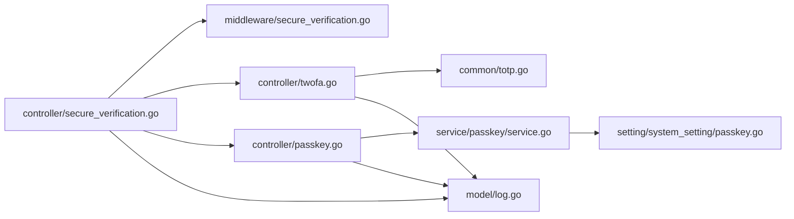

# 安全验证机制

<cite>
**本文引用的文件列表**
- [controller/secure_verification.go](file://controller/secure_verification.go)
- [middleware/secure_verification.go](file://middleware/secure_verification.go)
- [middleware/turnstile-check.go](file://middleware/turnstile-check.go)
- [controller/twofa.go](file://controller/twofa.go)
- [controller/passkey.go](file://controller/passkey.go)
- [service/passkey/service.go](file://service/passkey/service.go)
- [model/twofa.go](file://model/twofa.go)
- [model/passkey.go](file://model/passkey.go)
- [common/totp.go](file://common/totp.go)
- [common/verification.go](file://common/verification.go)
- [model/log.go](file://model/log.go)
- [setting/system_setting/passkey.go](file://setting/system_setting/passkey.go)
</cite>

## 目录
1. [简介](#简介)
2. [项目结构](#项目结构)
3. [核心组件](#核心组件)
4. [架构总览](#架构总览)
5. [详细组件分析](#详细组件分析)
6. [依赖关系分析](#依赖关系分析)
7. [性能考量](#性能考量)
8. [故障排查指南](#故障排查指南)
9. [结论](#结论)
10. [附录](#附录)

## 简介
本文件系统性梳理本项目的“安全验证机制”，重点覆盖以下方面：
- 通用验证接口（UniversalVerify）设计：统一处理2FA与Passkey两种验证方式，并在会话中记录验证时间戳以支持敏感操作保护。
- 验证状态的会话管理：定义5分钟有效期与过期自动清除策略。
- 验证状态查询接口（GetVerificationStatus）与中间件检查函数（CheckSecureVerification）的实现，用于保护敏感操作。
- 人机验证（Turnstile）在关键操作中的集成点与校验逻辑。
- 安全验证成功后的日志记录规范。
- 防重放攻击与会话劫持的安全建议，以及多因素验证组合使用的最佳实践。

## 项目结构
围绕安全验证的关键模块分布如下：
- 控制器层：通用验证、2FA、Passkey、Turnstile中间件等。
- 中间件层：安全验证中间件与可选安全验证中间件。
- 服务层：Passkey WebAuthn配置与会话数据管理。
- 模型层：2FA与Passkey凭证的持久化与状态管理。
- 通用工具：TOTP生成与校验、一次性验证码存储与过期清理。
- 日志：统一的日志记录接口，用于安全事件审计。

图表来源
- [controller/secure_verification.go](file://controller/secure_verification.go#L1-L315)
- [middleware/secure_verification.go](file://middleware/secure_verification.go#L1-L132)
- [middleware/turnstile-check.go](file://middleware/turnstile-check.go#L1-L82)
- [controller/twofa.go](file://controller/twofa.go#L1-L555)
- [controller/passkey.go](file://controller/passkey.go#L1-L498)
- [service/passkey/service.go](file://service/passkey/service.go#L1-L178)
- [model/twofa.go](file://model/twofa.go#L1-L324)
- [model/passkey.go](file://model/passkey.go#L1-L211)
- [common/totp.go](file://common/totp.go#L1-L151)
- [common/verification.go](file://common/verification.go#L1-L79)
- [model/log.go](file://model/log.go#L1-L200)
- [setting/system_setting/passkey.go](file://setting/system_setting/passkey.go#L1-L51)

章节来源
- [controller/secure_verification.go](file://controller/secure_verification.go#L1-L315)
- [middleware/secure_verification.go](file://middleware/secure_verification.go#L1-L132)
- [middleware/turnstile-check.go](file://middleware/turnstile-check.go#L1-L82)
- [controller/twofa.go](file://controller/twofa.go#L1-L555)
- [controller/passkey.go](file://controller/passkey.go#L1-L498)
- [service/passkey/service.go](file://service/passkey/service.go#L1-L178)
- [model/twofa.go](file://model/twofa.go#L1-L324)
- [model/passkey.go](file://model/passkey.go#L1-L211)
- [common/totp.go](file://common/totp.go#L1-L151)
- [common/verification.go](file://common/verification.go#L1-L79)
- [model/log.go](file://model/log.go#L1-L200)
- [setting/system_setting/passkey.go](file://setting/system_setting/passkey.go#L1-L51)

## 核心组件
- 通用验证接口（UniversalVerify）
  - 支持方法：2FA、Passkey
  - 成功后在会话中记录时间戳，有效期5分钟
  - 记录系统日志
- 验证状态查询（GetVerificationStatus）
  - 读取会话中的验证时间戳，返回是否已验证及过期时间
- 中间件检查（CheckSecureVerification）
  - 在敏感操作前调用，判断会话是否有效
- 人机验证（Turnstile）
  - 在特定请求中校验Cloudflare Turnstile token，通过后在会话中标记
- 2FA与Passkey
  - 2FA：TOTP密钥生成、备份码、锁定与失败计数
  - Passkey：WebAuthn配置、注册/登录/验证流程、凭证更新与删除
- 日志记录
  - 统一记录类型与字段，便于审计

章节来源
- [controller/secure_verification.go](file://controller/secure_verification.go#L1-L315)
- [middleware/secure_verification.go](file://middleware/secure_verification.go#L1-L132)
- [middleware/turnstile-check.go](file://middleware/turnstile-check.go#L1-L82)
- [controller/twofa.go](file://controller/twofa.go#L1-L555)
- [controller/passkey.go](file://controller/passkey.go#L1-L498)
- [service/passkey/service.go](file://service/passkey/service.go#L1-L178)
- [model/twofa.go](file://model/twofa.go#L1-L324)
- [model/passkey.go](file://model/passkey.go#L1-L211)
- [common/totp.go](file://common/totp.go#L1-L151)
- [model/log.go](file://model/log.go#L1-L200)

## 架构总览
下图展示通用验证接口与中间件、2FA/Passkey、日志与人机验证之间的交互关系。

图表来源
- [controller/secure_verification.go](file://controller/secure_verification.go#L1-L315)
- [middleware/secure_verification.go](file://middleware/secure_verification.go#L1-L132)
- [controller/twofa.go](file://controller/twofa.go#L1-L555)
- [controller/passkey.go](file://controller/passkey.go#L1-L498)
- [service/passkey/service.go](file://service/passkey/service.go#L1-L178)
- [model/twofa.go](file://model/twofa.go#L1-L324)
- [model/passkey.go](file://model/passkey.go#L1-L211)
- [model/log.go](file://model/log.go#L1-L200)

## 详细组件分析

### 通用验证接口（UniversalVerify）
- 设计要点
  - 请求体包含验证方式与验证码（2FA时必填）
  - 校验用户状态与启用情况（2FA或Passkey任一启用即可）
  - 2FA：调用TOTP校验；Passkey：由PasskeyVerifyForSecure完成实际校验
  - 成功后在会话中记录时间戳，有效期5分钟
  - 记录系统日志
- 关键路径
  - 会话键名与超时常量在控制器与中间件保持一致
  - Passkey流程通过PasskeyVerifyForSecure整合begin/finish，完成后设置会话并记录日志

图表来源
- [controller/secure_verification.go](file://controller/secure_verification.go#L1-L134)
- [controller/twofa.go](file://controller/twofa.go#L1-L555)
- [controller/passkey.go](file://controller/passkey.go#L1-L498)
- [model/log.go](file://model/log.go#L1-L200)

章节来源
- [controller/secure_verification.go](file://controller/secure_verification.go#L1-L134)

### 验证状态查询接口（GetVerificationStatus）
- 功能
  - 读取会话中的验证时间戳
  - 若缺失或过期（>=5分钟），返回未验证并清理会话
  - 否则返回已验证及过期时间
- 适用场景
  - 前端在发起敏感操作前主动查询验证状态，决定是否弹出二次验证弹窗

章节来源
- [controller/secure_verification.go](file://controller/secure_verification.go#L136-L196)

### 中间件检查函数（CheckSecureVerification）
- 功能
  - 在敏感操作前调用，判断会话是否有效
  - 若会话缺失或过期，返回false并清理会话
  - 否则返回true，允许继续处理
- 与中间件的区别
  - 该函数用于业务逻辑内部判断，而中间件SecureVerificationRequired直接终止请求并返回HTTP错误

章节来源
- [controller/secure_verification.go](file://controller/secure_verification.go#L198-L222)
- [middleware/secure_verification.go](file://middleware/secure_verification.go#L1-L132)

### 人机验证（Turnstile）集成
- 集成点
  - 在需要防机器人/自动化脚本的关键请求中，使用TurnstileCheck中间件
  - 首次校验通过后在会话中写入标记，后续请求跳过校验
- 校验逻辑
  - 读取查询参数中的token，向Cloudflare站点验证接口提交校验
  - 校验失败返回错误并中止
  - 成功后写入会话并继续

图表来源
- [middleware/turnstile-check.go](file://middleware/turnstile-check.go#L1-L82)

章节来源
- [middleware/turnstile-check.go](file://middleware/turnstile-check.go#L1-L82)

### 2FA验证流程
- 设置与启用
  - 生成TOTP密钥与二维码数据，创建2FA记录
  - 启用时验证一次验证码，启用成功
- 登录验证
  - 登录阶段可要求输入验证码或备用码
- 失败与锁定
  - 失败计数达到阈值后锁定一段时间
  - 备用码采用哈希存储，使用后标记为已用
- 与通用验证的衔接
  - UniversalVerify在method=2fa时调用validateTwoFactorAuth进行校验

图表来源
- [controller/twofa.go](file://controller/twofa.go#L1-L555)
- [model/twofa.go](file://model/twofa.go#L1-L324)
- [common/totp.go](file://common/totp.go#L1-L151)

章节来源
- [controller/twofa.go](file://controller/twofa.go#L1-L555)
- [model/twofa.go](file://model/twofa.go#L1-L324)
- [common/totp.go](file://common/totp.go#L1-L151)

### Passkey验证流程
- 注册/登录/验证
  - 注册：生成注册选项，finish后保存凭证
  - 登录：生成断言，finish后更新凭证并完成登录
  - 验证：在安全验证场景下，先begin再finish，完成后设置会话
- WebAuthn配置
  - 从系统设置读取RPID、Origins、UserVerification、AttachmentPreference等
  - 自动推导HTTPS与Origin规则，支持调试模式
- 与通用验证的衔接
  - UniversalVerify在method=passkey时，调用PasskeyVerifyForSecure完成验证并设置会话

图表来源
- [controller/secure_verification.go](file://controller/secure_verification.go#L233-L314)
- [controller/passkey.go](file://controller/passkey.go#L1-L498)
- [service/passkey/service.go](file://service/passkey/service.go#L1-L178)
- [model/passkey.go](file://model/passkey.go#L1-L211)
- [setting/system_setting/passkey.go](file://setting/system_setting/passkey.go#L1-L51)

章节来源
- [controller/passkey.go](file://controller/passkey.go#L1-L498)
- [service/passkey/service.go](file://service/passkey/service.go#L1-L178)
- [model/passkey.go](file://model/passkey.go#L1-L211)
- [setting/system_setting/passkey.go](file://setting/system_setting/passkey.go#L1-L51)

### 一次性验证码与过期清理（通用）
- 用途
  - 用于邮箱/密码重置等一次性场景（非2FA/Passkey）
- 特性
  - 存储结构包含验证码与时间戳
  - 默认有效期分钟数可配置
  - 超过阈值后清理过期项

章节来源
- [common/verification.go](file://common/verification.go#L1-L79)

## 依赖关系分析
- 控制器依赖
  - UniversalVerify依赖2FA与Passkey控制器/服务/模型
  - 2FA控制器依赖TOTP工具与模型
  - Passkey控制器依赖WebAuthn服务与模型
- 中间件依赖
  - 安全验证中间件依赖会话读取与时间计算
  - Turnstile中间件依赖会话与外部站点验证
- 日志依赖
  - 所有安全相关动作均通过统一日志接口记录

图表来源
- [controller/secure_verification.go](file://controller/secure_verification.go#L1-L315)
- [middleware/secure_verification.go](file://middleware/secure_verification.go#L1-L132)
- [controller/twofa.go](file://controller/twofa.go#L1-L555)
- [controller/passkey.go](file://controller/passkey.go#L1-L498)
- [service/passkey/service.go](file://service/passkey/service.go#L1-L178)
- [common/totp.go](file://common/totp.go#L1-L151)
- [model/log.go](file://model/log.go#L1-L200)
- [setting/system_setting/passkey.go](file://setting/system_setting/passkey.go#L1-L51)

## 性能考量
- 会话读写
  - 会话键为整型时间戳，读写开销极低
  - 中间件每次请求都会读取并计算时间差，建议在高并发场景下确保会话存储性能
- WebAuthn
  - 依赖外部站点验证，网络延迟为主要瓶颈
  - 建议开启会话缓存标志，避免重复校验
- 日志
  - 统一日志接口异步写入，避免阻塞主流程

[本节为通用指导，无需列出章节来源]

## 故障排查指南
- 通用验证失败
  - 确认method与code是否正确传递
  - 检查用户状态与启用情况（2FA或Passkey至少一项）
  - 查看系统日志定位具体失败原因
- 验证状态异常
  - 若返回未验证，确认会话中是否存在验证时间戳
  - 若过期，需重新触发验证
- 中间件拦截
  - 401/403错误通常来自未登录或验证过期
  - 检查会话键与超时常量是否一致
- Turnstile校验失败
  - 确认token参数是否传入
  - 检查Cloudflare站点验证接口可用性
  - 查看系统日志中的错误信息
- 2FA问题
  - 备用码格式与哈希校验
  - 失败计数与锁定状态
- Passkey问题
  - Origins/RPID配置是否正确
  - HTTPS与不安全Origin限制
  - 凭证LastUsedAt是否更新

章节来源
- [controller/secure_verification.go](file://controller/secure_verification.go#L1-L315)
- [middleware/secure_verification.go](file://middleware/secure_verification.go#L1-L132)
- [middleware/turnstile-check.go](file://middleware/turnstile-check.go#L1-L82)
- [controller/twofa.go](file://controller/twofa.go#L1-L555)
- [controller/passkey.go](file://controller/passkey.go#L1-L498)
- [service/passkey/service.go](file://service/passkey/service.go#L1-L178)
- [model/twofa.go](file://model/twofa.go#L1-L324)
- [model/passkey.go](file://model/passkey.go#L1-L211)
- [common/totp.go](file://common/totp.go#L1-L151)
- [model/log.go](file://model/log.go#L1-L200)

## 结论
本项目通过“通用验证接口 + 会话状态管理 + 中间件保护 + 人机验证”的组合，实现了对敏感操作的统一安全防护。2FA与Passkey双通道并存，既满足传统TOTP需求，又支持现代生物识别/平台认证。配合完善的日志记录与系统设置，能够有效提升整体安全性与可运维性。

[本节为总结，无需列出章节来源]

## 附录

### 安全验证成功后的日志记录规范
- 记录类型：系统日志
- 内容：包含验证方式（如“2FA”或“Passkey”）
- 字段：用户ID、用户名、时间戳、内容摘要
- 位置：各控制器在验证成功后调用统一日志接口

章节来源
- [controller/secure_verification.go](file://controller/secure_verification.go#L1-L134)
- [controller/passkey.go](file://controller/passkey.go#L1-L498)
- [model/log.go](file://model/log.go#L1-L200)

### 防重放攻击与会话劫持建议
- 会话安全
  - 使用强随机会话ID，启用HttpOnly与SameSite策略
  - 严格控制会话生命周期，结合5分钟有效期与过期自动清除
- 传输安全
  - 强制HTTPS，避免明文传输
  - 限制Origin与RPID，防止跨站伪造
- 输入校验
  - 对验证码与token进行格式与长度校验
  - 对2FA备用码采用哈希存储与一次性使用
- 多因素组合
  - 推荐同时启用2FA与Passkey，降低单一因素失效风险
  - 对高危操作要求双重验证（如修改密码、删除账户）

[本节为通用指导，无需列出章节来源]