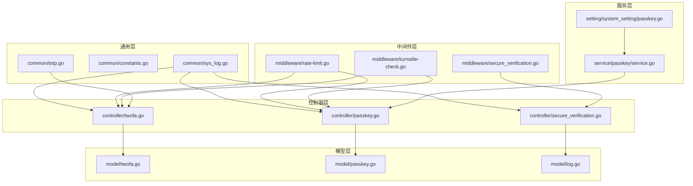
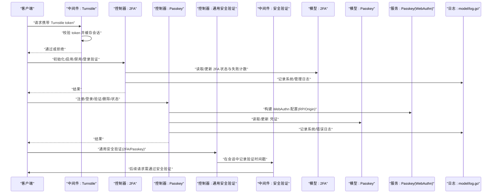
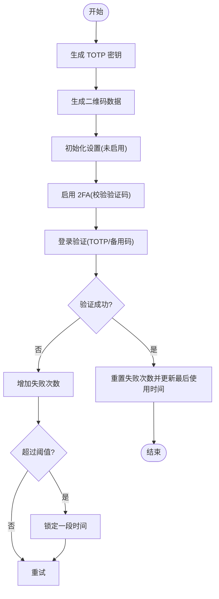
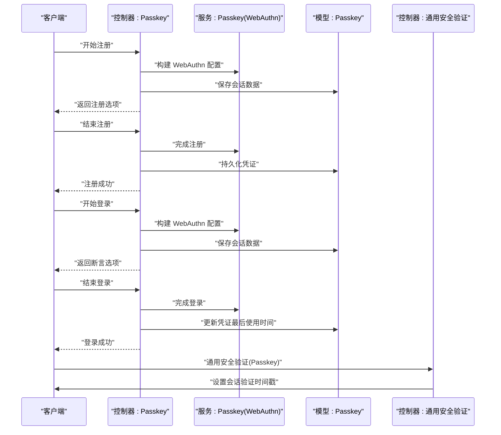
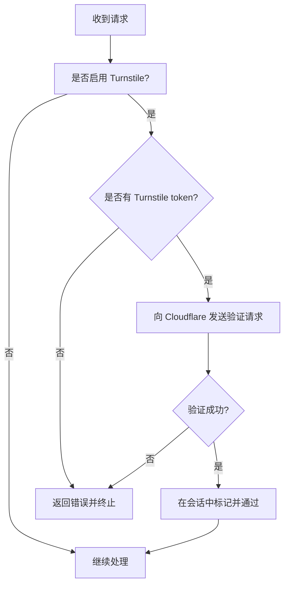
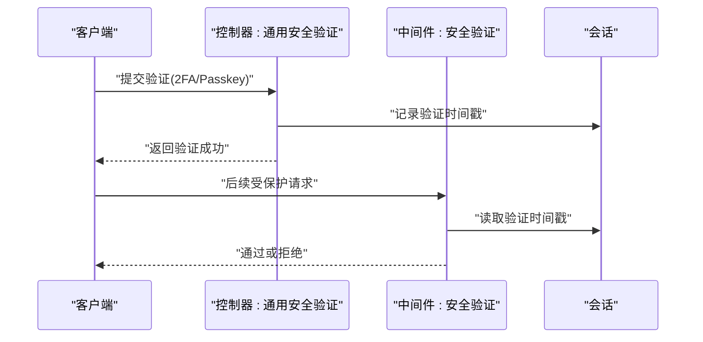
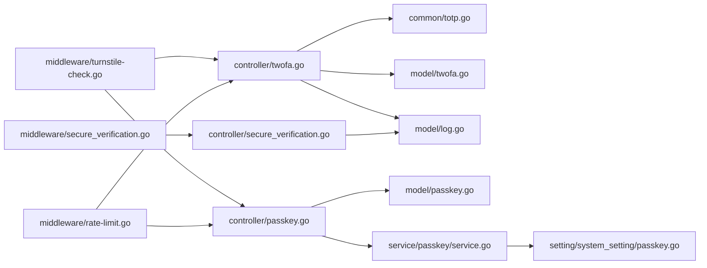

# 账户安全

<cite>
**本文引用的文件**
- [common/totp.go](file://common/totp.go)
- [controller/twofa.go](file://controller/twofa.go)
- [model/twofa.go](file://model/twofa.go)
- [controller/passkey.go](file://controller/passkey.go)
- [model/passkey.go](file://model/passkey.go)
- [service/passkey/service.go](file://service/passkey/service.go)
- [setting/system_setting/passkey.go](file://setting/system_setting/passkey.go)
- [controller/secure_verification.go](file://controller/secure_verification.go)
- [middleware/secure_verification.go](file://middleware/secure_verification.go)
- [middleware/turnstile-check.go](file://middleware/turnstile-check.go)
- [middleware/rate-limit.go](file://middleware/rate-limit.go)
- [model/log.go](file://model/log.go)
- [common/constants.go](file://common/constants.go)
- [common/sys_log.go](file://common/sys_log.go)
</cite>

## 目录
1. [简介](#简介)
2. [项目结构](#项目结构)
3. [核心组件](#核心组件)
4. [架构总览](#架构总览)
5. [详细组件分析](#详细组件分析)
6. [依赖关系分析](#依赖关系分析)
7. [性能考量](#性能考量)
8. [故障排查指南](#故障排查指南)
9. [结论](#结论)
10. [附录](#附录)

## 简介
本文件面向账户安全能力的实现与使用，覆盖以下主题：
- 双因素认证（2FA）：TOTP 生成、二维码绑定、验证码校验、备用码机制、失败锁定与统计
- Passkey（WebAuthn）：注册、登录、验证、密钥管理与系统设置
- 人机验证（Turnstile）：在关键操作前进行人机校验
- 安全日志：登录尝试、敏感操作审计
- 安全策略：防暴力破解、防会话劫持、安全事件响应建议

## 项目结构
围绕账户安全的关键模块分布如下：
- 通用工具与常量：TOTP 生成与校验、系统常量、日志输出
- 控制器层：2FA 与 Passkey 的业务入口、通用安全验证
- 模型层：2FA 与 Passkey 的持久化、统计与使用记录
- 服务层：Passkey 的 WebAuthn 构建与 RP/Origin 解析
- 中间件层：Turnstile 人机验证、安全验证状态校验、速率限制
- 日志与审计：统一日志模型与记录方法



图表来源
- [common/totp.go](file://common/totp.go#L1-L151)
- [controller/twofa.go](file://controller/twofa.go#L1-L555)
- [model/twofa.go](file://model/twofa.go#L1-L324)
- [controller/passkey.go](file://controller/passkey.go#L1-L498)
- [model/passkey.go](file://model/passkey.go#L1-L211)
- [service/passkey/service.go](file://service/passkey/service.go#L1-L178)
- [setting/system_setting/passkey.go](file://setting/system_setting/passkey.go#L1-L51)
- [controller/secure_verification.go](file://controller/secure_verification.go#L1-L315)
- [middleware/secure_verification.go](file://middleware/secure_verification.go#L1-L132)
- [middleware/turnstile-check.go](file://middleware/turnstile-check.go#L1-L82)
- [middleware/rate-limit.go](file://middleware/rate-limit.go#L1-L118)
- [model/log.go](file://model/log.go#L1-L412)
- [common/constants.go](file://common/constants.go#L1-L208)
- [common/sys_log.go](file://common/sys_log.go#L1-L56)

章节来源
- [common/totp.go](file://common/totp.go#L1-L151)
- [controller/twofa.go](file://controller/twofa.go#L1-L555)
- [model/twofa.go](file://model/twofa.go#L1-L324)
- [controller/passkey.go](file://controller/passkey.go#L1-L498)
- [model/passkey.go](file://model/passkey.go#L1-L211)
- [service/passkey/service.go](file://service/passkey/service.go#L1-L178)
- [setting/system_setting/passkey.go](file://setting/system_setting/passkey.go#L1-L51)
- [controller/secure_verification.go](file://controller/secure_verification.go#L1-L315)
- [middleware/secure_verification.go](file://middleware/secure_verification.go#L1-L132)
- [middleware/turnstile-check.go](file://middleware/turnstile-check.go#L1-L82)
- [middleware/rate-limit.go](file://middleware/rate-limit.go#L1-L118)
- [model/log.go](file://model/log.go#L1-L412)
- [common/constants.go](file://common/constants.go#L1-L208)
- [common/sys_log.go](file://common/sys_log.go#L1-L56)

## 核心组件
- TOTP 与备用码：生成密钥、二维码数据、验证码校验、备用码生成与哈希存储、失败计数与锁定
- 2FA 控制器：初始化设置、启用/禁用、登录验证、备用码重生成、状态查询、管理员统计与强制禁用
- Passkey（WebAuthn）：注册/登录/验证/删除/状态查询；RP/Origin 解析与配置；凭证持久化
- 通用安全验证：在会话中记录验证时间戳，超时控制；Passkey 安全验证整合
- 人机验证（Turnstile）：在请求中校验 Cloudflare Turnstile token，缓存会话避免重复校验
- 速率限制：全局 Web/API/Critical/下载/上传限流
- 安全日志：系统/消费/错误日志记录，支持按用户、类型、时间范围检索

章节来源
- [common/totp.go](file://common/totp.go#L1-L151)
- [controller/twofa.go](file://controller/twofa.go#L1-L555)
- [model/twofa.go](file://model/twofa.go#L1-L324)
- [controller/passkey.go](file://controller/passkey.go#L1-L498)
- [model/passkey.go](file://model/passkey.go#L1-L211)
- [controller/secure_verification.go](file://controller/secure_verification.go#L1-L315)
- [middleware/secure_verification.go](file://middleware/secure_verification.go#L1-L132)
- [middleware/turnstile-check.go](file://middleware/turnstile-check.go#L1-L82)
- [middleware/rate-limit.go](file://middleware/rate-limit.go#L1-L118)
- [model/log.go](file://model/log.go#L1-L412)

## 架构总览
下图展示了从客户端到控制器、模型与服务层的整体交互，以及与外部系统的集成点（Cloudflare Turnstile、WebAuthn RP/Origin）。



图表来源
- [middleware/turnstile-check.go](file://middleware/turnstile-check.go#L1-L82)
- [controller/twofa.go](file://controller/twofa.go#L1-L555)
- [model/twofa.go](file://model/twofa.go#L1-L324)
- [controller/passkey.go](file://controller/passkey.go#L1-L498)
- [service/passkey/service.go](file://service/passkey/service.go#L1-L178)
- [model/passkey.go](file://model/passkey.go#L1-L211)
- [controller/secure_verification.go](file://controller/secure_verification.go#L1-L315)
- [middleware/secure_verification.go](file://middleware/secure_verification.go#L1-L132)
- [model/log.go](file://model/log.go#L1-L412)

## 详细组件分析

### 双因素认证（2FA）与备用码
- 密钥与二维码
  - 生成 TOTP 密钥与二维码数据，包含发行者、账户名、密钥、位数与周期
  - 二维码数据用于扫码绑定认证器应用
- 验证流程
  - 启用时先校验 6 位数字验证码，再调用 TOTP 校验
  - 登录时可使用 TOTP 或备用码，均触发失败计数与锁定逻辑
- 失败锁定与统计
  - 失败次数达到阈值后锁定一段时间，解锁前禁止验证
  - 提供管理员统计接口，统计启用率
- 备用码
  - 生成固定数量与长度的备用码，存储为哈希，支持重新生成并替换旧码



图表来源
- [common/totp.go](file://common/totp.go#L1-L151)
- [controller/twofa.go](file://controller/twofa.go#L1-L555)
- [model/twofa.go](file://model/twofa.go#L1-L324)

章节来源
- [common/totp.go](file://common/totp.go#L1-L151)
- [controller/twofa.go](file://controller/twofa.go#L1-L555)
- [model/twofa.go](file://model/twofa.go#L1-L324)

### Passkey（WebAuthn）集成
- 注册流程
  - 开始注册：根据用户是否存在已有凭证决定是否排除已有凭证
  - 结束注册：完成注册并持久化凭证，同时更新会话
- 登录流程
  - 发现式登录：开始登录并生成断言，结束登录时通过凭证 ID 查找用户并校验
  - 登录成功后更新凭证最后使用时间
- 验证与删除
  - 验证：开始/结束验证流程，结束后更新凭证最后使用时间
  - 删除：解除绑定 Passkey
  - 状态：查询是否已绑定及最后使用时间
- 系统设置与 WebAuthn 构建
  - 从系统设置读取 RP 显示名、RPID、Origins、用户验证要求、附件偏好
  - 自动推导 RP/Origin，支持 HTTPS 强制与不安全 Origin 允许策略
- 会话与安全验证
  - 通用安全验证在会话中记录验证时间戳，超时后失效
  - Passkey 安全验证整合流程，完成后设置会话并记录日志



图表来源
- [controller/passkey.go](file://controller/passkey.go#L1-L498)
- [service/passkey/service.go](file://service/passkey/service.go#L1-L178)
- [model/passkey.go](file://model/passkey.go#L1-L211)
- [controller/secure_verification.go](file://controller/secure_verification.go#L1-L315)

章节来源
- [controller/passkey.go](file://controller/passkey.go#L1-L498)
- [model/passkey.go](file://model/passkey.go#L1-L211)
- [service/passkey/service.go](file://service/passkey/service.go#L1-L178)
- [setting/system_setting/passkey.go](file://setting/system_setting/passkey.go#L1-L51)
- [controller/secure_verification.go](file://controller/secure_verification.go#L1-L315)

### 人机验证（Turnstile）
- 在请求进入控制器前，若开启 Turnstile 校验，则要求客户端提供 token
- 通过 HTTP POST 调用 Cloudflare 的站点验证接口，校验成功后在会话中标记并通过
- 若校验失败或会话中已存在标记，则直接放行



图表来源
- [middleware/turnstile-check.go](file://middleware/turnstile-check.go#L1-L82)
- [common/constants.go](file://common/constants.go#L1-L208)

章节来源
- [middleware/turnstile-check.go](file://middleware/turnstile-check.go#L1-L82)
- [common/constants.go](file://common/constants.go#L1-L208)

### 通用安全验证与会话控制
- 通用验证接口支持 2FA 与 Passkey 两种方式，验证成功后在会话中记录时间戳
- 安全验证中间件检查会话中的验证时间戳，超时则拒绝请求
- 可选的安全验证中间件用于标记上下文，不强制中断请求
- Passkey 安全验证整合流程，完成后设置会话并记录日志



图表来源
- [controller/secure_verification.go](file://controller/secure_verification.go#L1-L315)
- [middleware/secure_verification.go](file://middleware/secure_verification.go#L1-L132)

章节来源
- [controller/secure_verification.go](file://controller/secure_verification.go#L1-L315)
- [middleware/secure_verification.go](file://middleware/secure_verification.go#L1-L132)

### 安全日志记录机制
- 系统日志：记录系统事件、启用/禁用 2FA、Passkey 绑定/删除/登录成功等
- 消费日志：记录额度消耗、提示/补全 token 数、模型名、通道等
- 错误日志：记录错误内容、使用时长、通道、分组、是否记录 IP 等
- 查询与统计：支持按类型、时间、用户名、令牌名、模型名、通道、分组等条件检索

```mermaid
classDiagram
class Log {
+int id
+int user_id
+int64 created_at
+int type
+string content
+string username
+string token_name
+string model_name
+int quota
+int prompt_tokens
+int completion_tokens
+int use_time
+bool is_stream
+int channel
+string channel_name
+int token_id
+string group
+string ip
+string other
}
class RecordLog(userId, type, content)
class RecordConsumeLog(c, userId, params)
class RecordErrorLog(c, userId, channelId, modelName, tokenName, content, tokenId, useTimeSeconds, isStream, group, other)
Log <.. RecordLog : "创建"
Log <.. RecordConsumeLog : "创建"
Log <.. RecordErrorLog : "创建"
```

图表来源
- [model/log.go](file://model/log.go#L1-L412)

章节来源
- [model/log.go](file://model/log.go#L1-L412)

## 依赖关系分析
- 控制器依赖通用工具（TOTP）、模型（2FA/Passkey）、服务（Passkey WebAuthn）、系统设置（Passkey）、日志模型
- 中间件依赖会话与时间，Turnstile 依赖外部 Cloudflare 接口
- 速率限制中间件依赖 Redis 或内存限流器
- 日志记录依赖统一日志模型与配置开关



图表来源
- [controller/twofa.go](file://controller/twofa.go#L1-L555)
- [common/totp.go](file://common/totp.go#L1-L151)
- [model/twofa.go](file://model/twofa.go#L1-L324)
- [controller/passkey.go](file://controller/passkey.go#L1-L498)
- [model/passkey.go](file://model/passkey.go#L1-L211)
- [service/passkey/service.go](file://service/passkey/service.go#L1-L178)
- [setting/system_setting/passkey.go](file://setting/system_setting/passkey.go#L1-L51)
- [controller/secure_verification.go](file://controller/secure_verification.go#L1-L315)
- [middleware/secure_verification.go](file://middleware/secure_verification.go#L1-L132)
- [middleware/turnstile-check.go](file://middleware/turnstile-check.go#L1-L82)
- [middleware/rate-limit.go](file://middleware/rate-limit.go#L1-L118)
- [model/log.go](file://model/log.go#L1-L412)

章节来源
- [controller/twofa.go](file://controller/twofa.go#L1-L555)
- [controller/passkey.go](file://controller/passkey.go#L1-L498)
- [controller/secure_verification.go](file://controller/secure_verification.go#L1-L315)
- [middleware/secure_verification.go](file://middleware/secure_verification.go#L1-L132)
- [middleware/turnstile-check.go](file://middleware/turnstile-check.go#L1-L82)
- [middleware/rate-limit.go](file://middleware/rate-limit.go#L1-L118)
- [model/log.go](file://model/log.go#L1-L412)

## 性能考量
- 2FA 失败锁定与速率限制协同：失败次数阈值与锁定时间减少暴力破解成功率，结合全局/关键接口限流进一步降低风险
- Passkey 登录采用一次性断言与会话缓存，避免重复网络往返
- 日志记录异步化：消费日志在满足条件时异步导出，降低主路径开销
- 会话验证超时：通用安全验证会话默认 5 分钟，避免长期占用资源

[本节为通用指导，无需列出具体文件来源]

## 故障排查指南
- Turnstile 校验失败
  - 检查是否正确传入 token，确认站点密钥与密钥配置
  - 查看系统日志输出，定位网络或解析错误
- 2FA 启用/登录失败
  - 确认验证码格式为 6 位数字
  - 检查账户是否被锁定（失败次数阈值与锁定时间）
  - 确认备用码格式与哈希匹配
- Passkey 登录失败
  - 检查 RP/Origin 配置是否与部署地址一致，HTTPS 是否启用
  - 确认客户端支持 resident key 且用户验证策略符合预期
  - 查看凭证是否已绑定，登录时是否能通过凭证 ID 正确解析用户
- 通用安全验证失效
  - 检查会话中是否存在验证时间戳，是否已过期
  - 确保后续请求携带有效会话
- 日志缺失
  - 检查日志类型开关与记录 IP 配置
  - 确认日志表连接与数据库可用性

章节来源
- [middleware/turnstile-check.go](file://middleware/turnstile-check.go#L1-L82)
- [common/sys_log.go](file://common/sys_log.go#L1-L56)
- [controller/twofa.go](file://controller/twofa.go#L1-L555)
- [model/twofa.go](file://model/twofa.go#L1-L324)
- [controller/passkey.go](file://controller/passkey.go#L1-L498)
- [service/passkey/service.go](file://service/passkey/service.go#L1-L178)
- [controller/secure_verification.go](file://controller/secure_verification.go#L1-L315)
- [middleware/secure_verification.go](file://middleware/secure_verification.go#L1-L132)
- [model/log.go](file://model/log.go#L1-L412)

## 结论
本项目在账户安全方面提供了完善的 2FA 与 Passkey 能力，配合 Turnstile 人机验证、会话安全验证与统一日志体系，能够有效提升系统抗暴力破解与会话劫持的能力。建议在生产环境中：
- 启用 Turnstile 并合理配置 RP/Origin
- 强制用户启用 2FA 或 Passkey，并定期轮换备用码
- 结合速率限制与失败锁定策略，降低自动化攻击成功率
- 定期审计日志，建立安全事件响应流程

[本节为总结性内容，无需列出具体文件来源]

## 附录
- 关键配置项
  - Turnstile：站点密钥、密钥、是否启用
  - Passkey：RP 显示名、RPID、Origins、用户验证要求、附件偏好、是否允许不安全 Origin
  - 会话与安全验证：验证会话键名、超时时间
  - 速率限制：全局 Web/API/Critical/下载/上传限流参数

章节来源
- [common/constants.go](file://common/constants.go#L1-L208)
- [setting/system_setting/passkey.go](file://setting/system_setting/passkey.go#L1-L51)
- [controller/secure_verification.go](file://controller/secure_verification.go#L1-L315)
- [middleware/rate-limit.go](file://middleware/rate-limit.go#L1-L118)