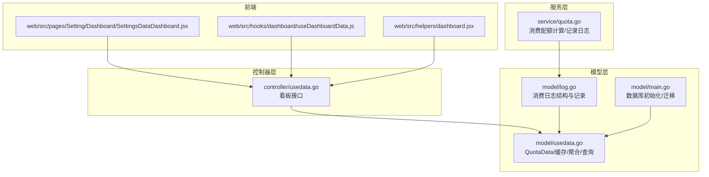
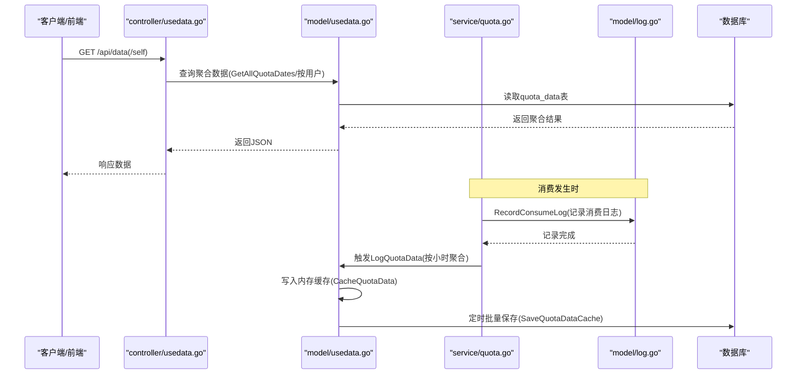
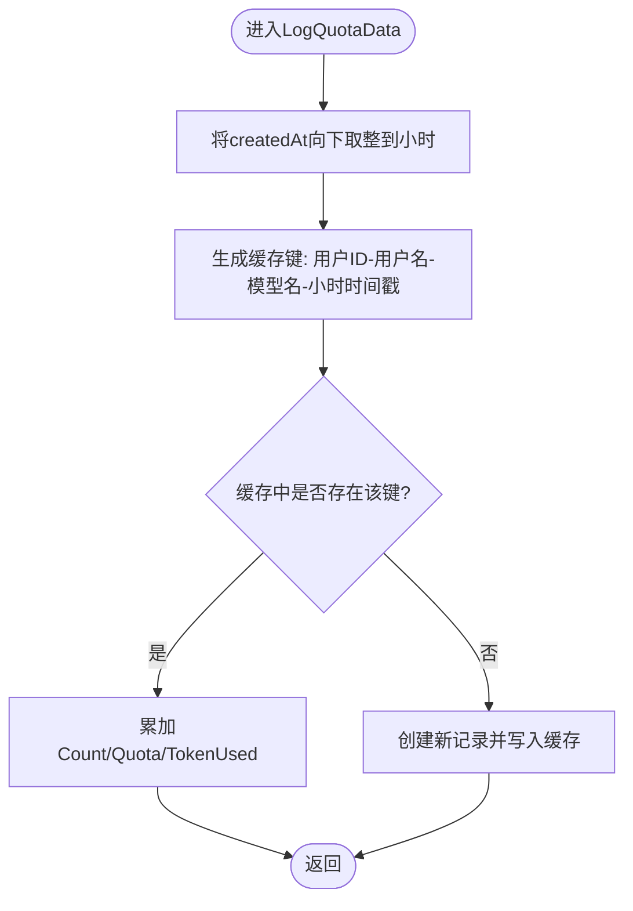
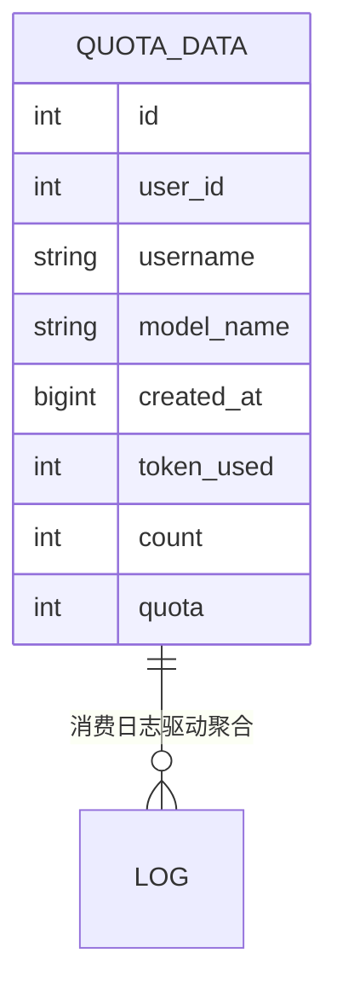
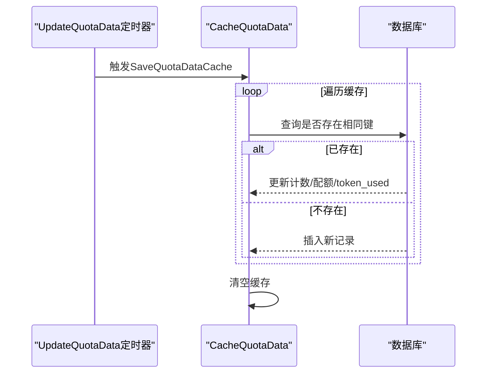
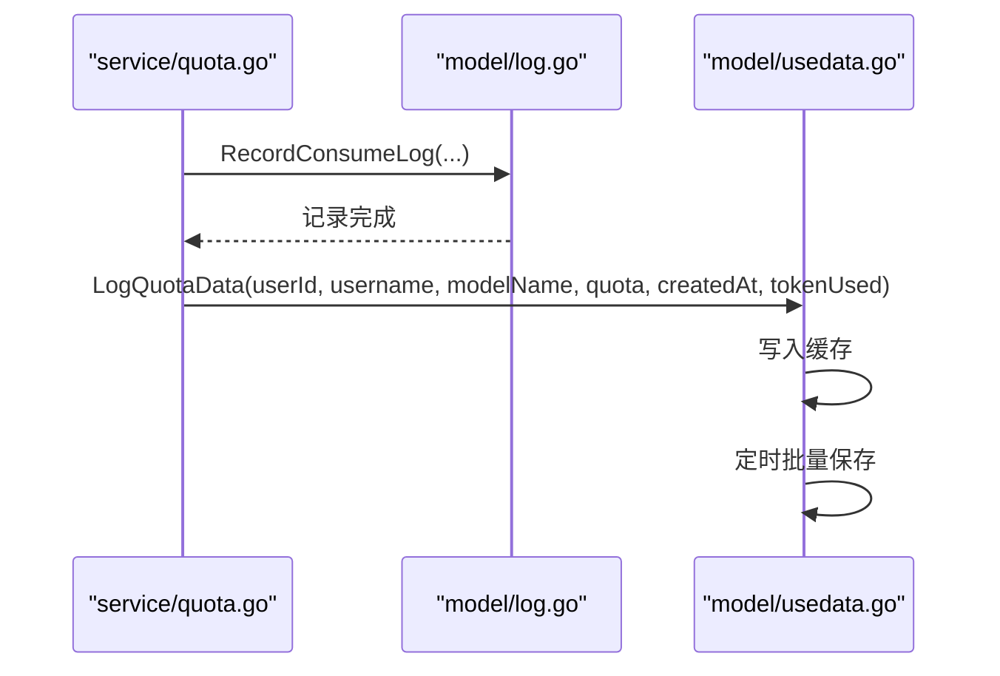
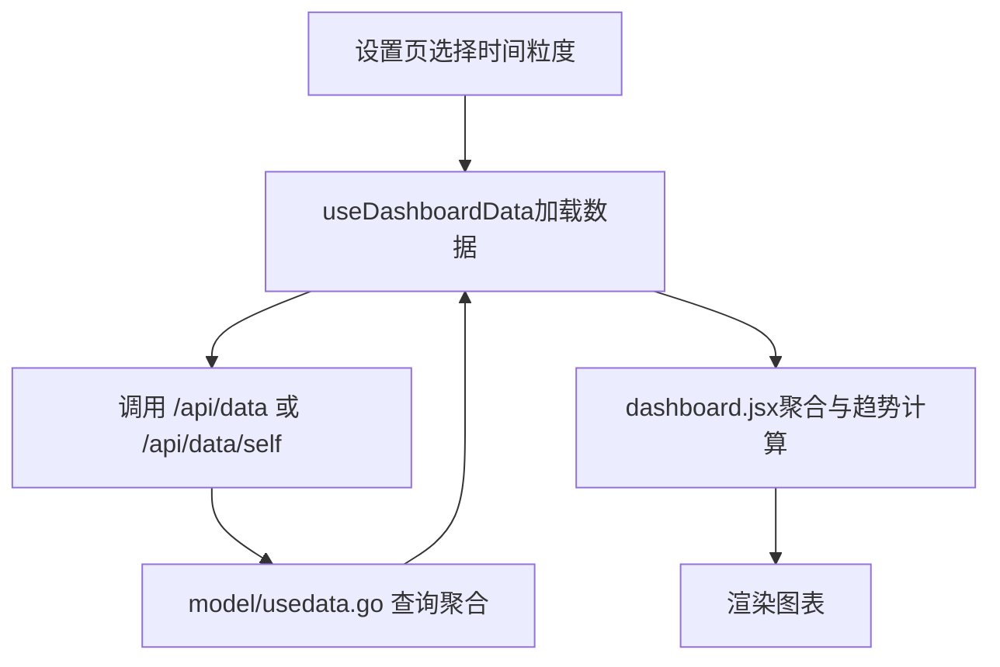
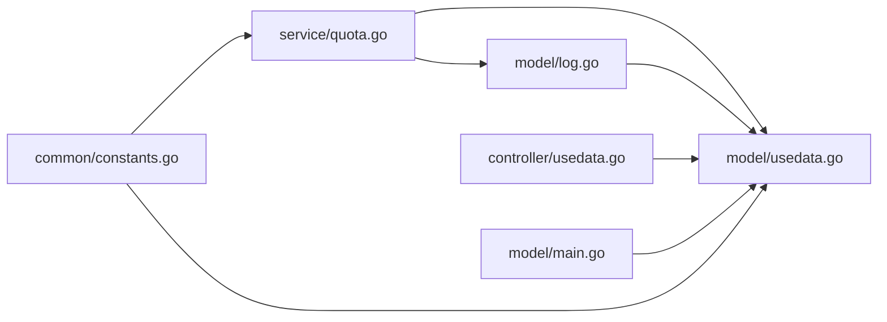

# 使用量数据模型

<cite>
**本文引用的文件**
- [model/usedata.go](file://model/usedata.go)
- [model/log.go](file://model/log.go)
- [controller/usedata.go](file://controller/usedata.go)
- [service/quota.go](file://service/quota.go)
- [model/main.go](file://model/main.go)
- [common/constants.go](file://common/constants.go)
- [web/src/pages/Setting/Dashboard/SettingsDataDashboard.jsx](file://web/src/pages/Setting/Dashboard/SettingsDataDashboard.jsx)
- [web/src/hooks/dashboard/useDashboardData.js](file://web/src/hooks/dashboard/useDashboardData.js)
- [web/src/helpers/dashboard.jsx](file://web/src/helpers/dashboard.jsx)
</cite>

## 目录
1. [简介](#简介)
2. [项目结构](#项目结构)
3. [核心组件](#核心组件)
4. [架构总览](#架构总览)
5. [详细组件分析](#详细组件分析)
6. [依赖分析](#依赖分析)
7. [性能考量](#性能考量)
8. [故障排查指南](#故障排查指南)
9. [结论](#结论)
10. [附录](#附录)

## 简介
本文件围绕“使用量数据模型”进行系统化说明，聚焦 model/usedata.go 中的 QuotaData 结构体设计与运行机制，涵盖以下关键点：
- QuotaData 字段的业务含义与存储策略
- 数据按小时粒度聚合的实现机制（createdAt 精确到小时）
- GORM 标签索引设计对查询性能的优化
- 内存缓存（CacheQuotaData）与数据库的同步机制（键值生成策略、批量保存逻辑）
- 与 model/log.go 中消费日志的关联关系，以及前端看板的数据来源与展示

## 项目结构
围绕使用量数据模型的相关模块分布如下：
- 模型层：model/usedata.go 定义 QuotaData 及聚合、查询、缓存等逻辑；model/log.go 定义消费日志结构及记录流程；model/main.go 负责数据库初始化与自动迁移，包含对 QuotaData 的迁移注册
- 服务层：service/quota.go 在产生消费行为时调用记录日志，并在开启导出开关时触发使用量数据的增量写入
- 控制器层：controller/usedata.go 提供看板数据接口，用于前端拉取聚合后的使用量趋势
- 前端：web/src 下的看板设置与数据处理逻辑，负责时间粒度选择、数据聚合与图表渲染

**图表来源**
- [model/usedata.go](file://model/usedata.go#L1-L129)
- [model/log.go](file://model/log.go#L1-L203)
- [model/main.go](file://model/main.go#L250-L275)
- [service/quota.go](file://service/quota.go#L190-L236)
- [controller/usedata.go](file://controller/usedata.go#L1-L54)
- [web/src/pages/Setting/Dashboard/SettingsDataDashboard.jsx](file://web/src/pages/Setting/Dashboard/SettingsDataDashboard.jsx#L1-L46)
- [web/src/hooks/dashboard/useDashboardData.js](file://web/src/hooks/dashboard/useDashboardData.js#L154-L194)
- [web/src/helpers/dashboard.jsx](file://web/src/helpers/dashboard.jsx#L284-L369)

**章节来源**
- [model/usedata.go](file://model/usedata.go#L1-L129)
- [model/log.go](file://model/log.go#L1-L203)
- [model/main.go](file://model/main.go#L250-L275)
- [controller/usedata.go](file://controller/usedata.go#L1-L54)
- [service/quota.go](file://service/quota.go#L190-L236)
- [web/src/pages/Setting/Dashboard/SettingsDataDashboard.jsx](file://web/src/pages/Setting/Dashboard/SettingsDataDashboard.jsx#L1-L46)
- [web/src/hooks/dashboard/useDashboardData.js](file://web/src/hooks/dashboard/useDashboardData.js#L154-L194)
- [web/src/helpers/dashboard.jsx](file://web/src/helpers/dashboard.jsx#L284-L369)

## 核心组件
- QuotaData 结构体：用于存储按小时粒度聚合的使用量指标，包含用户维度、模型维度、时间维度与用量指标
- 缓存与聚合：内存缓存按小时键合并累加，定时批量落库
- 日志驱动：消费日志记录时触发使用量数据的增量写入
- 查询接口：提供按用户或全局聚合的查询能力

**章节来源**
- [model/usedata.go](file://model/usedata.go#L12-L22)
- [model/usedata.go](file://model/usedata.go#L34-L56)
- [model/usedata.go](file://model/usedata.go#L58-L65)
- [model/usedata.go](file://model/usedata.go#L67-L90)
- [model/usedata.go](file://model/usedata.go#L92-L102)
- [model/usedata.go](file://model/usedata.go#L104-L129)
- [model/log.go](file://model/log.go#L141-L203)
- [service/quota.go](file://service/quota.go#L190-L236)

## 架构总览
使用量数据从“消费日志”到“看板展示”的完整链路如下：

**图表来源**
- [controller/usedata.go](file://controller/usedata.go#L13-L54)
- [model/usedata.go](file://model/usedata.go#L58-L90)
- [model/log.go](file://model/log.go#L141-L203)
- [service/quota.go](file://service/quota.go#L190-L236)

## 详细组件分析

### QuotaData 结构体与字段语义
- 字段定义与含义
  - UserID：用户标识，便于按用户维度聚合
  - Username：用户名，便于看板筛选与展示
  - ModelName：模型名称，便于按模型维度聚合
  - CreatedAt：时间戳，精确到小时（见“按小时聚合”小节），作为时间维度键
  - TokenUsed：累计使用的 token 数量（提示词+补全）
  - Count：请求次数
  - Quota：累计消耗的配额
- 存储策略
  - 采用 GORM 标签定义索引，提升查询效率
  - 通过内存缓存合并同键增量，降低写入压力
  - 定时批量写入数据库，避免高频写入

**章节来源**
- [model/usedata.go](file://model/usedata.go#L12-L22)

### 按小时粒度聚合机制
- 时间精度处理
  - 在写入缓存前，将传入时间戳向下取整到小时粒度，确保同一小时内的请求被归并到同一记录
- 键值生成策略
  - 缓存键由用户ID、用户名、模型名与小时级时间戳组合而成，保证唯一性
- 合并逻辑
  - 若缓存命中，直接累加 Count、Quota、TokenUsed
  - 若未命中，新建记录并放入缓存

**图表来源**
- [model/usedata.go](file://model/usedata.go#L58-L65)
- [model/usedata.go](file://model/usedata.go#L37-L56)

**章节来源**
- [model/usedata.go](file://model/usedata.go#L58-L65)
- [model/usedata.go](file://model/usedata.go#L37-L56)

### GORM 索引设计与查询优化
- 索引定义
  - idx_qdt_model_user_name：复合索引，优先级为模型名>用户名，覆盖按模型与用户名的查询
  - idx_qdt_created_at：索引，覆盖按小时时间维度的查询
- 查询路径
  - 按用户名/用户ID查询：利用索引快速定位
  - 全局聚合：按模型名与时间维度分组，利用索引加速过滤与分组

**图表来源**
- [model/usedata.go](file://model/usedata.go#L12-L22)
- [model/log.go](file://model/log.go#L141-L203)

**章节来源**
- [model/usedata.go](file://model/usedata.go#L12-L22)
- [model/usedata.go](file://model/usedata.go#L104-L129)

### 内存缓存与数据库同步机制
- 缓存结构
  - CacheQuotaData：map[string]*QuotaData，键为“用户ID-用户名-模型名-小时时间戳”
  - CacheQuotaDataLock：互斥锁，保护并发写入
- 写入流程
  - LogQuotaData：按小时取整后写入缓存
  - SaveQuotaDataCache：遍历缓存，先查库是否存在，存在则使用表达式累加，不存在则插入
- 定时任务
  - UpdateQuotaData：周期性检查 DataExportEnabled 开关，按 DataExportInterval 执行批量保存

**图表来源**
- [model/usedata.go](file://model/usedata.go#L24-L32)
- [model/usedata.go](file://model/usedata.go#L67-L90)
- [model/usedata.go](file://model/usedata.go#L92-L102)

**章节来源**
- [model/usedata.go](file://model/usedata.go#L24-L32)
- [model/usedata.go](file://model/usedata.go#L34-L56)
- [model/usedata.go](file://model/usedata.go#L67-L90)
- [model/usedata.go](file://model/usedata.go#L92-L102)

### 与消费日志的关联关系
- 日志记录
  - RecordConsumeLog：在消费发生时记录日志，包含用户ID、用户名、模型名、配额、token 使用量等
  - 当 DataExportEnabled 开启时，异步触发 LogQuotaData，将消费转化为使用量数据
- 数据来源
  - 原始日志来源于 model/log.go 的消费日志表
  - 聚合结果来源于 model/usedata.go 的 quota_data 表

**图表来源**
- [service/quota.go](file://service/quota.go#L190-L236)
- [model/log.go](file://model/log.go#L141-L203)
- [model/usedata.go](file://model/usedata.go#L58-L90)

**章节来源**
- [service/quota.go](file://service/quota.go#L190-L236)
- [model/log.go](file://model/log.go#L141-L203)
- [model/usedata.go](file://model/usedata.go#L58-L90)

### 前端看板与数据聚合
- 接口
  - 获取所有聚合数据：controller/usedata.go 提供 /api/data，支持按用户名过滤与时间范围查询
  - 获取当前用户聚合数据：/api/data/self，限制时间跨度不超过1个月
- 前端逻辑
  - 设置页：支持选择数据导出时间粒度（小时/天/周）
  - 钩子：根据时间粒度与起止时间拉取数据
  - 辅助：按时间与模型聚合，计算趋势（rpm、tpm）

**图表来源**
- [controller/usedata.go](file://controller/usedata.go#L13-L54)
- [web/src/pages/Setting/Dashboard/SettingsDataDashboard.jsx](file://web/src/pages/Setting/Dashboard/SettingsDataDashboard.jsx#L1-L46)
- [web/src/hooks/dashboard/useDashboardData.js](file://web/src/hooks/dashboard/useDashboardData.js#L154-L194)
- [web/src/helpers/dashboard.jsx](file://web/src/helpers/dashboard.jsx#L284-L369)

**章节来源**
- [controller/usedata.go](file://controller/usedata.go#L13-L54)
- [web/src/pages/Setting/Dashboard/SettingsDataDashboard.jsx](file://web/src/pages/Setting/Dashboard/SettingsDataDashboard.jsx#L1-L46)
- [web/src/hooks/dashboard/useDashboardData.js](file://web/src/hooks/dashboard/useDashboardData.js#L154-L194)
- [web/src/helpers/dashboard.jsx](file://web/src/helpers/dashboard.jsx#L284-L369)

## 依赖分析
- 组件耦合
  - service/quota.go 依赖 model/log.go 的消费日志记录
  - model/usedata.go 依赖 model/log.go 的消费日志字段（Quota、TokenUsed）
  - controller/usedata.go 依赖 model/usedata.go 的聚合查询
  - model/main.go 负责数据库初始化与自动迁移，包含对 QuotaData 的迁移
- 外部依赖
  - common/constants.go 提供 DataExportEnabled、DataExportInterval 等配置项，驱动定时任务与导出开关

**图表来源**
- [service/quota.go](file://service/quota.go#L190-L236)
- [model/log.go](file://model/log.go#L141-L203)
- [model/usedata.go](file://model/usedata.go#L24-L32)
- [controller/usedata.go](file://controller/usedata.go#L13-L54)
- [model/main.go](file://model/main.go#L250-L275)
- [common/constants.go](file://common/constants.go#L27-L29)

**章节来源**
- [service/quota.go](file://service/quota.go#L190-L236)
- [model/log.go](file://model/log.go#L141-L203)
- [model/usedata.go](file://model/usedata.go#L24-L32)
- [controller/usedata.go](file://controller/usedata.go#L13-L54)
- [model/main.go](file://model/main.go#L250-L275)
- [common/constants.go](file://common/constants.go#L27-L29)

## 性能考量
- 写入路径
  - 使用内存缓存合并同键增量，减少数据库写入次数
  - 批量保存时使用表达式累加，避免多次往返
- 查询路径
  - 复合索引 idx_qdt_model_user_name 与 idx_qdt_created_at 提升按模型/用户名/时间的查询效率
  - 全局聚合使用 Group By，建议配合时间范围限制，避免全表扫描
- 定时任务
  - DataExportInterval 控制批量保存频率，建议根据业务量调整，平衡延迟与吞吐

[本节为通用性能建议，无需特定文件引用]

## 故障排查指南
- 导出未生效
  - 检查 DataExportEnabled 是否开启，以及 DataExportInterval 是否合理
  - 确认 UpdateQuotaData 定时器是否正常运行
- 聚合数据缺失
  - 确认消费日志是否正确记录（RecordConsumeLog）
  - 检查缓存是否被清空或未触发 SaveQuotaDataCache
- 查询异常
  - 检查索引是否存在（迁移是否成功）
  - 确认时间范围参数是否正确传递给接口

**章节来源**
- [common/constants.go](file://common/constants.go#L27-L29)
- [model/usedata.go](file://model/usedata.go#L24-L32)
- [model/usedata.go](file://model/usedata.go#L67-L90)
- [model/log.go](file://model/log.go#L141-L203)
- [model/main.go](file://model/main.go#L250-L275)

## 结论
使用量数据模型通过“消费日志驱动 + 内存缓存 + 定时批量落库”的方式，实现了高并发下的高效聚合与持久化。GORM 索引设计与按小时粒度的时间键，使得按用户、模型与时间的多维查询具备良好性能。前端看板通过统一接口与聚合逻辑，直观呈现趋势与指标，满足运营与监控需求。

[本节为总结性内容，无需特定文件引用]

## 附录
- 关键配置项
  - DataExportEnabled：是否启用数据导出与聚合
  - DataExportInterval：聚合数据批量保存间隔（分钟）
  - DataExportDefaultTime：前端看板默认时间粒度（小时/天/周）
- 相关接口
  - 获取聚合数据：GET /api/data?start_timestamp=&end_timestamp=&username=
  - 获取当前用户聚合数据：GET /api/data/self?start_timestamp=&end_timestamp=&default_time=

**章节来源**
- [common/constants.go](file://common/constants.go#L27-L29)
- [controller/usedata.go](file://controller/usedata.go#L13-L54)
- [web/src/pages/Setting/Dashboard/SettingsDataDashboard.jsx](file://web/src/pages/Setting/Dashboard/SettingsDataDashboard.jsx#L1-L46)
- [web/src/hooks/dashboard/useDashboardData.js](file://web/src/hooks/dashboard/useDashboardData.js#L154-L194)
- [web/src/helpers/dashboard.jsx](file://web/src/helpers/dashboard.jsx#L284-L369)